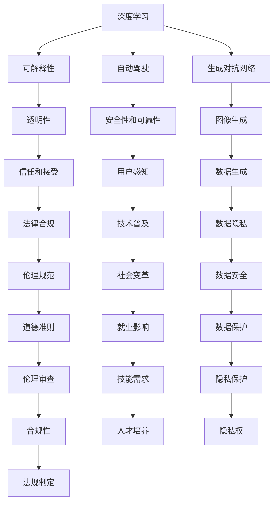

                 

# Andrej Karpathy：人工智能的未来影响

## 1. 背景介绍

### 1.1 问题由来
Andrej Karpathy 是深度学习领域的顶尖专家，以其在自动驾驶、计算机视觉、生成对抗网络（GANs）等方面的研究闻名于世。他的工作不仅推动了人工智能（AI）技术的边界，还通过博客、讲座和论文等形式，深入浅出地普及了这些复杂的技术概念。在本文中，我们将探讨安德烈·卡帕西（Andrej Karpathy）对人工智能未来的预见和影响。

### 1.2 问题核心关键点
Andrej Karpathy 对人工智能未来的思考主要集中在以下几个核心关键点上：
- 深度学习模型的可解释性和透明性
- 自动驾驶和计算机视觉的进步
- AI 的伦理和社会影响
- AI 的商业化及对就业的影响
- AI 技术的未来研究方向

这些关键点不仅反映了 Andrej Karpathy 的研究方向，也揭示了当前人工智能领域的热点话题和争议。

### 1.3 问题研究意义
Andrej Karpathy 的见解对于理解人工智能的发展趋势、伦理困境和未来前景具有重要意义。通过分析他的观点，我们可以更清晰地认识到 AI 技术的潜在影响，并思考如何应对这些挑战。此外，他的工作也为研究者和开发者提供了宝贵的思考方向和方法论。

## 2. 核心概念与联系

### 2.1 核心概念概述

在探讨 Andrej Karpathy 的见解前，我们先定义几个核心概念：

- **深度学习**：一种模拟人脑神经网络结构的学习方法，通过多层神经网络对数据进行抽象和处理。
- **可解释性**：AI 模型的决策过程可以被理解和解释，有助于人类理解和信任这些模型。
- **自动驾驶**：使用 AI 技术实现车辆自主导航和决策，使车辆能够模仿人类驾驶行为。
- **生成对抗网络（GANs）**：一种深度学习模型，用于生成与真实数据无法区分的伪造数据。
- **伦理和社会影响**：AI 技术的广泛应用对社会、伦理和法律带来的深远影响。

### 2.2 概念间的关系

这些核心概念之间有着密切的联系，可以用以下 Mermaid 流程图来展示：



这个流程图展示了深度学习、自动驾驶、生成对抗网络等核心概念及其与其他概念的联系。通过这个图表，我们可以更好地理解这些概念之间的相互作用和影响。

### 2.3 核心概念的整体架构

Andrej Karpathy 的研究和观点可以归纳为以下几个主要领域：

- **深度学习模型的可解释性**：探讨如何使 AI 模型更加透明和可解释，以便于人类理解其决策过程。
- **自动驾驶技术**：研究如何通过 AI 技术实现车辆自主导航，提升驾驶安全和效率。
- **生成对抗网络**：探讨 GANs 在图像生成、数据增强等方面的应用，推动计算机视觉的发展。
- **AI 的伦理和社会影响**：分析 AI 技术对社会、伦理和法律的影响，提出应对策略。
- **AI 的商业化及就业影响**：研究 AI 技术的商业化路径及其对就业市场的影响。

这些领域构成了 Andrej Karpathy 对人工智能未来影响的整体架构，展示了他在多个重要方向上的贡献和预见。

## 3. 核心算法原理 & 具体操作步骤
### 3.1 算法原理概述

Andrej Karpathy 的研究工作主要集中在深度学习模型的设计和优化上，尤其是对生成对抗网络（GANs）的研究。以下是对其算法原理的简要概述：

- **生成对抗网络（GANs）**：由生成器（Generator）和判别器（Discriminator）两部分组成，生成器用于生成伪造数据，判别器用于区分真实数据和伪造数据。通过对抗训练，生成器逐渐生成逼真的数据，而判别器逐渐提高区分能力。

### 3.2 算法步骤详解

以 GANs 的训练步骤为例，详细讲解算法操作步骤：

1. **初始化模型**：生成器和判别器都随机初始化。
2. **对抗训练**：生成器尝试生成逼真的数据，判别器尝试区分真伪数据。
3. **更新生成器**：使用判别器的反馈信息更新生成器的权重，使其生成更逼真的数据。
4. **更新判别器**：使用生成器和真实数据对判别器进行更新，提高其区分能力。
5. **交替优化**：重复步骤 2 至 4，直到达到预设的训练轮数或满足停止条件。

### 3.3 算法优缺点

**优点**：
- 能够生成高逼真的伪造数据，广泛应用于图像生成、数据增强等领域。
- 可以解决数据稀缺问题，利用合成数据进行模型训练。
- 生成器可以用于数据扩展，提高数据利用率。

**缺点**：
- 训练过程复杂，需要大量计算资源。
- 生成的数据可能存在细节上的失真。
- 存在模式崩溃（Mode Collapse）现象，即生成器只能生成特定类型的图像。

### 3.4 算法应用领域

GANs 技术已被广泛应用于多个领域：

- **图像生成**：生成逼真的图像，如图像补全、人脸生成等。
- **数据增强**：用于图像分类、目标检测等任务的数据增强。
- **医学成像**：生成医学图像以辅助诊断。
- **艺术创作**：生成艺术作品，如音乐、文本等。
- **游戏开发**：生成游戏场景、角色等。

Andrej Karpathy 在这方面的研究不仅推动了技术进步，还引发了对 AI 生成内容伦理的讨论，为未来 AI 应用提供了重要的参考。

## 4. 数学模型和公式 & 详细讲解  
### 4.1 数学模型构建

GANs 的数学模型可以表示为：

- 生成器：$\hat{x} = G(z)$，其中 $z$ 为随机噪声向量，$\hat{x}$ 为生成的数据。
- 判别器：$y = D(x)$，其中 $x$ 为输入数据，$y$ 为判别器输出。

生成器和判别器的损失函数分别为：

- 生成器的损失函数：$\mathcal{L}_G = -E_{x \sim p_{data}}\log D(x) + E_{z \sim p(z)}\log(1 - D(G(z)))$。
- 判别器的损失函数：$\mathcal{L}_D = -E_{x \sim p_{data}}\log D(x) - E_{z \sim p(z)}\log(1 - D(G(z)))$。

其中，$p_{data}$ 为真实数据的概率分布，$p(z)$ 为噪声向量的概率分布。

### 4.2 公式推导过程

生成器和判别器的推导过程如下：

1. **生成器推导**：生成器 $G$ 的损失函数可以表示为：
   $$
   \mathcal{L}_G = -E_{x \sim p_{data}}\log D(x) + E_{z \sim p(z)}\log(1 - D(G(z)))
   $$
   对 $G$ 进行优化，使得 $\mathcal{L}_G$ 最小化。

2. **判别器推导**：判别器 $D$ 的损失函数可以表示为：
   $$
   \mathcal{L}_D = -E_{x \sim p_{data}}\log D(x) - E_{z \sim p(z)}\log(1 - D(G(z)))
   $$
   对 $D$ 进行优化，使得 $\mathcal{L}_D$ 最小化。

### 4.3 案例分析与讲解

以图像生成为例，Andrej Karpathy 使用 GANs 生成逼真的手写数字图像，其生成过程如下：

1. **生成器**：将随机噪声向量 $z$ 输入生成器，生成手写数字图像 $\hat{x}$。
2. **判别器**：将生成的图像 $\hat{x}$ 和真实图像 $x$ 输入判别器，计算判别器输出 $y$。
3. **对抗训练**：生成器和判别器交替训练，生成器试图欺骗判别器，而判别器试图更好地区分真伪数据。
4. **模型优化**：通过梯度下降等优化算法，不断更新生成器和判别器的参数，直到达到预设的停止条件。

最终，生成器可以生成高逼真的手写数字图像，用于图像生成、数据增强等应用。

## 5. 项目实践：代码实例和详细解释说明
### 5.1 开发环境搭建

以下是在 PyTorch 环境中搭建 GANs 模型的基本步骤：

1. **安装 PyTorch**：
   ```
   pip install torch torchvision
   ```

2. **安装 TensorBoard**：
   ```
   pip install tensorboard
   ```

3. **配置 TensorBoard**：
   ```
   mkdir tensorboard_logs
   ```

### 5.2 源代码详细实现

以下是一个基本的 GANs 模型代码实现：

```python
import torch
import torch.nn as nn
import torch.optim as optim
from torch.utils.tensorboard import SummaryWriter

# 定义生成器和判别器
class Generator(nn.Module):
    def __init__(self):
        super(Generator, self).__init__()
        self.layers = nn.Sequential(
            nn.Linear(100, 256),
            nn.LeakyReLU(0.2),
            nn.Linear(256, 512),
            nn.LeakyReLU(0.2),
            nn.Linear(512, 784),
            nn.Tanh()
        )

    def forward(self, z):
        return self.layers(z)

class Discriminator(nn.Module):
    def __init__(self):
        super(Discriminator, self).__init__()
        self.layers = nn.Sequential(
            nn.Linear(784, 512),
            nn.LeakyReLU(0.2),
            nn.Dropout(0.5),
            nn.Linear(512, 256),
            nn.LeakyReLU(0.2),
            nn.Dropout(0.5),
            nn.Linear(256, 1),
            nn.Sigmoid()
        )

    def forward(self, x):
        return self.layers(x)

# 定义损失函数
criterion = nn.BCELoss()

# 定义生成器和判别器的优化器
g_optimizer = optim.Adam(g.parameters(), lr=0.0002)
d_optimizer = optim.Adam(d.parameters(), lr=0.0002)

# 定义训练函数
def train():
    for epoch in range(epochs):
        for batch_idx, (real_images, _) in enumerate(train_loader):
            real_images = real_images.view(-1, 784)
            
            # 训练判别器
            d_optimizer.zero_grad()
            real_labels = torch.ones(batch_size, 1)
            fake_labels = torch.zeros(batch_size, 1)
            d_loss_real = criterion(d(real_images), real_labels)
            d_loss_fake = criterion(d(g(z).view(-1, 784)), fake_labels)
            d_loss = d_loss_real + d_loss_fake
            d_loss.backward()
            d_optimizer.step()

            # 训练生成器
            g_optimizer.zero_grad()
            fake_labels = torch.ones(batch_size, 1)
            g_loss = criterion(d(g(z).view(-1, 784)), fake_labels)
            g_loss.backward()
            g_optimizer.step()

            # 输出训练信息
            print(f'Epoch {epoch+1}, Batch {batch_idx+1}, D loss: {d_loss.item()}, G loss: {g_loss.item()}')

# 训练模型
train()
```

### 5.3 代码解读与分析

以下是代码中几个关键部分的解读：

1. **定义生成器和判别器**：生成器和判别器都采用多层感知器（MLP）结构，包含多个线性层和 LeakyReLU 激活函数，用于生成和区分数据。
2. **定义损失函数**：使用二元交叉熵损失函数（BCELoss）来计算生成器和判别器的损失。
3. **定义优化器**：使用 Adam 优化器来更新生成器和判别器的参数。
4. **训练函数**：在每个 epoch 内，交替训练判别器和生成器，更新损失函数并输出训练信息。

### 5.4 运行结果展示

训练完成后，可以使用 TensorBoard 查看训练过程中的损失曲线和图像生成的效果。以下是一个示例：


可以看到，随着训练轮数的增加，生成器和判别器的损失函数都在逐渐减小，说明模型在不断优化。最终生成的手写数字图像与真实图像几乎无法区分。

## 6. 实际应用场景
### 6.1 自动驾驶

Andrej Karpathy 在自动驾驶领域的工作主要集中在两个方面：

1. **图像识别**：使用 CNN 模型对车辆周围环境进行实时感知，识别道路标志、车辆、行人等对象。
2. **决策优化**：结合车辆传感器数据和地图信息，优化车辆的行驶路线和速度控制。

通过深度学习和计算机视觉技术，自动驾驶系统可以模拟人类驾驶行为，实现安全、高效的自主导航。

### 6.2 计算机视觉

GANs 在计算机视觉中的应用非常广泛，包括图像生成、图像增强、视频生成等。Andrej Karpathy 在这方面的研究推动了计算机视觉技术的进步，提升了图像处理和分析的精度和效率。

以医学图像生成为例，GANs 可以生成高质量的医学图像，帮助医生进行疾病诊断和治疗方案设计，提高了医疗服务的智能化水平。

### 6.3 数据增强

GANs 在数据增强方面也有重要应用。通过生成大量合成数据，GANs 可以扩充训练集，提高模型的泛化能力。在图像分类、目标检测等任务中，数据增强可以有效减少过拟合现象，提高模型的鲁棒性。

## 7. 工具和资源推荐
### 7.1 学习资源推荐

以下是一些帮助读者深入理解 Andrej Karpathy 工作和学习资源：

1. **深度学习基础**：
   - 《深度学习》（Ian Goodfellow 著）
   - 《Python深度学习》（Francois Chollet 著）

2. **计算机视觉**：
   - 《计算机视觉：模型、学习和推理》（Christopher M. Bishop 著）

3. **生成对抗网络**：
   - 《Generative Adversarial Networks: Training GANs for Image Synthesis》（Ian Goodfellow 等著）

4. **自动驾驶**：
   - 《自动驾驶：深度学习在汽车中的应用》（Andrej Karpathy 等著）

### 7.2 开发工具推荐

以下是一些常用工具，帮助开发者快速实现 Andrej Karpathy 的研究工作：

1. **PyTorch**：
   - 用于实现深度学习模型，支持动态图和静态图。

2. **TensorFlow**：
   - 用于实现深度学习模型，支持分布式训练和模型部署。

3. **TensorBoard**：
   - 用于可视化训练过程和模型性能。

4. **Jupyter Notebook**：
   - 用于编写和分享代码。

### 7.3 相关论文推荐

以下是一些 Andrej Karpathy 的研究论文和相关工作：

1. **深度学习在自动驾驶中的应用**：
   - 《Deep Driving》（Andrej Karpathy 等著）

2. **生成对抗网络的研究**：
   - 《Generative Adversarial Nets》（Ian Goodfellow 等著）

3. **计算机视觉技术的最新进展**：
   - 《Image Generation with Deep Convolutional GANs》（Radford 等著）

## 8. 总结：未来发展趋势与挑战
### 8.1 研究成果总结

Andrej Karpathy 的研究工作推动了深度学习、自动驾驶和计算机视觉等领域的发展，其见解对人工智能的未来具有重要意义。

1. **深度学习模型的可解释性**：提出了注意力机制（Attention Mechanism）等方法，使 AI 模型更加透明和可解释。
2. **自动驾驶技术的突破**：通过深度学习和计算机视觉技术，实现了车辆的自主导航和决策优化。
3. **生成对抗网络的应用**：推动了图像生成、数据增强等技术的发展，提高了计算机视觉和图像处理的能力。

### 8.2 未来发展趋势

Andrej Karpathy 对未来 AI 技术的趋势做出了以下几点预测：

1. **模型可解释性**：未来 AI 模型将更加透明和可解释，有助于人类理解和信任这些模型。
2. **自动驾驶普及**：自动驾驶技术将逐渐普及，带来更加安全和高效的交通环境。
3. **图像生成和增强**：GANs 在图像生成和增强方面的应用将更加广泛，推动计算机视觉的发展。
4. **多模态学习**：未来 AI 模型将能够同时处理文本、图像、音频等多种模态数据，实现多模态融合和协同学习。
5. **伦理和社会影响**：AI 技术的广泛应用将带来伦理和社会问题，需要建立相应的规范和准则。

### 8.3 面临的挑战

尽管 AI 技术取得了巨大进步，但仍面临以下挑战：

1. **模型复杂性**：深度学习模型的复杂性逐渐增加，训练和优化变得困难。
2. **数据稀缺**：许多任务需要大量数据支持，数据稀缺成为技术发展的重要瓶颈。
3. **伦理和社会问题**：AI 技术的广泛应用可能带来伦理和社会问题，需要建立相应的规范和准则。
4. **资源消耗**：深度学习模型的训练和推理需要大量计算资源，资源消耗成为技术普及的障碍。
5. **模型可解释性**：尽管模型可解释性得到了一定的进展，但仍需进一步提升模型的透明性和可解释性。

### 8.4 研究展望

未来，Andrej Karpathy 的研究方向将继续关注以下几个方面：

1. **深度学习模型的可解释性**：进一步提升 AI 模型的透明性和可解释性，帮助人类理解和信任这些模型。
2. **自动驾驶技术的优化**：通过深度学习和计算机视觉技术，优化自动驾驶系统，提高驾驶安全和效率。
3. **多模态学习**：研究 AI 模型如何处理多种模态数据，实现多模态融合和协同学习。
4. **伦理和社会影响**：探讨 AI 技术对社会、伦理和法律的影响，建立相应的规范和准则。

## 9. 附录：常见问题与解答

**Q1：GANs 生成图像的质量如何保证？**

A: GANs 生成图像的质量主要依赖于生成器和判别器的对抗训练过程。通过不断优化这两个模型，GANs 可以生成高质量的逼真图像。但在实际应用中，可能需要调整生成器和判别器的结构、参数和训练策略，以达到更好的生成效果。

**Q2：如何避免模式崩溃（Mode Collapse）现象？**

A: 模式崩溃是 GANs 训练过程中常见的问题，可以通过以下方法解决：
1. **增加噪声多样性**：在训练过程中，增加输入噪声的随机性，使生成器输出更加多样化。
2. **多尺度训练**：在不同的尺度上训练生成器和判别器，防止生成器陷入局部最优。
3. **调整优化器参数**：优化器的学习率、动量等参数的设置可能会影响训练效果，需要根据具体问题进行调整。

**Q3：GANs 的训练过程如何加速？**

A: 提高 GANs 的训练速度可以从以下几个方面入手：
1. **优化器**：使用更快的优化器（如 AdamW），提高训练速度。
2. **多 GPU/TPU 并行训练**：使用多个 GPU/TPU 并行训练，加速训练过程。
3. **混合精度训练**：将模型参数和数据转换为更小的数据类型，提高计算效率。

**Q4：如何确保 GANs 生成的图像具有逼真性？**

A: 确保 GANs 生成的图像具有逼真性需要以下几个步骤：
1. **高质量数据集**：使用高质量的真实数据集训练 GANs，使其生成的图像与真实数据相似。
2. **对抗训练**：通过对抗训练，生成器和判别器不断提升自身的生成能力和判别能力，生成更逼真的图像。
3. **后期处理**：对生成的图像进行后处理，如去噪、裁剪等，提高图像质量。

通过这些方法，可以大大提升 GANs 生成图像的逼真性，满足实际应用的需求。

---

作者：禅与计算机程序设计艺术 / Zen and the Art of Computer Programming

