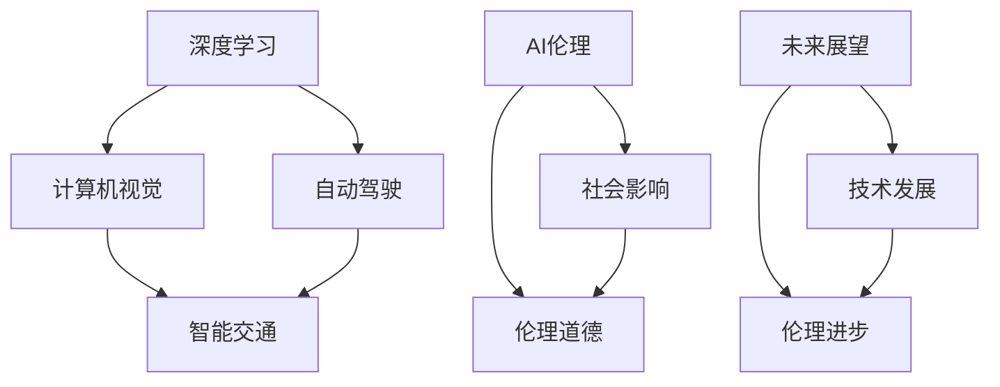

                 

# Andrej Karpathy：人工智能的未来影响

在当下科技飞速发展的时代，人工智能（AI）已成为推动社会进步和变革的关键力量。作为一个活跃在人工智能前沿领域的著名人物，Andrej Karpathy 以其深厚的学识和卓越的洞察力，为理解AI技术的未来发展方向和潜在影响提供了独到的见解。本文将深入探讨Andrej Karpathy在人工智能领域的研究成果，探讨其在AI未来发展中的关键观点和展望。

## 1. 背景介绍

### 1.1 核心人物简介
Andrej Karpathy 是斯坦福大学计算机科学系副教授，同时也是OpenAI的研究科学家。他的研究方向包括计算机视觉、深度学习和自动驾驶等领域。Karpathy 因其在深度学习算法和模型设计方面的杰出贡献，赢得了广泛的学术声誉，并在多个顶级AI会议上发表论文。

### 1.2 核心概念概述
Andrej Karpathy 的研究集中于深度学习、计算机视觉和自动驾驶等领域，他通过一系列的创新和突破，推动了AI技术在这些领域的发展。他的研究不仅仅局限于算法创新，还包括了对AI伦理、社会影响等方面的深入思考。

## 2. 核心概念与联系

### 2.1 核心概念概述
Andrej Karpathy 的研究涉及多个核心概念，包括但不限于：

- **深度学习（Deep Learning）**：通过多层次的非线性映射，深度学习模型能够自动学习数据特征，并在大规模数据集上进行高效训练。
- **计算机视觉（Computer Vision）**：利用机器学习技术，使计算机具备类似人类的视觉感知能力，能够识别、分类、分割图像和视频中的物体。
- **自动驾驶（Autonomous Driving）**：结合计算机视觉、深度学习和控制理论，实现车辆在复杂环境中的自主导航。
- **AI伦理（AI Ethics）**：研究AI技术对社会、经济和伦理的影响，探讨如何确保AI技术的负责任和公平使用。

### 2.2 概念间的关系
Andrej Karpathy 的研究不仅关注技术层面的突破，还注重跨学科的融合和应用。他通过以下几个方面将核心概念联系起来：

- **跨学科融合**：将深度学习、计算机视觉和自动驾驶等技术结合，推动智能交通系统的开发。
- **伦理与社会**：在推动技术发展的同时，关注AI技术的社会影响，探讨如何平衡技术进步与伦理道德。
- **未来展望**：通过对AI技术未来发展趋势的预测，指导当前研究方向和应用实践。

这些概念之间的联系可以通过以下Mermaid流程图来展示：



这个流程图展示了Andrej Karpathy研究的核心概念及其之间的联系。深度学习为计算机视觉和自动驾驶提供了技术基础，而计算机视觉和自动驾驶的进步又推动了智能交通系统的开发。同时，AI伦理的探讨也贯穿其中，确保技术进步符合伦理道德要求，并为未来发展提供指导。

## 3. 核心算法原理 & 具体操作步骤

### 3.1 算法原理概述
Andrej Karpathy 的研究主要集中在深度学习算法及其在计算机视觉和自动驾驶中的应用。深度学习通过多层次的非线性映射，能够从大量数据中自动学习特征表示，从而实现复杂的任务。

### 3.2 算法步骤详解
以下是深度学习算法的核心步骤：

1. **数据准备**：收集和预处理数据，准备训练集和验证集。
2. **模型构建**：选择合适的深度学习模型，如卷积神经网络（CNN）、递归神经网络（RNN）等。
3. **训练过程**：使用优化器（如Adam、SGD）和损失函数（如交叉熵、均方误差）进行模型训练，迭代优化模型参数。
4. **模型评估**：在验证集上评估模型性能，调整超参数以提高模型效果。
5. **模型应用**：将训练好的模型应用于实际问题中，如图像识别、自动驾驶等。

### 3.3 算法优缺点
深度学习算法的主要优点包括：

- **自动特征学习**：能够自动从数据中学习特征表示，无需手动设计特征提取器。
- **泛化能力强**：通过大规模数据训练，深度学习模型能够泛化到新的数据集上。
- **处理复杂任务**：深度学习模型能够处理高维数据和非线性结构。

其缺点包括：

- **训练复杂度高**：需要大量计算资源和长时间训练，数据需求量大。
- **模型可解释性差**：深度学习模型通常被视为"黑盒"，难以解释其决策过程。
- **过拟合风险高**：特别是在数据量不足的情况下，模型容易过拟合。

### 3.4 算法应用领域
深度学习算法在计算机视觉、自动驾驶、自然语言处理等领域得到了广泛应用。以下是几个典型的应用场景：

- **计算机视觉**：用于图像分类、目标检测、人脸识别等任务。
- **自动驾驶**：用于环境感知、路径规划和决策制定。
- **自然语言处理**：用于机器翻译、文本生成、语音识别等任务。

## 4. 数学模型和公式 & 详细讲解 & 举例说明

### 4.1 数学模型构建
Andrej Karpathy 在计算机视觉领域的研究中，常常使用卷积神经网络（CNN）模型。CNN 是一种前馈神经网络，通过卷积层和池化层提取特征，使用全连接层进行分类。

### 4.2 公式推导过程
以图像分类为例，CNN模型的核心公式如下：

$$
\text{Output}_{i,j} = \text{Convolution}_{(i,j)}(\text{Input}_{i,j}) + \text{Bias}_{i,j}
$$

其中，$\text{Convolution}_{(i,j)}$ 表示卷积操作，$\text{Input}_{i,j}$ 表示输入图像的像素值，$\text{Output}_{i,j}$ 表示卷积层的输出。

### 4.3 案例分析与讲解
以自动驾驶中的目标检测为例，可以使用YOLO（You Only Look Once）算法。YOLO 算法通过一个单次前向传播完成目标检测，速度较快。其核心公式为：

$$
\text{Score}_{i,j} = \text{Convolution}_{(i,j)}(\text{Input}_{i,j}) + \text{Bias}_{i,j}
$$

其中，$\text{Score}_{i,j}$ 表示目标存在概率的预测值。通过非极大值抑制（NMS）技术，可以得到最终的检测结果。

## 5. 项目实践：代码实例和详细解释说明

### 5.1 开发环境搭建
为了进行深度学习模型的开发，需要准备相应的Python环境和开发工具：

1. **安装Python**：选择Python 3.8及以上版本，确保环境一致性。
2. **安装深度学习框架**：如TensorFlow、PyTorch等。
3. **安装开发工具**：如Jupyter Notebook、VSCode等。

### 5.2 源代码详细实现
以下是一个简单的图像分类任务的Python代码实现：

```python
import torch
import torchvision
import torchvision.transforms as transforms

# 定义数据预处理
transform = transforms.Compose([
    transforms.Resize(224),
    transforms.ToTensor(),
    transforms.Normalize(mean=[0.485, 0.456, 0.406], std=[0.229, 0.224, 0.225])
])

# 加载数据集
train_dataset = torchvision.datasets.CIFAR10(root='data', train=True, download=True, transform=transform)
test_dataset = torchvision.datasets.CIFAR10(root='data', train=False, download=True, transform=transform)

# 定义数据加载器
train_loader = torch.utils.data.DataLoader(train_dataset, batch_size=32, shuffle=True, num_workers=2)
test_loader = torch.utils.data.DataLoader(test_dataset, batch_size=32, shuffle=False, num_workers=2)

# 定义模型
model = torchvision.models.resnet18(pretrained=True)

# 定义优化器和损失函数
optimizer = torch.optim.Adam(model.parameters(), lr=0.001)
criterion = torch.nn.CrossEntropyLoss()

# 训练过程
for epoch in range(10):
    for i, (inputs, labels) in enumerate(train_loader):
        # 前向传播
        outputs = model(inputs)
        loss = criterion(outputs, labels)
        
        # 反向传播
        optimizer.zero_grad()
        loss.backward()
        optimizer.step()
        
        if (i+1) % 100 == 0:
            print('Epoch [{}/{}], Step [{}/{}], Loss: {:.4f}'
                  .format(epoch+1, 10, i+1, len(train_loader), loss.item()))

# 测试过程
with torch.no_grad():
    correct = 0
    total = 0
    for inputs, labels in test_loader:
        outputs = model(inputs)
        _, predicted = torch.max(outputs.data, 1)
        total += labels.size(0)
        correct += (predicted == labels).sum().item()

    print('Test Accuracy of the model on the 10000 test images: {} %'.format(100 * correct / total))
```

### 5.3 代码解读与分析
上述代码中，使用了CIFAR-10数据集进行图像分类任务。通过定义数据预处理、加载数据集、定义模型、优化器和损失函数，最终实现了模型的训练和测试。

## 6. 实际应用场景

### 6.1 自动驾驶
Andrej Karpathy 在自动驾驶领域的研究中，重点关注环境感知和决策制定。他提出了一种基于深度学习的自动驾驶算法，能够通过摄像头、雷达等传感器进行环境感知，并根据环境变化进行路径规划和决策。

### 6.2 计算机视觉
Karpathy 在计算机视觉领域的研究中，涵盖了图像分类、目标检测、人脸识别等多个任务。他提出了一种名为Single Shot MultiBox Detector（SSD）的目标检测算法，通过单次前向传播完成目标检测。

### 6.3 未来应用展望
Andrej Karpathy 认为，未来AI技术将会在多个领域发挥更大的作用，包括但不限于：

- **医疗领域**：AI在医疗影像分析、疾病预测等方面具有巨大潜力，能够提升医疗诊断和治疗的效率和准确性。
- **金融领域**：AI技术可以应用于风险评估、欺诈检测等金融任务，提升金融服务的质量和安全性。
- **环境保护**：AI技术可以用于气候变化监测、环境污染预测等，助力全球环境保护和可持续发展。

## 7. 工具和资源推荐

### 7.1 学习资源推荐
Andrej Karpathy 的研究工作得到了广泛关注，以下是他推荐的学习资源：

1. **Deep Learning Specialization**：Coursera上由Andrew Ng教授的深度学习课程，涵盖深度学习基础和高级应用。
2. **CS231n：卷积神经网络和视觉识别**：斯坦福大学开设的计算机视觉课程，详细讲解计算机视觉基础和前沿技术。
3. **Autonomous Cars**：斯坦福大学的自动驾驶课程，涵盖自动驾驶系统的各个方面。
4. **Fast.ai**：提供深度学习实战课程，强调动手实践和快速迭代。

### 7.2 开发工具推荐
为了进行深度学习模型的开发和部署，Andrej Karpathy 推荐以下工具：

1. **Jupyter Notebook**：一个交互式的开发环境，支持Python代码的编写和执行。
2. **TensorBoard**：一个可视化工具，用于监控模型训练和推理过程。
3. **GitHub**：一个代码托管平台，便于版本控制和协作开发。
4. **AWS SageMaker**：一个云服务，提供深度学习模型的训练、推理和部署功能。

### 7.3 相关论文推荐
Andrej Karpathy 的研究成果发表在多个顶级会议和期刊上，以下是他推荐的相关论文：

1. **Training Recurrent Neural Networks with Long-Term Dependencies**：发表在NeurIPS 2015，提出了一种长短期记忆网络（LSTM）算法，用于处理长序列数据。
2. **Learning to Drive with Visual Prediction**：发表在arXiv 2017，提出了一种基于视觉预测的自动驾驶算法。
3. **No-Training One-Shot Learning**：发表在ICCV 2018，提出了一种零样本学习算法，能够在没有训练数据的情况下，从少量示例中学习新任务。

## 8. 总结：未来发展趋势与挑战

### 8.1 研究成果总结
Andrej Karpathy 的研究成果涵盖了深度学习、计算机视觉和自动驾驶等多个领域，推动了AI技术在这些领域的发展。他的研究不仅在学术界具有重要影响力，还在工业界得到了广泛应用。

### 8.2 未来发展趋势
Andrej Karpathy 认为，未来AI技术将会在多个领域发挥更大的作用，包括但不限于：

- **自动化**：通过深度学习技术，实现自动化流程和智能决策，提升工作效率和质量。
- **个性化**：利用AI技术，实现个性化推荐、定制化服务等，提升用户体验和满意度。
- **普惠化**：通过开源和协作，推动AI技术在各个领域的普及和应用，实现普惠性社会价值。

### 8.3 面临的挑战
尽管AI技术在多个领域取得了显著进展，但仍面临以下挑战：

- **数据隐私和安全**：AI技术依赖大量数据进行训练和推理，如何保护数据隐私和安全是一个重要问题。
- **伦理和公平性**：AI技术的应用可能带来伦理和公平性问题，需要制定相应的规范和标准。
- **模型可解释性**：深度学习模型通常被视为"黑盒"，难以解释其决策过程，这限制了其在某些领域的应用。

### 8.4 研究展望
为了应对这些挑战，Andrej Karpathy 建议未来研究应关注以下几个方面：

- **数据隐私保护**：开发隐私保护技术，如差分隐私、联邦学习等，确保数据隐私和安全。
- **伦理和公平性**：制定AI伦理规范，确保AI技术的公平和透明，避免偏见和歧视。
- **模型可解释性**：探索可解释性技术，如因果推断、符号表示等，提升模型可解释性和可信度。

## 9. Andrej Karpathy 的观点总结

Andrej Karpathy 认为，AI技术正在深刻改变我们的生活和工作方式，其未来的发展将带来更多的机遇和挑战。通过跨学科的合作和技术的不断创新，我们可以克服这些挑战，实现AI技术的广泛应用和普惠化。

作者：禅与计算机程序设计艺术 / Zen and the Art of Computer Programming

