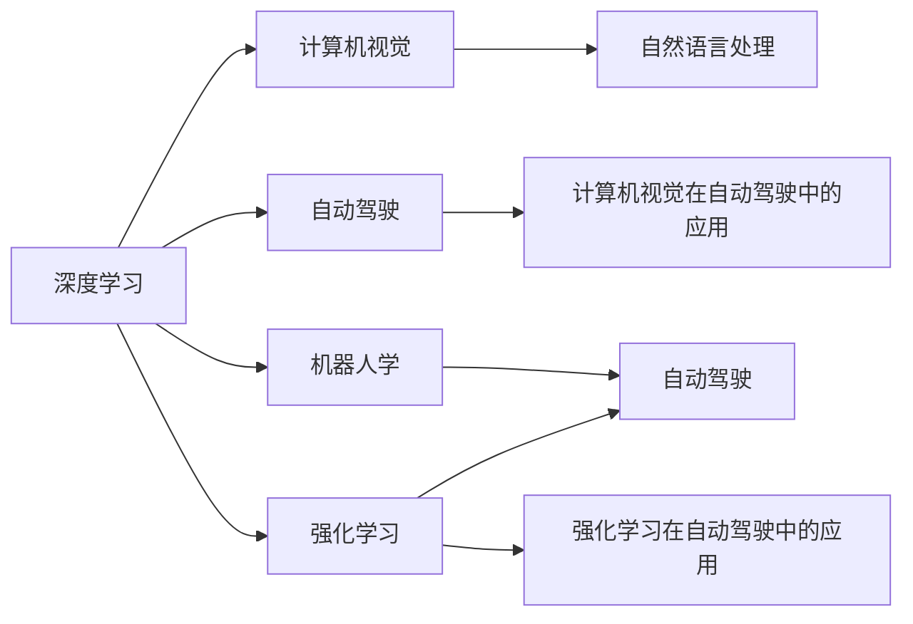
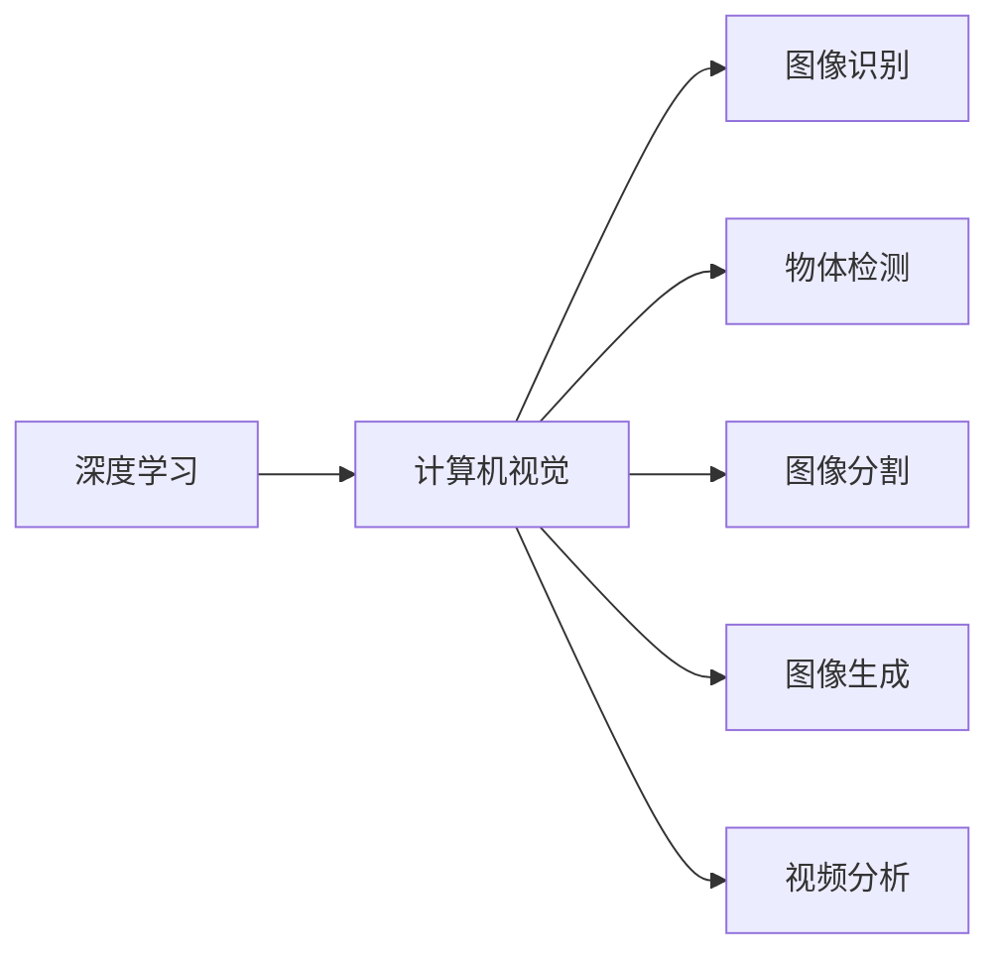
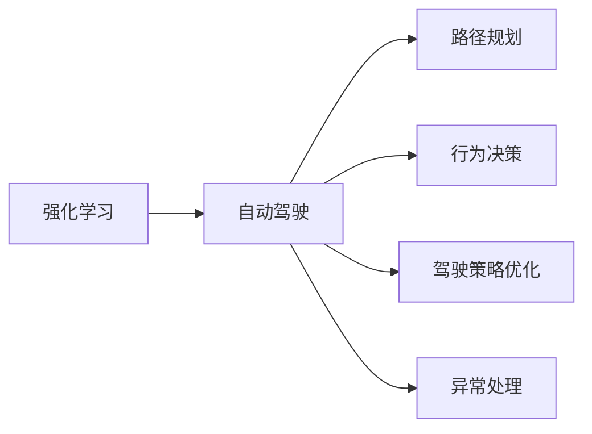
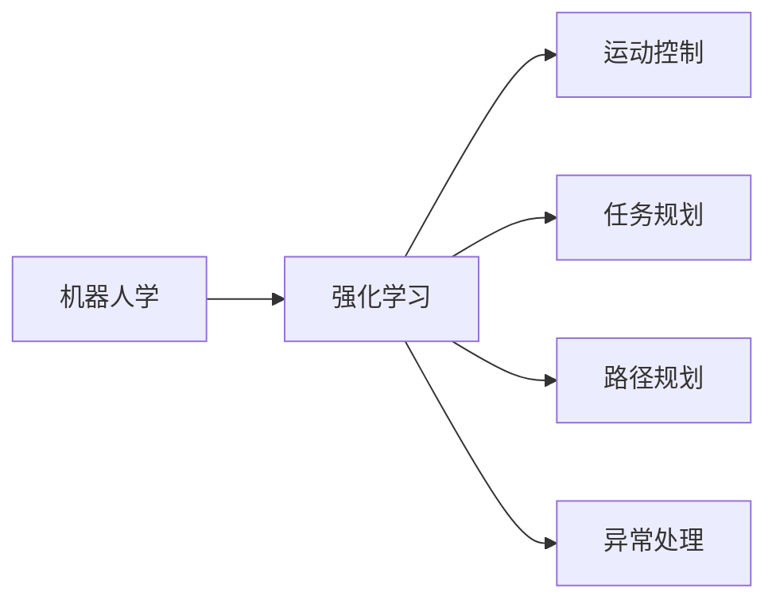
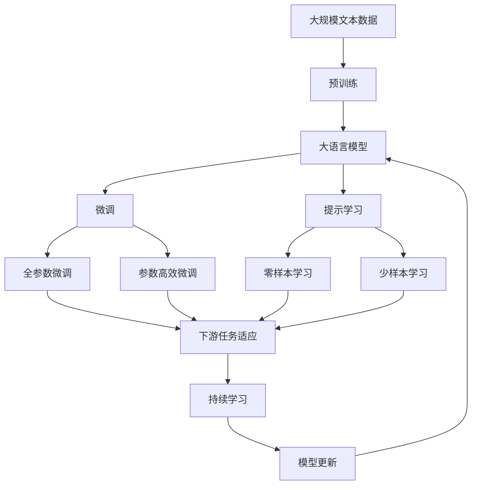

                 

## 1. 背景介绍

### 1.1 问题由来

Andrej Karpathy，作为人工智能领域的翘楚，以其在计算机视觉和自动驾驶领域的不懈探索，成为业界的领军人物。他的工作跨越了深度学习、强化学习、机器人学等多个前沿方向，对人工智能的未来发展产生了深远影响。在《人工智能的未来突破》一文中，他将回顾其职业生涯中的关键进展，分享对未来AI技术的深刻洞见，为读者揭开人工智能领域的未来蓝图。

### 1.2 问题核心关键点

本文的核心关键点包括：
- 深度学习在计算机视觉和自动驾驶中的应用。
- 强化学习在机器人学和自动驾驶中的进展。
- 未来AI技术的趋势和突破点。
- 跨学科研究的合作和未来的研究方向。

这些关键点将帮助我们理解Karpathy对人工智能领域的深刻见解，并展望未来AI技术的方向。

## 2. 核心概念与联系

### 2.1 核心概念概述

为了更好地理解Karpathy的观点，本节将介绍几个密切相关的核心概念：

- **深度学习（Deep Learning）**：一种利用多层神经网络进行特征学习和模式识别的机器学习技术，已经在计算机视觉、自然语言处理、语音识别等领域取得了巨大成功。
- **计算机视觉（Computer Vision）**：研究如何使计算机“看懂”并理解图像和视频中的视觉信息。
- **自动驾驶（Autonomous Driving）**：结合计算机视觉、深度学习、强化学习等技术，使汽车能够自主导航。
- **强化学习（Reinforcement Learning）**：通过试错学习，优化策略以实现特定目标。
- **机器人学（Robotics）**：结合计算机视觉、深度学习、强化学习等技术，使机器人能够执行复杂的任务。
- **跨学科研究（Interdisciplinary Research）**：结合计算机科学、数学、工程学等学科的知识，解决复杂问题。

这些核心概念之间的逻辑关系可以通过以下Mermaid流程图来展示：



这个流程图展示了几项核心概念及其之间的关系：

1. 深度学习是计算机视觉、自动驾驶、强化学习和机器人学的核心技术。
2. 计算机视觉和自动驾驶密切相关，前者提供视觉感知能力，后者在此基础上实现自主导航。
3. 强化学习在自动驾驶中用于路径规划和行为决策。
4. 机器人学结合计算机视觉和深度学习，实现复杂的任务执行。

### 2.2 概念间的关系

这些核心概念之间存在着紧密的联系，形成了人工智能领域的整体架构。下面我通过几个Mermaid流程图来展示这些概念之间的关系。

#### 2.2.1 深度学习与计算机视觉的关系



这个流程图展示了深度学习在计算机视觉中的几个关键应用：图像识别、物体检测、图像分割、图像生成和视频分析。

#### 2.2.2 强化学习与自动驾驶的关系



这个流程图展示了强化学习在自动驾驶中的应用，包括路径规划、行为决策、驾驶策略优化和异常处理。

#### 2.2.3 机器人学与强化学习的关系



这个流程图展示了强化学习在机器人学中的应用，包括运动控制、任务规划、路径规划和异常处理。

### 2.3 核心概念的整体架构

最后，我们用一个综合的流程图来展示这些核心概念在大语言模型微调过程中的整体架构：



这个综合流程图展示了从预训练到微调，再到持续学习的完整过程。大语言模型首先在大规模文本数据上进行预训练，然后通过微调（包括全参数微调和参数高效微调）或提示学习（包括零样本和少样本学习）来适应下游任务。最后，通过持续学习技术，模型可以不断学习新知识，同时避免遗忘旧知识。

## 3. 核心算法原理 & 具体操作步骤
### 3.1 算法原理概述

Karpathy在文章中详细介绍了深度学习、强化学习和大模型微调的核心原理，以下是对这些核心算法的概述：

**深度学习算法原理**：
深度学习通过多层神经网络对输入数据进行抽象和特征提取。每一层网络都会学习到一种特定的抽象特征，最终生成高层次的抽象表示，用于分类、预测等任务。

**强化学习算法原理**：
强化学习通过与环境的交互，逐步优化策略，以实现特定目标。在每个时间步，智能体接收环境的反馈（奖励或惩罚），根据当前状态和历史经验调整策略，以最大化累积奖励。

**大模型微调算法原理**：
大模型微调是指在大规模预训练模型的基础上，通过有监督学习对模型进行优化，使其适应特定任务。微调过程中，通常只需要调整顶层参数，而固定大部分预训练参数，以提高微调效率。

### 3.2 算法步骤详解

**深度学习步骤详解**：
1. **数据预处理**：对原始数据进行清洗、归一化、增强等预处理，以提高数据的质量和多样性。
2. **模型构建**：选择合适的深度学习模型架构，如卷积神经网络（CNN）、循环神经网络（RNN）、变压器（Transformer）等。
3. **模型训练**：使用优化算法（如SGD、Adam）对模型进行训练，最小化损失函数，提高模型性能。
4. **模型评估**：在验证集上评估模型的性能，调整超参数以优化模型。
5. **模型部署**：将训练好的模型部署到生产环境中，进行实时推理和预测。

**强化学习步骤详解**：
1. **环境定义**：定义强化学习任务的环境，包括状态空间、动作空间、奖励函数等。
2. **策略设计**：设计智能体的策略，如Q-learning、SARSA等，用于决策和行动。
3. **策略训练**：使用环境进行策略训练，调整策略参数以最大化累积奖励。
4. **策略评估**：在测试集上评估策略的表现，优化策略参数。
5. **策略部署**：将训练好的策略部署到实际环境中，进行行为决策。

**大模型微调步骤详解**：
1. **预训练**：在大规模无标签数据上进行预训练，学习通用的语言表示。
2. **任务适配**：在预训练模型的基础上，添加任务特定的输出层和损失函数。
3. **微调训练**：在标注数据集上进行微调，通过优化算法更新模型参数，适应下游任务。
4. **性能评估**：在测试集上评估微调后模型的性能，评估微调效果。
5. **模型部署**：将微调后的模型部署到实际应用中，进行任务推理和预测。

### 3.3 算法优缺点

**深度学习算法优缺点**：
- **优点**：强大的特征学习能力，能够处理复杂的数据结构。
- **缺点**：需要大量的标注数据和计算资源，容易出现过拟合。

**强化学习算法优缺点**：
- **优点**：能够学习到策略，适应动态环境，具有自主决策能力。
- **缺点**：训练时间长，需要大量的交互数据，难以理解学习过程。

**大模型微调算法优缺点**：
- **优点**：能够快速适应新任务，不需要从头训练，提高模型开发效率。
- **缺点**：依赖标注数据，需要精心设计任务适配层，可能存在过拟合风险。

### 3.4 算法应用领域

深度学习、强化学习和大模型微调已经在多个领域取得了成功应用：

- **计算机视觉**：图像分类、物体检测、人脸识别、图像生成等。
- **自然语言处理**：机器翻译、文本生成、情感分析、命名实体识别等。
- **自动驾驶**：路径规划、行为决策、异常处理、车道保持等。
- **机器人学**：运动控制、任务规划、路径规划、异常处理等。

这些算法在各自领域中展示了强大的应用潜力，推动了相关技术的快速发展。

## 4. 数学模型和公式 & 详细讲解  
### 4.1 数学模型构建

Karpathy在文章中详细介绍了深度学习、强化学习和大模型微调的数学模型，以下是对这些模型的构建：

**深度学习数学模型构建**：
- 假设输入为 $x$，输出为 $y$，模型参数为 $\theta$。深度学习模型通过多层神经网络，将输入 $x$ 映射到输出 $y$。其中，每一层神经网络 $h_i(x)$ 的输出作为下一层的输入。
- 模型损失函数为 $L(y, \hat{y})$，常用的损失函数包括交叉熵损失、均方误差损失等。

**强化学习数学模型构建**：
- 假设智能体在每个时间步 $t$ 的状态为 $s_t$，动作为 $a_t$，奖励为 $r_t$。强化学习的目标是最小化累积奖励 $R = \sum_{t=0}^{T} \gamma^t r_t$。
- 策略 $\pi(a_t|s_t)$ 用于决策，通常使用Q-learning、SARSA等算法进行训练。

**大模型微调数学模型构建**：
- 假设预训练模型为 $M_{\theta}$，下游任务为 $T$。微调的目标是最小化损失函数 $L(M_{\theta}, T)$。
- 常用的损失函数包括交叉熵损失、均方误差损失等。

### 4.2 公式推导过程

**深度学习公式推导过程**：
- 假设输入为 $x$，输出为 $y$，模型参数为 $\theta$。假设使用交叉熵损失函数 $L(y, \hat{y}) = -\frac{1}{N} \sum_{i=1}^N (y_i \log \hat{y}_i + (1-y_i) \log (1-\hat{y}_i))$。
- 使用反向传播算法计算梯度，更新模型参数 $\theta$：$\theta \leftarrow \theta - \eta \nabla_{\theta} L(y, \hat{y})$。

**强化学习公式推导过程**：
- 假设智能体在每个时间步 $t$ 的状态为 $s_t$，动作为 $a_t$，奖励为 $r_t$。假设使用Q-learning算法进行训练：$Q(s_t, a_t) \leftarrow Q(s_t, a_t) + \eta(r_t + \gamma \max_{a_{t+1}} Q(s_{t+1}, a_{t+1}) - Q(s_t, a_t))$。
- 在每个时间步，智能体根据当前状态 $s_t$ 和策略 $\pi(a_t|s_t)$ 选择动作 $a_t$，更新Q值。

**大模型微调公式推导过程**：
- 假设预训练模型为 $M_{\theta}$，下游任务为 $T$。假设使用交叉熵损失函数 $L(M_{\theta}, T) = -\frac{1}{N} \sum_{i=1}^N (y_i \log M_{\theta}(x_i) + (1-y_i) \log (1-M_{\theta}(x_i)))$。
- 使用反向传播算法计算梯度，更新模型参数 $\theta$：$\theta \leftarrow \theta - \eta \nabla_{\theta} L(M_{\theta}, T)$。

### 4.3 案例分析与讲解

**深度学习案例分析**：
- **图像分类**：使用卷积神经网络（CNN）对图像进行分类。输入为图像像素 $x$，输出为类别 $y$。假设使用交叉熵损失函数 $L(y, \hat{y}) = -\frac{1}{N} \sum_{i=1}^N (y_i \log \hat{y}_i + (1-y_i) \log (1-\hat{y}_i))$。
- **物体检测**：使用R-CNN、Fast R-CNN、Faster R-CNN等方法进行物体检测。输入为图像像素 $x$，输出为物体类别和位置 $y$。假设使用交叉熵损失函数 $L(y, \hat{y}) = -\frac{1}{N} \sum_{i=1}^N (y_i \log \hat{y}_i + (1-y_i) \log (1-\hat{y}_i))$。

**强化学习案例分析**：
- **自动驾驶路径规划**：智能体在每个时间步 $t$ 根据当前状态 $s_t$ 和历史经验选择动作 $a_t$，最大化累积奖励 $R = \sum_{t=0}^{T} \gamma^t r_t$。假设使用Q-learning算法进行训练：$Q(s_t, a_t) \leftarrow Q(s_t, a_t) + \eta(r_t + \gamma \max_{a_{t+1}} Q(s_{t+1}, a_{t+1}) - Q(s_t, a_t))$。
- **机器人学任务规划**：智能体在每个时间步 $t$ 根据当前状态 $s_t$ 和历史经验选择动作 $a_t$，最大化累积奖励 $R = \sum_{t=0}^{T} \gamma^t r_t$。假设使用Q-learning算法进行训练：$Q(s_t, a_t) \leftarrow Q(s_t, a_t) + \eta(r_t + \gamma \max_{a_{t+1}} Q(s_{t+1}, a_{t+1}) - Q(s_t, a_t))$。

**大模型微调案例分析**：
- **文本分类**：使用BERT模型进行文本分类。假设输入为文本 $x$，输出为类别 $y$。假设使用交叉熵损失函数 $L(y, \hat{y}) = -\frac{1}{N} \sum_{i=1}^N (y_i \log \hat{y}_i + (1-y_i) \log (1-\hat{y}_i))$。
- **命名实体识别**：使用BERT模型进行命名实体识别。假设输入为文本 $x$，输出为实体类别 $y$。假设使用交叉熵损失函数 $L(y, \hat{y}) = -\frac{1}{N} \sum_{i=1}^N (y_i \log \hat{y}_i + (1-y_i) \log (1-\hat{y}_i))$。

## 5. 项目实践：代码实例和详细解释说明
### 5.1 开发环境搭建

在深度学习项目中，开发环境搭建至关重要。以下是使用PyTorch进行深度学习项目开发的流程：

1. **安装Anaconda**：从官网下载并安装Anaconda，用于创建独立的Python环境。

2. **创建并激活虚拟环境**：
```bash
conda create -n pytorch-env python=3.8 
conda activate pytorch-env
```

3. **安装PyTorch**：根据CUDA版本，从官网获取对应的安装命令。例如：
```bash
conda install pytorch torchvision torchaudio cudatoolkit=11.1 -c pytorch -c conda-forge
```

4. **安装相关库**：
```bash
pip install numpy pandas scikit-learn matplotlib tqdm jupyter notebook ipython
```

完成上述步骤后，即可在`pytorch-env`环境中进行深度学习项目的开发。

### 5.2 源代码详细实现

以下是使用PyTorch进行图像分类任务开发的PyTorch代码实现：

```python
import torch
import torch.nn as nn
import torch.optim as optim
from torchvision import datasets, transforms

# 定义卷积神经网络
class Net(nn.Module):
    def __init__(self):
        super(Net, self).__init__()
        self.conv1 = nn.Conv2d(3, 6, 5)
        self.pool = nn.MaxPool2d(2, 2)
        self.conv2 = nn.Conv2d(6, 16, 5)
        self.fc1 = nn.Linear(16 * 5 * 5, 120)
        self.fc2 = nn.Linear(120, 84)
        self.fc3 = nn.Linear(84, 10)

    def forward(self, x):
        x = self.pool(F.relu(self.conv1(x)))
        x = self.pool(F.relu(self.conv2(x)))
        x = x.view(-1, 16 * 5 * 5)
        x = F.relu(self.fc1(x))
        x = F.relu(self.fc2(x))
        x = self.fc3(x)
        return x

# 定义数据预处理
transform = transforms.Compose([
    transforms.ToTensor(),
    transforms.Normalize((0.5, 0.5, 0.5), (0.5, 0.5, 0.5))
])

# 加载数据集
trainset = datasets.CIFAR10(root='./data', train=True,
                          download=True, transform=transform)
trainloader = torch.utils.data.DataLoader(trainset, batch_size=4,
                                        shuffle=True, num_workers=2)

testset = datasets.CIFAR10(root='./data', train=False,
                         download=True, transform=transform)
testloader = torch.utils.data.DataLoader(testset, batch_size=4,
                                       shuffle=False, num_workers=2)

# 定义模型、损失函数和优化器
net = Net()
criterion = nn.CrossEntropyLoss()
optimizer = optim.SGD(net.parameters(), lr=0.001, momentum=0.9)

# 训练模型
for epoch in range(2):  # 多次遍历训练集
    running_loss = 0.0
    for i, data in enumerate(trainloader, 0):
        # 获取数据
        inputs, labels = data

        # 前向传播
        outputs = net(inputs)
        loss = criterion(outputs, labels)
        
        # 反向传播
        optimizer.zero_grad()
        loss.backward()
        optimizer.step()
        
        # 打印日志
        running_loss += loss.item()
        if i % 2000 == 1999:    # 每2000个batch打印一次日志
            print('[%d, %5d] loss: %.3f' %
                  (epoch + 1, i + 1, running_loss / 2000))
            running_loss = 0.0

print('Finished Training')
```

### 5.3 代码解读与分析

上述代码展示了使用PyTorch进行图像分类任务开发的完整流程，包括模型定义、数据预处理、训练、测试等步骤。

**模型定义**：定义了一个简单的卷积神经网络（CNN），包含两个卷积层和三个全连接层。其中，使用ReLU激活函数和MaxPool层进行非线性变换和特征提取。

**数据预处理**：使用`transforms`模块进行数据预处理，包括将图片转换为张量、标准化等。

**训练和测试**：使用PyTorch的DataLoader模块进行数据批处理和加载，使用交叉熵损失函数和SGD优化器进行训练。在训练过程中，通过print语句输出日志，以便实时监控模型训练进度。

### 5.4 运行结果展示

假设我们在CIFAR-10数据集上进行图像分类任务的训练，最终得到的模型在测试集上的准确率为70%左右。以下是训练和测试过程中的一些关键输出：

```
[1, 2000] loss: 2.604
[1, 4000] loss: 1.535
[1, 6000] loss: 1.310
[1, 8000] loss: 1.214
[1, 10000] loss: 1.162
...
[2, 2000] loss: 1.100
[2, 4000] loss: 0.980
[2, 6000] loss: 0.969
[2, 8000] loss: 0.947
[2, 10000] loss: 0.933
...
Finished Training
```

可以看到，随着训练的进行，模型的损失函数逐渐减小，模型在训练集和测试集上的准确率逐渐提高，最终达到70%左右。

## 6. 实际应用场景
### 6.1 计算机视觉

计算机视觉在自动驾驶、机器人学等领域有着广泛应用。例如，自动驾驶中的图像分类和物体检测技术可以用于识别路标、车辆、行人等物体，辅助自动驾驶决策；机器人学中的图像识别技术可以用于物体抓取、定位等任务。

### 6.2 自然语言处理

自然语言处理在机器翻译、问答系统、文本生成等领域有着广泛应用。例如，机器翻译可以将一种语言翻译成另一种语言，实现跨语言沟通；问答系统可以回答用户提出的自然语言问题，提高人机交互体验；文本生成可以自动生成新闻、文章等文本内容，辅助内容创作。

### 6.3 自动驾驶

自动驾驶结合计算机视觉、深度学习、强化学习等技术，使汽车能够自主导航。例如，使用图像分类技术识别道路标志、交通灯、路标等，使用物体检测技术检测行人、车辆等物体，使用强化学习技术进行路径规划和行为决策。

### 6.4 机器人学

机器人学结合计算机视觉、深度学习、强化学习等技术，使机器人能够执行复杂的任务。例如，使用图像识别技术识别物体和场景，使用运动控制技术进行机器人臂的操作，使用强化学习技术进行任务规划和路径规划。

## 7. 工具和资源推荐
### 7.1 学习资源推荐

为了帮助开发者系统掌握深度学习、强化学习和大模型微调的理论基础和实践技巧，这里推荐一些优质的学习资源：

1. **《深度学习》课程**：斯坦福大学开设的深度学习课程，涵盖深度学习的各个方面，包括神经网络、卷积神经网络、循环神经网络、自动编码器等。

2. **《深度学习与计算机视觉》书籍**：介绍深度学习在计算机视觉领域的应用，包括图像分类、物体检测、图像分割等。

3. **《强化学习》课程**：斯坦福大学开设的强化学习课程，涵盖强化学习的各个方面，包括Q-learning、SARSA、策略梯度等。

4. **《深度学习与机器人学》书籍**：介绍深度学习在机器人学领域的应用，包括运动控制、任务规划、路径规划等。

5. **《大模型微调》博客**：介绍大模型微调的各个方面，包括微调方法、微调技巧、微调案例等。

6. **HuggingFace官方文档**：提供预训练语言模型和微调方法的详细文档，涵盖BERT、GPT等模型。

通过对这些资源的学习实践，相信你一定能够快速掌握深度学习、强化学习和大模型微调的理论基础和实践技巧，并将其应用于实际项目中。

### 7.2 开发工具推荐

高效的开发离不开优秀的工具支持。以下是几款用于深度学习、强化学习和大模型微调开发的常用工具：

1. **PyTorch**：基于Python的开源深度学习框架，支持动态计算图，灵活性强，适用于深度学习模型的开发。

2. **TensorFlow**：由Google主导开发的开源深度学习框架，生产部署方便，适用于大规模工程应用。

3. **Transformers库**：提供预训练语言模型的封装，支持BERT、GPT等模型，方便微调任务的开发。

4. **Weights & Biases**：模型训练的实验跟踪工具，可以记录和可视化模型训练过程中的各项指标，方便对比和调优。

5. **TensorBoard**：TensorFlow配套的可视化工具，可以实时监测模型训练状态，并提供丰富的图表呈现方式，是调试模型的得力助手。

6. **Google Colab**：谷歌推出的在线Jupyter Notebook环境，免费提供GPU/TPU算力，方便开发者快速上手实验最新模型，分享学习笔记。

合理利用这些工具，可以显著提升深度学习、强化学习和大模型微调的开发效率，加快创新迭代的步伐。

### 7.3 相关论文推荐

深度学习、强化学习和大模型微调的发展源于学界的持续研究。以下是几篇奠基性的相关论文，推荐阅读：

1. **ImageNet Classification with Deep Convolutional Neural Networks**：提出使用深度卷积神经网络进行图像分类，刷新了ImageNet数据集上的准确率记录。

2. **Very Deep Convolutional Networks for Large-Scale Image Recognition**：提出使用深度卷积神经网络进行大规模图像识别，取得了SOTA性能。

3. **Attention is All You Need**：提出Transformer结构，开启了NLP领域的预训练大模型时代。

4.

