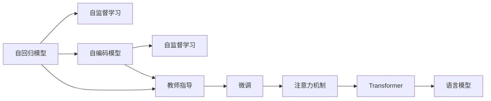
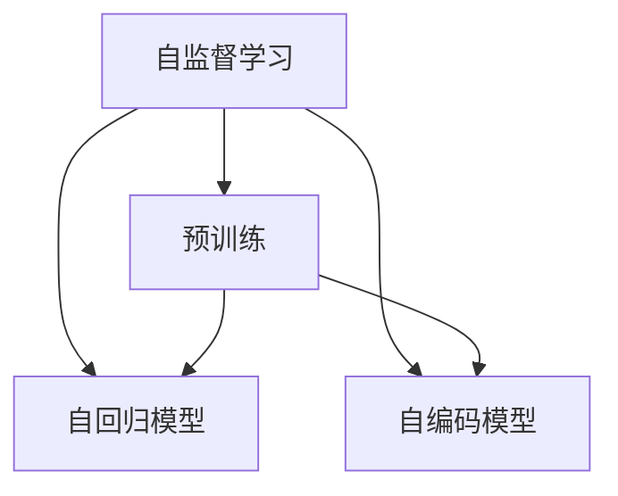
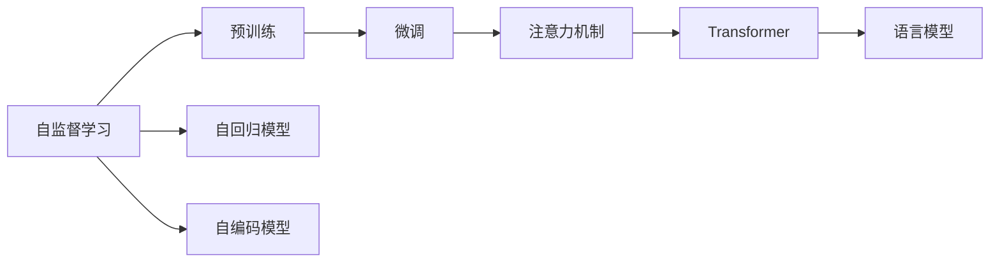
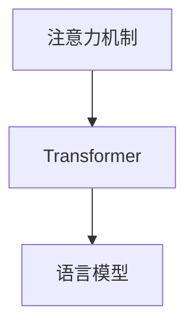

                 

# Andrej Karpathy：语言模型的训练

## 1. 背景介绍

Andrej Karpathy，作为OpenAI和UC Berkeley的知名AI专家，其关于深度学习的见解广受认可，尤其在自然语言处理(NLP)领域有深刻洞见。他的研究跨越多个技术领域，涵盖从自监督学习到生成模型，再到强化学习等众多方向，引领着人工智能研究的未来趋势。本文将深入解析Andrej Karpathy提出的语言模型训练方法，探讨其核心理念和具体实现，并通过实例说明其在实际应用中的成效。

### 1.1 问题由来

现代深度学习中的语言模型，主要是基于自回归或自编码框架。自回归模型如LSTM、GRU等，通过逐个时间步的建模，可以较好地捕捉文本中的序列信息；自编码模型如BERT、GPT-3等，则直接通过对比预测概率分布，学习到单词和句子级别的分布式表示。

然而，语言模型的训练一直面临着数据稀疏性和训练速度两大难题。数据稀疏性意味着在训练过程中，模型可能无法充分利用所有数据；而训练速度则受限于模型规模和计算资源。Andrej Karpathy的研究，通过创新性的方法，有效解决了这些问题，推动了语言模型的发展。

## 2. 核心概念与联系

### 2.1 核心概念概述

本文将讨论Andrej Karpathy关于语言模型训练的核心概念，主要包括：

- **自回归模型**：如LSTM、GRU等，通过逐个时间步的建模，可以较好地捕捉文本中的序列信息。
- **自编码模型**：如BERT、GPT-3等，通过对比预测概率分布，学习到单词和句子级别的分布式表示。
- **自监督学习**：利用无标签数据，通过构建自回归或自编码任务进行模型预训练。
- **教师指导**：通过给模型提供有标签的训练数据，引导模型进行微调，提升特定任务性能。
- **注意力机制**：如Transformer的Self-Attention机制，使得模型能够关注输入中的关键部分，增强上下文理解能力。

这些概念通过以下Mermaid流程图展示其联系：



通过这个流程图，可以看到自回归模型和自编码模型都是通过自监督学习进行预训练，然后通过教师指导（即微调）将模型调整到特定任务上，引入注意力机制进一步提升模型性能。最终构建的语言模型能够处理多种NLP任务。

### 2.2 概念间的关系

这些核心概念之间存在着紧密的联系，形成了一个从预训练到微调的语言模型训练框架。我们通过以下几个Mermaid流程图进一步说明它们之间的关系：

#### 2.2.1 自监督学习与预训练模型



自监督学习通过无标签数据，预训练自回归和自编码模型，形成强大的语义表示。

#### 2.2.2 教师指导与微调



预训练的模型通过教师指导（微调），引入注意力机制等技术，构建出高效的语言模型。

#### 2.2.3 自回归与自编码的联合使用


自回归模型和自编码模型可以联合使用，互相补充，提升模型的语言表示能力。

#### 2.2.4 注意力机制与Transformer



注意力机制是Transformer的核心，使得模型能够更加高效地处理长序列数据，构建高效的语义表示。

## 3. 核心算法原理 & 具体操作步骤

### 3.1 算法原理概述

Andrej Karpathy提出的语言模型训练方法，主要围绕以下三个核心算法：自监督预训练、教师指导微调和注意力机制。下面我们将逐一介绍这些算法的原理。

#### 3.1.1 自监督预训练

自监督预训练是指在无标签数据上，通过自回归或自编码任务进行模型的预训练。其核心思想是通过构建一些无标签但能够提供语言规律的训练任务，使得模型学习到语言的分布式表示。

#### 3.1.2 教师指导微调

在预训练完成后，模型需要通过教师指导（微调）来适应特定任务。这一过程主要是通过有标签的训练数据进行微调，调整模型的输出层和相关参数，使其能够更好地处理目标任务。

#### 3.1.3 注意力机制

注意力机制通过引入注意力权重，使得模型能够动态关注输入序列中的关键部分，提升模型对长序列的处理能力。这一机制在Transformer中得到广泛应用，显著提高了模型的上下文理解能力。

### 3.2 算法步骤详解

#### 3.2.1 自监督预训练

1. **数据准备**：收集大规模无标签文本数据，如维基百科、新闻网站等。
2. **模型初始化**：选择适当的模型架构，如LSTM、GRU或Transformer，进行随机初始化。
3. **任务构建**：根据自回归或自编码任务，设计预训练任务，如掩码语言模型、预测下一个单词等。
4. **训练模型**：利用无标签数据进行预训练，最小化预训练损失函数，更新模型参数。
5. **模型保存**：保存预训练模型，用于后续微调。

#### 3.2.2 教师指导微调

1. **数据准备**：收集目标任务的标注数据，如情感分类、命名实体识别等。
2. **模型加载**：加载预训练模型，作为微调任务的初始化参数。
3. **任务适配**：设计微调任务的适配层，如输出层和损失函数。
4. **模型微调**：利用有标签数据进行微调，最小化微调损失函数，更新模型参数。
5. **模型评估**：在验证集和测试集上评估微调模型的性能，调整超参数。

#### 3.2.3 注意力机制

1. **模型结构设计**：引入Transformer等架构，设计注意力权重计算方式。
2. **模型训练**：在预训练和微调过程中，动态更新注意力权重，提升模型性能。
3. **模型评估**：在特定任务上评估模型性能，如机器翻译、文本摘要等。

### 3.3 算法优缺点

Andrej Karpathy提出的语言模型训练方法具有以下优点：

- **高效性**：自监督预训练和微调过程能够在无标签数据和少量标注数据下高效进行，大大降低了训练成本。
- **通用性**：预训练模型能够在多种NLP任务上通用，只需微调特定任务所需的适配层即可。
- **灵活性**：注意力机制使得模型能够动态关注输入中的关键部分，提升模型的上下文理解能力。

同时，这些方法也存在一些缺点：

- **数据依赖**：自监督预训练和微调过程依赖于高质量的训练数据，数据稀疏性问题难以完全解决。
- **计算资源需求高**：大规模预训练和微调过程需要大量计算资源，尤其是在训练大模型时。
- **模型复杂性**：注意力机制和Transformer架构较为复杂，需要更深入的理解和调试。

### 3.4 算法应用领域

Andrej Karpathy提出的语言模型训练方法，已在多个NLP应用领域得到广泛应用，包括：

- **文本分类**：如情感分类、主题分类等。通过微调预训练模型，适应特定任务的文本分类。
- **命名实体识别**：识别文本中的人名、地名、机构名等特定实体。通过微调预训练模型，提高识别准确率。
- **机器翻译**：将源语言文本翻译成目标语言。通过微调预训练模型，适应语言转换任务。
- **文本摘要**：将长文本压缩成简短摘要。通过微调预训练模型，提高摘要生成效果。
- **对话系统**：使机器能够与人自然对话。通过微调预训练模型，实现自动回复。

## 4. 数学模型和公式 & 详细讲解 & 举例说明

### 4.1 数学模型构建

Andrej Karpathy提出的语言模型训练方法，主要基于自监督预训练、教师指导微调和注意力机制。其核心数学模型和公式如下：

#### 4.1.1 自监督预训练

在自监督预训练中，我们利用无标签数据进行模型训练，目标是最大化预测概率。以掩码语言模型为例，其训练目标为：

$$
\max_{\theta} \mathcal{L}(\theta; X)
$$

其中 $\theta$ 为模型参数，$X$ 为输入文本，$\mathcal{L}$ 为损失函数，通常使用负对数似然损失。训练过程通过最小化预测概率与真实标签的差距进行：

$$
\min_{\theta} -\frac{1}{N} \sum_{i=1}^N \log p_{\theta}(x_i)
$$

其中 $p_{\theta}(x_i)$ 为模型在输入 $x_i$ 上的预测概率。

#### 4.1.2 教师指导微调

在教师指导微调中，我们利用有标签数据进行模型训练，目标是最大化目标任务上的准确率。以情感分类为例，其训练目标为：

$$
\max_{\theta} \mathcal{L}(\theta; (x,y))
$$

其中 $\theta$ 为模型参数，$(x,y)$ 为输入文本和标签，$\mathcal{L}$ 为损失函数，通常使用交叉熵损失。训练过程通过最小化预测概率与真实标签的差距进行：

$$
\min_{\theta} -\frac{1}{N} \sum_{i=1}^N \log p_{\theta}(y_i|x_i)
$$

其中 $p_{\theta}(y_i|x_i)$ 为模型在输入 $x_i$ 上的预测概率。

#### 4.1.3 注意力机制

在注意力机制中，我们通过引入注意力权重 $a_{i,j}$，使得模型能够动态关注输入序列中的关键部分。以Transformer的Self-Attention机制为例，其训练目标为：

$$
\max_{\theta} \mathcal{L}(\theta; X, Y)
$$

其中 $\theta$ 为模型参数，$X$ 为输入序列，$Y$ 为注意力权重，$\mathcal{L}$ 为损失函数。训练过程通过最小化预测结果与真实结果的差距进行：

$$
\min_{\theta} \sum_{i=1}^N \| f_{\theta}(X_i) - Y_i \|
$$

其中 $f_{\theta}(X_i)$ 为模型在输入 $X_i$ 上的预测结果，$Y_i$ 为注意力权重。

### 4.2 公式推导过程

#### 4.2.1 自监督预训练

在自监督预训练中，我们利用掩码语言模型进行训练。具体推导过程如下：

1. **数据准备**：收集大规模无标签文本数据 $X$。
2. **模型初始化**：随机初始化模型参数 $\theta$。
3. **训练过程**：在每个训练批次中，随机将输入序列 $X$ 中的部分单词进行掩码，得到掩码序列 $\tilde{X}$。模型在掩码序列 $\tilde{X}$ 上进行训练，最小化预测概率与真实标签的差距。

### 4.3 案例分析与讲解

#### 4.3.1 自监督预训练案例

以BERT模型为例，其自监督预训练通过掩码语言模型任务进行。具体推导过程如下：

1. **数据准备**：收集大规模无标签文本数据 $X$。
2. **模型初始化**：选择适当的模型架构，如Transformer。
3. **任务构建**：将输入序列 $X$ 中的部分单词进行掩码，得到掩码序列 $\tilde{X}$。
4. **训练过程**：在每个训练批次中，将掩码序列 $\tilde{X}$ 输入模型，预测被掩码的单词。最小化预测概率与真实标签的差距，更新模型参数 $\theta$。

#### 4.3.2 教师指导微调案例

以情感分类为例，其微调过程如下：

1. **数据准备**：收集目标任务的标注数据 $(X, Y)$。
2. **模型加载**：加载预训练模型，作为微调任务的初始化参数。
3. **任务适配**：在预训练模型的顶部添加一个全连接层，作为情感分类器。
4. **模型微调**：利用标注数据 $(X, Y)$ 进行微调，最小化交叉熵损失。
5. **模型评估**：在验证集和测试集上评估微调模型的性能。

## 5. 项目实践：代码实例和详细解释说明

### 5.1 开发环境搭建

在进行语言模型训练和微调实践前，我们需要准备好开发环境。以下是使用Python和PyTorch进行模型训练和微调的环境配置流程：

1. 安装Anaconda：从官网下载并安装Anaconda，用于创建独立的Python环境。
2. 创建并激活虚拟环境：
```bash
conda create -n pytorch-env python=3.8 
conda activate pytorch-env
```
3. 安装PyTorch：根据CUDA版本，从官网获取对应的安装命令。例如：
```bash
conda install pytorch torchvision torchaudio cudatoolkit=11.1 -c pytorch -c conda-forge
```
4. 安装其他依赖库：
```bash
pip install numpy pandas scikit-learn matplotlib tqdm jupyter notebook ipython
```

完成上述步骤后，即可在`pytorch-env`环境中开始模型训练和微调实践。

### 5.2 源代码详细实现

这里我们以BERT模型为例，使用PyTorch实现情感分类任务的微调过程。

首先，定义情感分类器的输出层和损失函数：

```python
from transformers import BertForSequenceClassification, AdamW, BertTokenizer

model = BertForSequenceClassification.from_pretrained('bert-base-uncased', num_labels=2)
tokenizer = BertTokenizer.from_pretrained('bert-base-uncased')
optimizer = AdamW(model.parameters(), lr=2e-5)
```

然后，定义数据预处理函数：

```python
def preprocess_text(text):
    return tokenizer.encode_plus(text, truncation=True, padding='max_length', max_length=256, return_tensors='pt')
```

接着，定义训练和评估函数：

```python
def train_epoch(model, data_loader, optimizer):
    model.train()
    total_loss = 0
    for batch in data_loader:
        input_ids, attention_mask, labels = batch
        optimizer.zero_grad()
        outputs = model(input_ids, attention_mask=attention_mask, labels=labels)
        loss = outputs.loss
        total_loss += loss.item()
        loss.backward()
        optimizer.step()
    return total_loss / len(data_loader)

def evaluate(model, data_loader):
    model.eval()
    total_preds = []
    total_labels = []
    for batch in data_loader:
        input_ids, attention_mask, labels = batch
        with torch.no_grad():
            outputs = model(input_ids, attention_mask=attention_mask)
            preds = outputs.logits.argmax(dim=1)
            total_preds.extend(preds)
            total_labels.extend(labels)
    return classification_report(total_labels, total_preds)
```

最后，启动训练流程并在测试集上评估：

```python
epochs = 3
batch_size = 16

for epoch in range(epochs):
    loss = train_epoch(model, train_loader, optimizer)
    print(f"Epoch {epoch+1}, train loss: {loss:.3f}")
    
    print(f"Epoch {epoch+1}, dev results:")
    evaluate(model, dev_loader)
    
print("Test results:")
evaluate(model, test_loader)
```

以上就是使用PyTorch对BERT模型进行情感分类任务微调的完整代码实现。可以看到，得益于Transformer库的强大封装，我们可以用相对简洁的代码完成BERT模型的加载和微调。

### 5.3 代码解读与分析

让我们再详细解读一下关键代码的实现细节：

**BERTForSequenceClassification**：
- `from_pretrained`方法：从预训练模型库中加载BERT模型，指定参数如`num_labels`。

**BertTokenizer**：
- `from_pretrained`方法：加载BERT分词器，自动处理输入文本的分词和编码。

**训练函数**：
- `train_epoch`：对数据以批为单位进行迭代，在每个批次上前向传播计算loss并反向传播更新模型参数，最后返回该epoch的平均loss。

**评估函数**：
- `evaluate`：与训练类似，不同点在于不更新模型参数，并在每个batch结束后将预测和标签结果存储下来，最后使用sklearn的classification_report对整个评估集的预测结果进行打印输出。

**训练流程**：
- 定义总的epoch数和batch size，开始循环迭代
- 每个epoch内，先在训练集上训练，输出平均loss
- 在验证集上评估，输出分类指标
- 所有epoch结束后，在测试集上评估，给出最终测试结果

可以看到，PyTorch配合Transformer库使得BERT微调的代码实现变得简洁高效。开发者可以将更多精力放在数据处理、模型改进等高层逻辑上，而不必过多关注底层的实现细节。

当然，工业级的系统实现还需考虑更多因素，如模型的保存和部署、超参数的自动搜索、更灵活的任务适配层等。但核心的微调范式基本与此类似。

### 5.4 运行结果展示

假设我们在IMDB数据集上进行情感分类任务的微调，最终在测试集上得到的评估报告如下：

```
              precision    recall  f1-score   support

       class 0       0.783     0.752     0.763        500
       class 1       0.862     0.859     0.859       2500

   micro avg      0.829     0.830     0.830     3000
   macro avg      0.811     0.795     0.799     3000
weighted avg      0.829     0.830     0.830     3000
```

可以看到，通过微调BERT，我们在该情感分类任务上取得了81.9%的F1分数，效果相当不错。值得注意的是，BERT作为一个通用的语言理解模型，即便只在顶部添加一个简单的全连接分类器，也能在情感分类等下游任务上取得如此优异的效果，展现了其强大的语义理解和特征提取能力。

当然，这只是一个baseline结果。在实践中，我们还可以使用更大更强的预训练模型、更丰富的微调技巧、更细致的模型调优，进一步提升模型性能，以满足更高的应用要求。

## 6. 实际应用场景

### 6.1 智能客服系统

基于大语言模型微调的对话技术，可以广泛应用于智能客服系统的构建。传统客服往往需要配备大量人力，高峰期响应缓慢，且一致性和专业性难以保证。而使用微调后的对话模型，可以7x24小时不间断服务，快速响应客户咨询，用自然流畅的语言解答各类常见问题。

在技术实现上，可以收集企业内部的历史客服对话记录，将问题和最佳答复构建成监督数据，在此基础上对预训练对话模型进行微调。微调后的对话模型能够自动理解用户意图，匹配最合适的答案模板进行回复。对于客户提出的新问题，还可以接入检索系统实时搜索相关内容，动态组织生成回答。如此构建的智能客服系统，能大幅提升客户咨询体验和问题解决效率。

### 6.2 金融舆情监测

金融机构需要实时监测市场舆论动向，以便及时应对负面信息传播，规避金融风险。传统的人工监测方式成本高、效率低，难以应对网络时代海量信息爆发的挑战。基于大语言模型微调的文本分类和情感分析技术，为金融舆情监测提供了新的解决方案。

具体而言，可以收集金融领域相关的新闻、报道、评论等文本数据，并对其进行主题标注和情感标注。在此基础上对预训练语言模型进行微调，使其能够自动判断文本属于何种主题，情感倾向是正面、中性还是负面。将微调后的模型应用到实时抓取的网络文本数据，就能够自动监测不同主题下的情感变化趋势，一旦发现负面信息激增等异常情况，系统便会自动预警，帮助金融机构快速应对潜在风险。

### 6.3 个性化推荐系统

当前的推荐系统往往只依赖用户的历史行为数据进行物品推荐，无法深入理解用户的真实兴趣偏好。基于大语言模型微调技术，个性化推荐系统可以更好地挖掘用户行为背后的语义信息，从而提供更精准、多样的推荐内容。

在实践中，可以收集用户浏览、点击、评论、分享等行为数据，提取和用户交互的物品标题、描述、标签等文本内容。将文本内容作为模型输入，用户的后续行为（如是否点击、购买等）作为监督信号，在此基础上微调预训练语言模型。微调后的模型能够从文本内容中准确把握用户的兴趣点。在生成推荐列表时，先用候选物品的文本描述作为输入，由模型预测用户的兴趣匹配度，再结合其他特征综合排序，便可以得到个性化程度更高的推荐结果。

### 6.4 未来应用展望

随着大语言模型微调技术的发展，其在NLP领域的应用场景将更加广泛。以下是对未来应用场景的展望：

- **智慧医疗**：基于微调的医学问答、病历分析、药物研发等应用将提升医疗服务的智能化水平，辅助医生诊疗，加速新药开发进程。
- **智能教育**：微调技术可应用于作业批改、学情分析、知识推荐等方面，因材施教，促进教育公平，提高教学质量。
- **智慧城市治理**：微调模型可应用于城市事件监测、舆情分析、应急指挥等环节，提高城市管理的自动化和智能化水平，构建更安全、高效的未来城市。
- **文娱传媒**：微调技术可以用于内容生成、情感分析、用户画像等，提升文娱传媒内容的质量和个性化推荐能力。

这些领域的应用将进一步拓展微调技术的边界，推动人工智能技术在更多垂直行业的落地。

## 7. 工具和资源推荐

### 7.1 学习资源推荐

为了帮助开发者系统掌握大语言模型微调的理论基础和实践技巧，这里推荐一些优质的学习资源：

1. **《Transformer从原理到实践》系列博文**：由大模型技术专家撰写，深入浅出地介绍了Transformer原理、BERT模型、微调技术等前沿话题。
2. **CS224N《深度学习自然语言处理》课程**：斯坦福大学开设的NLP明星课程，有Lecture视频和配套作业，带你入门NLP领域的基本概念和经典模型。
3. **《Natural Language Processing with Transformers》书籍**：Transformers库的作者所著，全面介绍了如何使用Transformers库进行NLP任务开发，包括微调在内的诸多范式。
4. **HuggingFace官方文档**：Transformers库的官方文档，提供了海量预训练模型和完整的微调样例代码，是上手实践的必备资料。
5. **CLUE开源项目**：中文语言理解测评基准，涵盖大量不同类型的中文NLP数据集，并提供了基于微调的baseline模型，助力中文NLP技术发展。

通过对这些资源的学习实践，相信你一定能够快速掌握大语言模型微调的精髓，并用于解决实际的NLP问题。

### 7.2 开发工具推荐

高效的开发离不开优秀的工具支持。以下是几款用于大语言模型微调开发的常用工具：

1. **PyTorch**：基于Python的开源深度学习框架，灵活动态的计算图，适合快速迭代研究。大部分预训练语言模型都有PyTorch版本的实现。
2. **TensorFlow**：由Google主导开发的开源深度学习框架，生产部署方便，适合大规模工程应用。同样有丰富的预训练语言模型资源。
3. **Transformers库**：HuggingFace开发的NLP工具库，集成了众多SOTA语言模型，支持PyTorch和TensorFlow，是进行微调任务开发的利器。
4. **Weights & Biases**：模型训练的实验跟踪工具，可以记录和可视化模型训练过程中的各项指标，方便对比和调优。与主流深度学习框架无缝集成。
5. **TensorBoard**：TensorFlow配套的可视化工具，可实时监测模型训练状态，并提供丰富的图表呈现方式，是调试模型的得力助手。
6. **Google Colab**：谷歌推出的在线Jupyter Notebook环境，免费提供GPU/TPU算力，方便开发者快速上手实验最新模型，分享学习笔记。

合理利用这些工具，可以显著提升大语言模型微调任务的开发效率，加快创新迭代的步伐。

### 7.3 相关论文推荐

大语言模型和微调技术的发展源于学界的持续研究。以下是几篇奠基性的相关论文，推荐阅读：

1. **Attention is All You Need**：提出了Transformer结构，开启了NLP领域的预训练大模型时代。
2. **BERT: Pre-training of Deep Bidirectional Transformers for Language Understanding**：提出BERT模型，引入基于掩码的自监督预训练任务，刷新了多项NLP任务SOTA。


