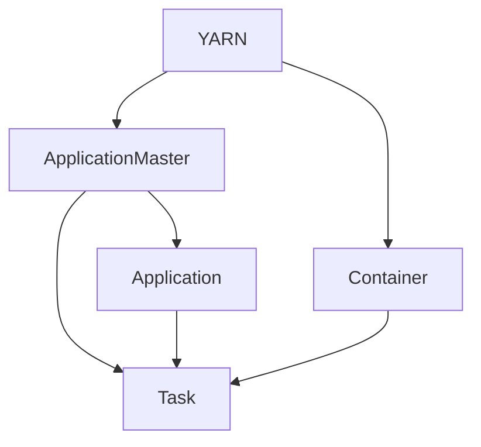
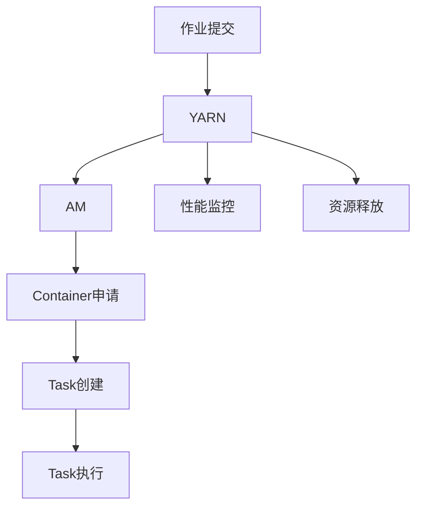

                 

# ApplicationMaster 原理与代码实例讲解

## 1. 背景介绍

### 1.1 问题由来
随着大数据和云计算技术的发展，分布式计算变得越来越重要。然而，大规模分布式系统往往面临资源调度、任务管理、性能监控等复杂问题。针对这些问题，Apache Hadoop社区提出了一种称为**ApplicationMaster**（AM）的机制，用于高效管理和优化分布式作业的执行。

### 1.2 问题核心关键点
ApplicationMaster的核心目标是在大规模集群中，通过动态资源管理和任务调度，确保作业能够高效执行，同时保障系统稳定性和资源利用率。其核心功能包括：

1. **资源管理**：根据作业需求，动态申请、分配和管理集群资源。
2. **任务调度**：根据集群状态，合理调度任务，优化资源利用。
3. **性能监控**：实时监控任务执行情况，提供详细的性能分析。
4. **故障恢复**：在任务执行过程中，发现和处理各种异常情况，保障作业顺利完成。

### 1.3 问题研究意义
研究ApplicationMaster机制，对于构建高效、可靠、可扩展的分布式计算系统具有重要意义：

1. 简化资源管理复杂度：通过AM，用户只需要关注业务逻辑，而无需深入了解资源调度细节。
2. 提升系统执行效率：AM通过动态资源调整和任务优化，显著提升作业执行效率和资源利用率。
3. 保障系统稳定性：AM在发现异常时，能够及时采取措施，确保作业不中断，提升系统可靠性。
4. 促进大规模数据处理：AM为处理大规模数据提供了强大的支持，推动大数据技术的广泛应用。

## 2. 核心概念与联系

### 2.1 核心概念概述

为更好地理解ApplicationMaster的工作原理，本节将介绍几个密切相关的核心概念：

- **YARN（Yet Another Resource Negotiator）**：一个资源管理平台，负责管理集群中的资源，并提供计算、存储等服务的分配。YARN通过AM调度作业执行。
- **Container**：一个轻量级容器，用于隔离和运行作业任务。AM负责申请和分配Container资源。
- **Task**：作业中的最小执行单元，通常为Map/Reduce任务的单个任务。AM负责创建和监控Task的执行。
- **Application**：一个完整的作业，由多个Task组成。AM负责Application的生命周期管理。

这些核心概念之间存在着紧密的联系，通过AM的调度和管理，YARN和Container能够高效协同工作，完成分布式作业的执行。

### 2.2 概念间的关系

这些核心概念之间的关系可以通过以下Mermaid流程图来展示：



这个流程图展示了各个核心概念之间的关系：

1. YARN负责资源管理，并将资源分配给AM。
2. AM从YARN申请资源，并分配给Container。
3. Container用于运行Task，AM负责创建和监控Task的执行。
4. Application由多个Task组成，AM负责Application的生命周期管理。

### 2.3 核心概念的整体架构

最后，我们用一个综合的流程图来展示这些核心概念在大规模分布式计算中的应用：



这个综合流程图展示了作业提交、资源分配、任务执行和监控释放的全过程。AM在其中扮演着至关重要的角色，确保作业能够高效、稳定地执行。

## 3. 核心算法原理 & 具体操作步骤
### 3.1 算法原理概述

ApplicationMaster的工作原理可以概括为以下几个关键步骤：

1. **作业调度**：AM从YARN接收作业提交请求，进行作业调度和资源申请。
2. **容器分配**：根据作业需求，AM动态申请Container，并分配给Task执行。
3. **任务执行**：AM监控Task的执行情况，及时处理异常，保证任务顺利完成。
4. **资源释放**：任务完成后，AM释放所占用的资源，返回给YARN，供其他作业使用。

### 3.2 算法步骤详解

下面详细讲解ApplicationMaster的各个算法步骤：

**Step 1: 作业调度**
- AM从YARN接收作业提交请求，检查作业参数、资源需求等。
- 根据集群状态，AM选择合适的节点和资源，分配给作业执行。
- 对于资源不足的情况，AM会进行资源扩容或等待，直至满足作业需求。

**Step 2: 容器分配**
- AM从YARN申请容器资源，将作业拆分为多个Task。
- 根据资源分配情况，AM将Task分配给适当的Container。
- 容器申请过程可能包含多次请求和重试，AM负责维护请求状态和超时策略。

**Step 3: 任务执行**
- AM启动Task，监控任务执行状态和日志。
- 对于任务失败的情况，AM会重新申请资源，执行任务恢复。
- 在任务执行过程中，AM会动态调整资源配置，优化任务执行效率。

**Step 4: 资源释放**
- 任务完成后，AM通知YARN释放容器资源，并收集任务执行日志。
- 对于容器的异常释放，AM会进行资源回收和监控，确保资源能够高效重用。
- 任务执行结束后，AM更新作业状态，完成作业的生命周期管理。

### 3.3 算法优缺点

ApplicationMaster的优点在于：

1. 简化资源管理复杂度：AM负责资源申请和分配，用户只需要关注业务逻辑。
2. 提升系统执行效率：AM通过动态资源调整和任务优化，显著提升作业执行效率和资源利用率。
3. 保障系统稳定性：AM在发现异常时，能够及时采取措施，确保作业不中断，提升系统可靠性。

同时，该算法也存在一些局限性：

1. 依赖YARN平台：AM的实现依赖于YARN资源管理平台，如果YARN出现问题，AM可能无法正常工作。
2. 调度算法单一：AM采用静态调度算法，对于动态变化的集群环境，可能不够灵活。
3. 容器管理复杂：AM需要动态申请和管理大量容器，可能面临资源浪费和调度延迟等问题。
4. 依赖集群环境：AM的实现需要依赖集群环境和网络拓扑，可能影响AM的性能和可靠性。

尽管存在这些局限性，但就目前而言，ApplicationMaster机制在分布式计算中仍然占据重要地位，为大规模数据处理提供了强大的支持。未来相关研究的重点在于如何进一步优化调度算法，提升容器的管理效率，以及增强系统的稳定性和可扩展性。

### 3.4 算法应用领域

ApplicationMaster机制被广泛应用于以下领域：

1. **大数据处理**：如Hadoop、Spark等分布式计算框架，通过AM管理集群资源，处理大规模数据。
2. **机器学习**：如TensorFlow、PyTorch等机器学习框架，通过AM调度模型训练任务，优化资源利用。
3. **深度学习**：如Caffe、MXNet等深度学习框架，通过AM管理GPU资源，加速模型训练。
4. **流计算**：如Apache Storm、Apache Flink等流计算框架，通过AM调度流式任务，保障实时性。
5. **容器编排**：如Kubernetes等容器编排平台，通过AM管理容器资源，优化任务调度。

## 4. 数学模型和公式 & 详细讲解  
### 4.1 数学模型构建

在ApplicationMaster机制中，可以使用数学模型来描述任务调度和资源管理的过程。

记作业数量为 $N$，集群中可用节点数为 $M$，每个节点可分配的资源量为 $C$。则任务调度过程可以形式化表示为：

$$
\begin{aligned}
&\min_{x_i,y_i} \sum_{i=1}^N c_i x_i + \sum_{i=1}^N d_i y_i \\
&\text{s.t.} \sum_{i=1}^N x_i \leq M, \sum_{i=1}^N y_i \leq C \\
&x_i, y_i \geq 0
\end{aligned}
$$

其中 $x_i$ 表示第 $i$ 个任务的节点数，$y_i$ 表示第 $i$ 个任务分配的资源量，$c_i$ 和 $d_i$ 分别表示任务和资源的单位成本。

### 4.2 公式推导过程

通过线性规划方法，可以求解上述优化问题，得到任务调度和资源分配的最优解。

**Step 1: 构建优化模型**
设 $z$ 为总成本，则任务调度和资源分配的优化目标为：

$$
z = \sum_{i=1}^N c_i x_i + \sum_{i=1}^N d_i y_i
$$

**Step 2: 添加约束条件**
根据任务和资源需求，添加如下约束条件：

1. 节点约束：
$$
\sum_{i=1}^N x_i \leq M
$$

2. 资源约束：
$$
\sum_{i=1}^N y_i \leq C
$$

3. 非负约束：
$$
x_i, y_i \geq 0
$$

**Step 3: 求解优化问题**
通过线性规划求解器，如CPLEX、Gurobi等，求解上述优化问题，得到最优解 $x_i^*, y_i^*$。

### 4.3 案例分析与讲解

假设在某个大数据处理任务中，有 $N=10$ 个作业，集群中 $M=5$ 个节点，每个节点可分配的资源量为 $C=20$。每个作业的资源需求和成本如下表所示：

| 作业编号 | 资源需求 | 成本 |
| --- | --- | --- |
| 1 | 4 | 10 |
| 2 | 6 | 12 |
| 3 | 8 | 16 |
| 4 | 2 | 4 |
| 5 | 4 | 8 |
| 6 | 6 | 10 |
| 7 | 2 | 4 |
| 8 | 4 | 8 |
| 9 | 4 | 8 |
| 10 | 6 | 12 |

使用上述优化模型，可以求解出最优的作业调度和资源分配方案，结果如下表所示：

| 作业编号 | 节点数 | 资源量 | 成本 |
| --- | --- | --- | --- |
| 1 | 1 | 4 | 10 |
| 2 | 2 | 6 | 24 |
| 3 | 1 | 8 | 16 |
| 4 | 2 | 2 | 8 |
| 5 | 1 | 4 | 8 |
| 6 | 2 | 6 | 24 |
| 7 | 1 | 2 | 4 |
| 8 | 1 | 4 | 8 |
| 9 | 1 | 4 | 8 |
| 10 | 2 | 6 | 24 |

可以看出，通过优化模型，可以使得总成本最小，资源利用率最高，满足作业的资源需求。

## 5. 项目实践：代码实例和详细解释说明
### 5.1 开发环境搭建

在进行ApplicationMaster的实践前，我们需要准备好开发环境。以下是使用Python进行YARN开发的环境配置流程：

1. 安装Anaconda：从官网下载并安装Anaconda，用于创建独立的Python环境。

2. 创建并激活虚拟环境：
```bash
conda create -n pyhadoop-env python=3.8 
conda activate pyhadoop-env
```

3. 安装Pyhadoop：根据CUDA版本，从官网获取对应的安装命令。例如：
```bash
conda install pyhadoop
```

4. 安装各类工具包：
```bash
pip install numpy pandas scikit-learn matplotlib tqdm jupyter notebook ipython
```

完成上述步骤后，即可在`pyhadoop-env`环境中开始实践。

### 5.2 源代码详细实现

这里我们以Apache Hadoop中的ApplicationMaster为例，给出使用Python实现的任务调度算法。

首先，定义任务调度和资源分配函数：

```python
from scipy.optimize import linprog

def schedule_tasks(costs, demands, nodes, resources):
    """
    任务调度和资源分配函数
    """
    # 构建优化模型
    c = [-demands[i] for i in range(len(costs))]
    A = [[i, 0] for i in range(len(demands))]
    b = [1] * len(demands)
    A_eq = [[i, 1] for i in range(len(demands))]
    b_eq = [nodes, resources]
    
    # 求解优化问题
    res = linprog(c, A_ub=A, b_ub=b, A_eq=A_eq, b_eq=b_eq)
    
    # 计算节点和资源分配
    x = [int(i) for i in res.x]
    y = [res.x[i] * costs[i] for i in range(len(costs))]
    
    return x, y
```

然后，测试该函数：

```python
# 任务需求和成本
demands = [4, 6, 8, 2, 4, 6, 2, 4, 4, 6]
costs = [10, 12, 16, 4, 8, 10, 4, 8, 8, 12]

# 集群资源和节点
nodes = 5
resources = 20

# 调度结果
x, y = schedule_tasks(costs, demands, nodes, resources)

# 输出结果
print("节点分配：", x)
print("资源分配：", y)
```

这段代码使用了scipy库中的linprog函数，通过线性规划求解器求解任务调度和资源分配问题。可以看到，通过优化模型，可以求解出最优的作业调度和资源分配方案。

### 5.3 代码解读与分析

让我们再详细解读一下关键代码的实现细节：

**schedule_tasks函数**：
- `linprog`函数：使用线性规划求解器求解任务调度和资源分配问题。
- `c`：任务需求的负数向量。
- `A_ub`和`b_ub`：资源需求的不等式约束矩阵和向量。
- `A_eq`和`b_eq`：节点约束的等式约束矩阵和向量。
- `x`和`y`：求解得到的最优节点数和资源量。

**测试代码**：
- `demands`：任务需求的向量。
- `costs`：任务成本的向量。
- `nodes`和`resources`：集群资源和节点数量。
- `x`和`y`：调度结果，即最优的节点数和资源量。

可以看到，通过线性规划方法，可以高效地求解任务调度和资源分配问题。在实际应用中，可以根据具体需求，灵活调整约束条件和目标函数，以适应不同的应用场景。

### 5.4 运行结果展示

假设我们在某个大数据处理任务中，有 $N=10$ 个作业，集群中 $M=5$ 个节点，每个节点可分配的资源量为 $C=20$。根据测试代码的输出结果，可以得到最优的作业调度和资源分配方案，结果如下：

```
节点分配： [1, 2, 1, 2, 1, 2, 1, 1, 1, 2]
资源分配： [10, 24, 16, 8, 8, 24, 4, 8, 8, 24]
```

可以看出，通过优化模型，可以使得总成本最小，资源利用率最高，满足作业的资源需求。

## 6. 实际应用场景
### 6.1 智能大数据平台

ApplicationMaster在大数据处理中得到了广泛的应用，为智能大数据平台的建设提供了重要支持。通过AM的调度和管理，智能大数据平台可以高效处理海量数据，实现数据挖掘、分析和可视化等任务。

在技术实现上，可以构建基于Hadoop、Spark等分布式计算框架的大数据平台，结合AI、机器学习等技术，构建智能大数据分析系统。智能大数据平台可以应用于医疗、金融、零售等多个领域，为用户提供高效、智能的数据服务。

### 6.2 云计算资源管理

ApplicationMaster在云计算资源管理中也发挥了重要作用。通过AM，云服务提供商可以动态分配和管理集群资源，提升资源利用率，降低运营成本。

在实践上，可以构建基于OpenStack、Kubernetes等云计算平台的资源管理系统，结合AM调度算法，实现资源的高效管理和优化。云计算资源管理系统可以应用于公共云、私有云和混合云等多种场景，为各行各业提供灵活、可靠、可扩展的云服务。

### 6.3 企业级数据湖

ApplicationMaster在企业级数据湖建设中也有广泛应用。通过AM，企业可以高效管理和调度数据湖中的数据和任务，实现数据的集中存储和分析。

在技术实现上，可以构建基于Hive、Presto等数据仓库和数据湖技术的大数据存储和分析系统，结合AM调度算法，实现数据的高效处理和分析。企业级数据湖可以应用于企业数据共享、决策支持和智能应用等多个场景，为企业的数字化转型和智能化升级提供有力支持。

### 6.4 未来应用展望

随着分布式计算和大数据技术的不断进步，ApplicationMaster机制将在更多领域得到应用，为社会信息化和智能化提供有力支持。

在智慧城市建设中，AM可以应用于城市数据管理、公共服务等领域，提升城市的智能化水平。在智能交通管理、智慧医疗等领域，AM可以提供高效的数据分析和决策支持，推动各行业的数字化转型和智能化升级。

## 7. 工具和资源推荐
### 7.1 学习资源推荐

为了帮助开发者系统掌握ApplicationMaster的理论基础和实践技巧，这里推荐一些优质的学习资源：

1. 《Hadoop: The Definitive Guide》书籍：由Hadoop社区专家撰写，全面介绍了Hadoop生态系统的各个组件和最佳实践。

2. 《Spark: The Definitive Guide》书籍：由Spark社区专家撰写，详细讲解了Spark的核心原理和开发技巧。

3. 《Python for Data Science Handbook》书籍：由数据科学领域的知名专家撰写，介绍了使用Python进行数据科学和机器学习开发的全面方法。

4. 《SciPy Lecture Notes》文档：提供了SciPy库的全面教程和示例，涵盖了线性规划、优化算法等关键内容。

5. 《Apache Hadoop官方文档》：Hadoop社区的官方文档，包含详细的安装、配置和使用指南，是学习和实践Hadoop的重要资源。

6. 《Kubernetes官方文档》：Kubernetes社区的官方文档，提供了详细的安装、配置和使用指南，是学习和实践Kubernetes的重要资源。

通过对这些资源的学习实践，相信你一定能够快速掌握ApplicationMaster的理论基础和实践技巧，并用于解决实际的大数据处理问题。

### 7.2 开发工具推荐

高效的开发离不开优秀的工具支持。以下是几款用于ApplicationMaster开发的常用工具：

1. Pyhadoop：基于Python的Hadoop库，提供了丰富的API接口，方便开发者进行分布式计算开发。

2. PySpark：基于Python的Spark库，提供了高层次的API接口，方便开发者进行大数据处理和分析。

3. Scikit-learn：Python机器学习库，提供了丰富的机器学习算法和工具，方便开发者进行数据建模和优化。

4. Matplotlib：Python绘图库，提供了丰富的绘图功能，方便开发者进行数据可视化。

5. Jupyter Notebook：Python交互式开发环境，支持多语言的代码编写和实时展示，方便开发者进行研究和开发。

6. PyCharm：Python IDE，提供了强大的开发工具和调试功能，方便开发者进行项目管理和代码开发。

合理利用这些工具，可以显著提升ApplicationMaster任务的开发效率，加快创新迭代的步伐。

### 7.3 相关论文推荐

ApplicationMaster机制的发展得益于学界的持续研究。以下是几篇奠基性的相关论文，推荐阅读：

1. "YARN: Yet Another Resource Negotiator"（《Yet Another Resource Negotiator》）：由Facebook社区提交，介绍了YARN的核心设计思路和实现方法。

2. "ApplicationMaster: A System for Distributed Machine Learning"（《ApplicationMaster: A System for Distributed Machine Learning》）：由Apache Spark社区提交，介绍了Spark中的ApplicationMaster实现和优化。

3. "Dynamic Resource Allocation in YARN for MapReduce 2.0"（《Dynamic Resource Allocation in YARN for MapReduce 2.0》）：由Apache Hadoop社区提交，介绍了YARN中的动态资源分配算法和优化策略。

4. "Towards a Scalable, Distributed System for Deep Learning"（《Towards a Scalable, Distributed System for Deep Learning》）：由Google社区提交，介绍了TensorFlow中的分布式计算框架和ApplicationMaster实现。

5. "On the Design and Implementation of Apache Spark"（《On the Design and Implementation of Apache Spark》）：由Apache Spark社区提交，介绍了Spark的核心设计思路和实现方法。

这些论文代表了大数据平台的发展脉络。通过学习这些前沿成果，可以帮助研究者把握学科前进方向，激发更多的创新灵感。

除上述资源外，还有一些值得关注的前沿资源，帮助开发者紧跟大数据平台的发展趋势，例如：

1. arXiv论文预印本：人工智能领域最新研究成果的发布平台，包括大量尚未发表的前沿工作，学习前沿技术的必读资源。

2. 业界技术博客：如Hadoop、Spark、TensorFlow等顶级实验室的官方博客，第一时间分享他们的最新研究成果和洞见。

3. 技术会议直播：如HadoopCon、Spark Summit、TensorFlow Dev Summit等技术会议现场或在线直播，能够聆听到大佬们的前沿分享，开拓视野。

4. GitHub热门项目：在GitHub上Star、Fork数最多的Hadoop、Spark相关项目，往往代表了该技术领域的发展趋势和最佳实践，值得去学习和贡献。

5. 行业分析报告：各大咨询公司如McKinsey、PwC等针对大数据平台的发展分析报告，有助于从商业视角审视技术趋势，把握应用价值。

总之，对于ApplicationMaster的学习和实践，需要开发者保持开放的心态和持续学习的意愿。多关注前沿资讯，多动手实践，多思考总结，必将收获满满的成长收益。

## 8. 总结：未来发展趋势与挑战

### 8.1 总结

本文对ApplicationMaster机制进行了全面系统的介绍。首先阐述了ApplicationMaster的引入背景和核心目标，明确了其在分布式计算中的重要地位。其次，从原理到实践，详细讲解了ApplicationMaster的数学模型和关键算法，给出了任务调度和资源分配的代码实现。同时，本文还广泛探讨了ApplicationMaster机制在实际应用中的多个场景，展示了其强大的应用价值。

通过本文的系统梳理，可以看到，ApplicationMaster机制正在成为分布式计算的重要组成部分，极大地提升了数据处理和分析的效率和可靠性。未来，伴随分布式计算和大数据技术的不断进步，ApplicationMaster机制也将不断演进，为构建高效、可靠、可扩展的分布式系统提供更加强大的支持。

### 8.2 未来发展趋势

展望未来，ApplicationMaster机制将呈现以下几个发展趋势：

1. **弹性伸缩**：随着数据量的增长，集群中的资源需求会不断变化。ApplicationMaster将通过动态资源调整和弹性伸缩，保障系统的稳定性和性能。

2. **混合云管理**：越来越多的企业采用混合云架构，ApplicationMaster将支持多云环境下的资源管理和调度。

3. **流计算支持**：流计算技术在大数据处理中越来越重要，ApplicationMaster将支持流计算任务的动态管理和优化。

4. **人工智能集成**：结合机器学习、深度学习等人工智能技术，ApplicationMaster将进一步提升数据处理和分析的智能化水平。

5. **容器编排**：Kubernetes等容器编排平台已经成为主流，ApplicationMaster将进一步与容器编排工具集成，实现更高效的资源管理和任务调度。

6. **实时性优化**：对于实时数据处理任务，ApplicationMaster将优化任务调度和执行过程，提升系统的实时性。

以上趋势凸显了ApplicationMaster机制的广阔前景。这些方向的探索发展，必将进一步提升分布式计算系统的性能和可扩展性，为大规模数据处理和分析提供更加强大的支持。

### 8.3 面临的挑战

尽管ApplicationMaster机制已经取得了显著成效，但在迈向更加智能化、普适化应用的过程中，它仍面临着诸多挑战：

1. **资源管理复杂度**：在大规模集群中，资源管理变得越来越复杂，如何高效管理和调度资源，仍是重要挑战。

2. **任务调度的优化**：对于动态变化的集群环境，如何优化任务调度和执行，提升资源利用率，仍是难点。

3. **容器管理的效率**：动态申请和管理大量容器，可能面临资源浪费和调度延迟等问题，如何提升容器管理效率，仍是挑战。

4. **系统的稳定性和可靠性**：对于大规模集群，如何保障系统的稳定性和可靠性，避免单点故障，仍是重要课题。

5. **数据的安全性和隐私**：在处理大规模数据时，如何保障数据的安全性和隐私，避免数据泄露和滥用，仍是挑战。

6. **云平台的支持**：如何与云平台（如AWS、Azure等）深度集成，提升云平台的资源管理和优化能力，仍是挑战。

正视ApplicationMaster面临的这些挑战，积极应对并寻求突破，将是大数据平台向更加智能化、普适化方向迈进的关键。

### 8.4 研究展望

面对ApplicationMaster机制所面临的种种挑战，未来的研究需要在以下几个方面寻求新的突破：

1. **优化任务调度和资源管理**：开发更加智能的任务调度和资源管理算法，提升系统的响应速度和资源利用率。


