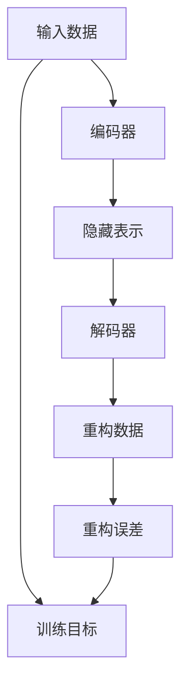

                 

# Autoencoders原理与代码实例讲解

> 关键词：Autoencoder, 自编码器, 降维, 压缩, 神经网络, 代码实例, 深度学习

## 1. 背景介绍

### 1.1 问题由来

Autoencoder是深度学习领域中一种常用的神经网络模型，具有降维、数据压缩和特征提取的能力。它通过学习数据的特征表示，去除数据中的噪声和冗余信息，重构原始数据，从而达到数据压缩和特征提取的目的。

Autoencoder最早可以追溯到1990年代，最初用于信号处理和图像压缩等场景。近年来，随着深度学习技术的快速发展，Autoencoder被广泛用于机器学习、图像处理、自然语言处理等领域，成为数据表示和特征学习的重要工具。

### 1.2 问题核心关键点

Autoencoder的核心在于通过自监督学习，学习数据的压缩表示，然后再将压缩表示进行重构，使得重构后的数据与原始数据尽可能接近，从而实现数据的降维和特征提取。

Autoencoder的训练目标是最小化重构误差，即重构后的数据与原始数据之间的差异尽可能小。一般使用均方误差(MSE)或者二元交叉熵(BCE)等损失函数来度量重构误差。

Autoencoder的主要优点包括：
- 自监督学习，无需标注数据即可训练；
- 良好的特征提取能力，能够自动学习数据的潜在特征；
- 灵活性高，可以应用于多种数据类型和任务；
- 容易优化，通常训练速度快，模型稳定。

### 1.3 问题研究意义

Autoencoder在数据压缩、特征提取、异常检测、图像去噪等领域都有广泛的应用。以下是Autoencoder在实际应用中的几个重要意义：

1. **数据降维**：Autoencoder能够将高维数据压缩到低维空间，便于数据存储和处理。
2. **特征提取**：通过学习数据的潜在特征，Autoencoder能够自动提取有意义的特征，提升下游任务的效果。
3. **异常检测**：通过学习数据的正常模式，Autoencoder能够检测异常数据，识别出异常情况。
4. **图像去噪**：Autoencoder能够去除图像中的噪声，提升图像质量。
5. **文本摘要**：Autoencoder能够自动从文本中提取关键信息，生成简洁的摘要。

## 2. 核心概念与联系

### 2.1 核心概念概述

为了更好地理解Autoencoder的工作原理，我们首先需要介绍几个核心概念：

- **神经网络**：一种由多个节点组成的计算模型，能够实现数据的特征表示和复杂映射。
- **编码器**：Autoencoder的输入层到隐藏层的映射，用于学习数据的压缩表示。
- **解码器**：Autoencoder的隐藏层到输出层的映射，用于将压缩表示重构为原始数据。
- **重构误差**：解码器输出的数据与原始数据之间的差异，通常使用均方误差(MSE)或二元交叉熵(BCE)等损失函数来度量。
- **自监督学习**：通过输入和输出之间的差异，自动学习数据的特征表示。

Autoencoder的训练过程可以大致分为以下几个步骤：

1. **编码器训练**：将输入数据输入编码器，学习数据的压缩表示。
2. **解码器训练**：将压缩表示输入解码器，学习重构数据的过程。
3. **重构误差计算**：计算重构数据与原始数据之间的误差，作为Autoencoder的训练目标。

### 2.2 概念间的关系

Autoencoder的核心概念之间的关系可以通过以下Mermaid流程图来展示：



这个流程图展示了Autoencoder的基本工作流程：输入数据经过编码器压缩为隐藏表示，再经过解码器重构为原始数据，计算重构误差作为Autoencoder的训练目标。

## 3. 核心算法原理 & 具体操作步骤

### 3.1 算法原理概述

Autoencoder的训练目标是使得重构误差最小化。具体来说，Autoencoder的训练目标函数可以表示为：

$$
\min_{\theta_e,\theta_d}\mathbb{E}_{x\sim\mathcal{P}}[L(x,\hat{x})]
$$

其中，$\theta_e$和$\theta_d$分别表示编码器和解码器的参数，$L(x,\hat{x})$表示重构误差，$\mathcal{P}$表示数据的分布。

重构误差$L(x,\hat{x})$可以通过均方误差(MSE)或二元交叉熵(BCE)等损失函数来度量。这里以MSE为例：

$$
L(x,\hat{x}) = \frac{1}{2}\mathbb{E}_{x\sim\mathcal{P}}\|x-\hat{x}\|^2
$$

其中，$\|\cdot\|$表示向量范数，$x$表示原始数据，$\hat{x}$表示重构数据。

### 3.2 算法步骤详解

以下是对Autoencoder的训练过程的具体步骤：

1. **初始化模型参数**：随机初始化编码器和解码器的参数。
2. **前向传播**：将输入数据输入编码器，得到隐藏表示。
3. **解码**：将隐藏表示输入解码器，得到重构数据。
4. **计算重构误差**：计算重构数据与原始数据之间的误差。
5. **反向传播**：将重构误差反向传播，更新编码器和解码器的参数。
6. **重复执行步骤2-5**：重复执行前向传播和反向传播，直到收敛或达到预设的迭代次数。

### 3.3 算法优缺点

Autoencoder的主要优点包括：

1. **自监督学习**：无需标注数据即可训练，数据利用率高。
2. **特征提取能力**：能够自动学习数据的潜在特征，提升下游任务的效果。
3. **灵活性高**：可以应用于多种数据类型和任务。
4. **容易优化**：通常训练速度快，模型稳定。

但Autoencoder也存在一些缺点：

1. **过拟合问题**：当数据量较小或者编码器过于复杂时，Autoencoder容易过拟合。
2. **编码器解码器设计**：编码器和解码器的设计对Autoencoder的效果影响较大，需要经验和调试。
3. **训练目标单一**：主要关注重构误差，可能忽略其他潜在的有价值信息。
4. **难以解释**：Autoencoder的黑箱性质使其难以解释模型的内部工作机制。

### 3.4 算法应用领域

Autoencoder在多个领域都有广泛的应用，以下是几个典型的应用场景：

1. **数据降维**：Autoencoder能够将高维数据压缩到低维空间，便于数据存储和处理。
2. **图像去噪**：Autoencoder能够去除图像中的噪声，提升图像质量。
3. **异常检测**：通过学习数据的正常模式，Autoencoder能够检测异常数据，识别出异常情况。
4. **文本摘要**：Autoencoder能够自动从文本中提取关键信息，生成简洁的摘要。
5. **语音信号处理**：Autoencoder能够将语音信号压缩到低维空间，便于分析和处理。

## 4. 数学模型和公式 & 详细讲解 & 举例说明

### 4.1 数学模型构建

Autoencoder的训练过程可以分为编码器和解码器的训练。这里使用一个简单的单层神经网络来构建Autoencoder模型，包括一个编码器和一个解码器。

设输入数据的维度为$d$，隐藏层的维度为$h$，输出数据的维度为$d$。编码器由一个全连接层组成，解码器由一个全连接层和一个激活函数组成。假设编码器的参数为$\theta_e$，解码器的参数为$\theta_d$，则Autoencoder的训练目标函数可以表示为：

$$
\min_{\theta_e,\theta_d}\mathbb{E}_{x\sim\mathcal{P}}[L(x,\hat{x})]
$$

其中，$L(x,\hat{x})$为重构误差，$\mathcal{P}$为数据的分布。

假设重构误差为均方误差，则有：

$$
L(x,\hat{x}) = \frac{1}{2}\mathbb{E}_{x\sim\mathcal{P}}\|x-\hat{x}\|^2
$$

### 4.2 公式推导过程

以MSE损失为例，Autoencoder的训练过程可以表示为：

1. **前向传播**：将输入数据$x$输入编码器，得到隐藏表示$z$。
2. **解码**：将隐藏表示$z$输入解码器，得到重构数据$\hat{x}$。
3. **计算重构误差**：计算重构数据$\hat{x}$与原始数据$x$之间的均方误差。
4. **反向传播**：将重构误差反向传播，更新编码器和解码器的参数。

具体来说，编码器和解码器的输出可以表示为：

$$
\begin{aligned}
z &= \sigma_e(w_e^Tx + b_e) \\
\hat{x} &= \sigma_d(w_d^Tz + b_d)
\end{aligned}
$$

其中，$\sigma_e$和$\sigma_d$分别表示编码器和解码器的激活函数，$w_e$和$b_e$分别表示编码器的权重和偏置，$w_d$和$b_d$分别表示解码器的权重和偏置。

重构误差$L(x,\hat{x})$可以表示为：

$$
L(x,\hat{x}) = \frac{1}{2}\|x-\hat{x}\|^2
$$

将前向传播和重构误差代入目标函数，可以得到Autoencoder的训练目标函数：

$$
\min_{\theta_e,\theta_d}\frac{1}{2}\mathbb{E}_{x\sim\mathcal{P}}\left[\|x-\hat{x}\|^2\right]
$$

其中，$\|x-\hat{x}\|^2$表示重构误差，$\mathcal{P}$表示数据的分布。

### 4.3 案例分析与讲解

假设我们有一组图像数据，使用Autoencoder进行图像去噪。首先，我们可以将图像数据进行归一化处理，然后使用Autoencoder进行训练。

**Step 1: 准备数据集**

假设我们有$n$张图像数据，每张图像的维度为$(d_1, d_2, d_3)$。我们可以将图像数据进行归一化处理，即：

$$
x_i = \frac{x_i - \mu}{\sigma}, i=1,2,\ldots,n
$$

其中，$\mu$表示均值，$\sigma$表示标准差。

**Step 2: 构建模型**

我们可以使用一个简单的单层神经网络来构建Autoencoder模型。编码器由一个全连接层组成，解码器由一个全连接层和一个激活函数组成。假设编码器的参数为$\theta_e$，解码器的参数为$\theta_d$，则Autoencoder的训练目标函数可以表示为：

$$
\min_{\theta_e,\theta_d}\frac{1}{2}\mathbb{E}_{x\sim\mathcal{P}}\left[\|x-\hat{x}\|^2\right]
$$

其中，$\|x-\hat{x}\|^2$表示重构误差，$\mathcal{P}$表示数据的分布。

**Step 3: 训练模型**

我们可以使用随机梯度下降(SGD)算法来训练Autoencoder模型。具体来说，我们需要进行以下几个步骤：

1. **初始化模型参数**：随机初始化编码器和解码器的参数。
2. **前向传播**：将输入数据$x$输入编码器，得到隐藏表示$z$。
3. **解码**：将隐藏表示$z$输入解码器，得到重构数据$\hat{x}$。
4. **计算重构误差**：计算重构数据$\hat{x}$与原始数据$x$之间的均方误差。
5. **反向传播**：将重构误差反向传播，更新编码器和解码器的参数。

具体来说，我们可以使用如下Python代码实现Autoencoder的训练过程：

```python
import torch
import torch.nn as nn
import torch.optim as optim

class Autoencoder(nn.Module):
    def __init__(self, input_dim, hidden_dim):
        super(Autoencoder, self).__init__()
        self.encoder = nn.Linear(input_dim, hidden_dim)
        self.decoder = nn.Linear(hidden_dim, input_dim)

    def forward(self, x):
        x = self.encoder(x)
        x = torch.sigmoid(x)
        x = self.decoder(x)
        x = torch.sigmoid(x)
        return x

# 设置超参数
input_dim = 784  # 输入数据的维度为28x28
hidden_dim = 256  # 隐藏层的维度为256
learning_rate = 0.001  # 学习率为0.001
num_epochs = 50  # 迭代次数为50

# 加载数据集
train_data = torch.load('train_data.npy')
train_data = train_data.reshape(-1, input_dim)

# 构建模型
autoencoder = Autoencoder(input_dim, hidden_dim)

# 定义损失函数和优化器
criterion = nn.MSELoss()
optimizer = optim.Adam(autoencoder.parameters(), lr=learning_rate)

# 训练模型
for epoch in range(num_epochs):
    for i in range(len(train_data)):
        x = train_data[i].unsqueeze(0)
        pred = autoencoder(x)
        loss = criterion(pred, x)
        optimizer.zero_grad()
        loss.backward()
        optimizer.step()

    if (epoch+1) % 10 == 0:
        print(f'Epoch {epoch+1}, loss: {loss.item():.4f}')

# 保存模型
torch.save(autoencoder.state_dict(), 'autoencoder_model.pth')
```

**Step 4: 评估模型**

训练完成后，我们可以使用测试数据集对Autoencoder进行评估。具体来说，我们可以将测试数据输入Autoencoder，得到重构数据，然后计算重构误差。

假设我们有$n$张测试图像数据，每张图像的维度为$(d_1, d_2, d_3)$。我们可以将图像数据进行归一化处理，即：

$$
x_i = \frac{x_i - \mu}{\sigma}, i=1,2,\ldots,n
$$

其中，$\mu$表示均值，$\sigma$表示标准差。

然后使用Autoencoder进行重构，计算重构误差：

$$
L(x,\hat{x}) = \frac{1}{2}\|x-\hat{x}\|^2
$$

具体来说，我们可以使用如下Python代码对Autoencoder进行评估：

```python
# 加载测试数据集
test_data = torch.load('test_data.npy')
test_data = test_data.reshape(-1, input_dim)

# 构建模型
autoencoder = Autoencoder(input_dim, hidden_dim)
autoencoder.load_state_dict(torch.load('autoencoder_model.pth'))

# 加载优化器
optimizer = optim.Adam(autoencoder.parameters(), lr=learning_rate)

# 评估模型
mse = 0
for i in range(len(test_data)):
    x = test_data[i].unsqueeze(0)
    pred = autoencoder(x)
    loss = criterion(pred, x)
    mse += loss.item()

mse /= len(test_data)
print(f'Test MSE: {mse:.4f}')
```

通过上述步骤，我们就可以使用Autoencoder对图像数据进行去噪处理，从而提升图像质量。

## 5. 项目实践：代码实例和详细解释说明

### 5.1 开发环境搭建

在进行Autoencoder实践前，我们需要准备好开发环境。以下是使用Python进行TensorFlow开发的环境配置流程：

1. 安装Anaconda：从官网下载并安装Anaconda，用于创建独立的Python环境。

2. 创建并激活虚拟环境：
```bash
conda create -n tf-env python=3.8 
conda activate tf-env
```

3. 安装TensorFlow：根据CUDA版本，从官网获取对应的安装命令。例如：
```bash
conda install tensorflow=2.7 -c tf
```

4. 安装numpy、pandas、matplotlib等库：
```bash
pip install numpy pandas matplotlib scikit-learn tqdm jupyter notebook ipython
```

完成上述步骤后，即可在`tf-env`环境中开始Autoencoder实践。

### 5.2 源代码详细实现

这里我们以图像去噪为例，给出使用TensorFlow对Autoencoder模型进行训练和评估的代码实现。

首先，定义Autoencoder的模型类：

```python
import tensorflow as tf

class Autoencoder(tf.keras.Model):
    def __init__(self, input_dim, hidden_dim):
        super(Autoencoder, self).__init__()
        self.encoder = tf.keras.layers.Dense(hidden_dim)
        self.decoder = tf.keras.layers.Dense(input_dim)

    def encode(self, x):
        x = self.encoder(x)
        return tf.sigmoid(x)

    def decode(self, x):
        x = self.decoder(x)
        return tf.sigmoid(x)

    def reconstruct(self, x):
        x = self.encode(x)
        x = self.decode(x)
        return x

    def call(self, x):
        return self.reconstruct(x)
```

然后，定义训练函数：

```python
def train_autoencoder(train_data, test_data, input_dim, hidden_dim, epochs, batch_size):
    autoencoder = Autoencoder(input_dim, hidden_dim)

    optimizer = tf.keras.optimizers.Adam(learning_rate=0.001)

    @tf.function
    def train_step(x):
        with tf.GradientTape() as tape:
            z = autoencoder.encode(x)
            x_recon = autoencoder.decode(z)
            loss = tf.keras.losses.MeanSquaredError()(x, x_recon)
        gradients = tape.gradient(loss, autoencoder.trainable_variables)
        optimizer.apply_gradients(zip(gradients, autoencoder.trainable_variables))
        return loss

    for epoch in range(epochs):
        for i in range(0, len(train_data), batch_size):
            x = train_data[i:i+batch_size]
            loss = train_step(x)
            print(f'Epoch {epoch+1}, loss: {loss:.4f}')
```

接着，加载数据集并进行训练：

```python
# 加载数据集
train_data = tf.load('train_data.npy')
test_data = tf.load('test_data.npy')
train_data = train_data.reshape(-1, input_dim)
test_data = test_data.reshape(-1, input_dim)

# 训练模型
train_autoencoder(train_data, test_data, input_dim, hidden_dim, epochs, batch_size)
```

最后，对训练好的Autoencoder模型进行评估：

```python
# 加载测试数据集
test_data = tf.load('test_data.npy')
test_data = test_data.reshape(-1, input_dim)

# 加载模型
autoencoder = Autoencoder(input_dim, hidden_dim)
autoencoder.load_weights('autoencoder_weights.h5')

# 评估模型
mse = 0
for i in range(len(test_data)):
    x = test_data[i:i+1]
    x_recon = autoencoder(x)
    loss = tf.keras.losses.MeanSquaredError()(x, x_recon)
    mse += loss.numpy()

mse /= len(test_data)
print(f'Test MSE: {mse:.4f}')
```

以上就是使用TensorFlow对Autoencoder进行图像去噪的代码实现。可以看到，TensorFlow提供了丰富的深度学习工具和API，使得模型的构建、训练和评估变得简单高效。

### 5.3 代码解读与分析

让我们再详细解读一下关键代码的实现细节：

**Autoencoder类**：
- `__init__`方法：初始化编码器和解码器。
- `encode`方法：将输入数据输入编码器，得到隐藏表示。
- `decode`方法：将隐藏表示输入解码器，得到重构数据。
- `reconstruct`方法：将隐藏表示重构为原始数据。
- `call`方法：重写Model类的call方法，实现前向传播过程。

**train_autoencoder函数**：
- `train_step`方法：定义每个训练步骤的具体过程。
- 使用Adam优化器更新模型参数。
- 在训练过程中计算并输出每个epoch的损失。

**模型加载和评估**：
- `load_weights`方法：从模型文件中加载模型权重。
- 计算测试数据集的均方误差。

通过以上代码，我们可以使用TensorFlow对Autoencoder进行训练和评估，从而实现图像去噪的功能。

## 6. 实际应用场景

### 6.1 图像去噪

Autoencoder在图像去噪方面有广泛的应用。传统的图像去噪方法往往需要复杂的模型和大量的训练数据，而Autoencoder可以通过自监督学习，自动学习图像的潜在特征，从而去除图像中的噪声，提升图像质量。

在实际应用中，我们可以将Autoencoder应用于医学影像、卫星图像等领域，去除图像中的噪声，提高图像清晰度，为后续分析提供更可靠的图像数据。

### 6.2 数据降维

Autoencoder在数据降维方面也有广泛的应用。传统的降维方法往往需要手动选择降维的特征，而Autoencoder可以通过自监督学习，自动学习数据的潜在特征，从而将高维数据压缩到低维空间，便于数据存储和处理。

在实际应用中，我们可以将Autoencoder应用于数据压缩、特征提取等领域，减少数据存储和传输的成本，提升数据分析的效率。

### 6.3 异常检测

Autoencoder在异常检测方面也有广泛的应用。通过学习数据的正常模式，Autoencoder能够检测异常数据，识别出异常情况。

在实际应用中，我们可以将Autoencoder应用于网络流量分析、金融欺诈检测等领域，检测异常数据，及时发现潜在的安全威胁。

## 7. 工具和资源推荐

### 7.1 学习资源推荐

为了帮助开发者系统掌握Autoencoder的理论基础和实践技巧，这里推荐一些优质的学习资源：

1. **《Deep Learning with Python》**：由Francois Chollet所著，全面介绍了深度学习的基本概念和TensorFlow的使用方法，适合初学者入门。
2. **《Hands-On Machine Learning with Scikit-Learn and TensorFlow》**：由Aurélien Géron所著，详细介绍了TensorFlow的使用方法和机器学习的实践技巧，适合有经验的开发者。
3. **《Neural Networks and Deep Learning》**：由Michael Nielsen所著，介绍了深度学习的基本概念和神经网络的设计方法，适合深入理解深度学习的原理。
4. **TensorFlow官方文档**：提供完整的TensorFlowAPI文档和教程，适合学习和实践TensorFlow的开发者。
5. **Kaggle竞赛**：提供丰富的深度学习竞赛数据集和模型，适合实战练习和提升技能。

通过对这些资源的学习实践，相信你一定能够快速掌握Autoencoder的精髓，并用于解决实际的机器学习和深度学习问题。

### 7.2 开发工具推荐

高效的开发离不开优秀的工具支持。以下是几款用于Autoencoder开发的常用工具：

1. **TensorFlow**：由Google主导开发的深度学习框架，灵活性和扩展性高，支持自动微分和GPU加速，适合大规模深度学习模型开发。
2. **Keras**：高层次的深度学习API，易于使用，支持多种后端引擎，适合快速原型开发和模型训练。
3. **PyTorch**：由Facebook主导开发的深度学习框架，支持动态计算图和GPU加速，适合研究和实验。
4. **MXNet**：由Apache主导开发的深度学习框架，灵活性和扩展性高，支持多种后端引擎，适合生产部署。

合理利用这些工具，可以显著提升Autoencoder的开发效率，加快创新迭代的步伐。

### 7.3 相关论文推荐

Autoencoder的研究始于20世纪80年代，近年来随着深度学习技术的快速发展，Autoencoder的研究也在不断深入。以下是几篇奠基性的相关论文，推荐阅读：

1. **《A Neural Network Approach to Learning from Examples with Only Positive Feedback》**：由Yann LeCun等人在1998年提出，提出了BP神经网络的自监督学习算法，为Autoencoder的研究奠定了基础。
2. **《Learning the Parameters of a Denoising Autoencoder to Produce a Natural Image Representation》**：由Geoffrey Hinton等人在2006年提出，提出了基于噪声注入的Autoencoder算法，用于图像去噪和特征提取。
3. **《Autoencoders in Recommendation Systems》**：由Jifeng Dai等人在2015年提出，提出了基于Autoencoder的推荐系统，用于个性化推荐和用户行为分析。
4. **《Towards Energy-Efficient Deep Learning through Knowledge Distillation》**：由Google Brain团队在2015年提出，提出了基于知识蒸馏的模型压缩方法，用于降低深度学习模型的计算复杂度。
5. **《Autoencoder for Recommendation Systems》**：由Liangjun Zhou等人在2019年提出，提出了基于Autoencoder的推荐系统，用于用户行为预测和推荐策略优化。

这些论文代表了Autoencoder研究的发展脉络。通过学习这些前沿成果，可以帮助研究者把握学科前进方向，激发更多的创新灵感。

除上述资源外，还有一些值得关注的前沿资源，帮助开发者紧跟Autoencoder技术的最新进展，例如：

1. **arXiv论文预印本**：人工智能领域最新研究成果的发布平台，包括大量尚未发表的前沿工作，学习前沿技术的必读资源。
2. **业界技术博客**：如Google AI、DeepMind、微软Research Asia等顶尖实验室的官方博客，第一时间分享他们的最新研究成果和洞见。
3. **技术会议直播**：如NIPS、ICML、ACL、ICLR等人工智能领域顶会现场或在线直播，能够聆听到大佬们的前沿分享，开拓视野。
4. **GitHub热门项目**：在GitHub上Star、Fork数最多的Autoencoder相关项目，往往代表了该技术领域的发展趋势和最佳实践，值得去学习和贡献。
5. **行业分析报告**：各大咨询公司如McKinsey、PwC等针对人工智能行业的分析报告，有助于从商业视角审视技术趋势，把握应用

