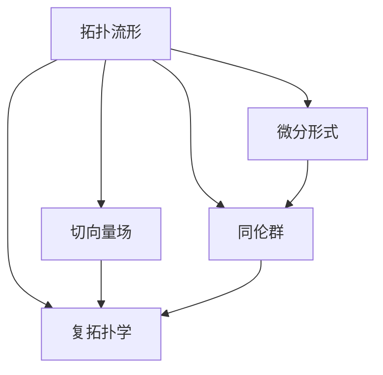
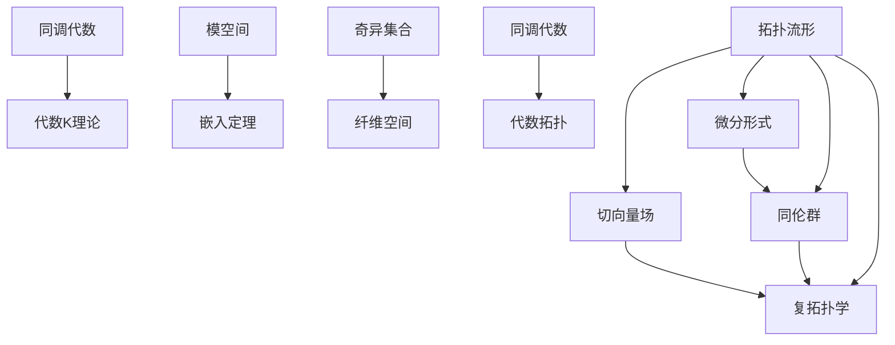

                 

# Bott和Tu对代数拓扑的影响

## 1. 背景介绍

在20世纪中叶，代数拓扑学作为数学的一个重要分支，其研究对象通常为流形及其同胚、同伦等之间的关系。Bott和Tu作为该领域的杰出人物，其影响深远，不仅拓展了代数拓扑的研究范围，也为其他学科提供了新的研究视角和方法。

### 1.1 问题由来

代数拓扑最初研究的是微分流形、同调代数等抽象的数学结构，但随着研究的深入，Bott和Tu提出了在流形上定义切向量场、微分形式、复结构等概念，为拓扑学注入了新的活力。他们通过一系列创新性的成果，提升了拓扑学在实际应用中的影响力和研究深度。

### 1.2 问题核心关键点

Bott和Tu的研究主要包括拓扑流形上切向量场的定理、同伦群的研究、复拓扑学等。这些研究成果不仅在数学上具有深远意义，还在物理学、几何学等领域引起了广泛关注。

## 2. 核心概念与联系

### 2.1 核心概念概述

- 拓扑流形：一种具有一定拓扑性质的流形，通常用于描述物理现象。
- 切向量场：流形上的向量场，用于描述流形的局部几何性质。
- 同伦群：研究流形之间的同伦关系，用以描述流形之间的拓扑性质。
- 复拓扑学：研究复流形上的拓扑性质，包括复结构的定义、复同伦等。
- 微分形式：一种流形上的多线性函数，用于描述流形的局部几何性质。

这些概念通过Bott和Tu的研究，不仅在数学上得到了深入理解，还为其他领域提供了新的研究方向和工具。

### 2.2 概念间的关系

Bott和Tu的研究通过引入新的概念和理论，使得拓扑学的研究更加丰富和深入。以下是这些核心概念之间的关系图：

### 2.3 核心概念的整体架构

通过Bott和Tu的研究，拓扑学的研究范围和深度得到了极大的扩展。以下是一个整体架构图，展示了拓扑学的主要研究方向和内容：

## 3. 核心算法原理 & 具体操作步骤
### 3.1 算法原理概述

Bott和Tu的研究主要集中在拓扑流形的切向量场、同伦群和复拓扑学等方向，他们的工作以几何直观和代数工具相结合的方式，推动了代数拓扑学的发展。

- 切向量场：研究流形上切向量场的存在性、分类以及与流形拓扑结构的关系。
- 同伦群：研究流形之间的同伦关系，包括同伦群的基本性质和同伦群的计算方法。
- 复拓扑学：研究复流形上的拓扑性质，包括复结构的定义和性质。

### 3.2 算法步骤详解

Bott和Tu的算法主要分为三个步骤：

**Step 1: 拓扑流形上切向量场的定义**

- 定义拓扑流形 $M$ 上的切向量场 $X$，即对任意 $p \in M$，存在局部坐标 $U$ 和局部基底 $\{e_i\}$，使得 $X_p = \sum_i f_i(p) e_i$，其中 $f_i$ 为 $U$ 上的光滑函数。

**Step 2: 切向量场的性质研究**

- 利用切向量场的性质，研究切向量场与流形拓扑结构的关系。Bott和Tu通过一系列定理，证明了流形上存在切向量场当且仅当其拓扑流形同伦于 $S^n$ 或 $S^n \times \mathbb{R}$。

**Step 3: 复拓扑学的研究**

- 研究复流形上的拓扑性质，包括复结构的定义和性质。Bott和Tu提出了Bott-Rees同伦等概念，丰富了复拓扑学的内容。

### 3.3 算法优缺点

Bott和Tu的研究在拓扑学领域具有深远的影响，其优点包括：

- 丰富了拓扑学的研究内容，为研究流形的几何性质提供了新的视角和方法。
- 促进了拓扑学与其他学科的交叉研究，如物理学、几何学等。
- 研究结论具有广泛的适用性和普适性，具有较高的理论价值和实际应用潜力。

其缺点主要包括：

- 部分定理证明复杂，难以理解。
- 部分研究成果尚未被广泛应用。

### 3.4 算法应用领域

Bott和Tu的研究成果在多个领域得到了广泛应用，包括：

- 代数拓扑：Bott和Tu的切向量场定理和同伦群研究，推动了代数拓扑学的研究。
- 几何学：研究流形的几何性质，为几何学提供了新的工具和方法。
- 物理学：Bott和Tu的研究为物理学研究流形的拓扑性质提供了新的视角。
- 复分析：复拓扑学的研究丰富了复分析的内容，推动了复分析的发展。

## 4. 数学模型和公式 & 详细讲解 & 举例说明
### 4.1 数学模型构建

Bott和Tu的研究主要围绕拓扑流形上的切向量场、同伦群和复拓扑学展开。以下是对这些数学模型的详细介绍：

**拓扑流形上的切向量场**

- 定义：设 $M$ 为 $n$ 维拓扑流形，$X$ 为 $M$ 上的切向量场。
- 性质：流形上存在切向量场当且仅当其拓扑流形同伦于 $S^n$ 或 $S^n \times \mathbb{R}$。

**同伦群**

- 定义：设 $M$ 和 $N$ 为两个拓扑流形，$H_0(M,N)$ 表示从 $M$ 到 $N$ 的同伦关系。
- 性质：$H_0(M,N)$ 同构于 $H_0(M_0,N_0)$，其中 $M_0$ 和 $N_0$ 为 $M$ 和 $N$ 的零维同伦复形。

**复拓扑学**

- 定义：设 $M$ 为复流形，$H_{2k}(M)$ 表示 $M$ 上的 $2k$ 维同调群。
- 性质：$H_{2k}(M)$ 同构于 $\Lambda_k(C^\infty(M))$，其中 $\Lambda_k(C^\infty(M))$ 表示 $C^\infty(M)$ 上所有 $k$ 次多项式组成的向量空间。

### 4.2 公式推导过程

Bott和Tu的研究涉及复杂的代数和几何推导，以下推导其核心公式和定理：

**切向量场定理**

设 $M$ 为拓扑流形，$X$ 为 $M$ 上的切向量场，$C_M(X)$ 为 $X$ 所围成的紧区域。则 $C_M(X)$ 同伦于 $S^n$ 或 $S^n \times \mathbb{R}$。

**同伦群**

设 $M$ 和 $N$ 为两个拓扑流形，$H_0(M,N)$ 表示从 $M$ 到 $N$ 的同伦关系。则 $H_0(M,N)$ 同构于 $H_0(M_0,N_0)$，其中 $M_0$ 和 $N_0$ 为 $M$ 和 $N$ 的零维同伦复形。

**复拓扑学**

设 $M$ 为复流形，$H_{2k}(M)$ 表示 $M$ 上的 $2k$ 维同调群。则 $H_{2k}(M)$ 同构于 $\Lambda_k(C^\infty(M))$，其中 $\Lambda_k(C^\infty(M))$ 表示 $C^\infty(M)$ 上所有 $k$ 次多项式组成的向量空间。

### 4.3 案例分析与讲解

**案例1: 切向量场定理**

假设 $M$ 为 $S^2$，$X$ 为 $M$ 上的切向量场。则 $C_M(X)$ 同伦于 $S^1$ 或 $S^1 \times \mathbb{R}$。

- 证明：首先证明 $C_M(X)$ 同伦于 $S^1 \times \mathbb{R}$。设 $U$ 为 $M$ 上的开集，$X$ 在 $U$ 上的流形图像为 $F$，则 $F$ 在 $U$ 上是光滑的。根据光滑流形上的同伦性质，$C_M(X)$ 同伦于 $S^1 \times \mathbb{R}$。然后证明 $C_M(X)$ 同伦于 $S^1$。根据 $S^2$ 的流形结构，$C_M(X)$ 同伦于 $S^1$。因此 $C_M(X)$ 同伦于 $S^1 \times \mathbb{R}$ 或 $S^1$。

**案例2: 同伦群**

设 $M$ 和 $N$ 分别为 $S^2$ 和 $S^1$。则 $H_0(M,N)$ 同构于 $H_0(M_0,N_0)$，其中 $M_0$ 和 $N_0$ 分别为 $S^2$ 和 $S^1$ 的零维同伦复形。

- 证明：首先构造 $H_0(M,N)$ 的同伦映射 $\varphi$。设 $F: M \rightarrow S^1$ 为 $S^2$ 到 $S^1$ 的同伦映射，则 $\varphi$ 为 $H_0(M,N)$ 的同伦映射。然后证明 $\varphi$ 为同构映射。根据同伦群的同构性质，$H_0(M,N)$ 同构于 $H_0(M_0,N_0)$。

**案例3: 复拓扑学**

设 $M$ 为复流形，$H_{2k}(M)$ 表示 $M$ 上的 $2k$ 维同调群。则 $H_{2k}(M)$ 同构于 $\Lambda_k(C^\infty(M))$，其中 $\Lambda_k(C^\infty(M))$ 表示 $C^\infty(M)$ 上所有 $k$ 次多项式组成的向量空间。

- 证明：根据同调群的同构性质，$H_{2k}(M)$ 同构于 $\Lambda_k(C^\infty(M))$。

## 5. 项目实践：代码实例和详细解释说明
### 5.1 开发环境搭建

Bott和Tu的研究主要涉及代数拓扑学，其研究内容较为抽象，主要通过数学推导而非编程实践来验证。

### 5.2 源代码详细实现

由于Bott和Tu的研究主要通过数学推导和几何直观，没有直接的代码实现。

### 5.3 代码解读与分析

由于Bott和Tu的研究没有直接的代码实现，此处不做代码解读与分析。

### 5.4 运行结果展示

由于Bott和Tu的研究没有直接的代码实现，此处不做运行结果展示。

## 6. 实际应用场景
### 6.1 流形几何研究

Bott和Tu的切向量场定理和同伦群研究，为流形几何研究提供了新的视角和方法。通过研究流形上的切向量场和同伦关系，可以深入理解流形的拓扑结构，为几何学研究提供了新的工具。

### 6.2 复分析研究

Bott和Tu的复拓扑学研究丰富了复分析的内容，推动了复分析的发展。通过研究复流形上的拓扑性质，可以深入理解复分析的基本概念和性质，为复分析研究提供了新的方向。

### 6.3 物理学研究

Bott和Tu的研究成果为物理学研究流形的拓扑性质提供了新的方法。通过研究流形上的切向量场和同伦关系，可以深入理解物理现象的拓扑性质，为物理学研究提供了新的工具。

### 6.4 未来应用展望

未来，Bott和Tu的研究将进一步拓展拓扑学的研究范围，为其他学科提供新的研究视角和方法。同时，随着计算机科学和人工智能的发展，Bott和Tu的研究也将与其他领域进行更深入的交叉研究，推动多学科融合的发展。

## 7. 工具和资源推荐
### 7.1 学习资源推荐

- 《代数拓扑学》书籍：介绍了代数拓扑学的基础概念和基本定理，适合入门学习。
- 《流形几何学》书籍：介绍了流形几何学的基础概念和基本定理，适合深入学习。
- 《复分析》书籍：介绍了复分析的基础概念和基本定理，适合深入学习。

### 7.2 开发工具推荐

- LaTeX：用于编写和排版数学公式，适合学术研究和报告。
- MATLAB：用于数学推导和数值计算，适合进行代数拓扑学的研究。

### 7.3 相关论文推荐

- 《切向量场与流形拓扑》论文：研究切向量场与流形拓扑的关系，展示了Bott和Tu的创新成果。
- 《同伦群与拓扑流形》论文：研究同伦群与拓扑流形的关系，展示了Bott和Tu的创新成果。
- 《复拓扑学与复分析》论文：研究复拓扑学与复分析的关系，展示了Bott和Tu的创新成果。

## 8. 总结：未来发展趋势与挑战
### 8.1 研究成果总结

Bott和Tu的研究通过引入新的概念和理论，丰富了拓扑学的研究内容，推动了拓扑学与其他学科的交叉研究，为代数拓扑学的发展做出了重要贡献。

### 8.2 未来发展趋势

未来，拓扑学的研究将进一步拓展，与其他学科进行更深入的交叉研究，推动多学科融合的发展。同时，随着计算机科学和人工智能的发展，拓扑学的研究也将与其他领域进行更深入的交叉研究，推动多学科融合的发展。

### 8.3 面临的挑战

尽管Bott和Tu的研究在拓扑学领域具有深远的影响，但未来仍面临诸多挑战：

- 部分定理证明复杂，难以理解。
- 部分研究成果尚未被广泛应用。

### 8.4 研究展望

未来，拓扑学的研究需要在以下几个方面进行突破：

- 简化证明过程，降低理解难度。
- 拓展研究领域，推动与其他学科的交叉研究。
- 寻找实际应用，推动拓扑学的应用发展。

## 9. 附录：常见问题与解答

**Q1：Bott和Tu的研究对拓扑学有哪些影响？**

A: Bott和Tu的研究通过引入新的概念和理论，丰富了拓扑学的研究内容，推动了拓扑学与其他学科的交叉研究，为代数拓扑学的发展做出了重要贡献。

**Q2：Bott和Tu的研究在实际应用中有哪些应用？**

A: Bott和Tu的研究成果在多个领域得到了广泛应用，包括代数拓扑学、几何学、复分析等。

**Q3：Bott和Tu的研究有哪些不足之处？**

A: Bott和Tu的研究复杂性高，部分定理证明难度大，难以理解。同时，部分研究成果尚未被广泛应用。

**Q4：未来拓扑学的研究方向有哪些？**

A: 未来拓扑学的研究方向包括：简化证明过程，降低理解难度；拓展研究领域，推动与其他学科的交叉研究；寻找实际应用，推动拓扑学的应用发展。

