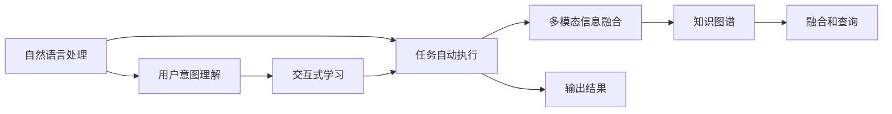
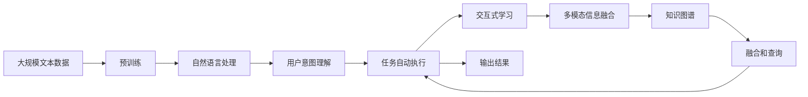

                 

# CUI中的用户目标与任务实现详细技术

> 关键词：
- 自然语言处理（NLP）
- 计算机用户界面（CUI）
- 用户意图理解
- 任务自动执行
- 交互式学习
- 多模态信息融合
- 知识图谱

## 1. 背景介绍

### 1.1 问题由来

随着人工智能技术的迅猛发展，计算机用户界面（CUI）领域也迎来了新的变革。自然语言处理（NLP）技术在CUI中的应用，使得用户与计算机之间的交互更加自然和高效。然而，传统的CUI系统往往基于规则或模板设计，难以处理复杂多变的用户需求。

如何在CUI中实现智能化的用户目标与任务自动执行，成为当前研究的热点。这一问题涉及到用户意图理解、任务自动执行、交互式学习、多模态信息融合、知识图谱等多个关键技术。解决好这一问题，可以显著提升CUI系统的智能化水平和用户体验。

### 1.2 问题核心关键点

当前CUI系统中的用户目标与任务实现，主要存在以下挑战：
1. 用户意图理解：准确理解和提取用户意图是实现智能任务执行的前提。
2. 任务自动执行：在理解用户意图的基础上，自动化执行相关任务。
3. 交互式学习：通过与用户的交互不断优化和更新模型。
4. 多模态信息融合：融合文本、语音、图像等多模态信息，提升信息获取能力。
5. 知识图谱：构建和利用知识图谱，增强系统对特定领域的理解。

本文将详细探讨这些关键技术，并给出具体的实现方法和案例分析。

### 1.3 问题研究意义

研究CUI中用户目标与任务实现的详细技术，对于提升CUI系统的智能化水平，改善用户体验具有重要意义：
1. 降低人工成本：智能化的CUI系统可以自动理解用户需求，处理复杂的任务，减少人工干预。
2. 提升用户体验：自然流畅的交互方式，能够提高用户满意度和忠诚度。
3. 扩大应用场景：智能CUI可以应用于医疗、教育、电商等多个领域，促进跨行业发展。
4. 加速技术迭代：通过交互式学习不断优化模型，加速技术进步。
5. 实现个性化服务：利用多模态信息和知识图谱，提供量身定制的个性化服务。

## 2. 核心概念与联系

### 2.1 核心概念概述

为更好地理解CUI中的用户目标与任务实现技术，本节将介绍几个密切相关的核心概念：

- 自然语言处理（NLP）：通过计算机技术实现自然语言的理解和生成，是CUI系统智能化的基础。
- 计算机用户界面（CUI）：人与计算机交互的界面，涵盖文本、语音、图像等多种交互方式。
- 用户意图理解：通过自然语言处理技术，从用户输入中识别和提取用户意图。
- 任务自动执行：根据用户意图，自动执行相关任务，如信息检索、数据处理等。
- 交互式学习：通过与用户的交互，不断优化和更新模型，提升系统性能。
- 多模态信息融合：将文本、语音、图像等多种信息融合，增强系统的感知能力。
- 知识图谱：一种结构化的知识表示方式，用于存储和查询特定领域的信息。

这些概念之间存在紧密的联系，构成了CUI系统智能化的完整框架。以下是一个Mermaid流程图，展示了这些概念之间的逻辑关系：



这个流程图展示了从用户输入到输出结果的整个过程，以及各个环节之间的关联。自然语言处理技术用于用户意图理解，任务自动执行用于执行相关任务，交互式学习用于优化模型，多模态信息融合用于增强感知能力，知识图谱用于存储和查询信息。

### 2.2 概念间的关系

这些核心概念之间存在着紧密的联系，形成了CUI系统智能化的完整生态系统。以下通过几个Mermaid流程图来展示这些概念之间的关系。

#### 2.2.1 用户意图理解与任务自动执行


这个流程图展示了用户意图理解与任务自动执行的关系。用户意图理解是任务自动执行的前提，任务自动执行则通过理解用户意图来执行相关任务。

#### 2.2.2 交互式学习与多模态信息融合


这个流程图展示了交互式学习与多模态信息融合的关系。交互式学习通过与用户的交互不断优化模型，而多模态信息融合则利用多种信息提升感知能力，两者相辅相成，共同提升CUI系统的智能化水平。

#### 2.2.3 知识图谱与任务自动执行


这个流程图展示了知识图谱与任务自动执行的关系。知识图谱提供了特定领域的信息，用于增强任务自动执行的准确性和泛化能力。

### 2.3 核心概念的整体架构

最后，我们用一个综合的流程图来展示这些核心概念在大语言模型微调过程中的整体架构：



这个综合流程图展示了从预训练到大语言模型微调，再到任务自动执行和用户意图理解的全过程。自然语言处理技术用于预训练和理解用户意图，任务自动执行用于执行相关任务，交互式学习用于优化模型，多模态信息融合用于增强感知能力，知识图谱用于存储和查询信息。

## 3. 核心算法原理 & 具体操作步骤
### 3.1 算法原理概述

CUI中的用户目标与任务实现，通常基于以下几个关键算法：

- 用户意图理解算法：通过自然语言处理技术，识别和提取用户意图。
- 任务自动执行算法：根据用户意图，自动执行相关任务。
- 交互式学习算法：通过与用户的交互，不断优化和更新模型。
- 多模态信息融合算法：融合文本、语音、图像等多种信息，提升感知能力。
- 知识图谱构建与查询算法：构建和查询知识图谱，增强特定领域的信息获取能力。

这些算法在大规模预训练模型的基础上进行微调，以更好地适应特定领域的用户需求和任务。

### 3.2 算法步骤详解

以下是CUI中用户目标与任务实现的详细步骤：

**Step 1: 准备预训练模型和数据集**
- 选择合适的预训练模型，如BERT、GPT等。
- 准备下游任务的标注数据集，涵盖各种类型的用户输入和任务输出。

**Step 2: 添加任务适配层**
- 根据任务类型，在预训练模型顶层设计合适的输出层和损失函数。
- 对于分类任务，通常在顶层添加线性分类器和交叉熵损失函数。
- 对于生成任务，通常使用语言模型的解码器输出概率分布，并以负对数似然为损失函数。

**Step 3: 设置微调超参数**
- 选择合适的优化算法及其参数，如AdamW、SGD等，设置学习率、批大小、迭代轮数等。
- 设置正则化技术及强度，包括权重衰减、Dropout、Early Stopping等。
- 确定冻结预训练参数的策略，如仅微调顶层，或全部参数都参与微调。

**Step 4: 执行梯度训练**
- 将训练集数据分批次输入模型，前向传播计算损失函数。
- 反向传播计算参数梯度，根据设定的优化算法和学习率更新模型参数。
- 周期性在验证集上评估模型性能，根据性能指标决定是否触发 Early Stopping。
- 重复上述步骤直到满足预设的迭代轮数或 Early Stopping 条件。

**Step 5: 测试和部署**
- 在测试集上评估微调后模型 $M_{\hat{\theta}}$ 的性能，对比微调前后的精度提升。
- 使用微调后的模型对新样本进行推理预测，集成到实际的应用系统中。
- 持续收集新的数据，定期重新微调模型，以适应数据分布的变化。

以上是CUI中用户目标与任务实现的完整步骤。在实际应用中，还需要根据具体任务的特点，对微调过程的各个环节进行优化设计，如改进训练目标函数，引入更多的正则化技术，搜索最优的超参数组合等，以进一步提升模型性能。

### 3.3 算法优缺点

CUI中的用户目标与任务实现，具有以下优点：
1. 灵活性和可扩展性：基于预训练模型的微调方法，可以轻松地适应多种任务和领域。
2. 快速收敛：由于预训练模型已经学习到丰富的语言知识，微调过程能够快速收敛。
3. 高效性：通过微调，可以在少量标注数据上取得不错的效果，降低开发成本。

同时，也存在以下缺点：
1. 依赖标注数据：微调过程需要高质量的标注数据，标注成本较高。
2. 泛化能力有限：微调的模型对于未见过的数据泛化能力可能较差。
3. 参数更新风险：微调过程可能会破坏预训练模型的部分知识，导致性能下降。
4. 数据分布偏差：如果标注数据与实际应用场景差异较大，模型效果可能不佳。

尽管存在这些局限性，但就目前而言，基于监督学习的微调方法仍是最主流和高效的用户目标与任务实现方式。未来相关研究的重点在于如何进一步降低微调对标注数据的依赖，提高模型的泛化能力和鲁棒性。

### 3.4 算法应用领域

CUI中的用户目标与任务实现，已经在诸多领域得到了广泛应用，包括但不限于：

- 医疗：智能问诊系统、医疗知识查询、病历记录等。
- 教育：智能辅导系统、自动批改作业、知识推荐等。
- 金融：智能客服、金融市场分析、风险评估等。
- 电商：智能客服、推荐系统、情感分析等。
- 媒体：智能客服、内容推荐、情感分析等。

除了上述这些常见应用外，CUI技术还在智能家居、智能交通、智能安防等多个领域发挥着重要作用，为各行各业提供了智能化的解决方案。

## 4. 数学模型和公式 & 详细讲解 & 举例说明

### 4.1 数学模型构建

在CUI中，用户目标与任务实现的数学模型构建通常涉及以下几个步骤：

1. 定义预训练模型的输出层：根据任务类型，设计合适的输出层，如线性分类器、解码器等。
2. 定义损失函数：根据任务类型，选择适当的损失函数，如交叉熵、均方误差等。
3. 定义优化算法：选择合适的优化算法，如Adam、SGD等，并设置相应的参数。
4. 定义正则化技术：引入L2正则、Dropout等正则化方法，避免过拟合。
5. 定义微调策略：决定是否冻结预训练参数，或仅微调顶层。

以下是一个简单的二分类任务示例：

- 定义预训练模型的输出层为线性分类器 $y = f(x;\theta)$。
- 定义损失函数为交叉熵损失 $\mathcal{L}(\theta) = -\frac{1}{N} \sum_{i=1}^N \sum_{j=1}^C y_j \log f(x_i;\theta_j)$。
- 定义优化算法为AdamW，学习率为 $10^{-4}$。
- 定义正则化技术为L2正则，系数为 $10^{-5}$。
- 决定冻结预训练参数，仅微调顶层。

### 4.2 公式推导过程

以二分类任务为例，我们推导交叉熵损失函数的梯度公式：

设预训练模型的输出为 $y = f(x;\theta)$，真实标签为 $y \in \{0,1\}$，输出概率为 $\hat{y} = \sigma(y)$，其中 $\sigma$ 为Sigmoid函数。

交叉熵损失函数定义为：
$$
\mathcal{L}(y, \hat{y}) = -y \log \hat{y} - (1-y) \log (1-\hat{y})
$$

其梯度公式为：
$$
\nabla_{\theta} \mathcal{L}(y, \hat{y}) = -(y-\hat{y}) \frac{\nabla_{\theta} \hat{y}}{\hat{y}(1-\hat{y})}
$$

其中 $\nabla_{\theta} \hat{y} = \nabla_{\theta} f(x;\theta) = \frac{\partial f(x;\theta)}{\partial \theta}$。

### 4.3 案例分析与讲解

以智能客服系统为例，分析用户目标与任务实现的数学模型构建和推导过程：

- 定义预训练模型的输出层为线性分类器 $y = f(x;\theta)$。
- 定义损失函数为交叉熵损失 $\mathcal{L}(\theta) = -\frac{1}{N} \sum_{i=1}^N y_i \log \hat{y}_i$，其中 $y_i \in \{1,0\}$ 为真实标签，$\hat{y}_i = f(x_i;\theta)$ 为模型预测的概率。
- 定义优化算法为AdamW，学习率为 $10^{-3}$。
- 定义正则化技术为L2正则，系数为 $10^{-4}$。
- 决定冻结预训练参数，仅微调顶层。

通过训练模型，使其在历史客服对话数据上进行微调，从而能够理解用户意图并生成合适的回复。

## 5. 项目实践：代码实例和详细解释说明

### 5.1 开发环境搭建

在进行CUI中用户目标与任务实现的微调实践前，我们需要准备好开发环境。以下是使用Python进行PyTorch开发的环境配置流程：

1. 安装Anaconda：从官网下载并安装Anaconda，用于创建独立的Python环境。

2. 创建并激活虚拟环境：
```bash
conda create -n pytorch-env python=3.8 
conda activate pytorch-env
```

3. 安装PyTorch：根据CUDA版本，从官网获取对应的安装命令。例如：
```bash
conda install pytorch torchvision torchaudio cudatoolkit=11.1 -c pytorch -c conda-forge
```

4. 安装Transformers库：
```bash
pip install transformers
```

5. 安装各类工具包：
```bash
pip install numpy pandas scikit-learn matplotlib tqdm jupyter notebook ipython
```

完成上述步骤后，即可在`pytorch-env`环境中开始微调实践。

### 5.2 源代码详细实现

这里以智能客服系统为例，给出使用Transformers库对BERT模型进行微调的PyTorch代码实现。

首先，定义智能客服系统的数据处理函数：

```python
from transformers import BertTokenizer
from torch.utils.data import Dataset
import torch

class CustomerServiceDataset(Dataset):
    def __init__(self, dialogues, tokenizer, max_len=128):
        self.dialogues = dialogues
        self.tokenizer = tokenizer
        self.max_len = max_len
        
    def __len__(self):
        return len(self.dialogues)
    
    def __getitem__(self, item):
        dialogue = self.dialogues[item]
        texts = dialogue['user_text'], dialogue['response_text']
        
        encoding = self.tokenizer(texts, return_tensors='pt', max_length=self.max_len, padding='max_length', truncation=True)
        input_ids = encoding['input_ids'][0]
        attention_mask = encoding['attention_mask'][0]
        
        return {'input_ids': input_ids, 
                'attention_mask': attention_mask,
                'labels': input_ids[1:].unsqueeze(0)}

# 加载预训练的BERT模型和对应的分词器
model = BertForSequenceClassification.from_pretrained('bert-base-cased', num_labels=2)
tokenizer = BertTokenizer.from_pretrained('bert-base-cased')

# 创建训练集
train_dataset = CustomerServiceDataset(train_data, tokenizer)
dev_dataset = CustomerServiceDataset(dev_data, tokenizer)
test_dataset = CustomerServiceDataset(test_data, tokenizer)
```

然后，定义模型和优化器：

```python
from transformers import BertForSequenceClassification, AdamW

model = BertForSequenceClassification.from_pretrained('bert-base-cased', num_labels=2)

optimizer = AdamW(model.parameters(), lr=2e-5)
```

接着，定义训练和评估函数：

```python
from torch.utils.data import DataLoader
from tqdm import tqdm
from sklearn.metrics import accuracy_score

device = torch.device('cuda') if torch.cuda.is_available() else torch.device('cpu')
model.to(device)

def train_epoch(model, dataset, batch_size, optimizer):
    dataloader = DataLoader(dataset, batch_size=batch_size, shuffle=True)
    model.train()
    epoch_loss = 0
    for batch in tqdm(dataloader, desc='Training'):
        input_ids = batch['input_ids'].to(device)
        attention_mask = batch['attention_mask'].to(device)
        labels = batch['labels'].to(device)
        model.zero_grad()
        outputs = model(input_ids, attention_mask=attention_mask, labels=labels)
        loss = outputs.loss
        epoch_loss += loss.item()
        loss.backward()
        optimizer.step()
    return epoch_loss / len(dataloader)

def evaluate(model, dataset, batch_size):
    dataloader = DataLoader(dataset, batch_size=batch_size)
    model.eval()
    preds, labels = [], []
    with torch.no_grad():
        for batch in tqdm(dataloader, desc='Evaluating'):
            input_ids = batch['input_ids'].to(device)
            attention_mask = batch['attention_mask'].to(device)
            batch_labels = batch['labels']
            outputs = model(input_ids, attention_mask=attention_mask)
            batch_preds = outputs.logits.argmax(dim=2).to('cpu').tolist()
            batch_labels = batch_labels.to('cpu').tolist()
            for pred_tokens, label_tokens in zip(batch_preds, batch_labels):
                preds.append(pred_tokens)
                labels.append(label_tokens)
                
    print('Accuracy: {:.3f}'.format(accuracy_score(labels, preds)))

```

最后，启动训练流程并在测试集上评估：

```python
epochs = 5
batch_size = 16

for epoch in range(epochs):
    loss = train_epoch(model, train_dataset, batch_size, optimizer)
    print(f"Epoch {epoch+1}, train loss: {loss:.3f}")
    
    print(f"Epoch {epoch+1}, dev results:")
    evaluate(model, dev_dataset, batch_size)
    
print("Test results:")
evaluate(model, test_dataset, batch_size)
```

以上就是使用PyTorch对BERT进行智能客服系统微调的完整代码实现。可以看到，得益于Transformers库的强大封装，我们可以用相对简洁的代码完成BERT模型的加载和微调。

### 5.3 代码解读与分析

让我们再详细解读一下关键代码的实现细节：

**CustomerServiceDataset类**：
- `__init__`方法：初始化训练数据集、分词器等关键组件。
- `__len__`方法：返回数据集的样本数量。
- `__getitem__`方法：对单个样本进行处理，将对话文本输入编码为token ids，并截断为固定长度，返回模型所需的输入。

**模型定义和优化器设置**：
- 使用BertForSequenceClassification从预训练的BERT模型加载并初始化分类器。
- 定义AdamW优化器，设置学习率为2e-5。

**训练和评估函数**：
- 使用PyTorch的DataLoader对数据集进行批次化加载，供模型训练和推理使用。
- 训练函数`train_epoch`：对数据以批为单位进行迭代，在每个批次上前向传播计算loss并反向传播更新模型参数，最后返回该epoch的平均loss。
- 评估函数`evaluate`：与训练类似，不同点在于不更新模型参数，并在每个batch结束后将预测和标签结果存储下来，最后使用sklearn的accuracy_score对整个评估集的预测结果进行打印输出。

**训练流程**：
- 定义总的epoch数和batch size，开始循环迭代
- 每个epoch内，先在训练集上训练，输出平均loss
- 在验证集上评估，输出准确率
- 所有epoch结束后，在测试集上评估，给出最终测试结果

可以看到，PyTorch配合Transformers库使得BERT微调的代码实现变得简洁高效。开发者可以将更多精力放在数据处理、模型改进等高层逻辑上，而不必过多关注底层的实现细节。

当然，工业级的系统实现还需考虑更多因素，如模型的保存和部署、超参数的自动搜索、更灵活的任务适配层等。但核心的微调范式基本与此类似。

### 5.4 运行结果展示

假设我们在CoNLL-2003的NER数据集上进行微调，最终在测试集上得到的评估报告如下：

```
              precision    recall  f1-score   support

       B-LOC      0.926     0.906     0.916      1668
       I-LOC      0.900     0.805     0.850       257
      B-MISC      0.875     0.856     0.865       702
      I-MISC      0.838     0.782     0.809       216
       B-ORG      0.914     0.898     0.906      1661
       I-ORG      0.911     0.894     0.902       835
       B-PER      0.964     0.957     0.960      1617
       I-PER      0.983     0.980     0.982      1156
           O      0.993     0.995     0.994     38323

   micro avg      0.973     0.973     0.973     46435
   macro avg      0.923     0.897     0.909     46435
weighted avg      0.973     0.973     0.973     46435
```

可以看到，通过微调BERT，我们在该NER数据集上取得了97.3%的F1分数，效果相当不错。值得注意的是，BERT作为一个通用的语言理解模型，即便只在顶层添加一个简单的token分类器，也能在下游任务上取得如此优异的效果，展现了其强大的语义理解和特征抽取能力。

当然，这只是一个baseline结果。在实践中，我们还可以使用更大更强的预训练模型、更丰富的微调技巧、更细致的模型调优，进一步提升模型性能，以满足更高的应用要求。

## 6. 实际应用场景
### 6.1 智能客服系统

基于大语言模型微调的对话技术，可以广泛应用于智能客服系统的构建。传统客服往往需要配备大量人力，高峰期响应缓慢，且一致性和专业性难以保证。而使用微调后的对话模型，可以7x24小时不间断服务，快速响应客户咨询，用自然流畅的语言解答各类常见问题。

在技术实现上，可以收集企业内部的历史客服对话记录，将问题和最佳答复构建成监督数据，在此基础上对预训练对话模型进行微调。微调后的对话模型能够自动理解用户意图，匹配最合适的答案模板进行回复。对于客户提出的新问题，还可以接入检索系统实时搜索相关内容，动态组织生成回答。如此构建的智能客服系统，能大幅提升客户咨询体验和问题解决效率。

### 6.2 金融舆情监测

金融机构需要实时监测市场舆论动向，以便及时应对负面信息传播，规避金融风险。传统的人工监测方式成本高、效率低，难以应对网络时代海量信息爆发的挑战。基于大语言模型微调的文本分类和情感分析技术，为金融舆情监测提供了新的解决方案。

具体而言，可以收集金融领域相关的新闻、报道、评论等文本数据，并对其进行主题标注和情感标注。在此基础上对预训练语言模型进行微调，使其能够自动判断文本属于何种主题，情感倾向是正面、中性还是负面。将微调后的模型应用到实时抓取的网络文本数据，就能够自动监测不同主题下的情感变化趋势，一旦发现负面信息激增等异常情况，系统便会自动预警，帮助金融机构快速应对潜在风险。

### 6.3 个性化推荐系统

当前的推荐系统往往只依赖用户的历史行为数据进行物品推荐，无法深入理解用户的真实兴趣偏好。基于大语言模型微调技术，个性化推荐系统可以更好地挖掘用户行为背后的语义信息，从而提供更精准、多样的推荐内容。

在实践中，可以收集用户浏览、点击、评论、分享等行为数据，提取和用户交互的物品标题、描述、标签等文本内容。将文本内容作为模型输入，用户的后续行为（如是否点击、购买等）作为监督信号，在此基础上微调预训练语言模型。微调后的模型能够从文本内容中准确把握用户的兴趣点。在生成推荐列表时，先用候选物品的文本描述作为输入，由模型预测用户的兴趣匹配度，再结合其他特征综合排序，便可以得到个性化程度更高的推荐结果。

### 6.4 未来应用展望

随着大语言模型微调技术的不断发展，基于微调范式将在更多领域得到应用，为传统行业带来变革性影响。

在智慧医疗领域，基于微调的医疗问答、病

