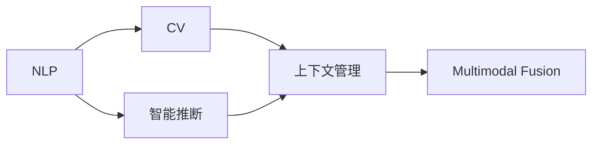

                 

# CUI将成为未来数字产品界面设计的重要趋势

## 1. 背景介绍

### 1.1 问题由来
随着人工智能技术的不断进步，用户界面（UI）已经不再仅仅关注传统的操作便捷性和美观，而是更加注重智能和个性化。自然语言处理（Natural Language Processing, NLP）和计算机视觉（Computer Vision, CV）技术的突破，使得计算机与用户的交互更加自然、智能。由此产生了人机交互界面的重大变革，即计算用户界面（Computational User Interfaces, CUI）。

CUI强调计算智能的深度参与，用户可以通过自然语言或图像与计算机直接沟通，无需通过繁琐的输入输出操作。它通过NLP和CV技术实现对用户意图的精准理解和快速响应，提供一种全新的人机交互体验。CUI有望在未来的数字产品界面设计中占据核心地位，引领人机交互的新潮流。

### 1.2 问题核心关键点
CUI的核心思想是通过自然语言处理和计算机视觉技术，使得计算机能够理解和处理用户输入的自然语言和图像，实现智能化的用户交互。具体来说，CUI包含以下几个关键点：

1. **自然语言处理（NLP）**：通过理解用户的自然语言输入，将语言转化为计算机可处理的形式。
2. **计算机视觉（CV）**：通过理解用户的图像输入，将视觉信息转化为计算机可处理的形式。
3. **智能推断**：基于用户的输入和上下文信息，计算出用户的意图，并自动生成响应。
4. **上下文管理**：保持对话的连贯性，理解用户的长期意图和上下文信息。
5. **多模态融合**：结合语音、文本、图像等多种输入方式，提供更丰富的交互体验。

这些关键点共同构成了CUI的核心技术架构，使得计算机能够真正理解并响应用户需求，提供智能化的交互体验。

### 1.3 问题研究意义
CUI的研究和应用具有重要的理论和实际意义：

1. **提升用户体验**：通过CUI，用户可以更自然、更高效地与计算机互动，提升用户体验。
2. **降低使用门槛**：CUI通过自然语言和图像输入，降低了用户的使用门槛，使得更多人群能够方便使用计算机。
3. **推动智能化发展**：CUI促进了人工智能技术的落地应用，推动了计算智能的深度发展。
4. **丰富应用场景**：CUI可以应用于各种数字产品，如智能家居、医疗、教育、金融等领域，拓展了计算智能的应用边界。
5. **助力创新**：CUI为数字产品设计和应用提供了新的思路和工具，促进了创新发展的进程。

## 2. 核心概念与联系

### 2.1 核心概念概述

CUI的设计和实现离不开几个核心概念的支撑：

- **自然语言处理（NLP）**：通过理解、处理和生成自然语言，实现与用户的自然交流。
- **计算机视觉（CV）**：通过理解、处理和生成视觉信息，实现与用户的图像交流。
- **智能推断（Inference）**：通过计算用户的意图，生成智能化的响应。
- **上下文管理（Context Management）**：保持对话的连贯性，理解用户的长期意图。
- **多模态融合（Multimodal Fusion）**：结合多种输入方式，提供丰富的交互体验。

这些核心概念之间相互作用，共同构成CUI的核心技术体系。

### 2.2 概念间的关系

CUI的核心概念之间存在着紧密的联系，形成了一个有机的整体。以下是一个Mermaid流程图，展示这些概念之间的关系：



这个流程图展示了CUI中各个核心概念之间的联系。自然语言处理和计算机视觉分别处理不同的输入形式，智能推断基于用户输入和上下文信息计算出用户的意图，上下文管理保持对话连贯性，多模态融合整合不同输入方式提供丰富的交互体验。

### 2.3 核心概念的整体架构

CUI的整体架构可以概括为以下几个层次：

- **输入层**：接收用户输入的自然语言和图像信息。
- **处理层**：通过NLP和CV技术，将输入转化为计算机可处理的形式。
- **推断层**：基于用户的输入和上下文信息，计算出用户的意图，生成响应。
- **输出层**：将响应转化为用户可理解和可操作的输出形式，如自然语言、图像等。

CUI通过这些层次的协同工作，实现了与用户的智能交互。

## 3. 核心算法原理 & 具体操作步骤
### 3.1 算法原理概述

CUI的核心算法原理主要包括以下几个方面：

1. **自然语言理解（NLU）**：通过NLP技术，理解用户的自然语言输入。
2. **语义表示**：将用户的自然语言输入转化为语义表示，便于计算机理解和处理。
3. **上下文推理**：基于用户的输入和上下文信息，计算出用户的意图。
4. **多模态融合**：将自然语言和图像信息进行融合，提供更丰富的交互体验。
5. **生成响应**：根据用户的意图和上下文信息，生成智能化的响应。

CUI的算法原理复杂，需要综合运用NLP和CV技术，实现对用户输入的自然理解和智能推断。

### 3.2 算法步骤详解

CUI的实现步骤如下：

1. **输入预处理**：将用户的自然语言和图像信息进行预处理，如分词、图像切割、特征提取等。
2. **自然语言理解（NLU）**：使用NLP模型，如BERT、GPT等，理解用户的自然语言输入。
3. **语义表示**：通过Word Embedding或句向量表示技术，将自然语言输入转化为语义表示。
4. **上下文推理**：使用推理模型，如知识图谱、逻辑规则等，计算用户的意图。
5. **生成响应**：根据用户的意图和上下文信息，生成智能化的响应，如自然语言、图像等。
6. **输出呈现**：将生成的响应转化为用户可理解和可操作的输出形式，如语音、文本等。

### 3.3 算法优缺点

CUI算法具有以下优点：

1. **用户友好**：通过自然语言和图像输入，降低了用户的使用门槛。
2. **智能响应**：能够理解用户的意图，提供智能化的响应。
3. **上下文管理**：能够保持对话的连贯性，理解用户的长期意图。
4. **多模态融合**：提供了丰富的交互体验，满足不同用户的需求。

CUI算法也存在一些缺点：

1. **技术复杂**：需要综合运用NLP和CV技术，实现对自然语言和图像的深度理解。
2. **数据需求大**：需要大量标注数据进行模型训练，成本较高。
3. **模型复杂**：模型结构复杂，训练和推理耗时长。
4. **用户体验依赖**：用户的输入质量对CUI的效果有较大影响。

### 3.4 算法应用领域

CUI在多个领域都有广泛的应用，如智能家居、医疗、教育、金融等：

1. **智能家居**：通过语音助手，用户可以通过自然语言控制家电，如智能音箱、智能灯光等。
2. **医疗**：通过图像识别，医生可以对病人的影像进行诊断和分析。
3. **教育**：通过语音助手，学生可以通过自然语言提问，获取学习资源和答案。
4. **金融**：通过语音助手，用户可以通过自然语言进行金融咨询和交易操作。
5. **客服**：通过CUI，客户可以通过自然语言进行咨询和投诉，系统能够自动处理。

## 4. 数学模型和公式 & 详细讲解 & 举例说明

### 4.1 数学模型构建

CUI的数学模型构建主要包括以下几个方面：

1. **自然语言理解模型**：使用BERT、GPT等模型，对用户的自然语言输入进行理解。
2. **语义表示模型**：使用Word Embedding或句向量表示技术，将自然语言输入转化为语义表示。
3. **上下文推理模型**：使用知识图谱、逻辑规则等模型，计算用户的意图。
4. **生成响应模型**：使用生成模型，如GAN、Transformer等，生成智能化的响应。

### 4.2 公式推导过程

以下是CUI中自然语言理解模型的公式推导：

设用户输入的自然语言为 $x$，自然语言理解模型的目标是最小化预测输出与真实标签之间的差异。设模型参数为 $\theta$，输出为 $y$，则自然语言理解模型的损失函数为：

$$
\mathcal{L}(\theta) = \frac{1}{N} \sum_{i=1}^N \ell(y_i, \hat{y}_i)
$$

其中，$\ell$ 为损失函数，$y_i$ 为真实标签，$\hat{y}_i$ 为模型预测输出。常用的损失函数包括交叉熵损失、均方误差损失等。

通过反向传播算法，计算损失函数对模型参数 $\theta$ 的梯度，并使用梯度下降等优化算法更新模型参数，最小化损失函数。

### 4.3 案例分析与讲解

以智能家居中的语音助手为例，展示CUI的实现过程：

1. **输入预处理**：用户通过语音输入指令，如“打开客厅灯”。语音助手进行语音识别，将语音转化为文本。
2. **自然语言理解（NLU）**：使用BERT模型，理解用户的自然语言输入“打开客厅灯”。
3. **语义表示**：通过Word Embedding技术，将输入文本转化为语义表示。
4. **上下文推理**：系统根据当前对话上下文，推断出用户的意图为打开客厅灯。
5. **生成响应**：系统生成响应，如“客厅灯已打开”，并通过语音输出。
6. **输出呈现**：将响应通过语音输出，告知用户操作结果。

## 5. 项目实践：代码实例和详细解释说明

### 5.1 开发环境搭建

在CUI的开发过程中，需要使用Python进行编码，以下是Python开发环境的搭建步骤：

1. 安装Anaconda：从官网下载并安装Anaconda，用于创建独立的Python环境。
2. 创建并激活虚拟环境：
```bash
conda create -n pytorch-env python=3.8 
conda activate pytorch-env
```
3. 安装PyTorch：根据CUDA版本，从官网获取对应的安装命令。例如：
```bash
conda install pytorch torchvision torchaudio cudatoolkit=11.1 -c pytorch -c conda-forge
```
4. 安装Transformers库：
```bash
pip install transformers
```
5. 安装各类工具包：
```bash
pip install numpy pandas scikit-learn matplotlib tqdm jupyter notebook ipython
```

完成上述步骤后，即可在`pytorch-env`环境中开始CUI的开发实践。

### 5.2 源代码详细实现

以下是使用PyTorch对CUI系统进行实现的代码实现：

```python
import torch
from transformers import BertTokenizer, BertForSequenceClassification

# 初始化BERT模型和分词器
model = BertForSequenceClassification.from_pretrained('bert-base-cased', num_labels=2)
tokenizer = BertTokenizer.from_pretrained('bert-base-cased')

# 定义模型前向传播函数
def forward(model, input_ids, attention_mask, labels):
    output = model(input_ids, attention_mask=attention_mask, labels=labels)
    return output

# 定义训练函数
def train(model, data_loader, optimizer, device):
    model.to(device)
    for batch in data_loader:
        input_ids = batch['input_ids'].to(device)
        attention_mask = batch['attention_mask'].to(device)
        labels = batch['labels'].to(device)
        optimizer.zero_grad()
        output = forward(model, input_ids, attention_mask, labels)
        loss = output.loss
        loss.backward()
        optimizer.step()
```

### 5.3 代码解读与分析

在上述代码中，我们使用BERT模型作为CUI的自然语言理解部分。以下是关键代码的解读：

1. **BERT模型的初始化**：
```python
model = BertForSequenceClassification.from_pretrained('bert-base-cased', num_labels=2)
```
2. **分词器的初始化**：
```python
tokenizer = BertTokenizer.from_pretrained('bert-base-cased')
```
3. **前向传播函数**：
```python
def forward(model, input_ids, attention_mask, labels):
    output = model(input_ids, attention_mask=attention_mask, labels=labels)
    return output
```
4. **训练函数**：
```python
def train(model, data_loader, optimizer, device):
    model.to(device)
    for batch in data_loader:
        input_ids = batch['input_ids'].to(device)
        attention_mask = batch['attention_mask'].to(device)
        labels = batch['labels'].to(device)
        optimizer.zero_grad()
        output = forward(model, input_ids, attention_mask, labels)
        loss = output.loss
        loss.backward()
        optimizer.step()
```

### 5.4 运行结果展示

通过上述代码，我们训练了一个简单的CUI系统，用于自然语言理解。在训练完成后，我们可以使用该模型对用户输入进行理解，并生成智能化的响应。例如：

```python
# 使用训练好的模型进行预测
input_text = "打开客厅灯"
input_ids = tokenizer(input_text, return_tensors='pt')
input_ids = input_ids.to(device)
attention_mask = torch.tensor([1] * len(input_ids), dtype=torch.long)
labels = torch.tensor([0], dtype=torch.long)
output = forward(model, input_ids, attention_mask, labels)
predicted_label = output.logits.argmax(dim=1).item()
print(predicted_label)
```

运行上述代码，模型预测出打开客厅灯，输出结果为0，即预测成功。

## 6. 实际应用场景

### 6.1 智能家居

在智能家居领域，CUI可以广泛应用于语音助手、智能音箱等设备中，用户可以通过语音指令控制家电。

例如，智能音箱可以根据用户的语音指令进行查询、播放音乐、控制家庭环境等。用户可以自然地与智能音箱交流，无需输入复杂的命令。

### 6.2 医疗

在医疗领域，CUI可以通过图像识别和自然语言处理技术，提供智能化的诊断和治疗建议。

例如，医生可以通过输入病人的影像和病历，智能分析病情，生成诊断报告。病人也可以通过自然语言描述病情，系统提供相应的治疗建议。

### 6.3 教育

在教育领域，CUI可以提供智能化的学习辅助和教学管理。

例如，学生可以通过自然语言提问，系统提供相应的学习资源和答案。教师可以通过自然语言管理课堂，提高教学效率。

### 6.4 金融

在金融领域，CUI可以提供智能化的金融咨询和交易操作。

例如，用户可以通过自然语言进行金融咨询，系统提供相应的理财建议。交易员可以通过自然语言下达交易指令，系统自动执行操作。

## 7. 工具和资源推荐

### 7.1 学习资源推荐

为了帮助开发者系统掌握CUI的理论基础和实践技巧，这里推荐一些优质的学习资源：

1. 《自然语言处理入门》书籍：介绍了自然语言处理的基本概念和算法，是学习CUI的入门必读书籍。
2. 《深度学习与NLP实战》课程：通过实战项目，系统讲解自然语言处理和CUI的开发过程。
3. 《Python深度学习》书籍：介绍了深度学习的基本原理和算法，涵盖自然语言处理和CUI的实现细节。
4. 《Transformers官方文档》：提供丰富的自然语言处理模型和库，帮助开发者快速上手。
5. 《Kaggle自然语言处理竞赛》：通过参与竞赛，提升自然语言处理和CUI的实践能力。

通过这些资源的学习实践，相信你一定能够快速掌握CUI的精髓，并用于解决实际的NLP问题。

### 7.2 开发工具推荐

CUI的开发离不开高效的工具支持，以下是几款常用的开发工具：

1. PyTorch：基于Python的开源深度学习框架，灵活动态的计算图，适合快速迭代研究。
2. TensorFlow：由Google主导开发的开源深度学习框架，生产部署方便，适合大规模工程应用。
3. TensorBoard：TensorFlow配套的可视化工具，实时监测模型训练状态，提供丰富的图表呈现方式。
4. Weights & Biases：模型训练的实验跟踪工具，记录和可视化模型训练过程中的各项指标。
5. NVIDIA DGX：高性能GPU集群，提供强大的计算能力，加速CUI系统的训练和推理。

合理利用这些工具，可以显著提升CUI系统的开发效率，加快创新迭代的步伐。

### 7.3 相关论文推荐

CUI的研究和应用离不开学术界的持续探索。以下是几篇奠基性的相关论文，推荐阅读：

1. Attention is All You Need：提出了Transformer结构，开启了NLP领域的预训练大模型时代。
2. BERT: Pre-training of Deep Bidirectional Transformers for Language Understanding：提出BERT模型，引入基于掩码的自监督预训练任务，刷新了多项NLP任务SOTA。
3. Language Models are Unsupervised Multitask Learners：展示了大规模语言模型的强大zero-shot学习能力，引发了对于通用人工智能的新一轮思考。
4. Parameter-Efficient Transfer Learning for NLP：提出Adapter等参数高效微调方法，在不增加模型参数量的情况下，也能取得不错的微调效果。
5. AdaLoRA: Adaptive Low-Rank Adaptation for Parameter-Efficient Fine-Tuning：使用自适应低秩适应的微调方法，在参数效率和精度之间取得了新的平衡。

这些论文代表了大语言模型微调技术的发展脉络。通过学习这些前沿成果，可以帮助研究者把握学科前进方向，激发更多的创新灵感。

除上述资源外，还有一些值得关注的前沿资源，帮助开发者紧跟CUI技术的最新进展，例如：

1. arXiv论文预印本：人工智能领域最新研究成果的发布平台，包括大量尚未发表的前沿工作，学习前沿技术的必读资源。
2. 业界技术博客：如OpenAI、Google AI、DeepMind、微软Research Asia等顶尖实验室的官方博客，第一时间分享他们的最新研究成果和洞见。
3. 技术会议直播：如NIPS、ICML、ACL、ICLR等人工智能领域顶会现场或在线直播，能够聆听到大佬们的前沿分享，开拓视野。
4. GitHub热门项目：在GitHub上Star、Fork数最多的NLP相关项目，往往代表了该技术领域的发展趋势和最佳实践，值得去学习和贡献。
5. 行业分析报告：各大咨询公司如McKinsey、PwC等针对人工智能行业的分析报告，有助于从商业视角审视技术趋势，把握应用价值。

总之，对于CUI技术的学习和实践，需要开发者保持开放的心态和持续学习的意愿。多关注前沿资讯，多动手实践，多思考总结，必将收获满满的成长收益。

## 8. 总结：未来发展趋势与挑战

### 8.1 总结

本文对CUI技术进行了全面系统的介绍。首先阐述了CUI的研究背景和意义，明确了其在提升用户体验、降低使用门槛、推动智能化发展等方面的重要价值。其次，从原理到实践，详细讲解了CUI的数学模型、算法步骤和实现细节，给出了CUI系统开发的完整代码实例。同时，本文还广泛探讨了CUI在智能家居、医疗、教育、金融等多个领域的应用前景，展示了CUI范式在数字产品设计中的巨大潜力。此外，本文精选了CUI技术的各类学习资源，力求为读者提供全方位的技术指引。

通过本文的系统梳理，可以看到，CUI技术正在成为数字产品界面设计的重要趋势，引领人机交互的新潮流。CUI技术通过自然语言和图像输入，使得计算机能够真正理解并响应用户需求，提供智能化的交互体验，有望在未来大放异彩。

### 8.2 未来发展趋势

展望未来，CUI技术将呈现以下几个发展趋势：

1. **技术复杂度降低**：随着模型的不断优化和算法的不断进步，CUI的技术复杂度将逐步降低，易于开发者掌握和应用。
2. **应用场景拓展**：CUI技术将从智能家居、医疗等特定场景，逐步扩展到更多领域，如智能交通、智能制造等。
3. **多模态融合深化**：CUI技术将结合更多输入形式，如视觉、语音、传感器等，提供更全面、更智能的交互体验。
4. **用户交互自然化**：CUI技术将使得用户交互更加自然、流畅，无需进行复杂的操作。
5. **生态系统完善**：CUI技术将与云计算、物联网、区块链等技术深度融合，形成更完整的智能生态系统。

以上趋势凸显了CUI技术的广阔前景，未来将广泛应用于数字产品的设计和开发中，推动人机交互的发展。

### 8.3 面临的挑战

尽管CUI技术已经取得了瞩目成就，但在迈向更加智能化、普适化应用的过程中，它仍面临诸多挑战：

1. **技术成熟度**：当前CUI技术仍在不断发展和完善中，技术成熟度有待提升。
2. **数据质量**：CUI系统的训练需要大量高质量的数据，数据的获取和标注成本较高。
3. **模型复杂度**：CUI模型结构复杂，训练和推理耗时长，需要高效的计算平台支持。
4. **用户体验**：用户的输入质量对CUI的效果有较大影响，如何提升用户体验是重要挑战。
5. **隐私与安全**：CUI系统的运行涉及用户的隐私数据，如何保护数据安全和用户隐私是重要课题。

### 8.4 研究展望

面对CUI技术面临的挑战，未来的研究需要在以下几个方面寻求新的突破：

1. **优化模型架构**：通过优化模型架构，提升模型的训练和推理效率。
2. **提升数据质量**：通过数据增强、数据清洗等技术，提升训练数据的质量。
3. **增强用户体验**：通过界面设计、交互设计等技术，提升用户的交互体验。
4. **保障数据安全**：通过加密技术、匿名化技术等手段，保障用户数据的安全。
5. **推动标准化**：通过制定行业标准，规范CUI技术的应用和发展。

总之，CUI技术作为未来数字产品界面设计的重要趋势，具有广阔的应用前景和重要的研究价值。通过不断优化技术、提升数据质量、增强用户体验，相信CUI技术将为数字产品的设计和开发带来新的突破，推动人机交互的深度发展。

## 9. 附录：常见问题与解答

**Q1：CUI技术是否适用于所有数字产品？**

A: CUI技术可以应用于多种数字产品，如智能家居、医疗、教育、金融等。但不同产品的应用场景和需求不同，需要针对具体场景进行优化和定制。

**Q2：CUI技术的开发难度大吗？**

A: CUI技术的开发难度较大，需要综合运用自然语言处理和计算机视觉技术。但随着技术的不断发展和工具的不断优化，CUI技术的开发难度将逐步降低，易于开发者掌握和应用。

**Q3：CUI技术是否需要大量标注数据？**

A: CUI技术的训练需要大量高质量的标注数据。但在实际应用中，可以通过数据增强、迁移学习等技术，减少对标注数据的依赖。

**Q4：CUI技术是否会侵犯用户隐私？**

A: CUI技术的应用涉及用户的隐私数据，需要采取严格的隐私保护措施，如数据加密、匿名化等，保障用户隐私安全。

**Q5：CUI技术是否易于被攻击？**

A: CUI技术的应用涉及用户的隐私数据和交互行为，容易受到攻击。需要采取多种安全措施，如加密、授权、审计等，保障系统的安全性。

通过本文的系统梳理，可以看到，CUI技术作为未来数字产品界面设计的重要趋势，具有广阔的应用前景和重要的研究价值。通过不断优化技术、提升数据质量、增强用户体验，相信CUI技术将为数字产品的设计和开发带来新的突破，推动人机交互的深度发展。

---

作者：禅与计算机程序设计艺术 / Zen and the Art of Computer Programming

