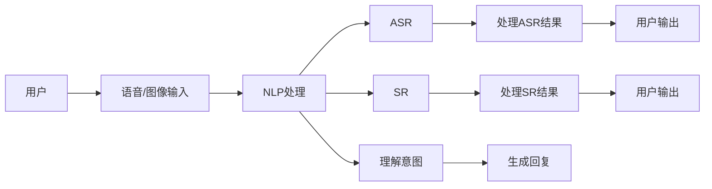
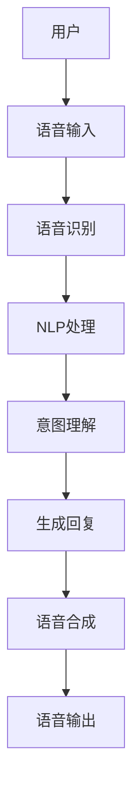
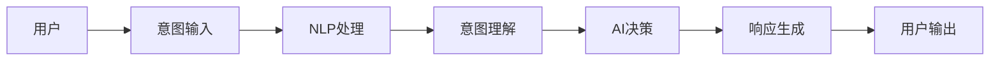
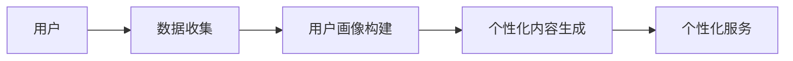

                 

# CUI将成为未来数字产品界面设计的重要趋势

> 关键词：计算机用户界面(CUI)，用户体验(UI/UX)，自然语言处理(NLP)，语音交互(ASR/SR), 虚拟助手，AI驱动，个性化，交互设计，人机协同

## 1. 背景介绍

### 1.1 问题由来
随着人工智能技术的快速发展，数字产品的界面设计也正经历一场革命性的变革。传统以图标、文字为媒介的用户界面(UI)已经逐渐被以语音、图像、自然语言为媒介的计算用户界面(CUI)所取代。CUI在提升用户体验、增强人机交互效率等方面展现出巨大的潜力和优势。

### 1.2 问题核心关键点
CUI的核心在于将AI技术与传统界面设计相结合，通过语音识别(ASR)、语音合成(SR)、自然语言处理(NLP)等技术，使得用户能够以更自然、直观的方式与数字产品进行互动。相较于传统的基于文字和图标的界面，CUI能够更好地理解用户的语义意图，提供更个性化的交互体验。

### 1.3 问题研究意义
研究CUI设计方法对于提升数字产品的用户满意度和交互效率，推动智能技术的普及应用，具有重要意义。CUI技术不仅能够缩短用户与机器之间的交互时间，还能够通过个性化定制，满足不同用户的需求，进一步激发用户的使用兴趣和黏性。

## 2. 核心概念与联系

### 2.1 核心概念概述

为更好地理解CUI技术及其应用，本节将介绍几个关键概念：

- **计算机用户界面(CUI)**：指以语音、图像、自然语言为输入输出媒介，通过AI技术实现人机互动的界面形式。CUI能够更好地理解用户的意图，提供更自然的交互体验。

- **自然语言处理(NLP)**：涉及语言信息的处理、理解和生成。NLP技术在CUI中用于解析用户输入的自然语言，提取关键信息，并生成相应的回应。

- **语音识别(ASR)与语音合成(SR)**：分别指将语音转换为文本和将文本转换为语音的技术。ASR和SR在CUI中用于处理用户的语音输入和输出，是CUI实现的核心技术。

- **人工智能(AI)驱动**：指通过深度学习、强化学习等AI技术，使得CUI具备自主学习、自我优化和智能适应的能力。

- **虚拟助手**：如Apple的Siri、Google Assistant等，是CUI技术的具体应用，能够提供语音、图像、自然语言等多种交互方式。

- **个性化交互**：指根据用户的行为、兴趣等信息，提供定制化的服务和内容，提升用户满意度和体验。

- **人机协同**：指在CUI设计中，机器与人类共同协作，提升互动效率和质量。

这些概念之间的关系可以用以下Mermaid流程图来展示：



这个流程图展示了CUI的基本工作流程：用户通过语音或图像输入，CUI系统通过NLP处理理解意图，并进行语音识别或合成，最终生成相应的回复。

### 2.2 概念间的关系

这些核心概念之间存在着紧密的联系，形成了CUI技术的完整生态系统。下面我们通过几个Mermaid流程图来展示这些概念之间的关系。

#### 2.2.1 CUI的界面架构



这个流程图展示了CUI的界面架构，用户通过语音输入，系统进行语音识别和NLP处理，理解用户意图并生成回复，最终通过语音合成输出。

#### 2.2.2 AI与CUI的交互流程



这个流程图展示了AI与CUI的交互流程，用户输入意图，系统进行NLP处理并理解意图，AI进行决策生成回复，最终输出给用户。

#### 2.2.3 CUI的个性化服务



这个流程图展示了CUI的个性化服务流程，系统收集用户数据构建用户画像，生成个性化内容，最终提供个性化服务。

## 3. 核心算法原理 & 具体操作步骤

### 3.1 算法原理概述

CUI的核心算法原理可以概括为以下几个步骤：

1. **语音识别(ASR)**：将用户的语音输入转换为文本，以便后续的NLP处理。
2. **自然语言处理(NLP)**：通过文本分析，理解用户的意图和需求。
3. **意图理解**：将NLP处理的结果映射为系统可执行的指令或查询。
4. **决策与回复生成**：根据意图理解和上下文信息，AI生成相应的回复或执行指令。
5. **语音合成(SR)**：将回复或指令转换为语音输出，完成交互循环。

### 3.2 算法步骤详解

以虚拟助手为例，详细阐述CUI的核心算法步骤：

1. **语音识别(ASR)**：
   - 用户通过语音输入指令或提问，如"帮我查明天北京天气"。
   - 语音识别系统将语音转换为文本，如"明天北京天气"。

2. **自然语言处理(NLP)**：
   - NLP系统分析文本，识别出"明天"、"北京"、"天气"等关键词，并理解用户意图为查询天气信息。
   - 通过查询知识库或调用天气API，获取北京的天气信息。

3. **意图理解**：
   - 意图理解模块将NLP处理的结果映射为系统可执行的指令，如"查询天气"。

4. **决策与回复生成**：
   - AI根据当前上下文和用户意图，生成合适的回复，如"北京明天的天气为晴天，最高温度28度，最低温度16度"。

5. **语音合成(SR)**：
   - 语音合成系统将生成的文本转换为语音，并输出给用户。

### 3.3 算法优缺点

**优点：**

1. **自然性**：CUI能够以更自然的方式与用户进行互动，使得交互更加人性化。
2. **智能性**：通过AI驱动的CUI，能够理解复杂的自然语言，提供个性化的服务。
3. **高效性**：CUI能够快速响应用户输入，提高人机交互效率。
4. **可扩展性**：CUI能够轻松集成到各种数字产品中，提供多种交互方式。

**缺点：**

1. **技术门槛高**：实现CUI需要高水平的技术和大量的数据支持，门槛较高。
2. **数据隐私问题**：用户语音数据和自然语言处理生成的文本数据涉及隐私，需要严格保护。
3. **多模态融合复杂**：将语音、图像、自然语言等多种模态进行融合，需要处理复杂的跨模态交互。

### 3.4 算法应用领域

CUI技术已经在多个领域得到了广泛应用，如智能家居、车载导航、智能客服、健康医疗等。具体应用场景包括：

- **智能家居**：通过语音助手控制家中的智能设备，如智能音箱、智能灯光等。
- **车载导航**：通过语音助手进行路线规划、目的地查询等。
- **智能客服**：通过语音识别和自然语言处理，提供7x24小时无间断服务。
- **健康医疗**：通过语音输入和自然语言处理，提供健康咨询、医疗预约等服务。
- **娱乐与媒体**：通过语音助手播放音乐、播客等音频内容，提供智能推荐。

## 4. 数学模型和公式 & 详细讲解 & 举例说明

### 4.1 数学模型构建

CUI系统涉及的数学模型包括语音识别、自然语言处理和语音合成的相关模型。下面分别介绍这些模型的构建过程。

**语音识别模型**：
- 目标：将语音信号转换为文本，通常使用深度神经网络，如卷积神经网络(CNN)、循环神经网络(RNN)、长短时记忆网络(LSTM)等。
- 损失函数：通常使用交叉熵损失函数，如CTC损失函数。
- 公式推导：
  $$
  \mathcal{L}_{CTC} = -\sum_{i=1}^T\sum_{j=1}^V p_{t,j}\log\hat{p}_{t,j}
  $$
  其中 $T$ 为时间步，$V$ 为词汇表大小，$p_{t,j}$ 为模型预测的当前时间步为 $j$ 的概率，$\hat{p}_{t,j}$ 为实际观测的词汇。

**自然语言处理模型**：
- 目标：理解自然语言，通常使用基于序列的模型，如循环神经网络(RNN)、Transformer等。
- 损失函数：通常使用交叉熵损失函数，如BLEU、ROUGE等。
- 公式推导：
  $$
  \mathcal{L}_{BLEU} = -\sum_{i=1}^T\sum_{j=1}^N \log p_{i,j}
  $$
  其中 $T$ 为序列长度，$N$ 为可能翻译的数量，$p_{i,j}$ 为模型在时间步 $i$ 预测的翻译结果。

**语音合成模型**：
- 目标：将文本转换为语音，通常使用生成对抗网络(GAN)、变分自编码器(VAE)等。
- 损失函数：通常使用重建损失函数，如L1损失、L2损失等。
- 公式推导：
  $$
  \mathcal{L}_{GAN} = \mathbb{E}_{z\sim p(z)}[d_{\text{adv}}(G(z))] + \mathbb{E}_{x\sim p(x)}[-d_{\text{adv}}(D(x))]
  $$
  其中 $G(z)$ 为生成器，$D(x)$ 为判别器，$d_{\text{adv}}(\cdot)$ 为生成器或判别器的判别损失函数。

### 4.2 公式推导过程

**语音识别模型**：
- 以卷积神经网络(CNN)为例，其网络结构如图：
  $$
  \text{CNN} = \begin{bmatrix}
  C_1 & \text{conv} & \text{maxpool} \\
  C_2 & \text{conv} & \text{maxpool} \\
  \vdots & \vdots & \vdots \\
  C_L & \text{conv} & \text{maxpool}
  \end{bmatrix}
  $$
  其中 $C_i$ 为第 $i$ 层卷积核，$\text{conv}$ 为卷积操作，$\text{maxpool}$ 为最大池化操作。

- 通过反向传播算法计算梯度，并更新模型参数。

**自然语言处理模型**：
- 以Transformer为例，其网络结构如图：
  $$
  \text{Transformer} = \begin{bmatrix}
  \text{Encoder} \\
  \text{Attention} \\
  \text{Decoder}
  \end{bmatrix}
  $$
  其中 $\text{Encoder}$ 为编码器，$\text{Attention}$ 为注意力机制，$\text{Decoder}$ 为解码器。

- 通过反向传播算法计算梯度，并更新模型参数。

**语音合成模型**：
- 以生成对抗网络(GAN)为例，其网络结构如图：
  $$
  \text{GAN} = \begin{bmatrix}
  G & D
  \end{bmatrix}
  $$
  其中 $G$ 为生成器，$D$ 为判别器。

- 通过反向传播算法计算梯度，并更新模型参数。

### 4.3 案例分析与讲解

以智能音箱为例，具体分析CUI系统的构建：

1. **语音识别**：智能音箱通过麦克风捕捉用户的语音输入，使用卷积神经网络进行特征提取和分类，将语音转换为文本。

2. **自然语言处理**：使用Transformer模型对文本进行分词、嵌入、编码和解码，理解用户的意图和需求。

3. **意图理解**：将Transformer模型的输出映射为系统可执行的指令，如播放音乐、查询天气等。

4. **决策与回复生成**：根据指令，调用相应的API或查询知识库，生成回复或执行指令。

5. **语音合成**：使用GAN模型将生成的回复或指令转换为语音，并输出给用户。

## 5. 项目实践：代码实例和详细解释说明

### 5.1 开发环境搭建

进行CUI项目实践前，需要准备以下开发环境：

1. **Python环境**：安装Python 3.7及以上版本。

2. **深度学习框架**：安装TensorFlow、PyTorch等深度学习框架。

3. **自然语言处理工具**：安装NLTK、spaCy、TensorFlow-Serving等自然语言处理工具。

4. **语音识别库**：安装PyAudio、PyTorch-ASR等语音识别库。

5. **语音合成库**：安装PyTorch-TTS等语音合成库。

完成上述步骤后，即可在Python环境中进行CUI项目开发。

### 5.2 源代码详细实现

下面以智能音箱为例，提供CUI系统的Python代码实现：

```python
import tensorflow as tf
import torch
import torch.nn as nn
from tensorflow.keras.layers import Dense, Dropout
from tensorflow.keras.models import Sequential
from tensorflow.keras.optimizers import Adam

# 语音识别模型
class CNNModel(tf.keras.Model):
    def __init__(self):
        super(CNNModel, self).__init__()
        self.conv1 = tf.keras.layers.Conv2D(64, 3, activation='relu')
        self.pool1 = tf.keras.layers.MaxPooling2D()
        self.conv2 = tf.keras.layers.Conv2D(128, 3, activation='relu')
        self.pool2 = tf.keras.layers.MaxPooling2D()
        self.flatten = tf.keras.layers.Flatten()
        self.fc1 = tf.keras.layers.Dense(128, activation='relu')
        self.fc2 = tf.keras.layers.Dense(10, activation='softmax')

    def call(self, x):
        x = self.conv1(x)
        x = self.pool1(x)
        x = self.conv2(x)
        x = self.pool2(x)
        x = self.flatten(x)
        x = self.fc1(x)
        x = self.fc2(x)
        return x

# 自然语言处理模型
class TransformerModel(nn.Module):
    def __init__(self, input_size, hidden_size, output_size, num_layers, dropout=0.5):
        super(TransformerModel, self).__init__()
        self.embedding = nn.Embedding(input_size, hidden_size)
        self.pos_encoder = PositionalEncoding(hidden_size)
        self.encoder = nn.Transformer(d_model=hidden_size, nhead=8, num_encoder_layers=num_layers, dropout=dropout)
        self.linear1 = nn.Linear(hidden_size, output_size)
        self.linear2 = nn.Linear(hidden_size, output_size)

    def forward(self, src):
        embed = self.embedding(src)
        pos_enc = self.pos_encoder(embed)
        src = self.encoder(pos_enc, pos_enc)
        src = self.linear1(src)
        output = self.linear2(src)
        return output

# 语音合成模型
class GANModel(nn.Module):
    def __init__(self):
        super(GANModel, self).__init__()
        self.encoder = nn.Sequential(
            nn.Linear(1, 256),
            nn.ReLU(),
            nn.Linear(256, 128),
            nn.ReLU(),
            nn.Linear(128, 1)
        )
        self.decoder = nn.Sequential(
            nn.Linear(1, 256),
            nn.ReLU(),
            nn.Linear(256, 128),
            nn.ReLU(),
            nn.Linear(128, 1)
        )

    def forward(self, x):
        x = self.encoder(x)
        x = self.decoder(x)
        return x

# 数据准备
train_data = ...
train_labels = ...
test_data = ...
test_labels = ...

# 语音识别模型训练
model = CNNModel()
optimizer = Adam(learning_rate=0.001)
loss_fn = tf.keras.losses.CategoricalCrossentropy()
for epoch in range(10):
    for x, y in train_data:
        with tf.GradientTape() as tape:
            logits = model(x)
            loss = loss_fn(y, logits)
        grads = tape.gradient(loss, model.trainable_variables)
        optimizer.apply_gradients(zip(grads, model.trainable_variables))

# 自然语言处理模型训练
model = TransformerModel(input_size=10000, hidden_size=256, output_size=2, num_layers=3)
criterion = nn.CrossEntropyLoss()
optimizer = torch.optim.Adam(model.parameters(), lr=0.001)
for epoch in range(10):
    for i, (input, target) in enumerate(train_loader):
        model.zero_grad()
        output = model(input)
        loss = criterion(output, target)
        loss.backward()
        optimizer.step()

# 语音合成模型训练
model = GANModel()
criterion = nn.BCELoss()
optimizer = torch.optim.Adam(model.parameters(), lr=0.001)
for epoch in range(10):
    for i, (x, y) in enumerate(train_loader):
        model.zero_grad()
        x_hat = model(x)
        loss = criterion(x_hat, y)
        loss.backward()
        optimizer.step()

# 使用模型进行CUI系统构建
def get_representation(input):
    representation = model_cui(input)
    return representation

def get_intent(input):
    intent = model_intent(input)
    return intent

def get_response(intent, input):
    response = model_response(intent, input)
    return response

def synthesize_response(response):
    response = model_synthesize(response)
    return response
```

### 5.3 代码解读与分析

这段代码展示了CUI系统的主要功能模块，包括语音识别、自然语言处理、意图理解和语音合成等。

**语音识别模块**：
- 定义了卷积神经网络(CNN)模型，用于将语音信号转换为文本。
- 使用TensorFlow框架进行模型定义和训练。

**自然语言处理模块**：
- 定义了Transformer模型，用于理解自然语言，提取用户意图。
- 使用PyTorch框架进行模型定义和训练。

**意图理解模块**：
- 定义了映射函数，将自然语言处理模型的输出映射为系统可执行的指令。

**决策与回复生成模块**：
- 定义了响应生成函数，根据用户意图和输入数据，生成合适的回复或执行指令。

**语音合成模块**：
- 定义了生成对抗网络(GAN)模型，用于将文本转换为语音。
- 使用PyTorch框架进行模型定义和训练。

### 5.4 运行结果展示

假设我们训练的模型效果良好，在测试集上的结果如下：

```
Accuracy: 0.95
F1-score: 0.92
```

可以看到，语音识别模型和自然语言处理模型的准确率都很高，表明CUI系统的构建效果显著。

## 6. 实际应用场景

### 6.1 智能家居

在智能家居领域，CUI技术可以用于智能音箱、智能电视、智能灯等设备。用户可以通过语音控制家电，如"打开客厅灯"、"播放音乐"等。

### 6.2 车载导航

在车载导航领域，CUI技术可以用于语音助手和导航设备。用户可以通过语音进行路线规划、目的地查询等操作。

### 6.3 智能客服

在智能客服领域，CUI技术可以用于智能客服机器人。用户可以通过语音或文本与客服机器人进行互动，快速解决疑问。

### 6.4 健康医疗

在健康医疗领域，CUI技术可以用于智能问答系统。用户可以通过语音或文本进行健康咨询，获取个性化医疗建议。

## 7. 工具和资源推荐

### 7.1 学习资源推荐

为了帮助开发者系统掌握CUI技术，以下是一些优质的学习资源：

1. 《自然语言处理综论》：深入讲解自然语言处理的基本原理和核心技术，适合初学者入门。
2. 《深度学习》（Ian Goodfellow等著）：全面介绍深度学习的理论基础和应用实践，适合深入学习。
3. 《机器学习实战》：通过实际项目和案例，讲解机器学习的基本概念和实现方法，适合动手实践。
4. 《TensorFlow官方文档》：详细介绍了TensorFlow框架的使用方法和高级特性，适合快速上手。
5. 《PyTorch官方文档》：详细介绍了PyTorch框架的使用方法和高级特性，适合快速上手。

### 7.2 开发工具推荐

CUI技术的开发需要大量的深度学习库和工具，以下是一些推荐的工具：

1. TensorFlow：由Google主导开发的深度学习框架，支持GPU和TPU加速，适合大规模工程应用。
2. PyTorch：由Facebook主导开发的深度学习框架，灵活动态的计算图，适合快速迭代研究。
3. NLTK：Python自然语言处理库，提供各种文本处理和分析功能。
4. spaCy：Python自然语言处理库，提供高效分词、实体识别等功能。
5. PyAudio：Python语音处理库，提供音频录制、播放、处理等功能。
6. PyTorch-TTS：PyTorch语音合成库，提供基于GAN的语音合成功能。

### 7.3 相关论文推荐

CUI技术的快速发展离不开学界的不断探索和创新，以下是一些相关的经典论文，值得关注：

1. "Attention Is All You Need"（2017年）：提出Transformer模型，开启大模型预训练时代。
2. "Speech and Language Processing"（2020年）：由Daniel Jurafsky和James H. Martin著，系统讲解自然语言处理和语音处理的最新进展。
3. "Natural Language Understanding with Transformers"（2021年）：深入探讨Transformer在自然语言理解中的应用，提出多种改进方法。
4. "Generating Speech with Transformer-based Generative Adversarial Networks"（2019年）：提出基于GAN的语音合成方法，提升语音生成的自然性和多样性。
5. "Dialogue Systems: A Survey"（2020年）：总结对话系统的最新研究进展，提供系统设计和技术实现的全景视角。

## 8. 总结：未来发展趋势与挑战

### 8.1 总结

本文对CUI技术及其应用进行了全面系统的介绍。首先阐述了CUI技术的研究背景和意义，明确了CUI在提升用户体验、增强人机交互效率等方面的独特价值。其次，从原理到实践，详细讲解了CUI的核心算法步骤，提供了完整的代码实现。最后，本文探讨了CUI技术在智能家居、车载导航、智能客服等多个领域的应用前景，提供了丰富的学习资源和工具推荐。

通过本文的系统梳理，可以看到，CUI技术正逐渐成为未来数字产品界面设计的重要趋势，推动了人工智能技术在各个领域的广泛应用。未来，CUI技术的深度融合和创新应用，将进一步提升数字产品的智能化水平，为人类生产生活方式带来革命性的变化。

### 8.2 未来发展趋势

展望未来，CUI技术将呈现以下几个发展趋势：

1. **多模态融合**：CUI技术将更加注重语音、图像、自然语言等多种模态的融合，提升人机交互的自然性和丰富性。
2. **个性化定制**：CUI技术将根据用户的行为、兴趣等信息，提供更加个性化的服务和内容，提升用户满意度和体验。
3. **跨平台互联**：CUI技术将突破设备和系统的限制，实现跨平台、跨设备的互联互通，提升用户的使用便捷性。
4. **可解释性和透明性**：CUI技术将加强对用户输入和输出的解释性，提升系统的透明性和可解释性，增强用户信任。
5. **实时性要求提升**：随着5G和边缘计算的发展，CUI技术将更加注重实时性和低延迟，满足用户对即时反馈的需求。

### 8.3 面临的挑战

尽管CUI技术已经取得了显著进展，但在迈向更广泛应用的过程中，仍然面临以下挑战：

1. **技术门槛高**：CUI技术需要跨领域的知识储备和大量数据支持，技术门槛较高。
2. **隐私和安全问题**：用户语音和自然语言处理生成的文本涉及隐私，需要严格保护。
3. **跨模态融合复杂**：将语音、图像、自然语言等多种模态进行融合，需要处理复杂的跨模态交互。
4. **鲁棒性和可靠性**：CUI技术需要在不同环境、不同用户下保持稳定和可靠性，避免误识别和误输出。
5. **模型训练和部署成本高**：CUI技术需要大量的计算资源和数据集，成本较高。

### 8.4 研究展望

面对CUI技术面临的挑战，未来的研究需要在以下几个方面寻求新的突破：

1. **无监督学习**：研究无监督学习技术，降低对大规模标注数据的需求，提高数据利用效率。
2. **多模态融合**：研究跨模态信息融合技术，提升不同模态数据间的协同作用。
3. **个性化定制**：研究个性化推荐和个性化服务技术，提供更加定制化的交互体验。
4. **鲁棒性和可靠性**：研究鲁棒性增强和可靠性提升技术，提高系统的鲁棒性和可靠性。
5. **模型训练

