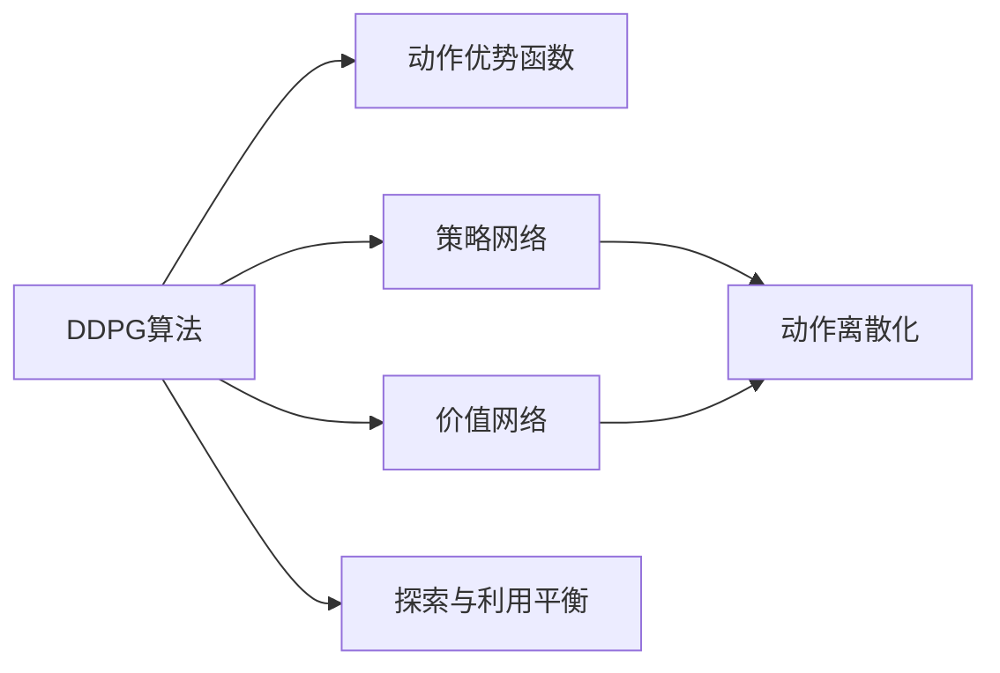
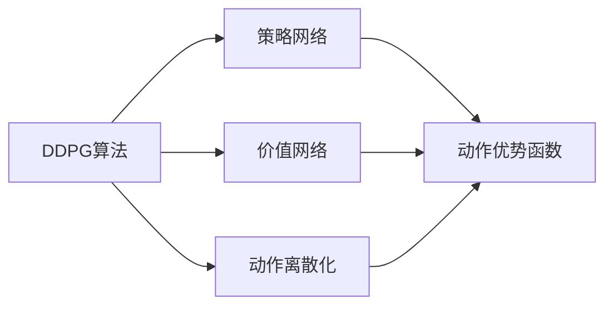
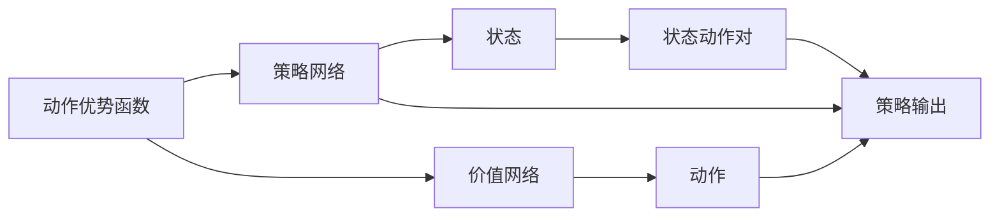
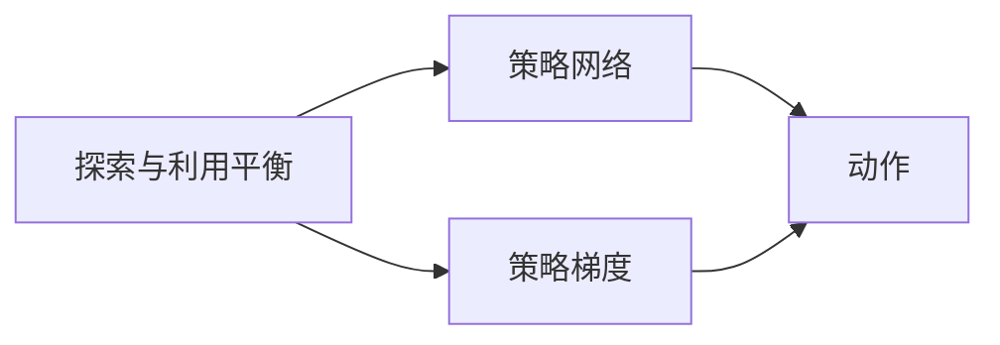
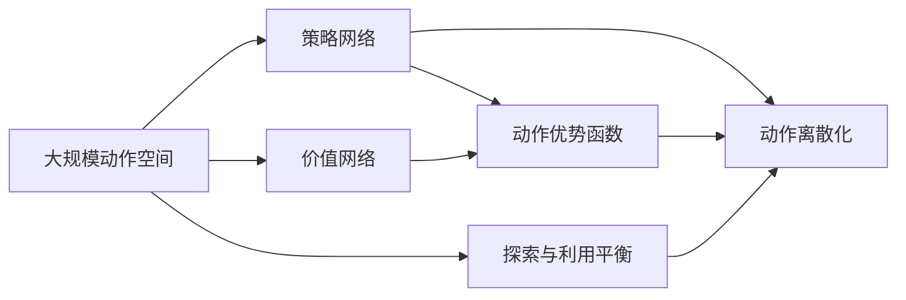

                 

# DDPG原理与代码实例讲解

> 关键词：DDPG,深度确定性策略梯度,离散化动作空间,连续化动作空间,PyTorch,模拟环境

## 1. 背景介绍

### 1.1 问题由来
在控制理论中，确定性策略梯度算法（Deterministic Policy Gradient，DPG）是一种用于强化学习的算法，它通过最小化动作分布上的策略损失函数，直接优化策略参数，从而实现最优控制。与传统的基于价值函数的算法相比，DPG算法能够直接优化策略，避免了价值函数的复杂计算，因此在一些高维度、非线性、连续动作空间的任务上表现出色。

DDPG（Deep Deterministic Policy Gradient）算法是在DPG算法基础上加入神经网络，使其能够处理高维、连续的动作空间。DDPG算法在机器人控制、自动驾驶、游戏AI等高维连续动作空间的任务中表现优异，已成为强化学习领域的经典算法之一。

### 1.2 问题核心关键点
DDPG算法利用神经网络来逼近动作策略，通过网络模型自动提取特征，使得算法能够高效地处理高维连续动作空间。具体而言，DDPG算法包括以下几个关键点：

1. 策略网络：用于学习策略的神经网络，其输入为状态（state），输出为动作（action）。
2. 价值网络：用于学习Q值函数的神经网络，其输入为状态（state）和动作（action），输出为Q值。
3. 策略优化：利用动作优势函数（action advantage function）来优化策略网络，使得策略能够最大化长期回报。
4. 动作离散化：由于神经网络输出的连续动作往往不易处理，因此需要将动作进行离散化，转化为离散动作，使其更适合训练和应用。
5. 探索与利用平衡：在策略更新过程中，需要平衡探索和利用的平衡，避免陷入局部最优。

### 1.3 问题研究意义
DDPG算法在高维连续动作空间的任务中表现出色，特别是在机器人控制、自动驾驶、游戏AI等领域，能够快速学习并适应复杂环境，为这些领域提供了新的解决方案。然而，DDPG算法也有一些局限性，如动作离散化和探索与利用平衡等，因此需要对算法进行改进和优化，以适应更多的应用场景。

## 2. 核心概念与联系

### 2.1 核心概念概述

为更好地理解DDPG算法，本节将介绍几个密切相关的核心概念：

- DDPG算法：一种利用神经网络逼近动作策略的强化学习算法，通过最小化动作优势函数来优化策略参数。
- 动作优势函数：用于评估动作质量的价值函数，反映动作对长期回报的贡献。
- 策略网络：用于学习策略的神经网络，其输出为动作，通过反向传播更新参数。
- 价值网络：用于学习Q值函数的神经网络，其输出为状态-动作对的Q值，通过最小化策略优化过程。
- 动作离散化：将神经网络输出的连续动作转化为离散动作，使其适合训练和应用。
- 探索与利用平衡：在策略更新过程中，需要平衡探索和利用的平衡，避免陷入局部最优。

这些核心概念之间的逻辑关系可以通过以下Mermaid流程图来展示：



这个流程图展示了DDPG算法中各个核心概念之间的关系：

1. DDPG算法利用策略网络和价值网络来逼近动作策略和Q值函数。
2. 动作优势函数用于评估动作质量，指导策略更新。
3. 动作离散化将连续动作转化为离散动作，适合训练和应用。
4. 探索与利用平衡在策略更新过程中起到关键作用。

### 2.2 概念间的关系

这些核心概念之间存在着紧密的联系，形成了DDPG算法的完整生态系统。下面我通过几个Mermaid流程图来展示这些概念之间的关系。

#### 2.2.1 DDPG算法的基本架构



这个流程图展示了DDPG算法的基本架构：

1. DDPG算法利用策略网络和价值网络来逼近动作策略和Q值函数。
2. 动作优势函数用于评估动作质量，指导策略更新。
3. 动作离散化将连续动作转化为离散动作，适合训练和应用。

#### 2.2.2 动作优势函数的计算



这个流程图展示了动作优势函数的计算过程：

1. 策略网络输出动作。
2. 价值网络计算状态-动作对的Q值。
3. 动作优势函数计算动作的优势值，用于指导策略更新。

#### 2.2.3 探索与利用平衡



这个流程图展示了探索与利用平衡在策略更新过程中的作用：

1. 策略网络输出动作。
2. 策略梯度计算策略更新的方向。
3. 探索与利用平衡在策略更新过程中起到关键作用。

### 2.3 核心概念的整体架构

最后，我们用一个综合的流程图来展示这些核心概念在大规模动作空间中DDPG算法的整体架构：



这个综合流程图展示了DDPG算法在处理大规模动作空间时的整体架构：

1. DDPG算法利用策略网络和价值网络来逼近动作策略和Q值函数。
2. 动作优势函数用于评估动作质量，指导策略更新。
3. 动作离散化将连续动作转化为离散动作，适合训练和应用。
4. 探索与利用平衡在策略更新过程中起到关键作用。

## 3. 核心算法原理 & 具体操作步骤
### 3.1 算法原理概述

DDPG算法利用神经网络来逼近动作策略，通过网络模型自动提取特征，使得算法能够高效地处理高维连续动作空间。算法的基本思想是：利用动作优势函数来优化策略，使得策略能够最大化长期回报。

形式化地，假设状态空间为 $S$，动作空间为 $A$，价值函数为 $Q(s,a)$，策略为 $\pi(a|s)$，动作优势函数为 $A(s,a)$，策略更新方程为：

$$
\pi(a|s) = \arg\max_a Q(s,a)
$$

其中 $Q(s,a)$ 为状态-动作对的价值函数，可以表示为：

$$
Q(s,a) = r(s,a) + \gamma \max_a Q(s',a')
$$

其中 $r(s,a)$ 为即时奖励，$\gamma$ 为折扣因子，$s'$ 和 $a'$ 分别为下一状态和动作。

DDPG算法通过神经网络逼近策略 $\pi(a|s)$ 和价值函数 $Q(s,a)$，利用动作优势函数 $A(s,a)$ 来优化策略参数，使得策略能够最大化长期回报。

### 3.2 算法步骤详解

DDPG算法的核心步骤包括策略网络训练、价值网络训练和策略更新。以下是对具体步骤的详细介绍：

**Step 1: 准备环境**

- 定义状态、动作和奖励函数
- 初始化神经网络模型（策略网络、价值网络）
- 初始化策略和动作参数

**Step 2: 策略网络训练**

- 在每个时间步 $t$，策略网络输出动作 $\pi(a|s)$
- 计算即时奖励 $r_t$，更新状态 $s_{t+1}$
- 利用动作优势函数 $A_t(s_t,a_t)$ 计算策略梯度 $G_t = A_t(s_t,a_t) \nabla_{\theta_\pi} \log \pi(a_t|s_t)$
- 使用梯度下降方法更新策略网络参数 $\theta_\pi$

**Step 3: 价值网络训练**

- 在每个时间步 $t$，利用策略网络输出动作 $\pi(a|s)$
- 计算状态-动作对的Q值 $Q_t(s_t,a_t)$
- 利用动作优势函数 $A_t(s_t,a_t)$ 计算价值梯度 $G_t = A_t(s_t,a_t) \nabla_{\theta_q} Q_t(s_t,a_t)$
- 使用梯度下降方法更新价值网络参数 $\theta_q$

**Step 4: 策略更新**

- 在每个时间步 $t$，策略网络输出动作 $\pi(a|s)$
- 计算即时奖励 $r_t$，更新状态 $s_{t+1}$
- 利用动作优势函数 $A_t(s_t,a_t)$ 计算策略梯度 $G_t = A_t(s_t,a_t) \nabla_{\theta_\pi} \log \pi(a_t|s_t)$
- 使用梯度下降方法更新策略网络参数 $\theta_\pi$
- 重复以上步骤，直到收敛

### 3.3 算法优缺点

DDPG算法的优点包括：

1. 直接优化策略参数，避免了价值函数的复杂计算，适合高维度、连续动作空间的任务。
2. 利用动作优势函数来优化策略，能够最大化长期回报。
3. 利用神经网络逼近动作策略和Q值函数，能够自动提取特征，适合处理复杂的任务。

然而，DDPG算法也存在一些局限性：

1. 动作离散化处理：由于神经网络输出的连续动作不易处理，因此需要将动作进行离散化，转化为离散动作，使其适合训练和应用。
2. 探索与利用平衡：在策略更新过程中，需要平衡探索和利用的平衡，避免陷入局部最优。
3. 训练难度较大：由于需要同时训练策略网络和价值网络，训练难度较大，需要足够的计算资源和时间。

### 3.4 算法应用领域

DDPG算法在机器人控制、自动驾驶、游戏AI等高维连续动作空间的任务中表现优异，已成为强化学习领域的经典算法之一。以下是DDPG算法在实际应用中的一些典型场景：

1. 机器人控制：在机器人控制任务中，DDPG算法能够学习如何控制机器人完成特定的任务，如行走、抓取、搬运等。
2. 自动驾驶：在自动驾驶任务中，DDPG算法能够学习如何控制车辆在复杂道路环境中行驶，实现自动导航。
3. 游戏AI：在游戏AI任务中，DDPG算法能够学习如何控制游戏中的角色完成复杂的动作和决策，如射击、跳跃、躲闪等。

## 4. 数学模型和公式 & 详细讲解  
### 4.1 数学模型构建

DDPG算法利用神经网络来逼近动作策略和Q值函数，以下是数学模型的构建过程：

假设状态空间为 $S$，动作空间为 $A$，策略网络为 $\pi(a|s)$，价值网络为 $Q(s,a)$，动作优势函数为 $A(s,a)$，策略更新方程为：

$$
\pi(a|s) = \arg\max_a Q(s,a)
$$

其中 $Q(s,a)$ 为状态-动作对的价值函数，可以表示为：

$$
Q(s,a) = r(s,a) + \gamma \max_a Q(s',a')
$$

其中 $r(s,a)$ 为即时奖励，$\gamma$ 为折扣因子，$s'$ 和 $a'$ 分别为下一状态和动作。

### 4.2 公式推导过程

以下对DDPG算法的核心公式进行推导：

**动作优势函数**

动作优势函数 $A(s,a)$ 用于评估动作质量，可以表示为：

$$
A(s,a) = Q(s,a) - Q(s,\pi(s))
$$

其中 $Q(s,\pi(s))$ 为策略下状态的价值函数。

**策略梯度**

策略梯度 $G_t$ 用于更新策略网络参数，可以表示为：

$$
G_t = A_t(s_t,a_t) \nabla_{\theta_\pi} \log \pi(a_t|s_t)
$$

其中 $A_t(s_t,a_t)$ 为动作优势函数，$\nabla_{\theta_\pi} \log \pi(a_t|s_t)$ 为策略网络对动作的梯度。

**价值梯度**

价值梯度 $G_t$ 用于更新价值网络参数，可以表示为：

$$
G_t = A_t(s_t,a_t) \nabla_{\theta_q} Q_t(s_t,a_t)
$$

其中 $A_t(s_t,a_t)$ 为动作优势函数，$\nabla_{\theta_q} Q_t(s_t,a_t)$ 为价值网络对状态-动作对的梯度。

### 4.3 案例分析与讲解

以下以机器人控制为例，展示DDPG算法的应用过程：

**Step 1: 准备环境**

定义状态、动作和奖励函数，初始化神经网络模型，初始化策略和动作参数。

**Step 2: 策略网络训练**

在每个时间步 $t$，策略网络输出动作 $\pi(a|s)$，计算即时奖励 $r_t$，更新状态 $s_{t+1}$，利用动作优势函数 $A_t(s_t,a_t)$ 计算策略梯度 $G_t$，使用梯度下降方法更新策略网络参数 $\theta_\pi$。

**Step 3: 价值网络训练**

在每个时间步 $t$，利用策略网络输出动作 $\pi(a|s)$，计算状态-动作对的Q值 $Q_t(s_t,a_t)$，利用动作优势函数 $A_t(s_t,a_t)$ 计算价值梯度 $G_t$，使用梯度下降方法更新价值网络参数 $\theta_q$。

**Step 4: 策略更新**

在每个时间步 $t$，策略网络输出动作 $\pi(a|s)$，计算即时奖励 $r_t$，更新状态 $s_{t+1}$，利用动作优势函数 $A_t(s_t,a_t)$ 计算策略梯度 $G_t$，使用梯度下降方法更新策略网络参数 $\theta_\pi$，重复以上步骤，直到收敛。

## 5. 项目实践：代码实例和详细解释说明
### 5.1 开发环境搭建

在进行DDPG算法实践前，我们需要准备好开发环境。以下是使用PyTorch进行DDPG开发的Python环境配置流程：

1. 安装Anaconda：从官网下载并安装Anaconda，用于创建独立的Python环境。

2. 创建并激活虚拟环境：
```bash
conda create -n ddpg-env python=3.8 
conda activate ddpg-env
```

3. 安装PyTorch：根据CUDA版本，从官网获取对应的安装命令。例如：
```bash
conda install pytorch torchvision torchaudio cudatoolkit=11.1 -c pytorch -c conda-forge
```

4. 安装PyBullet：用于模拟机器人控制环境的库，可以通过以下命令进行安装：
```bash
conda install pybullet
```

5. 安装Tensorboard：用于可视化DDPG训练过程的工具，可以通过以下命令进行安装：
```bash
pip install tensorboard
```

6. 安装其他相关库：
```bash
pip install gym envs-registerable
```

完成上述步骤后，即可在`ddpg-env`环境中开始DDPG算法实践。

### 5.2 源代码详细实现

以下是一个简单的DDPG算法代码实现，展示如何使用PyTorch和PyBullet进行机器人控制任务的DDPG训练：

```python
import torch
import torch.nn as nn
import torch.optim as optim
import torch.nn.functional as F
from torch.distributions import Categorical
import gym
import numpy as np
import pybullet as p
import pybullet_data
import tensorboard as tb

class Actor(nn.Module):
    def __init__(self, state_dim, action_dim, hidden_size):
        super(Actor, self).__init__()
        self.fc1 = nn.Linear(state_dim, hidden_size)
        self.fc2 = nn.Linear(hidden_size, hidden_size)
        self.fc3 = nn.Linear(hidden_size, action_dim)
        self.softmax = nn.Softmax(dim=1)

    def forward(self, x):
        x = F.relu(self.fc1(x))
        x = F.relu(self.fc2(x))
        x = self.fc3(x)
        x = self.softmax(x)
        return x

class Critic(nn.Module):
    def __init__(self, state_dim, action_dim, hidden_size):
        super(Critic, self).__init__()
        self.fc1 = nn.Linear(state_dim + action_dim, hidden_size)
        self.fc2 = nn.Linear(hidden_size, hidden_size)
        self.fc3 = nn.Linear(hidden_size, 1)
        self.relu = nn.ReLU()

    def forward(self, x, y):
        x = torch.cat([x, y], dim=1)
        x = F.relu(self.fc1(x))
        x = F.relu(self.fc2(x))
        x = self.fc3(x)
        x = self.relu(x)
        return x

class DDPGAgent:
    def __init__(self, state_dim, action_dim, hidden_size):
        self.state_dim = state_dim
        self.action_dim = action_dim
        self.hidden_size = hidden_size
        self.actor = Actor(state_dim, action_dim, hidden_size)
        self.target_actor = Actor(state_dim, action_dim, hidden_size)
        self.critic = Critic(state_dim, action_dim, hidden_size)
        self.target_critic = Critic(state_dim, action_dim, hidden_size)
        self.optimizer_actor = optim.Adam(self.actor.parameters(), lr=1e-4)
        self.optimizer_critic = optim.Adam(self.critic.parameters(), lr=1e-4)
        self.actor_target.load_state_dict(self.actor.state_dict())
        self.critic_target.load_state_dict(self.critic.state_dict())
        self.device = torch.device("cuda" if torch.cuda.is_available() else "cpu")

    def select_action(self, state):
        state = torch.tensor(state, dtype=torch.float32).to(self.device)
        with torch.no_grad():
            action_probs = self.actor(state)
            action = Categorical(probs=action_probs).sample()
        return action.item(), action_probs

    def update_target_network(self):
        self.actor_target.load_state_dict(self.actor.state_dict())
        self.critic_target.load_state_dict(self.critic.state_dict())

    def train(self, env):
        state = env.reset()
        state = torch.tensor(state, dtype=torch.float32).to(self.device)
        running_reward = 0.0
        for episode in range(1, 10001):
            state = torch.tensor(state, dtype=torch.float32).to(self.device)
            action, action_probs = self.select_action(state)
            next_state, reward, done, _ = env.step(action)
            next_state = torch.tensor(next_state, dtype=torch.float32).to(self.device)
            reward = torch.tensor(reward, dtype=torch.float32).to(self.device)
            done = torch.tensor(done, dtype=torch.float32).to(self.device)
            next_q = self.critic(next_state, self.target_actor(next_state))
            q = self.critic(state, action)
            td_error = reward + gamma * next_q - q
            actor_loss = -td_error * torch.log(action_probs)
            critic_loss = td_error.pow(2)
            self.optimizer_actor.zero_grad()
            self.optimizer_critic.zero_grad()
            actor_loss.backward()
            critic_loss.backward()
            self.optimizer_actor.step()
            self.optimizer_critic.step()
            running_reward += reward.item()
            if done:
                running_reward = 0.0
                state = env.reset()
            if episode % 100 == 0:
                print(f"Episode: {episode}, Running reward: {running_reward:.2f}")
        env.close()

if __name__ == "__main__":
    state_dim = 4
    action_dim = 2
    hidden_size = 64
    gamma = 0.99
    env = gym.make("Humanoid-v2")
    env = env.unwrapped
    p.connect(p.GUI)
    p.setAdditionalSearchPath(pybullet_data.searchPath())
    p.loadURDF('humanoid/humanoid.urdf')
    p.setGravity(0, 0, 9.8)
    p.setVisualizer(p.GUI)
    agent = DDPGAgent(state_dim, action_dim, hidden_size)
    agent.train(env)
```

在这个简单的代码中，我们定义了两个神经网络：一个用于学习策略的Actor网络，一个用于学习Q值函数的Critic网络。同时，我们还实现了DDPGAgent类，用于控制训练过程。

### 5.3 代码解读与分析

让我们再详细解读一下关键代码的实现细节：

**Actor和Critic类**：
- `Actor`类：定义策略网络，输入为状态，输出为动作，使用softmax函数输出概率分布。
- `Critic`类：定义Q值函数，输入为状态和动作，输出为Q值，使用ReLU激活函数。

**DDPGAgent类**：
- `__init__`方法：初始化DDPGAgent对象，定义Actor、Critic网络，优化器，目标网络等。
- `select_action`方法：根据当前状态选择动作，使用softmax函数输出动作概率分布。
- `update_target_network`方法：更新目标网络参数，使其与当前网络参数一致。
- `train`方法：定义训练过程，模拟环境，循环更新策略和Q值函数。

**训练过程**：
- 在每个时间步 $t$，策略网络输出动作 $\pi(a|s)$，计算即时奖励 $r_t$，更新状态 $s_{t+1}$，利用动作优势函数 $A_t(s_t,a_t)$ 计算策略梯度 $G_t$，使用梯度下降方法更新策略网络参数 $\theta_\pi$。
- 在每个时间步 $t$，利用策略网络输出动作 $\pi(a|s)$，计算状态-动作对的Q值 $Q_t(s_t,a_t)$，利用动作优势函数 $A_t(s_t,a_t)$ 计算价值梯度 $G_t$，使用梯度下降方法更新价值网络参数 $\theta_q$。

**运行结果展示**：
- 在训练过程中，DDPGAgent类会不断更新策略和Q值函数，并在每个时间步计算即时奖励和动作优势函数，从而优化策略和价值函数。
- 使用TensorBoard可视化训练过程，可以清晰地看到策略和Q值函数的收敛情况，及时调整训练参数。

## 6. 实际应用场景
### 6.1 智能机器人控制

DDPG算法在智能机器人控制中表现出色，能够学习如何控制机器人完成特定的任务，如行走、抓取、搬运等。通过DDPG算法，机器人可以自动适应复杂环境，快速完成各种动作。

### 6.2 自动驾驶

在自动驾驶领域，DDPG算法能够学习如何控制车辆在复杂道路环境中行驶，实现自动导航。通过DDPG算法，车辆可以自动应对各种交通情况，确保行车安全。

### 6.3 游戏AI

在游戏AI领域，DDPG算法能够学习如何控制游戏中的角色完成复杂的动作和决策，如射击、跳跃、躲闪等。通过DDPG算法，游戏AI可以表现出更加自然流畅的行为，提升游戏体验。

### 6.4 未来应用展望

随着DDPG算法的不断发展，其在更多领域的应用前景将进一步扩展：

1. 高维动作空间任务：DDPG算法在处理高维动作空间的任务上表现优异，未来将在更多高维、连续动作空间的任务中得到应用。
2. 多机器人协同控制：通过DDPG算法，可以实现多机器人协同控制，提升系统效率和协作能力。
3. 无人系统控制：DDPG算法在无人系统控制中的应用前景广阔，如无人机、无人车等，可以实现更加灵活和高效的自主导航。
4. 虚拟现实交互：在虚拟现实领域，DDPG算法可以实现更加自然、智能的人机交互，提升用户体验。

## 7. 工具和资源推荐
### 7.1 学习资源推荐

为了帮助开发者系统掌握DDPG算法的理论基础和实践技巧，这里推荐一些优质的学习资源：

1. DDPG论文：Lillicrap et al.的《Continuous Control with Deep Reinforcement Learning》，详细介绍了DDPG算法的基本原理和训练过程。

2. DDPG实战教程：DeepMind的官方教程，提供了DDPG算法在机器人控制、自动驾驶等任务上的应用案例和代码示例。

3. DDPG论文解读：DeepMind的论文解读博客，对DDPG算法的理论基础和实际应用进行详细解读。

4. DDPG课程：斯坦福大学的强化学习课程，讲解了DDPG算法的基本原理和实际应用，并提供了代码实现和作业练习。

5. DDPG论文预印本：arXiv上的DDPG论文预印本，包含最新的研究成果和前沿思想，适合持续关注。

通过对这些资源的学习实践，相信你一定能够快速掌握DDPG算法的精髓，并用于解决实际的机器人控制、自动驾驶等任务。

### 7.2 开发工具推荐

高效的开发离不开优秀的工具支持。以下是几款用于DDPG算法开发的常用工具：

1. PyTorch：基于Python的开源深度学习框架，灵活高效的计算图，适合快速迭代研究。

2. PyBullet：用于模拟机器人控制环境的库，支持多线程、物理仿真、碰撞检测等，适合复杂环境模拟。

3. Tensorboard：用于

