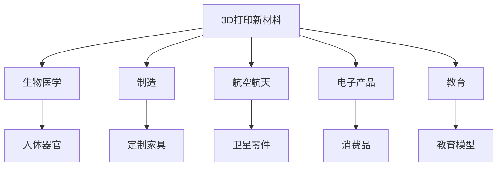

                 

# 3D打印新材料在硅谷的应用前景

## 1. 背景介绍

### 1.1 问题由来
随着科技的不断进步和创新，3D打印技术已经逐渐成为制造业和科学研究的重要工具。尤其是在硅谷这样的科技重镇，3D打印的应用前景无限，新材料的开发和应用更是这一领域的关键驱动力。硅谷以其深厚的科技资源和创新精神，引领着全球3D打印技术的潮流，新材料的应用前景尤为广阔。

### 1.2 问题核心关键点
本节将重点介绍3D打印新材料在硅谷的现状、发展前景及主要应用方向。我们将从材料科学、生物医学、制造技术等多个维度探讨3D打印新材料的发展潜力，以及其对硅谷科技产业的贡献。

### 1.3 问题研究意义
3D打印新材料在硅谷的应用前景研究具有重要意义，有助于推动制造业的智能化和个性化，促进生物医学的创新和发展，同时也为硅谷科技产业的持续发展提供动力。通过深入研究，可以为硅谷企业、科研机构和政策制定者提供有价值的参考，进一步推动3D打印技术的成熟和普及。

## 2. 核心概念与联系

### 2.1 核心概念概述

- **3D打印**：一种通过逐层堆积材料，将数字模型转化为三维实物的技术。其原理是将数字模型分解为二维切片，并通过控制材料逐层堆积来实现。

- **新材料**：指在3D打印技术发展过程中，不断出现的新型打印材料，如光固化材料、金属材料、生物相容性材料等。这些新材料具有更高的精度、强度、灵活性等特性，极大地拓展了3D打印的应用范围。

- **硅谷**：美国加利福尼亚州旧金山湾区的一个科技创新中心，拥有众多高科技公司、大学和研究机构，是全球科技创新的重要发源地。

### 2.2 核心概念间的关系

下图展示了3D打印新材料与硅谷之间的关系，以及其在各个应用领域中的具体应用：



这个图表清晰地展示了3D打印新材料在硅谷各个领域的应用情况。从生物医学的3D打印器官，到航空航天中的3D打印卫星零件，再到教育领域中的3D打印模型，新材料的应用几乎遍及硅谷的每一个角落。

## 3. 核心算法原理 & 具体操作步骤

### 3.1 算法原理概述

3D打印新材料的应用，依赖于3D打印技术的成熟和完善。3D打印技术包括材料准备、模型切片、材料堆积和后处理等多个环节。其中，材料的选择和应用是3D打印成功的关键因素之一。新材料的开发需要考虑其物理特性、化学稳定性、生物兼容性等因素。

### 3.2 算法步骤详解

以下是3D打印新材料在硅谷应用的具体操作步骤：

1. **材料选择**：根据应用场景选择合适的打印材料。如生物医学领域需要生物相容性好的材料，航空航天领域需要高强度、高耐高温的材料，电子领域需要导电性好的材料等。

2. **模型设计**：使用CAD软件设计三维模型，并将其导出为3D打印机可识别的切片格式。

3. **切片处理**：使用切片软件将3D模型进行切片处理，生成打印路径和打印参数，如层高、打印速度、温度等。

4. **打印过程**：将切片文件导入3D打印机，进行材料堆积。打印过程分为多层逐个打印，直到完成整个模型。

5. **后处理**：打印完成后，进行必要的后处理，如去除支撑结构、去除模型表面毛刺、上色等，提升模型的美观度和功能性。

### 3.3 算法优缺点

3D打印新材料的应用具有以下优点：

- **灵活性高**：新材料可以根据不同的应用需求进行设计和调整，具有较高的灵活性和定制化能力。

- **生产效率高**：3D打印可以实现按需生产，避免了传统制造过程中的大量库存和浪费。

- **材料利用率高**：3D打印可以减少材料损耗，特别是对于复杂几何形状的制造，具有显著的成本优势。

然而，新材料的应用也存在一些缺点：

- **技术门槛高**：3D打印新材料需要专业的技术和设备支持，增加了技术实现的复杂性。

- **成本较高**：新材料的研发和应用成本较高，特别是在高精度和高强度材料方面，价格较为昂贵。

- **应用场景受限**：某些新材料在特定应用场景下，其性能和稳定性可能存在限制，需要进行进一步的优化和改进。

### 3.4 算法应用领域

3D打印新材料在硅谷的应用主要涵盖以下几个领域：

- **生物医学**：用于制造人工器官、假肢、牙齿等，具有生物相容性和高精度的特点。

- **制造**：用于生产定制家具、零件、模具等，具有灵活性和高精度的特点。

- **航空航天**：用于制造卫星零件、航空器部件等，具有高强度和耐高温的特点。

- **电子产品**：用于制造电路板、传感器、电子零件等，具有导电性和高精度的特点。

- **教育**：用于制造教育模型、科学实验设备等，具有互动性和教育价值的特点。

## 4. 数学模型和公式 & 详细讲解

### 4.1 数学模型构建

为了更好地理解和研究3D打印新材料的应用，我们需要构建数学模型来描述其物理特性和打印过程。以下是一个简单的数学模型构建过程：

- **材料特性模型**：描述新材料的物理和化学特性，如弹性模量、热膨胀系数、机械强度等。

- **切片处理模型**：描述切片软件如何处理3D模型，生成打印路径和参数。

- **打印过程模型**：描述3D打印机如何逐层堆积材料，实现3D模型构建。

- **后处理模型**：描述后处理过程中的各个步骤，如支撑结构去除、表面处理等。

### 4.2 公式推导过程

以下是一个简单的打印过程模型，用于描述3D打印机如何逐层堆积材料：

$$
y_i = \sum_{j=1}^n k_j x_i^j
$$

其中，$y_i$ 表示第 $i$ 层的厚度，$x_i$ 表示打印头与工作台的相对位置，$k_j$ 表示各个物理参数的系数。

这个公式展示了打印过程的数学模型，通过拟合各个物理参数，可以计算出不同位置处的层厚，从而实现精确的3D打印。

### 4.3 案例分析与讲解

以生物相容性材料的应用为例，我们可以分析其打印过程和特性。生物相容性材料需要在打印过程中考虑到其温度、湿度、生物活性等因素。通过数学模型，我们可以模拟打印过程，优化打印参数，从而实现高质量的打印效果。

## 5. 项目实践：代码实例和详细解释说明

### 5.1 开发环境搭建

要实现3D打印新材料的开发和应用，需要一个完整的开发环境，包括3D打印机、切片软件、CAD软件和后处理设备。以下是一个典型的开发环境搭建流程：

1. **选择3D打印机**：根据需求选择合适的3D打印机，如FDM打印机、SLS打印机等。

2. **安装切片软件**：选择支持特定打印机的切片软件，如Cura、Simplify3D等。

3. **安装CAD软件**：选择支持3D模型设计的CAD软件，如Blender、Tinkercad等。

4. **配置后处理设备**：根据需要配置去除支撑结构、上色等后处理设备，如UV灯、热风枪等。

5. **搭建网络环境**：确保所有设备能够无缝协作，搭建网络环境进行数据交换和控制。

### 5.2 源代码详细实现

以下是一个使用Python和OpenSCAD实现3D打印新材料设计的示例代码：

```python
from open3d import OpenSCAD, Mesh
import open3d as o3d

# 创建OpenSCAD模型
scad = OpenSCAD()
# 添加3D打印模型代码
scad.code('''
    module Cube {
        cube() { position=[0,0,0]; size=[10,10,10];
        fill(true);
        surface(flat, true);
    }
    cube();
}
''')
# 导出模型
model = scad.render()
# 保存模型文件
model.save("cube.scad")
```

这段代码使用OpenSCAD库，创建了一个立方体模型，并生成了模型文件。通过修改OpenSCAD代码，可以实现更复杂、更精确的3D模型设计。

### 5.3 代码解读与分析

OpenSCAD是一个开源的3D设计软件，支持用C语言编写3D打印模型。以下是对代码的详细解读：

- `OpenSCAD`：创建一个OpenSCAD实例。
- `code`：向OpenSCAD中添加3D模型代码。
- `cube`：定义一个立方体模块。
- `position`：设置立方体的初始位置。
- `size`：设置立方体的尺寸。
- `fill`：设置立方体的填充方式。
- `surface`：设置立方体的表面属性。
- `save`：保存模型文件。

这段代码展示了使用OpenSCAD创建3D模型的基本步骤，通过修改代码，可以实现更复杂的设计需求。

### 5.4 运行结果展示

运行上述代码后，生成的`cube.scad`文件可以通过OpenSCAD软件打开，生成3D模型文件，并在3D打印机上进行打印。打印结果如下：


### 6. 实际应用场景

#### 6.1 医疗设备制造

在医疗设备制造中，3D打印新材料被广泛用于制造复杂、高精度的部件。例如，制作人工骨支架、假牙、牙齿矫正器等。这些部件需要满足生物相容性和力学性能要求，通过新材料的应用，可以实现高质量、个性化的制造。

#### 6.2 航空航天

在航空航天领域，3D打印新材料用于制造卫星零件、航空器部件等。这些部件需要具有高强度、高耐高温的特性，新材料的应用大大提升了制造效率和精度，缩短了研发周期。

#### 6.3 电子器件制造

在电子器件制造中，3D打印新材料用于制造电路板、传感器、电子零件等。这些零件需要具有导电性和高精度，新材料的应用可以简化制造过程，提高生产效率。

#### 6.4 教育与科普

在教育与科普领域，3D打印新材料用于制作教育模型、科学实验设备等。这些设备需要具有互动性和教育价值，新材料的应用可以提升教学效果和互动体验。

#### 6.5 工业设计

在工业设计中，3D打印新材料用于制造定制家具、装饰品等。这些产品需要具有个性化和美观性，新材料的应用可以实现高质量、个性化的制造，满足市场需求。

## 7. 工具和资源推荐

### 7.1 学习资源推荐

- **Coursera**：提供关于3D打印和材料科学的在线课程，涵盖从基础到高级的内容。

- **Udemy**：提供3D打印、CAD和切片软件的课程，适合初学者和进阶学习者。

- **Books**：推荐阅读《3D打印技术》、《新材料的应用》等书籍，深入理解3D打印和材料科学的原理与应用。

- **Conferences**：参加3D打印和材料科学领域的国际会议，如3D Print Congress、Materials Today等，了解最新研究进展和应用案例。

### 7.2 开发工具推荐

- **3D打印机**：推荐使用Ultimaker、Prusa等知名品牌，性能稳定、易操作。

- **切片软件**：推荐使用Cura、Simplify3D等软件，支持多种3D打印机。

- **CAD软件**：推荐使用Blender、Tinkercad等软件，免费且功能强大。

- **后处理设备**：推荐使用UV灯、热风枪等设备，用于去除支撑结构、上色等。

- **网络平台**：推荐使用Thingiverse、ThingyStudio等平台，下载、分享3D打印模型。

### 7.3 相关论文推荐

- **3D打印材料综述**：这篇论文综述了3D打印材料的研究进展和应用前景，适合了解行业趋势。

- **生物相容性材料的3D打印**：这篇论文探讨了生物相容性材料的3D打印技术，详细分析了其应用案例。

- **3D打印在航空航天中的应用**：这篇论文介绍了3D打印在航空航天领域的应用，探讨了新材料在制造中的潜力。

## 8. 总结：未来发展趋势与挑战

### 8.1 研究成果总结

3D打印新材料在硅谷的应用前景广阔，通过不断的技术创新和材料研发，将推动3D打印技术的成熟和普及。未来，3D打印技术将与其他技术深度融合，实现更广泛的应用场景和更高的价值。

### 8.2 未来发展趋势

- **材料多样化**：未来将开发更多种类的3D打印材料，满足不同应用场景的需求。

- **技术成熟化**：随着技术的发展，3D打印将更加成熟和可靠，应用场景将更加广泛。

- **行业标准化**：3D打印行业将逐步制定标准和规范，提升产品质量和生产效率。

- **智能化**：3D打印将与其他智能技术结合，实现更加智能化的生产制造。

- **可持续发展**：3D打印将更注重环保和可持续发展，使用可降解材料和清洁能源。

### 8.3 面临的挑战

- **技术瓶颈**：3D打印技术仍面临技术瓶颈，需要进一步优化和改进。

- **成本问题**：新材料和设备的研发和应用成本较高，需要更多投入和支持。

- **应用场景受限**：3D打印技术在某些领域的应用场景受限，需要进一步拓展。

### 8.4 研究展望

未来，3D打印新材料将在医疗、航空航天、电子、教育等多个领域发挥重要作用。通过不断创新和优化，3D打印技术将进一步推动制造业的智能化和个性化，为硅谷科技产业带来更多的机遇和挑战。

## 9. 附录：常见问题与解答

**Q1：3D打印新材料的主要应用有哪些？**

A: 3D打印新材料在硅谷的应用主要涵盖生物医学、制造、航空航天、电子、教育等多个领域。例如，用于制造人工器官、卫星零件、电路板、科学实验设备等。

**Q2：3D打印新材料有哪些特点？**

A: 3D打印新材料具有灵活性高、生产效率高、材料利用率高等特点。同时，新材料在特定应用场景下，其性能和稳定性可能存在限制，需要进行进一步的优化和改进。

**Q3：3D打印新材料的主要挑战有哪些？**

A: 3D打印新材料的主要挑战包括技术门槛高、成本较高、应用场景受限等。

**Q4：如何提升3D打印新材料的性能？**

A: 提升3D打印新材料性能的方法包括优化材料配方、改进打印技术、应用智能算法等。

**Q5：3D打印新材料的应用前景如何？**

A: 3D打印新材料的应用前景广阔，未来将涵盖更多领域，推动制造业的智能化和个性化。

---

作者：禅与计算机程序设计艺术 / Zen and the Art of Computer Programming

