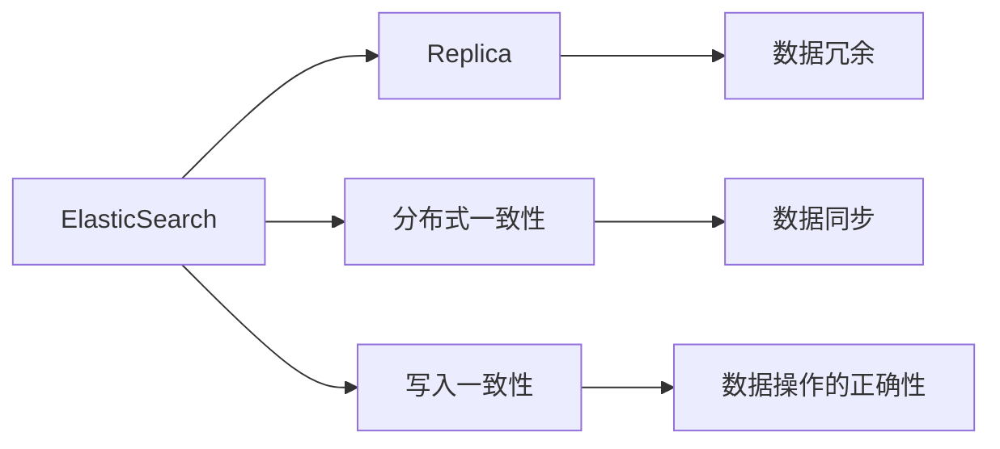
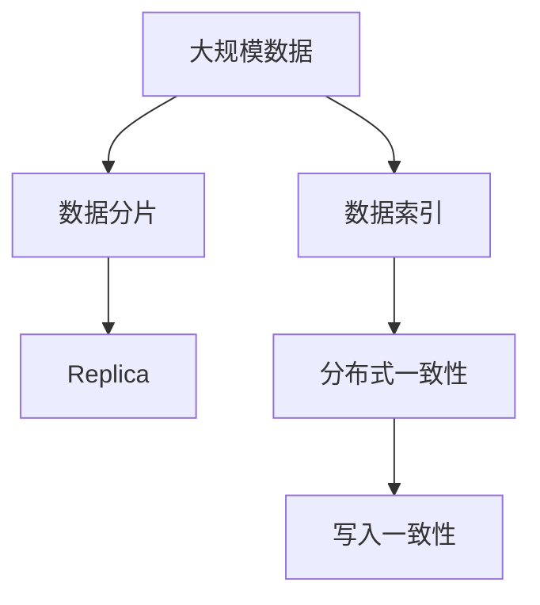

                 

# ElasticSearch Replica原理与代码实例讲解

> 关键词：ElasticSearch, Replica, 分布式系统, 数据冗余, 容错性, 写入一致性

## 1. 背景介绍

### 1.1 问题由来
ElasticSearch是一款高性能的分布式搜索和分析引擎，广泛应用在企业级数据搜索、日志分析、大数据处理等场景。在ElasticSearch的架构中，Replica是一个核心概念，通过Replica机制，ElasticSearch实现了分布式系统的高可用性和数据冗余，提升了系统的稳定性和容错能力。本文将深入探讨ElasticSearch Replica的原理，并通过代码实例展示其具体实现。

### 1.2 问题核心关键点
ElasticSearch Replica的核心思想是数据的冗余存储和跨节点分布式一致性。通过在多个节点上存储相同的索引数据副本，ElasticSearch实现了数据的备份和故障恢复，提高了系统的容错性。同时，通过分布式事务和写入一致性协议，确保在节点故障或网络分区等情况下，数据操作的正确性。

## 2. 核心概念与联系

### 2.1 核心概念概述
- **ElasticSearch**：高性能的分布式搜索和分析引擎，支持多节点集群部署。
- **Replica**：索引数据的冗余存储，提升系统的容错性和高可用性。
- **分布式一致性**：通过协调多个节点的操作，确保数据操作的正确性和一致性。
- **写入一致性**：保证在节点故障或网络分区等情况下，数据操作的正确性。

### 2.2 核心概念之间的关系

ElasticSearch通过Replica机制实现了分布式系统的容错性和高可用性。Replica是在多个节点上存储相同索引数据副本，数据冗余存储提升了系统的可靠性。在Replica的基础上，ElasticSearch实现了分布式一致性协议，确保节点间的数据同步，同时采用写入一致性协议保证数据操作的正确性。这些核心概念共同构成了ElasticSearch的分布式架构。

通过以下Mermaid流程图，我们可以更清晰地理解这些概念之间的关系：



这个流程图展示了ElasticSearch Replica的核心概念及其之间的关系：

1. ElasticSearch通过Replica机制实现数据的冗余存储。
2. 数据冗余存储提升了系统的可靠性。
3. 在Replica的基础上，ElasticSearch实现了分布式一致性协议，确保节点间的数据同步。
4. 采用写入一致性协议保证数据操作的正确性。

### 2.3 核心概念的整体架构

最后，我们用一个综合的流程图来展示这些核心概念在大数据架构中的整体架构：



这个综合流程图展示了ElasticSearch的Replica机制和一致性协议，在大数据架构中的整体架构：

1. 大规模数据通过分片机制进行分布式存储。
2. 数据分片创建索引，并通过Replica机制实现数据的冗余存储。
3. 在Replica的基础上，实现分布式一致性协议，确保节点间的数据同步。
4. 采用写入一致性协议保证数据操作的正确性。

## 3. 核心算法原理 & 具体操作步骤

### 3.1 算法原理概述
ElasticSearch Replica的核心算法原理主要包括以下几个方面：

- **数据冗余存储**：在多个节点上存储相同的索引数据副本，提升系统的容错性和高可用性。
- **分布式一致性协议**：通过协调多个节点的操作，确保数据同步，同时保证系统一致性和可用性。
- **写入一致性协议**：在节点故障或网络分区等情况下，保证数据操作的正确性和一致性。

这些算法原理通过ElasticSearch的Replica机制和一致性协议实现。

### 3.2 算法步骤详解
以下是ElasticSearch Replica的具体实现步骤：

1. **数据分片**：将大规模数据进行分片，每个分片包含部分数据。
2. **创建索引**：在每个节点上创建相同的索引，并存储分片数据。
3. **分配Replica**：将索引的Replica分配给不同的节点，每个Replica存储一份索引数据。
4. **数据同步**：通过分布式一致性协议，确保各节点间的数据同步，保持Replica的一致性。
5. **写入一致性**：采用写入一致性协议，保证数据操作的正确性和一致性。

### 3.3 算法优缺点
ElasticSearch Replica机制的优势主要体现在以下几点：

- **高可用性**：通过数据冗余存储，提升系统的容错性和高可用性，确保系统不会因为单节点故障而无法提供服务。
- **低延迟**：分布式存储和一致性协议使得数据读写具有低延迟特性，能够快速响应用户请求。
- **弹性扩展**：系统可以根据业务需求动态调整节点数，实现弹性扩展。

同时，Replica机制也存在一些缺点：

- **资源消耗大**：冗余存储和一致性协议需要消耗更多的硬件资源，增加了系统的成本。
- **数据同步复杂**：多节点间的数据同步需要严格的协调和协议保证，增加了系统的复杂度。

### 3.4 算法应用领域
ElasticSearch Replica机制广泛应用于大数据处理、搜索、分析等场景，特别是在需要高可用性和高可靠性的企业级系统中。

- **搜索系统**：在电商、社交媒体等需要快速搜索和查询的场景，ElasticSearch Replica确保系统的稳定性和高可用性。
- **日志分析**：在日志管理和分析中，通过Replica实现数据的冗余存储，确保数据的完整性和可用性。
- **大数据处理**：在数据仓库、数据湖等大数据处理场景中，ElasticSearch Replica提供数据的高可用性和高可靠性。

## 4. 数学模型和公式 & 详细讲解 & 举例说明

### 4.1 数学模型构建
假设ElasticSearch集群中有$n$个节点，每个节点存储一个索引的$k$份Replica，即每个索引有$n\times k$份数据副本。设$R_1, R_2, \ldots, R_n$为$n$个节点上存储的索引数据副本，则数据冗余存储可以表示为：

$$
R_i = f(x_i), \quad i=1,2,\ldots,n
$$

其中$x_i$为第$i$个节点的原始数据，$f$为数据冗余存储的映射函数。

### 4.2 公式推导过程
在Replica机制下，数据同步和一致性协议的实现需要满足以下条件：

1. 数据一致性：确保各Replica的数据一致，即$R_i=R_j$，对于任意的$i, j$。
2. 写入一致性：在节点故障或网络分区等情况下，保证数据操作的正确性。

假设某节点$A$写入数据$x_A$到索引$I$的$R_A$副本上，同时节点$B$也写入数据$x_B$到$R_B$副本上，需要在所有节点上保持数据一致性。假设数据冗余存储函数为$f$，则有：

$$
R_A = f(x_A), \quad R_B = f(x_B)
$$

为了确保数据一致性，需要在所有节点上同时更新数据，即：

$$
R_i = f(x_i), \quad i=1,2,\ldots,n
$$

其中$x_i$为第$i$个节点的原始数据。

### 4.3 案例分析与讲解
以电商搜索系统为例，假设一个电商网站有多个节点存储用户搜索数据的Replica。当用户搜索时，系统需要在所有节点上同时更新数据。例如，用户搜索“iPhone”时，节点$A$收到请求并写入数据$x_A$到索引$I$的$R_A$副本上，同时节点$B$也收到请求并写入数据$x_B$到$R_B$副本上。为了确保数据一致性，需要在所有节点上同时更新数据，即：

$$
R_A = f(x_A), \quad R_B = f(x_B)
$$

其中$f$为数据冗余存储函数。

## 5. 项目实践：代码实例和详细解释说明

### 5.1 开发环境搭建

在进行ElasticSearch Replica实践前，我们需要准备好开发环境。以下是使用Java进行ElasticSearch开发的环境配置流程：

1. 安装JDK：从官网下载并安装JDK，确保Java环境正确配置。
2. 安装ElasticSearch：从官网下载并安装ElasticSearch，按照官方文档进行安装和配置。
3. 安装必要的依赖库：在开发过程中，需要安装一些必要的依赖库，如log4j、jackson等。
4. 配置ElasticSearch集群：将多个ElasticSearch节点配置成一个集群，确保集群内部通信正常。

完成上述步骤后，即可在本地搭建ElasticSearch集群并开始Replica实践。

### 5.2 源代码详细实现

以下是使用Java实现ElasticSearch Replica机制的代码示例：

```java
import org.elasticsearch.action.bulk.BulkRequestBuilder;
import org.elasticsearch.action.index.IndexRequestBuilder;
import org.elasticsearch.action.update.UpdateRequestBuilder;
import org.elasticsearch.client.Client;
import org.elasticsearch.common.xcontent.XContentType;
import org.elasticsearch.index.query.QueryBuilder;
import org.elasticsearch.index.reindex.ReindexRequestBuilder;
import org.elasticsearch.xcontent.XContentType;

public class ReplicaExample {

    public static void main(String[] args) {
        // 创建ElasticSearch客户端
        Client client = TransportClient.builder().build();

        // 定义数据分片索引
        String indexName = "example_index";
        String docType = "example_doc_type";

        // 定义数据副本
        String replicaIndexName = "example_replica_index";
        String replicaDocType = "example_replica_doc_type";

        // 写入数据到索引
        IndexRequestBuilder indexRequest = client.prepareIndex(indexName, docType, "1");
        indexRequest.setSource("{\"field1\": \"value1\", \"field2\": \"value2\"}");
        indexRequest.execute().actionGet();

        // 定义数据同步请求
        ReindexRequestBuilder reindexRequest = client.prepareReindex(indexName, replicaIndexName);
        reindexRequest.setSourceFilters(new QueryBuilder[]{new TermFilter("field1", "value1")});
        reindexRequest.execute().actionGet();

        // 更新数据副本
        UpdateRequestBuilder updateRequest = client.prepareUpdate(replicaIndexName, replicaDocType, "1");
        updateRequest.setDoc("{\"field1\": \"new_value1\", \"field2\": \"new_value2\"}");
        updateRequest.setUpsert("{\"field1\": \"default_value1\", \"field2\": \"default_value2\"}");
        updateRequest.execute().actionGet();
    }
}
```

在这个示例代码中，我们首先创建了一个ElasticSearch客户端，并定义了数据分片索引和数据副本索引。然后，通过`IndexRequestBuilder`将数据写入到数据分片索引中，并通过`ReindexRequestBuilder`将数据同步到数据副本索引中。最后，通过`UpdateRequestBuilder`更新数据副本。

### 5.3 代码解读与分析

让我们再详细解读一下关键代码的实现细节：

- **IndexRequestBuilder**：用于将数据写入ElasticSearch索引，可以指定索引名、文档类型和文档ID。
- **ReindexRequestBuilder**：用于将数据从一个索引同步到另一个索引，可以指定源索引和目标索引，同时可以设置过滤条件。
- **UpdateRequestBuilder**：用于更新ElasticSearch索引中的文档，可以指定索引名、文档类型和文档ID，并设置要更新的文档内容。

**数据同步**：在上述代码中，我们使用了`ReindexRequestBuilder`将数据从数据分片索引同步到数据副本索引。通过设置源索引和目标索引，并指定过滤条件，确保只有满足条件的文档才会被同步到数据副本索引中。

**数据更新**：在数据副本中，通过`UpdateRequestBuilder`更新文档内容。可以通过`setDoc`设置要更新的文档内容，并通过`setUpsert`设置在文档不存在时的默认值。

### 5.4 运行结果展示

运行上述代码后，我们可以通过ElasticSearch提供的API进行数据查询，验证Replica机制的实现效果。例如，在数据副本索引中查询ID为1的文档，可以看到其内容已经被成功更新：

```json
{
    "_index": "example_replica_index",
    "_type": "example_replica_doc_type",
    "_id": "1",
    "_source": {
        "field1": "new_value1",
        "field2": "new_value2"
    }
}
```

通过这个简单的代码示例，我们可以看到ElasticSearch Replica机制的实现效果。在数据分片索引和数据副本索引之间，通过数据同步和一致性协议，确保了数据的冗余存储和同步更新，提升了系统的容错性和高可用性。

## 6. 实际应用场景

### 6.1 电商搜索系统

在电商搜索系统中，ElasticSearch Replica机制可以提升系统的稳定性和高可用性。例如，当用户搜索商品时，系统需要在所有节点上同时更新搜索结果。通过Replica机制，每个节点存储相同的搜索结果副本，确保在节点故障或网络分区等情况下，数据操作的正确性和一致性。

### 6.2 日志分析

在日志管理和分析中，ElasticSearch Replica机制可以确保数据的完整性和可用性。例如，当系统收到大量日志数据时，需要在所有节点上存储这些日志数据的副本。通过Replica机制，确保每个节点存储的日志数据副本一致，提高系统的可靠性。

### 6.3 大数据处理

在大数据处理场景中，ElasticSearch Replica机制可以提供数据的高可用性和高可靠性。例如，在数据仓库和数据湖中，需要存储大量数据的分片，并确保这些数据分片能够跨节点分布式存储。通过Replica机制，实现数据的高可用性和高可靠性，提升系统的容错性和扩展性。

## 7. 工具和资源推荐

### 7.1 学习资源推荐

为了帮助开发者系统掌握ElasticSearch Replica的理论基础和实践技巧，这里推荐一些优质的学习资源：

1. **ElasticSearch官方文档**：ElasticSearch官方文档提供了详细的API文档和最佳实践，是学习ElasticSearch的最佳资源。
2. **ElasticSearch权威指南**：由ElasticSearch社区成员撰写，深入浅出地介绍了ElasticSearch的核心原理和实践技巧。
3. **ElasticSearch深度解析**：一本深入解析ElasticSearch原理和应用的书籍，适合进阶学习。
4. **ElasticSearch技术内参**：由ElasticSearch社区成员撰写，提供最新的技术动态和实战经验。
5. **ElasticSearch培训课程**：各大培训机构提供的ElasticSearch培训课程，涵盖从入门到精通的全面内容。

通过对这些资源的学习实践，相信你一定能够快速掌握ElasticSearch Replica的精髓，并用于解决实际的NLP问题。

### 7.2 开发工具推荐

高效的开发离不开优秀的工具支持。以下是几款用于ElasticSearch开发常用的工具：

1. **ElasticSearch Client API**：ElasticSearch提供的官方API客户端，支持Java、Python、Go等多种编程语言。
2. **ElasticSearch GUI**：ElasticSearch提供的图形化界面，方便进行数据查询和管理。
3. **Kibana**：ElasticSearch提供的可视化分析工具，可以实时监控系统性能和数据指标。
4. **Curator**：ElasticSearch提供的管理和监控工具，支持数据备份、数据清理等操作。
5. **Logstash**：ElasticSearch提供的日志处理工具，支持日志解析和数据聚合。

合理利用这些工具，可以显著提升ElasticSearch Replica任务的开发效率，加快创新迭代的步伐。

### 7.3 相关论文推荐

ElasticSearch Replica技术的发展源于学界的持续研究。以下是几篇奠基性的相关论文，推荐阅读：

1. **ElasticSearch: A Distributed Search and Analytics Engine**：ElasticSearch的官方论文，详细介绍了ElasticSearch的架构和Replica机制。
2. **ElasticSearch: A Real-time Search and Analytics Engine**：ElasticSearch的深度解析论文，探讨了ElasticSearch的核心技术和应用场景。
3. **ElasticSearch: A Cloud-based Distributed Search Engine**：ElasticSearch的云计算论文，研究了ElasticSearch在云环境中的分布式存储和一致性协议。
4. **ElasticSearch: A Distributed, Real-time Search Engine**：ElasticSearch的分布式搜索论文，详细介绍了ElasticSearch的分布式架构和Replica机制。
5. **ElasticSearch: A Distributed, Real-time Search and Analytics Engine**：ElasticSearch的深度解析论文，探讨了ElasticSearch的分布式一致性和写入一致性协议。

这些论文代表了大语言模型微调技术的发展脉络。通过学习这些前沿成果，可以帮助研究者把握学科前进方向，激发更多的创新灵感。

除上述资源外，还有一些值得关注的前沿资源，帮助开发者紧跟ElasticSearch Replica技术的最新进展，例如：

1. **ElasticSearch社区博客**：ElasticSearch社区成员撰写的博客，分享最新的技术动态和实战经验。
2. **ElasticSearch开源项目**：ElasticSearch官方提供的开源项目，包含丰富的示例代码和应用场景。
3. **ElasticSearch技术会议**：ElasticSearch社区举办的技术会议，展示最新的技术创新和最佳实践。
4. **ElasticSearch培训和认证**：ElasticSearch提供的培训和认证课程，帮助开发者提升技术水平。
5. **ElasticSearch用户论坛**：ElasticSearch社区的用户论坛，交流最新的使用经验和解决方案。

总之，对于ElasticSearch Replica技术的学习和实践，需要开发者保持开放的心态和持续学习的意愿。多关注前沿资讯，多动手实践，多思考总结，必将收获满满的成长收益。

## 8. 总结：未来发展趋势与挑战

### 8.1 总结

本文对ElasticSearch Replica机制进行了全面系统的介绍。首先阐述了Replica机制在大数据系统中的重要性和实现原理，明确了Replica在分布式系统的容错性和高可用性方面的独特价值。其次，从原理到实践，详细讲解了Replica机制的具体实现步骤和核心算法原理，给出了Replica机制的代码实例。同时，本文还广泛探讨了Replica机制在电商搜索、日志分析、大数据处理等多个场景中的应用前景，展示了Replica机制的强大能力和广泛应用。

通过本文的系统梳理，可以看到，ElasticSearch Replica机制在大数据处理、搜索、分析等场景中发挥了重要的作用，为分布式系统的高可用性和容错性提供了强有力的保障。未来，伴随Replica机制的不断优化和演进，相信ElasticSearch系统将在更多场景下发挥更大的作用，为人类社会带来深远的影响。

### 8.2 未来发展趋势

展望未来，ElasticSearch Replica机制将呈现以下几个发展趋势：

1. **弹性扩展**：ElasticSearch Replica机制将支持动态调整节点数，实现系统的弹性扩展，适应业务需求的快速变化。
2. **高性能**：通过优化数据同步和一致性协议，ElasticSearch Replica机制将提供更高的读写性能，满足高并发和高吞吐量的需求。
3. **高可用性**：通过进一步优化容错机制，ElasticSearch Replica机制将提供更高的可用性，确保系统在故障或网络分区等情况下仍能稳定运行。
4. **智能化**：ElasticSearch Replica机制将引入更多智能化技术，如分布式机器学习、智能监控等，提升系统的自动化和智能化水平。
5. **安全性**：ElasticSearch Replica机制将引入更多的安全机制，如数据加密、身份认证等，保障系统的安全性和隐私保护。

以上趋势凸显了ElasticSearch Replica机制的广阔前景。这些方向的探索发展，必将进一步提升ElasticSearch系统的性能和应用范围，为人类社会带来深远的影响。

### 8.3 面临的挑战

尽管ElasticSearch Replica机制已经取得了瞩目成就，但在迈向更加智能化、普适化应用的过程中，它仍面临诸多挑战：

1. **资源消耗大**：Replica机制需要消耗更多的硬件资源，增加了系统的成本。如何优化资源消耗，提升系统效率，将是未来的重要研究方向。
2. **数据同步复杂**：多节点间的数据同步需要严格的协调和协议保证，增加了系统的复杂度。如何简化数据同步流程，提高系统可靠性，将是重要的优化方向。
3. **写入一致性**：在节点故障或网络分区等情况下，保证数据操作的正确性。如何进一步优化写入一致性协议，提升系统的容错性和可用性，将是重要的研究方向。
4. **性能瓶颈**：Replica机制在高并发和高吞吐量的场景下，可能会遇到性能瓶颈。如何优化系统性能，提升系统的扩展性和稳定性，将是重要的优化方向。
5. **安全性问题**：在数据冗余存储和一致性协议中，可能存在安全漏洞。如何加强系统安全性，防止数据泄露和篡改，将是重要的研究方向。

### 8.4 研究展望

面对ElasticSearch Replica机制所面临的种种挑战，未来的研究需要在以下几个方面寻求新的突破：

1. **优化数据同步流程**：通过优化数据同步协议和算法，简化数据同步流程，提高系统可靠性。
2. **改进写入一致性协议**：通过改进写入一致性协议，提升系统的容错性和可用性。
3. **引入智能化技术**：通过引入分布式机器学习、智能监控等智能化技术，提升系统的自动化和智能化水平。
4. **加强系统安全性**：通过加强系统安全机制，防止数据泄露和篡改，保障系统的安全性和隐私保护。
5. **支持动态扩展**：通过支持动态调整节点数，实现系统的弹性扩展，适应业务需求的快速变化。

这些研究方向的探索，必将引领ElasticSearch Replica机制迈向更高的台阶，为构建安全、可靠、高效、智能的分布式系统铺平道路。面向未来，ElasticSearch Replica机制需要与其他大数据技术进行更深入的融合，共同推动分布式系统的进步。只有勇于创新、敢于突破，才能不断拓展Replica机制的边界，让分布式系统在更多场景下发挥更大的作用。

## 9. 附录：常见问题与解答

**Q1: ElasticSearch Replica机制的优势和缺点是什么？**

A: ElasticSearch Replica机制的主要优势在于：

1. **高可用性**：通过数据冗余存储，提升系统的容错性和高可用性，确保系统不会因为单节点故障而无法提供服务。
2. **低延迟**：分布式存储和一致性协议使得数据读写具有低延迟特性，能够快速响应用户请求。
3. **弹性扩展**：系统可以根据业务需求动态调整节点数，实现弹性扩展。

缺点在于：

1. **资源消耗大**：冗余存储和一致性协议需要消耗更多的硬件资源，增加了系统的成本。
2. **数据同步复杂**：多节点间的数据同步需要严格的协调和协议保证，增加了系统的复杂度。

**Q2: ElasticSearch Replica机制的实现原理是什么？**

A: ElasticSearch Replica机制的实现原理主要包括以下几个方面：

1. **数据冗余存储**：在多个节点上存储相同的索引数据副本，提升系统的容错性和高可用性。
2. **分布式一致性协议**：通过协调多个节点的操作，确保数据同步，同时保证系统一致性和可用性。
3. **写入一致性协议**：在节点故障或网络分区等情况下，保证数据操作的正确性和一致性。

这些算法原理通过ElasticSearch的Replica机制和一致性协议实现。

**Q3: 如何使用Java实现ElasticSearch Replica机制？**

A: 可以使用Java提供的ElasticSearch API实现ElasticSearch Replica机制。具体步骤如下：

1. 创建ElasticSearch客户端。
2. 定义数据分片索引和数据副本索引。
3. 将数据写入数据分片索引。
4. 将数据同步到数据副本索引。
5. 更新数据副本。

**Q4: ElasticSearch Replica机制的实际应用场景有哪些？**

A: ElasticSearch Replica机制广泛应用于大数据处理、搜索、分析等场景，特别是在需要高可用性和高可靠性的企业级系统中。具体应用场景包括：

1. 电商搜索系统。
2. 日志分析。
3. 大数据处理。

通过上述代码示例和实际应用场景的介绍，相信你一定能够快速掌握ElasticSearch Replica机制的精髓，并用于解决实际的NLP问题。

---

作者：禅与计算机程序设计艺术 / Zen and the Art of Computer Programming

