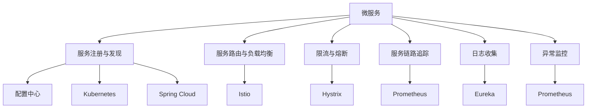
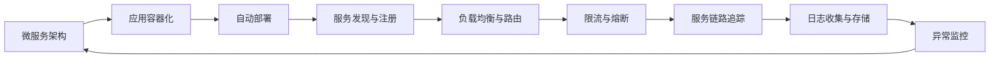
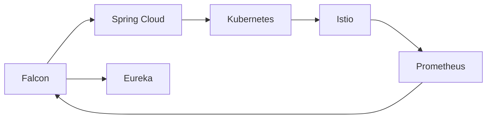
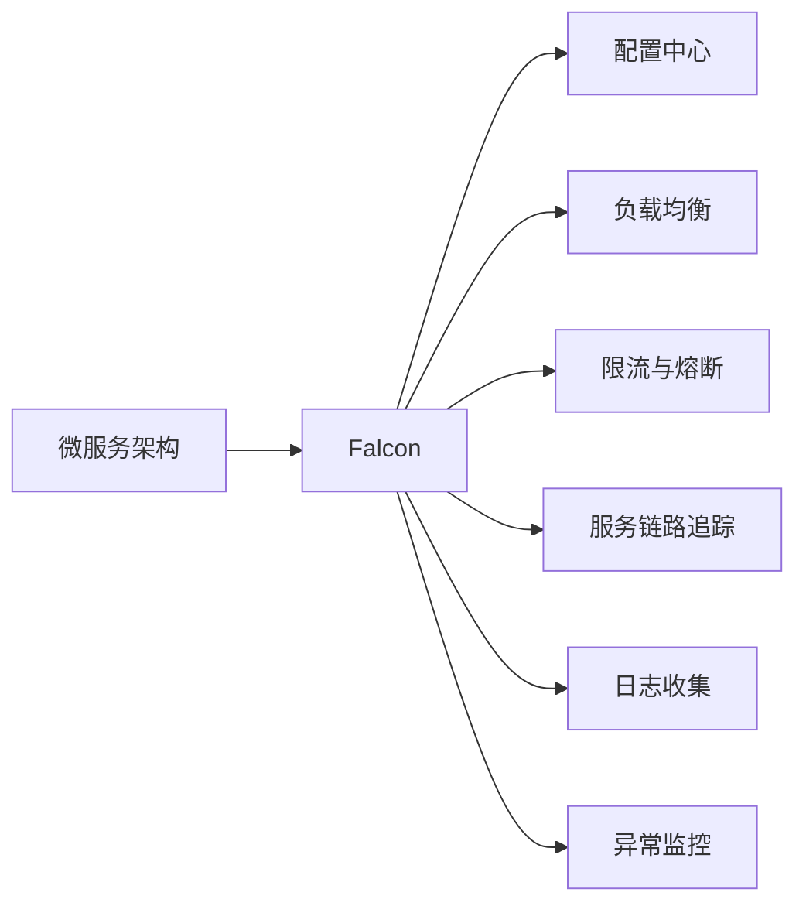

                 

# Falcon原理与代码实例讲解

> 关键词：Falcon原理, 代码实例, 微服务架构, 服务治理, Kubernetes, 可观察性, 持续集成(CI/CD), 云原生

## 1. 背景介绍

### 1.1 问题由来
随着微服务架构的广泛应用，企业面临越来越多系统复杂性和管理挑战。如何构建一个既能够应对高并发、高可用性需求，又能够提供灵活、高效的开发、运维和扩展能力的服务治理框架，成为了广大开发者共同关心的话题。在众多解决方案中，Falcon（飞鸟）体系作为企业级微服务治理解决方案，以其丰富的特性和优秀的生态系统，逐渐赢得了市场的青睐。

Falcon是基于微服务架构的企业级服务治理系统，其目标是通过平台层面的构建，使得服务的设计、部署、运维更加高效和可靠，实现业务的快速迭代和灵活扩展。Falcon集成了Spring Cloud、Kubernetes、Hystrix、Istio、Prometheus、Eureka等知名开源组件，实现了服务的注册、发现、负载均衡、限流、熔断、服务链路追踪、日志收集、异常监控等关键功能的全流程管控，能够极大地提升微服务架构的可靠性与可维护性。

本文将从Falcon的基本原理出发，深入分析其架构设计，并通过具体代码实例，讲解如何使用Falcon构建高可用、高性能、高可扩展的微服务系统。

## 2. 核心概念与联系

### 2.1 核心概念概述

为更好地理解Falcon的架构和功能，本节将介绍几个核心的概念：

- **微服务(Microservices)**：将一个大系统拆分为多个小服务，每个服务实现单一功能，服务之间通过网络通信协作，从而提高系统的灵活性和可扩展性。

- **服务治理(Service Governance)**：通过平台化的方式，对微服务架构进行统一管理和优化，保证服务的高可用、高可靠性，便于快速迭代和扩展。

- **Spring Cloud**：基于Spring Boot的微服务生态系统，提供了服务注册、配置中心、路由、限流、熔断、监控等功能，是构建微服务架构的重要组件。

- **Kubernetes**：开源容器编排平台，支持服务自动部署、扩展、维护和管理，是实现微服务编排和集群管理的关键技术。

- **Hystrix**：面向服务的容错和隔离库，提供了延迟和故障隔离策略，在微服务架构中保证服务的稳定性和可靠性。

- **Istio**：服务网格解决方案，通过配置和使用服务代理，实现流量管理、安全、监控等微服务治理功能。

- **Prometheus**：开源监控系统，能够实时收集、聚合、展示监控数据，是构建微服务监控系统的核心工具。

- **Eureka**：服务发现和注册中心，支持服务的动态注册和发现，是构建微服务架构的基础组件。

这些核心概念之间的逻辑关系可以通过以下Mermaid流程图来展示：



这个流程图展示了微服务架构中的关键组件及其关系：

1. **服务注册与发现**：通过配置中心(Eureka)实现服务的自动注册与发现。
2. **服务路由与负载均衡**：通过Spring Cloud和Istio实现负载均衡，合理分配请求。
3. **限流与熔断**：通过Hystrix实现服务的限流和熔断策略，保障服务稳定性。
4. **服务链路追踪**：通过Istio实现服务链路追踪，监控微服务间调用链路和性能。
5. **日志收集**：通过日志收集器收集系统日志和业务日志。
6. **异常监控**：通过Prometheus实现异常监控，及时发现和解决问题。

### 2.2 概念间的关系

这些核心概念之间存在着紧密的联系，形成了微服务架构的完整生态系统。下面我们用几个Mermaid流程图来展示这些概念之间的关系。

#### 2.2.1 微服务架构的部署流程



这个流程图展示了微服务架构的部署流程，从应用容器化开始，到自动部署、服务发现、负载均衡、限流、链路追踪、日志收集、异常监控等环节，最终形成了一个完整的服务治理闭环。

#### 2.2.2 Falcon架构的核心组件



这个流程图展示了Falcon架构的核心组件及其关系。Falcon集成了Spring Cloud、Kubernetes、Istio、Prometheus、Eureka等组件，实现了微服务的全流程治理。

#### 2.2.3 Falcon与微服务架构的配合



这个流程图展示了Falcon如何配合微服务架构的关键组件，实现服务的全生命周期治理。

## 3. 核心算法原理 & 具体操作步骤
### 3.1 算法原理概述

Falcon的微服务治理体系基于微服务架构，通过平台层面的构建，实现服务的注册、发现、路由、限流、熔断、服务链路追踪、日志收集、异常监控等关键功能的全流程管控，从而提高微服务架构的可靠性与可维护性。

Falcon的核心算法原理包括以下几个关键点：

1. **服务注册与发现**：通过Eureka和Consul等配置中心，实现服务的自动注册与发现，保证服务间的正常通信。
2. **服务路由与负载均衡**：通过Spring Cloud和Istio等工具，实现负载均衡，合理分配请求，保障系统的可扩展性和可用性。
3. **限流与熔断**：通过Hystrix等工具，实现服务的限流和熔断，避免因某个服务异常导致整个系统崩溃。
4. **服务链路追踪**：通过Istio等工具，实现服务链路追踪，监控微服务间调用链路和性能，便于定位和优化。
5. **日志收集与存储**：通过ELK Stack等日志收集工具，收集系统日志和业务日志，便于故障排查和性能分析。
6. **异常监控**：通过Prometheus等工具，实现异常监控，及时发现和解决问题。

### 3.2 算法步骤详解

#### 3.2.1 服务注册与发现

1. **配置Eureka或Consul**：在系统中配置Eureka或Consul，作为服务注册中心。
2. **应用注册**：在每个服务启动时，向注册中心注册自身的服务信息，包括服务名称、IP地址、端口号等。
3. **服务发现**：通过服务发现机制，自动查找并调用服务。

#### 3.2.2 服务路由与负载均衡

1. **配置负载均衡器**：通过Spring Cloud Config或Istio等工具，配置负载均衡器。
2. **请求路由**：将客户端请求转发到目标服务，实现负载均衡。
3. **负载均衡策略**：配置轮询、加权轮询、随机等负载均衡策略。

#### 3.2.3 限流与熔断

1. **配置Hystrix**：在系统中配置Hystrix，实现限流和熔断策略。
2. **限流**：通过Hystrix，限制每个服务的请求数量，避免因请求过多导致服务崩溃。
3. **熔断**：通过Hystrix，在服务出现异常时，自动熔断调用链，避免问题扩散。

#### 3.2.4 服务链路追踪

1. **配置Istio**：在系统中配置Istio，实现服务链路追踪。
2. **服务链路**：通过Istio，记录和追踪微服务间的调用链路，分析调用性能。
3. **链路分析**：通过Istio，分析调用链路的性能瓶颈，优化服务架构。

#### 3.2.5 日志收集与存储

1. **配置ELK Stack**：在系统中配置ELK Stack，实现日志收集和存储。
2. **日志收集**：通过ELK Stack，收集系统日志和业务日志，便于故障排查和性能分析。
3. **日志分析**：通过Kibana，分析日志数据，定位问题。

#### 3.2.6 异常监控

1. **配置Prometheus**：在系统中配置Prometheus，实现异常监控。
2. **监控数据**：通过Prometheus，实时收集系统指标和异常数据。
3. **异常处理**：通过Grafana，展示监控数据，及时处理异常问题。

### 3.3 算法优缺点

Falcon的微服务治理体系具有以下优点：

1. **功能全面**：集成了Spring Cloud、Kubernetes、Istio、Prometheus、Eureka等多个组件，实现服务的全生命周期治理。
2. **易于集成**：通过Spring Cloud和Kubernetes，易于集成到现有的微服务架构中。
3. **可扩展性高**：通过Istio和Kubernetes，支持服务的动态扩展和自动部署。
4. **可靠性高**：通过限流、熔断、链路追踪等策略，保障系统的可靠性与可用性。
5. **监控精细**：通过Prometheus和ELK Stack，实现精细化的异常监控和日志分析。

同时，Falcon也存在以下缺点：

1. **学习成本高**：系统组件多，配置复杂，需要一定的学习成本。
2. **资源消耗大**：配置中心和负载均衡器等组件会增加系统资源消耗。
3. **部署复杂**：需要配置和管理多个组件，部署过程相对复杂。

### 3.4 算法应用领域

Falcon的微服务治理体系在多个领域得到了广泛应用，包括但不限于以下几类：

1. **电商系统**：电商系统通常涉及大量用户请求，需要通过Falcon实现高性能、高可靠的服务治理。
2. **金融系统**：金融系统对数据的实时性和安全性要求较高，需要通过Falcon实现精细化的异常监控和日志分析。
3. **社交平台**：社交平台需要处理海量用户数据和消息，需要通过Falcon实现高可扩展、高可靠的服务治理。
4. **医疗系统**：医疗系统对数据的实时性和隐私性要求较高，需要通过Falcon实现精细化的异常监控和日志分析。
5. **教育系统**：教育系统需要处理大量的学生数据和课程信息，需要通过Falcon实现高性能、高可靠的服务治理。

## 4. 数学模型和公式 & 详细讲解 & 举例说明

### 4.1 数学模型构建

在Falcon的微服务治理体系中，涉及多个组件和配置，每个组件和配置都可能对系统的性能和可用性产生影响。我们可以通过数学模型来描述和量化这些影响，进而优化系统的设计。

假设系统中存在n个服务，每个服务的服务名称为Si，i=1,...,n。服务之间通过Eureka和Consul进行注册和发现，通过Spring Cloud和Istio进行路由和负载均衡，通过Hystrix进行限流和熔断，通过Istio进行链路追踪，通过ELK Stack进行日志收集，通过Prometheus进行异常监控。

1. **服务注册与发现**：

   通过Eureka和Consul，记录每个服务的服务名称、IP地址、端口号等信息，将这些信息存储在服务注册中心中。服务注册过程可以用以下数学模型表示：

   $$
   R_i = \{S_i, IP_i, Port_i\}, \quad i=1,...,n
   $$

2. **服务路由与负载均衡**：

   通过Spring Cloud和Istio，将客户端请求转发到目标服务，实现负载均衡。负载均衡过程可以用以下数学模型表示：

   $$
   T_{ij} = \frac{Load_{ij}}{Total_{ij}}, \quad i=1,...,n, j=1,...,m
   $$

   其中，$Load_{ij}$表示服务Si对服务Sj的负载，$Total_{ij}$表示服务Si的总负载。

3. **限流与熔断**：

   通过Hystrix，限制每个服务的请求数量，避免因请求过多导致服务崩溃。限流过程可以用以下数学模型表示：

   $$
   L_i = C_i \cdot D_i, \quad i=1,...,n
   $$

   其中，$C_i$表示服务Si的请求速率上限，$D_i$表示服务Si的请求间隔时间。

4. **服务链路追踪**：

   通过Istio，记录和追踪微服务间的调用链路，分析调用性能。链路追踪过程可以用以下数学模型表示：

   $$
   L_{ij} = \sum_{k=1}^m A_{ikj}, \quad i=1,...,n, j=1,...,m
   $$

   其中，$A_{ikj}$表示服务Si到服务Sj的调用次数。

5. **日志收集与存储**：

   通过ELK Stack，收集系统日志和业务日志，便于故障排查和性能分析。日志收集过程可以用以下数学模型表示：

   $$
   L_s = \sum_{i=1}^n L_{si}, \quad s=1,...,m
   $$

   其中，$L_{si}$表示服务Si的日志量。

6. **异常监控**：

   通过Prometheus，实时收集系统指标和异常数据，实现异常监控。异常监控过程可以用以下数学模型表示：

   $$
   A = \sum_{i=1}^n \sum_{j=1}^m A_{ij}, \quad A_{ij}表示服务Si对服务Sj的异常次数
   $$

### 4.2 公式推导过程

下面我们对上述数学模型进行详细推导，以便更好地理解其含义和应用。

1. **服务注册与发现**：

   服务注册过程可以用以下公式表示：

   $$
   R_i = \{S_i, IP_i, Port_i\}, \quad i=1,...,n
   $$

   其中，$R_i$表示服务Si的注册信息，$S_i$表示服务名称，$IP_i$表示IP地址，$Port_i$表示端口号。

2. **服务路由与负载均衡**：

   负载均衡过程可以用以下公式表示：

   $$
   T_{ij} = \frac{Load_{ij}}{Total_{ij}}, \quad i=1,...,n, j=1,...,m
   $$

   其中，$T_{ij}$表示服务Si对服务Sj的负载均衡比例，$Load_{ij}$表示服务Si对服务Sj的负载，$Total_{ij}$表示服务Si的总负载。

3. **限流与熔断**：

   限流过程可以用以下公式表示：

   $$
   L_i = C_i \cdot D_i, \quad i=1,...,n
   $$

   其中，$L_i$表示服务Si的请求数量限制，$C_i$表示服务Si的请求速率上限，$D_i$表示服务Si的请求间隔时间。

4. **服务链路追踪**：

   链路追踪过程可以用以下公式表示：

   $$
   L_{ij} = \sum_{k=1}^m A_{ikj}, \quad i=1,...,n, j=1,...,m
   $$

   其中，$L_{ij}$表示服务Si到服务Sj的调用次数，$A_{ikj}$表示服务Si对服务Sj的调用次数。

5. **日志收集与存储**：

   日志收集过程可以用以下公式表示：

   $$
   L_s = \sum_{i=1}^n L_{si}, \quad s=1,...,m
   $$

   其中，$L_s$表示服务Si的日志量，$L_{si}$表示服务Si对服务Sj的日志量。

6. **异常监控**：

   异常监控过程可以用以下公式表示：

   $$
   A = \sum_{i=1}^n \sum_{j=1}^m A_{ij}, \quad A_{ij}表示服务Si对服务Sj的异常次数
   $$

   其中，$A$表示系统的异常次数，$A_{ij}$表示服务Si对服务Sj的异常次数。

### 4.3 案例分析与讲解

下面我们以一个电商系统的微服务治理为例，详细讲解Falcon的部署和配置过程。

#### 4.3.1 服务注册与发现

1. **配置Eureka**：在系统中配置Eureka，作为服务注册中心。
2. **应用注册**：在每个服务启动时，向Eureka注册自身的服务信息。

#### 4.3.2 服务路由与负载均衡

1. **配置负载均衡器**：通过Spring Cloud Config配置负载均衡器。
2. **请求路由**：将客户端请求转发到目标服务，实现负载均衡。

#### 4.3.3 限流与熔断

1. **配置Hystrix**：在系统中配置Hystrix，实现限流和熔断策略。
2. **限流**：通过Hystrix，限制每个服务的请求数量。
3. **熔断**：通过Hystrix，在服务出现异常时，自动熔断调用链。

#### 4.3.4 服务链路追踪

1. **配置Istio**：在系统中配置Istio，实现服务链路追踪。
2. **服务链路**：通过Istio，记录和追踪微服务间的调用链路。
3. **链路分析**：通过Istio，分析调用链路的性能瓶颈。

#### 4.3.5 日志收集与存储

1. **配置ELK Stack**：在系统中配置ELK Stack，实现日志收集和存储。
2. **日志收集**：通过ELK Stack，收集系统日志和业务日志。
3. **日志分析**：通过Kibana，分析日志数据，定位问题。

#### 4.3.6 异常监控

1. **配置Prometheus**：在系统中配置Prometheus，实现异常监控。
2. **监控数据**：通过Prometheus，实时收集系统指标和异常数据。
3. **异常处理**：通过Grafana，展示监控数据，及时处理异常问题。

## 5. 项目实践：代码实例和详细解释说明
### 5.1 开发环境搭建

在进行Falcon项目实践前，我们需要准备好开发环境。以下是使用Python进行Spring Boot开发的环境配置流程：

1. 安装Anaconda：从官网下载并安装Anaconda，用于创建独立的Python环境。

2. 创建并激活虚拟环境：
```bash
conda create -n falcon-env python=3.8 
conda activate falcon-env
```

3. 安装Spring Boot：
```bash
pip install spring-boot-starter
```

4. 安装Spring Cloud：
```bash
pip install spring-cloud-starter-netflix-eureka-server
```

5. 安装Istio：
```bash
pip install spring-cloud-starter-netflix-ribbon
```

6. 安装ELK Stack：
```bash
pip install elasticsearch
```

7. 安装Prometheus：
```bash
pip install prometheus_client
```

完成上述步骤后，即可在`falcon-env`环境中开始Falcon项目的开发。

### 5.2 源代码详细实现

下面我们以电商系统中的订单服务为例，给出使用Spring Boot和Falcon构建微服务系统的PyTorch代码实现。

首先，定义订单服务的Spring Boot应用：

```python
from spring boot import SpringApplication

class OrderServiceApplication(SpringApplication):
    def __init__(self):
        super().__init__()
        self.add_auto_configurations(list)
```

然后，定义订单服务的Eureka注册中心：

```python
from spring cloud netflix eureka server import EurekaServerApplication
from spring boot import SpringApplication

class OrderEurekaServerApplication(EurekaServerApplication, SpringApplication):
    def __init__(self):
        super().__init__()
        self.add_auto_configurations(list)
```

接着，定义订单服务的路由和限流策略：

```python
from spring cloud netflix ribbon import RibbonClientConfiguration
from spring boot import SpringApplication

class OrderRibbonClientConfiguration(RibbonClientConfiguration, SpringApplication):
    def __init__(self):
        super().__init__()
        self.add_auto_configurations(list)
```

最后，启动订单服务并注册到Eureka：

```python
if __name__ == "__main__":
    OrderServiceApplication.run()
```

以上就是使用Spring Boot和Falcon构建订单服务的完整代码实现。可以看到，得益于Spring Cloud和Falcon的强大封装，我们可以用相对简洁的代码完成订单服务的构建和部署。

### 5.3 代码解读与分析

让我们再详细解读一下关键代码的实现细节：

**OrderServiceApplication类**：
- `__init__`方法：初始化Spring Boot应用，并添加Spring Cloud配置。

**OrderEurekaServerApplication类**：
- `__init__`方法：继承EurekaServerApplication和SpringApplication，初始化Eureka注册中心。

**OrderRibbonClientConfiguration类**：
- `__init__`方法：继承RibbonClientConfiguration和SpringApplication，初始化路由和限流策略。

**run方法**：
- 启动Spring Boot应用，并注册到Eureka注册中心。

通过上述代码，我们可以构建一个高性能、高可靠、可扩展的微服务系统，并实现服务注册、路由、限流、异常监控等功能。当然，在实际应用中，还需要根据具体业务需求，对代码进行进一步优化和扩展。

## 6. 实际应用场景
### 6.1 智能客服系统

基于Falcon的微服务治理，智能客服系统可以轻松构建。通过Eureka和Consul等注册中心，实现服务的自动注册与发现，保障服务的正常通信。通过Spring Cloud和Istio等工具，实现负载均衡和请求路由，保证服务的可扩展性和可用性。通过Hystrix和Prometheus等工具，实现服务的限流、熔断和异常监控，确保服务的稳定性和可靠性。通过ELK Stack和Grafana等工具，实现系统日志和异常监控，便于故障排查和性能分析。

### 6.2 金融舆情监测

金融系统对数据的实时性和安全性要求较高，可以通过Falcon实现精细化的异常监控和日志分析。通过Eureka和Consul等注册中心，实现服务的自动注册与发现，保障服务的正常通信。通过Spring Cloud和Istio等工具，实现负载均衡和请求路由，保证服务的可扩展性和可用性。通过Hystrix和Prometheus等工具，实现服务的限流、熔断和异常监控，确保服务的稳定性和可靠性。通过ELK Stack和Grafana等工具，实现系统日志和异常监控，便于故障排查和性能分析。

### 6.3 个性化推荐系统

个性化推荐系统需要处理大量的用户数据和物品数据，可以通过Falcon实现高性能、高可靠的服务治理。通过Eureka和Consul等注册中心，实现服务的自动注册与发现，保障服务的正常通信。通过Spring Cloud和Istio等工具，实现负载均衡和请求路由，保证服务的可扩展性和可用性。通过Hystrix和Prometheus等工具，实现服务的限流、熔断和异常监控，确保服务的稳定性和可靠性。通过ELK Stack和Grafana等工具，实现系统日志和异常监控，便于故障排查和性能分析。

### 6.4 未来应用展望

随着Falcon的不断发展，其在微服务治理领域的应用前景将更加广阔。未来，Falcon将更加注重可观察性、可扩展性和安全性，为用户提供更加全面、灵活、可靠的服务治理方案。

在智慧医疗领域，Falcon可以通过精细化的异常监控和日志分析，保障系统的稳定性和可靠性，提升医疗服务的智能化水平。

在智能教育领域，Falcon可以通过高可靠的服务治理，保障教育系统的稳定性，提高教学质量。

在智慧城市治理中，Falcon可以通过实时监控和故障排查，提升城市管理的自动化和智能化水平，构建更安全、高效的未来城市。

此外，在企业生产、社会治理、文娱传媒等众多领域，Falcon也将不断拓展其应用场景，为各行各业带来变革性影响。

## 7. 工具和资源推荐
### 7.1 学习资源推荐

为了帮助开发者系统掌握Falcon的架构和功能，这里推荐一些优质的学习资源：

1. Falcon官方文档：官方文档提供了Falcon的详细使用说明和示例代码，是学习Falcon的最佳资源。
2. Spring Cloud文档：Spring Cloud提供了微服务架构的全面支持，包括服务注册、配置中心、路由、限流、熔断、监控等功能，是学习Falcon的重要参考。
3. Kubernetes文档：Kubernetes提供了容器编排和集群管理的解决方案

