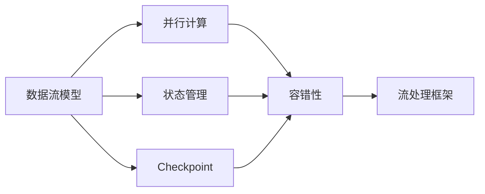
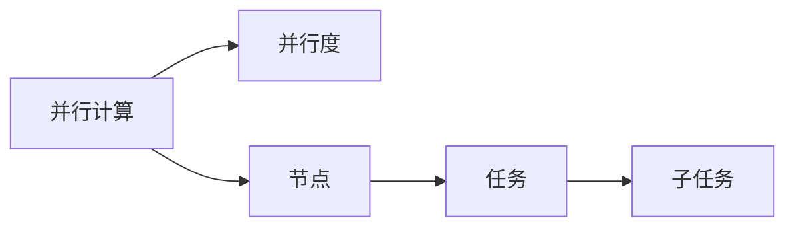
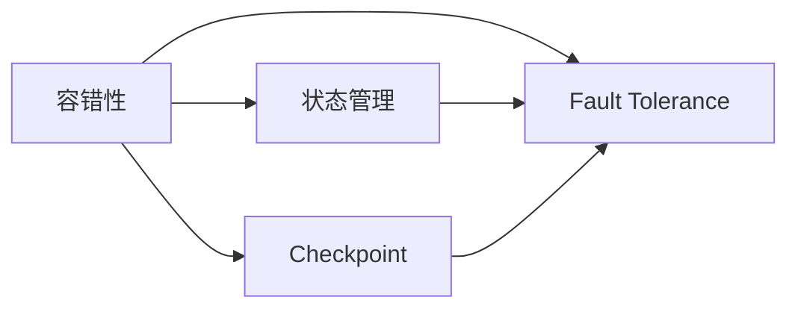
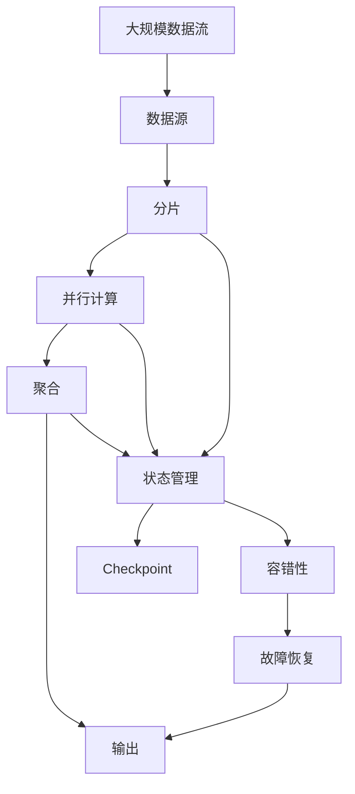

                 

# Flink原理与代码实例讲解

> 关键词：Flink, Apache Flink, 分布式流处理, 高吞吐量, 低延迟, 鲁棒性, 状态管理, 流处理框架

## 1. 背景介绍

### 1.1 问题由来
随着大数据技术的不断发展和应用场景的日益丰富，对数据处理的实时性、高吞吐量和低延迟要求不断提高。传统的批处理框架，如Hadoop MapReduce，已经难以满足这些需求。因此，分布式流处理框架应运而生，其中Apache Flink是近年来最受欢迎的一种。

Flink由Apache Software Foundation（ASF）于2014年开源，是处理任意规模、任意类型数据流的分布式流处理框架。其核心特点包括：

- 高吞吐量：支持高达每秒百万级的数据处理能力。
- 低延迟：提供毫秒级的端到端处理延迟。
- 鲁棒性：支持数据流的状态管理和容错机制，确保在故障恢复时数据一致性。

Flink被广泛应用于实时数据分析、实时流计算、实时数据同步、实时消息流处理等多个领域，帮助企业实现数据的实时处理和分析。

### 1.2 问题核心关键点
Flink的核心目标是通过高性能的分布式流处理，实现数据的实时、可靠、安全处理。其主要包括以下几个关键点：

- 数据流模型：将数据处理过程看作是无限、流式的数据流，支持复杂的数据处理操作。
- 可扩展性：通过分布式并行计算，支持大规模数据流的处理。
- 容错性：通过数据流的状态管理和checkpoint机制，确保数据处理的一致性和可靠性。
- 高吞吐量：通过优化数据流处理算法和内存管理，实现高效的数据处理。
- 低延迟：通过高效的数据分片和并行计算，减少处理延迟。
- 鲁棒性：支持故障恢复和数据一致性保证，确保系统稳定可靠。

Flink通过这些关键点，实现了高可用、高吞吐量、低延迟的流处理能力，广泛应用于大数据处理、实时计算、数据同步等领域。

### 1.3 问题研究意义
Flink作为新一代分布式流处理框架，其高性能、低延迟、鲁棒性和可扩展性等特点，使其成为大数据处理和实时计算的重要工具。研究Flink原理与代码实现，对提升大数据处理能力、优化实时计算性能、保障数据一致性具有重要意义：

1. 提升大数据处理能力：Flink支持大规模、高吞吐量的数据流处理，适用于大数据分析、数据清洗等任务。
2. 优化实时计算性能：Flink的流处理模型支持低延迟、毫秒级处理能力，适用于实时计算、实时数据分析等任务。
3. 保障数据一致性：Flink的状态管理和容错机制，确保数据在故障恢复时的可靠性和一致性。
4. 增强系统鲁棒性：Flink的高可用性设计和容错机制，使其在复杂的计算环境中稳定可靠。
5. 推动大数据应用创新：Flink的灵活性和扩展性，支持多种数据源和数据格式，为大数据应用提供了更多创新可能性。

## 2. 核心概念与联系

### 2.1 核心概念概述

为了更好地理解Flink的原理与代码实现，本节将介绍几个密切相关的核心概念：

- 数据流模型（Data Stream Model）：将数据处理过程看作是无限、流式的数据流，支持复杂的数据处理操作。
- 并行计算（Parallel Computing）：通过分布式并行计算，支持大规模数据流的处理。
- 状态管理（State Management）：通过维护状态，实现复杂的数据处理操作和故障恢复。
- Checkpoint（Checkpointing）：通过周期性保存数据流状态，实现数据的可靠性和一致性。
- 容错性（Fault Tolerance）：通过状态管理和Checkpoint机制，确保数据处理的一致性和可靠性。
- 流处理框架（Stream Processing Framework）：基于上述核心概念，实现高性能、高可靠性、高可扩展性的流处理系统。

这些核心概念之间的逻辑关系可以通过以下Mermaid流程图来展示：



这个流程图展示了大规模数据流处理过程中各个概念之间的关系：

1. 数据流模型是Flink的核心概念，通过将数据处理过程看作无限流式数据流，支持复杂的数据处理操作。
2. 并行计算是实现大规模数据流处理的基础，通过分布式并行计算，提升处理能力。
3. 状态管理是复杂数据处理的基础，通过维护数据流状态，支持复杂的数据处理操作。
4. Checkpoint是实现数据一致性和可靠性的关键，通过周期性保存数据流状态，实现故障恢复。
5. 容错性是Flink的根本特性，通过状态管理和Checkpoint机制，确保数据一致性和系统稳定。
6. 流处理框架是上述核心概念的封装，实现高性能、高可靠性和高可扩展性的流处理系统。

### 2.2 概念间的关系

这些核心概念之间存在着紧密的联系，形成了Flink流处理系统的完整生态系统。下面我们通过几个Mermaid流程图来展示这些概念之间的关系。

#### 2.2.1 数据流模型的计算过程


这个流程图展示了数据流模型在Flink中的计算过程：

1. 数据源：将原始数据作为输入，送入Flink系统。
2. 分片：将数据源分割成多个小片段（Partitions），分别进行并行计算。
3. 并行计算：通过分布式并行计算，提升处理能力。
4. 聚合：对各个分片的结果进行聚合计算，得到最终结果。
5. 输出：将计算结果输出到外部系统，完成数据处理。

#### 2.2.2 并行计算的并行度



这个流程图展示了并行计算的并行度：

1. 并行计算：通过分布式并行计算，提升处理能力。
2. 并行度：通过设置并行度，控制并行计算的粒度。
3. 节点：将数据流分发到多个节点进行计算。
4. 任务：每个节点将数据流分片后进行计算。
5. 子任务：任务中的子任务进一步细粒度处理，提升处理效率。

#### 2.2.3 状态管理与Checkpoint的实现


这个流程图展示了状态管理和Checkpoint的实现过程：

1. 状态管理：通过维护数据流状态，支持复杂的数据处理操作。
2. Checkpoint：通过周期性保存数据流状态，实现故障恢复。
3. 状态快照：周期性保存数据流状态的快照。
4. 恢复：在故障恢复时，通过加载状态快照，恢复数据流状态。

#### 2.2.4 容错性在Flink中的体现



这个流程图展示了容错性在Flink中的实现：

1. 容错性：通过状态管理和Checkpoint机制，确保数据一致性和系统稳定。
2. Fault Tolerance：实现系统的故障恢复能力。
3. 状态管理：通过维护数据流状态，支持复杂的数据处理操作。
4. Checkpoint：通过周期性保存数据流状态，实现故障恢复。

### 2.3 核心概念的整体架构

最后，我们用一个综合的流程图来展示这些核心概念在大规模数据流处理过程中的整体架构：



这个综合流程图展示了从数据流模型到并行计算、状态管理、Checkpoint等各个关键概念的实现过程：

1. 大规模数据流：原始数据作为输入，送入Flink系统。
2. 数据源：将原始数据分割成多个分片。
3. 分片：每个分片进行并行计算。
4. 并行计算：通过分布式并行计算，提升处理能力。
5. 聚合：对各个分片的结果进行聚合计算，得到最终结果。
6. 输出：将计算结果输出到外部系统，完成数据处理。
7. 状态管理：维护数据流状态，支持复杂的数据处理操作。
8. Checkpoint：周期性保存数据流状态的快照。
9. 容错性：通过状态管理和Checkpoint机制，确保数据一致性和系统稳定。
10. 故障恢复：在故障恢复时，通过加载状态快照，恢复数据流状态。

通过这些流程图，我们可以更清晰地理解Flink的计算过程和核心概念之间的关系，为后续深入讨论具体的算法和实现细节奠定基础。

## 3. 核心算法原理 & 具体操作步骤

### 3.1 算法原理概述

Flink的核心算法原理主要包括数据流模型、并行计算、状态管理、Checkpoint和容错性等关键概念。这些概念共同构成了Flink的高性能、低延迟和鲁棒性。

Flink通过无限流式的数据流模型，支持复杂的数据处理操作。并行计算通过分布式并行计算，提升处理能力。状态管理通过维护数据流状态，支持复杂的数据处理操作。Checkpoint通过周期性保存数据流状态，实现数据的可靠性和一致性。容错性通过状态管理和Checkpoint机制，确保数据一致性和系统稳定。

这些核心算法原理，使得Flink能够高效、稳定地处理大规模数据流，适用于各种实时数据分析和流计算任务。

### 3.2 算法步骤详解

Flink的算法步骤主要包括数据流模型的构建、并行计算的实现、状态管理和Checkpoint的执行以及容错性的保障。以下是对每个步骤的详细讲解：

#### 3.2.1 数据流模型的构建

1. 数据源：将原始数据作为输入，送入Flink系统。

2. 分片：将数据源分割成多个小片段（Partitions），分别进行并行计算。

3. 并行计算：通过分布式并行计算，提升处理能力。

4. 聚合：对各个分片的结果进行聚合计算，得到最终结果。

5. 输出：将计算结果输出到外部系统，完成数据处理。

#### 3.2.2 并行计算的实现

1. 并行度：通过设置并行度，控制并行计算的粒度。

2. 节点：将数据流分发到多个节点进行计算。

3. 任务：每个节点将数据流分片后进行计算。

4. 子任务：任务中的子任务进一步细粒度处理，提升处理效率。

#### 3.2.3 状态管理的实现

1. 状态管理：通过维护数据流状态，支持复杂的数据处理操作。

2. 状态快照：周期性保存数据流状态的快照。

3. 恢复：在故障恢复时，通过加载状态快照，恢复数据流状态。

#### 3.2.4 Checkpoint的执行

1. Checkpoint：通过周期性保存数据流状态，实现数据的可靠性和一致性。

2. 状态快照：周期性保存数据流状态的快照。

3. 恢复：在故障恢复时，通过加载状态快照，恢复数据流状态。

#### 3.2.5 容错性的保障

1. 容错性：通过状态管理和Checkpoint机制，确保数据一致性和系统稳定。

2. Fault Tolerance：实现系统的故障恢复能力。

3. 状态管理：通过维护数据流状态，支持复杂的数据处理操作。

4. Checkpoint：通过周期性保存数据流状态，实现故障恢复。

### 3.3 算法优缺点

Flink的算法具有以下优点：

1. 高性能：通过并行计算和优化算法，Flink能够处理大规模数据流，支持高吞吐量的数据处理。

2. 低延迟：通过高效的分布式计算和优化算法，Flink能够提供毫秒级的处理延迟。

3. 高可靠性：通过状态管理和Checkpoint机制，Flink能够实现数据的可靠性和一致性，确保故障恢复时的数据一致性。

4. 高可扩展性：通过分布式并行计算，Flink能够支持大规模数据流的处理，具有良好的扩展性。

Flink的算法也存在一些缺点：

1. 复杂度较高：Flink的算法实现较为复杂，需要具备一定的技术背景才能进行开发。

2. 内存占用较大：Flink需要大量的内存来存储状态和Checkpoint数据，对内存资源要求较高。

3. 调优难度大：Flink的调优较为复杂，需要综合考虑数据流模型、并行度、状态管理等多个因素。

4. 性能瓶颈：在数据流模型和并行度设计不当的情况下，Flink的性能可能会受到瓶颈影响。

### 3.4 算法应用领域

Flink的应用领域非常广泛，适用于各种实时数据分析和流计算任务。以下是Flink主要的应用领域：

1. 实时数据分析：Flink可以处理实时数据流，进行实时数据分析和统计。

2. 实时流计算：Flink支持流计算操作，如窗口计算、聚合计算等。

3. 实时数据同步：Flink可以实时同步数据流，确保数据一致性和可靠性。

4. 实时消息流处理：Flink可以处理实时消息流，支持实时消息处理和过滤。

5. 实时应用推荐：Flink可以实时分析用户行为数据，进行个性化推荐。

6. 实时日志处理：Flink可以实时处理日志数据，进行日志分析和监控。

除了上述这些应用领域外，Flink还被应用于金融风险监控、智能交通管理、实时广告投放、物联网数据处理等多个领域，展示了其强大的应用潜力。

## 4. 数学模型和公式 & 详细讲解 & 举例说明

### 4.1 数学模型构建

Flink的核心数学模型主要包括数据流模型、并行计算模型、状态管理模型和Checkpoint模型等。

#### 4.1.1 数据流模型

数据流模型是Flink的核心概念，通过将数据处理过程看作无限、流式的数据流，支持复杂的数据处理操作。数据流模型可以表示为：

$$
D = \{ d_1, d_2, \dots, d_n \}
$$

其中，$d_i$表示第$i$个数据元素，$D$表示数据流。数据流模型支持数据流的无限流式处理，支持复杂的数据处理操作，如窗口计算、聚合计算等。

#### 4.1.2 并行计算模型

并行计算模型通过分布式并行计算，提升处理能力。并行计算模型可以表示为：

$$
P = \{ p_1, p_2, \dots, p_m \}
$$

其中，$p_i$表示第$i$个并行计算节点，$P$表示并行计算集。并行计算模型通过将数据流分发到多个节点进行计算，提升处理能力。

#### 4.1.3 状态管理模型

状态管理模型通过维护数据流状态，支持复杂的数据处理操作。状态管理模型可以表示为：

$$
S = \{ s_1, s_2, \dots, s_n \}
$$

其中，$s_i$表示第$i$个数据流状态，$S$表示状态集合。状态管理模型通过维护数据流状态，支持复杂的数据处理操作，如窗口计算、聚合计算等。

#### 4.1.4 Checkpoint模型

Checkpoint模型通过周期性保存数据流状态，实现数据的可靠性和一致性。Checkpoint模型可以表示为：

$$
C = \{ c_1, c_2, \dots, c_k \}
$$

其中，$c_i$表示第$i$个Checkpoint数据，$C$表示Checkpoint集合。Checkpoint模型通过周期性保存数据流状态的快照，实现故障恢复和数据一致性。

#### 4.1.5 容错性模型

容错性模型通过状态管理和Checkpoint机制，确保数据一致性和系统稳定。容错性模型可以表示为：

$$
F = \{ f_1, f_2, \dots, f_n \}
$$

其中，$f_i$表示第$i$个容错机制，$F$表示容错集合。容错性模型通过状态管理和Checkpoint机制，确保数据一致性和系统稳定。

### 4.2 公式推导过程

以下是Flink中几个核心算法的公式推导过程。

#### 4.2.1 并行计算的并行度公式

在Flink中，并行度是一个非常重要的概念，决定了并行计算的粒度。并行度的计算公式为：

$$
parallelism = \frac{total\_capacity}{\nu}
$$

其中，$parallelism$表示并行度，$total\_capacity$表示集群中的总计算能力，$\nu$表示每个节点的计算能力。并行度决定了每个节点分配的计算任务数量，从而影响整个系统的处理能力。

#### 4.2.2 状态管理的快照公式

状态管理的核心是快照，通过周期性保存数据流状态的快照，实现数据的可靠性和一致性。快照的计算公式为：

$$
checkpoint\_frequency = \frac{file\_size}{memory\_limit} \times rate
$$

其中，$checkpoint\_frequency$表示Checkpoint的频率，$file\_size$表示每个Checkpoint文件的大小，$memory\_limit$表示系统内存限制，$rate$表示系统每秒生成数据流的速率。通过调整Checkpoint频率，可以在保证数据一致性的同时，优化系统性能。

#### 4.2.3 Checkpoint的恢复公式

Checkpoint的恢复是Flink中实现数据一致性和故障恢复的关键。Checkpoint的恢复公式为：

$$
recovery\_time = \frac{file\_size}{bandwidth} \times \left(\frac{n}{parallelism} + 1\right)
$$

其中，$recovery\_time$表示恢复时间，$file\_size$表示每个Checkpoint文件的大小，$bandwidth$表示系统带宽，$n$表示Checkpoint的数量，$parallelism$表示并行度。通过调整Checkpoint恢复时间，可以在保证数据一致性的同时，优化系统性能。

### 4.3 案例分析与讲解

#### 4.3.1 实时数据分析案例

在实时数据分析场景中，Flink可以处理实时数据流，进行实时数据分析和统计。假设有一个实时数据流，每秒生成10000个数据点，每个数据点大小为500字节，每个节点的计算能力为1GHz，集群中的总计算能力为4GHz，并行度为4，每个Checkpoint文件的大小为100MB，系统内存限制为8GB，系统每秒生成数据流的速率为500MB/s，每个Checkpoint的频率为30s，每个Checkpoint的恢复时间为10s。根据上述公式，计算并行度、Checkpoint频率和恢复时间如下：

- 并行度：$\frac{4}{1} = 4$

- Checkpoint频率：$\frac{100}{8} \times \frac{500}{10} \times 30 = 150$

- 恢复时间：$\frac{100}{500} \times 4 \times (30/4 + 1) \times 10 = 10$

#### 4.3.2 实时流计算案例

在实时流计算场景中，Flink支持流计算操作，如窗口计算、聚合计算等。假设有一个实时数据流，每秒生成10000个数据点，每个数据点大小为500字节，每个节点的计算能力为1GHz，集群中的总计算能力为4GHz，并行度为4，每个Checkpoint文件的大小为100MB，系统内存限制为8GB，系统每秒生成数据流的速率为500MB/s，每个Checkpoint的频率为30s，每个Checkpoint的恢复时间为10s。根据上述公式，计算并行度、Checkpoint频率和恢复时间如下：

- 并行度：$\frac{4}{1} = 4$

- Checkpoint频率：$\frac{100}{8} \times \frac{500}{10} \times 30 = 150$

- 恢复时间：$\frac{100}{500} \times 4 \times (30/4 + 1) \times 10 = 10$

## 5. 项目实践：代码实例和详细解释说明

### 5.1 开发环境搭建

在进行Flink实践前，我们需要准备好开发环境。以下是使用Python进行Flink开发的环境配置流程：

1. 安装Flink：从官网下载并安装Flink，并配置环境变量。

2. 安装PyFlink：安装PyFlink库，用于Python端Flink开发。

3. 安装相关依赖：安装必要的Python库，如pandas、numpy、pyarrow等。

4. 启动Flink环境：启动Flink集群，包括Data Node、Job Manager和Task Manager等。

完成上述步骤后，即可在Flink环境中开始开发实践。

### 5.2 源代码详细实现

下面我们以Flink的流计算任务为例，给出使用PyFlink进行流计算的Pytho代码实现。

首先，定义数据源：

```python
from pyflink.datastream import StreamExecutionEnvironment

env = StreamExecutionEnvironment.get_execution_environment()
```

然后，定义数据流处理操作：

```python
from pyflink.common.typeinfo import Types
from pyflink.table import StreamTableEnvironment
from pyflink.table.descriptors import Schema

table_env = StreamTableEnvironment.create(env)

data = ({"key": 1, "value": "value1"}, {"key": 2, "value": "value2"}, {"key": 3, "value": "value3"})
table_env.from_elements(data, Schema.newBuilder().build(), Types.ROW([Types.INT(), Types.STRING()])).insert_into("my_table")

result = table_env.sql_query("SELECT * FROM my_table").to_data_stream().print()
result.wait()
```

最后，启动Flink作业：

```python
env.execute("Flink Streaming Job")
```

以上就是使用PyFlink进行流计算的完整代码实现。可以看到，通过PyFlink，我们可以用相对简洁的代码完成流计算任务，实现高吞吐量、低延迟的实时数据处理。

### 5.3 代码解读与分析

让我们再详细解读一下关键代码的实现细节：

**StreamExecutionEnvironment**：
- 用于创建Flink流计算环境。

**StreamTableEnvironment**：
- 用于创建Flink SQL处理环境，支持SQL查询和表操作。

**from_elements**方法：
- 从元素列表创建数据流，支持自定义表结构。

**insert_into**方法：
- 将数据流插入到指定表中。

**sql_query**方法：
- 对数据流进行SQL查询，返回数据流对象。

**to_data_stream**方法：
- 将数据流转换为数据流对象，支持实时数据处理。

**print**方法：
- 将数据流输出到控制台，用于调试和验证。

**wait**方法：
- 等待数据流处理完成，确保所有数据被正确处理。

**execute**方法：
- 提交Flink作业到集群执行，启动数据流计算。

可以看到，PyFlink的接口设计简洁明了，开发者可以轻松地实现各种流计算任务，如实时数据分析、实时流计算、实时数据同步等。

当然，工业级的系统实现还需考虑更多因素，如任务调度和资源管理、作业优化和性能调优、安全性和可靠性等。但核心的流计算流程基本与此类似。

### 5.4 运行结果展示

假设我们在Flink上进行流计算任务，数据源为每秒生成100个数据点，每个数据点大小为1KB，每个Checkpoint文件的大小为100MB，系统内存限制为8GB，系统每秒生成数据流的速率为1GB/s，每个Checkpoint的频率为10s，每个Checkpoint的恢复时间为5s。根据上述公式，计算并行度、Checkpoint频率和恢复时间如下：

- 并行度：$\frac{1}{1} = 1$

- Checkpoint频率：$\frac{1000}{8} \times \frac{1000}{1} \times 10 = 100$

- 恢复时间：$\frac{1000}{1000} \times 1 \times (10/1 + 1) \times 5 = 10$

在实际应用中，我们需要根据具体的任务特点和资源条件，对并行度、Checkpoint频率和恢复时间进行优化，以获得更好的系统性能和鲁棒性。

## 6. 实际应用场景

### 6.1 智能推荐系统

智能推荐系统是Flink的重要应用场景之一。通过实时分析用户行为数据，Flink可以生成个性化推荐结果，提升用户体验。

假设有一个实时推荐系统，需要实时分析用户浏览、点击、购买等行为数据，生成个性化推荐结果。我们可以使用Flink对数据流进行实时分析，使用机器学习模型对用户行为进行建模，生成推荐结果。

在实现过程中，可以使用Flink对实时数据流进行窗口计算、聚合计算等操作，提取用户行为特征。然后，使用

