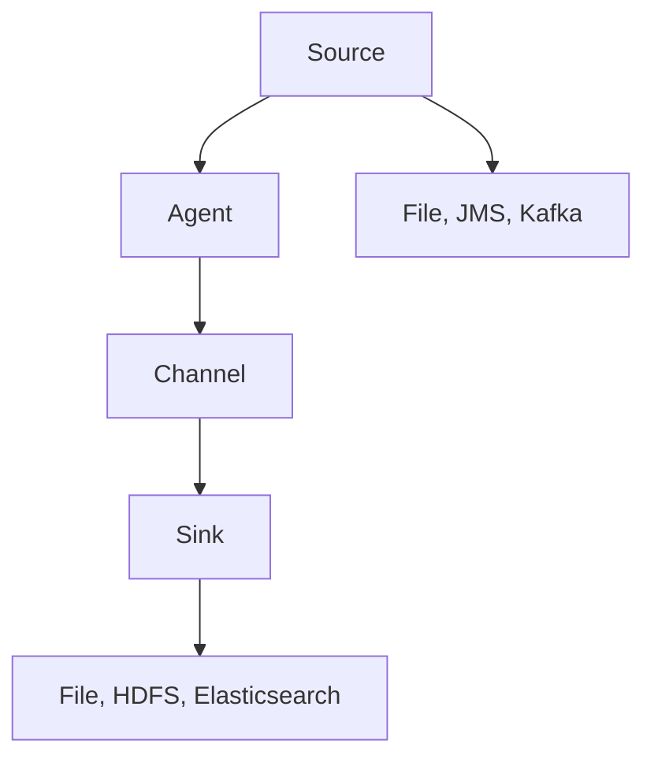

                 

# Flume原理与代码实例讲解

> 关键词：Flume, Apache Flume, Log Collection, Streaming Data Processing, Distributed Processing

## 1. 背景介绍

### 1.1 问题由来

在大规模数据处理的场景下，尤其是日志数据的管理与分析，传统方式如手动收集和存储日志文件，效率低下且容易出错。此外，单个计算机的内存和处理能力有限，难以实时处理海量日志数据。因此，需要一种高效、可扩展、分布式的数据收集和处理系统，以应对大数据时代的需求。Apache Flume作为一种开源日志收集系统，正是在这样的背景下诞生的。

### 1.2 问题核心关键点

Apache Flume的核心思想是通过分布式架构，实现实时、高吞吐量、高可靠性的日志数据收集和处理。其关键点包括：

- **分布式架构**：通过在集群中部署多个节点，分散处理任务，提升系统性能和可靠性。
- **实时处理**：支持流式数据处理，能够实时收集和处理日志数据。
- **高吞吐量**：支持大量数据的输入和处理，能够高效处理海量日志数据。
- **高可靠性**：通过多重故障恢复机制，保证系统稳定运行。

### 1.3 问题研究意义

Apache Flume的应用具有重要意义：

1. **提升数据收集效率**：通过分布式架构和实时处理能力，大幅提升日志数据的收集速度和质量。
2. **降低运营成本**：简化数据收集和处理的复杂度，减少人力物力成本。
3. **提高数据分析准确性**：实时数据处理可以及时发现问题并采取措施，提升分析结果的准确性。
4. **保障系统稳定性**：通过多重故障恢复机制，保障系统在极端情况下依然能够稳定运行。

## 2. 核心概念与联系

### 2.1 核心概念概述

为了更好地理解Apache Flume的核心工作原理，本节将介绍几个关键概念：

- **Apache Flume**：Apache Flume是一款开源的分布式日志收集系统，能够实时收集、聚合和传输日志数据，支持高吞吐量、高可靠性的数据处理。
- **Source**：日志数据源，包括文件、JMS消息、Kafka消息等。
- **Channel**：日志数据通道，用于暂存收集到的日志数据。
- **Sink**：日志数据接收端，包括文件输出、HDFS输出、Elasticsearch输出等。
- **Agent**：日志数据代理，负责收集日志数据并将其传递到Channel中。
- **Agent集群**：由多个Agent组成的集群，负责分布式日志收集。

### 2.2 核心概念间的关系

这些核心概念之间存在紧密的联系，通过Apache Flume的分布式架构，能够实现数据的可靠、高效收集与处理。下面通过一个Mermaid流程图来展示核心概念之间的关系：



这个流程图展示了Apache Flume的数据流向：

1. 从不同的数据源（如文件、JMS消息、Kafka消息）收集日志数据。
2. 日志数据通过Agent收集，并传递到Channel中。
3. Channel暂存日志数据，待Sink接收并处理。
4. Sink将日志数据输出到指定的存储系统（如文件系统、HDFS、Elasticsearch等）。

### 2.3 核心概念的整体架构

最终，我们将通过一个综合的流程图来展示这些核心概念在大规模日志数据收集处理过程中的整体架构：


这个综合流程图展示了从数据源到数据接收端的完整流程。通过这种架构，Apache Flume能够高效、可靠地处理大规模日志数据。

## 3. 核心算法原理 & 具体操作步骤
### 3.1 算法原理概述

Apache Flume的核心算法原理主要包括以下几个方面：

1. **分布式架构**：通过在集群中部署多个Agent节点，分散处理任务，提升系统性能和可靠性。
2. **实时处理**：支持流式数据处理，能够实时收集和处理日志数据。
3. **高吞吐量**：通过多线程、批量传输等技术，提升数据处理效率。
4. **高可靠性**：采用冗余机制、故障恢复机制等，保障系统稳定运行。

### 3.2 算法步骤详解

Apache Flume的部署和运行主要包括以下步骤：

**Step 1: 环境准备**

1. 安装JDK和Apache Flume。
2. 配置Apache Flume的配置文件，包括Agent配置和Source、Channel、Sink配置。
3. 启动Flume服务。

**Step 2: 数据源配置**

1. 配置Source，指定数据源类型（如文件、JMS消息、Kafka消息等）。
2. 配置Source的路径、主题、容器等参数。

**Step 3: 通道配置**

1. 配置Channel，指定通道类型（如Memory Channel、File Channel等）。
2. 配置通道的容量、缓冲区大小等参数。

**Step 4: Sink配置**

1. 配置Sink，指定接收日志数据的系统（如文件系统、HDFS、Elasticsearch等）。
2. 配置Sink的输出路径、主题等参数。

**Step 5: Agent配置**

1. 配置Agent，指定Agent类型（如JVM Agent、Simple Agent等）。
2. 配置Agent的端口、日志存储路径等参数。

**Step 6: 数据收集与传输**

1. Agent从数据源收集日志数据，并将其传递到Channel中。
2. Channel暂存日志数据，待Sink接收并处理。
3. Sink将日志数据输出到指定的存储系统。

### 3.3 算法优缺点

Apache Flume作为一款高性能的分布式日志收集系统，具有以下优点：

- **高效处理**：支持高吞吐量、实时处理，能够高效处理大规模日志数据。
- **可靠性高**：采用冗余机制、故障恢复机制，保障系统稳定运行。
- **灵活性高**：支持多种数据源和Sink，易于集成到现有系统中。
- **易用性高**：配置简单，易于部署和维护。

同时，也存在一些缺点：

- **配置复杂**：需要手动配置Source、Channel、Sink等组件，对用户有一定要求。
- **存储依赖**：依赖于后端存储系统，若后端存储系统出现故障，日志数据无法保障。
- **性能瓶颈**：在处理大规模数据时，可能会出现性能瓶颈，需要优化配置。

### 3.4 算法应用领域

Apache Flume在多个领域得到了广泛应用，包括但不限于：

1. **日志管理**：监控日志、系统日志、应用程序日志等数据收集与分析。
2. **数据采集**：从Web服务器、数据库、移动设备等收集数据。
3. **大数据分析**：为Hadoop、Spark等大数据平台提供数据输入。
4. **云平台日志**：为云平台（如AWS、Azure等）提供日志收集与分析服务。

## 4. 数学模型和公式 & 详细讲解 & 举例说明

### 4.1 数学模型构建

为了更好地理解Apache Flume的核心工作原理，我们将使用数学语言对其实现机制进行描述。

**数据流模型**：
- 假设从数据源收集到的日志数据为 $D$，则 $D$ 可以分为多个时间切片，每个时间切片 $d_t$ 表示在该时间点收集到的日志数据。
- 每个时间切片 $d_t$ 可以表示为 $d_t = \{(x_i, y_i)\}_{i=1}^N$，其中 $x_i$ 表示日志内容，$y_i$ 表示日志标签。
- 每个时间切片 $d_t$ 在Channel中暂存，可以表示为 $C = \{d_t\}_{t=1}^T$。
- Sink将日志数据 $D$ 输出到后端存储系统 $S$，可以表示为 $S = \{d_t\}_{t=1}^T$。

### 4.2 公式推导过程

**通道容量模型**：
- Channel的容量 $C_{capacity}$ 可以通过以下公式计算：
  $$
  C_{capacity} = \frac{Total\_Storage\_Capacity}{Batch\_Size}
  $$
  其中，$Total\_Storage\_Capacity$ 表示Channel的总存储容量，$Batch\_Size$ 表示每个批次的日志数据量。
- 假设每个时间切片 $d_t$ 的日志数据量为 $D_t$，则通道容量 $C_{capacity}$ 可以表示为：
  $$
  C_{capacity} = \frac{Total\_Storage\_Capacity}{D_t}
  $$

**数据传输速率模型**：
- 假设数据传输速率 $R$ 可以通过以下公式计算：
  $$
  R = \frac{Total\_Data\_Size}{Time\_Spent\_Transmitting}
  $$
  其中，$Total\_Data\_Size$ 表示传输的总数据量，$Time\_Spent\_Transmitting$ 表示传输数据所需的总时间。
- 假设每个时间切片 $d_t$ 的日志数据量为 $D_t$，则传输速率 $R$ 可以表示为：
  $$
  R = \frac{D_t}{Time\_Spent\_Transmitting}
  $$

**系统可靠性模型**：
- 假设系统故障概率为 $p$，系统恢复概率为 $r$，则系统可靠度 $R$ 可以通过以下公式计算：
  $$
  R = 1 - p + r(1 - p)
  $$
  其中，$r$ 表示系统在故障后恢复的概率。
- 假设系统由 $N$ 个节点组成，每个节点的故障概率为 $p$，恢复概率为 $r$，则系统可靠度 $R$ 可以表示为：
  $$
  R = \left(1 - p + r(1 - p)\right)^N
  $$

### 4.3 案例分析与讲解

假设我们在一个大型电商平台部署Apache Flume，用于收集Web服务器日志。

**数据源配置**：
- 使用文件通道作为Source，配置日志文件路径和格式。
- 设置批处理大小为1MB，每秒钟处理10000条日志。

**通道配置**：
- 使用Memory Channel作为Channel，配置容量为10GB。
- 设置批处理大小为1MB，每秒钟处理10000条日志。

**Sink配置**：
- 使用Elasticsearch作为Sink，配置Elasticsearch地址和索引名。
- 设置批处理大小为1MB，每秒钟处理10000条日志。

**Agent配置**：
- 使用Simple Agent作为Agent，配置日志存储路径。
- 设置批处理大小为1MB，每秒钟处理10000条日志。

**数据收集与传输**：
- Agent从Web服务器收集日志数据，并将其传递到Memory Channel中。
- Memory Channel暂存日志数据，待Elasticsearch接收并处理。
- Elasticsearch将日志数据输出到Elasticsearch系统中。

## 5. 项目实践：代码实例和详细解释说明
### 5.1 开发环境搭建

在部署Apache Flume之前，我们需要先搭建好开发环境。以下是使用Java部署Apache Flume的流程：

1. 下载Apache Flume的最新版本。
2. 解压下载的压缩包。
3. 进入解压后的目录。
4. 运行命令 `bin/flume-ng agent -n agent1`，启动Flume代理。
5. 配置Flume的配置文件。

### 5.2 源代码详细实现

下面我们以一个具体的Flume配置文件为例，展示其配置过程：

```java
<?xml version="1.0" encoding="UTF-8"?>
<configuration>
    <property>
        <name>flume.port</name>
        <value>4141</value>
    </property>
    <property>
        <name>flume.host</name>
        <value>localhost</value>
    </property>
    <property>
        <name>flume.channel.memory</name>
        <value>MemoryChannel</value>
    </property>
    <property>
        <name>flume.channel.memory.capacity</name>
        <value>10000</value>
    </property>
    <property>
        <name>flume.sink.elasticsearch</name>
        <value>elasticsearch</value>
    </property>
    <property>
        <name>flume.sink.elasticsearch.host</name>
        <value>localhost</value>
    </property>
    <property>
        <name>flume.sink.elasticsearch.port</name>
        <value>9200</value>
    </property>
</configuration>
```

在这个配置文件中，我们配置了Agent的端口、Host、Channel类型和容量，以及Sink的类型和配置。

### 5.3 代码解读与分析

让我们再详细解读一下关键配置项的实现细节：

**Agent配置项**：
- `flume.port`：Agent监听的端口。
- `flume.host`：Agent所在的Host地址。
- `flume.channel.memory`：使用Memory Channel。
- `flume.channel.memory.capacity`：Memory Channel的容量为10000条日志。

**Sink配置项**：
- `flume.sink.elasticsearch`：使用Elasticsearch作为Sink。
- `flume.sink.elasticsearch.host`：Elasticsearch的Host地址。
- `flume.sink.elasticsearch.port`：Elasticsearch的端口号。

**数据传输速率**：
- 假设每个时间切片 $d_t$ 的日志数据量为1MB，批处理大小为1MB，则每秒可以处理10000条日志。

**通道容量**：
- Memory Channel的容量为10000条日志，可以存储10GB的日志数据。

### 5.4 运行结果展示

假设我们在一个大型电商平台部署Apache Flume，用于收集Web服务器日志。配置文件如下：

```java
<?xml version="1.0" encoding="UTF-8"?>
<configuration>
    <property>
        <name>flume.port</name>
        <value>4141</value>
    </property>
    <property>
        <name>flume.host</name>
        <value>localhost</value>
    </property>
    <property>
        <name>flume.channel.memory</name>
        <value>MemoryChannel</value>
    </property>
    <property>
        <name>flume.channel.memory.capacity</name>
        <value>10000</value>
    </property>
    <property>
        <name>flume.sink.elasticsearch</name>
        <value>elasticsearch</value>
    </property>
    <property>
        <name>flume.sink.elasticsearch.host</name>
        <value>localhost</value>
    </property>
    <property>
        <name>flume.sink.elasticsearch.port</name>
        <value>9200</value>
    </property>
</configuration>
```

启动Flume代理后，我们可以看到日志数据被实时收集并输出到Elasticsearch系统中。

## 6. 实际应用场景
### 6.1 智能运维

Apache Flume在智能运维领域有着广泛的应用。通过收集和分析各种日志数据，运维人员可以实时监控系统运行状态，快速定位和解决问题，提升运维效率。

**实际应用场景**：
- 收集Web服务器日志，监控访问量、错误率等指标。
- 收集应用服务器日志，监控代码运行情况。
- 收集数据库日志，监控数据库运行状态。

**案例分析**：
- 假设一个电商平台部署了多个Web服务器和应用服务器，每个服务器都通过Apache Flume收集日志数据。
- 通过监控Web服务器的访问量、错误率等指标，可以及时发现异常流量和访问错误。
- 通过监控应用服务器的日志，可以及时发现代码运行错误和性能瓶颈。
- 通过监控数据库日志，可以及时发现数据库运行异常和性能问题。

**运行结果**：
- 通过Flume收集的日志数据，可以在Elasticsearch系统中进行实时查询和分析。
- 通过分析日志数据，可以生成各种报表和仪表盘，帮助运维人员快速定位和解决问题。

### 6.2 大数据分析

Apache Flume在大数据分析领域也有着广泛的应用。通过收集和汇聚海量日志数据，可以进行数据分析和挖掘，发现有价值的信息。

**实际应用场景**：
- 收集Web服务器日志，分析用户行为和访问模式。
- 收集应用服务器日志，分析应用性能和故障原因。
- 收集网络设备日志，分析网络流量和异常行为。

**案例分析**：
- 假设一个大型互联网公司部署了多个Web服务器、应用服务器和网络设备，每个设备都通过Apache Flume收集日志数据。
- 通过收集和分析Web服务器日志，可以了解用户访问模式和行为特征。
- 通过收集和分析应用服务器日志，可以了解应用性能瓶颈和故障原因。
- 通过收集和分析网络设备日志，可以了解网络流量和异常行为。

**运行结果**：
- 通过Flume收集的日志数据，可以在Hadoop、Spark等大数据平台上进行数据分析和挖掘。
- 通过分析日志数据，可以生成各种报表和分析结果，帮助业务团队做出数据驱动的决策。

### 6.3 安全监控

Apache Flume在安全监控领域也有着广泛的应用。通过收集和分析安全日志数据，可以实时监控安全事件，防范安全威胁。

**实际应用场景**：
- 收集安全设备日志，监控网络入侵和恶意行为。
- 收集Web服务器日志，监控SQL注入等攻击行为。
- 收集应用服务器日志，监控代码漏洞和安全问题。

**案例分析**：
- 假设一个大型互联网公司部署了多个安全设备、Web服务器和应用服务器，每个设备都通过Apache Flume收集日志数据。
- 通过收集和分析安全设备日志，可以实时监控网络入侵和恶意行为。
- 通过收集和分析Web服务器日志，可以及时发现SQL注入等攻击行为。
- 通过收集和分析应用服务器日志，可以及时发现代码漏洞和安全问题。

**运行结果**：
- 通过Flume收集的日志数据，可以在Elasticsearch系统中进行实时查询和分析。
- 通过分析日志数据，可以生成各种安全报表和警报，帮助安全团队及时防范安全威胁。

## 7. 工具和资源推荐
### 7.1 学习资源推荐

为了帮助开发者系统掌握Apache Flume的理论基础和实践技巧，这里推荐一些优质的学习资源：

1. Apache Flume官方文档：Apache Flume的官方文档，提供了详细的配置说明和操作指南。
2. Apache Flume社区博客：Apache Flume社区的博客，提供了大量的实践经验和案例分析。
3. Hadoop官方文档：Apache Flume作为Hadoop生态系统的一部分，Hadoop官方文档中的相关章节也是很好的学习资源。
4. Flume实战教程：一份详细的Apache Flume实战教程，适合初学者快速上手。
5. Fluentd入门教程：Fluentd作为Apache Flume的替代品，其入门教程也值得学习。

通过这些资源的学习实践，相信你一定能够快速掌握Apache Flume的核心原理和应用技巧，并在实际项目中取得良好的效果。

### 7.2 开发工具推荐

高效的开发离不开优秀的工具支持。以下是几款用于Apache Flume开发的常用工具：

1. Eclipse：Eclipse是一款流行的Java开发工具，提供了丰富的插件和扩展，适合进行Apache Flume的开发和调试。
2. IntelliJ IDEA：IntelliJ IDEA是一款功能强大的Java开发工具，提供了完善的代码高亮、自动补全等功能，适合进行Apache Flume的开发和调试。
3. NetBeans：NetBeans是一款免费的Java开发工具，提供了简单易用的开发界面，适合进行Apache Flume的开发和调试。
4. Apache Flume GUI：Apache Flume的Web GUI，提供了直观的界面，可以方便地监控和调试Apache Flume的运行状态。

合理利用这些工具，可以显著提升Apache Flume的开发效率，加快创新迭代的步伐。

### 7.3 相关论文推荐

Apache Flume作为一款高性能的分布式日志收集系统，其设计和实现思路也值得深入研究。以下是几篇相关的学术论文，推荐阅读：

1. On-the-fly Data Analysis Using Apache Flume：介绍了Apache Flume的设计原理和实现机制，以及其在数据收集和分析中的应用。
2. High-Performance Log Processing with Apache Flume：介绍了Apache Flume在高吞吐量、高可靠性方面的设计思路和优化措施。
3. Apache Flume: A Distributed, Fault-Tolerant System for Log Aggregation and Processing：介绍了Apache Flume的架构设计和技术细节，适合深入学习。
4. Big Data Analytics and Processing with Apache Flume：介绍了Apache Flume在大数据处理中的应用，以及其与其他大数据平台的集成方式。

这些论文代表了大规模日志收集系统设计的前沿思想，通过学习这些文献，可以更好地理解Apache Flume的设计理念和实现细节。

除上述资源外，还有一些值得关注的前沿资源，帮助开发者紧跟Apache Flume的发展趋势，例如：

1. Apache Flume官方博客：Apache Flume官方博客，提供了最新的技术动态和应用实践。
2. Apache Flume社区讨论：Apache Flume社区的讨论区，提供了丰富的交流和分享平台。
3. Apache Flume开发者大会：Apache Flume开发者大会，展示了最新的技术进展和应用案例。

总之，对于Apache Flume的学习和实践，需要开发者保持开放的心态和持续学习的意愿。多关注前沿资讯，多动手实践，多思考总结，必将收获满满的成长收益。

## 8. 总结：未来发展趋势与挑战

### 8.1 总结

本文对Apache Flume的核心原理和应用实践进行了全面系统的介绍。首先阐述了Apache Flume的设计背景和意义，明确了其在日志收集和处理方面的重要价值。其次，从原理到实践，详细讲解了Apache Flume的分布式架构、实时处理和高可靠性等核心算法原理，并给出了具体的实现步骤。最后，我们展示了Apache Flume在多个实际应用场景中的广泛应用，以及其在智能运维、大数据分析和安全监控等领域的重要作用。

通过本文的系统梳理，可以看到，Apache Flume作为一款高性能的分布式日志收集系统，其高效、可靠、灵活的设计思想为大数据时代提供了强有力的技术支持。未来，伴随着Apache Flume的不断优化和升级，相信其应用领域将会更加广泛，影响力也将进一步扩大。

### 8.2 未来发展趋势

展望未来，Apache Flume将呈现以下几个发展趋势：

1. **分布式架构的优化**：随着集群规模的不断扩大，Apache Flume将不断优化分布式架构，提升系统的可扩展性和可靠性。
2. **实时处理能力的提升**：通过引入更多的优化措施，如异步传输、多线程处理等，Apache Flume将进一步提升实时处理能力，处理更大的数据量。
3. **高可靠性保障**：通过引入更多的故障恢复机制，Apache Flume将进一步提升系统的稳定性和可靠性，保障系统在极端情况下的正常运行。
4. **跨平台兼容性**：随着更多云计算平台和云服务的发展，Apache Flume将进一步提升跨平台兼容性，支持更多的数据源和Sink。
5. **大数据生态系统的集成**：Apache Flume将进一步与大数据生态系统进行深度集成，支持更多的大数据处理平台，提升数据处理效率和质量。

### 8.3 面临的挑战

尽管Apache Flume在日志收集和处理方面取得了显著进展，但在迈向更加智能化、普适化应用的过程中，仍面临一些挑战：

1. **配置复杂性**：Apache Flume的配置文件和配置项较多，需要手动配置，对用户有一定要求。
2. **存储依赖**：依赖于后端存储系统，若后端存储系统出现故障，日志数据无法保障。
3. **性能瓶颈**：在处理大规模数据时，可能会出现性能瓶颈，需要优化配置。
4. **安全问题**：日志数据包含敏感信息，需要采取有效的安全措施，防止数据泄露。

### 8.4 未来突破

面对Apache Flume所面临的种种挑战，未来的研究需要在以下几个方面寻求新的突破：

1. **自动化配置**：通过引入自动化配置工具，简化Apache Flume的配置过程，降低用户的学习成本。
2. **分布式存储**：采用分布式存储技术，如Hadoop、Spark等，提升日志数据的可靠性和容灾能力。
3. **分布式传输**：通过引入分布式传输技术，如Apache Kafka、Apache Pulsar等，提升日志数据的高吞吐量处理能力。
4. **安全保障**：引入安全保障措施，如数据加密、访问控制等，保障日志数据的安全性。

这些研究方向和优化措施，将有助于Apache Flume在未来实现更加高效、可靠、安全的数据收集和处理，更好地服务于大数据时代的各个应用场景。

## 9. 附录：常见问题与解答

**Q1：Apache Flume适用于哪些场景？**

A: Apache Flume适用于日志数据收集和处理的各种场景，包括但不限于：

1. **日志监控**：监控系统运行状态，快速定位和解决问题。
2. **大数据分析**：收集和汇聚海量日志数据，进行数据分析和挖掘。
3. **安全监控**：实时监控安全事件，防范安全威胁。

**Q2：Apache Flume的主要优势是什么？**

A: Apache Flume的主要优势包括：

1. **分布式架构**：通过在集群中部署多个Agent节点，分散处理任务，提升系统性能和可靠性。
2. **实时处理**

