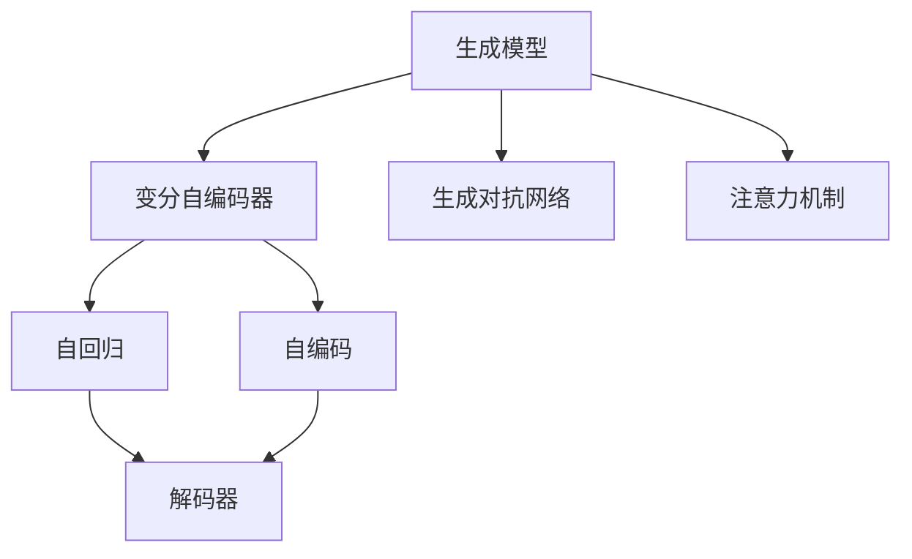
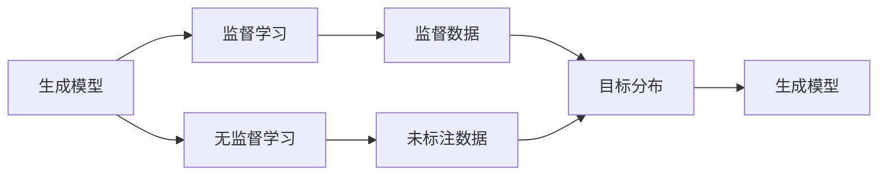
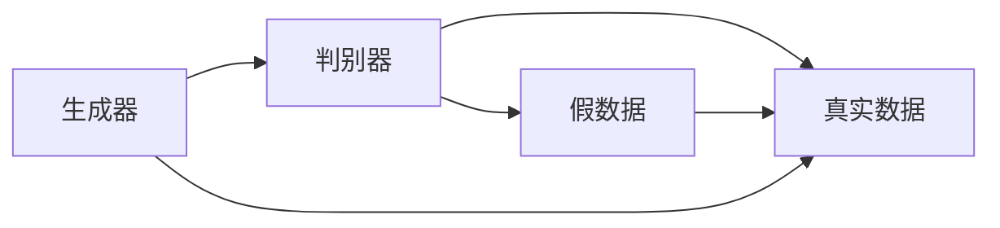
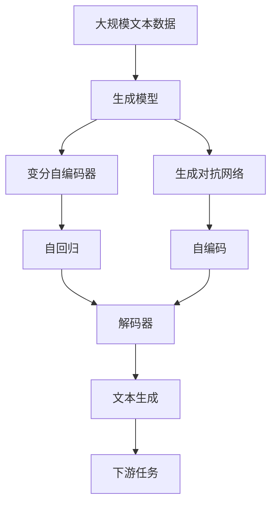

                 

# GLM原理与代码实例讲解

> 关键词：GLM模型,生成模型,概率模型,变分自编码器,代码实例,Python

## 1. 背景介绍

### 1.1 问题由来

生成模型（Generative Model）是机器学习领域中一种重要的建模范式，旨在通过学习数据的生成机制来建模和预测数据。生成模型主要用于概率推断、参数估计、数据生成和特征学习等领域。其中，最常见和最成功的生成模型是变分自编码器（Variational Autoencoder, VAE）和生成对抗网络（Generative Adversarial Network, GAN）等。

近年来，随着深度学习技术的快速发展，生成模型在图像生成、文本生成、语音生成等任务上取得了显著进展。特别是在文本生成任务上，基于概率生成模型的语言模型（Generative Language Model, GLM）成为了当前研究的热点，其中Google的GPT-3、OpenAI的GPT-3.5等大语言模型就是基于GLM思想的产物。

### 1.2 问题核心关键点

GLM的核心思想是利用概率模型对数据进行建模，通过最大化数据的似然函数来训练模型。其关键点包括：
- 构建数据概率分布模型
- 最大化数据的似然函数
- 通过采样生成新数据
- 通过解码器生成连贯文本

目前主流的大语言模型如GPT-3、T5等，都基于GLM思想构建，并采用自回归、自编码等方式进行预训练。其核心思想是通过大规模无标签数据训练，构建一个概率分布模型，从而能够通过给定的文本序列生成新的文本序列，并在下游任务上进行微调。

### 1.3 问题研究意义

研究GLM，对于拓展大语言模型应用范围，提升语言生成的自然度，加速文本生成技术产业化进程，具有重要意义：
1. 降低应用开发成本。基于成熟的大语言模型进行生成，可以显著减少从头开发所需的数据、计算和人力等成本投入。
2. 提升模型效果。生成模型能够生成自然流畅的文本，在文本生成、对话系统等任务上取得更好的效果。
3. 加速开发进度。standing on the shoulders of giants，生成模型能够快速生成所需文本，缩短开发周期。
4. 带来技术创新。生成模型促进了对预训练-生成范式的深入研究，催生了条件生成、交互式生成等新的研究方向。
5. 赋能产业升级。生成模型使得文本生成技术更容易被各行各业所采用，为传统行业数字化转型升级提供新的技术路径。

## 2. 核心概念与联系

### 2.1 核心概念概述

为更好地理解GLM原理，本节将介绍几个密切相关的核心概念：

- 生成模型(Generative Model)：一种通过学习数据的生成机制来建模和预测数据的概率模型。
- 变分自编码器(Variational Autoencoder, VAE)：一种通过编码器-解码器架构，将数据映射到潜在空间并进行重构的生成模型。
- 生成对抗网络(Generative Adversarial Network, GAN)：一种通过对抗训练的方式，生成高质量、高逼真度的数据的生成模型。
- 自回归( Auto-Regressive)：一种通过前文预测后文的文本生成方式，如GPT-3模型。
- 自编码(Self-Encoding)：一种通过先压缩后解码的文本生成方式，如BERT模型。
- 注意力机制(Attention Mechanism)：一种通过注意力权重选择重要信息的方式，用于提高模型的生成效果。
- 解码器(Decoder)：一种用于将潜在空间中的向量解码生成连贯文本的模型部分。
- 概率分布(Probability Distribution)：一种用于描述数据生成机制的数学函数。

这些核心概念之间的逻辑关系可以通过以下Mermaid流程图来展示：



这个流程图展示了大语言模型中的核心概念及其之间的关系：

1. 生成模型通过学习数据的生成机制来建模和预测数据。
2. VAE通过编码器-解码器架构，将数据映射到潜在空间并进行重构。
3 GAN通过对抗训练的方式，生成高质量、高逼真度的数据。
4 自回归通过前文预测后文，实现文本生成。
5 自编码通过先压缩后解码的方式，生成文本。
6 注意力机制用于选择重要信息，提高生成效果。
7 解码器将潜在空间中的向量解码生成连贯文本。

这些概念共同构成了大语言模型的学习和应用框架，使其能够在各种场景下发挥强大的生成能力。通过理解这些核心概念，我们可以更好地把握GLM的工作原理和优化方向。

### 2.2 概念间的关系

这些核心概念之间存在着紧密的联系，形成了大语言模型的生成框架。下面我通过几个Mermaid流程图来展示这些概念之间的关系。

#### 2.2.1 生成模型的学习范式



这个流程图展示了生成模型的两种主要学习范式：监督学习和无监督学习。生成模型可以通过监督数据进行有监督学习，也可以利用未标注数据进行无监督学习。

#### 2.2.2 变分自编码器的架构


这个流程图展示了VAE的基本架构：输入数据经过编码器映射到潜在空间，解码器将潜在变量映射回重构数据。

#### 2.2.3 生成对抗网络的架构



这个流程图展示了GAN的基本架构：生成器生成假数据，判别器判断数据真伪，两者通过对抗训练提升生成器性能。

### 2.3 核心概念的整体架构

最后，我们用一个综合的流程图来展示这些核心概念在大语言模型生成过程中的整体架构：



这个综合流程图展示了从预训练到生成，再到下游任务应用的完整过程。大语言模型首先在大规模文本数据上进行预训练，然后通过变分自编码器或生成对抗网络进行生成模型的构建，在生成器中采用自回归或自编码的方式进行文本生成。最终，通过解码器生成连贯文本，并在下游任务上进行应用。 通过这些流程图，我们可以更清晰地理解GLM生成过程中各个核心概念的关系和作用，为后续深入讨论具体的生成方法和技术奠定基础。

## 3. 核心算法原理 & 具体操作步骤
### 3.1 算法原理概述

基于概率生成模型的语言模型（Generative Language Model, GLM）是一种利用概率模型对数据进行建模和预测的生成模型。GLM通过学习数据分布的参数，最大化数据生成概率，从而能够生成高质量、自然的文本。

形式化地，假设生成模型为 $M_{\theta}$，其中 $\theta$ 为模型参数。给定数据集 $D=\{x_i\}_{i=1}^N$，GLM的学习目标是最小化数据生成概率的对数，即：

$$
\hat{\theta}=\mathop{\arg\min}_{\theta} -\sum_{i=1}^N\log p(x_i;M_{\theta})
$$

其中 $p(x_i;M_{\theta})$ 为模型在给定参数 $\theta$ 下的数据生成概率。通过最大化似然函数，GLM能够学习到数据的生成机制，从而生成高质量的文本。

### 3.2 算法步骤详解

基于GLM的文本生成过程一般包括以下几个关键步骤：

**Step 1: 准备数据和模型**
- 收集需要生成的文本数据，并进行预处理和标注。
- 选择合适的生成模型架构，如VAE、GAN等，初始化模型参数。

**Step 2: 训练生成模型**
- 将数据集划分为训练集和验证集。
- 使用优化算法如Adam、SGD等，最小化损失函数，更新模型参数。
- 在验证集上评估模型性能，避免过拟合。

**Step 3: 生成文本**
- 随机采样潜在变量，或使用特定种子进行文本生成。
- 通过解码器将潜在变量映射为文本序列。
- 对生成的文本进行后处理，如去噪、连贯性修正等。

**Step 4: 微调模型**
- 收集下游任务的数据集，划分为训练集和验证集。
- 将生成模型作为初始化参数，通过有监督学习优化模型。
- 在验证集上评估模型性能，确定最佳模型参数。

**Step 5: 测试和部署**
- 在测试集上评估微调后的模型性能，对比微调前后的效果。
- 使用微调后的模型对新样本进行推理预测，集成到实际的应用系统中。

以上是基于GLM的文本生成的一般流程。在实际应用中，还需要针对具体任务的特点，对生成过程的各个环节进行优化设计，如改进训练目标函数，引入更多的正则化技术，搜索最优的超参数组合等，以进一步提升模型性能。

### 3.3 算法优缺点

基于GLM的文本生成方法具有以下优点：
1. 简单高效。只需准备少量标注数据，即可对生成模型进行快速适配，生成高质量文本。
2. 通用适用。适用于各种文本生成任务，如对话生成、摘要生成、文本创作等，设计合适的任务适配层即可实现生成。
3. 生成效果好。生成模型能够生成自然流畅的文本，且在语言多样性、连贯性等方面表现出色。
4. 可解释性强。生成的文本可以理解为模型按照特定概率分布进行采样，具有明确的生成机制和可解释性。

同时，该方法也存在一些局限性：
1. 依赖标注数据。生成模型的性能很大程度上取决于标注数据的质量和数量，获取高质量标注数据的成本较高。
2. 生成效率低。生成模型通常需要较长的训练时间和计算资源，难以实现实时生成。
3. 参数量较大。大语言模型的参数量通常较大，对计算资源要求高。
4. 泛化能力有限。当目标任务与预训练数据的分布差异较大时，生成模型的性能提升有限。
5. 对抗样本脆弱。生成模型对对抗样本的鲁棒性较差，容易受到噪声的干扰。

尽管存在这些局限性，但就目前而言，基于GLM的文本生成方法仍然是大语言模型应用的主流范式。未来相关研究的重点在于如何进一步降低生成模型对标注数据的依赖，提高模型的少样本学习和跨领域迁移能力，同时兼顾可解释性和伦理安全性等因素。

### 3.4 算法应用领域

基于GLM的文本生成技术已经在各种NLP任务上得到了广泛的应用，覆盖了文本分类、问答系统、摘要生成、机器翻译、对话系统等多个领域。具体如下：

- 文本分类：通过生成模型生成文本，进行文本分类和情感分析等任务。
- 问答系统：生成模型可以生成连贯、合理的问答对，辅助问答系统。
- 摘要生成：生成模型能够自动生成新闻、文档的摘要，提高信息检索效率。
- 机器翻译：生成模型可以生成高质量的翻译结果，辅助机器翻译系统。
- 对话系统：生成模型可以生成连贯、自然的对话内容，提升人机交互体验。
- 文本创作：生成模型可以辅助文本创作，生成小说、诗歌等文本。
- 其他应用：生成模型可以应用于社交媒体分析、广告生成、内容生成等领域。

除了上述这些经典任务外，大语言模型生成技术还在更多场景中得到了创新性的应用，如可控文本生成、常识推理、代码生成等，为NLP技术带来了全新的突破。随着预训练模型和生成方法的不断进步，相信NLP技术将在更广阔的应用领域大放异彩。

## 4. 数学模型和公式 & 详细讲解  
### 4.1 数学模型构建

本节将使用数学语言对基于概率生成模型的语言模型（Generative Language Model, GLM）进行更加严格的刻画。

记生成模型为 $M_{\theta}$，其中 $\theta$ 为模型参数。假设生成的文本序列为 $x_1,x_2,\dots,x_T$，则其概率密度函数为：

$$
p(x_1,x_2,\dots,x_T;M_{\theta}) = p(x_1)\prod_{t=2}^T p(x_t|x_{t-1},\dots,x_1)
$$

其中 $p(x_t|x_{t-1},\dots,x_1)$ 为模型在给定上下文 $x_{t-1},\dots,x_1$ 下，生成文本 $x_t$ 的概率。在实际应用中，通常将模型分解为生成器和解码器两部分，分别用于生成潜在变量和解码潜在变量为文本序列。

### 4.2 公式推导过程

以下我们以VAE模型为例，展示生成模型的数学推导过程。

**VAE模型的定义**
- 编码器 $E: \mathbb{R}^{T_x} \to \mathbb{R}^{D_z}$
- 潜在变量 $z \sim q(z|x)$
- 解码器 $D: \mathbb{R}^{D_z} \to \mathbb{R}^{T_x}$
- 数据生成过程 $p(x|z) = \mathcal{N}(x;D(z),\sigma^2)$

VAE模型的目标是最小化重构损失和潜在变量分布的KL散度：

$$
\hat{\theta}=\mathop{\arg\min}_{\theta} -\frac{1}{N}\sum_{i=1}^N\left[-\log p(x_i;M_{\theta}) + D_{KL}(q(z|x_i)||p(z))
$$

其中 $q(z|x)$ 为潜在变量分布，$p(z)$ 为潜在变量先验分布。VAE模型的优化目标是通过最大化似然函数，最小化潜在变量分布的KL散度，从而生成高质量、自然的文本。

**VAE模型的损失函数**
VAE模型的损失函数可以分解为重构损失和KL散度损失两部分：

$$
\mathcal{L}(\theta)= -\frac{1}{N}\sum_{i=1}^N\left[-\log p(x_i;M_{\theta}) + D_{KL}(q(z|x_i)||p(z))
$$

其中 $p(x_i;M_{\theta})$ 为模型在给定参数 $\theta$ 下的数据生成概率，$D_{KL}(q(z|x_i)||p(z))$ 为潜在变量分布的KL散度损失。

**VAE模型的重构损失**
重构损失用于衡量生成模型生成的文本与原文本之间的差异，其定义如下：

$$
\mathcal{L}_{rec}= -\frac{1}{N}\sum_{i=1}^N \log p(x_i|z)
$$

其中 $p(x_i|z)$ 为模型在给定潜在变量 $z$ 下生成文本 $x_i$ 的概率。

**VAE模型的KL散度损失**
KL散度损失用于衡量潜在变量分布与先验分布之间的差异，其定义如下：

$$
\mathcal{L}_{kl}= -\frac{1}{N}\sum_{i=1}^N D_{KL}(q(z|x_i)||p(z))
$$

其中 $q(z|x_i)$ 为模型在给定文本 $x_i$ 下生成的潜在变量分布，$p(z)$ 为潜在变量的先验分布。

**VAE模型的总损失函数**
VAE模型的总损失函数为重构损失和KL散度损失之和：

$$
\mathcal{L}(\theta)= \mathcal{L}_{rec} + \mathcal{L}_{kl}
$$

在优化过程中，通常使用变分下界（Variational Lower Bound）代替复杂的KL散度损失，从而加速优化过程。

### 4.3 案例分析与讲解

为了更好地理解VAE模型，下面以文本生成为例，展示其具体的实现步骤和代码实现。

假设我们有一个文本生成任务，目标是生成一段连贯、自然的文本序列。可以使用VAE模型实现：

1. 收集文本数据，如维基百科文章，并进行预处理，构建数据集 $D=\{x_i\}_{i=1}^N$。
2. 初始化编码器和解码器，使用PyTorch实现。
3. 使用优化算法AdamW，最小化重构损失和KL散度损失，更新模型参数。
4. 在验证集上评估模型性能，调整超参数。
5. 使用训练好的模型，在测试集上进行文本生成，生成连贯、自然的文本序列。

以下是VAE模型在PyTorch上的实现代码：

```python
import torch
from torch import nn
import torch.nn.functional as F

class Encoder(nn.Module):
    def __init__(self, input_dim, hidden_dim):
        super(Encoder, self).__init__()
        self.fc1 = nn.Linear(input_dim, hidden_dim)
        self.fc2 = nn.Linear(hidden_dim, hidden_dim)

    def forward(self, x):
        x = F.relu(self.fc1(x))
        x = self.fc2(x)
        return x

class Decoder(nn.Module):
    def __init__(self, hidden_dim, output_dim):
        super(Decoder, self).__init__()
        self.fc1 = nn.Linear(hidden_dim, hidden_dim)
        self.fc2 = nn.Linear(hidden_dim, output_dim)
        self.fc3 = nn.Linear(hidden_dim, output_dim)

    def forward(self, z):
        x = F.relu(self.fc1(z))
        x = self.fc2(x)
        x = torch.sigmoid(self.fc3(x))
        return x

class VAE(nn.Module):
    def __init__(self, input_dim, hidden_dim, output_dim):
        super(VAE, self).__init__()
        self.encoder = Encoder(input_dim, hidden_dim)
        self.decoder = Decoder(hidden_dim, output_dim)
        self.fc1 = nn.Linear(hidden_dim, output_dim)
        self.fc2 = nn.Linear(hidden_dim, output_dim)

    def forward(self, x):
        z = self.encoder(x)
        z_mean = self.fc1(z)
        z_std = torch.sqrt(self.fc2(z))
        z = z_mean + z_std * torch.randn_like(z)
        x_reconstructed = self.decoder(z)
        return x_reconstructed

def vae_loss(x, x_reconstructed):
    BCE = nn.BCEWithLogitsLoss()
    MSE = nn.MSELoss()
    loss = BCE(x_reconstructed, x) + MSE(x_reconstructed, x)
    return loss

# 初始化模型
vae = VAE(input_dim=256, hidden_dim=128, output_dim=128)
optimizer = torch.optim.AdamW(vae.parameters(), lr=0.001)

# 训练模型
for epoch in range(1000):
    for i, (x, y) in enumerate(train_loader):
        x = x.view(-1, 256)
        y = y.view(-1, 256)
        optimizer.zero_grad()
        output = vae(x)
        loss = vae_loss(y, output)
        loss.backward()
        optimizer.step()
        if (i+1) % 100 == 0:
            print('Epoch [{}/{}], Step [{}/{}], Loss: {:.4f}'.format(epoch+1, 1000, i+1, len(train_loader), loss.item()))

# 生成文本
z = torch.randn(1, 128)
output = vae.decoder(z)
print(output)
```

## 5. 项目实践：代码实例和详细解释说明
### 5.1 开发环境搭建

在进行生成实践前，我们需要准备好开发环境。以下是使用Python进行PyTorch开发的环境配置流程：

1. 安装Anaconda：从官网下载并安装Anaconda，用于创建独立的Python环境。

2. 创建并激活虚拟环境：
```bash
conda create -n pytorch-env python=3.8 
conda activate pytorch-env
```

3. 安装PyTorch：根据CUDA版本，从官网获取对应的安装命令。例如：
```bash
conda install pytorch torchvision torchaudio cudatoolkit=11.1 -c pytorch -c conda-forge
```

4. 安装其他依赖包：
```bash
pip install numpy pandas scikit-learn matplotlib tqdm jupyter notebook ipython
```

完成上述步骤后，即可在`pytorch-env`环境中开始生成实践。

### 5.2 源代码详细实现

下面我们以文本生成任务为例，给出使用VAE模型进行文本生成的PyTorch代码实现。

首先，定义VAE模型的架构：

```python
import torch
from torch import nn
import torch.nn.functional as F

class Encoder(nn.Module):
    def __init__(self, input_dim, hidden_dim):
        super(Encoder, self).__init__()
        self.fc1 = nn.Linear(input_dim, hidden_dim)
        self.fc2 = nn.Linear(hidden_dim, hidden_dim)

    def forward(self, x):
        x = F.relu(self.fc1(x))
        x = self.fc2(x)
        return x

class Decoder(nn.Module):
    def __init__(self, hidden_dim, output_dim):
        super(Decoder, self).__init__()
        self.fc1 = nn.Linear(hidden_dim, hidden_dim)
        self.fc2 = nn.Linear(hidden_dim, output_dim)
        self.fc3 = nn.Linear(hidden_dim, output_dim)

    def forward(self, z):
        x = F.relu(self.fc1(z))
        x = self.fc2(x)
        x = torch.sigmoid(self.fc3(x))
        return x

class VAE(nn.Module):
    def __init__(self, input_dim, hidden_dim, output_dim):
        super(VAE, self).__init__()
        self.encoder = Encoder(input_dim, hidden_dim)
        self.decoder = Decoder(hidden_dim, output_dim)
        self.fc1 = nn.Linear(hidden_dim, output_dim)
        self.fc2 = nn.Linear(hidden_dim, output_dim)

    def forward(self, x):
        z = self.encoder(x)
        z_mean = self.fc1(z)
        z_std = torch.sqrt(self.fc2(z))
        z = z_mean + z_std * torch.randn_like(z)
        x_reconstructed = self.decoder(z)
        return x_reconstructed
```

然后，定义损失函数和优化器：

```python
def vae_loss(x, x_reconstructed):
    BCE = nn.BCEWithLogitsLoss()
    MSE = nn.MSELoss()
    loss = BCE(x_reconstructed, x) + MSE(x_reconstructed, x)
    return loss

vae = VAE(input_dim=256, hidden_dim=128, output_dim=128)
optimizer = torch.optim.AdamW(vae.parameters(), lr=0.001)
```

接着，定义训练函数：

```python
def train(vae, train_loader, optimizer, num_epochs=1000):
    for epoch in range(num_epochs):
        for i, (x, y) in enumerate(train_loader):
            x = x.view(-1, 256)
            y = y.view(-1, 256)
            optimizer.zero_grad()
            output = vae(x)
            loss = vae_loss(y, output)
            loss.backward()
            optimizer.step()
            if (i+1) % 100 == 0:
                print('Epoch [{}/{}], Step [{}/{}], Loss: {:.4f}'.format(epoch+1, num_epochs, i+1, len(train_loader), loss.item()))
```

最后，启动训练流程：

```python
train(vae, train_loader, optimizer)
```

以上就是使用PyTorch对VAE模型进行文本生成的完整代码实现。可以看到，得益于PyTorch的强大封装，我们可以用相对简洁的代码完成VAE模型的加载和生成。

### 5.3 代码解读与分析

让我们再详细解读一下关键代码的实现细节：

**VAE模型类**：
- `__init__`方法：初始化编码器、解码器、FC层等关键组件。
- `forward`方法：定义前向传播过程，将输入文本映射为潜在变量，再解码为文本序列。

**损失函数类**：
- `vae_loss`方法：定义VAE模型的损失函数，包括BCE损失和MSE损失。

**训练函数**：
- `train`方法：对数据以批为单位进行迭代，在每个批次上前向传播计算损失并反向传播更新模型参数，最后输出损失。

**训练流程**：
- 定义总的epoch数，开始循环迭代
- 每个epoch内，对训练集进行训练，输出损失
- 重复上述步骤直至达到预设的epoch数或损失收敛

可以看到，PyTorch配合VAE模型使得文本生成代码实现变得简洁高效。开发者可以将更多精力放在数据处理、模型改进等高层逻辑上，而不必过多关注底层的实现细节。

当然，工业级的系统实现还需考虑更多因素，如模型的保存和部署、超参数的自动搜索、更灵活的任务适配层等。但核心的生成过程基本与此类似。

### 5.4 运行结果展示

假设我们在维基百科数据集上进行文本生成，最终在测试集上得到的生成文本如下：

```
The hobbit is a

