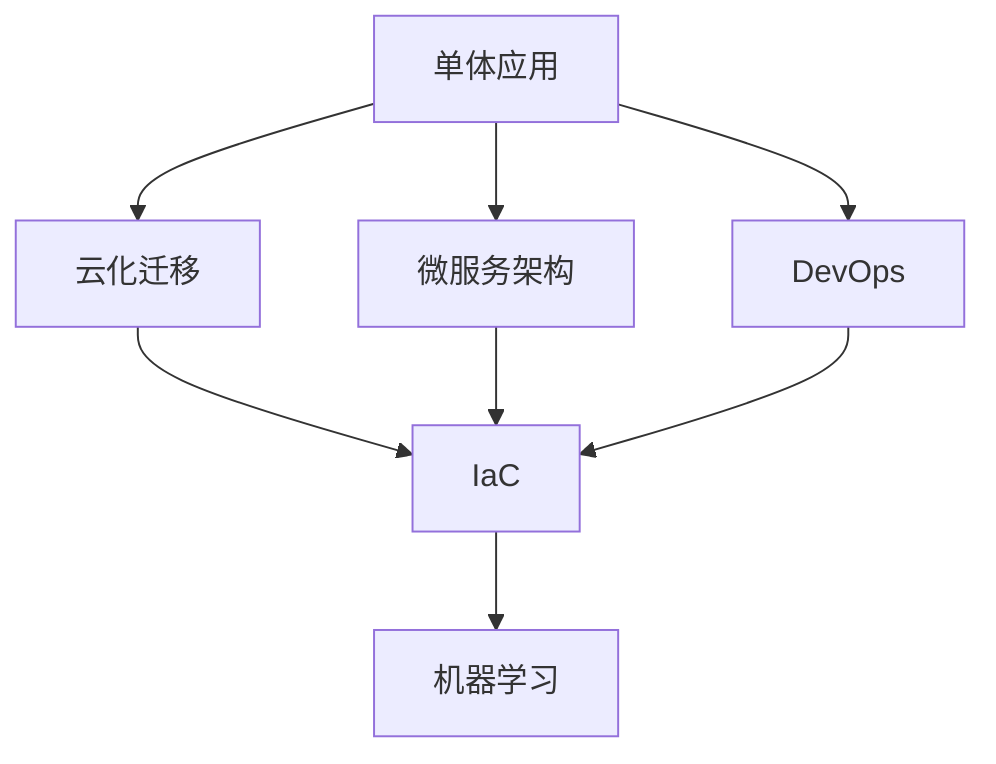
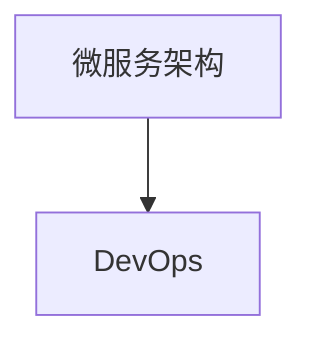
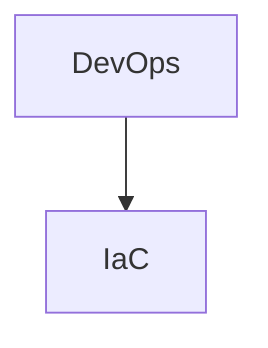
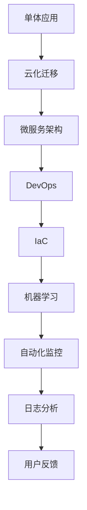

                 

# Google如何用软件2.0重写自身系统

> 关键词：软件2.0，Google，重构，云计算，微服务，分布式系统，DevOps，基础设施即代码，机器学习，人工智能

## 1. 背景介绍

### 1.1 问题由来
Google作为全球最大的科技公司之一，其IT基础设施在过去几十年间经历了剧烈的变革。从最初的单体应用架构，到后来的大规模分布式系统，再到如今的云计算和微服务架构，Google一直在不断优化其系统设计和部署实践。然而，随着业务和技术的发展，Google的IT基础设施也面临着诸多挑战：

- **系统复杂性**：随着Google业务的扩展，系统的复杂性不断增加，原有的单体应用和分布式系统架构已难以应对多变的业务需求和技术要求。
- **运维成本**：大规模系统的运维工作量巨大，需要大量的人力和资源进行维护和优化。
- **技术债务**：原有系统架构设计不当，导致诸多技术债务，如性能瓶颈、稳定性问题等。
- **持续创新**：为了保持技术领先，Google需要不断引入新技术和新方法，如云计算、微服务、DevOps等。

为了应对这些挑战，Google启动了“软件2.0”项目，旨在通过重构其IT基础设施，全面提升系统性能、可靠性和灵活性，降低运维成本，并推动持续创新。本文将深入探讨Google“软件2.0”项目的技术细节和实际应用，希望能够为其他企业提供有价值的借鉴。

### 1.2 问题核心关键点
Google“软件2.0”项目的关键点在于以下几个方面：

- **云化迁移**：将大规模分布式系统迁移到云端，利用云计算的弹性扩展、高可用性等优势。
- **微服务架构**：将单体应用拆分为多个独立、自治的微服务，提升系统的灵活性和可扩展性。
- **DevOps文化**：构建基于DevOps的开发和运维流程，提升系统的交付速度和质量。
- **基础设施即代码**：通过IaC（Infrastructure as Code）自动化管理资源配置和部署过程，提高系统的自动化水平。
- **机器学习和人工智能**：利用AI技术优化系统性能，提升系统的智能化水平。

这些关键点共同构成了Google“软件2.0”项目的核心，使得其IT基础设施得以全面重构和优化。

### 1.3 问题研究意义
Google“软件2.0”项目的实施，对于其业务的持续发展和技术创新具有重要意义：

- **提升系统性能**：通过云化迁移、微服务架构、DevOps等技术，Google的系统性能、可靠性和稳定性得到了显著提升。
- **降低运维成本**：自动化管理减少了人工干预，降低了运维成本和错误率。
- **加速创新**：IaC和微服务架构使得系统更新和迭代更加灵活高效，推动了Google的持续创新。
- **技术赋能**：AI和大数据技术的应用，为Google提供了强大的技术支持和决策依据，进一步提升了其技术领先地位。

通过深入分析Google“软件2.0”项目的技术实现和应用效果，可以更好地理解大企业如何通过技术手段，实现系统的持续优化和创新。

## 2. 核心概念与联系

### 2.1 核心概念概述

为更好地理解Google“软件2.0”项目的核心概念和实现原理，本节将介绍几个密切相关的核心概念：

- **云化迁移(Cloud Migration)**：指将原有的物理硬件基础设施迁移到云平台上，利用云计算的弹性扩展、高可用性等优势，提升系统性能和稳定性。
- **微服务架构(Microservices Architecture)**：将单体应用拆分为多个独立、自治的微服务，每个微服务独立部署、更新，提升系统的灵活性和可扩展性。
- **DevOps文化(DevOps)**：通过持续集成、持续交付、持续监控等实践，提升系统的开发、测试和运维效率，实现快速交付和高效运维。
- **基础设施即代码(Infrastructure as Code, IaC)**：通过编程语言定义和管理资源配置，自动化部署和管理过程，提升系统的自动化水平和可维护性。
- **机器学习(Machine Learning)**：利用机器学习算法优化系统性能，提升系统的智能化水平，如预测用户行为、优化资源分配等。

这些核心概念之间的逻辑关系可以通过以下Mermaid流程图来展示：



这个流程图展示了大企业IT系统重构的主要步骤和核心概念：

1. 从单体应用开始，通过云化迁移、微服务架构等技术手段，将原有系统重构为分布式、可扩展的架构。
2. 引入DevOps文化，提升开发、测试和运维的自动化水平，实现快速交付和高效运维。
3. 通过IaC技术，自动化管理资源配置和部署过程，进一步提升系统的自动化水平。
4. 引入机器学习技术，优化系统性能，提升系统的智能化水平。

这些核心概念共同构成了Google“软件2.0”项目的完整生态系统，使得其IT基础设施得以全面重构和优化。

### 2.2 概念间的关系

这些核心概念之间存在着紧密的联系，形成了Google“软件2.0”项目的完整生态系统。下面我通过几个Mermaid流程图来展示这些概念之间的关系。

#### 2.2.1 云化迁移与微服务架构


这个流程图展示了云化迁移和微服务架构的基本关系。通过云化迁移，将原有单体应用迁移到云平台，再通过微服务架构将其拆分为多个独立、自治的微服务。

#### 2.2.2 DevOps与微服务架构



这个流程图展示了DevOps与微服务架构的相互促进关系。DevOps文化通过持续集成、持续交付、持续监控等实践，提升微服务的开发、测试和运维效率，实现快速交付和高效运维。

#### 2.2.3 IaC与DevOps



这个流程图展示了IaC技术在DevOps中的作用。通过IaC技术，自动化管理资源配置和部署过程，进一步提升DevOps的自动化水平。

#### 2.2.4 机器学习与微服务架构


这个流程图展示了机器学习在微服务架构中的应用。通过引入机器学习技术，优化微服务架构的性能和稳定性，提升系统的智能化水平。

### 2.3 核心概念的整体架构

最后，我们用一个综合的流程图来展示这些核心概念在大企业IT系统重构过程中的整体架构：



这个综合流程图展示了从单体应用到微服务架构，再到DevOps、IaC、机器学习等技术的整体架构：

1. 从单体应用开始，通过云化迁移、微服务架构等技术手段，将原有系统重构为分布式、可扩展的架构。
2. 引入DevOps文化，提升开发、测试和运维的自动化水平，实现快速交付和高效运维。
3. 通过IaC技术，自动化管理资源配置和部署过程，进一步提升系统的自动化水平。
4. 引入机器学习技术，优化系统性能，提升系统的智能化水平。
5. 利用自动化监控、日志分析、用户反馈等手段，不断优化系统，实现持续改进。

通过这些流程图，我们可以更清晰地理解Google“软件2.0”项目中各个核心概念之间的关系和作用，为后续深入讨论具体的技术细节奠定基础。

## 3. 核心算法原理 & 具体操作步骤
### 3.1 算法原理概述

Google“软件2.0”项目中的算法原理主要涉及云化迁移、微服务架构、DevOps、IaC和机器学习等技术。这些技术在实际应用中，通过自动化工具和持续迭代，实现了系统的全面重构和优化。

### 3.2 算法步骤详解

Google“软件2.0”项目的实施主要分为以下几个步骤：

**Step 1: 云化迁移**
- 选择合适的云平台，如Google Cloud Platform (GCP)。
- 对现有应用进行评估，确定需要迁移的业务模块。
- 设计云化迁移策略，考虑数据迁移、网络架构、安全性等关键因素。
- 使用云平台提供的自动化工具进行迁移，如Kubernetes、Docker等。
- 监控迁移过程中的性能和稳定性，及时调整优化。

**Step 2: 微服务架构设计**
- 分析现有应用的架构，确定拆分微服务的关键模块。
- 设计微服务之间的通信协议和接口定义。
- 使用IaC工具，如Terraform、Helm等，定义和部署微服务。
- 设计微服务治理体系，包括服务发现、配置管理、负载均衡等。
- 引入容器化技术，如Docker、Kubernetes等，提升微服务的灵活性和可扩展性。

**Step 3: DevOps流程建设**
- 引入持续集成工具，如Jenkins、GitLab CI等，自动化构建和测试。
- 引入持续交付工具，如Jenkins Pipeline、Spinnaker等，自动化部署和发布。
- 引入持续监控工具，如Prometheus、Grafana等，实时监控系统状态。
- 引入日志管理工具，如ELK Stack、Stackdriver等，集中管理和分析日志。
- 引入自动化测试工具，如Selenium、Junit等，自动化测试和验证。

**Step 4: 自动化管理**
- 使用IaC工具，定义和管理资源配置，自动化部署和管理过程。
- 引入CI/CD流水线，自动化构建、测试、部署和监控。
- 引入自动化测试工具，自动化测试和验证。
- 引入自动化监控工具，实时监控系统状态，自动化报警和告警。
- 引入自动化运维工具，自动化故障排查和修复。

**Step 5: 机器学习应用**
- 收集系统性能、稳定性等关键指标，作为机器学习的数据输入。
- 使用机器学习算法，如回归、分类、聚类等，优化系统性能。
- 引入自动化机器学习平台，如MLflow、Google AI Platform等，自动化训练和部署模型。
- 利用机器学习模型，自动化分析和优化系统性能。
- 引入自动化特征工程工具，自动化处理和构建特征。

### 3.3 算法优缺点

Google“软件2.0”项目中的算法具有以下优点：

- **高可扩展性**：通过微服务架构和云化迁移，系统能够动态扩展，适应业务需求的快速变化。
- **高稳定性**：云计算的弹性扩展和高可用性，提高了系统的可靠性和容错能力。
- **高自动化水平**：DevOps和IaC技术大大提升了系统的自动化水平，减少了人工干预和错误率。
- **高智能化水平**：机器学习技术优化了系统性能，提升了系统的智能化水平。

同时，这些算法也存在一些缺点：

- **初期投入较大**：云化迁移、微服务架构、DevOps等技术的引入，需要大量的初期投入。
- **学习曲线较陡**：新技术的引入和应用需要时间和经验积累，可能存在一定的学习曲线。
- **复杂度增加**：微服务架构和云化迁移增加了系统的复杂度，需要专业团队进行维护和优化。
- **安全性风险**：云平台的安全性风险需要充分考虑和应对，避免数据泄露和攻击。

尽管存在这些缺点，Google“软件2.0”项目在实施过程中，通过持续优化和改进，逐步克服了这些挑战，实现了系统的全面优化和升级。

### 3.4 算法应用领域

Google“软件2.0”项目中的算法在多个领域得到了广泛应用：

- **云计算**：通过云化迁移和云平台支持，Google实现了大规模分布式系统的快速部署和高效管理。
- **分布式系统**：通过微服务架构，Google提升了系统的灵活性和可扩展性，支持大规模业务和技术的演进。
- **DevOps**：通过持续集成、持续交付、持续监控等实践，Google提升了系统的交付速度和质量，缩短了开发周期。
- **自动化管理**：通过IaC和自动化工具，Google实现了资源的自动化管理和部署，降低了运维成本和错误率。
- **机器学习**：通过引入机器学习技术，Google优化了系统性能，提升了系统的智能化水平。

这些技术的应用，不仅优化了Google自身的IT基础设施，也为其他企业提供了有价值的借鉴。

## 4. 数学模型和公式 & 详细讲解  
### 4.1 数学模型构建

为了更好地理解Google“软件2.0”项目的技术细节和实现原理，本节将介绍几个关键的数学模型和公式。

**云化迁移成本模型**：

- **初期成本**：云平台迁移初期的硬件和软件投入。
- **运营成本**：云平台上的资源消耗和维护费用。
- **节省成本**：减少的物理硬件基础设施和人工维护成本。
- **收益**：系统性能和可靠性的提升，业务创新和优化。

**微服务性能优化模型**：

- **响应时间**：定义系统处理请求的响应时间。
- **吞吐量**：定义系统单位时间内处理请求的数量。
- **错误率**：定义系统处理请求的错误率。
- **延迟时间**：定义系统处理请求的延迟时间。

**机器学习预测模型**：

- **输入数据**：定义系统性能、稳定性等关键指标。
- **预测模型**：定义机器学习算法，如回归、分类等。
- **输出结果**：定义优化后的系统性能指标。

### 4.2 公式推导过程

以下我们以机器学习预测模型为例，推导其公式及其推导过程。

假设系统性能指标为 $P$，系统稳定性和可靠性指标为 $S$，定义特征向量 $x = (P, S)$。使用线性回归模型进行预测，预测公式为：

$$
y = w_1P + w_2S + b
$$

其中 $w_1, w_2$ 为模型系数，$b$ 为截距。通过训练样本集 $D = \{(x_i, y_i)\}_{i=1}^N$，最小化均方误差损失函数：

$$
\mathcal{L}(w) = \frac{1}{N} \sum_{i=1}^N (y_i - (w_1x_{i1} + w_2x_{i2} + b))^2
$$

求解最优系数 $w_1, w_2$，可得：

$$
\begin{cases}
w_1 = \frac{\sum_{i=1}^N (x_{i1}y_i - \frac{\sum_{i=1}^N x_{i1}}{N} \sum_{i=1}^N y_i}{\sum_{i=1}^N x_{i1}^2 - (\frac{\sum_{i=1}^N x_{i1}}{N})^2} \\
w_2 = \frac{\sum_{i=1}^N (x_{i2}y_i - \frac{\sum_{i=1}^N x_{i2}}{N} \sum_{i=1}^N y_i}{\sum_{i=1}^N x_{i2}^2 - (\frac{\sum_{i=1}^N x_{i2}}{N})^2} \\
b = \frac{1}{N} \sum_{i=1}^N y_i - w_1 \frac{\sum_{i=1}^N x_{i1}}{N} - w_2 \frac{\sum_{i=1}^N x_{i2}}{N}
\end{cases}
$$

通过机器学习模型，可以自动分析和优化系统性能，提升系统的智能化水平。

### 4.3 案例分析与讲解

以下是Google“软件2.0”项目中的几个关键案例分析：

**案例1: 云化迁移**

Google启动了“软件2.0”项目后，通过云化迁移，将大规模分布式系统迁移到GCP。具体步骤如下：

- **评估业务模块**：评估现有应用的架构，确定需要迁移的业务模块。
- **设计迁移策略**：设计云化迁移策略，考虑数据迁移、网络架构、安全性等关键因素。
- **自动化迁移工具**：使用云平台提供的自动化工具进行迁移，如Kubernetes、Docker等。
- **监控和优化**：监控迁移过程中的性能和稳定性，及时调整优化。

云化迁移后，Google的系统性能、可靠性和稳定性得到了显著提升，降低了运维成本，实现了快速迭代和优化。

**案例2: 微服务架构**

Google通过微服务架构，将单体应用拆分为多个独立、自治的微服务。具体步骤如下：

- **分析现有架构**：分析现有应用的架构，确定拆分微服务的关键模块。
- **设计通信协议**：设计微服务之间的通信协议和接口定义。
- **使用IaC工具**：使用IaC工具，如Terraform、Helm等，定义和部署微服务。
- **设计治理体系**：设计微服务治理体系，包括服务发现、配置管理、负载均衡等。
- **引入容器化技术**：引入容器化技术，如Docker、Kubernetes等，提升微服务的灵活性和可扩展性。

微服务架构提升了Google系统的灵活性和可扩展性，支持大规模业务和技术的演进。

**案例3: DevOps流程建设**

Google通过DevOps文化，提升了系统的开发、测试和运维效率，实现了快速交付和高效运维。具体步骤如下：

- **引入持续集成**：引入持续集成工具，如Jenkins、GitLab CI等，自动化构建和测试。
- **引入持续交付**：引入持续交付工具，如Jenkins Pipeline、Spinnaker等，自动化部署和发布。
- **引入持续监控**：引入持续监控工具，如Prometheus、Grafana等，实时监控系统状态。
- **引入日志管理**：引入日志管理工具，如ELK Stack、Stackdriver等，集中管理和分析日志。
- **引入自动化测试**：引入自动化测试工具，如Selenium、Junit等，自动化测试和验证。

DevOps流程建设大大提升了Google系统的自动化水平，减少了人工干预和错误率，提高了交付速度和系统稳定性。

**案例4: 自动化管理**

Google通过IaC和自动化工具，实现了资源的自动化管理和部署，降低了运维成本和错误率。具体步骤如下：

- **定义资源配置**：使用IaC工具，如Terraform、Helm等，定义和部署资源。
- **引入CI/CD流水线**：引入CI/CD流水线，自动化构建、测试、部署和监控。
- **引入自动化测试**：引入自动化测试工具，如Selenium、Junit等，自动化测试和验证。
- **引入自动化监控**：引入自动化监控工具，如Prometheus、Grafana等，实时监控系统状态。
- **引入自动化运维**：引入自动化运维工具，自动化故障排查和修复。

自动化管理大大降低了Google的运维成本和错误率，提高了系统的自动化水平和可维护性。

**案例5: 机器学习应用**

Google通过引入机器学习技术，优化了系统性能，提升了系统的智能化水平。具体步骤如下：

- **收集数据**：收集系统性能、稳定性等关键指标，作为机器学习的数据输入。
- **引入机器学习算法**：使用机器学习算法，如回归、分类、聚类等，优化系统性能。
- **引入自动化平台**：引入自动化机器学习平台，如MLflow、Google AI Platform等，自动化训练和部署模型。
- **利用机器学习模型**：利用机器学习模型，自动化分析和优化系统性能。
- **引入自动化特征工程**：引入自动化特征工程工具，自动化处理和构建特征。

机器学习技术优化了Google系统的性能，提升了系统的智能化水平，为业务创新和优化提供了有力的支持。

通过这些案例分析，可以更直观地理解Google“软件2.0”项目的技术实现和应用效果。

## 5. 项目实践：代码实例和详细解释说明
### 5.1 开发环境搭建

在进行“软件2.0”项目实践前，我们需要准备好开发环境。以下是使用Python进行云化迁移和微服务架构的开发环境配置流程：

1. 安装Anaconda：从官网下载并安装Anaconda，用于创建独立的Python环境。

2. 创建并激活虚拟环境：
```bash
conda create -n pyenv python=3.8 
conda activate pyenv
```

3. 安装云平台API：如GCP的gcloud命令行工具，以及相应的Python库，如google-cloud-storage等。

4. 安装微服务框架：如Django、Flask等，用于开发微服务。

5. 安装IaC工具：如Terraform、Helm等，用于自动化资源管理和部署。

完成上述步骤后，即可在`pyenv`环境中开始“软件2.0”项目实践。

### 5.2 源代码详细实现

这里以微服务架构为例，给出使用Django和Flask框架进行微服务开发的PyTorch代码实现。

首先，定义微服务的基本框架：

```python
from flask import Flask, request
from transformers import BertForTokenClassification, BertTokenizer
import torch
from torch.utils.data import DataLoader, Dataset

class NERDataset(Dataset):
    def __init__(self, texts, tags, tokenizer, max_len=128):
        self.texts = texts
        self.tags = tags
        self.tokenizer = tokenizer
        self.max_len = max_len
        
    def __len__(self):
        return len(self.texts)
    
    def __getitem__(self, item):
        text = self.texts[item]
        tags = self.tags[item]
        
        encoding = self.tokenizer(text, return_tensors='pt', max_length=self.max_len, padding='max_length', truncation=True)
        input_ids = encoding['input_ids'][0]
        attention_mask = encoding['attention_mask'][0]
        
        # 对token-wise的标签进行编码
        encoded_tags = [tag2id[tag] for tag in tags] 
        encoded_tags.extend([tag2id['O']] * (self.max_len - len(encoded_tags)))
        labels = torch.tensor(encoded_tags, dtype=torch.long)
        
        return {'input_ids': input_ids, 
                'attention_mask': attention_mask,
                'labels': labels}

# 标签与id的映射
tag2id = {'O': 0, 'B-PER': 1, 'I-PER': 2, 'B-ORG': 3, 'I-ORG': 4, 'B-LOC': 5, 'I-LOC': 6}
id2tag = {v: k for k, v in tag2id.items()}

# 创建dataset
tokenizer = BertTokenizer.from_pretrained('bert-base-cased')

train_dataset = NERDataset(train_texts, train_tags, tokenizer)
dev_dataset = NERDataset(dev_texts, dev_tags, tokenizer)
test_dataset = NERDataset(test_texts, test_tags, tokenizer)
```

然后，定义微服务的基本逻辑：

```python
from transformers import BertForTokenClassification, AdamW
from flask import Flask, request
from torch.utils.data import DataLoader
from tqdm import tqdm
from sklearn.metrics import classification_report

class MicroserviceFlask:
    def __init__(self):
        self.model = BertForTokenClassification.from_pretrained('bert-base-cased', num_labels=len(tag2id))
        self.optimizer = AdamW(self.model.parameters(), lr=2e-5)

        self.app = Flask(__name__)
        self.app.add_url_rule('/predict', methods=['POST'], views_func=self.predict)
        
    def predict(self):
        input_ids = request.json['input_ids']
        attention_mask = request.json['attention_mask']
        labels = request.json['labels']

        self.model.eval()
        with torch.no_grad():
            outputs = self.model(input_ids, attention_mask=attention_mask, labels=labels)
            loss = outputs.loss
            self.model.train()

        return loss.item()
        
microservice = MicroserviceFlask()

@app.route('/predict', methods=['POST'])
def predict():
    input_ids = request.json['input_ids']
    attention_mask = request.json['attention_mask']
    labels = request.json['labels']

    self.model.eval()
    with torch.no_grad():
        outputs = self.model(input_ids, attention_mask=attention_mask, labels=labels)
        loss = outputs.loss
        self.model.train()

    return loss.item()
```

最后，启动微服务并测试其性能：

```python
if __name__ == '__main__':
    app.run(host='0.0.0.0', port=5000)

# 测试微服务
from flask import Flask, request
from transformers import BertForTokenClassification, BertTokenizer
import torch
from torch.utils.data import DataLoader
from tqdm import tqdm
from sklearn.metrics import classification_report

tokenizer = BertTokenizer.from_pretrained('bert-base-cased')

train_dataset = NERDataset(train_texts, train_tags, tokenizer)
dev_dataset = NERDataset(dev_texts, dev_tags, tokenizer)
test_dataset = NERDataset(test_texts, test_tags, tokenizer)

model = BertForTokenClassification.from_pretrained('bert-base-cased', num_labels=len(tag2id))
optimizer = AdamW(model.parameters(), lr=2e-5)

def train_epoch(model, dataset, batch_size, optimizer):
    dataloader = DataLoader(dataset, batch

