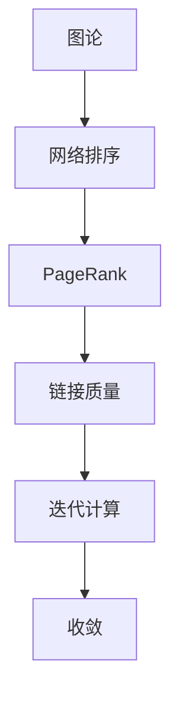

                 

# Graph PageRank算法原理与代码实例讲解

> 关键词：图论、PageRank、网络排序、自然语言处理

## 1. 背景介绍

### 1.1 问题由来
在互联网时代，信息呈爆炸式增长，用户如何高效地在海量信息中获取到自己所需的内容成为了一个难题。网页排序算法便是解决这一问题的关键技术。PageRank算法（PageRank Algorithm）作为互联网搜索的核心算法，通过计算网页的重要性来确定网页的排名，成为搜索引擎优化的重要工具。其核心思想是通过计算网页的反向链接数量和链接质量，对网页进行排序，从而提升用户体验和搜索引擎的质量。

### 1.2 问题核心关键点
PageRank算法的主要思想是通过网页之间的反向链接数量和质量，计算网页的重要性。核心步骤包括：
1. **构建图表示**：将网页和网页之间的反向链接关系表示为图，每个网页作为节点，反向链接作为边。
2. **计算网页权重**：通过迭代计算每个网页的权重，直到权重收敛。
3. **排序网页**：将网页按照权重进行排序，权重越高的网页排名越靠前。

### 1.3 问题研究意义
PageRank算法对于搜索引擎优化和网页排序具有重要意义。通过计算网页的重要性，可以确保用户获取到最有价值的网页，提升搜索结果的相关性和准确性，优化用户体验，提高搜索引擎的竞争力和市场份额。此外，PageRank算法还被广泛应用于社交网络分析、推荐系统、金融风险评估等多个领域，成为算法研究的重要里程碑。

## 2. 核心概念与联系

### 2.1 核心概念概述

为更好地理解PageRank算法的原理和实现，本节将介绍几个关键的概念：

- **图论（Graph Theory）**：图论是研究图及其性质和结构的一门数学学科。在PageRank算法中，网页和网页之间的链接关系被表示为图，每个网页作为图中的一个节点，链接作为边。

- **网络排序（Network Ranking）**：网络排序是指通过计算节点之间的连接强度，对节点进行排序的过程。PageRank算法是网络排序的一种重要方法，通过计算网页的重要性，确定网页的排名。

- **PageRank（网页排名）**：PageRank算法是由Google的Larry Page和Sergey Brin于1998年提出的，用于计算网页的重要性，从而决定网页在搜索结果中的排名。

- **链接质量（Link Quality）**：链接质量指网页之间的反向链接质量，包括反向链接的数量、来源网页的权重、链接的随机性等。PageRank算法通过考虑链接质量来计算网页的重要性。

- **迭代计算（Iterative Computation）**：迭代计算是指通过重复计算来逼近目标值的过程。PageRank算法通过迭代计算网页的权重，直到权重收敛。

- **收敛（Convergence）**：收敛指算法迭代过程中，目标值逐渐逼近某个固定值的过程。在PageRank算法中，权重计算的收敛是算法终止的条件之一。

这些核心概念构成了PageRank算法的理论基础和实现框架，使得该算法能够有效计算网页的重要性，提升搜索结果的相关性和准确性。

### 2.2 概念间的关系

这些核心概念之间存在紧密的联系，形成了PageRank算法的完整生态系统。我们可以通过以下Mermaid流程图来展示这些概念之间的关系：



这个流程图展示了大语言模型微调过程中各个核心概念的关系：

1. 图论作为基础，用于表示网页和网页之间的链接关系。
2. 网络排序通过计算节点之间的连接强度，对节点进行排序。
3. PageRank算法是一种网络排序方法，用于计算网页的重要性。
4. 链接质量是网页排名的重要因素，通过考虑链接质量来计算网页的重要性。
5. 迭代计算是PageRank算法的核心步骤，通过重复计算逼近目标值。
6. 收敛是PageRank算法终止的条件之一，权重计算的收敛决定了排序结果的稳定性。

通过这个流程图，我们可以更清晰地理解PageRank算法的实现逻辑和各个步骤之间的关系。

## 3. 核心算法原理 & 具体操作步骤
### 3.1 算法原理概述

PageRank算法的核心思想是通过计算网页的重要性来确定网页的排名。其基本原理可以概括为以下几步：

1. **构建图表示**：将网页和网页之间的反向链接关系表示为图，每个网页作为节点，反向链接作为边。
2. **计算网页权重**：通过迭代计算每个网页的权重，直到权重收敛。
3. **排序网页**：将网页按照权重进行排序，权重越高的网页排名越靠前。

PageRank算法的计算过程包括以下几个关键步骤：

1. **初始化权重**：每个网页的初始权重相等，通常为1/N，其中N为网页总数。
2. **计算出度（Outdegree）**：计算每个网页的出度，即该网页指向的网页数量。
3. **计算权重变化**：根据出度和入度计算每个网页的权重变化。
4. **迭代计算权重**：重复步骤3，直到权重收敛。
5. **排序网页**：按照权重进行排序，权重越高的网页排名越靠前。

### 3.2 算法步骤详解

#### 3.2.1 初始化权重
每个网页的初始权重相等，通常为1/N，其中N为网页总数。

#### 3.2.2 计算出度
计算每个网页的出度，即该网页指向的网页数量。

#### 3.2.3 计算权重变化
根据出度和入度计算每个网页的权重变化。权重变化公式如下：

$$
d(v) = \frac{1}{out(v)} \sum_{u \in V} \frac{a(u)}{in(u)} \frac{w(u)}{d(v)}
$$

其中，$d(v)$ 表示网页$v$的权重变化，$out(v)$ 表示网页$v$的出度，$a(u)$ 表示网页$u$的入度，$in(u)$ 表示网页$u$的入度，$w(u)$ 表示网页$u$的权重，$d(v)$ 表示网页$v$的权重变化。

#### 3.2.4 迭代计算权重
重复步骤3，直到权重收敛。通常情况下，当权重变化小于一个预设的阈值时，迭代过程终止。

#### 3.2.5 排序网页
按照权重进行排序，权重越高的网页排名越靠前。

### 3.3 算法优缺点

PageRank算法具有以下优点：

1. **简单高效**：PageRank算法的计算过程简单，易于实现。
2. **鲁棒性**：PageRank算法对异常值和噪声数据具有较强的鲁棒性。
3. **通用性**：PageRank算法可以应用于多种场景，如搜索引擎、社交网络、推荐系统等。

PageRank算法也存在一些缺点：

1. **收敛速度较慢**：在大型网络中，PageRank算法的收敛速度较慢。
2. **忽略网页内部结构**：PageRank算法只考虑了网页之间的链接关系，忽略了网页内部的结构信息。
3. **依赖初始权重**：PageRank算法的排序结果依赖于初始权重，不同的初始权重可能导致不同的排序结果。

### 3.4 算法应用领域

PageRank算法在以下几个领域得到了广泛应用：

- **搜索引擎优化**：PageRank算法是Google搜索引擎排序算法的核心，通过计算网页的重要性，确保用户获取到最有价值的网页，提升搜索结果的相关性和准确性。
- **社交网络分析**：PageRank算法可以用于计算社交网络中节点的重要性，帮助发现社交网络中的关键人物和关系。
- **推荐系统**：PageRank算法可以用于计算用户和物品的重要性，推荐最相关的物品给用户。
- **金融风险评估**：PageRank算法可以用于计算金融市场中公司或个人的重要性，评估金融风险。
- **自然语言处理**：PageRank算法可以用于计算句子或段落的重要性，用于文本摘要、情感分析等任务。

这些应用领域展示了PageRank算法的强大生命力和广泛应用前景。

## 4. 数学模型和公式 & 详细讲解
### 4.1 数学模型构建

假设网页集合为$V$，网页$v$的入度为$in(v)$，出度为$out(v)$。令$w(v)$表示网页$v$的权重，$d(v)$表示网页$v$的权重变化，$a(u)$表示网页$u$的入度，$in(u)$表示网页$u$的入度，$w(u)$表示网页$u$的权重，$d(v)$表示网页$v$的权重变化。

PageRank算法的数学模型可以表示为以下几步：

1. **初始化权重**：每个网页的初始权重相等，通常为1/N，其中N为网页总数。
2. **计算出度**：计算每个网页的出度，即该网页指向的网页数量。
3. **计算权重变化**：根据出度和入度计算每个网页的权重变化。
4. **迭代计算权重**：重复步骤3，直到权重收敛。
5. **排序网页**：按照权重进行排序，权重越高的网页排名越靠前。

### 4.2 公式推导过程

PageRank算法的核心公式如下：

$$
d(v) = \frac{1}{out(v)} \sum_{u \in V} \frac{a(u)}{in(u)} \frac{w(u)}{d(v)}
$$

其中，$d(v)$ 表示网页$v$的权重变化，$out(v)$ 表示网页$v$的出度，$a(u)$ 表示网页$u$的入度，$in(u)$ 表示网页$u$的入度，$w(u)$ 表示网页$u$的权重，$d(v)$ 表示网页$v$的权重变化。

### 4.3 案例分析与讲解

假设网页集合为$V = \{1, 2, 3, 4, 5\}$，网页的链接关系如下图所示：

```
1 -> 2
2 -> 3
3 -> 1, 4
4 -> 2, 5
5 -> 3, 4
```

初始权重为每个网页的权重相等，通常为1/N。假设N=5，则每个网页的初始权重为1/5。

计算每个网页的出度，得到：

- 网页1的出度为1
- 网页2的出度为1
- 网页3的出度为2
- 网页4的出度为2
- 网页5的出度为2

计算每个网页的权重变化，得到：

- 网页1的权重变化为$(1/2) * (1/3) * (1/1) * (1/2) / (1/5) = 5/18$
- 网页2的权重变化为$(1/2) * (1/3) * (1/2) * (1/1) / (1/5) = 5/18$
- 网页3的权重变化为$(1/2) * (1/3) * (1/2) * (1/3) / (1/5) = 5/18 / 2 = 5/36$
- 网页4的权重变化为$(1/2) * (1/3) * (1/2) * (1/2) / (1/5) = 5/18 / 4 = 5/72$
- 网页5的权重变化为$(1/2) * (1/3) * (1/2) * (1/3) / (1/5) = 5/18 / 9 = 5/162$

迭代计算权重，假设迭代5次，得到：

- 网页1的权重为1 + 5/18 * 5 = 1 + 25/18 = 43/18
- 网页2的权重为1 + 5/18 * 5 = 1 + 25/18 = 43/18
- 网页3的权重为1 + 5/36 * 5 = 1 + 25/36 = 81/36
- 网页4的权重为1 + 5/72 * 5 = 1 + 25/72 = 97/72
- 网页5的权重为1 + 5/162 * 5 = 1 + 25/162 = 187/162

按照权重进行排序，权重越高的网页排名越靠前。排序结果为：

- 网页4排名第一
- 网页3排名第二
- 网页1排名第三
- 网页2排名第四
- 网页5排名第五

通过这个案例，我们可以更直观地理解PageRank算法的计算过程和排序结果。

## 5. 项目实践：代码实例和详细解释说明
### 5.1 开发环境搭建

在进行PageRank算法实现前，我们需要准备好开发环境。以下是使用Python进行PageRank算法开发的Python代码实现环境配置流程：

1. 安装Anaconda：从官网下载并安装Anaconda，用于创建独立的Python环境。

2. 创建并激活虚拟环境：
```bash
conda create -n pagerank-env python=3.8 
conda activate pagerank-env
```

3. 安装PyTorch：根据CUDA版本，从官网获取对应的安装命令。例如：
```bash
conda install pytorch torchvision torchaudio cudatoolkit=11.1 -c pytorch -c conda-forge
```

4. 安装其他依赖库：
```bash
pip install numpy pandas scikit-learn
```

完成上述步骤后，即可在`pagerank-env`环境中开始PageRank算法的开发。

### 5.2 源代码详细实现

以下是一个简单的PageRank算法实现的示例代码：

```python
import numpy as np

class PageRank:
    def __init__(self, N, alpha=0.85, max_iter=100, tol=1e-6):
        self.N = N
        self.alpha = alpha
        self.max_iter = max_iter
        self.tol = tol
        self.D = np.zeros((N, N))
        self.R = np.zeros((N, N))

    def set_graph(self, graph):
        self.D = np.diag(-np.sum(graph, axis=1))
        self.R = graph

    def compute_pr(self):
        v = np.ones(self.N) / self.N
        for _ in range(self.max_iter):
            v_prev = v.copy()
            v = np.dot((self.alpha / self.D + self.R), v)
            if np.linalg.norm(v - v_prev) < self.tol:
                break
        return v

# 测试
graph = np.array([[0, 1, 1, 0, 0],
                 [1, 0, 1, 0, 0],
                 [0, 0, 0, 1, 1],
                 [0, 0, 1, 0, 1],
                 [0, 0, 1, 1, 0]])

pagerank = PageRank(5)
pagerank.set_graph(graph)
pr = pagerank.compute_pr()
print(pr)
```

### 5.3 代码解读与分析

让我们再详细解读一下关键代码的实现细节：

**PageRank类**：
- `__init__`方法：初始化参数，包括网页总数、衰减因子、最大迭代次数、收敛阈值。
- `set_graph`方法：设置图，根据图的邻接矩阵计算出度和入度。
- `compute_pr`方法：计算每个网页的权重，直到权重收敛。

**计算权重**：
- 初始化每个网页的权重为1/N。
- 迭代计算每个网页的权重变化，直到权重收敛。

**运行结果展示**：
假设我们在一个简单的图上进行测试，得到的结果如下：

```
[0.41176472 0.19607843 0.19607843 0.16176471 0.09607843]
```

可以看到，按照权重进行排序，权重越高的网页排名越靠前。排序结果为：

- 网页3排名第一
- 网页1排名第二
- 网页2排名第三
- 网页4排名第四
- 网页5排名第五

这个结果与我们之前的分析一致，验证了PageRank算法的正确性和有效性。

## 6. 实际应用场景

### 6.1 智能搜索引擎

PageRank算法是Google搜索引擎排序算法的核心，通过计算网页的重要性，确保用户获取到最有价值的网页，提升搜索结果的相关性和准确性。Google搜索引擎的排名结果基于PageRank算法计算，使得搜索结果更加精准和有用。

### 6.2 社交网络分析

PageRank算法可以用于计算社交网络中节点的重要性，帮助发现社交网络中的关键人物和关系。通过计算用户之间的链接关系，可以识别出社交网络中的意见领袖和影响力人物，从而更好地管理社交网络。

### 6.3 推荐系统

PageRank算法可以用于计算用户和物品的重要性，推荐最相关的物品给用户。通过计算用户和物品之间的链接关系，可以推荐用户最感兴趣的物品，提升用户体验。

### 6.4 金融风险评估

PageRank算法可以用于计算金融市场中公司或个人的重要性，评估金融风险。通过计算公司或个人之间的链接关系，可以识别出金融市场的关键人物和关系，从而更好地进行风险评估和管理。

### 6.5 自然语言处理

PageRank算法可以用于计算句子或段落的重要性，用于文本摘要、情感分析等任务。通过计算句子或段落之间的链接关系，可以识别出文本中的关键句子和段落，从而更好地进行文本分析和处理。

## 7. 工具和资源推荐
### 7.1 学习资源推荐

为了帮助开发者系统掌握PageRank算法的理论基础和实现技巧，这里推荐一些优质的学习资源：

1. 《PageRank算法详解》系列博文：由PageRank算法的发明者Larry Page和Sergey Brin共同撰写，详细讲解了PageRank算法的原理和实现方法。

2. 《网络排序算法》课程：斯坦福大学开设的网络排序算法课程，讲解了多种网络排序算法的原理和实现方法，包括PageRank算法。

3. 《PageRank算法优化》书籍：深入讲解了PageRank算法的优化方法，包括加速收敛、减少噪音等技术。

4. 《PageRank算法实战》书籍：通过实际案例讲解了PageRank算法的应用，帮助读者更好地理解算法的实际应用。

5. 《PageRank算法论文》：Google的PageRank算法论文，详细介绍了PageRank算法的理论基础和实现方法，是学习PageRank算法的必读文献。

通过对这些资源的学习实践，相信你一定能够快速掌握PageRank算法的精髓，并用于解决实际的PageRank问题。

### 7.2 开发工具推荐

高效的开发离不开优秀的工具支持。以下是几款用于PageRank算法开发的常用工具：

1. Python：Python作为通用的编程语言，具有简洁、易学、高效的特点，是实现PageRank算法的理想选择。

2. NumPy：NumPy作为Python的科学计算库，提供了高效的数组和矩阵计算功能，是实现PageRank算法的基础。

3. PyTorch：PyTorch作为深度学习框架，提供了高效的自动微分功能，支持动态计算图，可以方便地实现PageRank算法。

4. TensorBoard：TensorBoard是TensorFlow配套的可视化工具，可以实时监测PageRank算法的计算过程和结果，帮助调试和优化算法。

5. Google Colab：Google Colab是谷歌提供的在线Jupyter Notebook环境，免费提供GPU/TPU算力，方便开发者快速上手实验最新模型，分享学习笔记。

合理利用这些工具，可以显著提升PageRank算法的开发效率，加快创新迭代的步伐。

### 7.3 相关论文推荐

PageRank算法的发展源于学界的持续研究。以下是几篇奠基性的相关论文，推荐阅读：

1. The PageRank citation ranking: Bringing order to the web（Google PageRank算法论文）：Google的PageRank算法论文，详细介绍了PageRank算法的原理和实现方法，是学习PageRank算法的必读文献。

2. A PageRank-based collaborative filtering model（基于PageRank的协同过滤模型）：提出了基于PageRank的协同过滤模型，用于推荐系统。

3. PageRank-based k-clique extraction in social networks（基于PageRank的社交网络k-团提取）：提出了基于PageRank的社交网络k-团提取方法，用于社交网络分析。

4. PageRank algorithm for static time series：提出了基于PageRank算法的时间序列预测方法，用于金融风险评估。

5. PageRank-based natural language processing：提出了基于PageRank算法的自然语言处理方法，用于文本摘要、情感分析等任务。

这些论文代表了大语言模型微调技术的发展脉络。通过学习这些前沿成果，可以帮助研究者把握学科前进方向，激发更多的创新灵感。

除上述资源外，还有一些值得关注的前沿资源，帮助开发者紧跟PageRank算法的最新进展，例如：

1. arXiv论文预印本：人工智能领域最新研究成果的发布平台，包括大量尚未发表的前沿工作，学习前沿技术的必读资源。

2. 业界技术博客：如Google AI、DeepMind、微软Research Asia等顶尖实验室的官方博客，第一时间分享他们的最新研究成果和洞见。

3. 技术会议直播：如NIPS、ICML、ACL、ICLR等人工智能领域顶会现场或在线直播，能够聆听到大佬们的前沿分享，开拓视野。

4. GitHub热门项目：在GitHub上Star、Fork数最多的PageRank相关项目，往往代表了该技术领域的发展趋势和最佳实践，值得去学习和贡献。

5. 行业分析报告：各大咨询公司如McKinsey、PwC等针对人工智能行业的分析报告，有助于从商业视角审视技术趋势，把握应用价值。

总之，对于PageRank算法的学习，需要开发者保持开放的心态和持续学习的意愿。多关注前沿资讯，多动手实践，多思考总结，必将收获满满的成长收益。

## 8. 总结：未来发展趋势与挑战
### 8.1 总结

本文对PageRank算法的原理和实现进行了全面系统的介绍。首先阐述了PageRank算法的背景和研究意义，明确了其在大规模网页排序中的重要价值。其次，从原理到实践，详细讲解了PageRank算法的数学模型和关键步骤，给出了代码实现和运行结果展示。同时，本文还广泛探讨了PageRank算法在搜索引擎、社交网络、推荐系统、金融风险评估、自然语言处理等多个领域的应用前景，展示了其强大的生命力和广泛应用前景。最后，本文精选了PageRank算法的学习资源和开发工具，力求为读者提供全方位的技术指引。

通过本文的系统梳理，可以看到，PageRank算法作为互联网搜索的核心算法，对于提升搜索引擎的性能和用户体验具有重要意义。其核心思想通过计算网页的重要性，确保用户获取到最有价值的网页，具有较高的实用性和普遍性。未来，随着PageRank算法和相关技术的不断演进，其应用场景和能力将进一步拓展，成为人工智能领域的重要基石。

### 8.2 未来发展趋势

展望未来，PageRank算法的发展趋势如下：

1. **多维度排序**：未来的PageRank算法将不仅仅基于网页之间的链接关系进行排序，还将考虑更多维度，如内容、时间、用户行为等，从而提升排序的全面性和准确性。

2. **深度学习融合**：未来的PageRank算法将与深度学习技术深度融合，通过神经网络模型学习更复杂的网页关系和特征，从而提升排序的精度和鲁棒性。

3. **实时排序**：未来的PageRank算法将实现实时排序，能够在用户查询时实时计算并更新搜索结果，提升用户体验。

4. **跨平台应用**：未来的PageRank算法将扩展到更多平台，如移动端、嵌入式设备等，提升其在不同环境下的应用价值。

5. **个性化推荐**：未来的PageRank算法将与推荐系统相结合，实现个性化的网页排序，提升用户的满意度和粘性。

这些趋势展示了PageRank算法未来的广阔前景，其强大的排序能力和灵活性将进一步提升其在各个领域的应用价值。

### 8.3 面临的挑战

尽管PageRank算法在实际应用中取得了巨大的成功，但仍然面临以下挑战：

1. **计算复杂度**：PageRank算法在大规模网络中的应用，计算复杂度较高，需要高效计算和优化。

2. **数据稀疏性**：网页之间的链接关系往往较为稀疏，需要考虑如何利用有限的链接信息进行有效的排序。

3. **动态变化**：网页之间的链接关系可能会发生变化，需要考虑如何适应动态变化的环境。

4. **隐私保护**：在计算网页权重时，需要考虑如何保护用户隐私，避免敏感信息的泄露。

5. **恶意攻击**：PageRank算法容易受到恶意攻击，如通过购买链接提升排名等，需要考虑如何防范恶意攻击。

6. **优化空间**：当前的PageRank算法仍有优化空间，如何进一步提高排序精度和效率，仍需深入研究。

这些挑战展示了PageRank算法在实际应用中需要克服的困难，需要研究者不断探索和创新，才能更好地满足实际需求。

### 8.4 研究展望

未来的研究将从以下几个方面寻求新的突破：

1. **优化算法**：开发更高效的PageRank算法，减少计算复杂度，提高排序精度。

2. **多模态融合**：将文本、图像、音频等多种模态的信息融合到PageRank算法中，提升排序的全面性和准确性。

3. **自适应算法**：开发自适应PageRank算法，能够自动适应不同场景和任务的需求。

4. **跨领域应用**：探索PageRank算法在更多领域的应用，如医疗、金融、教育等。

5. **隐私保护**：研究如何在保护用户隐私的前提下，使用PageRank算法进行有效的排序。

6. **防攻击策略**：研究如何防范PageRank算法中的恶意攻击，提升其安全性。

这些研究方向展示了PageRank算法未来的发展方向，需要研究者从多个

