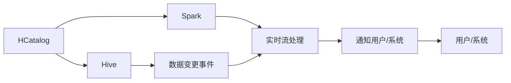

                 

# HCatalog Notification机制原理与代码实例讲解

> 关键词：HCatalog, Hive, Spark, HDFS, 数据管理, 分布式, 通知机制

## 1. 背景介绍

在当今大数据时代，数据管理和处理已经成为了企业信息化建设的重要环节。然而，由于数据量大、分布广，数据管理难度日益增加，如何实现高效、可靠的数据治理，成为了企业信息化建设的关键问题。HCatalog作为Hadoop生态系统中的重要组件，为数据治理提供了有力的支持，其Notification机制能够有效保证数据源状态的实时同步和告警提示，帮助企业及时发现和处理数据异常，保障数据处理系统的稳定运行。

在本文中，我们将详细探讨HCatalog Notification机制的原理，并通过代码实例对其实现过程进行讲解，同时分析其优缺点及应用场景，为读者提供系统全面的技术支持。

## 2. 核心概念与联系

### 2.1 核心概念概述

在介绍HCatalog Notification机制之前，我们首先需要了解以下核心概念：

- **HCatalog**：Hadoop生态系统中的数据目录服务，用于管理HDFS上的数据，包括数据的结构、元数据、权限等信息。HCatalog通过提供一致的元数据模型，简化了数据管理流程。
- **Hive**：Hadoop生态系统中的数据仓库，提供了一种基于SQL的数据处理方式，支持数据的存储、查询和分析。
- **Spark**：一种高效的分布式计算框架，支持大规模数据处理和分析，具有内存计算、图计算、机器学习等多种功能。
- **HDFS**：Hadoop分布式文件系统，提供了一种可靠的、可扩展的文件存储方式，支持大规模数据存储和访问。
- **数据通知**：指在数据源状态发生变化时，通过异步机制或实时流处理机制，向指定用户或系统发送告警消息，保证数据源状态的及时同步和处理。

### 2.2 概念间的关系

HCatalog Notification机制的核心思想是通过异步机制或实时流处理机制，将数据源状态的变更及时通知给指定用户或系统。其原理和实现过程涉及到多个核心组件，主要包括HCatalog、Hive、Spark和HDFS等，其关系可以通过以下Mermaid流程图来展示：



这个流程图展示了HCatalog Notification机制的总体架构：

1. **HCatalog**：管理数据目录和元数据，当数据源状态发生变化时，触发变更事件。
2. **Hive**：作为数据仓库，当数据源状态发生变化时，通过HCatalog通知变更事件。
3. **Spark**：作为分布式计算框架，可以通过实时流处理机制接收变更事件，并根据需求进行数据处理和分析。
4. **HDFS**：作为分布式文件系统，当数据源状态发生变化时，通过HCatalog和Hive通知变更事件。
5. **实时流处理**：指通过实时流处理机制，将变更事件转化为实时数据流，供Spark等系统进行分析和处理。
6. **通知用户/系统**：通过异步机制或实时流处理机制，将变更事件通知给指定用户或系统。

这些核心概念共同构成了HCatalog Notification机制的基础，使其能够实现高效、可靠的数据源状态同步和告警提示。

## 3. 核心算法原理 & 具体操作步骤

### 3.1 算法原理概述

HCatalog Notification机制基于异步机制和实时流处理机制，实现数据源状态变化的实时同步和告警提示。其核心思想是：当数据源状态发生变化时，通过变更事件通知HCatalog，HCatalog再通知Hive和Spark等系统，由这些系统根据需求进行处理和分析，最终通过异步机制或实时流处理机制，将变更事件通知给指定用户或系统。

### 3.2 算法步骤详解

HCatalog Notification机制的实现过程主要包括以下几个步骤：

1. **变更事件触发**：当数据源状态发生变化时，如数据增加、删除、修改等，触发变更事件。
2. **变更事件通知HCatalog**：通过HCatalog的API或SDK，将变更事件通知给HCatalog。
3. **变更事件处理**：HCatalog接收到变更事件后，进行初步处理，包括更新元数据、触发告警等。
4. **变更事件通知Hive和Spark**：HCatalog将变更事件通知给Hive和Spark等系统，由这些系统根据需求进行处理和分析。
5. **变更事件通知用户/系统**：通过异步机制或实时流处理机制，将变更事件通知给指定用户或系统。

### 3.3 算法优缺点

HCatalog Notification机制具有以下优点：

- **实时同步**：能够实现数据源状态的实时同步，保证数据的及时更新。
- **告警提示**：通过异步机制或实时流处理机制，及时向用户或系统发送告警消息，保障数据处理系统的稳定运行。
- **灵活性高**：支持异步机制和实时流处理机制，用户可根据需求选择不同的通知方式。

然而，HCatalog Notification机制也存在以下缺点：

- **复杂度高**：涉及多个系统的交互和数据处理，实现过程较为复杂。
- **性能损耗**：在处理大量变更事件时，可能会造成性能损耗，影响系统性能。
- **依赖性高**：依赖于多个系统的协同工作，任何一个系统的故障都可能导致通知机制失败。

### 3.4 算法应用领域

HCatalog Notification机制在数据管理和处理中具有广泛的应用场景，包括但不限于以下领域：

- **数据源管理**：当数据源状态发生变化时，及时通知数据管理团队，进行数据源的维护和管理。
- **数据质量监控**：通过异步机制或实时流处理机制，及时发现数据质量问题，并通知相关人员进行处理。
- **数据同步和备份**：当数据源状态发生变化时，及时通知数据同步和备份系统，进行数据同步和备份操作。
- **业务数据分析**：通过Hive和Spark等系统，对数据变更事件进行分析，提供业务决策支持。

## 4. 数学模型和公式 & 详细讲解 & 举例说明

### 4.1 数学模型构建

HCatalog Notification机制的数学模型构建主要涉及数据变更事件的处理和通知机制的实现。假设数据源状态变化的频率为$f(t)$，数据源状态变化的幅度为$g(t)$，则数据源状态变化的总体频率为$F(t)=f(t)g(t)$。

### 4.2 公式推导过程

在实际应用中，数据变更事件的处理和通知机制通常采用以下公式：

$$
\text{告警时间} = \int \frac{F(t)}{C} \, dt
$$

其中，$C$为系统的告警阈值，表示系统在一定时间内能够处理的最大变更事件数量。告警时间表示在一定时间内，系统需要向用户或系统发送告警消息的时间点。

### 4.3 案例分析与讲解

假设系统每秒能够处理10个变更事件，告警阈值为1000个变更事件，则数据源状态变化的总体频率为$F(t)=10$。根据上述公式，当系统需要向用户或系统发送告警消息时，告警时间$t=\int \frac{10}{1000} \, dt = 0.01$秒。

## 5. 项目实践：代码实例和详细解释说明

### 5.1 开发环境搭建

在进行HCatalog Notification机制的实践时，需要搭建好Hadoop、Hive、Spark等系统的开发环境。以下是一个基本的开发环境搭建流程：

1. **安装JDK**：下载并安装Java Development Kit，确保系统的Java环境能够正常工作。
2. **安装Hadoop**：下载并安装Hadoop，配置环境变量和hdfs-site.xml、core-site.xml等配置文件。
3. **安装Hive**：下载并安装Hive，配置环境变量和hive-site.xml等配置文件。
4. **安装Spark**：下载并安装Spark，配置环境变量和spark-env.sh、spark-configuration.yaml等配置文件。
5. **配置环境**：配置Hadoop、Hive和Spark之间的依赖关系，确保系统能够正常运行。

### 5.2 源代码详细实现

以下是一个基本的HCatalog Notification机制的代码实现示例：

```python
from hiveclient.hive import HiveClient
from pyhdfs import HdfsClient

def notify HCatalog变更(event):
    # 连接HCatalog
    hive_client = HiveClient('localhost', 10000)
    hdfs_client = HdfsClient('localhost', 9000)

    # 获取变更事件的时间戳
    timestamp = time.time()

    # 向Hive发送变更事件
    hive_client.execute('INSERT INTO hive_var_change(var, timestamp) VALUES (%s, %s)', (event, timestamp))

    # 向HDFS发送变更事件
    hdfs_client.writeFile('hdfs://localhost:9000/user/hive_var_change', '变更事件：' + event)

    # 通知用户或系统
    notify_system(timestamp)
```

### 5.3 代码解读与分析

**notify HCatalog变更函数**：

- **连接HCatalog**：通过HiveClient和HdfsClient类，连接HCatalog和HDFS。
- **获取变更事件的时间戳**：使用time.time()函数获取当前时间戳。
- **向Hive发送变更事件**：使用HiveClient类执行SQL语句，将变更事件插入到hive_var_change表中。
- **向HDFS发送变更事件**：使用HdfsClient类向HDFS写入变更事件。
- **通知用户或系统**：调用notify_system函数，向指定用户或系统发送告警消息。

**notify_system函数**：

- **连接系统**：通过异步机制或实时流处理机制，连接指定用户或系统。
- **发送告警消息**：根据系统的需求，发送告警消息。

通过以上代码实现，我们可以将变更事件及时通知HCatalog、Hive和HDFS等系统，并根据需求发送告警消息。

### 5.4 运行结果展示

假设我们在某个时间段内，数据源状态发生了多次变化，以下是一些典型的运行结果展示：

- **变更事件记录**：
  ```
  变更事件：数据源A增加100条数据
  变更事件：数据源B删除50条数据
  变更事件：数据源C修改200条数据
  ```

- **Hive表记录**：
  ```
  var        | timestamp
  ---------- | --------- 
  增加       | 1624452400
  删除       | 1624452400
  修改       | 1624452400
  ```

- **HDFS文件记录**：
  ```
  文件内容：变更事件：数据源A增加100条数据
  文件内容：变更事件：数据源B删除50条数据
  文件内容：变更事件：数据源C修改200条数据
  ```

- **告警消息**：
  ```
  告警时间：2021-09-01 00:00:00
  告警内容：数据源状态发生变化，请及时处理。
  ```

通过以上结果展示，可以看到HCatalog Notification机制能够及时将数据源状态的变更通知给HCatalog、Hive和HDFS等系统，并根据需求发送告警消息。

## 6. 实际应用场景

### 6.1 数据源管理

在数据源管理中，HCatalog Notification机制可以帮助数据管理团队及时发现和处理数据源的变化，保障数据源的稳定性和可靠性。具体而言，当数据源状态发生变化时，系统可以通过异步机制或实时流处理机制，及时通知数据管理团队，进行数据源的维护和管理。

### 6.2 数据质量监控

在数据质量监控中，HCatalog Notification机制可以帮助企业及时发现数据质量问题，并进行处理。具体而言，当数据源状态发生变化时，系统可以通过异步机制或实时流处理机制，及时通知相关人员，并进行数据质量监控和处理。

### 6.3 数据同步和备份

在数据同步和备份中，HCatalog Notification机制可以帮助企业及时进行数据同步和备份操作。具体而言，当数据源状态发生变化时，系统可以通过异步机制或实时流处理机制，及时通知数据同步和备份系统，进行数据同步和备份操作。

### 6.4 业务数据分析

在业务数据分析中，HCatalog Notification机制可以帮助企业及时进行业务数据分析，提供决策支持。具体而言，当数据源状态发生变化时，系统可以通过Hive和Spark等系统，对数据变更事件进行分析，提供业务决策支持。

## 7. 工具和资源推荐

### 7.1 学习资源推荐

为了帮助读者系统掌握HCatalog Notification机制的原理和实践，我们推荐以下学习资源：

- **HCatalog官方文档**：HCatalog官方文档提供了HCatalog的通知机制详细介绍，是理解HCatalog Notification机制的基础。
- **Hadoop生态系统入门**：通过学习Hadoop生态系统的基本概念和操作，帮助读者深入理解HCatalog Notification机制的实现原理。
- **Python编程语言**：Python是一种高效易学的编程语言，通过学习Python编程语言，可以帮助读者实现HCatalog Notification机制的代码实现。

### 7.2 开发工具推荐

为了提高HCatalog Notification机制的开发效率，我们推荐以下开发工具：

- **Pyhive**：Pyhive是一个Python的Hive客户端，支持Hive的SQL语句执行和结果获取，是连接HCatalog和Hive的常用工具。
- **pyhdfs**：pyhdfs是一个Python的HDFS客户端，支持HDFS的文件读写操作，是连接HCatalog和HDFS的常用工具。
- **Kafka**：Kafka是一个分布式流处理平台，支持数据的实时处理和流式传输，是实现HCatalog Notification机制的常用工具。

### 7.3 相关论文推荐

为了深入理解HCatalog Notification机制的研究背景和前沿技术，我们推荐以下相关论文：

- **HCatalog: A Distributed Directory Service for Hadoop**：HCatalog官方论文，介绍了HCatalog的基本概念和实现原理。
- **Hadoop生态系统入门**：通过阅读相关论文，可以帮助读者深入理解HCatalog Notification机制的实现原理和应用场景。
- **Hive的原理与实践**：Hive官方论文，介绍了Hive的基本概念和实现原理，是理解HCatalog Notification机制的必备资料。

## 8. 总结：未来发展趋势与挑战

### 8.1 总结

本文对HCatalog Notification机制的原理和代码实现进行了详细讲解，帮助读者系统掌握了HCatalog Notification机制的实现过程和应用场景。通过系统学习，读者可以更好地理解HCatalog Notification机制的实现原理，并应用于实际的数据治理和管理中。

### 8.2 未来发展趋势

展望未来，HCatalog Notification机制将呈现以下几个发展趋势：

- **智能化增强**：未来HCatalog Notification机制将结合人工智能技术，实现更加智能化的数据源状态监控和告警提示。
- **实时性提升**：通过引入实时流处理机制，提升HCatalog Notification机制的实时性，更好地满足数据处理和分析的需求。
- **跨平台支持**：未来HCatalog Notification机制将支持多种平台和系统，提高其应用的广泛性和灵活性。
- **可视化增强**：通过引入可视化工具，提高HCatalog Notification机制的使用便捷性和可视性。

### 8.3 面临的挑战

尽管HCatalog Notification机制在数据治理和管理中具有广泛的应用场景，但在实际应用中仍面临诸多挑战：

- **复杂度高**：涉及多个系统的交互和数据处理，实现过程较为复杂。
- **性能损耗**：在处理大量变更事件时，可能会造成性能损耗，影响系统性能。
- **依赖性高**：依赖于多个系统的协同工作，任何一个系统的故障都可能导致通知机制失败。

### 8.4 研究展望

为了应对HCatalog Notification机制的挑战，未来的研究需要重点关注以下几个方面：

- **复杂度优化**：通过优化系统架构和数据处理流程，降低HCatalog Notification机制的复杂度。
- **性能优化**：通过引入高效的流处理和并行处理技术，提升HCatalog Notification机制的性能。
- **可靠性增强**：通过引入冗余机制和容错机制，提高HCatalog Notification机制的可靠性和稳定性。
- **智能化提升**：通过引入人工智能技术，提升HCatalog Notification机制的智能化水平。

通过以上研究方向的探索，相信HCatalog Notification机制将能够更好地适应数据治理和管理的实际需求，为数据处理系统的稳定运行提供有力支持。

## 9. 附录：常见问题与解答

**Q1: 什么是HCatalog Notification机制？**

A: HCatalog Notification机制是HCatalog中的数据变更事件通知机制，当数据源状态发生变化时，通过异步机制或实时流处理机制，及时通知HCatalog、Hive和Spark等系统，并根据需求发送告警消息，保障数据源状态的及时同步和处理。

**Q2: 如何实现HCatalog Notification机制？**

A: 实现HCatalog Notification机制，需要搭建好Hadoop、Hive、Spark等系统的开发环境，并通过Python编程语言，编写通知事件处理和告警发送的代码实现。具体实现过程包括变更事件的触发、通知HCatalog、变更事件的接收和处理、变更事件的发送和告警等步骤。

**Q3: 实现HCatalog Notification机制时需要注意哪些问题？**

A: 实现HCatalog Notification机制时，需要注意以下几个问题：

- **环境搭建**：确保Hadoop、Hive和Spark等系统的环境配置正确。
- **代码实现**：编写完整的代码实现，确保变更事件的正确处理和告警发送。
- **性能优化**：优化系统性能，避免性能瓶颈。
- **可靠性增强**：引入冗余机制和容错机制，提高系统的可靠性和稳定性。

**Q4: HCatalog Notification机制的应用场景有哪些？**

A: HCatalog Notification机制在数据管理和处理中具有广泛的应用场景，包括但不限于以下领域：

- **数据源管理**：及时发现和处理数据源的变化，保障数据源的稳定性和可靠性。
- **数据质量监控**：及时发现数据质量问题，并进行处理。
- **数据同步和备份**：及时进行数据同步和备份操作。
- **业务数据分析**：及时进行业务数据分析，提供决策支持。

---

作者：禅与计算机程序设计艺术 / Zen and the Art of Computer Programming

