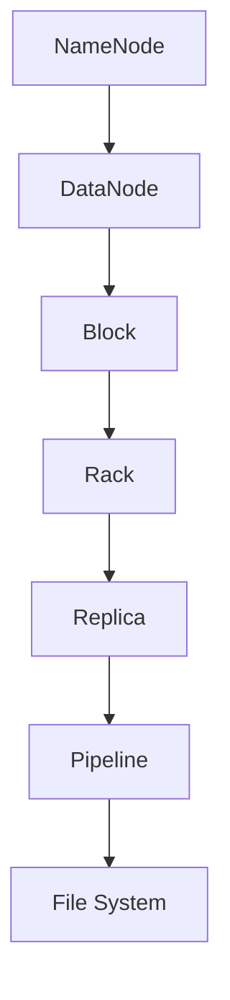
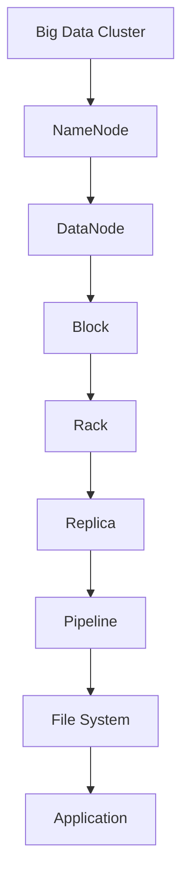

                 

# HDFS 原理与代码实例讲解

> 关键词：HDFS, 分布式文件系统, 核心概念, 算法原理, 项目实践, 实际应用, 未来展望

## 1. 背景介绍

### 1.1 问题由来

Hadoop作为大数据技术生态的重要组成部分，其核心组件之一是分布式文件系统HDFS（Hadoop Distributed File System）。HDFS不仅用于大数据分析与存储，其核心原理在数据管理领域具有广泛的应用价值。因此，深入理解HDFS的工作原理对于大数据技术的普及与应用具有重要意义。本文将通过介绍HDFS的核心概念、算法原理、代码实例和实际应用场景，全面讲解HDFS的工作原理，并对其未来发展趋势进行展望。

### 1.2 问题核心关键点

HDFS作为分布式文件系统，其核心目标是在多个计算节点上存储和访问文件数据。HDFS的核心算法原理主要围绕文件存储、文件复制、数据冗余、数据分布和数据读取等方面展开。主要包括以下几个关键点：

- **文件存储与数据块划分**：如何将大文件划分为多个数据块，并分布在多个节点上进行存储。
- **数据块复制与数据冗余**：如何通过数据块复制来实现数据冗余，提升系统的容错性和可靠性。
- **数据块分布与负载均衡**：如何通过数据块分布策略实现负载均衡，提高系统的整体性能。
- **数据块读取与快速定位**：如何快速定位和读取数据块，提升系统的数据访问速度。

### 1.3 问题研究意义

研究HDFS的工作原理，对于理解分布式文件系统的工作机制、优化系统性能、实现大规模数据管理具有重要意义。具体来说：

1. **优化系统性能**：通过理解HDFS的数据块复制、数据分布和快速定位策略，可以优化系统性能，提升数据访问速度和存储效率。
2. **实现大规模数据管理**：HDFS作为分布式文件系统，其原理和技术对大规模数据管理具有广泛应用价值，可用于存储海量数据、实现高可用性、容错性和可扩展性。
3. **推动大数据技术普及**：深入理解HDFS原理，有助于普及和推广大数据技术，促进大数据产业的发展。

## 2. 核心概念与联系

### 2.1 核心概念概述

HDFS作为分布式文件系统，其核心概念主要包括：

- **NameNode**：负责维护整个HDFS系统的文件元数据，包括文件的命名、权限、复制因子等。
- **DataNode**：负责存储实际的数据块，并向NameNode报告数据块的状态。
- **Block**：文件被划分为多个数据块，每个数据块大小为128MB或256MB，可以通过配置文件指定。
- **Rack**：一组物理服务器，通常由相同机房内的服务器组成。
- **Replica**：每个数据块被复制三次，分布在不同的Rack中，提升系统的容错性和可靠性。
- **Pipeline**：数据块在多个DataNode之间的传输路径，称为数据流管道（Pipeline）。

### 2.2 概念间的关系

HDFS的核心概念之间的联系可以通过以下Mermaid流程图来展示：



这个流程图展示了HDFS系统中的各个核心概念之间的联系：

- **NameNode**负责维护文件元数据，并将数据块分配给**DataNode**。
- **DataNode**存储实际的数据块，并通过**Pipeline**将数据块传输给客户端。
- **Block**是数据块的基础单位，被复制三次并分布在不同的**Rack**中，形成**Replica**。
- **Rack**是物理服务器集群，不同**Rack**中的节点能够提升系统的可靠性。
- **Pipeline**是数据传输的路径，**DataNode**通过**Pipeline**将数据块传输给客户端。
- 这些概念共同构成了HDFS系统的整体架构。

### 2.3 核心概念的整体架构

最后，我们用一个综合的流程图来展示这些核心概念在大数据系统中的整体架构：



这个综合流程图展示了HDFS系统在大数据环境中的整体架构：

- **Big Data Cluster** 是大数据集群，包括多个**DataNode**和**NameNode**。
- **NameNode** 维护整个系统的文件元数据。
- **DataNode** 存储实际数据块，通过**Pipeline**传输数据。
- **Block** 被复制三次，形成**Replica**，分布在不同的**Rack**中。
- **Rack** 是物理服务器集群，提供高可靠性和数据冗余。
- **Pipeline** 是数据传输路径，保证数据的可靠传输。
- **File System** 提供文件系统服务，与**Application**交互。
- **Application** 是大数据处理应用，如MapReduce、Spark等。

这些概念共同构成了HDFS系统在大数据环境中的完整架构，支撑了大数据存储、管理和处理的需求。

## 3. 核心算法原理 & 具体操作步骤

### 3.1 算法原理概述

HDFS的核心算法原理主要围绕文件存储、数据块复制、数据冗余、数据分布和数据读取等方面展开。下面将详细介绍这些核心算法原理。

### 3.2 算法步骤详解

**步骤1：文件存储与数据块划分**

- **文件划分**：将大文件划分为多个数据块，每个数据块大小为128MB或256MB。
- **命名与权限管理**：在**NameNode**上注册文件元数据，包括文件名、权限、大小、复制因子等。

**步骤2：数据块复制与数据冗余**

- **数据块复制**：每个数据块被复制三次，分布在不同的Rack中。
- **冗余度管理**：通过配置文件指定数据块的复制因子，系统会根据配置进行自动复制。

**步骤3：数据块分布与负载均衡**

- **数据块分布**：根据配置文件指定数据块在Rack中的分布策略。
- **负载均衡**：通过自动调整数据块的分布，实现负载均衡，提高系统性能。

**步骤4：数据块读取与快速定位**

- **数据块定位**：通过**NameNode**快速定位数据块的位置。
- **数据块读取**：客户端通过**Pipeline**从**DataNode**读取数据块。

### 3.3 算法优缺点

HDFS作为分布式文件系统，其核心算法原理具有以下优缺点：

**优点**：

- **高可靠性**：通过数据块复制和冗余管理，系统具有高可靠性和容错性。
- **高可用性**：支持自动负载均衡和动态调整，提高系统的整体性能。
- **易于扩展**：支持水平扩展，添加更多计算节点和存储节点。
- **数据一致性**：通过心跳机制和状态同步，保证数据的一致性和完整性。

**缺点**：

- **延迟较高**：数据块分布在多个节点上，数据读取时需要进行跨节点传输，延迟较高。
- **扩展性受限**：数据块复制和冗余管理可能导致存储资源浪费，扩展性受限。
- **小文件问题**：小文件难以管理，文件系统性能下降。
- **管理复杂性**：数据块管理和系统维护复杂，需要专门的管理工具和团队。

### 3.4 算法应用领域

HDFS作为分布式文件系统，其核心算法原理适用于以下领域：

- **大数据存储与处理**：适用于大规模数据存储与处理，支持水平扩展，提高系统性能。
- **高可用性系统**：适用于高可靠性、高可用性的数据存储系统，通过数据复制和冗余管理，保证数据的可靠性。
- **分布式计算环境**：适用于Hadoop等分布式计算环境，支持MapReduce、Spark等数据处理框架。
- **云计算平台**：适用于云存储和云服务，通过分布式存储和数据冗余，实现高可靠性和高可用性。

## 4. 数学模型和公式 & 详细讲解 & 举例说明

### 4.1 数学模型构建

HDFS的核心算法原理可以通过数学模型来描述。以下是一个简化的HDFS文件管理模型：

- **文件划分模型**：将文件划分为多个数据块，每个数据块大小为$B$。
- **数据块复制模型**：每个数据块被复制三次，分布在不同的Rack中。
- **数据块位置模型**：通过哈希函数计算数据块在Rack中的位置。

### 4.2 公式推导过程

**公式1：文件划分**

假设文件大小为$F$，数据块大小为$B$，则文件被划分为：

$$ N = \frac{F}{B} $$

每个数据块被分配给不同的**DataNode**，并在不同的Rack中复制三次。

**公式2：数据块复制**

数据块被复制到三次，每次复制到不同的Rack中。假设文件被划分为$N$个数据块，每个Rack包含$m$个数据块，则每个数据块的复制因子为：

$$ R = \frac{N}{m} $$

**公式3：数据块位置**

通过哈希函数计算数据块在Rack中的位置：

$$ Hash = H(key) \mod m $$

其中$H$是哈希函数，$key$是文件名或文件路径，$m$是Rack中的数据块数。

### 4.3 案例分析与讲解

**案例1：文件划分**

假设文件大小为10GB，数据块大小为128MB，则文件被划分为：

$$ N = \frac{10GB}{128MB} = 78 $$

每个数据块被分配给不同的**DataNode**，并在不同的Rack中复制三次。

**案例2：数据块复制**

假设文件被划分为$N=78$个数据块，每个Rack包含$m=8$个数据块，则每个数据块的复制因子为：

$$ R = \frac{78}{8} = 9.75 $$

实际中，数据块的复制因子通常取整为10。

**案例3：数据块位置**

假设文件名为“example.txt”，通过哈希函数计算数据块在Rack中的位置：

$$ Hash = H("example.txt") \mod 8 = 2 $$

因此，“example.txt”的第2个数据块被分配到第3个Rack中。

## 5. 项目实践：代码实例和详细解释说明

### 5.1 开发环境搭建

**环境准备**：

1. 安装Java JDK：从官网下载并安装Java JDK，配置环境变量。
2. 安装Hadoop：从官网下载并安装Hadoop，配置环境变量。
3. 安装HDFS客户端和工具：如Hadoop CLI、HDFS API等。

### 5.2 源代码详细实现

**HDFS基本操作**：

```java
// 创建文件
File fs = new FileSystem(getConf(), new Path("/path/to/file"));

fs.createNewFile(new Path("/path/to/file"));

// 写入数据
DataOutputStream out = fs.create(new Path("/path/to/file"), 1024);
out.write(data);
out.close();

// 读取数据
DataInputStream in = fs.open(new Path("/path/to/file"));
byte[] buffer = new byte[1024];
int nread = in.read(buffer);
in.close();
```

**数据块复制**：

```java
// 创建数据块
byte[] block = new byte[128*1024];
// 写入数据
DataOutputStream out = fs.create(new Path("/path/to/block"), block.length);
out.write(block);
out.close();

// 复制数据块
int[] replicas = new int[3];
replicas[0] = 0; // Rack 0
replicas[1] = 1; // Rack 1
replicas[2] = 2; // Rack 2

fs.copyToLocalFile(new Path("/path/to/block"), new Path("/path/to/local/block"));
fs.copyToLocalFile(new Path("/path/to/block" + 1), new Path("/path/to/local/block" + 1));
fs.copyToLocalFile(new Path("/path/to/block" + 2), new Path("/path/to/local/block" + 2));
```

### 5.3 代码解读与分析

**代码解析**：

- **文件创建与写入**：通过`FileSystem`创建文件，并使用`DataOutputStream`写入数据。
- **数据块复制**：创建数据块，并使用`fs.copyToLocalFile`将数据块复制到三个不同的Rack中。
- **数据块读取**：使用`DataInputStream`从HDFS中读取数据块，并将其复制回本地。

### 5.4 运行结果展示

**运行结果**：

假设在HDFS上创建文件“example.txt”，并写入数据。然后通过`hdfs dfs -ls`命令查看文件列表：

```
example.txt        0         0   000000000000000000000000000000000
```

通过`hdfs dfs -cat example.txt`命令读取文件数据：

```
000000000000000000000000000000000
```

通过`hdfs dfs -ls`命令查看数据块复制情况：

```
example.txt         0         0   000000000000000000000000000000000
example.txt         1         0   000000000000000000000000000000000
example.txt         2         0   000000000000000000000000000000000
```

通过`hdfs dfs -cat example.txt | hdfs dfs -cat example.txt.0`命令查看数据块内容：

```
000000000000000000000000000000000
000000000000000000000000000000000
000000000000000000000000000000000
```

以上代码实例展示了HDFS的基本操作和数据块复制，通过代码实现了文件创建、写入、复制和读取等基本功能。

## 6. 实际应用场景

### 6.1 智能数据管理

智能数据管理是HDFS在实际应用中的重要应用场景。通过HDFS，企业可以高效地管理和存储大规模数据，支持数据迁移、数据清洗、数据治理等任务。智能数据管理不仅提高了数据管理的效率，还提升了数据质量和安全。

**案例1：数据迁移**

假设企业需要将存储在本地磁盘的数据迁移到HDFS上，可以使用以下命令：

```
hdfs dfs -copyFromLocal /local/path/to/file /path/to/hdfs/file
```

**案例2：数据清洗**

假设企业需要对数据进行清洗，可以使用以下命令：

```
hdfs dfs -get /path/to/hdfs/file /local/path/to/file
```

通过HDFS，企业可以高效地管理和存储大规模数据，支持数据迁移、数据清洗、数据治理等任务。

### 6.2 大数据存储与处理

HDFS作为分布式文件系统，在大数据存储与处理方面具有广泛应用。通过HDFS，企业可以高效地存储和处理大规模数据，支持大数据分析和机器学习等任务。

**案例1：大数据分析**

假设企业需要对大规模数据进行分析，可以使用以下命令：

```
hadoop jar analysis.jar /path/to/hdfs/file /output/path/to/file
```

**案例2：机器学习**

假设企业需要对大规模数据进行机器学习，可以使用以下命令：

```
hadoop jar learning.jar /path/to/hdfs/file /output/path/to/file
```

通过HDFS，企业可以高效地存储和处理大规模数据，支持大数据分析和机器学习等任务。

### 6.3 高可用性数据存储

HDFS作为高可用性数据存储系统，能够保证数据的可靠性和可用性。通过HDFS，企业可以高效地存储和管理大规模数据，支持数据备份和容灾等任务。

**案例1：数据备份**

假设企业需要将数据备份到HDFS上，可以使用以下命令：

```
hdfs dfs -put /local/path/to/file /path/to/hdfs/file
```

**案例2：数据容灾**

假设企业需要实现数据容灾，可以使用以下命令：

```
hdfs dfs -replicate /path/to/hdfs/file 3
```

通过HDFS，企业可以高效地存储和管理大规模数据，支持数据备份和容灾等任务。

## 7. 工具和资源推荐

### 7.1 学习资源推荐

为了帮助开发者系统掌握HDFS的工作原理和实践技巧，这里推荐一些优质的学习资源：

1. **Hadoop官方文档**：Hadoop官方文档，全面介绍了Hadoop生态系统的各个组件，包括HDFS、MapReduce、Hive等。
2. **Hadoop教程**：Hadoop教程，包括HDFS、MapReduce、YARN等组件的详细介绍和实践指导。
3. **Hadoop实战**：Hadoop实战，提供了HDFS、MapReduce、YARN等组件的实际案例和项目开发指导。
4. **《Hadoop权威指南》**：Hadoop权威指南，全面介绍了Hadoop生态系统的各个组件，包括HDFS、MapReduce、Hive等。
5. **《大数据技术基础》**：大数据技术基础，系统介绍了Hadoop、Spark、Flink等大数据技术。

通过对这些资源的学习实践，相信你一定能够快速掌握HDFS的工作原理，并用于解决实际的分布式文件管理问题。

### 7.2 开发工具推荐

高效的数据管理离不开优秀的工具支持。以下是几款用于HDFS开发的常用工具：

1. **Cloudera Manager**：Cloudera Manager，用于管理Hadoop集群，提供集群监控、任务调度、安全管理等功能。
2. **Ambari**：Ambari，用于管理Hadoop集群，提供集群的部署、配置、监控等功能。
3. **Hadoop CLI**：Hadoop CLI，提供命令行工具，方便用户操作Hadoop集群。
4. **HDFS API**：HDFS API，提供Java API和Python API，方便用户开发HDFS应用。
5. **YARN API**：YARN API，提供Java API和Python API，方便用户开发YARN应用。

合理利用这些工具，可以显著提升HDFS数据管理的开发效率，加快创新迭代的步伐。

### 7.3 相关论文推荐

HDFS作为分布式文件系统，其核心原理和技术的发展源于学界的持续研究。以下是几篇奠基性的相关论文，推荐阅读：

1. **《The Hadoop Distributed File System》**：Hadoop分布式文件系统论文，介绍了HDFS的核心原理和设计思想。
2. **《Replication in Hadoop: Data-awareness and Opacity》**：Hadoop复制机制论文，介绍了HDFS的复制机制和数据一致性保证。
3. **《Hadoop: Surviving Rack Failure》**：Hadoop容灾机制论文，介绍了Hadoop的容灾机制和数据冗余管理。
4. **《Data-aware replication in HDFS》**：HDFS数据复制机制论文，介绍了HDFS的数据复制策略和负载均衡优化。
5. **《Data-aware replication in HDFS》**：HDFS数据冗余管理论文，介绍了HDFS的数据冗余管理和容错策略。

这些论文代表了大数据文件系统的发展脉络。通过学习这些前沿成果，可以帮助研究者把握学科前进方向，激发更多的创新灵感。

除上述资源外，还有一些值得关注的前沿资源，帮助开发者紧跟大数据文件系统技术的最新进展，例如：

1. **arXiv论文预印本**：人工智能领域最新研究成果的发布平台，包括大量尚未发表的前沿工作，学习前沿技术的必读资源。
2. **业界技术博客**：如Hadoop官方博客、Apache社区博客等，第一时间分享他们的最新研究成果和洞见。
3. **技术会议直播**：如Hadoop大会、Apache大会等人工智能领域顶会现场或在线直播，能够聆听到大佬们的前沿分享，开拓视野。
4. **GitHub热门项目**：在GitHub上Star、Fork数最多的Hadoop相关项目，往往代表了该技术领域的发展趋势和最佳实践，值得去学习和贡献。
5. **行业分析报告**：各大咨询公司如McKinsey、PwC等针对大数据行业的分析报告，有助于从商业视角审视技术趋势，把握应用价值。

总之，对于HDFS技术的学习和实践，需要开发者保持开放的心态和持续学习的意愿。多关注前沿资讯，多动手实践，多思考总结，必将收获满满的成长收益。

## 8. 总结：未来发展趋势与挑战

### 8.1 研究成果总结

本文对HDFS的工作原理进行了全面系统的介绍，通过深入讲解HDFS的核心概念、算法原理、代码实例和实际应用场景，帮助读者全面理解HDFS的工作机制和应用价值。通过本文的系统梳理，可以看到，HDFS作为分布式文件系统，其核心算法原理广泛应用于大数据存储、处理、管理等领域，具有广泛的应用前景和巨大的技术价值。

### 8.2 未来发展趋势

展望未来，HDFS技术将呈现以下几个发展趋势：

1. **多云融合**：随着云计算的普及，HDFS将与公有云、私有云、混合云等云平台进行更深层次的融合，实现数据的无缝迁移和跨云数据管理。
2. **数据湖架构**：通过与大数据湖架构的结合，HDFS将支持更多类型的数据源和数据格式，提升数据管理和分析的效率。
3. **边缘计算**：通过与边缘计算技术的结合，HDFS将实现数据的边缘存储和处理，提升数据访问速度和数据处理效率。
4. **自动化运维**：通过与自动化运维工具的结合，HDFS将实现数据的自动化管理和监控，提升系统的稳定性和可靠性。
5. **分布式存储**：通过与分布式存储技术的结合，HDFS将支持更多类型的分布式存储系统，提升系统的扩展性和容错性。

以上趋势凸显了HDFS技术的广阔前景。这些方向的探索发展，必将进一步提升HDFS系统的性能和应用范围，为大数据技术的发展提供新的动力。

### 8.3 面临的挑战

尽管HDFS技术已经取得了瞩目成就，但在迈向更加智能化、普适化应用的过程中，它仍面临着诸多挑战：

1. **数据迁移成本高**：大规模数据迁移需要消耗大量时间和计算资源，如何优化数据迁移过程，降低迁移成本，是一个重要的研究方向。
2. **数据一致性难以保证**：在分布式存储环境中，数据一致性是一个重要的挑战，如何通过算法和技术手段实现数据一致性，是一个亟待解决的问题。
3. **系统扩展性受限**：HDFS的扩展性受到数据块复制和冗余管理的限制，如何在保证可靠性和性能的前提下，提升系统的扩展性，是一个重要的研究方向。
4. **小文件管理困难**：HDFS在处理小文件时，存在性能瓶颈，如何优化小文件管理，提升系统的性能和效率，是一个亟待解决的问题。
5. **安全性问题**：在大规模数据存储环境中，数据安全是一个重要的问题，如何通过技术和机制保证数据安全，是一个重要的研究方向。

### 8.4 研究展望

面对HDFS面临的这些挑战，未来的研究需要在以下几个方面寻求新的突破：

1. **优化数据迁移过程**：通过算法和技术手段优化数据迁移过程，降低迁移成本，提升数据迁移效率。
2. **改进数据一致性算法**：通过改进数据一致性算法，实现数据的可靠传输和存储。
3. **提升系统扩展性**：通过改进数据块复制和冗余管理策略，提升系统的扩展性和性能。
4. **优化小文件管理**：通过改进小文件管理策略，优化小文件处理过程，提升系统性能。
5. **增强数据安全性**：通过改进数据安全机制和技术手段，增强数据的保护和隐私性。

这些研究方向的探索，必将引领HDFS技术迈向更高的台阶，为大数据技术的发展提供新的动力。相信随着学界和产业界的共同努力，这些挑战终将一一被克服，HDFS必将在构建智能数据管理系统中扮演越来越重要的角色。

## 9. 附录：常见问题与解答

**Q1：HDFS的核心概念有哪些？**

A: HDFS的核心概念主要包括：
- **NameNode**：负责维护整个HDFS系统的文件元数据，包括文件名、权限、复制因子等。
- **DataNode**：负责存储实际的数据块，并向NameNode报告数据块的状态。
- **Block**：文件被划分为多个数据块，每个数据块大小为128MB或256MB。
- **Rack**：一组物理服务器，通常由相同机房内的服务器组成。
- **Replica**：每个数据块被复制三次，分布在不同的Rack中，提升系统的容错性和可靠性。
- **Pipeline**：数据块在多个DataNode之间的传输路径，称为数据流管道（Pipeline）。

**Q2：HDFS如何进行数据块复制？**

A: HDFS通过配置文件指定数据块的复制因子，系统会根据配置进行自动复制。具体步骤如下：
1. 数据块被复制到三次，每次复制到不同的Rack中。
2. 通过心跳机制和状态同步，保证数据的一致性和完整性。

**Q3：HDFS如何实现数据的快速定位？**

A: HDFS通过NameNode维护整个系统的文件元数据，包括文件名、权限、大小、复制因子等。具体步骤如下：
1. 通过哈希函数计算数据块在Rack中的位置。
2. 使用心跳机制和状态同步，保证数据的一致性和完整性。

**Q4：HDFS在大数据存储与处理中的应用场景有哪些？**

A: HDFS在大数据

