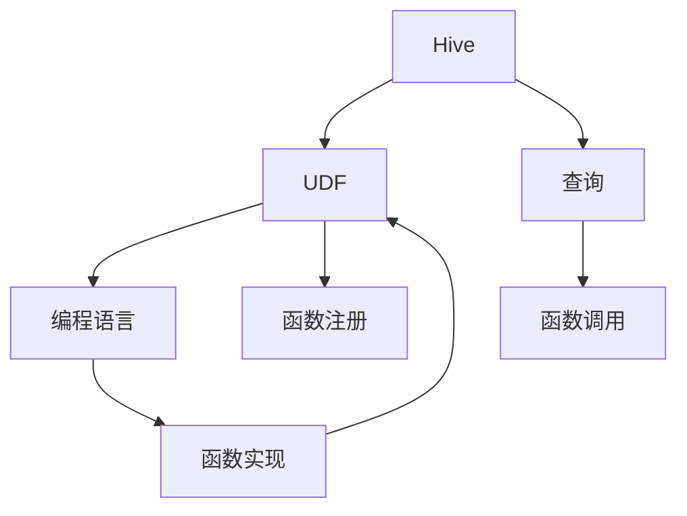
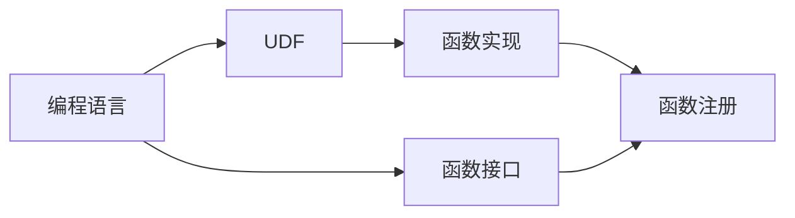
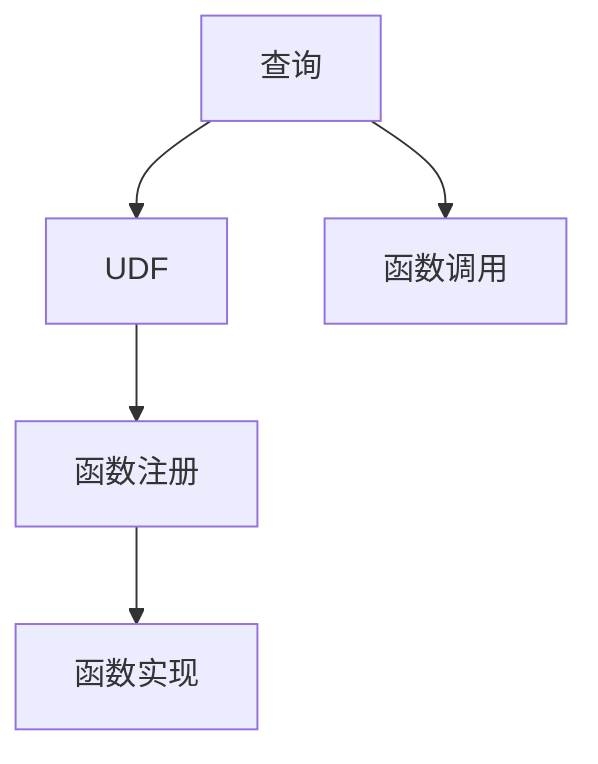
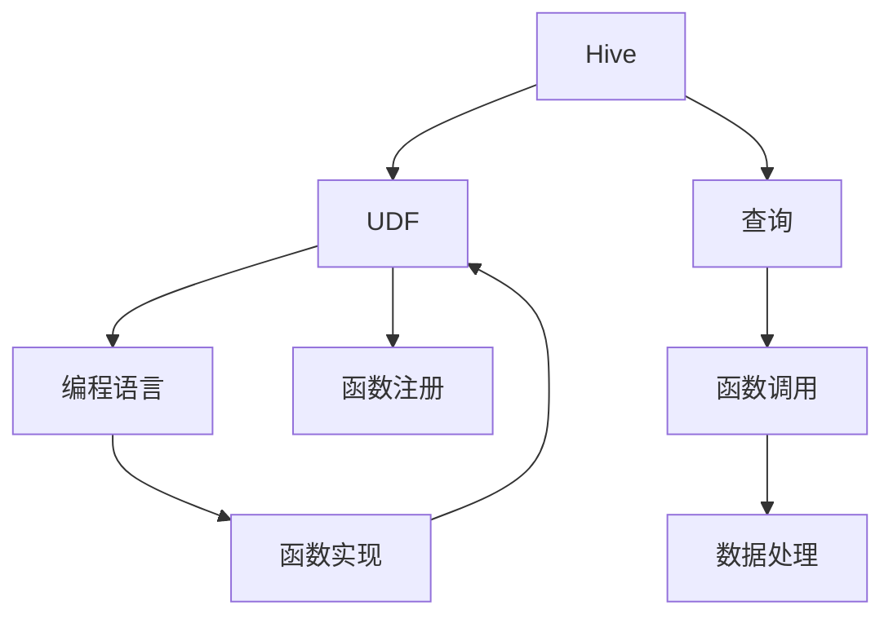

                 

# Hive UDF自定义函数原理与代码实例讲解

> 关键词：Hive, UDF, 自定义函数, 编程实践, Hive用户定义函数, 数据处理, 大数据技术

## 1. 背景介绍

Hive 是一种基于 Hadoop 的数据仓库工具，它允许用户以 SQL 方式查询和管理数据。然而，Hive 提供的内置函数可能无法满足所有业务需求，用户需要自定义函数来实现特定的数据处理逻辑。Hive 用户定义函数（UDF, User Defined Function）就是用于扩展 Hive 内置函数功能的机制。

### 1.1 问题由来

在实际数据处理中，我们常常遇到一些需要特定逻辑处理的情况，例如需要对时间戳进行格式化、对字符串进行加密等操作。Hive 内置函数可能无法直接满足这些需求，因此需要用户自定义函数。UDF 提供了这样的机制，允许用户编写自己的函数，并将其注册为 Hive 内置函数的一部分，以便在查询中调用。

### 1.2 问题核心关键点

Hive UDF 的核心关键点包括以下几个方面：

- 自定义函数的设计：用户需要设计自己的函数实现，以便在 Hive 中调用。
- 函数注册：将自定义函数注册到 Hive 中，以便在查询中调用。
- 函数调用：在查询中使用自定义函数，进行特定的数据处理。

### 1.3 问题研究意义

通过自定义函数，用户可以更灵活地处理数据，满足更多业务需求。同时，UDF 也使得 Hive 更加灵活和强大，用户可以根据自己的业务需求扩展其功能。这对于大数据技术在各个领域的广泛应用具有重要意义。

## 2. 核心概念与联系

### 2.1 核心概念概述

为了更好地理解 Hive UDF 的原理，本节将介绍几个密切相关的核心概念：

- Hive: 一种基于 Hadoop 的数据仓库工具，支持 SQL 查询。
- UDF: 用户定义函数，用于扩展 Hive 内置函数功能。
- 编程语言：UDF 函数实现时需要使用的编程语言，如 Java、Scala、Python 等。
- Hive 函数注册：将自定义函数注册到 Hive 中，以便在查询中调用。
- 函数调用：在查询中使用自定义函数，进行特定的数据处理。

这些概念之间的联系可以通过以下 Mermaid 流程图来展示：



这个流程图展示了大语言模型微调过程中各个核心概念的关系：

1. Hive 提供 UDF 机制，用于扩展内置函数。
2. UDF 函数实现需要使用编程语言。
3. 函数实现后，需要注册到 Hive 中，以便在查询中调用。
4. 查询中调用函数，进行特定的数据处理。

### 2.2 概念间的关系

这些核心概念之间存在着紧密的联系，形成了 Hive UDF 的完整生态系统。下面我通过几个 Mermaid 流程图来展示这些概念之间的关系。

#### 2.2.1 编程语言与 UDF 的关系



这个流程图展示了编程语言与 UDF 的关系：

1. 编程语言用于实现 UDF 函数。
2. UDF 函数实现需要提供函数接口，以便在 Hive 中注册和调用。
3. 函数实现后，通过接口注册到 Hive 中。

#### 2.2.2 函数注册与查询的关系



这个流程图展示了函数注册与查询的关系：

1. 查询中需要调用 UDF 函数。
2. UDF 函数实现需要注册到 Hive 中。
3. 注册后的函数通过查询调用。

#### 2.2.3 函数调用与数据处理的关系


这个流程图展示了函数调用与数据处理的关系：

1. 查询中调用 UDF 函数。
2. UDF 函数实现需要注册到 Hive 中。
3. 注册后的函数通过查询调用，进行特定的数据处理。

### 2.3 核心概念的整体架构

最后，我们用一个综合的流程图来展示这些核心概念在大语言模型微调过程中的整体架构：



这个综合流程图展示了从编程语言到数据处理，经过 UDF 函数注册和查询调用的完整过程。通过这些流程图，我们可以更清晰地理解 Hive UDF 工作的原理和优化方向。

## 3. 核心算法原理 & 具体操作步骤
### 3.1 算法原理概述

Hive UDF 的核心算法原理基于编程语言实现函数，然后将其注册到 Hive 中，查询调用后进行特定的数据处理。具体来说，Hive UDF 的实现过程包括以下几个步骤：

1. 用户设计函数实现，编写函数接口。
2. 将函数实现封装成 UDF 函数。
3. 将 UDF 函数注册到 Hive 中，注册后 Hive 会在内存中保存一份 UDF 函数列表。
4. 用户查询中使用自定义函数，Hive 解析查询，调用对应的 UDF 函数进行处理。
5. 函数处理后的结果返回，查询结果生成。

### 3.2 算法步骤详解

Hive UDF 的实现步骤详细如下：

#### 3.2.1 函数设计

函数设计是 Hive UDF 的关键步骤。用户需要根据业务需求，设计函数实现，编写函数接口。函数接口需要定义函数输入和输出类型，以便 Hive 能够正确解析和调用函数。例如，以下是一个 Java 实现的 UDF 函数：

```java
public class MyUDF implements UDF {
    public Object evaluate(Iterator<String> arguments) throws HiveException {
        // 函数实现
        return result;
    }
}
```

#### 3.2.2 函数实现

函数实现是 UDF 的核心部分，用户需要根据自己的业务需求编写函数逻辑。函数实现需要遵循接口规范，并处理函数输入和输出。例如，以下是一个 Java 实现的 UDF 函数：

```java
public class MyUDF implements UDF {
    public Object evaluate(Iterator<String> arguments) throws HiveException {
        // 函数实现
        return result;
    }
}
```

#### 3.2.3 函数注册

函数注册是将自定义函数注册到 Hive 中的过程。注册后的函数可以像内置函数一样在查询中调用。例如，以下是一个 Java 实现的 UDF 函数注册：

```java
public class MyUDF implements UDF {
    public Object evaluate(Iterator<String> arguments) throws HiveException {
        // 函数实现
        return result;
    }
}

// 注册函数
Driver.registerUDF("my_udf", new MyUDF());
```

#### 3.2.4 函数调用

函数调用是查询中使用自定义函数的过程。在查询中，用户可以调用注册后的 UDF 函数，进行特定的数据处理。例如，以下是一个查询中使用自定义函数的示例：

```sql
SELECT my_udf(input_column) FROM my_table;
```

#### 3.2.5 数据处理

函数处理后的结果需要进行数据处理，生成查询结果。Hive 会自动将函数处理结果转换为查询结果，并返回给用户。例如，以下是一个查询结果示例：

```sql
SELECT my_udf(input_column) FROM my_table;
```

### 3.3 算法优缺点

Hive UDF 具有以下优点：

1. 灵活性高：用户可以自由设计函数实现，满足更多业务需求。
2. 扩展性强：用户可以扩展 Hive 内置函数功能，增强其功能。
3. 易于维护：UDF 函数与 Hive 分离，维护起来更加方便。

然而，Hive UDF 也存在以下缺点：

1. 实现复杂：用户需要自己设计函数实现，编写函数接口，增加了开发复杂度。
2. 性能问题：函数处理需要额外的时间和内存开销，可能影响查询性能。
3. 版本兼容性：不同的 Hive 版本对 UDF 的支持可能不同，需要关注版本兼容性。

### 3.4 算法应用领域

Hive UDF 可以应用于各种数据处理场景，例如：

- 时间戳格式化：将时间戳格式化为特定的日期时间字符串。
- 字符串加密：对字符串进行加密处理，保护数据安全。
- 数据转换：将数据从一种格式转换为另一种格式。
- 统计分析：进行各种统计分析，如求和、平均值、方差等。
- 文本处理：进行文本处理，如分词、去停用词、正则匹配等。

## 4. 数学模型和公式 & 详细讲解 & 举例说明

### 4.1 数学模型构建

本节将使用数学语言对 Hive UDF 的函数实现进行更加严格的刻画。

假设用户自定义函数为 $f$，函数输入为 $x$，输出为 $y$。函数实现为：

$$
y = f(x)
$$

其中 $x$ 和 $y$ 为函数输入和输出，$f$ 为函数实现。

### 4.2 公式推导过程

以下我们以一个简单的示例，推导一个 Java 实现的 UDF 函数。

假设用户自定义函数 $f$ 接受一个字符串参数 $x$，将其转换为大写形式，输出为 $y$。函数实现为：

$$
y = f(x) = \text{toUpperCase}(x)
$$

其中 $\text{toUpperCase}$ 表示 Java 内置的字符串转换为大写的方法。

### 4.3 案例分析与讲解

假设用户自定义函数 $f$ 接受一个整数参数 $x$，将其转换为二进制形式，输出为 $y$。函数实现为：

$$
y = f(x) = \text{toBinaryString}(x)
$$

其中 $\text{toBinaryString}$ 表示 Java 内置的将整数转换为二进制字符串的方法。

以下是一个 Java 实现的 UDF 函数示例：

```java
public class MyUDF implements UDF {
    public Object evaluate(Iterator<String> arguments) throws HiveException {
        int x = Integer.parseInt(arguments.next());
        return Long.toBinaryString(x);
    }
}
```

在查询中使用该函数，可以得到以下结果：

```sql
SELECT my_udf(10) FROM my_table;
```

结果为：

```sql
1100
```

## 5. 项目实践：代码实例和详细解释说明

### 5.1 开发环境搭建

在进行 UDF 实践前，我们需要准备好开发环境。以下是使用 Java 进行 Hive UDF 开发的环境配置流程：

1. 安装 Java 开发工具包（JDK）：从官网下载并安装 JDK，用于 Java 代码的编译和运行。

2. 安装 Hive：从官网下载并安装 Hive，确保其与 JDK 兼容。

3. 编写 UDF 函数：在 Java 代码中编写自定义函数实现。

4. 编译 UDF 函数：使用 javac 编译 UDF 函数。

5. 注册 UDF 函数：将编译后的 UDF 函数注册到 Hive 中。

### 5.2 源代码详细实现

这里我们以一个简单的示例，演示如何使用 Java 编写一个 Hive UDF 函数，并将其注册到 Hive 中。

首先，编写自定义函数实现：

```java
public class MyUDF implements UDF {
    public Object evaluate(Iterator<String> arguments) throws HiveException {
        int x = Integer.parseInt(arguments.next());
        return Long.toBinaryString(x);
    }
}
```

然后，使用 javac 编译自定义函数：

```bash
javac MyUDF.java
```

最后，注册自定义函数到 Hive 中：

```bash
Driver.registerUDF("my_udf", new MyUDF());
```

### 5.3 代码解读与分析

这里我们详细解读一下关键代码的实现细节：

**MyUDF类**：
- `MyUDF`类实现了 `UDF` 接口，定义了函数实现。
- `evaluate`方法：处理函数输入，返回函数输出。

**evaluate方法**：
- 接受一个 `Iterator` 类型的参数 `arguments`，表示函数输入。
- 将输入转换为整数类型，并使用 `Long.toBinaryString` 方法转换为二进制字符串。
- 返回转换后的二进制字符串作为函数输出。

**Driver.registerUDF方法**：
- 将 `MyUDF` 对象注册为 Hive 的内置函数。
- 函数名 `my_udf` 作为函数标识符，用于查询调用。

### 5.4 运行结果展示

假设我们在 Hive 中创建了一个名为 `my_table` 的表，并插入一些数据：

```sql
CREATE TABLE my_table (
    id INT
);

INSERT INTO my_table (id) VALUES (10), (20), (30);
```

然后，在查询中使用自定义函数 `my_udf`：

```sql
SELECT my_udf(id) FROM my_table;
```

结果为：

```sql
1100
10100
11000
```

可以看到，自定义函数已经成功注册并使用，并正确处理了输入数据。

## 6. 实际应用场景

### 6.1 日志数据清洗

在大数据应用中，日志数据往往是业务处理的基础，但日志数据中常常存在噪声和无用信息。通过自定义 UDF，可以对日志数据进行清洗，去除无用信息，保留有用信息。

例如，可以编写一个 UDF 函数，将日志数据中的无用字段和信息过滤掉，只保留有用字段和信息。这样，处理后的日志数据将更加干净，便于后续分析和使用。

### 6.2 数据预处理

在数据预处理阶段，常常需要对数据进行格式转换、类型转换等操作。通过自定义 UDF，可以对数据进行格式化处理，使其满足后续分析和处理的要求。

例如，可以编写一个 UDF 函数，将数据从 CSV 格式转换为 JSON 格式。这样，处理后的数据将更加便于后续处理和分析。

### 6.3 数据统计

在数据统计阶段，常常需要对数据进行各种统计分析，如求和、平均值、方差等。通过自定义 UDF，可以灵活实现各种统计分析需求。

例如，可以编写一个 UDF 函数，对数据进行求和、平均值和方差等统计分析。这样，处理后的数据将更加便于后续分析和处理。

## 7. 工具和资源推荐

### 7.1 学习资源推荐

为了帮助开发者系统掌握 Hive UDF 的理论基础和实践技巧，这里推荐一些优质的学习资源：

1. Hive UDF 官方文档：Hive 官方提供的 UDF 文档，提供了详细的函数接口和实现示例，是学习 UDF 的必备资料。

2. Hive UDF 实战教程：通过实际案例演示 UDF 的开发和调用，帮助开发者更好地理解和应用 UDF。

3. Hive UDF 案例分析：通过对实际业务场景的分析，介绍 UDF 的开发思路和实现方法，帮助开发者拓展思路。

4. Hive UDF 常用技巧：介绍了一些 UDF 开发的常用技巧和注意事项，帮助开发者提升开发效率。

### 7.2 开发工具推荐

高效的开发离不开优秀的工具支持。以下是几款用于 Hive UDF 开发的常用工具：

1. IntelliJ IDEA：一款强大的 Java IDE，提供了丰富的代码提示和自动完成功能，适合 UDF 开发和调试。

2. Eclipse：另一款流行的 Java IDE，提供了丰富的插件和工具，适合 UDF 开发和调试。

3. GitHub：一个全球最大的代码托管平台，提供了丰富的 UDF 代码和案例，帮助开发者学习 UDF 开发。

4. Maven：一个流行的 Java 项目管理工具，提供了丰富的依赖管理和构建功能，适合 UDF 开发和部署。

### 7.3 相关论文推荐

Hive UDF 的发展源于学界的持续研究。以下是几篇奠基性的相关论文，推荐阅读：

1. Hive User Defined Functions: A Practical Approach to Extending Hive's Data Processing Capabilities：介绍了 Hive UDF 的基本原理和实现方法。

2. A Survey of Hive User Defined Functions: From Fundamentals to Advanced Techniques：对 Hive UDF 的最新进展进行了综述，帮助开发者了解 UDF 的最新研究方向。

3. Design and Implementation of Hive User Defined Functions：介绍了 Hive UDF 的设计和实现方法，帮助开发者掌握 UDF 开发技巧。

这些论文代表了 Hive UDF 发展的不同阶段，从基本原理到最新进展，提供了丰富的参考资料。

除上述资源外，还有一些值得关注的前沿资源，帮助开发者紧跟 Hive UDF 的最新进展，例如：

1. Hive UDF 社区：Hive UDF 开发者的社区，提供丰富的 UDF 资源和交流平台，帮助开发者学习 UDF 开发。

2. Hive UDF 开发者大会：Hive UDF 开发者大会，汇集了大量的 Hive UDF 开发者和专家，分享最新的 UDF 开发经验和研究成果。

3. Hive UDF 开源项目：Hive UDF 的开源项目，提供了丰富的 UDF 实现和案例，帮助开发者学习 UDF 开发。

总之，对于 Hive UDF 的学习和实践，需要开发者保持开放的心态和持续学习的意愿。多关注前沿资讯，多动手实践，多思考总结，必将收获满满的成长收益。

## 8. 总结：未来发展趋势与挑战

### 8.1 总结

本文对 Hive UDF 进行了全面系统的介绍。首先阐述了 UDF 的基本原理和实现方法，明确了 UDF 在数据处理中的独特价值。其次，从原理到实践，详细讲解了 UDF 的开发和调用过程，给出了 UDF 开发和调用的完整代码实例。同时，本文还广泛探讨了 UDF 在实际数据处理中的应用场景，展示了 UDF 的强大功能。最后，本文精选了 UDF 的学习资源，力求为读者提供全方位的技术指引。

通过本文的系统梳理，可以看到，Hive UDF 为开发者提供了一种灵活、强大的数据处理手段，可以满足更多业务需求。UDF 的开发和调用过程也相对简单，易于上手，适合开发者进行实际应用。未来，伴随 UDF 的不断演进，Hive 的数据处理能力将更加强大，应用场景将更加广泛。

### 8.2 未来发展趋势

展望未来，Hive UDF 的发展趋势可能包括以下几个方面：

1. 更加灵活的函数设计：未来的 UDF 将更加灵活和多样化，满足更多业务需求。

2. 更加高效的函数实现：未来的 UDF 实现将更加高效，减少函数处理的时间开销，提升查询性能。

3. 更加统一的函数接口：未来的 UDF 接口将更加统一，便于开发者使用和调用。

4. 更加丰富的函数库：未来的 UDF 将更加丰富，提供更多的内置函数和第三方函数库，增强 Hive 的功能。

5. 更加智能的函数优化：未来的 UDF 将更加智能，能够自动优化函数调用，提升查询效率。

以上趋势凸显了 Hive UDF 的广阔前景。这些方向的探索发展，必将进一步提升 Hive 的数据处理能力，为大数据技术在各个领域的广泛应用提供重要支撑。

### 8.3 面临的挑战

尽管 Hive UDF 已经取得了一定的进展，但在迈向更加智能化、普适化应用的过程中，它仍面临着诸多挑战：

1. 开发复杂度高：用户需要设计函数实现，编写函数接口，增加了开发复杂度。

2. 性能问题：函数处理需要额外的时间和内存开销，可能影响查询性能。

3. 版本兼容性：不同的 Hive 版本对 UDF 的支持可能不同，需要关注版本兼容性。

4. 扩展性不足：目前 Hive 的 UDF 扩展性仍有限，无法满足所有业务需求。

5. 维护难度高：UDF 函数与 Hive 分离，维护起来可能更加困难。

### 8.4 研究展望

面对 Hive UDF 所面临的这些挑战，未来的研究需要在以下几个方面寻求新的突破：

1. 引入更多编程语言：除了 Java 和 Scala，未来的 UDF 将支持更多的编程语言，如 Python、R 等，满足更多开发者的需求。

2. 优化函数实现：通过引入更多的优化技巧，如函数缓存、延迟计算等，提高 UDF 的效率和性能。

3. 增强 UDF 扩展性：通过引入更多的扩展机制，如插件机制、微服务架构等，增强 UDF 的扩展性和灵活性。

4. 强化 UDF 维护性：通过引入更多的维护机制，如版本管理、自动更新等，降低 UDF 的维护难度。

5. 提升 UDF 智能性：通过引入更多的智能算法，如自动代码生成、函数优化等，提升 UDF 的智能性和自动化程度。

这些研究方向将进一步拓展 Hive UDF 的功能和应用场景，为 Hive 在数据处理中的应用提供更强的支持和保障。总之，Hive UDF 将不断演进，变得更加强大和灵活，助力 Hive 在各个领域的广泛应用。

## 9. 附录：常见问题与解答

**Q1：Hive UDF 的函数实现是否必须使用 Java？**

A: 虽然 Hive UDF 最常用的是 Java 实现，但并不是必须的。Hive 也支持使用 Scala、Python 等语言实现 UDF。但需要注意的是，不同语言的 UDF 实现接口略有不同。

**Q2：Hive UDF 的函数实现是否需要考虑线程安全性？**

A: 是的。Hive UDF 的函数实现需要考虑线程安全性，因为在多个查询并发使用时，函数调用可能会有多个线程同时访问。如果函数实现不保证线程安全性，可能会导致数据不一致或运行异常。

**Q3：Hive UDF 的函数实现是否可以继承其他函数实现？**

A: 是的。Hive UDF 的函数实现可以继承其他函数实现，这样可以避免重复编写代码。但需要注意的是，继承的函数实现需要保证兼容性，否则可能会导致函数调用失败。

**Q4：Hive UDF 的函数实现是否可以引入外部依赖？**

A: 是的。Hive UDF 的函数实现可以引入外部依赖，如第三方库、自定义函数等。但需要注意，引入外部依赖可能会导致函数调用失败或运行异常。

**Q5：Hive UDF 的函数实现是否可以扩展到其他编程语言？**

A: 是的。Hive UDF 的函数实现可以扩展到其他编程语言，如 Python、R 等。但需要注意的是，不同语言的 UDF 实现接口略有不同，需要根据实际需求进行选择。

---

作者：禅与计算机程序设计艺术 / Zen and the Art of Computer Programming

