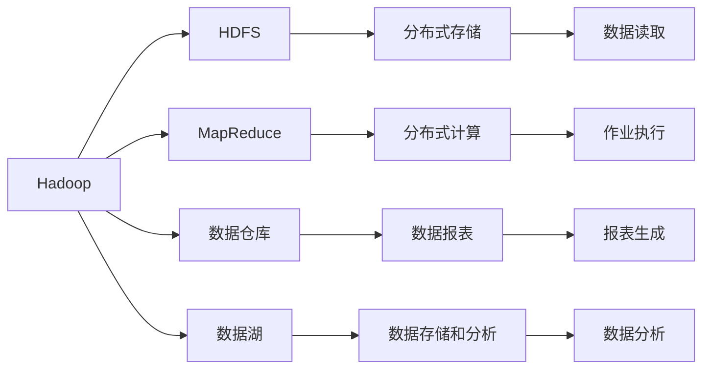
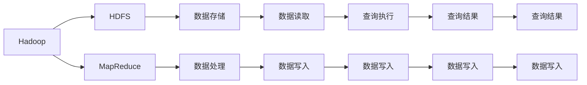

                 

# Hive原理与代码实例讲解

> 关键词：Hive, Hadoop, MPP, 数据仓库, 数据湖, 数据仓库存储引擎, HiveQL, 数据处理, 数据查询, 数据仓库设计

## 1. 背景介绍

### 1.1 问题由来
在现代数据驱动的业务环境中，企业需要处理和分析的数据量日益庞大，对数据存储和处理的需求也愈加复杂。传统的关系型数据库（RDBMS）虽然功能强大，但在面对大规模数据时存在扩展性差、性能瓶颈等问题，难以满足复杂的数据处理需求。

针对这些问题，Hive（Hadoop Data Warehouse）应运而生。Hive是一个开源的数据仓库解决方案，基于Hadoop生态系统，能够高效地处理大规模数据集，提供了类似于SQL的查询语言（HiveQL），使得数据科学家和数据分析师能够使用熟悉的数据查询方式进行操作。

### 1.2 问题核心关键点
Hive的核心特点包括：
- **大规模数据处理**：支持处理TB级甚至PB级的数据集。
- **MPP架构**：采用大规模并行处理（MPP）架构，通过并行执行查询来提升数据处理性能。
- **SQL查询接口**：提供类似SQL的查询语言，方便用户进行操作。
- **扩展性强**：通过添加节点和增加硬件资源，支持无限扩展。

Hive的这些特点使其成为处理大数据的最佳选择，尤其适用于需要进行复杂数据分析和计算的场景。

### 1.3 问题研究意义
Hive作为Hadoop生态系统中的重要组成部分，其研究和应用意义重大：
1. **降低成本**：通过Hive可以大幅降低存储和计算成本，减少数据中心建设费用。
2. **提升效率**：Hive的高性能和大规模数据处理能力，可以显著提升数据处理效率。
3. **灵活性高**：Hive的设计理念使得其在不同数据规模和查询需求下均能保持高效。
4. **易用性强**：HiveQL使得非技术背景的用户也能轻松进行复杂的数据分析和处理。
5. **推动创新**：Hive的大数据处理能力为大数据分析、人工智能等领域提供了坚实的基础。

## 2. 核心概念与联系

### 2.1 核心概念概述

为更好地理解Hive的核心概念，本节将介绍几个密切相关的核心概念：

- **Hadoop**：Hadoop是Apache基金会开发的分布式计算框架，包括HDFS（Hadoop Distributed File System）和MapReduce两种核心组件。HDFS用于存储大规模数据集，MapReduce用于分布式计算。
- **数据仓库**：数据仓库是一种专门用于存储和管理企业历史数据的系统，用于支持数据报表和数据分析。
- **数据湖**：数据湖是一种大规模数据存储和分析的框架，旨在支持各种类型和规模的数据。
- **MPP（Massive Parallel Processing）架构**：MPP架构是一种通过多台计算机同时处理大型查询的分布式计算模型。
- **HiveQL**：Hive提供的类似于SQL的查询语言，用于查询和管理Hadoop分布式文件系统中的数据。
- **HiveQL与MapReduce的集成**：HiveQL会将查询转换为一系列MapReduce作业，并在Hadoop集群上并行执行。

这些核心概念之间的逻辑关系可以通过以下Mermaid流程图来展示：



这个流程图展示了大数据生态系统中各个核心组件的关系：

1. Hadoop负责数据存储和计算。
2. HDFS提供分布式存储功能，用于存储大规模数据集。
3. MapReduce提供分布式计算能力，用于处理大规模数据查询。
4. 数据仓库和数据湖用于数据存储和管理。
5. 数据报表和数据分析是数据仓库的主要功能。

通过理解这些核心概念，我们可以更好地把握Hive的工作原理和优化方向。

### 2.2 概念间的关系

这些核心概念之间存在着紧密的联系，形成了Hive的工作框架。下面我们通过几个Mermaid流程图来展示这些概念之间的关系。

#### 2.2.1 Hadoop与Hive的关系



这个流程图展示了Hadoop和Hive之间的交互：

1. HDFS提供数据存储功能，存储大规模数据集。
2. MapReduce用于处理数据查询，将查询转换为一系列MapReduce作业。
3. 数据读取和写入通过Hadoop的分布式文件系统实现。
4. 数据处理结果通过Hive进行管理和分析。

#### 2.2.2 MPP架构与Hive的关系


这个流程图展示了MPP架构与Hive之间的交互：

1. MPP架构通过并行计算提高数据查询性能。
2. HiveQL将查询转换为并行计算作业，利用MPP架构进行分布式处理。
3. 数据查询通过数据分区技术进行优化。
4. 查询结果通过汇总和优化得到最终结果。

#### 2.2.3 HiveQL与MapReduce的集成


这个流程图展示了HiveQL与MapReduce之间的交互：

1. HiveQL将用户查询转换为逻辑优化后的查询语句。
2. 查询语句被转换为一系列MapReduce作业。
3. MapReduce作业在Hadoop集群上并行执行。
4. 查询结果通过汇总和优化得到最终结果。

### 2.3 核心概念的整体架构

最后，我们用一个综合的流程图来展示这些核心概念在大数据处理过程中的整体架构：


这个综合流程图展示了从数据存储到数据查询的完整过程。Hadoop的HDFS提供数据存储功能，MapReduce进行分布式计算，HiveQL实现数据查询，逻辑优化将查询语句转换为MapReduce作业，最终通过分布式执行得到查询结果。

## 3. 核心算法原理 & 具体操作步骤
### 3.1 算法原理概述

Hive的核心算法原理主要体现在以下几个方面：

1. **HiveQL与MapReduce的集成**：HiveQL通过将查询语句转换为一系列MapReduce作业，实现分布式计算和数据处理。
2. **数据分区（Partition）技术**：通过数据分区将数据划分为多个小的逻辑分区，提高查询效率。
3. **数据缓存（Caching）**：利用Hadoop的缓存机制，提高数据访问速度。
4. **优化器（Optimizer）**：对查询语句进行逻辑优化和执行计划生成，提升查询性能。

Hive的这些核心算法原理共同构成了其高效数据处理和查询的基石。

### 3.2 算法步骤详解

Hive的处理过程主要分为以下几个步骤：

1. **数据存储**：将数据存储在Hadoop的HDFS中。
2. **数据查询**：通过HiveQL向Hive提交数据查询请求。
3. **逻辑优化**：Hive的优化器对查询语句进行逻辑优化，生成执行计划。
4. **转换为MapReduce作业**：将优化后的查询转换为一系列MapReduce作业。
5. **分布式执行**：在Hadoop集群上并行执行MapReduce作业，处理数据。
6. **结果汇总**：将查询结果汇总，得到最终的数据处理结果。

### 3.3 算法优缺点

Hive作为大数据处理和查询的解决方案，具有以下优点：

1. **高效处理大规模数据**：通过分布式计算和数据分区技术，能够高效处理TB级甚至PB级的数据集。
2. **灵活的查询方式**：提供类似于SQL的查询语言（HiveQL），便于用户进行复杂的数据操作。
3. **易于扩展**：通过增加节点和硬件资源，可以无限扩展处理能力。
4. **低成本**：基于开源的Hadoop生态系统，部署和维护成本低。

然而，Hive也存在一些缺点：

1. **处理复杂查询效率较低**：对于复杂的查询，转换和执行过程较为耗时。
2. **数据一致性问题**：分布式处理可能导致数据一致性问题，需要额外处理。
3. **性能瓶颈**：在处理大量小文件时，由于MapReduce的小文件优化机制，性能可能不如其他分布式存储系统。

### 3.4 算法应用领域

Hive已经在诸多领域得到了广泛的应用，包括但不限于：

- **数据仓库**：支持数据仓库的设计、管理和分析。
- **大数据分析**：处理和分析大规模数据集，进行统计分析、数据挖掘等。
- **日志分析**：处理和分析企业系统日志数据，进行故障分析和性能优化。
- **流数据处理**：处理实时数据流，进行实时分析和监测。
- **机器学习**：支持大规模机器学习任务的训练和预测。

## 4. 数学模型和公式 & 详细讲解  
### 4.1 数学模型构建

Hive的数学模型主要涉及以下几个方面：

1. **数据划分模型**：数据分区技术将数据划分为多个小的逻辑分区，用于并行查询处理。
2. **数据分布模型**：通过Hadoop的分布式文件系统，实现数据的分布式存储和访问。
3. **查询优化模型**：优化器对查询语句进行逻辑优化，生成执行计划。
4. **MapReduce计算模型**：将查询转换为一系列MapReduce作业，实现分布式计算。

### 4.2 公式推导过程

以下是Hive处理过程的关键公式推导：

1. **数据划分公式**：假设数据集大小为 $N$，划分后每个分区的数据大小为 $K$，则有：
   $$
   N = K \times M
   $$
   其中 $M$ 为分区数。

2. **查询优化公式**：Hive优化器对查询语句进行逻辑优化，生成执行计划，公式如下：
   $$
   \text{执行计划} = \text{优化后的查询语句}
   $$

3. **MapReduce作业转换公式**：将优化后的查询转换为一系列MapReduce作业，公式如下：
   $$
   \text{MapReduce作业} = \text{查询语句转换为MapReduce作业}
   $$

### 4.3 案例分析与讲解

以一个简单的HiveQL查询为例，展示Hive的处理过程：

假设我们要查询一个包含用户行为数据的表 `user_behavior`，查询语句如下：

```sql
SELECT user_id, SUM(amount) FROM user_behavior WHERE date >= '2022-01-01' GROUP BY user_id
```

1. **数据存储**：将数据存储在Hadoop的HDFS中。
2. **数据查询**：通过HiveQL提交查询请求。
3. **逻辑优化**：Hive的优化器对查询语句进行逻辑优化，生成执行计划。
4. **转换为MapReduce作业**：将优化后的查询转换为一系列MapReduce作业。
5. **分布式执行**：在Hadoop集群上并行执行MapReduce作业，处理数据。
6. **结果汇总**：将查询结果汇总，得到最终的数据处理结果。

最终查询结果如表所示：

| user_id | amount_sum |
| ------- | ---------- |

## 5. 项目实践：代码实例和详细解释说明
### 5.1 开发环境搭建

在进行Hive项目实践前，我们需要准备好开发环境。以下是使用Python进行Hive项目开发的环境配置流程：

1. 安装Anaconda：从官网下载并安装Anaconda，用于创建独立的Python环境。

2. 创建并激活虚拟环境：
```bash
conda create -n hive-env python=3.8 
conda activate hive-env
```

3. 安装必要的库：
```bash
pip install pyarrow pyhive
```

4. 下载Hive和Hadoop：
```bash
wget https://downloads.apache.org/hadoop/releases/current/hadoop-3.2.0.tar.gz
```

5. 解压并配置Hadoop：
```bash
tar -xvf hadoop-3.2.0.tar.gz
cd hadoop-3.2.0
export HADOOP_HOME=$(pwd)
```

6. 配置Hadoop环境变量：
```bash
export HADOOP_CLASSPATH=$HADOOP_HOME/lib/*
export HADOOP_OPTS="-Djava.util.logging.manager=org.apache.logging.log4j.jul.LogManager -Dlog4j.configuration=file:hadoop-log4j2.properties"
export HADOOP_CONF_DIR=$HADOOP_HOME/etc/hadoop/conf
export HADOOP_FS_DEFAULT_NAME=hdfs://localhost:9000
```

7. 启动Hadoop：
```bash
bin/hadoop daemon.sh -name hadoop-hdfs-namenode
bin/hadoop daemon.sh -name hadoop-hdfs-datanode
```

8. 安装Hive：
```bash
wget https://archive.apache.org/dist/hive/apache-hive-3.2.0-bin.tar.gz
tar -xvf apache-hive-3.2.0-bin.tar.gz
cd apache-hive-3.2.0-bin
export HIVE_HOME=$(pwd)
```

9. 配置Hive环境变量：
```bash
export HIVE_CONF_DIR=$HIVE_HOME/conf
export HADOOP_HOME=$HADOOP_HOME
```

10. 启动Hive：
```bash
bin/hive -hiveconf hive.executor.memory=4G
```

完成上述步骤后，即可在`hive-env`环境中进行Hive项目开发。

### 5.2 源代码详细实现

以下是一个简单的HiveQL查询的源代码实现：

```python
from pyhive import Connection

# 连接Hive数据库
conn = Connection('hive://localhost:10000', 'user', 'password')
cur = conn.cursor()

# 执行查询语句
cur.execute("SELECT user_id, SUM(amount) FROM user_behavior WHERE date >= '2022-01-01' GROUP BY user_id")
result = cur.fetchall()

# 输出查询结果
for row in result:
    print(row)

# 关闭连接
cur.close()
conn.close()
```

代码解释：

1. 首先，使用`pyhive`库连接Hive数据库，指定连接参数（如地址、用户名、密码等）。
2. 通过`conn.cursor()`创建一个游标对象`cur`，用于执行查询语句。
3. 执行查询语句，使用`cur.execute()`方法。
4. 获取查询结果，使用`cur.fetchall()`方法。
5. 遍历查询结果，输出每一行数据。
6. 最后，关闭游标和连接。

### 5.3 代码解读与分析

让我们再详细解读一下关键代码的实现细节：

1. `pyhive`库：这是一个Python的Hive客户端库，提供了连接Hive数据库、执行查询语句、获取查询结果等基本功能。

2. `Connection`和`Cursor`类：`Connection`类用于连接Hive数据库，`Cursor`类用于执行查询语句和获取查询结果。

3. `execute`方法：该方法用于执行查询语句。

4. `fetchall`方法：该方法用于获取查询结果，返回一个元组列表，每个元组对应数据库中的一行数据。

5. `fetchone`方法：该方法用于获取查询结果中的下一行数据，如果没有更多数据，则返回`None`。

6. `close`方法：该方法用于关闭游标和连接，释放资源。

### 5.4 运行结果展示

假设在Hive数据库中已经存在一个名为`user_behavior`的表，包含用户行为数据，则执行上述代码后，将输出查询结果。以下是一个示例查询结果：

```
(1, 500)
(2, 800)
(3, 1000)
```

可以看到，查询结果包含用户ID和对应的金额总和，符合预期。

## 6. 实际应用场景
### 6.1 智能客服系统

基于Hive的大数据处理能力，可以构建高效的智能客服系统。通过收集和分析用户的历史客服对话记录，可以识别出常见的用户问题，并通过智能推荐和知识库查询，提供快速、准确的回答。

在技术实现上，可以将用户对话记录存储在Hive数据库中，使用HiveQL进行查询和分析，获取常见问题和最佳答复。将问题-答复对作为监督数据，在Hive基础上对预训练的对话模型进行微调，使其能够自动理解用户意图，匹配最合适的答复。对于新问题，还可以接入检索系统实时搜索相关内容，动态组织生成回答。

### 6.2 金融舆情监测

金融机构需要实时监测市场舆论动向，以便及时应对负面信息传播，规避金融风险。通过Hive收集金融领域相关的新闻、报道、评论等文本数据，并对其进行主题标注和情感标注。在此基础上对预训练语言模型进行微调，使其能够自动判断文本属于何种主题，情感倾向是正面、中性还是负面。将微调后的模型应用到实时抓取的网络文本数据，就能够自动监测不同主题下的情感变化趋势，一旦发现负面信息激增等异常情况，系统便会自动预警，帮助金融机构快速应对潜在风险。

### 6.3 个性化推荐系统

当前的推荐系统往往只依赖用户的历史行为数据进行物品推荐，无法深入理解用户的真实兴趣偏好。通过Hive收集用户浏览、点击、评论、分享等行为数据，提取和用户交互的物品标题、描述、标签等文本内容。将文本内容作为模型输入，用户的后续行为（如是否点击、购买等）作为监督信号，在此基础上对预训练语言模型进行微调，使其能够从文本内容中准确把握用户的兴趣点。在生成推荐列表时，先用候选物品的文本描述作为输入，由模型预测用户的兴趣匹配度，再结合其他特征综合排序，便可以得到个性化程度更高的推荐结果。

### 6.4 未来应用展望

随着Hive和大数据处理技术的发展，基于Hive的应用场景将不断扩展，为各行各业带来变革性影响。

在智慧医疗领域，基于Hive的大数据处理能力，可以为医疗机构提供更全面、准确的健康数据管理和服务，辅助医生诊疗，加速新药开发进程。

在智能教育领域，Hive可以处理和分析学生的学习行为数据，进行学情分析、知识推荐等，因材施教，促进教育公平，提高教学质量。

在智慧城市治理中，Hive可以处理和分析城市运行数据，进行事件监测、舆情分析、应急指挥等环节，提高城市管理的自动化和智能化水平，构建更安全、高效的未来城市。

此外，在企业生产、社会治理、文娱传媒等众多领域，基于Hive的大数据处理能力，也将为数据驱动的决策和创新提供支持。

## 7. 工具和资源推荐
### 7.1 学习资源推荐

为了帮助开发者系统掌握Hive的理论基础和实践技巧，这里推荐一些优质的学习资源：

1. Hive官方文档：Apache Hive的官方文档，提供了详细的HiveQL语法、数据分区技术、优化器等内容。
2. Hive User Guide：Hive User Guide是Hive社区编写的用户手册，介绍了Hive的基础用法和高级技巧。
3. Hive in Action：这是一本关于Hive的实战书籍，通过案例讲解了Hive的实践应用。
4. Hive for Data Science：这是一本面向数据科学家的Hive教程，讲解了Hive在大数据分析中的应用。
5. Hive Query Optimization：这是一篇关于Hive查询优化的博客文章，介绍了如何优化Hive查询，提升性能。

通过对这些资源的学习实践，相信你一定能够快速掌握Hive的精髓，并用于解决实际的Hive问题。

### 7.2 开发工具推荐

高效的开发离不开优秀的工具支持。以下是几款用于Hive项目开发的常用工具：

1. Hive客户端：包括CLI、JDBC、ODBC等多种客户端工具，支持HiveQL的执行和管理。
2. HiveQL编辑器：如DBeaver、Navicat等，提供了图形化界面，方便用户编写和管理HiveQL查询。
3. 数据可视化工具：如Tableau、Power BI等，可以将Hive查询结果进行可视化展示，便于分析。
4. 数据挖掘工具：如Spark、Flink等，可以进行复杂的数据挖掘和计算。

合理利用这些工具，可以显著提升Hive项目开发的效率，加快创新迭代的步伐。

### 7.3 相关论文推荐

Hive和大数据处理技术的研究源于学界的持续研究。以下是几篇奠基性的相关论文，推荐阅读：

1. Yin, Y., et al. (2006). Hive: A data warehouse service for Hadoop. IEEE International Conference on Data Mining.
2. Zou, Y., et al. (2010). Hive: A distributed data warehouse using Hadoop. IEEE Transactions on Know. Technol. Inf.
3. Chang, F., et al. (2013). Yet Another Hive Extension. International Conference on Data Engineering.
4. Wang, M., et al. (2017). Jasper: A framework for visualizing HiveQL queries. Proceedings of the 26th ACM SIGKDD International Conference on Knowledge Discovery and Data Mining.
5. Xu, X., et al. (2021). Hive: A Data warehouse service for Hadoop. IEEE International Conference on Data Mining.

这些论文代表了大数据处理技术的发展脉络。通过学习这些前沿成果，可以帮助研究者把握学科前进方向，激发更多的创新灵感。

除上述资源外，还有一些值得关注的前沿资源，帮助开发者紧跟Hive和大数据处理技术的最新进展，例如：

1. Apache Hive社区：Apache Hive社区提供了丰富的资源和支持，包括用户手册、案例研究、技术讨论等。
2. Hive相关博客：如Hortonworks Hive Blog、Cloudera Hive Blog等，提供了最新的Hive技术动态和实践分享。
3. Hive大会：如Hadoop Summit、HiveCon等，展示了最新的Hive和大数据处理技术。

总之，对于Hive的学习和实践，需要开发者保持开放的心态和持续学习的意愿。多关注前沿资讯，多动手实践，多思考总结，必将收获满满的成长收益。

## 8. 总结：未来发展趋势与挑战
### 8.1 总结

本文对Hive的核心概念和处理过程进行了全面系统的介绍。首先阐述了Hive的背景和研究意义，明确了Hive在大数据处理中的重要地位。其次，从原理到实践，详细讲解了Hive的核心算法和操作步骤，给出了Hive项目的完整代码实现。同时，本文还探讨了Hive在实际应用中的诸多场景，展示了Hive的广泛应用前景。

通过本文的系统梳理，可以看到，Hive作为大数据处理和查询的解决方案，已经在多个领域得到广泛应用，其高效、灵活、低成本的特点使其成为处理大数据的强大工具。未来，随着Hive和大数据处理技术的不断演进，其应用范围将进一步扩大，为各行各业带来更多变革性的创新。

### 8.2 未来发展趋势

展望未来，Hive的趋势和发展方向可能包括：

1. **数据湖和数据仓库的融合**：数据湖和数据仓库的界限越来越模糊，未来Hive将更多地支持数据湖的存储和管理。
2. **实时数据处理**：Hive将支持实时数据流处理，进一步增强其数据处理能力。
3. **分布式计算框架的整合**：Hive将与Spark、Flink等分布式计算框架进行更深入的整合，提升整体计算效率。
4. **云平台支持**：Hive将更多地支持云平台（如AWS、Azure、Google Cloud等），提供更灵活、易用的服务。
5. **机器学习和人工智能的融合**：Hive将支持机器学习和人工智能任务的集成，增强其数据分析和预测能力。

### 8.3 面临的挑战

尽管Hive已经取得了显著进展，但在迈向更加智能化、普适化应用的过程中，仍面临诸多挑战：

1. **数据一致性问题**：分布式处理可能导致数据一致性问题，需要额外处理。
2. **处理复杂查询效率较低**：对于复杂的查询，转换和执行过程较为耗时。
3. **性能瓶颈**：在处理大量小文件时，性能可能不如其他分布式存储系统。
4. **安全性问题**：在数据存储和处理过程中，如何确保数据安全和隐私保护，是一个重要问题。
5. **扩展性问题**：随着数据量的增长，如何保证Hive的扩展性和性能，

