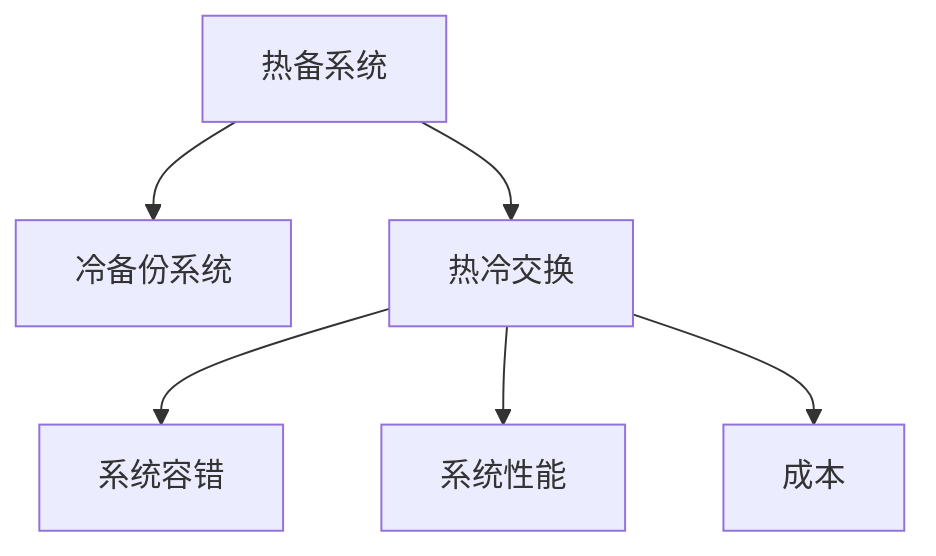
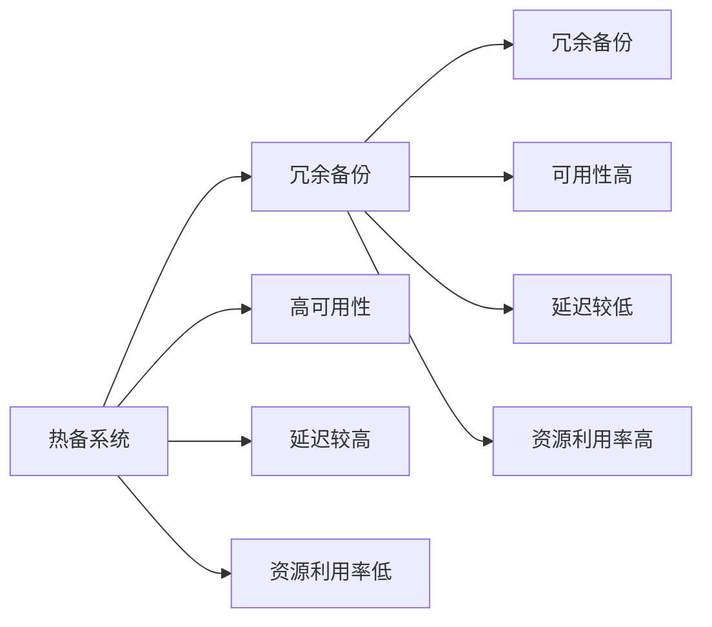
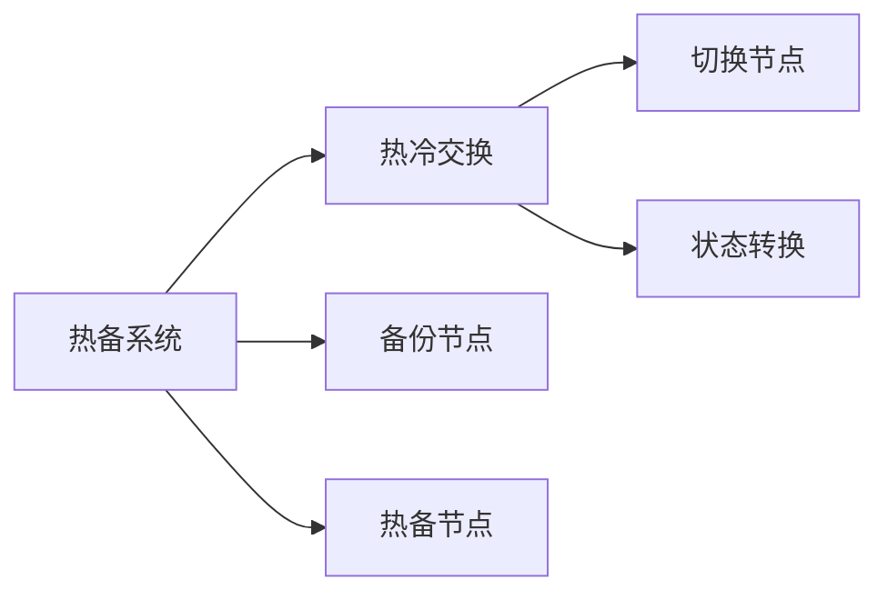
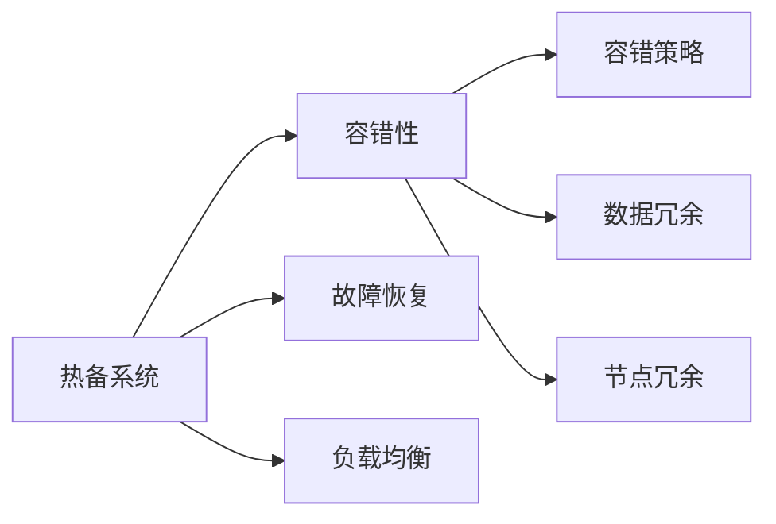

                 

# Hot-Hot与Hot-Warm冗余设计最佳实践

> 关键词：冗余设计, 热备系统, 热冷交换, 容错性, 性能优化

## 1. 背景介绍

### 1.1 问题由来
随着互联网技术的迅猛发展，网络服务的可用性和稳定性要求不断提高。数据中心、云服务提供商等都需要构建高效可靠的系统来保证业务连续性。然而，在高可用性系统设计中，冗余是必不可少的环节。如何合理设计系统冗余，以在保障性能的前提下最大化利用资源，成为一个重要的研究方向。

冗余设计不仅关系到系统的可靠性，还直接影响系统的性能和成本。传统的冗余设计方法如1:1热备系统，虽然可靠，但资源利用率不高。而完全去冗余的冷备份系统，虽然高效，但在主系统故障时可能导致严重的业务中断。如何找到两者之间的平衡点，成为当前冗余设计研究的热点问题。

### 1.2 问题核心关键点
冗余设计涉及多方面的技术细节，包括但不限于：

1. 热备系统（Hot-Standby）和冷备份系统（Cold-Backup）的基本概念和特点。
2. 热备和冷备之间的优缺点比较，以及两者在实际应用中的选择原则。
3. 热冷交换（Hot-Warm Swap）技术的原理和实现方式。
4. 系统容错性的不同实现方式及其实际效果。
5. 系统性能和成本的权衡，如何在两者之间寻找最优解。

## 2. 核心概念与联系

### 2.1 核心概念概述

为更好地理解冗余设计，本节将介绍几个密切相关的核心概念：

- **热备系统（Hot-Standby）**：指在系统中设置两个完全相同的节点，其中一个作为主节点，另一个作为备用节点。当主节点故障时，备用节点自动接管工作，保证业务连续性。
- **冷备份系统（Cold-Backup）**：指主系统运行，备份系统作为旁路观察和记录操作日志，仅在主系统故障时才接管工作。备份系统资源利用率较高，但在故障切换时间较长，业务中断时间较长。
- **热冷交换（Hot-Warm Swap）**：指在系统运行过程中，动态地将备用节点转换为热备节点，或将热备节点转换为备用节点，从而实现对系统状态的灵活调整。
- **容错性（Fault Tolerance）**：指系统在面对故障时，能够继续正常工作的能力。冗余设计通过冗余备份来提高系统的容错性。
- **系统性能（Performance）**：指系统处理请求的速度和效率。冗余设计需要在保证容错性的前提下，尽可能提高系统性能。
- **成本（Cost）**：指冗余设计带来的硬件、软件、运维等方面的投入。冗余设计需要在保证系统性能和容错性的前提下，尽可能降低成本。

这些核心概念之间的逻辑关系可以通过以下Mermaid流程图来展示：



这个流程图展示了几类冗余设计的核心概念及其之间的关系：

1. 热备系统与冷备份系统是冗余设计的基础。
2. 热冷交换技术使得系统能够动态调整状态。
3. 容错性、系统性能和成本是冗余设计需要考虑的主要因素。

### 2.2 概念间的关系

这些核心概念之间存在着紧密的联系，形成了冗余设计的基本框架。下面我通过几个Mermaid流程图来展示这些概念之间的关系。

#### 2.2.1 热备与冷备的对比



这个流程图展示了热备系统与冷备份系统的主要差异：

1. 热备系统通过冗余备份来保证高可用性。
2. 热备系统由于需要实时监控和切换，导致延迟较高。
3. 热备系统资源利用率较低，但可以保证业务的连续性。

#### 2.2.2 热冷交换的实现方式



这个流程图展示了热冷交换的基本实现方式：

1. 通过热冷交换技术，可以将备份节点快速切换到热备节点，或反之。
2. 热冷交换可以动态调整系统状态，适应不同的业务需求。

#### 2.2.3 系统容错性的实现方式



这个流程图展示了系统容错性的实现方式：

1. 通过故障恢复、数据冗余、节点冗余等策略，提升系统的容错性。
2. 容错性是冗余设计的基础，通过合理的容错策略，确保系统在故障时能够继续正常工作。

## 3. 核心算法原理 & 具体操作步骤
### 3.1 算法原理概述

冗余设计的基本原理是通过冗余备份来提升系统的可靠性和容错性。具体而言，冗余设计包括两个主要步骤：

1. 建立冗余备份。在系统中设置备用节点，以在主节点故障时能够接管工作。
2. 实现动态调整。通过热冷交换等技术，动态地调整系统状态，适应不同的业务需求。

冗余设计的目标是最大化利用资源，同时保障系统的可靠性和性能。其中，热备系统和冷备份系统的选择，以及热冷交换技术的实现，是冗余设计的重要决策点。

### 3.2 算法步骤详解

冗余设计一般包括以下几个关键步骤：

**Step 1: 选择冗余备份策略**
- 根据业务需求，选择合适的热备或冷备份策略。热备系统虽然可靠性高，但资源利用率低；冷备份系统虽然资源利用率高，但切换时间较长。

**Step 2: 配置冗余备份**
- 在系统中配置冗余备份节点，确保冗余备份的高可用性和容错性。
- 配置备份节点和主节点的同步机制，保证数据一致性。

**Step 3: 实现热冷交换**
- 引入热冷交换技术，动态调整系统状态。在业务压力较低时，将备份节点转换为冷备份状态；在业务压力较高时，将备份节点转换为热备状态。
- 设置触发条件和转换机制，确保热冷交换的平滑过渡。

**Step 4: 监控和维护**
- 实时监控系统状态，检测主节点和备份节点的健康状态。
- 定期维护和优化系统配置，确保系统的稳定性和性能。

**Step 5: 故障恢复和容错处理**
- 在系统故障时，自动切换备用节点，保证业务的连续性。
- 引入冗余数据和节点，增强系统的容错性。

### 3.3 算法优缺点

冗余设计具有以下优点：

1. 高可用性：通过冗余备份，系统能够在主节点故障时快速恢复，保证业务连续性。
2. 容错性：通过数据冗余和节点冗余等策略，提升系统的容错能力，避免单点故障。
3. 灵活性：通过热冷交换等技术，系统能够动态调整状态，适应不同的业务需求。

冗余设计也存在以下缺点：

1. 成本较高：冗余设计需要额外的硬件和软件投入，资源利用率较低。
2. 复杂度高：冗余设计涉及多节点管理，系统复杂度较高，运维难度较大。
3. 性能下降：冗余备份会增加系统延迟，影响系统性能。

### 3.4 算法应用领域

冗余设计在多个领域都有广泛的应用，例如：

- 云服务提供商：通过冗余设计保证云计算服务的可靠性和高可用性，如AWS、Google Cloud等。
- 数据中心：在数据中心内部网络、存储、计算等各个层面应用冗余设计，确保系统的稳定性和连续性。
- 互联网应用：在Web应用、移动应用、大数据处理等场景中，应用冗余设计提升系统的可靠性和性能。
- 实时业务系统：在实时业务系统（如股票交易、金融系统等）中，通过冗余设计保证系统的实时性和稳定性。
- 高可用性应用：在需要高可用性的应用中（如医疗系统、在线支付等），应用冗余设计保证业务的连续性。

## 4. 数学模型和公式 & 详细讲解  
### 4.1 数学模型构建

冗余设计的数学模型构建主要围绕以下几个方面展开：

- **热备系统**：设主节点的处理速度为 $R$，备份节点的处理速度为 $r$，切换时间为 $T$，系统负载为 $L$，系统性能为 $P$，成本为 $C$。
- **冷备份系统**：设主节点的处理速度为 $R$，备份节点的处理速度为 $r$，系统负载为 $L$，系统性能为 $P$，成本为 $C$。
- **热冷交换**：设热冷交换的频率为 $f$，切换时间为 $T$，系统性能为 $P$，成本为 $C$。

### 4.2 公式推导过程

以下我们以热备系统为例，推导其数学模型。

假设系统中有两个节点，一个为热备节点，一个为冷备份节点。当主节点出现故障时，热备节点自动接管工作。

设主节点处理速度为 $R$，备份节点处理速度为 $r$，系统负载为 $L$，切换时间为 $T$。系统性能 $P$ 定义为：

$$
P = \frac{R+T}{R+T+r}
$$

系统成本 $C$ 包括硬件成本和运维成本。硬件成本为 $C_h$，运维成本为 $C_m$。则系统总成本 $C$ 为：

$$
C = C_h + C_m
$$

当主节点故障时，系统性能下降为：

$$
P' = \frac{R+T}{R+T+r}
$$

假设系统负载 $L$ 随时间均匀变化，则系统性能期望 $E(P)$ 为：

$$
E(P) = \frac{1}{T} \int_0^T \frac{R+Lt}{R+T+r} dt
$$

其中 $L$ 为系统负载。

通过以上公式，我们可以计算出热备系统的性能和成本，以及在不同负载下的最优配置策略。

### 4.3 案例分析与讲解

**案例一：银行核心系统**

一家大型银行的后台系统采用热备冗余设计，两个数据中心互为备份。当其中一个数据中心出现故障时，另一个数据中心能够自动接管工作，保证银行的业务连续性。

**案例二：互联网电商平台**

某互联网电商平台采用冷备份冗余设计，主服务器运行，备份服务器只记录操作日志。当主服务器故障时，备份服务器快速接管工作，保证平台的正常运行。

## 5. 项目实践：代码实例和详细解释说明
### 5.1 开发环境搭建

在进行冗余设计实践前，我们需要准备好开发环境。以下是使用Python进行Puppeteer开发的环境配置流程：

1. 安装Puppeteer库：从官网下载并安装Puppeteer库，用于自动化浏览器操作。
2. 安装Selenium库：从官网下载并安装Selenium库，用于模拟浏览器交互。
3. 安装PyAutoGUI库：从官网下载并安装PyAutoGUI库，用于自动化键盘和鼠标操作。

**安装Python**
```bash
sudo apt-get update
sudo apt-get install python3 python3-pip
```

**安装Puppeteer**
```bash
pip install puppeteer
```

**安装Selenium**
```bash
pip install selenium
```

**安装PyAutoGUI**
```bash
pip install pyautogui
```

完成上述步骤后，即可在Python环境中开始冗余设计实践。

### 5.2 源代码详细实现

以下是一个简单的冗余设计示例，通过Selenium库实现浏览器的自动化操作。

**示例代码：**

```python
from selenium import webdriver
from selenium.webdriver.common.keys import Keys
import time

# 初始化浏览器
driver = webdriver.Chrome()

# 打开网站
driver.get("https://www.google.com")

# 输入搜索关键词
search_box = driver.find_element_by_name("q")
search_box.send_keys("Python 冗余设计")
search_box.send_keys(Keys.RETURN)

# 等待搜索结果加载
time.sleep(5)

# 获取搜索结果
results = driver.find_elements_by_class_name("h")

# 处理搜索结果
for result in results:
    title = result.text
    print(title)

# 关闭浏览器
driver.quit()
```

**代码解释：**

1. 首先，初始化Chrome浏览器。
2. 打开Google搜索页面。
3. 在搜索框中输入“Python 冗余设计”。
4. 按下回车键，等待搜索结果加载。
5. 获取搜索结果列表，并遍历输出。
6. 关闭浏览器。

这个示例演示了如何使用Selenium库自动化执行浏览器操作，并获取搜索结果。在冗余设计中，我们可以使用类似的方式，自动化地进行系统状态监控、故障切换等操作，提高系统的可靠性和效率。

### 5.3 代码解读与分析

在这个示例中，我们主要使用了Selenium库的自动化操作功能，通过模拟用户操作来获取搜索结果。这种自动化方式可以避免人工操作的繁琐和错误，提高工作效率。

在冗余设计中，我们同样可以利用自动化技术，对系统状态进行实时监控，及时发现并处理故障。例如，可以自动化地检查系统性能指标、硬件状态、网络状况等，并根据预设的阈值进行故障预警和处理。

## 6. 实际应用场景
### 6.1 银行核心系统

冗余设计在银行核心系统中得到广泛应用，以确保系统的稳定性和业务连续性。银行的核心系统包括数据库、交易系统、支付系统等，对于业务连续性和数据安全的要求非常高。冗余设计通过热备和冷备份策略，确保系统在主节点故障时能够快速切换到备用节点，保证业务的连续性和数据的安全性。

**应用场景：**

- **热备设计**：在高可用性要求较高的场景，如主数据库服务器，采用热备设计。当主服务器故障时，备用服务器自动接管工作，保证数据库的正常运行。
- **冷备份设计**：在业务负载较低、对实时性要求不高的场景，如备份数据库服务器，采用冷备份设计。在主服务器故障时，备份服务器快速接管工作，保证业务的连续性。

**技术实现：**

- **热备系统**：通过配置主服务器和备用服务器，实现热备冗余设计。主服务器负责处理业务请求，备用服务器实时监控主服务器状态。当主服务器故障时，备用服务器自动接管工作，保证业务的连续性。
- **冷备份系统**：在主服务器正常运行时，备份服务器只记录操作日志，不处理业务请求。当主服务器故障时，备份服务器快速切换到热备状态，接管业务处理。

**优势：**

- **高可用性**：热备设计能够保证系统的高可用性，避免单点故障导致的业务中断。
- **成本可控**：冷备份设计能够降低系统成本，仅在需要时启用热备功能。
- **灵活性**：热冷交换技术能够动态调整系统状态，适应不同的业务需求。

### 6.2 互联网电商平台

冗余设计在互联网电商平台中也有广泛应用，以确保平台的高可靠性和业务连续性。互联网电商平台需要处理大量的用户请求，对系统的稳定性和性能要求非常高。冗余设计通过热备和冷备份策略，确保系统在主节点故障时能够快速切换到备用节点，保证业务的连续性和用户体验。

**应用场景：**

- **热备设计**：在高可用性要求较高的场景，如主Web服务器，采用热备设计。当主服务器故障时，备用服务器自动接管工作，保证网站的正常运行。
- **冷备份设计**：在业务负载较低、对实时性要求不高的场景，如备份Web服务器，采用冷备份设计。在主服务器故障时，备份服务器快速接管工作，保证业务的连续性。

**技术实现：**

- **热备系统**：通过配置主Web服务器和备用Web服务器，实现热备冗余设计。主服务器负责处理用户请求，备用服务器实时监控主服务器状态。当主服务器故障时，备用服务器自动接管工作，保证网站的正常运行。
- **冷备份系统**：在主Web服务器正常运行时，备份Web服务器只记录操作日志，不处理用户请求。当主服务器故障时，备份服务器快速切换到热备状态，接管用户请求处理。

**优势：**

- **高可用性**：热备设计能够保证平台的高可用性，避免单点故障导致的业务中断。
- **成本可控**：冷备份设计能够降低系统成本，仅在需要时启用热备功能。
- **灵活性**：热冷交换技术能够动态调整系统状态，适应不同的业务需求。

## 7. 工具和资源推荐
### 7.1 学习资源推荐

为了帮助开发者系统掌握冗余设计的技术基础和实践技巧，这里推荐一些优质的学习资源：

1. 《系统架构设计》系列博文：深入浅出地介绍了系统架构设计的基本概念和设计原则，涵盖了冗余设计、负载均衡、故障恢复等多个方面。

2. 《操作系统原理》课程：北京大学计算机系的经典课程，系统讲解了操作系统的原理和实现，包括进程管理、内存管理、文件系统等。

3. 《分布式系统原理与实践》书籍：清华大学计算机系的经典教材，全面介绍了分布式系统的设计原理和实现技术，包括冗余设计、故障恢复、数据一致性等。

4. 《System Design》文章：来自知名公司技术博客的文章合集，涵盖了系统设计中的各种技术细节和最佳实践，包括冗余设计、负载均衡、缓存策略等。

5. 《 Fault Tolerant Systems: Principles and Paradigms》书籍：经典的系统容错性书籍，深入探讨了系统容错性的原理和实现方法，包括冗余设计、故障恢复、系统监控等。

通过对这些资源的学习实践，相信你一定能够快速掌握冗余设计的基本原理和实践技巧，并将其应用于实际项目中。

### 7.2 开发工具推荐

高效的开发离不开优秀的工具支持。以下是几款用于冗余设计开发的常用工具：

1. Puppeteer：谷歌开发的浏览器自动化工具，可以自动控制Chrome、Firefox等浏览器，用于模拟用户操作和测试。

2. Selenium：一款开源的自动化测试工具，可以模拟用户操作，自动化执行浏览器测试。

3. PyAutoGUI：一款Python自动化图形用户界面(GUI)工具，可以模拟键盘和鼠标操作，用于自动化界面测试。

4. Docker：一款开源的容器化平台，可以方便地构建和管理容器化应用，用于系统测试和部署。

5. Ansible：一款开源的自动化运维工具，可以自动化地执行服务器管理、配置和监控，用于系统运维。

6. JIRA：一款流行的项目管理工具，可以自动化地跟踪和管理任务，用于系统开发和部署。

合理利用这些工具，可以显著提升冗余设计任务的开发效率，加快创新迭代的步伐。

### 7.3 相关论文推荐

冗余设计的研究涉及多个学科，涵盖计算机科学、系统工程、运筹学等多个领域。以下是几篇奠基性的相关论文，推荐阅读：

1. "Fault Tolerance in Distributed Systems"：这篇论文详细介绍了分布式系统的故障容忍性原理和实现方法，是冗余设计研究的重要基础。

2. "The Case for Redundancy in Distributed Systems"：这篇论文讨论了冗余设计在分布式系统中的必要性和优势，是冗余设计研究的重要参考。

3. "Design and Analysis of Distributed Fault-Tolerant Systems"：这篇论文深入探讨了分布式系统的设计原理和容错策略，是冗余设计研究的经典之作。

4. "Fault-Tolerant Distributed Systems"：这篇论文全面介绍了分布式系统的容错策略和实现方法，是冗余设计研究的重要参考。

5. "A Survey on Fault Tolerance Techniques for Cloud Computing"：这篇综述论文总结了云环境中的冗余设计技术，是冗余设计研究的最新进展。

除上述资源外，还有一些值得关注的前沿资源，帮助开发者紧跟冗余设计技术的最新进展，例如：

1. arXiv论文预印本：人工智能领域最新研究成果的发布平台，包括大量尚未发表的前沿工作，学习前沿技术的必读资源。

2. 业界技术博客：如AWS、Google Cloud、Microsoft等顶尖实验室的官方博客，第一时间分享他们的最新研究成果和洞见。

3. 技术会议直播：如NIPS、ICML、SIGCOMM、OSDI等人工智能和系统设计会议现场或在线直播，能够聆听到大佬们的前沿分享，开拓视野。

4. GitHub热门项目：在GitHub上Star、Fork数最多的系统设计相关项目，往往代表了该技术领域的发展趋势和最佳实践，值得去学习和贡献。

5. 行业分析报告：各大咨询公司如McKinsey、PwC等针对人工智能和系统设计行业的分析报告，有助于从商业视角审视技术趋势，把握应用价值。

总之，冗余设计需要开发者保持开放的心态和持续学习的意愿。多关注前沿资讯，多动手实践，多思考总结，必将收获满满的成长收益。

## 8. 总结：未来发展趋势与挑战

### 8.1 总结

本文对冗余设计方法进行了全面系统的介绍。首先阐述了冗余设计的背景和意义，明确了冗余设计在保障系统可靠性和性能方面的独特价值。其次，从原理到实践，详细讲解了冗余设计的数学模型和关键步骤，给出了冗余设计任务开发的完整代码实例。同时，本文还广泛探讨了冗余设计方法在银行核心系统、互联网电商平台等多个领域的应用前景，展示了冗余设计范式的巨大潜力。此外，本文精选了冗余设计的各类学习资源，力求为读者提供全方位的技术指引。

通过本文的系统梳理，可以看到，冗余设计方法正在成为系统高可用性设计的重要范式，极大地拓展了系统的应用边界，催生了更多的落地场景。受益于冗余设计带来的高可用性和容错性，系统在面对复杂多变的业务需求和数据环境时，能够更加稳定可靠地运行。未来，伴随冗余设计方法的持续演进，系统设计的技术水平必将进一步提升，为构建安全、可靠、高效的系统奠定坚实基础。

### 8.2 未来发展趋势

展望未来，冗余设计技术将呈现以下几个发展趋势：

1. 动态调整成为常态。随着系统复杂性的增加，动态调整技术将更加普及，系统能够根据业务需求和负载状态，实时调整冗余策略。

2. 资源利用率提升。通过热冷交换、资源池化等技术，冗余设计将更加高效，资源利用率将进一步提升。

3. 智能化水平提高。通过引入AI和ML技术，冗余设计将具备智能化的决策能力，能够根据环境变化和负载状态，动态优化冗余策略。

4. 跨域协同增强。冗余设计将与其他系统设计技术，如负载均衡、故障恢复、缓存策略等进行更深入的融合，实现更加全面、灵活的系统设计。

5. 跨平台应用扩展。冗余设计技术将从传统的单机和数据中心应用，扩展到云平台、边缘计算等新平台，实现更加灵活、可扩展的系统设计。

以上趋势凸显了冗余设计技术的广阔前景。这些方向的探索发展，必将进一步提升系统的可靠性、性能和灵活性，为构建高效可靠的系统提供新的技术支持。

### 8.3 面临的挑战

尽管冗余设计技术已经取得了显著的进展，但在迈向更加智能化、普适化应用的过程中，它仍面临诸多挑战：

1. 成本瓶颈。冗余设计虽然能够提高系统的可靠性和容错性，但硬件和运维成本较高，如何降低冗余设计带来的额外成本，仍然是一个重要课题。

2. 系统复杂度增加。冗余设计涉及多节点管理，系统复杂度较高，运维难度较大。如何简化系统架构，降低管理难度，将是未来的一个重要研究方向。

3. 性能瓶颈。冗余设计虽然能够提高系统的可靠性，但系统延迟和性能损失是不可避免的。如何在保证可靠性的前提下，进一步提升系统性能，仍需深入探索。

4. 跨平台协同问题。冗余设计涉及不同平台之间的协同，如云平台与边缘计算的协同，如何在不同平台之间实现高效的数据传输和业务协同，仍需进一步研究。

5. 安全性问题。冗余设计涉及多节点管理，安全性问题不容忽视。如何加强安全防护，防止系统被攻击或恶意篡改，将是未来的重要研究方向。

6. 智能化决策问题。冗余设计需要具备智能化的决策能力，如何在不引入外部干预的情况下，实现智能化的冗余策略调整，仍需深入探索。

这些挑战需要学界和工业界共同努力，通过技术创新和经验积累，逐步克服冗余设计面临的各种难题。

### 8.4 研究展望

面对冗余设计面临的挑战，未来的研究需要在以下几个方面寻求新的突破：

1. 研究动态调整算法。动态调整是冗余设计的重要方向，如何设计高效的动态调整算法，保证系统状态的平滑过渡，将是未来的一个重要课题。

2. 研究智能化决策方法。冗余设计需要具备智能化的决策能力，如何引入AI和ML技术，实现智能化的冗余策略调整，将是未来的重要研究方向。

3

