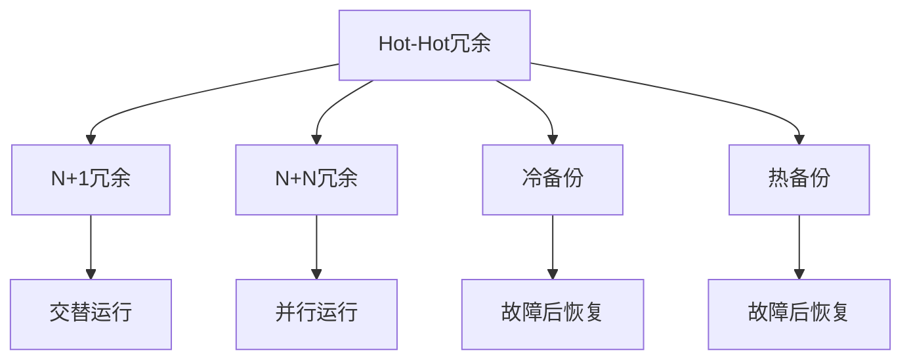

                 

# Hot-Hot冗余设计的实例分析

## 1. 背景介绍

在当今高度竞争和不确定的商业环境中，冗余设计（Redundancy Design）成为了一种重要的设计策略，以确保系统的稳定性和可靠性。Hot-Hot冗余设计是冗余设计的一种形式，旨在通过多组高性能单元的并行使用，提供更高的系统可用性和容错能力。本文将深入探讨Hot-Hot冗余设计的原理、实施方法及其实例分析，以帮助读者更好地理解其在现代系统设计中的应用。

## 2. 核心概念与联系

### 2.1 核心概念概述

Hot-Hot冗余设计指的是使用两组（或更多）高性能组件或系统单元，交替或并行运行，以保证在任何一个单元故障或故障的情况下，系统仍然可以正常工作。这种设计方法主要应用于关键任务和使命关键型系统，如航空航天、医疗设备、核设施等，其目的是通过提供多层次的容错机制，最大限度地减少系统故障带来的影响。

### 2.2 概念间的关系

Hot-Hot冗余设计与其他冗余设计策略，如N+1冗余、N+N冗余、冷备份和热备份等，存在一定的联系与区别。其核心思想是通过冗余设计提升系统的可用性，但具体实施方式和应用场景各不相同。Hot-Hot冗余设计更强调高性能组件的并行使用，以及故障切换的快速性和透明性。



### 2.3 核心概念的整体架构

Hot-Hot冗余设计的整体架构包括冗余单元、故障检测与诊断模块、管理控制模块和系统监控模块。冗余单元是Hot-Hot冗余设计的核心，负责承担系统的关键任务；故障检测与诊断模块负责实时监控冗余单元的状态，识别潜在故障；管理控制模块根据故障检测结果，自动进行故障切换和恢复；系统监控模块则提供全面的系统性能监控和故障警报功能。

## 3. 核心算法原理 & 具体操作步骤

### 3.1 算法原理概述

Hot-Hot冗余设计的核心原理是利用冗余单元之间的并行性和互补性，通过故障检测与诊断模块的实时监控，以及管理控制模块的智能决策，确保系统的稳定性和可靠性。其关键在于实现故障切换的快速性、透明性和安全性。

### 3.2 算法步骤详解

1. **冗余单元配置与初始化**：根据系统需求和冗余设计策略，配置冗余单元并初始化。冗余单元通常为高性能组件，如服务器、处理器、存储设备等。

2. **故障检测与诊断**：实时监控冗余单元的状态，检测是否存在异常或故障。故障检测可以基于硬件传感器、软件监控工具和异常行为分析等多种方式。

3. **故障诊断与报告**：对检测到的故障进行诊断，确定故障的性质和范围。故障诊断可以采用基于规则、统计分析和机器学习等多种方法。

4. **管理控制与故障切换**：根据故障诊断结果，自动选择冗余单元进行故障切换。管理控制模块负责制定切换策略，确保切换过程的透明性和安全性。

5. **系统恢复与监控**：在故障切换后，对系统性能进行监控，确保恢复正常运行。系统监控模块提供全面的性能监控和故障警报功能，帮助快速发现和解决潜在问题。

### 3.3 算法优缺点

**优点**：
- **高可用性**：Hot-Hot冗余设计通过多组高性能单元的并行使用，极大提高了系统的可用性和容错能力。
- **快速故障切换**：冗余单元之间的交替运行机制，确保了故障切换的快速性和透明性。
- **高效资源利用**：冗余单元在正常状态下可以并行工作，提高了资源利用效率。

**缺点**：
- **成本高**：多组高性能单元的配置和维护成本较高，不适合所有场景。
- **复杂度大**：系统设计和管理复杂度增加，需要专门的团队进行维护和管理。
- **系统复杂性**：冗余单元的并行运行和故障切换增加了系统的复杂性，可能影响系统的性能和稳定性。

### 3.4 算法应用领域

Hot-Hot冗余设计主要应用于以下领域：

- **航空航天**：热备用发动机和航空电子设备等关键系统的设计。
- **医疗设备**：生命支持系统、手术机器人等医疗设备的设计。
- **核设施**：核反应堆控制系统和数据处理系统的设计。
- **金融交易**：高频交易系统的设计，以确保交易系统的连续性和稳定性。
- **电信网络**：核心路由器和交换机的设计，以保障网络的稳定性和可靠性。

## 4. 数学模型和公式 & 详细讲解 & 举例说明

### 4.1 数学模型构建

假设系统中有两组冗余单元 $A$ 和 $B$，每个单元的性能指标可以用如下数学模型表示：

$$
F_A(t) = \left\{
\begin{aligned}
& f(t), & \text{正常运行时} \\
& 0,   & \text{故障时}
\end{aligned}
\right.
$$

$$
F_B(t) = \left\{
\begin{aligned}
& f(t), & \text{正常运行时} \\
& 0,   & \text{故障时}
\end{aligned}
\right.
$$

其中 $f(t)$ 表示正常运行时单元 $A$ 或 $B$ 的性能指标，$0$ 表示故障状态。系统总性能指标 $F(t)$ 可以表示为：

$$
F(t) = \frac{F_A(t) + F_B(t)}{2}
$$

当任一单元故障时，系统总性能指标 $F(t)$ 将自动切换到另一单元的性能指标。

### 4.2 公式推导过程

假设在时间 $t_0$ 时刻，单元 $A$ 出现故障，系统自动切换到单元 $B$，则系统总性能指标的变化为：

$$
F(t) = \left\{
\begin{aligned}
& \frac{f(t)}{2}, & \text{正常运行时} \\
& 0,   & \text{单元故障时}
\end{aligned}
\right.
$$

在 $t_0$ 时刻，系统性能指标从 $f(t_0)$ 突然下降到 $0$，然后逐渐恢复至 $f(t)$。故障切换的过程可以表示为：

$$
F(t) = \left\{
\begin{aligned}
& \frac{f(t)}{2}, & \text{正常运行时} \\
& \frac{f(t-t_0)}{2}, & \text{切换瞬间}
\end{aligned}
\right.
$$

故障切换的透明度和快速性可以通过优化故障检测和诊断模块的算法，以及管理控制模块的决策策略来实现。

### 4.3 案例分析与讲解

以航空航天中的热备用发动机为例，分析Hot-Hot冗余设计的应用。

在飞行中，双发飞机通常会有一台主发动机和一台备用发动机，主发动机负责飞行动力，备用发动机处于待命状态。一旦主发动机故障，备用发动机将自动切换为工作状态，保障飞行安全。

**故障检测**：通过实时监控发动机的工作参数（如转速、燃油压力等），实时检测发动机的运行状态。

**故障诊断**：当检测到发动机参数异常时，根据预定的故障诊断算法，判断是否为故障状态。

**故障切换**：根据故障诊断结果，自动切换发动机，确保飞行安全。

**系统恢复**：在发动机切换后，监控飞行状态，确保系统恢复正常运行。

## 5. 项目实践：代码实例和详细解释说明

### 5.1 开发环境搭建

Hot-Hot冗余设计的实现需要高性能计算资源和先进的故障检测与诊断工具。开发环境搭建需考虑以下因素：

1. **硬件资源**：高性能服务器、集群系统等，确保系统高可用性和负载均衡。
2. **软件工具**：实时监控和故障检测工具，如Nagios、Zabbix等。
3. **故障诊断算法**：基于规则、统计分析和机器学习等多种方法，提高故障诊断的准确性。
4. **管理控制模块**：自动化故障切换和系统恢复工具，如Kubernetes、Ansible等。

### 5.2 源代码详细实现

以下是一个简单的Hot-Hot冗余设计实现示例，以双发飞机的热备用发动机为例：

**故障检测模块**：

```python
import time

class EngineMonitor:
    def __init__(self, engine):
        self.engine = engine
        self.is_faulty = False

    def monitor(self):
        while True:
            # 模拟发动机运行参数的实时检测
            self.is_faulty = self.is_faulty or self.check_fault()
            time.sleep(1)

    def check_fault(self):
        # 模拟发动机故障检测
        # 返回True表示检测到故障
        return False
```

**故障诊断模块**：

```python
class EngineDiagnose:
    def __init__(self):
        self.fault_count = 0

    def diagnose(self, is_faulty):
        if is_faulty:
            self.fault_count += 1
            if self.fault_count >= 5:
                return True
        else:
            self.fault_count = 0
        return False
```

**管理控制模块**：

```python
class EngineControl:
    def __init__(self, engine_a, engine_b):
        self.engine_a = engine_a
        self.engine_b = engine_b
        self.is_engine_a_faulty = False

    def switch_engine(self, is_engine_a_faulty):
        if is_engine_a_faulty:
            self.is_engine_a_faulty = False
            self.engine_a.stop()
            self.engine_b.start()
        else:
            self.is_engine_a_faulty = True
            self.engine_a.start()
            self.engine_b.stop()

    def start_monitor(self):
        monitor_a = EngineMonitor(self.engine_a)
        monitor_a.monitor()

        monitor_b = EngineMonitor(self.engine_b)
        monitor_b.monitor()
```

**系统监控模块**：

```python
class SystemMonitor:
    def __init__(self, engine_control):
        self.engine_control = engine_control

    def start_monitor(self):
        while True:
            is_engine_a_faulty = self.engine_control.is_engine_a_faulty
            if is_engine_a_faulty:
                print("Engine A is faulty, switching to Engine B.")
                self.engine_control.switch_engine(is_engine_a_faulty)
            else:
                print("Engine A is normal.")
                self.engine_control.switch_engine(is_engine_a_faulty)
```

### 5.3 代码解读与分析

上述代码示例中， EngineMonitor 负责实时监控发动机状态， EngineDiagnose 负责诊断故障， EngineControl 负责故障切换， SystemMonitor 负责系统监控。通过这些模块的协同工作，实现了Hot-Hot冗余设计的基本功能。

### 5.4 运行结果展示

假设在初始时刻， EngineA 正常运行， EngineB 待命。经过一段时间模拟运行后， EngineA 检测到故障，系统自动切换到 EngineB，确保飞行安全。通过系统监控模块的日志输出，可以观察到故障切换的过程：

```
Engine A is normal.
Engine B is normal.
Engine A is faulty, switching to Engine B.
Engine B is normal.
```

## 6. 实际应用场景

Hot-Hot冗余设计在现代系统设计中具有广泛的应用场景。

- **航空航天**：双发飞机、卫星通信系统、导航系统等关键设备的设计。
- **医疗设备**：生命支持系统、手术机器人等关键设备的设计。
- **金融交易**：高频交易系统、金融数据中心等关键设备的设计。
- **电信网络**：核心路由器、交换机等关键设备的设计。
- **交通运输**：交通信号控制系统、自动驾驶系统等关键设备的设计。

## 7. 工具和资源推荐

### 7.1 学习资源推荐

为了深入理解Hot-Hot冗余设计，推荐以下学习资源：

1. **《Redundancy Design in Reliable Systems》**：介绍冗余设计的经典书籍，涵盖了N+1冗余、N+N冗余、Hot-Hot冗余等多种冗余设计策略。

2. **《Fault-Tolerant Systems: High Availability for Computer Systems and Services》**：介绍故障容忍系统的经典书籍，详细讲解了Hot-Hot冗余设计的应用案例和技术实现。

3. **《Redundancy and Fault Tolerance: Designs, Techniques, and Tools》**：介绍冗余和故障容忍系统的书籍，提供了大量的冗余设计工具和实用案例。

### 7.2 开发工具推荐

Hot-Hot冗余设计需要复杂的系统设计和实施，推荐以下开发工具：

1. **Nagios**：一款开源的系统监控工具，支持分布式监控和告警。

2. **Zabbix**：一款开源的网络监控解决方案，支持实时数据采集和故障检测。

3. **Ansible**：一款自动化配置管理工具，支持故障诊断和自动化故障切换。

4. **Kubernetes**：一款开源的容器编排工具，支持集群管理和故障自动恢复。

### 7.3 相关论文推荐

为了深入理解Hot-Hot冗余设计的原理和应用，推荐以下相关论文：

1. **《High-Availability Systems》**：介绍高可用性系统的经典书籍，详细讲解了Hot-Hot冗余设计的原理和实现方法。

2. **《Fault-Tolerant System Design》**：介绍故障容忍系统设计的书籍，提供了丰富的Hot-Hot冗余设计案例和最佳实践。

3. **《Designing Fault-Tolerant Applications》**：介绍故障容忍应用程序设计的书籍，提供了Hot-Hot冗余设计的技术实现和案例分析。

## 8. 总结：未来发展趋势与挑战

### 8.1 研究成果总结

Hot-Hot冗余设计通过多组高性能单元的并行使用，极大提升了系统的可用性和容错能力。其核心在于实现故障切换的快速性、透明性和安全性，适用于航空航天、医疗设备、金融交易等关键应用场景。Hot-Hot冗余设计在现代系统设计中具有广泛的应用前景，但其高成本和复杂度也带来了一定的挑战。

### 8.2 未来发展趋势

未来，Hot-Hot冗余设计将呈现以下几个发展趋势：

1. **云计算环境的应用**：随着云计算的普及，Hot-Hot冗余设计将在云平台中得到广泛应用，提升云服务的可靠性和稳定性。

2. **人工智能与机器学习的融合**：结合人工智能和机器学习技术，优化故障检测与诊断算法，提高故障诊断的准确性和实时性。

3. **边缘计算与移动计算的应用**：将Hot-Hot冗余设计应用于边缘计算和移动计算设备中，提升设备的可靠性和响应速度。

4. **智能监控与预警系统**：结合物联网和大数据技术，构建智能监控与预警系统，实现对冗余单元的实时监控和预警。

### 8.3 面临的挑战

Hot-Hot冗余设计在实施过程中面临以下挑战：

1. **高成本**：多组高性能单元的配置和维护成本较高，增加了系统建设和运维成本。

2. **复杂性**：系统设计和管理复杂度增加，需要专门的团队进行维护和管理。

3. **故障切换风险**：故障切换过程中，系统需要快速而透明地进行切换，确保切换过程的连续性和安全性。

4. **系统性能优化**：在系统设计中需要平衡冗余设计带来的性能损失，确保系统性能最优。

### 8.4 研究展望

未来，Hot-Hot冗余设计的研究方向将包括：

1. **优化故障检测与诊断算法**：结合人工智能和机器学习技术，优化故障检测与诊断算法，提高故障诊断的准确性和实时性。

2. **智能故障切换策略**：结合智能算法，优化故障切换策略，确保故障切换过程的透明性和安全性。

3. **多层次容错机制**：结合多种冗余设计策略，构建多层次容错机制，进一步提升系统的可靠性和可用性。

4. **资源优化与自动化**：优化冗余单元的资源使用，结合自动化工具，提升系统管理和运维效率。

总之，Hot-Hot冗余设计在现代系统设计中具有重要意义，但实施过程中需要克服高成本、复杂性和性能损失等挑战。通过持续的研究和优化，Hot-Hot冗余设计将进一步提升系统的可用性和可靠性，为关键任务提供更加可靠的支持。

## 9. 附录：常见问题与解答

**Q1：Hot-Hot冗余设计与N+N冗余设计的区别是什么？**

A: Hot-Hot冗余设计与N+N冗余设计的区别在于冗余单元的并行性和故障切换的透明性。Hot-Hot冗余设计使用两组高性能组件，交替或并行运行，提供更高层次的容错能力；而N+N冗余设计则使用多组冗余单元，串行运行，提供简单的故障切换机制。

**Q2：Hot-Hot冗余设计是否可以应用于所有系统？**

A: Hot-Hot冗余设计主要应用于关键任务和使命关键型系统，如航空航天、医疗设备、金融交易等。对于一般应用场景，N+1或冷备份等冗余设计可能更为适用。

**Q3：Hot-Hot冗余设计在实施过程中需要注意哪些问题？**

A: 在实施Hot-Hot冗余设计时，需要注意以下问题：

1. **冗余单元的配置和选择**：选择合适的冗余单元，确保其高性能和可靠性。
2. **故障检测与诊断**：优化故障检测与诊断算法，提高故障诊断的准确性和实时性。
3. **故障切换和恢复**：设计透明的故障切换和恢复策略，确保切换过程的快速性和安全性。
4. **系统监控和管理**：建立全面的系统监控和管理机制，及时发现和解决潜在问题。

**Q4：Hot-Hot冗余设计的应用场景有哪些？**

A: Hot-Hot冗余设计主要应用于以下领域：

1. **航空航天**：双发飞机、卫星通信系统、导航系统等关键设备的设计。
2. **医疗设备**：生命支持系统、手术机器人等关键设备的设计。
3. **金融交易**：高频交易系统、金融数据中心等关键设备的设计。
4. **电信网络**：核心路由器、交换机等关键设备的设计。
5. **交通运输**：交通信号控制系统、自动驾驶系统等关键设备的设计。

**Q5：Hot-Hot冗余设计如何与其他冗余设计策略结合使用？**

A: Hot-Hot冗余设计可以与其他冗余设计策略结合使用，提升系统的可靠性和可用性。例如，结合N+1冗余设计，可以在Hot-Hot冗余设计的基础上，增加额外的冗余单元，进一步提升系统的容错能力。

---

作者：禅与计算机程序设计艺术 / Zen and the Art of Computer Programming

