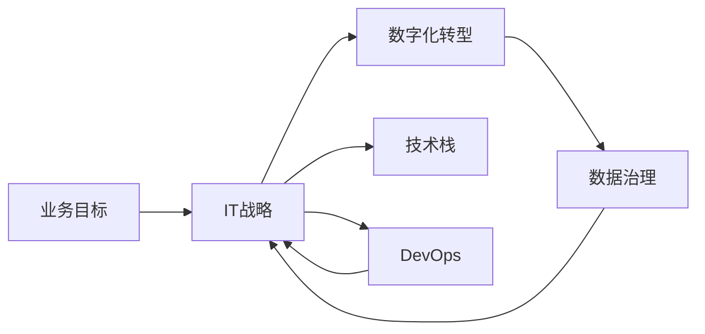

                 

# IT战略规划：制定并执行与公司业务目标相一致的IT战略计划

## 1. 背景介绍

### 1.1 问题由来

在数字化时代，IT已不再仅仅是支持企业业务的辅助工具，而是成为推动企业创新的核心动力。然而，如何制定和执行一套与公司业务目标相一致的IT战略，是一个复杂而棘手的难题。这不仅需要深入理解企业的战略目标和业务需求，还需要有足够的技术前瞻性和决策智慧。

### 1.2 问题核心关键点

IT战略规划的核心关键点包括：
- 明确企业的业务目标和战略方向
- 理解企业的数字化现状和能力差距
- 制定符合业务需求的技术路线图
- 评估和优化IT资源配置
- 确保战略执行力，促进企业持续发展

## 2. 核心概念与联系

### 2.1 核心概念概述

要制定与企业业务目标相一致的IT战略，首先需要理解一些核心概念：

- **业务目标**：企业为实现长期发展而设立的战略性目标，如市场份额、客户满意度、营收增长等。
- **IT战略**：企业IT部门为支持业务目标所制定的整体规划和行动方案，包括技术路线、资源配置、风险管理等。
- **数字化转型**：企业通过信息技术的应用，实现业务流程、产品和服务等的数字化，提升效率和竞争力。
- **技术栈**：企业所使用的技术和工具集合，包括硬件、软件、云平台等。
- **数据治理**：企业对数据资源的管理和利用，包括数据采集、存储、分析和应用等。
- **DevOps**：开发和运维的紧密集成，强调快速交付和持续改进。

这些概念之间存在着紧密的联系，共同构成了企业IT战略规划的基础框架。通过理清这些概念的内在关系，可以更好地制定和执行IT战略计划。

### 2.2 概念间的关系

- **业务目标与IT战略的关系**：业务目标是IT战略的出发点和归宿，IT战略应支持并促进业务目标的实现。
- **数字化转型与IT战略的关系**：数字化转型是实现IT战略的重要手段，通过信息化手段提升业务效率和竞争力。
- **技术栈与IT战略的关系**：技术栈是IT战略的技术基础，合理的技术栈布局有助于IT战略的有效实施。
- **数据治理与IT战略的关系**：数据治理是IT战略的关键支撑，确保数据的准确性和可靠性，提升数据利用效率。
- **DevOps与IT战略的关系**：DevOps加速了IT战略的执行和迭代，提高企业对市场变化的响应速度。

这些概念之间的逻辑关系可以通过以下Mermaid流程图来展示：

这个流程图展示了业务目标与IT战略之间的相互作用和依赖关系。数字化转型、技术栈、数据治理和DevOps都是IT战略的重要组成部分，共同支持业务目标的实现。

## 3. 核心算法原理 & 具体操作步骤
### 3.1 算法原理概述

制定和执行与企业业务目标相一致的IT战略计划，需要系统化的方法论和工具。以下是主要的算法原理概述：

- **战略映射**：将业务目标映射到IT战略的具体实施方案，明确技术需求和优先级。
- **差距分析**：评估当前IT环境与目标IT环境的差距，识别优化点。
- **资源规划**：基于差距分析结果，进行IT资源（人员、预算、技术等）的合理规划和配置。
- **风险评估**：识别和评估IT战略执行过程中可能遇到的风险，并制定应对策略。
- **战略执行与监控**：制定详细的执行计划，并定期监控IT战略的执行情况，确保目标达成。

### 3.2 算法步骤详解

#### 3.2.1 战略映射

1. **确定业务目标**：与企业高层沟通，明确公司的长期和短期业务目标。
2. **技术需求分析**：分解业务目标，确定实现目标所需的技术需求，如云计算、大数据、人工智能等。
3. **优先级排序**：根据业务目标的重要性和紧急程度，对技术需求进行优先级排序。

#### 3.2.2 差距分析

1. **现状调研**：通过访谈、问卷、数据分析等手段，全面了解企业当前的IT环境和技术能力。
2. **能力差距评估**：对比目标IT环境和当前IT环境，评估在技术、人才、资源等方面的差距。
3. **优化点识别**：基于差距分析结果，识别需要改进和优化的关键点。

#### 3.2.3 资源规划

1. **资源需求评估**：根据优化点识别结果，评估所需的IT资源，如硬件设备、软件工具、人力资源等。
2. **预算分配**：根据资源需求和业务优先级，合理分配IT预算，确保资源的有效利用。
3. **技术路线图制定**：基于业务目标和技术需求，制定详细的技术路线图，明确技术实施步骤和时间节点。

#### 3.2.4 风险评估

1. **风险识别**：识别IT战略执行过程中可能遇到的技术、资源、管理等风险。
2. **风险评估**：对识别出的风险进行评估，确定风险的可能性和影响程度。
3. **风险应对策略**：制定应对策略，如风险转移、缓解、规避等，确保IT战略的顺利执行。

#### 3.2.5 战略执行与监控

1. **执行计划制定**：基于技术路线图，制定详细的执行计划，明确各阶段的责任人和时间节点。
2. **监控与评估**：建立IT战略执行的监控机制，定期评估执行情况，及时调整策略。
3. **持续改进**：根据监控和评估结果，持续优化IT战略，确保其与业务目标保持一致。

### 3.3 算法优缺点

#### 3.3.1 优点

- **系统化方法论**：通过科学的方法论和工具，制定和执行IT战略，提高决策的科学性和有效性。
- **全面覆盖**：系统地考虑业务目标、数字化转型、技术栈、数据治理、DevOps等多个方面，确保IT战略的全面性。
- **灵活适应**：根据业务环境和市场变化，灵活调整IT战略，确保其持续性和适应性。

#### 3.3.2 缺点

- **复杂度高**：涉及多方面的决策和协调，工作量较大，需要较高的专业水平和经验。
- **资源消耗**：制定和执行IT战略需要投入大量的人力和物力，短期内可能对企业的正常运营造成影响。
- **不确定性**：IT战略的实施受技术发展、市场变化等多方面因素影响，存在不确定性。

### 3.4 算法应用领域

IT战略规划的方法和工具已经广泛应用于以下领域：

- **传统行业数字化**：如制造、零售、金融等行业，通过IT战略规划，推动业务流程和产品服务的数字化转型。
- **新兴产业创新**：如互联网、人工智能、区块链等新兴产业，通过IT战略规划，加速技术创新和市场布局。
- **跨国企业集团**：通过统一的IT战略规划，协调全球范围内的IT资源和业务流程，提升国际竞争力。
- **政府机构信息化**：通过IT战略规划，提升政府机构的数字化管理和公共服务能力。

## 4. 数学模型和公式 & 详细讲解 & 举例说明

### 4.1 数学模型构建

假设企业的业务目标为 $G$，IT战略为 $S$，数字化转型为 $T$，技术栈为 $P$，数据治理为 $D$，DevOps为 $O$。则IT战略规划的数学模型可以表示为：

$$
S = f(G, T, P, D, O)
$$

其中，$f$ 为映射函数，表示根据业务目标和相关因素，映射到具体的IT战略方案。

### 4.2 公式推导过程

#### 4.2.1 战略映射公式

根据业务目标 $G$ 和技术需求 $N$，可以得到：

$$
N = \{n_1, n_2, ..., n_k\}
$$

其中，$n_i$ 表示具体的技术需求。根据技术需求的优先级排序 $p$，可以得到：

$$
p = (p_1, p_2, ..., p_k)
$$

则战略映射公式可以表示为：

$$
S = \{s_1, s_2, ..., s_m\}
$$

其中，$s_i$ 表示具体的IT战略方案，$n_i$ 和 $p_i$ 共同决定了 $s_i$ 的优先级。

#### 4.2.2 差距分析公式

设当前IT环境为 $C$，目标IT环境为 $T$，则能力差距 $G$ 可以表示为：

$$
G = T - C
$$

其中，$G$ 为正数时表示需要改进的地方，$G$ 为负数时表示已经达到或超过目标。

#### 4.2.3 资源规划公式

设所需资源为 $R$，预算为 $B$，技术路线图为 $M$，则资源规划公式可以表示为：

$$
R = \{r_1, r_2, ..., r_n\}
$$

$$
B = \{b_1, b_2, ..., b_n\}
$$

$$
M = \{m_1, m_2, ..., m_k\}
$$

其中，$r_i$ 和 $b_i$ 分别表示第 $i$ 个资源的分配情况，$m_i$ 表示具体的技术实施步骤。

#### 4.2.4 风险评估公式

设风险为 $R$，风险评估结果为 $E$，风险应对策略为 $A$，则风险评估公式可以表示为：

$$
R = \{r_1, r_2, ..., r_n\}
$$

$$
E = \{e_1, e_2, ..., e_n\}
$$

$$
A = \{a_1, a_2, ..., a_n\}
$$

其中，$e_i$ 表示第 $i$ 个风险的评估结果，$a_i$ 表示具体的应对策略。

#### 4.2.5 战略执行与监控公式

设执行计划为 $P$，监控结果为 $M$，改进策略为 $I$，则战略执行与监控公式可以表示为：

$$
P = \{p_1, p_2, ..., p_k\}
$$

$$
M = \{m_1, m_2, ..., m_k\}
$$

$$
I = \{i_1, i_2, ..., i_k\}
$$

其中，$p_i$ 表示具体的执行步骤，$m_i$ 表示执行结果，$i_i$ 表示具体的改进措施。

### 4.3 案例分析与讲解

#### 案例分析

假设一家制造企业希望通过数字化转型提升生产效率和市场响应速度。通过战略映射，确定需要引入云计算、物联网、大数据等技术。差距分析发现，企业在云计算和物联网方面的能力不足，需要引入外部专业人才。资源规划结果显示，需要投入2000万美元进行云计算平台建设。风险评估发现，技术引入过程中可能遇到供应商选择不当的风险。最终，企业制定了详细的执行计划，并在执行过程中进行监控和调整，确保了数字化转型的顺利进行。

## 5. 项目实践：代码实例和详细解释说明
### 5.1 开发环境搭建

#### 5.1.1 环境准备

1. **硬件设备**：确保企业拥有足够的服务器、存储设备、网络带宽等硬件资源，支持IT战略的实施。
2. **软件工具**：安装和配置必要的软件工具，如云计算平台（AWS、Azure、阿里云等）、大数据平台（Hadoop、Spark等）、开发工具（Visual Studio、Eclipse等）。
3. **网络安全**：确保企业网络安全，包括防火墙、入侵检测、数据加密等措施。

#### 5.1.2 开发工具

1. **项目管理工具**：如JIRA、Trello等，用于跟踪IT战略实施进度和资源分配情况。
2. **版本控制工具**：如Git、SVN等，确保代码和文档的版本管理。
3. **持续集成工具**：如Jenkins、Travis CI等，自动化测试和部署。

### 5.2 源代码详细实现

#### 5.2.1 项目规划

1. **需求分析**：根据业务目标，明确具体的技术需求和优先级。
2. **差距评估**：评估当前IT环境和目标IT环境的差距。
3. **资源规划**：根据差距评估结果，进行IT资源的规划和分配。

#### 5.2.2 技术实施

1. **云计算平台搭建**：在云计算平台上部署企业应用，确保稳定性和可扩展性。
2. **大数据平台搭建**：部署大数据平台，进行数据的采集、存储、分析和应用。
3. **人工智能应用**：部署人工智能模型，进行数据挖掘、自然语言处理等应用。

#### 5.2.3 安全管理

1. **网络安全**：设置防火墙、VPN、DDoS防护等网络安全措施。
2. **数据安全**：采用数据加密、访问控制等措施，确保数据的安全性和隐私性。
3. **应用安全**：进行安全漏洞扫描、代码审计等，确保应用的健壮性和安全性。

### 5.3 代码解读与分析

#### 5.3.1 项目管理工具使用

1. **任务分配**：通过项目管理工具，将IT战略分解为多个任务，分配给具体的团队和人员。
2. **进度跟踪**：实时跟踪任务的进度和完成情况，及时调整和优化资源配置。

#### 5.3.2 版本控制工具使用

1. **代码管理**：使用版本控制工具，记录代码的变更历史和版本信息。
2. **协作开发**：多人协作开发时，使用版本控制工具进行代码的合并和冲突解决。

#### 5.3.3 持续集成工具使用

1. **自动化测试**：编写测试用例，通过持续集成工具自动化执行测试，确保代码质量。
2. **自动化部署**：配置持续集成工具，实现自动化部署，减少人工操作。

### 5.4 运行结果展示

#### 5.4.1 项目进度

通过项目管理工具，可以实时查看项目进度和资源分配情况，确保IT战略的顺利实施。

#### 5.4.2 代码质量

使用版本控制工具和持续集成工具，可以确保代码的质量和稳定性，减少开发和维护成本。

#### 5.4.3 安全审计

通过定期进行网络安全、数据安全和应用安全的审计，可以及时发现和修复潜在的安全漏洞，保障IT战略的顺利执行。

## 6. 实际应用场景
### 6.1 智能制造

智能制造通过IT战略规划，推动制造业的数字化转型，提升生产效率和产品质量。

1. **设备互联**：通过物联网技术，实现设备的互联和数据共享，提升生产效率。
2. **数据驱动决策**：通过大数据分析，进行生产过程的优化和预测，提升决策能力。
3. **人工智能应用**：通过人工智能技术，进行质量检测和故障预测，提升产品合格率和生产稳定性。

### 6.2 智慧零售

智慧零售通过IT战略规划，推动零售业的数字化转型，提升客户体验和运营效率。

1. **智能仓储**：通过物联网和云计算技术，实现仓储的智能化管理，提升物流效率。
2. **个性化推荐**：通过大数据分析和人工智能技术，进行商品推荐和客户画像分析，提升客户体验。
3. **供应链优化**：通过供应链管理系统，优化库存管理和物流调度，提升运营效率。

### 6.3 医疗健康

医疗健康通过IT战略规划，推动医疗行业的数字化转型，提升医疗服务的质量和效率。

1. **电子病历系统**：通过信息化手段，实现电子病历的共享和数据管理，提升医疗服务的效率和质量。
2. **远程医疗**：通过云计算和通信技术，实现远程诊疗和医疗咨询，提升医疗服务的可及性和便利性。
3. **健康监测**：通过物联网技术，进行健康数据的采集和分析，提升疾病预防和健康管理能力。

### 6.4 未来应用展望

#### 6.4.1 行业数字化升级

未来，各行业的数字化转型将继续加速，IT战略规划将成为推动行业升级的重要手段。通过全面覆盖业务目标和技术需求，可以加速行业数字化进程，提升行业竞争力。

#### 6.4.2 技术创新驱动

技术创新是推动IT战略发展的核心动力。未来，通过引入新技术、新平台和新工具，可以不断提升IT战略的灵活性和适应性，推动企业持续发展。

#### 6.4.3 全球化协作

在跨国企业集团中，IT战略规划将成为实现全球协作的重要手段。通过统一的技术标准和IT架构，可以实现跨国团队的协同工作，提升国际竞争力。

## 7. 工具和资源推荐
### 7.1 学习资源推荐

1. **《IT战略规划与实施》书籍**：详细介绍了IT战略规划的基本概念和实施方法。
2. **《数字化转型与IT战略》课程**：由知名IT专家讲授，涵盖数字化转型的基本原理和实践案例。
3. **《DevOps最佳实践》视频**：展示DevOps在IT战略中的重要作用和具体实施方法。
4. **IT战略规划白皮书**：包括多家企业成功实施IT战略的案例分析和经验总结。

### 7.2 开发工具推荐

1. **项目管理工具**：如JIRA、Trello、Asana等，用于项目管理和进度跟踪。
2. **版本控制工具**：如Git、SVN等，用于代码和文档的版本管理。
3. **持续集成工具**：如Jenkins、Travis CI、GitLab CI等，用于自动化测试和部署。
4. **云计算平台**：如AWS、Azure、阿里云等，用于部署和管理IT应用。
5. **大数据平台**：如Hadoop、Spark、Flink等，用于数据的采集、存储、分析和应用。
6. **人工智能平台**：如TensorFlow、PyTorch、Keras等，用于人工智能应用的开发和部署。

### 7.3 相关论文推荐

1. **《IT战略规划的理论与实践》**：介绍IT战略规划的基本理论和实践方法。
2. **《数字化转型的挑战与对策》**：分析数字化转型面临的挑战和应对策略。
3. **《云计算在IT战略中的作用》**：探讨云计算对IT战略的影响和优化策略。
4. **《大数据在IT战略中的应用》**：分析大数据对IT战略的支撑作用和具体应用。

## 8. 总结：未来发展趋势与挑战
### 8.1 研究成果总结

IT战略规划作为企业数字化转型的重要组成部分，已经成为企业信息化建设的重要方向。通过系统的IT战略规划，可以有效推动企业的数字化转型，提升业务效率和市场竞争力。

### 8.2 未来发展趋势

未来，IT战略规划将呈现以下几个发展趋势：

1. **数据驱动决策**：数据将成为企业决策的核心支撑，通过大数据分析和人工智能技术，提升决策的科学性和准确性。
2. **智能自动化**：自动化技术和人工智能技术的应用将不断扩大，推动企业智能化和自动化发展。
3. **云计算和大数据**：云计算和大数据技术将进一步普及，成为企业IT战略的基础设施。
4. **全球化协作**：全球化协作将成为企业IT战略的重要方向，推动企业在全球范围内的资源优化和协同工作。
5. **安全与隐私**：数据安全和用户隐私保护将成为企业IT战略的重要关注点，通过技术手段保障数据安全和用户隐私。

### 8.3 面临的挑战

尽管IT战略规划在企业数字化转型中发挥着重要作用，但也面临以下挑战：

1. **复杂性高**：IT战略规划涉及多方面的决策和协调，工作量较大，需要较高的专业水平和经验。
2. **资源消耗**：制定和执行IT战略需要投入大量的人力和物力，短期内可能对企业的正常运营造成影响。
3. **技术快速迭代**：IT技术和市场变化较快，需要企业持续跟踪和适应。
4. **风险管理**：IT战略实施过程中可能遇到技术、管理等多方面的风险，需要企业建立完善的风险管理机制。

### 8.4 研究展望

未来，IT战略规划的研究方向包括：

1. **自动化与智能化**：通过自动化和智能化技术，提升IT战略规划的效率和科学性。
2. **数据治理**：建立完善的数据治理体系，确保数据的质量和安全性。
3. **跨领域融合**：将IT战略与业务战略、技术创新等多领域进行融合，推动企业全面发展。
4. **全球化协作**：推动全球范围内的资源优化和协同工作，提升企业的国际竞争力。

总之，制定和执行与企业业务目标相一致的IT战略计划，是推动企业数字化转型、提升业务效率和市场竞争力的重要手段。通过系统的IT战略规划，结合前沿的技术手段和工具，可以有效应对未来发展的挑战，实现企业的持续发展和创新。

## 9. 附录：常见问题与解答

### 9.1 常见问题

#### Q1: 如何确定企业的业务目标？

A: 与企业高层进行深入沟通，明确公司的长期和短期业务目标，结合市场和行业趋势进行综合分析。

#### Q2: 如何进行IT资源规划？

A: 基于业务目标和技术需求，评估当前IT环境和目标IT环境的差距，制定详细的IT资源规划和预算分配方案。

#### Q3: 如何应对IT战略实施过程中的风险？

A: 识别和评估IT战略实施过程中可能遇到的风险，制定应对策略，如风险转移、缓解、规避等，确保IT战略的顺利执行。

#### Q4: 如何保证IT战略的灵活性和适应性？

A: 引入新技术和新平台，确保IT战略能够快速响应市场变化和业务需求。

#### Q5: 如何实现全球化协作？

A: 建立统一的技术标准和IT架构，实现跨国团队的协同工作，提升国际竞争力。

### 9.2 解答

通过以上分析和回答，相信你对制定和执行与企业业务目标相一致的IT战略计划有了更清晰的认识。IT战略规划是企业数字化转型的重要组成部分，需要系统的理论和方法论，结合前沿的技术手段和工具，不断优化和提升，以推动企业持续发展和创新。

