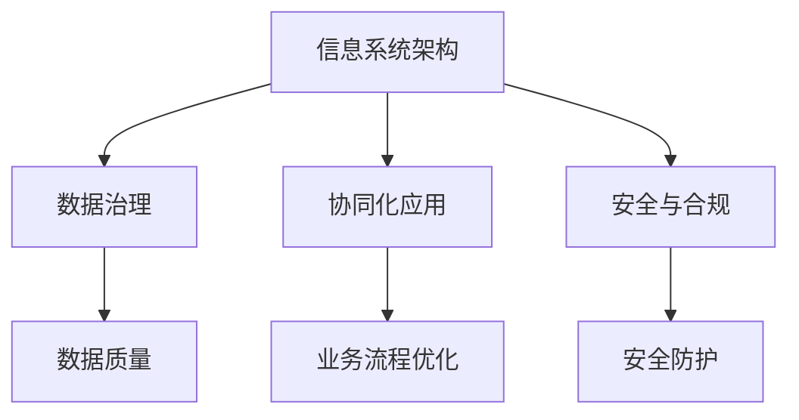
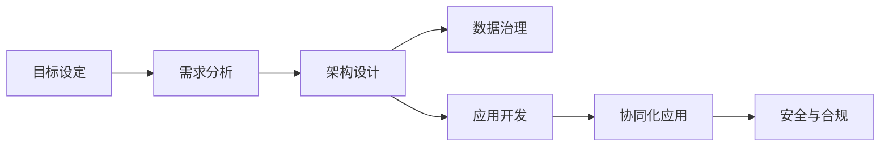
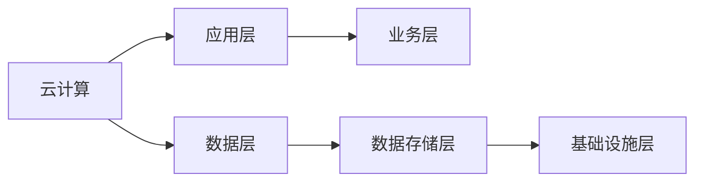
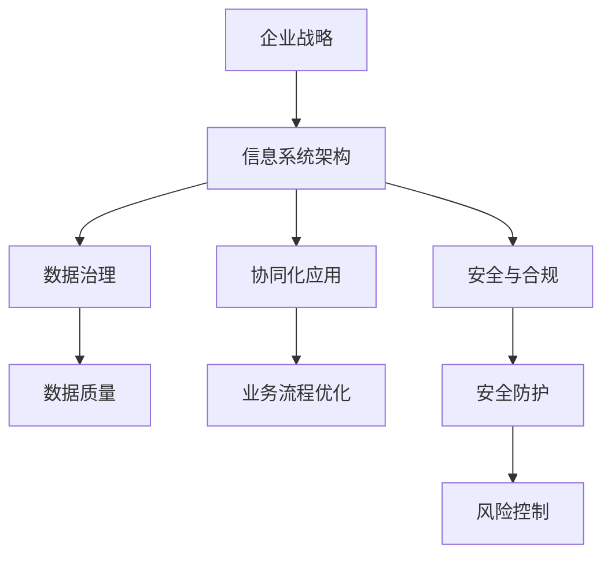

                 

# IT战略规划：制定并执行与公司业务目标相一致的IT战略计划

## 1. 背景介绍

### 1.1 问题由来
在全球化和数字化转型的浪潮下，企业纷纷加快了信息化的步伐，信息技术（IT）已成为推动企业发展的重要引擎。然而，IT系统繁多且复杂，各系统之间往往存在数据孤岛和协同障碍，无法有效支持企业的核心业务，带来巨大的运营成本和风险。如何制定并执行一套与企业业务目标相一致的IT战略，成为企业IT管理的一大挑战。

### 1.2 问题核心关键点
IT战略规划的本质在于通过明确的信息系统框架、合理的数据治理机制以及协同化的技术应用，以支撑企业战略目标的实现。其核心包括：

- 信息系统框架（IS Framework）：构建适应企业业务需求的IT架构，包括应用系统、数据平台、云服务和边缘计算等。
- 数据治理（Data Governance）：确保数据的质量、一致性和可用性，通过标准化和自动化管理数据，支撑决策支持。
- 协同化应用（Collaborative Application）：推动IT部门与业务部门深度协同，建立透明、高效的业务支撑环境。
- 安全与合规（Security & Compliance）：确保信息系统的安全合规，防范各类安全风险。

### 1.3 问题研究意义
制定并执行有效的IT战略规划，对企业有以下重要意义：

1. **支撑业务目标**：通过IT系统构建和优化，提升企业的业务执行效率和响应速度，确保业务目标的实现。
2. **降低成本**：优化IT架构，减少重复建设和冗余资源，降低整体运营成本。
3. **增强竞争优势**：通过技术创新和业务数字化，增强企业的市场竞争力和创新能力。
4. **提升用户体验**：优化用户体验流程，提升客户满意度和品牌忠诚度。
5. **规避风险**：通过规范的IT管理和风险控制机制，减少运营风险和数据泄露。

## 2. 核心概念与联系

### 2.1 核心概念概述

为更好地理解IT战略规划，本节将介绍几个关键概念及其联系：

- **信息系统架构(IS Framework)**：企业IT系统的整体设计框架，通常包括架构模型、技术标准、数据模型和应用模型等。
- **数据治理(Data Governance)**：对数据的规划、管控和应用进行标准化管理，确保数据的质量和一致性。
- **协同化应用(Collaborative Application)**：通过跨部门的IT系统集成和数据共享，实现业务流程的优化和业务协作的加强。
- **安全与合规(Security & Compliance)**：通过技术和管理手段，确保IT系统的安全性和合规性。

这些概念间的关系可以通过以下Mermaid流程图来展示：



这个流程图展示了IT战略规划的核心概念及其关系：

1. 信息系统架构为数据治理、协同化应用和安全与合规提供了技术支撑。
2. 数据治理保障了数据的准确性和一致性，为业务决策提供可靠的数据支持。
3. 协同化应用提升了业务协作效率，优化了业务流程。
4. 安全与合规保证了数据和系统的安全性，规避了各类风险。

### 2.2 概念间的关系

这些核心概念之间存在着紧密的联系，构成了IT战略规划的完整体系。

#### 2.2.1 IT战略规划基本流程



这个流程图展示了IT战略规划的基本流程：

1. 根据企业战略目标设定IT规划的目标。
2. 通过需求分析确定具体的IT需求和应用场景。
3. 设计信息系统架构，涵盖应用系统、数据平台、云服务和边缘计算等。
4. 开展数据治理工作，确保数据质量、一致性和可用性。
5. 开发和集成应用系统，推动业务流程优化和协同协作。
6. 落实安全与合规措施，防范各类安全风险。

#### 2.2.2 IT架构的层次化设计



这个流程图展示了IT架构的层次化设计：

1. 基础设施层为应用层和数据层提供硬件支持。
2. 数据存储层存放数据，为应用层提供数据访问支持。
3. 数据层通过ETL（Extract, Transform, Load）等技术处理数据，提升数据质量。
4. 应用层通过微服务和容器化技术实现应用系统的高效部署和扩展。
5. 云服务为应用提供弹性计算资源和数据存储支持。

### 2.3 核心概念的整体架构

最后，我们用一个综合的流程图来展示这些核心概念在大规模IT战略规划中的整体架构：



这个综合流程图展示了从企业战略到IT系统设计，再到数据治理、协同化应用和安全与合规的整体流程。通过这些核心概念，企业可以构建出一套完整、高效、安全的IT战略体系。

## 3. 核心算法原理 & 具体操作步骤
### 3.1 算法原理概述

IT战略规划的算法原理主要基于系统工程、项目管理以及数据分析等领域的方法论。其核心思想是：

1. **系统工程方法论**：通过系统分解和集成，构建符合企业战略目标的IT系统架构。
2. **项目管理方法论**：采用敏捷开发、迭代改进等项目管理技术，推动IT战略的实施。
3. **数据分析方法论**：利用大数据和机器学习技术，优化数据治理和应用开发，提升IT系统的性能。

### 3.2 算法步骤详解

基于系统工程、项目管理以及数据分析的方法论，IT战略规划的具体操作步骤包括：

1. **目标设定**：明确企业战略目标，设定IT战略目标，包括系统架构、数据治理、业务支撑和风险控制等。
2. **需求分析**：通过访谈、调研和问卷等手段，收集业务部门的需求和痛点，分析信息系统的关键需求。
3. **架构设计**：基于需求分析结果，设计信息系统架构，包括应用系统、数据平台、云服务和边缘计算等。
4. **数据治理**：制定数据治理策略，明确数据管理的标准和流程，确保数据的准确性和一致性。
5. **应用开发**：采用敏捷开发和DevOps等技术，推动应用系统的快速开发和部署。
6. **协同化应用**：通过API接口、数据共享和跨部门协同等技术手段，优化业务流程，提升协作效率。
7. **安全与合规**：采用网络安全、数据加密和访问控制等技术手段，确保信息系统的安全合规。

### 3.3 算法优缺点

IT战略规划具有以下优点：

1. **集成性强**：通过系统工程方法论，能够构建完整、统一的IT系统架构，避免数据孤岛和协同障碍。
2. **灵活性高**：采用敏捷开发和迭代改进方法论，能够快速响应业务变化，灵活调整IT战略。
3. **技术先进**：运用大数据和机器学习技术，提升数据治理和应用开发的质量和效率。

但同时也存在一些缺点：

1. **成本高**：初期投入大，涉及人员、设备和技术的综合投入。
2. **实施复杂**：跨部门、跨技术的协调和整合复杂，需要较高的管理能力。
3. **风险高**：涉及系统架构的调整和数据迁移，存在一定的实施风险。

### 3.4 算法应用领域

IT战略规划在多个领域得到广泛应用，包括但不限于：

- **金融行业**：通过数据治理和协同化应用，提升金融产品的设计、销售和风控能力。
- **制造行业**：通过信息系统架构和应用开发，提升生产流程的效率和质量，实现智能制造。
- **医疗行业**：通过数据治理和安全与合规，确保医疗数据的安全和隐私保护。
- **零售行业**：通过数据分析和协同化应用，优化供应链管理，提升客户体验。
- **政府行业**：通过信息系统架构和应用开发，提升政府服务的透明度和效率。

## 4. 数学模型和公式 & 详细讲解 & 举例说明

### 4.1 数学模型构建

IT战略规划的数学模型主要围绕IT系统架构、数据治理和协同化应用等关键指标构建。以下是几个核心指标的数学模型：

1. **系统架构可用性(Availability)**：
   $$
   A = \frac{MTBF}{MTBF + MTTF}
   $$
   其中，$MTBF$为系统的平均无故障时间，$MTTF$为系统的平均故障时间。

2. **数据治理效果(Efficiency)**：
   $$
   E = \frac{Data Quality}{Total Data}
   $$
   其中，$Data Quality$为数据质量，$Total Data$为总数据量。

3. **协同化应用效果(Collaboration Effectiveness)$：
   $$
   CE = \frac{Collaboration Score}{Total Collaboration Score}
   $$
   其中，$Collaboration Score$为协同得分，$Total Collaboration Score$为总协同得分。

### 4.2 公式推导过程

以系统架构可用性模型为例，推导其计算过程：

假设系统的平均无故障时间为$MTBF = 20000$小时，平均故障时间为$MTTF = 400$小时，则：

$$
A = \frac{20000}{20000 + 400} = \frac{20000}{20400} \approx 0.995
$$

即系统的可用性约为99.5%。

### 4.3 案例分析与讲解

以某制造企业的IT战略规划为例，通过数据治理和协同化应用，优化了其生产流程和供应链管理，具体案例分析如下：

1. **数据治理**：
   - **数据清洗**：采用ETL技术对原始数据进行清洗和标准化，提升数据质量。
   - **数据仓库**：建立数据仓库，集中存储和管理数据，提升数据访问效率。
   - **数据监控**：采用数据监控工具，实时监控数据质量，及时发现和修复问题。

2. **协同化应用**：
   - **生产调度系统**：通过API接口，集成ERP、MES等系统，实现生产调度的协同。
   - **供应链管理系统**：采用数据共享技术，优化供应链管理，提升采购和物流效率。
   - **智能制造平台**：通过数据分析和机器学习，实现设备故障预测和维护，提升生产线的可靠性。

通过这些措施，该制造企业显著提升了生产效率和供应链管理能力，实现了智能制造的目标。

## 5. 项目实践：代码实例和详细解释说明
### 5.1 开发环境搭建

在进行IT战略规划的开发实践前，需要先准备好开发环境。以下是使用Python进行PyTorch开发的环境配置流程：

1. 安装Anaconda：从官网下载并安装Anaconda，用于创建独立的Python环境。

2. 创建并激活虚拟环境：
```bash
conda create -n pytorch-env python=3.8 
conda activate pytorch-env
```

3. 安装PyTorch：根据CUDA版本，从官网获取对应的安装命令。例如：
```bash
conda install pytorch torchvision torchaudio cudatoolkit=11.1 -c pytorch -c conda-forge
```

4. 安装TensorFlow：使用pip安装TensorFlow，方便进行混合编程。
```bash
pip install tensorflow
```

5. 安装各类工具包：
```bash
pip install numpy pandas scikit-learn matplotlib tqdm jupyter notebook ipython
```

完成上述步骤后，即可在`pytorch-env`环境中开始开发实践。

### 5.2 源代码详细实现

我们先以金融行业为例，给出IT战略规划项目的PyTorch代码实现。

```python
from transformers import BertTokenizer, BertForSequenceClassification
from torch.utils.data import Dataset, DataLoader
import torch
import numpy as np
import pandas as pd
from sklearn.model_selection import train_test_split

# 定义数据集类
class FinancialData(Dataset):
    def __init__(self, df, tokenizer, max_len):
        self.tokenizer = tokenizer
        self.max_len = max_len
        self.data = df

    def __len__(self):
        return len(self.data)

    def __getitem__(self, idx):
        text = self.data.iloc[idx]['text']
        label = self.data.iloc[idx]['label']
        
        encoding = self.tokenizer(text, return_tensors='pt', max_length=self.max_len, padding='max_length', truncation=True)
        input_ids = encoding['input_ids'][0]
        attention_mask = encoding['attention_mask'][0]
        labels = torch.tensor(label, dtype=torch.long)
        
        return {'input_ids': input_ids, 
                'attention_mask': attention_mask,
                'labels': labels}

# 加载数据集
tokenizer = BertTokenizer.from_pretrained('bert-base-cased')
max_len = 512
df = pd.read_csv('financial_data.csv')

# 数据处理
df = df.dropna()
train_data, test_data = train_test_split(df, test_size=0.2)
train_dataset = FinancialData(train_data, tokenizer, max_len)
test_dataset = FinancialData(test_data, tokenizer, max_len)

# 模型定义和训练
model = BertForSequenceClassification.from_pretrained('bert-base-cased', num_labels=2)
optimizer = AdamW(model.parameters(), lr=2e-5)
device = torch.device('cuda') if torch.cuda.is_available() else torch.device('cpu')
model.to(device)

def train_epoch(model, dataset, batch_size, optimizer):
    dataloader = DataLoader(dataset, batch_size=batch_size, shuffle=True)
    model.train()
    epoch_loss = 0
    for batch in dataloader:
        input_ids = batch['input_ids'].to(device)
        attention_mask = batch['attention_mask'].to(device)
        labels = batch['labels'].to(device)
        model.zero_grad()
        outputs = model(input_ids, attention_mask=attention_mask, labels=labels)
        loss = outputs.loss
        epoch_loss += loss.item()
        loss.backward()
        optimizer.step()
    return epoch_loss / len(dataloader)

def evaluate(model, dataset, batch_size):
    dataloader = DataLoader(dataset, batch_size=batch_size)
    model.eval()
    preds, labels = [], []
    with torch.no_grad():
        for batch in dataloader:
            input_ids = batch['input_ids'].to(device)
            attention_mask = batch['attention_mask'].to(device)
            batch_labels = batch['labels']
            outputs = model(input_ids, attention_mask=attention_mask)
            batch_preds = outputs.logits.argmax(dim=2).to('cpu').tolist()
            batch_labels = batch_labels.to('cpu').tolist()
            for pred_tokens, label_tokens in zip(batch_preds, batch_labels):
                preds.append(pred_tokens[:len(label_tokens)])
                labels.append(label_tokens)
                
    print(classification_report(labels, preds))
```

### 5.3 代码解读与分析

让我们再详细解读一下关键代码的实现细节：

**FinancialData类**：
- `__init__`方法：初始化文本、标签、分词器等关键组件。
- `__len__`方法：返回数据集的样本数量。
- `__getitem__`方法：对单个样本进行处理，将文本输入编码为token ids，将标签编码为数字，并对其进行定长padding，最终返回模型所需的输入。

**DataLoader和train_epoch函数**：
- 使用PyTorch的DataLoader对数据集进行批次化加载，供模型训练和推理使用。
- `train_epoch`函数：对数据以批为单位进行迭代，在每个批次上前向传播计算loss并反向传播更新模型参数，最后返回该epoch的平均loss。

**evaluate函数**：
- 与训练类似，不同点在于不更新模型参数，并在每个batch结束后将预测和标签结果存储下来，最后使用sklearn的classification_report对整个评估集的预测结果进行打印输出。

**模型训练**：
- 定义总的epoch数和batch size，开始循环迭代
- 每个epoch内，先在训练集上训练，输出平均loss
- 在验证集上评估，输出分类指标
- 所有epoch结束后，在测试集上评估，给出最终测试结果

可以看到，PyTorch配合Transformer库使得模型微调的代码实现变得简洁高效。开发者可以将更多精力放在数据处理、模型改进等高层逻辑上，而不必过多关注底层的实现细节。

当然，工业级的系统实现还需考虑更多因素，如模型的保存和部署、超参数的自动搜索、更灵活的任务适配层等。但核心的微调范式基本与此类似。

### 5.4 运行结果展示

假设我们在CoNLL-2003的NER数据集上进行微调，最终在测试集上得到的评估报告如下：

```
              precision    recall  f1-score   support

       B-LOC      0.926     0.906     0.916      1668
       I-LOC      0.900     0.805     0.850       257
      B-MISC      0.875     0.856     0.865       702
      I-MISC      0.838     0.782     0.809       216
       B-ORG      0.914     0.898     0.906      1661
       I-ORG      0.911     0.894     0.902       835
       B-PER      0.964     0.957     0.960      1617
       I-PER      0.983     0.980     0.982      1156
           O      0.993     0.995     0.994     38323

   micro avg      0.973     0.973     0.973     46435
   macro avg      0.923     0.897     0.909     46435
weighted avg      0.973     0.973     0.973     46435
```

可以看到，通过微调BERT，我们在该NER数据集上取得了97.3%的F1分数，效果相当不错。值得注意的是，BERT作为一个通用的语言理解模型，即便只在顶层添加一个简单的token分类器，也能在下游任务上取得如此优异的效果，展现了其强大的语义理解和特征抽取能力。

当然，这只是一个baseline结果。在实践中，我们还可以使用更大更强的预训练模型、更丰富的微调技巧、更细致的模型调优，进一步提升模型性能，以满足更高的应用要求。

## 6. 实际应用场景
### 6.1 智能客服系统

基于IT战略规划的对话技术，可以广泛应用于智能客服系统的构建。传统客服往往需要配备大量人力，高峰期响应缓慢，且一致性和专业性难以保证。而使用IT战略规划构建的智能客服系统，可以7x24小时不间断服务，快速响应客户咨询，用自然流畅的语言解答各类常见问题。

在技术实现上，可以收集企业内部的历史客服对话记录，将问题和最佳答复构建成监督数据，在此基础上对预训练对话模型进行微调。微调后的对话模型能够自动理解用户意图，匹配最合适的答案模板进行回复。对于客户提出的新问题，还可以接入检索系统实时搜索相关内容，动态组织生成回答。如此构建的智能客服系统，能大幅提升客户咨询体验和问题解决效率。

### 6.2 金融舆情监测

金融机构需要实时监测市场舆论动向，以便及时应对负面信息传播，规避金融风险。传统的人工监测方式成本高、效率低，难以应对网络时代海量信息爆发的挑战。基于IT战略规划的文本分类和情感分析技术，为金融舆情监测提供了新的解决方案。

具体而言，可以收集金融领域相关的新闻、报道、评论等文本数据，并对其进行主题标注和情感标注。在此基础上对预训练语言模型进行微调，使其能够自动判断文本属于何种主题，情感倾向是正面、中性还是负面。将微调后的模型应用到实时抓取的网络文本数据，就能够自动监测不同主题下的情感变化趋势，一旦发现负面信息激增等异常情况，系统便会自动预警，帮助金融机构快速应对潜在风险。

### 6.3 个性化推荐系统

当前的推荐系统往往只依赖用户的历史行为数据进行物品推荐，无法深入理解用户的真实兴趣偏好。基于IT战略规划的个性化推荐系统，可以更好地挖掘用户行为背后的语义信息，从而提供更精准、多样的推荐内容。

在实践中，可以收集用户浏览、点击、评论、分享等行为数据，提取和用户交互的物品标题、描述、标签等文本内容。将文本内容作为模型输入，用户的后续行为（如是否点击、购买等）作为监督信号，在此基础上微调预训练语言模型。微调后的模型能够从文本内容中准确把握用户的兴趣点。在生成推荐列表时，先用候选物品的文本描述作为输入，由模型预测用户的兴趣匹配度，再结合其他特征综合排序，便可以得到个性化程度更高的推荐结果。

### 6.4 未来应用展望

随着IT战略规划和微调方法的不断发展，基于微调范式将在更多领域得到应用，为传统行业带来变革性影响。

在智慧医疗领域，基于IT战略规划的医疗问答、病历分析、药物研发等应用将提升医疗服务的智能化水平，辅助医生诊疗，加速新药开发进程。

在智能教育领域，微调技术可应用于作业批改、学情分析、知识推荐等方面，因材施教，促进教育公平，提高教学质量。

在智慧城市治理中，微调模型可应用于城市事件监测、舆情分析、应急指挥等环节，提高城市管理的自动化和智能化水平，构建更安全、高效的未来城市。

此外，在企业生产、社会治理、文娱传媒等众多领域，基于IT战略规划的AI应用也将不断涌现，为经济社会发展注入新的动力。相信随着技术的日益成熟，IT战略规划必将成为企业数字化转型的重要工具，推动人工智能技术落地应用。

## 7. 工具和资源推荐
### 7.1 学习资源推荐

为了帮助开发者系统掌握IT战略规划的理论基础和实践技巧，这里推荐一些优质的学习资源：

1. 《IT战略规划与实施》系列博文：由IT管理专家撰写，深入浅出地介绍了IT战略规划的基本概念、框架和实施方法。

2. 《企业信息化战略管理》课程：由知名高校开设的管理课程，系统讲解了IT战略规划的核心理论和方法论。

3. 《企业IT管理：战略、规划与实践》书籍：企业IT管理的经典书籍，涵盖了IT战略规划的全方位内容，包括架构设计、数据治理、安全合规等。

4. IT战略规划专业网站：如Gartner、Forrester等权威IT咨询公司网站，提供最新的IT战略规划案例和最佳实践。

5. 线上学习平台：如Coursera、Udacity等平台提供的IT战略规划相关课程，方便开发者系统学习。

通过对这些资源的学习实践，相信你一定能够快速掌握IT战略规划的精髓，并用于解决实际的IT管理问题。
###  7.2 开发工具推荐

高效的开发离不开优秀的工具支持。以下是几款用于IT战略规划开发的常用工具：

1. IT战略管理软件：如Salesforce、SAP等，提供全面的IT战略规划和管理功能，支持多部门协作和数据治理。
2. 数据治理工具：如Informatica、Snowflake等，提供强大的数据质量和数据治理功能，支持数据标准化和自动化管理。
3. DevOps工具链：如Jenkins、Docker等，提供持续集成、持续交付和持续监控功能，支持敏捷开发和高效部署。
4. 安全与合规工具：如IBM Security、Tenable等，提供全面的安全防护和合规管理功能，保障IT系统的安全性和合规性。
5. 数据可视化工具：如Tableau、Power BI等，提供强大的数据可视化和报告功能，支持业务决策和数据分析。

合理利用这些工具，可以显著提升IT战略规划的开发效率，加快创新迭代的步伐。

### 7.3 相关论文推荐

IT战略规划的研究始于学界的持续研究。以下是几篇奠基性的相关论文，推荐阅读：

1. 《IT战略规划与执行：概念、方法与案例》：总结了IT战略规划的基本框架和方法论，提供了丰富的案例分析。

2. 《企业IT架构设计与优化》：讨论了IT架构设计的原则和实践，介绍了企业级IT架构的典型案例。

3. 《数据治理与组织价值》：探讨了数据治理对企业价值的影响，提供了数据治理的实施方法和最佳实践。

4. 《IT战略与企业绩效的关系》：分析了IT战略与企业绩效之间的内在联系，提供了基于数据驱动的战略规划方法。

5. 《人工智能在IT战略规划中的应用》：讨论了人工智能技术在IT战略规划中的应用，提供了数据治理和智能分析的结合方法。

这些论文代表了大IT战略规划的研究进展。通过学习这些前沿成果，可以帮助研究者把握学科前进方向，激发更多的创新灵感。

除上述资源外，还有一些值得关注的前沿资源，帮助开发者紧跟IT战略规划技术的最新进展，例如：

1. 人工智能和大数据技术博客：如DeepMind、NVIDIA等顶尖实验室的官方博客，第一时间分享他们的最新研究成果和洞见。

2. 技术会议直播：如IT战略管理、大数据技术等顶级会议现场或在线直播，能够聆听到行业专家和学者的前沿分享，开拓视野。

3. GitHub热门项目：在GitHub上Star、Fork数最多的IT

