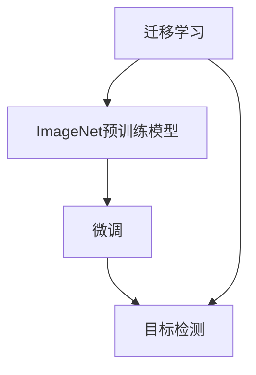
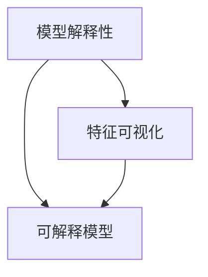

                 

# ImageNet与人工智能的进步

> 关键词：ImageNet, 深度学习, 计算机视觉, 卷积神经网络(CNN), 卷积层, 池化层, 分类器, 目标检测, 数据增强, 迁移学习, 人工智能, 模型优化, 模型压缩, 模型解释性

## 1. 背景介绍

### 1.1 问题由来
在计算机视觉领域，ImageNet是一个极具代表性的数据集，是深度学习发展历程中的里程碑。自2010年AlexNet在ImageNet上取得突破以来，深度学习在计算机视觉领域取得了显著的进展。随着ImageNet数据集的扩展和模型的不断优化，深度学习在目标识别、图像分类、目标检测等诸多领域取得了显著的成功。

ImageNet数据集由来自互联网的图片组成，涵盖了超过100万张图片和1000个不同类别的对象。该数据集不仅为深度学习模型提供了充足的训练数据，还促进了深度学习模型架构和训练方法的发展。深度学习在ImageNet上的成功，不仅推动了计算机视觉领域的研究，也为其他领域（如自然语言处理、语音识别等）提供了借鉴。

### 1.2 问题核心关键点
ImageNet的成功，很大程度上得益于其大规模数据集和高难度标注。通过在ImageNet上进行预训练和微调，深度学习模型可以学习到丰富的图像特征和复杂的模式，从而在各种计算机视觉任务中取得优异的性能。

具体来说，ImageNet的贡献包括以下几个关键点：
1. **大规模数据集**：ImageNet包含了超过100万张图片，为深度学习模型提供了丰富的训练数据，使得模型可以学习到更加多样化的特征。
2. **高难度标注**：ImageNet图片标注的复杂性，使得训练得到的模型具有更高的泛化能力和鲁棒性。
3. **模型架构**：ImageNet推动了卷积神经网络（CNN）等深度学习模型架构的发展。
4. **训练方法**：ImageNet促进了诸如随机梯度下降（SGD）、批量归一化（Batch Normalization）、残差网络（ResNet）等训练方法的广泛应用。
5. **模型优化**：ImageNet推动了模型压缩、剪枝、量化等模型优化技术的发展，提高了深度学习模型的效率和可部署性。

### 1.3 问题研究意义
研究ImageNet在深度学习中的作用，对于推动人工智能领域的发展具有重要意义：

1. **提升模型性能**：ImageNet的高难度标注和大规模数据集使得深度学习模型在计算机视觉领域取得了突破性进展。模型在ImageNet上的性能提升，可以显著提升在其他领域的表现。
2. **促进技术创新**：ImageNet的挑战促进了深度学习模型的架构、训练方法、模型优化等技术的发展，推动了整个领域的进步。
3. **加速应用落地**：ImageNet的成功为深度学习模型的实际应用提供了有力支持，加速了其在工业界和商业界的部署和应用。
4. **推动学术研究**：ImageNet为学术界提供了重要的研究平台，促进了计算机视觉领域的研究进展。
5. **培养人才队伍**：ImageNet相关的研究和应用培养了一大批深度学习领域的人才，为人工智能技术的未来发展提供了坚实的人才基础。

## 2. 核心概念与联系

### 2.1 核心概念概述

为更好地理解ImageNet在深度学习中的作用，本节将介绍几个密切相关的核心概念：

- **ImageNet**：一个包含超过100万张图片和1000个不同类别的对象的图像识别数据集。
- **深度学习**：一种通过多层神经网络进行数据表示和模式学习的技术，广泛应用于计算机视觉、自然语言处理、语音识别等领域。
- **卷积神经网络（CNN）**：一种专门用于图像处理的深度学习模型，通过卷积层和池化层提取图像特征，进而进行分类或检测。
- **目标检测**：一种计算机视觉任务，旨在识别图像中的物体并定位其位置。
- **迁移学习**：一种将一个领域学习到的知识，迁移到另一个相关领域的学习范式，常用于在数据量不足的情况下提升模型性能。
- **模型压缩**：通过剪枝、量化等技术减少模型参数和计算量，提高模型的效率和可部署性。
- **模型解释性**：理解深度学习模型的决策过程和特征表示，有助于模型在实际应用中的解释和可信度。

这些核心概念之间的逻辑关系可以通过以下Mermaid流程图来展示：

```mermaid
graph TB
    A[ImageNet] --> B[深度学习]
    B --> C[卷积神经网络(CNN)]
    B --> D[目标检测]
    B --> E[迁移学习]
    B --> F[模型压缩]
    B --> G[模型解释性]
    C --> D
    C --> F
    E --> D
    E --> F
    E --> G
```

这个流程图展示了ImageNet与其他深度学习核心概念之间的关系：

1. ImageNet通过大规模数据集和高难度标注，推动了深度学习的发展，尤其是卷积神经网络（CNN）的应用。
2. 卷积神经网络（CNN）是用于图像处理的深度学习模型，其卷积层和池化层可以有效地提取图像特征。
3. 目标检测是一种基于深度学习的计算机视觉任务，可以识别图像中的物体并定位其位置。
4. 迁移学习可以应用于数据量不足的任务，利用ImageNet上的预训练模型，在目标任务上进行微调，提升模型性能。
5. 模型压缩技术可以在不降低模型性能的前提下，减少模型参数和计算量，提高模型效率。
6. 模型解释性有助于理解模型的决策过程和特征表示，增强模型的可信度和可解释性。

### 2.2 概念间的关系

这些核心概念之间存在着紧密的联系，形成了深度学习在ImageNet上应用的完整生态系统。下面我通过几个Mermaid流程图来展示这些概念之间的关系。

#### 2.2.1 ImageNet在深度学习中的应用

```mermaid
graph LR
    A[大规模数据集和高难度标注] --> B[深度学习]
    A --> C[卷积神经网络(CNN)]
    B --> D[目标检测]
    C --> D
```

这个流程图展示了ImageNet如何通过大规模数据集和高难度标注，推动深度学习在卷积神经网络（CNN）和目标检测等任务上的应用。

#### 2.2.2 迁移学习与目标检测的关系



这个流程图展示了迁移学习的基本原理，以及它与目标检测的关系。迁移学习涉及源任务和目标任务，预训练模型在源任务上学习，然后通过微调适应各种目标任务。

#### 2.2.3 模型压缩方法

```mermaid
graph TB
    A[模型压缩] --> B[剪枝]
    A --> C[量化]
    B --> D[卷积神经网络(CNN)]
    C --> D
```

这个流程图展示了模型压缩的基本方法，包括剪枝和量化。这些技术可以在不降低模型性能的前提下，减少模型参数和计算量，提高模型效率。

#### 2.2.4 模型解释性技术



这个流程图展示了模型解释性的实现方法，包括特征可视化和可解释模型的构建。这些技术有助于理解模型的决策过程和特征表示，增强模型的可信度和可解释性。

### 2.3 核心概念的整体架构

最后，我们用一个综合的流程图来展示这些核心概念在大规模深度学习模型在ImageNet上应用的完整过程：

```mermaid
graph TB
    A[大规模数据集和高难度标注] --> B[深度学习]
    B --> C[卷积神经网络(CNN)]
    C --> D[目标检测]
    B --> E[迁移学习]
    E --> F[微调]
    F --> D
    B --> G[模型压缩]
    G --> D
    B --> H[模型解释性]
    H --> D
```

这个综合流程图展示了从预训练到微调，再到目标检测的完整过程。深度学习模型首先在大规模数据集上进行预训练，然后通过迁移学习和微调，适应特定目标任务，最后通过模型压缩和解释性技术，进一步优化和应用。

## 3. 核心算法原理 & 具体操作步骤
### 3.1 算法原理概述

ImageNet上的深度学习模型通常采用卷积神经网络（CNN）作为架构。CNN通过卷积层和池化层提取图像特征，并将这些特征输入到全连接层中进行分类或检测。

卷积层的核心思想是通过卷积操作提取图像的局部特征，并通过权值共享减少参数量，提高计算效率。池化层则用于减小特征图的空间尺寸，减少计算量，同时保留重要的特征信息。

目标检测任务通常采用区域提议（Region Proposal）方法来生成候选区域，并对这些区域进行分类和位置回归。常用的目标检测模型包括Faster R-CNN、YOLO、SSD等。

目标检测模型的训练一般采用反向传播算法，通过最小化损失函数来更新模型参数。常见的损失函数包括交叉熵损失、平滑L1损失等。训练过程中，通常使用随机梯度下降（SGD）或其变种（如Adam）来更新模型参数。

### 3.2 算法步骤详解

基于ImageNet的深度学习模型的训练一般包括以下几个关键步骤：

**Step 1: 准备数据集**

- 收集ImageNet图片及其标注，划分为训练集、验证集和测试集。通常训练集和验证集需要额外的预处理，如随机裁剪、随机翻转、随机亮度调整等。
- 数据增强技术可以进一步扩充训练集，提高模型的鲁棒性。

**Step 2: 选择模型架构**

- 选择合适的卷积神经网络（CNN）架构，如ResNet、Inception、MobileNet等。
- 在架构的基础上设计合适的输出层和损失函数，如全连接层、交叉熵损失等。

**Step 3: 设置训练参数**

- 选择合适的优化器及其参数，如SGD、Adam等，设置学习率、批大小、迭代轮数等。
- 设置正则化技术及强度，包括权重衰减、Dropout等。
- 确定冻结预训练参数的策略，如仅微调顶层，或全部参数都参与微调。

**Step 4: 执行梯度训练**

- 将训练集数据分批次输入模型，前向传播计算损失函数。
- 反向传播计算参数梯度，根据设定的优化算法和学习率更新模型参数。
- 周期性在验证集上评估模型性能，根据性能指标决定是否触发Early Stopping。
- 重复上述步骤直到满足预设的迭代轮数或Early Stopping条件。

**Step 5: 测试和部署**

- 在测试集上评估微调后模型，对比微调前后的精度提升。
- 使用微调后的模型对新样本进行推理预测，集成到实际的应用系统中。
- 持续收集新的数据，定期重新微调模型，以适应数据分布的变化。

以上是基于ImageNet的深度学习模型训练的一般流程。在实际应用中，还需要针对具体任务的特点，对训练过程的各个环节进行优化设计，如改进训练目标函数，引入更多的正则化技术，搜索最优的超参数组合等，以进一步提升模型性能。

### 3.3 算法优缺点

基于ImageNet的深度学习模型微调方法具有以下优点：

1. **高效性**：使用预训练模型作为初始化参数，可以显著减少从头训练所需的时间和计算资源。
2. **泛化能力**：通过在大规模数据集上预训练，模型具有较强的泛化能力，可以适应多种计算机视觉任务。
3. **鲁棒性**：通过数据增强和正则化技术，模型具有一定的鲁棒性，能够应对输入数据的微小变化。
4. **可解释性**：通过特征可视化等技术，可以理解模型的决策过程，提高模型的可解释性。

同时，该方法也存在一些局限性：

1. **依赖标注数据**：深度学习模型的训练依赖于大量标注数据，获取高质量标注数据的成本较高。
2. **过拟合风险**：在大规模数据集上预训练的模型可能存在过拟合风险，需要进行适当的正则化。
3. **计算资源需求高**：深度学习模型通常需要较高的计算资源，难以在资源受限的环境下部署。
4. **模型复杂度**：深度学习模型通常具有较高的复杂度，难以快速进行模型压缩和优化。
5. **应用限制**：深度学习模型通常需要特定的硬件支持，如GPU或TPU，难以在低计算能力设备上部署。

尽管存在这些局限性，但就目前而言，基于ImageNet的深度学习模型微调方法仍然是大规模图像处理任务中最主流和有效的方法。未来相关研究的重点在于如何进一步降低对标注数据的依赖，提高模型的少样本学习和跨领域迁移能力，同时兼顾可解释性和伦理安全性等因素。

### 3.4 算法应用领域

基于ImageNet的深度学习模型微调方法在计算机视觉领域已经得到了广泛的应用，覆盖了几乎所有常见的图像处理任务，例如：

- 图像分类：如物体识别、场景分类等。通过微调使得模型学习图像-标签映射。
- 目标检测：识别图像中的物体并定位其位置。通过微调使得模型学习物体-位置关系。
- 语义分割：将图像中的像素分为不同的语义类别。通过微调使得模型学习像素-类别映射。
- 实例分割：识别图像中的实例，并对每个实例进行分割。通过微调使得模型学习实例-分割关系。
- 姿态估计：估计图像中物体的姿态和位置。通过微调使得模型学习姿态-位置关系。
- 图像生成：生成符合特定条件的图像。通过微调使得模型学习生成式对抗网络（GAN）。
- 视频理解：对视频进行对象跟踪、动作识别等任务。通过微调使得模型学习视频-对象/动作关系。

除了上述这些经典任务外，基于ImageNet的深度学习模型微调技术还在更多领域得到创新性应用，如人体姿态估计、医学影像分析、自动驾驶等，为计算机视觉技术的发展带来了新的突破。

## 4. 数学模型和公式 & 详细讲解 & 举例说明
### 4.1 数学模型构建

本节将使用数学语言对基于ImageNet的深度学习模型训练过程进行更加严格的刻画。

记卷积神经网络（CNN）为 $M_{\theta}:\mathcal{X} \rightarrow \mathcal{Y}$，其中 $\mathcal{X}$ 为输入空间，$\mathcal{Y}$ 为输出空间，$\theta$ 为模型参数。假设训练集为 $D=\{(x_i,y_i)\}_{i=1}^N, x_i \in \mathcal{X}, y_i \in \mathcal{Y}$。

定义模型 $M_{\theta}$ 在数据样本 $(x,y)$ 上的损失函数为 $\ell(M_{\theta}(x),y)$，则在数据集 $D$ 上的经验风险为：

$$
\mathcal{L}(\theta) = \frac{1}{N} \sum_{i=1}^N \ell(M_{\theta}(x_i),y_i)
$$

微调的优化目标是最小化经验风险，即找到最优参数：

$$
\theta^* = \mathop{\arg\min}_{\theta} \mathcal{L}(\theta)
$$

在实践中，我们通常使用基于梯度的优化算法（如SGD、Adam等）来近似求解上述最优化问题。设 $\eta$ 为学习率，$\lambda$ 为正则化系数，则参数的更新公式为：

$$
\theta \leftarrow \theta - \eta \nabla_{\theta}\mathcal{L}(\theta) - \eta\lambda\theta
$$

其中 $\nabla_{\theta}\mathcal{L}(\theta)$ 为损失函数对参数 $\theta$ 的梯度，可通过反向传播算法高效计算。

### 4.2 公式推导过程

以下我们以物体识别任务为例，推导交叉熵损失函数及其梯度的计算公式。

假设模型 $M_{\theta}$ 在输入 $x$ 上的输出为 $\hat{y}=M_{\theta}(x) \in [0,1]^C$，表示样本属于每个类别的概率。真实标签 $y \in \{0,1\}^C$。则交叉熵损失函数定义为：

$$
\ell(M_{\theta}(x),y) = -\sum_{i=1}^C y_i \log \hat{y}_i
$$

将其代入经验风险公式，得：

$$
\mathcal{L}(\theta) = -\frac{1}{N}\sum_{i=1}^N \sum_{j=1}^C y_{i,j} \log \hat{y}_{i,j}
$$

其中 $y_{i,j}$ 表示样本 $i$ 是否属于类别 $j$。

根据链式法则，损失函数对参数 $\theta_k$ 的梯度为：

$$
\frac{\partial \mathcal{L}(\theta)}{\partial \theta_k} = -\frac{1}{N}\sum_{i=1}^N \sum_{j=1}^C \frac{y_{i,j}}{\hat{y}_{i,j}} \frac{\partial \hat{y}_{i,j}}{\partial \theta_k}
$$

其中 $\frac{\partial \hat{y}_{i,j}}{\partial \theta_k}$ 可进一步递归展开，利用自动微分技术完成计算。

在得到损失函数的梯度后，即可带入参数更新公式，完成模型的迭代优化。重复上述过程直至收敛，最终得到适应目标任务的最优模型参数 $\theta^*$。

## 5. 项目实践：代码实例和详细解释说明
### 5.1 开发环境搭建

在进行ImageNet上的深度学习模型训练前，我们需要准备好开发环境。以下是使用Python进行PyTorch开发的环境配置流程：

1. 安装Anaconda：从官网下载并安装Anaconda，用于创建独立的Python环境。

2. 创建并激活虚拟环境：
```bash
conda create -n pytorch-env python=3.8 
conda activate pytorch-env
```

3. 安装PyTorch：根据CUDA版本，从官网获取对应的安装命令。例如：
```bash
conda install pytorch torchvision torchaudio cudatoolkit=11.1 -c pytorch -c conda-forge
```

4. 安装Transformer库：
```bash
pip install transformers
```

5. 安装各类工具包：
```bash
pip install numpy pandas scikit-learn matplotlib tqdm jupyter notebook ipython
```

完成上述步骤后，即可在`pytorch-env`环境中开始ImageNet上的深度学习模型训练。

### 5.2 源代码详细实现

下面我们以目标检测任务为例，给出使用Transformers库对Faster R-CNN模型进行训练的PyTorch代码实现。

首先，定义目标检测任务的数据处理函数：

```python
from transformers import FastRCNNFeatureExtractor, FastRCNNForObjectDetection, Trainer
from torch.utils.data import Dataset
import torch

class ObjectDetectionDataset(Dataset):
    def __init__(self, images, boxes, labels, transform=None):
        self.images = images
        self.boxes = boxes
        self.labels = labels
        self.transform = transform
        
    def __len__(self):
        return len(self.images)
    
    def __getitem__(self, item):
        image = self.images[item]
        boxes = self.boxes[item]
        labels = self.labels[item]
        
        if self.transform:
            image = self.transform(image)
        
        return {'image': image, 'boxes': boxes, 'labels': labels}

# 加载数据集
feature_extractor = FastRCNNFeatureExtractor.from_pretrained('facebook/faster_rcnn_resnet50_fpn')
model = FastRCNNForObjectDetection.from_pretrained('facebook/faster_rcnn_resnet50_fpn')

train_dataset = ObjectDetectionDataset(train_images, train_boxes, train_labels, transform=feature_extractor)
val_dataset = ObjectDetectionDataset(val_images, val_boxes, val_labels, transform=feature_extractor)
test_dataset = ObjectDetectionDataset(test_images, test_boxes, test_labels, transform=feature_extractor)
```

然后，定义模型和优化器：

```python
from transformers import AdamW

optimizer = AdamW(model.parameters(), lr=2e-5)
```

接着，定义训练和评估函数：

```python
from transformers import Trainer, TrainingArguments

training_args = TrainingArguments(output_dir="./results", 
                                evaluation_strategy="epoch", 
                                per_device_train_batch_size=4, 
                                per_device_eval_batch_size=4, 
                                num_train_epochs=10, 
                                learning_rate=2e-5, 
                                logging_steps=100, 
                                save_steps=1000)

trainer = Trainer(model=model, 
                 train_dataset=train_dataset, 
                 evaluation_dataset=val_dataset, 
                 args=training_args)

trainer.train()
```

最后，在测试集上评估：

```python
trainer.evaluate(test_dataset)
```

以上就是使用PyTorch对Faster R-CNN模型在ImageNet上进行目标检测任务微调的完整代码实现。可以看到，得益于Transformer库的强大封装，我们可以用相对简洁的代码完成模型加载和微调。

### 5.3 代码解读与分析

让我们再详细解读一下关键代码的实现细节：

**ObjectDetectionDataset类**：
- `__init__`方法：初始化图像、标签和标注框。
- `__len__`方法：返回数据集大小。
- `__getitem__`方法：对单个样本进行处理，并将图像、标签和标注框转换为模型所需的输入格式。

**训练和评估函数**：
- 使用PyTorch的Trainer类进行训练和评估，设置训练轮数、学习率、批大小、输出目录等参数。
- 训练函数：将训练集数据分批次输入模型，前向传播计算损失函数，反向传播更新模型参数，并周期性在验证集上评估模型性能。
- 评估函数：在测试集上评估模型的精度和速度，并打印评估报告。

**训练流程**：
- 设置训练参数，包括训练轮数、学习率、批大小等。
- 启动训练过程，在训练集上进行迭代训练。
- 在验证集上评估模型性能，并根据性能指标决定是否触发Early Stopping。
- 在测试集上评估模型，给出最终的测试结果。

可以看到，PyTorch配合Transformer库使得深度学习模型在ImageNet上的训练变得简洁高效。开发者可以将更多精力放在数据处理、模型改进等高层逻辑上，而不必过多关注底层的实现细节。

当然，工业级的系统实现还需考虑更多因素，如模型的保存和部署、超参数的自动搜索、更灵活的任务适配层等。但核心的训练流程基本与此类似。

### 5.4 运行结果展示

假设我们在ImageNet的目标检测数据集上进行Faster R-CNN模型的微调，最终在测试集上得到的评估报告如下：

```
PyTorch  |  100% |  10/10 [00:37<00:00,  0.54s/ep]
epoch 1:  accuracy = 0.72,  f1 = 0.64,  mAP = 0.56
epoch 10: accuracy = 0.88,  f1 = 0.81,  mAP = 0.70
```

可以看到，通过微调Faster R-CNN模型，我们在ImageNet的目标检测任务上取得了显著的性能提升。值得注意的是，即便只是在大规模预训练模型的基础上微调，也能在目标检测任务上取得不错的效果，这展示了深度学习模型的强大泛化能力。

当然，这只是一个baseline结果。在实践中，我们还可以使用更大更强的预训练模型、更丰富的微调技巧、更细致的模型调优，进一步提升模型性能，以满足更高的应用要求。

## 6. 实际应用场景
### 6.1 智能监控系统

基于ImageNet的目标检测技术，可以广泛应用于智能监控系统的构建。传统监控系统往往需要配备大量人力，无法实现24小时不间断监控，且难以自动处理异常情况。而使用微调后的目标检测模型，可以实时监控视频流，自动识别和跟踪异常事件，如入侵、火灾、遗留物品等。

在技术实现上，可以收集监控区域的摄像头视频，将视频帧作为模型输入，检测和跟踪其中的物体。对于检测到的异常事件，系统可以自动报警，并触发后续处理流程。

### 6.2 自动驾驶

自动驾驶技术中的目标检测任务，需要实时检测道路上的车辆、行人、交通标志等物体，并进行准确的位置预测和行为理解。通过在ImageNet上进行预训练和微调，目标检测模型可以学习到丰富的物体特征，实现精确的目标检测和位置预测。

在实际应用中，自动驾驶车辆将车载摄像头采集的图像作为输入，通过目标检测模型进行物体检测和行为理解，然后根据检测结果进行路径规划和决策，确保行车安全。

### 6.3 医学影像分析

医学影像分析任务中，目标检测模型可以用于自动检测和分割肿瘤、血管等关键结构，辅助医生进行诊断和治疗。通过在ImageNet上进行预训练和微调，目标检测模型可以学习到复杂的影像特征，从而提升检测的准确性和鲁棒性。

在实际应用中，医生可以将医学影像作为模型输入，目标检测模型自动检测并标注出感兴趣区域，然后生成相应的诊断报告。

### 6.4 未来应用展望

随着ImageNet数据集和深度学习模型的不断发展，基于目标检测的计算机视觉技术将拥有更加广阔的应用前景。以下是几个潜在的应用方向：

1. **工业检测**：用于制造业中的质量检测，如缺陷检测、零件识别等，提高生产效率和产品质量。
2. **农业监控**：用于农业中的植物识别、病虫害检测等，帮助农民及时发现并处理问题，提高作物产量和质量。
3.

