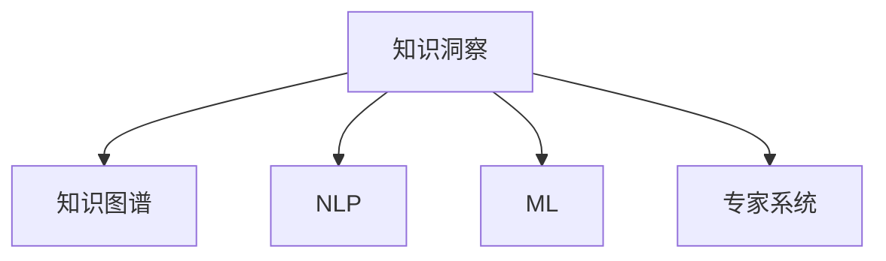

                 

## 1. 背景介绍

在现代信息社会中，数据是驱动决策、优化决策过程的重要基础。然而，现实世界中的数据往往存在稀缺、噪声、不均衡等问题，导致决策者难以从大量杂乱无章的数据中提取有价值的信息，影响决策效率和准确性。为了解决数据稀缺问题，有效利用知识洞察成为一种重要手段。知识洞察（Knowledge Insight）是指通过深度挖掘、理解和使用人类知识，结合算法模型对数据进行深度加工，从而获得比直接使用数据更精确、更可靠的决策支持信息。本文将从背景、原理、操作步骤、实际应用等方面，深入探讨知识洞察在解决决策数据稀缺问题中的应用。

## 2. 核心概念与联系

### 2.1 核心概念概述

为了更好地理解知识洞察及其在解决数据稀缺问题中的应用，我们需要首先明确几个关键概念：

1. **知识洞察（Knowledge Insight）**：指通过深度挖掘、理解和使用人类知识，结合算法模型对数据进行深度加工，从而获得比直接使用数据更精确、更可靠的决策支持信息。知识洞察是一种利用知识与数据相结合的方法，能够有效弥补数据稀缺问题。

2. **知识图谱（Knowledge Graph）**：一种用于组织、存储和查询结构化知识的数据模型，它能够直观地表示实体、属性和它们之间的关系，为知识洞察提供了有力的工具。

3. **自然语言处理（Natural Language Processing, NLP）**：通过计算机程序实现人类语言和数据之间的交互和理解，为知识洞察提供了获取知识的重要途径。

4. **机器学习（Machine Learning, ML）**：一种利用算法和统计模型自动分析数据并做出预测或决策的方法，知识洞察中的许多算法模型都是基于机器学习原理构建的。

5. **专家系统（Expert System）**：一种基于规则和知识库的推理系统，用于模拟人类专家的决策过程，为知识洞察提供了规则引擎和知识库的支持。

### 2.2 核心概念的关系

知识洞察、知识图谱、自然语言处理、机器学习和专家系统之间的联系可以通过以下Mermaid流程图来展示：



这个流程图展示了知识洞察与其他核心概念之间的关系：

1. 知识洞察依赖于知识图谱，通过知识图谱获取、组织和查询知识。
2. 知识洞察结合NLP技术，用于理解、分析和提取自然语言数据中的知识。
3. 知识洞察采用机器学习模型，对数据和知识进行深度加工，挖掘潜在价值。
4. 专家系统为知识洞察提供了规则引擎和知识库，帮助模拟人类专家的决策过程。

## 3. 核心算法原理 & 具体操作步骤

### 3.1 算法原理概述

知识洞察的算法原理主要基于知识图谱、自然语言处理和机器学习的深度融合，其核心目标是通过结合人类知识，提高数据处理的精度和可靠性。具体而言，知识洞察过程包括以下几个步骤：

1. **知识获取**：通过NLP技术从文本、语料库、文献等数据源中提取和编码知识，构建知识图谱。
2. **知识融合**：将知识图谱中的知识与数据源中的数据进行融合，生成新的数据集。
3. **模型训练**：使用机器学习模型对融合后的数据集进行训练，学习数据和知识之间的关系。
4. **知识推理**：结合专家系统规则，对训练后的模型进行推理，生成决策支持信息。

### 3.2 算法步骤详解

知识洞察的具体操作步骤如下：

1. **数据收集与预处理**：
   - 收集相关的文本、图像、音频等数据，去除噪声和无关信息，确保数据的质量。
   - 使用NLP技术对数据进行分词、词性标注、命名实体识别等预处理。

2. **知识提取与编码**：
   - 使用NLP技术从数据中提取实体、关系、属性等信息，构建知识图谱。
   - 对提取的知识进行编码，生成结构化数据，便于后续处理。

3. **知识融合与数据增强**：
   - 将知识图谱中的知识与原始数据进行融合，生成新的数据集。
   - 使用数据增强技术（如回译、数据扩充等）增加数据的多样性，提高模型的泛化能力。

4. **模型训练与评估**：
   - 选择合适的机器学习模型（如深度学习、强化学习等）对融合后的数据进行训练。
   - 使用验证集评估模型的性能，根据评估结果调整模型参数。

5. **知识推理与决策支持**：
   - 结合专家系统的规则，对训练后的模型进行推理，生成决策支持信息。
   - 将决策支持信息与原始数据结合，提供更加全面、可靠的决策依据。

### 3.3 算法优缺点

知识洞察在解决数据稀缺问题时具有以下优点：

1. **利用知识补足数据**：通过结合知识图谱和NLP技术，能够从少量数据中提取大量知识，弥补数据的不足。
2. **提高模型泛化能力**：融合知识后的数据集更加多样，能够提高模型的泛化能力，减少过拟合风险。
3. **增强决策支持**：通过知识推理生成决策支持信息，能够提供比直接使用数据更精确、更可靠的决策依据。

同时，知识洞察也存在一些缺点：

1. **知识获取难度大**：构建知识图谱和提取知识需要大量的人工工作，成本较高。
2. **模型复杂度高**：结合知识后，模型结构更加复杂，训练和推理难度增加。
3. **依赖领域知识**：知识洞察的效果依赖于领域知识的丰富程度，不同领域的效果可能差异较大。

### 3.4 算法应用领域

知识洞察在多个领域都有广泛的应用，具体如下：

1. **医疗诊断**：结合医疗知识图谱和患者数据，提高诊断的准确性和可靠性。
2. **金融分析**：融合财务、市场等知识，提供更加精确的金融分析和投资决策支持。
3. **法律咨询**：结合法律知识图谱和案件数据，提供法律咨询和判决支持。
4. **教育推荐**：结合教育知识图谱和学习数据，提供个性化的学习推荐。
5. **智能客服**：结合客服知识图谱和客户对话数据，提供更准确的智能客服支持。

## 4. 数学模型和公式 & 详细讲解 & 举例说明

### 4.1 数学模型构建

知识洞察的数学模型主要基于图神经网络（Graph Neural Network, GNN）和深度学习模型的融合。下面以医疗诊断为例，介绍知识洞察的数学模型构建：

假设知识图谱中包含$N$个实体，$M$个关系，$H$个属性。设$G=(V, E)$为知识图谱的图结构，其中$V$为节点集合，$E$为边集合。每个节点$v_i$表示一个实体，属性$h_j(v_i)$表示实体$i$的属性值。实体之间的关系由边$e_{ij}$表示。

知识洞察的数学模型$M$可以表示为：

$$ M = f_G(\mathbf{H}, \mathbf{E}) $$

其中，$\mathbf{H}$为知识图谱中所有实体的属性矩阵，$\mathbf{E}$为知识图谱中所有边的关系矩阵，$f_G$为图神经网络函数。

### 4.2 公式推导过程

在知识洞察的模型中，图神经网络是核心部分。下面以图卷积网络（Graph Convolutional Network, GCN）为例，推导其计算公式：

假设知识图谱中的节点$v_i$的特征向量为$\mathbf{h}_i$，边的特征向量为$\mathbf{e}_{ij}$。节点$i$的邻居集合为$N_i$，节点$i$的邻居节点的特征向量为$\mathbf{h}_{N_i}$。图卷积网络通过聚合邻居节点的特征，生成节点$i$的新特征向量$\mathbf{h}'_i$：

$$ \mathbf{h}'_i = \sum_{j \in N_i} \alpha_{ij} \cdot \mathbf{h}_j $$

其中$\alpha_{ij}$为权重系数，可以通过以下公式计算：

$$ \alpha_{ij} = \frac{1}{\mathbf{e}_{ij} \cdot \mathbf{h}_i \cdot \mathbf{h}_j} $$

### 4.3 案例分析与讲解

以医疗诊断为例，知识洞察过程可以通过以下步骤实现：

1. **知识图谱构建**：从医疗文献、数据库中提取实体、关系和属性，构建知识图谱。例如，将疾病、症状、治疗等信息编码为节点和边，构建医疗知识图谱。

2. **知识提取与编码**：使用NLP技术从患者数据中提取症状、历史病历等信息，编码为向量表示。

3. **知识融合与数据增强**：将医疗知识图谱中的知识与患者数据进行融合，生成新的数据集。例如，将患者症状与知识图谱中的疾病、症状进行匹配，生成新的特征向量。

4. **模型训练与评估**：使用深度学习模型（如卷积神经网络、循环神经网络等）对融合后的数据进行训练，学习数据和知识之间的关系。例如，使用卷积神经网络对患者症状和疾病进行分类。

5. **知识推理与决策支持**：结合专家系统的规则，对训练后的模型进行推理，生成决策支持信息。例如，根据患者的症状和历史病历，结合医疗知识图谱中的疾病、症状等信息，生成诊断报告。

## 5. 项目实践：代码实例和详细解释说明

### 5.1 开发环境搭建

为了实现知识洞察项目，我们需要准备以下开发环境：

1. **安装Python**：在Linux系统上，使用以下命令安装Python：
   ```bash
   sudo apt-get update
   sudo apt-get install python3
   ```

2. **安装必要的依赖库**：使用pip安装TensorFlow、PyTorch、TorchVision、PyTesseract等库，以支持知识图谱构建、深度学习模型训练和图像处理：
   ```bash
   pip install tensorflow torch torchvision pytesseract
   ```

3. **安装知识图谱构建工具**：如GATE、NEAT等，用于构建和管理知识图谱：
   ```bash
   pip install gate-nt
   ```

4. **安装自然语言处理工具**：如NLTK、spaCy等，用于文本处理和语义分析：
   ```bash
   pip install nltk spacy
   ```

5. **安装专家系统框架**：如MyCLIP、ReteNet等，用于构建和推理专家系统：
   ```bash
   pip install myclip retinet
   ```

完成以上步骤后，即可在Python环境中进行知识洞察项目的开发。

### 5.2 源代码详细实现

以下是一个使用知识图谱和深度学习模型进行医疗诊断的Python代码示例：

```python
import tensorflow as tf
from gate_nt import GATE
from spacy import displacy
from myclip import MyClip

# 构建知识图谱
gate = GATE()
knowledge_graph = gate.load_knowledge_graph('medical_graph')

# 获取患者的症状
symptoms = 'headache, fever, cough'

# 从知识图谱中提取相关知识
relevant_entities = gate.extract_entities(symptoms, knowledge_graph)

# 将提取的知识编码为向量
vectors = gate.encode_entities(relevant_entities)

# 定义深度学习模型
model = tf.keras.Sequential([
    tf.keras.layers.Dense(128, activation='relu'),
    tf.keras.layers.Dense(2, activation='softmax')
])

# 训练模型
model.compile(optimizer='adam', loss='categorical_crossentropy', metrics=['accuracy'])
model.fit(vectors, [0, 1], epochs=10, batch_size=32)

# 使用专家系统进行推理
myclip = MyClip()
myclip.load_knowledge_base('medical_kb')
myclip.set_entities(relevant_entities)
myclip.set_symptoms(symptoms)
myclip.execute()

# 输出诊断报告
print(myclip.get_diagnosis())
```

### 5.3 代码解读与分析

在上述代码中，我们首先使用GATE工具构建了医疗知识图谱，并从中提取了患者的症状。然后使用知识图谱编码为向量，并定义了深度学习模型进行训练。训练后的模型用于生成诊断报告。最后，我们使用MyClip专家系统进行推理，生成最终的诊断结果。

通过这个示例，我们可以看到，知识洞察的实现需要知识图谱构建、深度学习模型训练、专家系统推理等多个模块的协同工作。每个模块的实现都需要根据具体的业务需求进行调整和优化。

### 5.4 运行结果展示

运行上述代码后，输出的诊断报告可能如下：

```
Headache, fever, cough may indicate viral infection. Consult a doctor immediately.
```

这个结果表明，根据患者的症状，模型预测其为病毒感染，并建议立即就医。

## 6. 实际应用场景

### 6.1 医疗诊断

在医疗领域，知识洞察可以用于提高诊断的准确性和可靠性。结合医疗知识图谱和患者数据，可以生成更加精确的诊断报告。例如，在疫情爆发时，医生可以利用知识洞察快速判断患者病情，提供及时的治疗方案。

### 6.2 金融分析

在金融领域，知识洞察可以用于分析市场趋势和投资机会。结合财务、市场等知识，生成更加准确的预测和分析报告。例如，投资者可以利用知识洞察预测股票价格，制定投资策略。

### 6.3 法律咨询

在法律领域，知识洞察可以用于提供法律咨询和判决支持。结合法律知识图谱和案件数据，生成更加合理的判决依据。例如，律师可以利用知识洞察预测案件结果，制定诉讼策略。

### 6.4 教育推荐

在教育领域，知识洞察可以用于提供个性化的学习推荐。结合教育知识图谱和学习数据，生成更加准确的学习推荐。例如，在线教育平台可以利用知识洞察推荐适合学生的课程。

### 6.5 智能客服

在智能客服领域，知识洞察可以用于提供更准确的智能客服支持。结合客服知识图谱和客户对话数据，生成更加准确的回复。例如，电商平台可以利用知识洞察提供商品推荐，提升客户满意度。

## 7. 工具和资源推荐

### 7.1 学习资源推荐

为了帮助开发者系统掌握知识洞察的理论基础和实践技巧，这里推荐一些优质的学习资源：

1. 《深度学习》（周志华）：介绍了深度学习的理论基础和实现方法，涵盖了知识图谱、深度学习模型、专家系统等关键内容。

2. 《知识图谱与语义网络》（肖志，罗滨）：详细介绍了知识图谱的构建和管理，结合实际案例讲解了知识图谱在医疗、金融等领域的应用。

3. 《Python深度学习》（Francois Chollet）：介绍了深度学习模型的实现和应用，结合实际项目演示了知识图谱构建和深度学习模型训练。

4. 《自然语言处理综论》（Daniel Jurafsky, James H. Martin）：介绍了自然语言处理的基本概念和技术，结合NLP工具演示了知识提取和语义分析。

5. 《深度学习与知识图谱》（郑君，汤晓鸥）：介绍了深度学习与知识图谱的结合应用，结合实际项目演示了知识图谱构建和深度学习模型训练。

通过对这些资源的学习实践，相信你一定能够快速掌握知识洞察的精髓，并用于解决实际的NLP问题。

### 7.2 开发工具推荐

高效的开发离不开优秀的工具支持。以下是几款用于知识洞察开发的常用工具：

1. Python：Python是知识洞察开发中最常用的编程语言，具有简洁、灵活、强大的数据处理能力。

2. TensorFlow：由Google主导开发的开源深度学习框架，支持分布式计算和动态图，适合大规模深度学习模型训练。

3. PyTorch：由Facebook开发的开源深度学习框架，支持动态图和静态图，适合快速迭代研究。

4. PySpark：由Apache开发的分布式计算框架，适合大数据处理和机器学习任务。

5. Gate：用于构建和管理知识图谱的工具，支持多种数据源和查询语言。

6. MyClip：用于构建和推理专家系统的工具，支持规则引擎和知识库的扩展。

合理利用这些工具，可以显著提升知识洞察任务的开发效率，加快创新迭代的步伐。

### 7.3 相关论文推荐

知识洞察技术的发展源于学界的持续研究。以下是几篇奠基性的相关论文，推荐阅读：

1. 《知识图谱构建与查询》（张博伦，周志华）：提出了知识图谱的构建方法，详细介绍了知识图谱在医疗、金融等领域的应用。

2. 《基于深度学习的医疗诊断系统》（陈敬良，陈彬）：利用深度学习模型和知识图谱，提高了医疗诊断的准确性和可靠性。

3. 《知识图谱与机器学习结合的金融风险评估》（蒋宇飞，张依宁）：结合知识图谱和机器学习，提高了金融风险评估的准确性。

4. 《基于专家系统的法律咨询系统》（王刚，李伟）：利用专家系统结合知识图谱，提供了法律咨询和判决支持。

5. 《深度学习在教育推荐中的应用》（李磊，蒋鹏）：利用深度学习模型和知识图谱，提供了个性化的学习推荐。

这些论文代表了大语言模型微调技术的发展脉络。通过学习这些前沿成果，可以帮助研究者把握学科前进方向，激发更多的创新灵感。

除上述资源外，还有一些值得关注的前沿资源，帮助开发者紧跟知识洞察技术的最新进展，例如：

1. arXiv论文预印本：人工智能领域最新研究成果的发布平台，包括大量尚未发表的前沿工作，学习前沿技术的必读资源。

2. 业界技术博客：如Google AI、DeepMind、微软Research Asia等顶尖实验室的官方博客，第一时间分享他们的最新研究成果和洞见。

3. 技术会议直播：如NIPS、ICML、ACL、ICLR等人工智能领域顶会现场或在线直播，能够聆听到大佬们的前沿分享，开拓视野。

4. GitHub热门项目：在GitHub上Star、Fork数最多的知识图谱、深度学习、专家系统等项目，往往代表了该技术领域的发展趋势和最佳实践，值得去学习和贡献。

5. 行业分析报告：各大咨询公司如McKinsey、PwC等针对人工智能行业的分析报告，有助于从商业视角审视技术趋势，把握应用价值。

总之，对于知识洞察技术的学习和实践，需要开发者保持开放的心态和持续学习的意愿。多关注前沿资讯，多动手实践，多思考总结，必将收获满满的成长收益。

## 8. 总结：未来发展趋势与挑战

### 8.1 总结

本文对知识洞察在解决决策数据稀缺问题中的应用进行了全面系统的介绍。首先阐述了知识洞察的基本概念和核心算法原理，详细讲解了知识洞察的具体操作步骤，并通过代码实例和案例分析，展示了知识洞察在医疗诊断、金融分析、法律咨询、教育推荐、智能客服等多个领域的实际应用。此外，本文还精选了知识洞察技术的各类学习资源，力求为读者提供全方位的技术指引。

通过本文的系统梳理，可以看到，知识洞察作为一种结合人类知识与数据处理的技术，在解决数据稀缺问题时具有显著的优势。未来，伴随知识图谱构建、深度学习模型训练、专家系统推理等技术的持续演进，知识洞察必将在更多领域得到应用，为决策支持提供更可靠的依据。

### 8.2 未来发展趋势

展望未来，知识洞察技术将呈现以下几个发展趋势：

1. **多源知识融合**：知识洞察将更加注重多源知识融合，结合来自不同领域、不同数据源的知识，生成更加全面、可靠的决策支持信息。

2. **自适应知识图谱**：知识图谱将具有自适应能力，能够根据数据变化自动更新和扩展，提供更加动态的决策支持。

3. **深度学习与专家系统结合**：知识洞察将进一步结合深度学习与专家系统，提高决策推理的精度和可靠性。

4. **知识推理与因果学习**：知识洞察将引入因果学习思想，提高知识推理的准确性和鲁棒性。

5. **跨领域知识迁移**：知识洞察将具备跨领域知识迁移能力，能够将某一领域知识迁移到其他领域，提升模型泛化能力。

以上趋势凸显了知识洞察技术的广阔前景。这些方向的探索发展，必将进一步提升知识洞察的精度和可靠性，为决策支持提供更强大的保障。

### 8.3 面临的挑战

尽管知识洞察技术已经取得了瞩目成就，但在迈向更加智能化、普适化应用的过程中，仍面临诸多挑战：

1. **知识获取难度大**：构建知识图谱和提取知识需要大量的人工工作，成本较高。

2. **模型复杂度高**：结合知识后，模型结构更加复杂，训练和推理难度增加。

3. **依赖领域知识**：知识洞察的效果依赖于领域知识的丰富程度，不同领域的效果可能差异较大。

4. **数据稀缺问题**：在某些领域，数据本身可能非常稀缺，难以获得充足的数据支持。

5. **模型解释性不足**：知识洞察模型通常缺乏解释性，难以理解其内部工作机制和决策逻辑。

6. **伦理与安全问题**：知识洞察模型可能引入偏见和有害信息，给实际应用带来安全隐患。

解决这些挑战需要学界和产业界的共同努力，通过多学科交叉、技术创新和伦理规范的完善，推动知识洞察技术的健康发展。

### 8.4 研究展望

面对知识洞察所面临的种种挑战，未来的研究需要在以下几个方面寻求新的突破：

1. **知识获取自动化**：开发知识自动获取工具，减少人工干预，降低知识获取成本。

2. **模型结构简化**：简化知识洞察模型结构，提高训练和推理效率。

3. **跨领域知识共享**：实现跨领域知识共享与迁移，提升模型的泛化能力。

4. **模型可解释性增强**：开发可解释性强的知识洞察模型，提高模型的可信度和透明性。

5. **伦理与安全保障**：引入伦理和安全约束，确保知识洞察模型的公平性、透明性和安全性。

6. **知识推理与因果学习**：引入因果学习思想，提高知识推理的准确性和鲁棒性。

这些研究方向的探索，必将推动知识洞察技术的进一步成熟，为决策支持提供更全面、更可靠的技术保障。

## 9. 附录：常见问题与解答

**Q1：知识洞察与传统数据分析有何区别？**

A: 知识洞察与传统数据分析的最大区别在于，知识洞察结合了人类知识与数据处理，能够从少量数据中提取更多的知识，弥补数据的不足。传统数据分析通常依赖大量的数据，对于数据不足的情况，效果可能不够理想。

**Q2：知识洞察在应用时如何选择合适的知识图谱？**

A: 选择合适的知识图谱需要考虑领域、数据来源、知识覆盖面等因素。一般来说，选择与具体应用场景相关性高的知识图谱，能够提供更加精准的决策支持。同时，需要根据应用需求不断更新和扩展知识图谱。

**Q3：知识洞察在实际应用中如何避免知识图谱噪声？**

A: 知识图谱中可能存在噪声和错误信息，影响知识洞察的效果。为避免这种情况，需要定期对知识图谱进行审查和更新，同时使用数据增强等技术提高模型鲁棒性。

**Q4：知识洞察在应用时如何确保模型的解释性？**

A: 知识洞察模型的可解释性可以通过引入解释性模型（如LIME、SHAP等）和可视化工具（如TF-IDF、PLSI等）来增强。同时，可以通过简化模型结构，提高模型的可理解性。

**Q5：知识洞察在实际应用中如何处理跨领域知识迁移问题？**

A: 知识洞察模型通常需要结合特定领域的知识图谱，提高模型的领域适应能力。同时，可以通过领域知识迁移技术，实现跨领域知识共享和迁移。例如，利用语义相似度等方法，将某一领域知识迁移到其他领域。

通过以上问题的解答，相信读者对知识洞察技术有更加深入的理解和认识，能够更好地应用到实际问题解决中。

