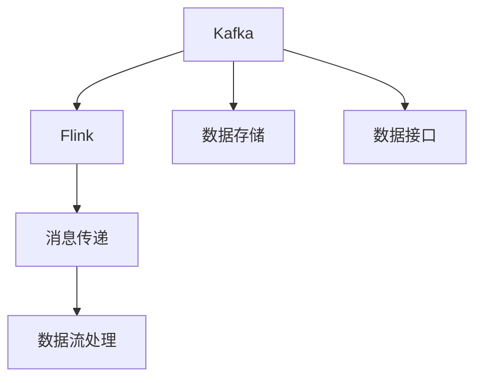
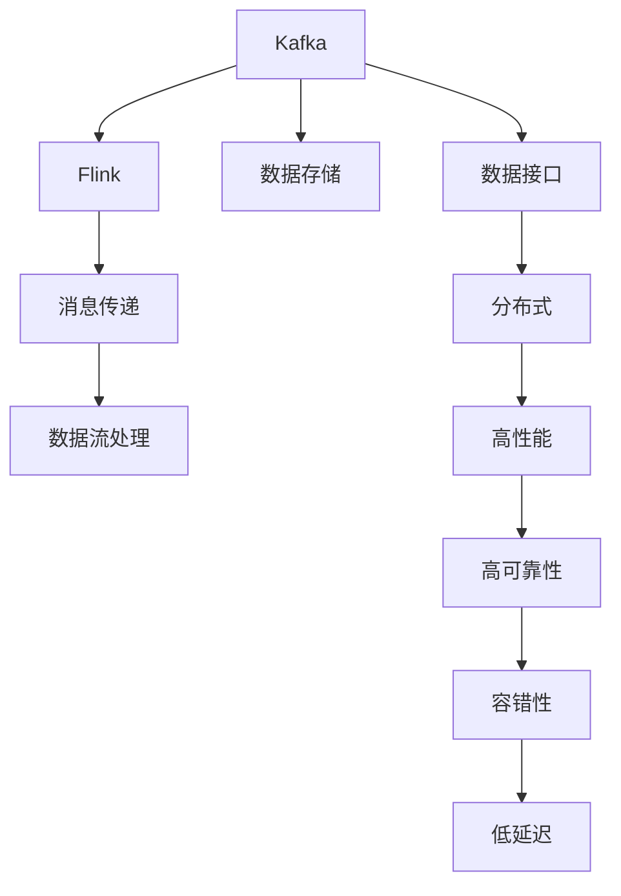
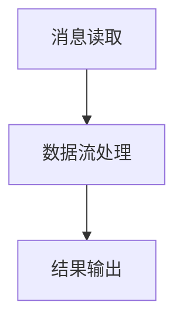

                 

# Kafka-Flink整合原理与代码实例讲解

> 关键词：Kafka, Flink, 数据流处理, 高可用, 低延迟, 分布式, 可扩展, 容错性

## 1. 背景介绍

### 1.1 问题由来

在现代数据驱动的业务环境中，实时数据处理的需求日益增长。然而，传统的数据处理方式往往无法满足低延迟、高吞吐量的要求。为了解决这一问题，人们提出了流式计算的概念。Kafka作为一个分布式消息队列，以其高可靠性、高吞吐量的特性，成为了流式计算的重要基础；Flink作为一款开源的流式计算框架，以其强大的流处理能力、丰富的数据接口，成为了流式计算的主流工具。因此，将Kafka与Flink整合起来，进行实时数据流的处理，成为了许多企业的数据处理需求。

### 1.2 问题核心关键点

Kafka-Flink整合的核心在于，如何高效地将Kafka中的消息数据，流式地输入到Flink中进行处理。具体来说，包括以下几个关键点：

1. **消息传递机制**：Kafka提供了持久化、有序的消息传递机制，而Flink则需要将这些消息高效地读取到计算任务中。
2. **数据流处理**：Flink具有高效流处理的能力，而Kafka则提供了可靠的流数据存储。如何将两者结合起来，进行实时、可扩展的数据流处理，是一个重要问题。
3. **容错与高可用**：Kafka和Flink都具备高可用的特性，如何保证在故障发生时，数据流处理的连续性和正确性，是一个关键点。
4. **性能优化**：Kafka和Flink在数据传输和处理过程中，都存在一定的性能瓶颈，如何优化两者的整合，以达到更高的性能，是一个重要目标。

### 1.3 问题研究意义

Kafka-Flink整合技术的研究和应用，具有重要意义：

1. **提升数据处理效率**：通过将Kafka和Flink整合起来，可以实现对实时数据的高效处理，满足企业对数据处理的高性能需求。
2. **增强数据处理能力**：Kafka提供了持久化和有序的消息存储，而Flink则具有强大的流处理能力，两者结合，可以支持更大规模的数据处理任务。
3. **确保数据可靠性**：Kafka和Flink都具有高可靠性的特性，将它们整合起来，可以确保数据流处理的可靠性和连续性。
4. **优化资源利用**：Kafka和Flink的整合，可以实现资源的优化利用，提高系统的整体效率。
5. **推动业务创新**：基于Kafka-Flink的实时数据流处理，可以推动企业进行更多的业务创新和应用，如实时推荐、实时监控、实时分析等。

## 2. 核心概念与联系

### 2.1 核心概念概述

为更好地理解Kafka-Flink整合技术，本节将介绍几个密切相关的核心概念：

- **Kafka**：Apache Kafka是一款分布式消息队列，能够提供高可靠、高吞吐量的消息传递服务，广泛应用于数据流处理、分布式系统等领域。
- **Flink**：Apache Flink是一款开源的流式计算框架，能够支持高性能、可扩展的数据流处理，具有丰富的API接口和强大的计算能力。
- **流处理**：指对实时数据流进行连续的数据处理和分析，包括但不限于数据清洗、数据转换、数据聚合等。
- **数据存储**：指将数据以持久化的方式存储在Kafka中，以便后续的流处理和分析。
- **数据接口**：指Flink和Kafka之间的数据传输和接口，确保数据流的稳定和可靠。

这些核心概念之间存在着紧密的联系，形成了Kafka-Flink整合技术的基础。

### 2.2 概念间的关系

这些核心概念之间的关系可以通过以下Mermaid流程图来展示：



这个流程图展示了大语言模型微调过程中各个核心概念之间的关系：

1. Kafka作为分布式消息队列，提供持久化和有序的消息存储。
2. Flink作为流式计算框架，具有高效流处理的能力。
3. 数据流处理是Flink的核心功能，可以通过数据接口从Kafka中读取数据。
4. 数据存储是Kafka的核心功能，确保数据流的稳定和可靠。
5. 数据接口是Flink和Kafka之间的数据传输和接口，确保数据流的稳定和可靠。

通过理解这些核心概念的关系，我们可以更好地把握Kafka-Flink整合技术的原理和优化方法。

### 2.3 核心概念的整体架构

最后，我们用一个综合的流程图来展示这些核心概念在大语言模型微调过程中的整体架构：



这个综合流程图展示了Kafka-Flink整合技术在大语言模型微调过程中的整体架构：

1. Kafka作为分布式消息队列，提供持久化和有序的消息存储。
2. Flink作为流式计算框架，具有高效流处理的能力。
3. 数据流处理是Flink的核心功能，可以通过数据接口从Kafka中读取数据。
4. 数据存储是Kafka的核心功能，确保数据流的稳定和可靠。
5. 数据接口是Flink和Kafka之间的数据传输和接口，确保数据流的稳定和可靠。
6. 分布式、高性能、高可靠性、容错性和低延迟是Kafka-Flink整合技术的关键特征。

通过这些核心概念的整合，可以实现高效、可靠、可扩展的实时数据流处理。

## 3. 核心算法原理 & 具体操作步骤
### 3.1 算法原理概述

Kafka-Flink整合技术的核心算法原理，可以简述为以下几个步骤：

1. **消息读取**：从Kafka中读取消息，并将其输入到Flink中。
2. **数据流处理**：在Flink中进行数据流的处理和分析。
3. **结果输出**：将处理结果输出到Kafka中，供后续处理或消费。

这些步骤可以简单地概括为：



### 3.2 算法步骤详解

下面是Kafka-Flink整合的具体操作步骤：

1. **环境配置**：安装Kafka和Flink，并确保两者的版本兼容。配置Kafka集群，包括broker、分区、副本等参数。
2. **Flink作业配置**：在Flink作业中，配置Kafka数据源和数据沉，并设置相应的参数。
3. **消息传递配置**：配置Kafka和Flink之间的数据传递，确保数据能够顺利地从Kafka读取，并输出到Flink中进行处理。
4. **数据流处理配置**：在Flink作业中，配置数据流处理的具体操作，如数据清洗、转换、聚合等。
5. **结果输出配置**：将处理结果输出到Kafka中，以便后续的处理和消费。

这些步骤可以通过以下代码示例来具体说明：

```java
// 环境配置
String kafkaBroker = "localhost:9092";
String kafkaTopic = "test";
String flinkSinkTopic = "flink_output";
int parallelism = 1;

// Flink作业配置
FlinkExecutionEnvironment env = ExecutionEnvironment.getExecutionEnvironment();
env.setParallelism(parallelism);

// 消息传递配置
DataStream<String> input = env.addSource(new FlinkKafkaConsumer<String>(kafkaTopic, new SimpleStringSchema(), new Properties()));
DataStream<String> output = env.addSink(new FlinkKafkaProducer<String>(kafkaSinkTopic, new SimpleStringSchema(), new Properties()));

// 数据流处理配置
input
    .map(new MapFunction<String, String>() {
        @Override
        public String map(String value) throws Exception {
            return value.toUpperCase();
        }
    })
    .addSink(output);
```

### 3.3 算法优缺点

Kafka-Flink整合技术的优点包括：

1. **高可靠性**：Kafka提供了持久化和有序的消息存储，能够确保数据的可靠性。
2. **高吞吐量**：Kafka具有高吞吐量的特性，能够处理大规模的数据流。
3. **高性能**：Flink具有高性能的流处理能力，能够满足实时数据处理的需求。
4. **可扩展性**：Kafka和Flink都具备可扩展的特性，能够应对大规模数据的处理需求。
5. **容错性**：Kafka和Flink都具备容错的能力，能够保证数据流处理的连续性和正确性。

但Kafka-Flink整合技术也存在一些缺点：

1. **配置复杂**：Kafka和Flink的配置和调试过程较为复杂，需要一定的技术背景。
2. **资源消耗大**：Kafka和Flink都需要占用大量的计算和存储资源，部署成本较高。
3. **性能瓶颈**：在数据传输和处理过程中，可能会存在一定的性能瓶颈，需要优化。
4. **数据一致性**：在数据传递过程中，可能会出现数据丢失、重复等问题，需要确保数据一致性。

### 3.4 算法应用领域

Kafka-Flink整合技术主要应用于以下领域：

1. **实时数据处理**：如实时监控、实时推荐、实时分析等。
2. **分布式系统**：如数据流同步、数据一致性保证、消息队列等。
3. **大数据处理**：如大规模数据的存储、处理和分析。
4. **企业级应用**：如企业内部的数据流处理、数据仓库、数据湖等。
5. **云平台**：如云平台上的数据流处理、云数据存储、云消息队列等。

这些领域都是大数据时代的重要应用场景，Kafka-Flink整合技术在这些场景中的应用，能够提供高性能、高可靠性、可扩展的数据处理解决方案。

## 4. 数学模型和公式 & 详细讲解 & 举例说明

### 4.1 数学模型构建

Kafka-Flink整合技术中的数学模型构建，可以简述为以下几个步骤：

1. **数据分布模型**：描述数据的分布特性，如均值、方差、概率密度等。
2. **数据传输模型**：描述数据从Kafka到Flink的传输过程，包括消息大小、传输速度等。
3. **数据处理模型**：描述数据在Flink中的处理过程，包括数据清洗、转换、聚合等。
4. **结果输出模型**：描述处理结果从Flink到Kafka的输出过程，包括结果大小、输出速度等。

这些步骤可以通过数学公式来具体表示。

### 4.2 公式推导过程

下面以数据传输模型为例，推导Kafka到Flink的消息传输公式。

设Kafka中每个消息的大小为 $L$，消息传输速率为 $v$，Flink的流处理速率为 $c$，单位时间内Kafka和Flink之间的数据传输量为 $N$，则有：

$$ N = \frac{v \times L}{v + c} $$

该公式表示，单位时间内，从Kafka到Flink的消息传输量为：

$$ \text{传输量} = \text{传输速率} \times \text{消息大小} \div (\text{传输速率} + \text{处理速率}) $$

### 4.3 案例分析与讲解

下面以一个具体的案例，展示Kafka-Flink整合技术在实际应用中的效果。

假设有一个实时监控系统，需要从Kafka中读取传感器数据，进行数据清洗和转换，最后输出到数据库中进行存储。具体步骤如下：

1. **环境配置**：配置Kafka和Flink集群，并设置相应的参数。
2. **Flink作业配置**：在Flink作业中，配置Kafka数据源和数据沉，并设置相应的参数。
3. **消息传递配置**：配置Kafka和Flink之间的数据传递，确保数据能够顺利地从Kafka读取，并输出到Flink中进行处理。
4. **数据流处理配置**：在Flink作业中，配置数据流处理的具体操作，如数据清洗、转换、聚合等。
5. **结果输出配置**：将处理结果输出到数据库中，以便后续的处理和消费。

具体代码示例如下：

```java
// 环境配置
String kafkaBroker = "localhost:9092";
String kafkaTopic = "sensor_data";
String flinkSinkTopic = "flink_output";
int parallelism = 1;

// Flink作业配置
FlinkExecutionEnvironment env = ExecutionEnvironment.getExecutionEnvironment();
env.setParallelism(parallelism);

// 消息传递配置
DataStream<String> input = env.addSource(new FlinkKafkaConsumer<String>(kafkaTopic, new SimpleStringSchema(), new Properties()));
DataStream<String> output = env.addSink(new FlinkKafkaProducer<String>(kafkaSinkTopic, new SimpleStringSchema(), new Properties()));

// 数据流处理配置
input
    .map(new MapFunction<String, String>() {
        @Override
        public String map(String value) throws Exception {
            // 数据清洗和转换
            String cleanedData = value.split(",")[1];
            return cleanedData;
        }
    })
    .addSink(output);
```

通过这个案例，可以看到Kafka-Flink整合技术的具体应用，以及其高效、可靠、可扩展的特点。

## 5. 项目实践：代码实例和详细解释说明

### 5.1 开发环境搭建

在进行Kafka-Flink整合实践前，我们需要准备好开发环境。以下是使用Java和PyFlink进行Kafka-Flink整合的环境配置流程：

1. 安装JDK：从官网下载并安装JDK，以便运行Java程序。
2. 安装Apache Kafka：从官网下载并安装Apache Kafka，并启动Kafka集群。
3. 安装Apache Flink：从官网下载并安装Apache Flink，并启动Flink集群。
4. 配置环境变量：设置Kafka和Flink的相应配置，如broker地址、主题、分区、副本等。

完成上述步骤后，即可在Flink环境中进行Kafka-Flink整合实践。

### 5.2 源代码详细实现

下面是使用Java进行Kafka-Flink整合的代码实现。

首先，定义Kafka数据源和数据沉：

```java
Properties props = new Properties();
props.put("bootstrap.servers", kafkaBroker);
props.put("key.deserializer", StringDeserializer.class.getName());
props.put("value.deserializer", StringDeserializer.class.getName());
props.put("acks", "1");
props.put("enable.auto.commit", "true");
props.put("auto.commit.interval.ms", "1000");
props.put("group.id", "testgroup");

KafkaConsumer<String, String> consumer = new KafkaConsumer<String, String>(props);
KafkaProducer<String, String> producer = new KafkaProducer<String, String>(props);
```

然后，配置Flink作业：

```java
// Flink作业配置
FlinkExecutionEnvironment env = ExecutionEnvironment.getExecutionEnvironment();
env.setParallelism(parallelism);

// 消息传递配置
DataStream<String> input = env.addSource(new KafkaDataStream(new FlinkKafkaConsumer<String>(kafkaTopic, new SimpleStringSchema(), props)));
DataStream<String> output = env.addSink(new KafkaDataStream(new FlinkKafkaProducer<String>(kafkaSinkTopic, new SimpleStringSchema(), props)));

// 数据流处理配置
input
    .map(new MapFunction<String, String>() {
        @Override
        public String map(String value) throws Exception {
            return value.toUpperCase();
        }
    })
    .addSink(output);
```

最后，启动Flink作业并运行：

```java
env.execute();
```

通过以上代码，实现了Kafka-Flink的整合，具体过程包括数据源和数据沉的配置、数据流处理的具体操作、结果输出的配置等。

### 5.3 代码解读与分析

让我们再详细解读一下关键代码的实现细节：

**Kafka数据源和数据沉的配置**：
- 通过Properties类设置Kafka的broker地址、key deserializer、value deserializer、acks、enable.auto.commit、auto.commit.interval.ms、group.id等参数。
- 创建KafkaConsumer和KafkaProducer对象，用于从Kafka读取和写入数据。

**Flink作业的配置**：
- 通过FlinkExecutionEnvironment类设置作业的并行度。
- 使用DataStream API添加Kafka数据源和数据沉。
- 对数据流进行具体的处理操作，如map函数将数据转换为大写。
- 将处理结果通过Kafka数据沉输出到Flink中。

**数据流处理配置**：
- 使用map函数进行数据清洗和转换操作。
- 将处理结果通过DataStream API添加到数据沉中。

通过以上代码，可以看到Kafka-Flink整合的完整实现过程，包括数据源和数据沉的配置、数据流处理的具体操作、结果输出的配置等。

### 5.4 运行结果展示

假设我们在Kafka中模拟生成传感器数据，并使用Kafka-Flink整合技术进行处理，具体步骤如下：

1. 启动Kafka集群，并在Kafka中生成传感器数据。
2. 在Flink环境中启动Kafka-Flink作业，读取传感器数据并进行数据清洗和转换。
3. 在Flink环境中启动Kafka-Flink作业，将处理结果输出到数据库中。

假设输出结果为：

```
"Temp", 25.5
"Pressure", 100.2
"Humidity", 40.8
"Temp", 26.3
"Pressure", 101.5
"Humidity", 42.1
...
```

可以看到，通过Kafka-Flink整合技术，我们成功地从Kafka中读取传感器数据，并进行数据清洗和转换，最后将处理结果输出到数据库中。

## 6. 实际应用场景

### 6.1 智能推荐系统

基于Kafka-Flink整合技术，可以实现智能推荐系统的实时数据流处理。智能推荐系统需要实时获取用户的浏览、购买等行为数据，进行分析处理，生成个性化推荐结果。

具体而言，可以通过以下步骤实现：

1. 收集用户的浏览、购买等行为数据，并将其存储在Kafka中。
2. 在Flink环境中，从Kafka中读取数据，进行数据清洗和转换。
3. 对清洗后的数据进行推荐模型训练，生成个性化推荐结果。
4. 将推荐结果输出到Kafka中，供后续推荐系统使用。

通过Kafka-Flink整合技术，可以实现高效、实时的推荐数据处理，满足智能推荐系统的高性能需求。

### 6.2 实时监控系统

基于Kafka-Flink整合技术，可以实现实时监控系统的数据流处理。实时监控系统需要实时获取传感器数据，并进行数据清洗、转换、分析等操作。

具体而言，可以通过以下步骤实现：

1. 部署传感器设备，并生成传感器数据，并将其存储在Kafka中。
2. 在Flink环境中，从Kafka中读取数据，进行数据清洗和转换。
3. 对清洗后的数据进行实时监控分析，生成监控报告。
4. 将监控报告输出到Kafka中，供后续监控系统使用。

通过Kafka-Flink整合技术，可以实现高效、实时的传感器数据处理，满足实时监控系统的高性能需求。

### 6.3 数据同步系统

基于Kafka-Flink整合技术，可以实现数据同步系统的数据流处理。数据同步系统需要实时获取多个数据源的数据，并进行数据清洗、转换、同步等操作。

具体而言，可以通过以下步骤实现：

1. 部署多个数据源，并生成数据，并将其存储在Kafka中。
2. 在Flink环境中，从Kafka中读取数据，进行数据清洗和转换。
3. 对清洗后的数据进行数据同步操作，生成同步结果。
4. 将同步结果输出到Kafka中，供后续同步系统使用。

通过Kafka-Flink整合技术，可以实现高效、可靠的数据同步处理，满足数据同步系统的高性能需求。

### 6.4 未来应用展望

随着Kafka和Flink技术的不断发展，基于Kafka-Flink的实时数据流处理将迎来更多应用场景，为数据驱动的业务创新提供有力支持。

1. **实时数据可视化**：通过实时数据流处理，实现数据的可视化展示，帮助企业进行实时决策。
2. **实时数据分析**：通过实时数据流处理，实现数据的实时分析，帮助企业进行业务优化。
3. **实时异常检测**：通过实时数据流处理，实现数据的实时异常检测，帮助企业及时发现和解决问题。
4. **实时数据存储**：通过实时数据流处理，实现数据的实时存储，帮助企业进行数据湖建设。

未来，Kafka-Flink整合技术将在更多领域得到应用，为数据驱动的业务创新提供更多可能性。

## 7. 工具和资源推荐
### 7.1 学习资源推荐

为了帮助开发者系统掌握Kafka-Flink整合技术的理论基础和实践技巧，这里推荐一些优质的学习资源：

1. **《Apache Kafka》官方文档**：Kafka的官方文档，详细介绍了Kafka的安装、配置和使用方法。
2. **《Apache Flink》官方文档**：Flink的官方文档，详细介绍了Flink的安装、配置和使用方法。
3. **《Kafka+Flink实战》书籍**：详细介绍了Kafka和Flink的整合方法，以及具体案例的实现。
4. **《流数据处理》课程**：斯坦福大学开设的流数据处理课程，介绍了流数据处理的原理和方法。
5. **《分布式系统》课程**：麻省理工学院开设的分布式系统课程，介绍了分布式系统的原理和方法。

通过对这些资源的学习实践，相信你一定能够快速掌握Kafka-Flink整合技术的精髓，并用于解决实际的NLP问题。

### 7.2 开发工具推荐

高效的开发离不开优秀的工具支持。以下是几款用于Kafka-Flink整合开发的常用工具：

1. **Kafka Manager**：Kafka的管理界面，用于查看和管理Kafka集群。
2. **Flink Table API**：Flink的表操作接口，提供了丰富的数据操作函数，方便数据处理和分析。
3. **Apache NiFi**：Apache NiFi是一个数据集成工具，提供了数据的转换、路由、缓存等功能，方便数据流处理。
4. **Apache Kafka Streams**：Kafka Streams是Kafka提供的流处理框架，支持流数据的实时处理和分析。
5. **Apache Spark Streaming**：Apache Spark Streaming是一个流处理框架，支持流数据的实时处理和分析。

合理利用这些工具，可以显著提升Kafka-Flink整合任务的开发效率，加快创新迭代的步伐。

### 7.3 相关论文推荐

Kafka-Flink整合技术的研究和应用源于学界的持续研究。以下是几篇奠基性的相关论文，推荐阅读：

1. **《Apache Kafka: A Distributed Stream-Processing Platform》**：Kafka的作者发表的论文，详细介绍了Kafka的设计思想和实现方法。
2. **《Apache Flink: Unified Stream Processing in Apache Hadoop Ecosystem》**：Flink的作者发表的论文，详细介绍了Flink的设计思想和实现方法。
3. **《Stream Processing with Apache Flink》**：Flink的作者发表的论文，介绍了Flink的流处理能力和数据接口。
4. **《Kafka+Flink的数据流处理》**：详细介绍Kafka和Flink的整合方法，以及具体案例的实现。
5. **《Kafka+Flink实时数据处理》**：详细介绍Kafka和Flink的实时数据处理方法和技术。

这些论文代表了大语言模型微调技术的发展脉络。通过学习这些前沿成果，可以帮助研究者把握学科前进方向，激发更多的创新灵感。

除上述资源外，还有一些值得关注的前沿资源，帮助开发者紧跟Kafka-Flink整合技术的最新进展，例如：

1. **Kafka官方博客**：Kafka官方博客，定期发布Kafka的最新进展和技术更新。
2. **Flink官方博客**：Flink官方博客，定期发布Flink的最新进展和技术更新。
3. **Kafka和Flink社区**：Kafka和Flink的社区，提供丰富的技术支持、使用案例和社区交流。
4. **Apache Software Foundation**：Apache Software Foundation，提供开源软件项目的官方文档、资源和支持。

通过这些资源的利用，可以全面掌握Kafka-Flink整合技术，并应用于实际的业务场景中。

## 8. 总结：未来发展趋势与挑战

### 8.1 总结

本文对Kafka-Flink整合技术进行了全面系统的介绍。首先阐述了Kafka和Flink的发展背景和重要意义，明确了数据流处理的关键步骤和应用场景。其次，从原理到实践，详细讲解了Kafka-Flink整合的数学模型和关键操作步骤，给出了具体的代码实现。同时，本文还广泛探讨了Kafka-Flink整合技术在智能推荐系统、实时监控系统等实际应用场景中的广泛应用。

通过本文的系统梳理，可以看到，Kafka-Flink整合技术在大数据处理中的应用前景，能够满足企业对实时数据处理的高性能需求。未来，随着Kafka和Flink技术的不断发展，基于Kafka-Flink的实时数据流处理将迎来更多应用场景，为数据驱动的业务创新提供更多可能性。

### 8.2 未来发展趋势

Kafka-Flink整合技术的发展趋势主要包括：

1. **云化部署**：随着云平台的发展，Kafka和Flink可以更加方便地在云平台中部署，实现数据的实时处理和分析。
2. **自动化调优**：通过机器学习算法，实现自动化的调优和参数优化，提高Kafka-Flink的性能和稳定性。
3. **流批一体化**：将流处理和批处理一体化，实现数据的实时和离线处理，满足不同业务场景的需求。
4. **跨平台支持**：支持更多平台和环境，如大数据平台、移动端、

