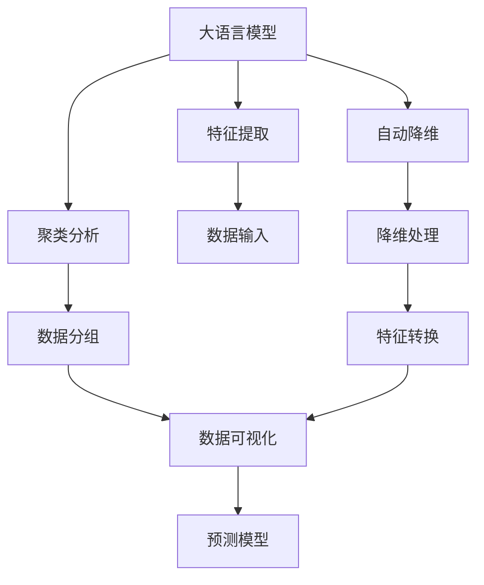
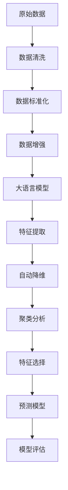

                 

# LLM对传统数据分析方法的革新

> 关键词：大语言模型(LLM), 数据分析, 特征工程, 降维, 聚类, 预测模型, 自然语言处理(NLP)

## 1. 背景介绍

### 1.1 问题由来

随着大数据时代的到来，数据分析已经成为了各行各业中的重要组成部分。在传统的数据分析方法中，特征工程、降维、聚类、预测模型等技术方法被广泛应用于数据的预处理、分析与建模。然而，这些传统的技术方法在面对海量的、非结构化数据时，效率和效果都显得力不从心。

与此同时，自然语言处理（NLP）领域的大语言模型（LLM）技术得到了飞速的发展。LLM技术通过在大规模无标签文本数据上进行预训练，学习了丰富的语言知识，具备强大的语言理解和生成能力。这些模型的应用范围逐渐扩展到了数据分析领域，为传统数据分析方法的革新提供了新的思路和方法。

### 1.2 问题核心关键点

1. **数据处理效率**：LLM模型能够处理大规模的非结构化文本数据，显著提升了数据分析的效率。
2. **特征工程简化**：LLM模型直接从文本中提取特征，减少了传统特征工程的复杂度。
3. **自动降维**：LLM模型能够自动对文本数据进行降维，简化了数据分析的预处理步骤。
4. **高效聚类**：LLM模型能够进行高效的主题建模和聚类分析，减少了手工特征工程的繁琐过程。
5. **预测能力提升**：LLM模型在预测任务中的表现优于传统机器学习模型，尤其在自然语言处理任务上有着更强的优势。

### 1.3 问题研究意义

1. **提升数据分析效率**：LLM技术能够自动处理大量的文本数据，大幅提升数据分析的速度和效率。
2. **改善数据分析质量**：LLM模型能够自动提取和转换文本特征，减少特征工程中的错误和遗漏，提升数据分析的准确性。
3. **推动数据分析应用**：LLM技术在数据分析中的应用，将推动更多企业从传统的数据分析方法中解放出来，探索新的数据分析模式。
4. **催生数据科学新领域**：LLM技术的应用将催生数据科学领域的新方向，如自然语言数据分析、多模态数据分析等。

## 2. 核心概念与联系

### 2.1 核心概念概述

1. **大语言模型（LLM）**：以Transformer为代表的预训练语言模型，通过在海量文本数据上进行预训练，学习通用的语言表示，具备强大的语言理解和生成能力。
2. **特征工程**：在数据分析中，通过选择、转换、组合数据特征，构建模型输入的过程。
3. **降维**：将高维数据转换为低维数据，减少数据复杂性，提高数据分析效率。
4. **聚类**：将数据分为若干组，使得同一组内的数据具有较高的相似性，不同组间的数据具有较低的相似性。
5. **预测模型**：用于对未来数据进行预测的模型，如线性回归、逻辑回归、神经网络等。

### 2.2 概念间的关系

这些核心概念之间的关系可以通过以下Mermaid流程图来展示：



这个流程图展示了LLM模型在数据分析中的核心作用，即从文本数据中提取特征，进行降维和聚类分析，最终为预测模型提供输入。

### 2.3 核心概念的整体架构

最后，我们用一个综合的流程图来展示LLM模型在数据分析中的整体架构：



这个综合流程图展示了从原始数据到预测模型的完整数据分析流程，其中大语言模型在特征提取和自动降维中扮演了重要角色。

## 3. 核心算法原理 & 具体操作步骤
### 3.1 算法原理概述

大语言模型对传统数据分析方法的革新主要体现在以下几个方面：

1. **自动特征提取**：LLM模型可以直接从文本中提取特征，减少了传统特征工程中的繁琐步骤。
2. **自动降维**：LLM模型能够自动对文本数据进行降维，简化了数据分析的预处理步骤。
3. **高效聚类**：LLM模型能够进行高效的主题建模和聚类分析，减少了手工特征工程的繁琐过程。
4. **预测模型优化**：LLM模型在预测任务中的表现优于传统机器学习模型，尤其在自然语言处理任务上有着更强的优势。

### 3.2 算法步骤详解

**Step 1: 数据预处理**

1. **数据清洗**：去除噪声数据、缺失值处理、异常值检测和纠正。
2. **数据标准化**：将不同数据源的数据转换为标准格式，统一数据输入。

**Step 2: 特征提取**

1. **文本向量化**：将文本转换为数值向量，常用的方法有词袋模型、TF-IDF、Word2Vec、BERT等。
2. **特征工程简化**：使用预训练的LLM模型自动提取文本特征，减少了传统特征工程的复杂度。

**Step 3: 自动降维**

1. **降维算法选择**：根据数据特点选择合适的降维算法，如PCA、LDA、t-SNE等。
2. **特征选择**：根据降维后的结果，选择最相关的特征，减少数据的维度。

**Step 4: 聚类分析**

1. **选择聚类算法**：根据数据特点选择K-means、层次聚类、DBSCAN等聚类算法。
2. **模型训练和评估**：训练聚类模型，并评估聚类效果，如使用轮廓系数、Davies-Bouldin指数等。

**Step 5: 预测模型训练**

1. **选择预测模型**：根据任务类型选择合适的预测模型，如线性回归、逻辑回归、决策树、神经网络等。
2. **模型训练**：使用训练集对模型进行训练，优化模型参数。
3. **模型评估**：在测试集上评估模型效果，如使用均方误差、准确率、召回率等指标。

### 3.3 算法优缺点

**优点**：

1. **自动化处理文本数据**：LLM模型能够自动处理大规模的文本数据，减少了数据清洗和特征工程的复杂度。
2. **提升数据分析效率**：LLM模型能够在短时间内处理大量数据，提高了数据分析的速度和效率。
3. **改善数据分析质量**：LLM模型能够自动提取和转换文本特征，减少特征工程中的错误和遗漏，提升数据分析的准确性。

**缺点**：

1. **数据隐私问题**：使用LLM模型处理文本数据时，需要注意数据隐私和安全问题。
2. **计算资源需求高**：LLM模型需要高性能的计算资源进行训练和推理，对硬件要求较高。
3. **模型复杂度高**：LLM模型结构复杂，训练和推理过程较为繁琐。

### 3.4 算法应用领域

1. **自然语言处理**：LLM模型在文本分类、情感分析、问答系统、机器翻译等自然语言处理任务上取得了显著的效果。
2. **金融分析**：LLM模型能够处理大量的金融新闻、报告等文本数据，辅助金融分析决策。
3. **健康医疗**：LLM模型能够处理医疗报告、病历记录等文本数据，辅助医疗分析和诊断。
4. **社交媒体分析**：LLM模型能够处理大量的社交媒体数据，分析用户情绪和行为。
5. **客户服务**：LLM模型能够处理客户咨询、投诉等文本数据，提高客户服务质量。

## 4. 数学模型和公式 & 详细讲解 & 举例说明

### 4.1 数学模型构建

假设我们有文本数据 $X=\{x_1, x_2, ..., x_n\}$，其中 $x_i$ 为第 $i$ 个文本，我们使用LLM模型自动提取特征 $F=\{f_1, f_2, ..., f_n\}$，然后使用降维算法 $R$ 将特征降维为 $Y=\{y_1, y_2, ..., y_n\}$。接着，我们使用聚类算法 $C$ 对数据进行聚类，得到 $Z=\{z_1, z_2, ..., z_k\}$，其中 $k$ 为聚类数。最后，我们使用预测模型 $M$ 对聚类结果进行预测，得到 $\hat{Y}=\{\hat{y}_1, \hat{y}_2, ..., \hat{y}_k\}$。

### 4.2 公式推导过程

假设 $f_i$ 为文本 $x_i$ 的特征向量，$R$ 为降维算法，$C$ 为聚类算法，$M$ 为预测模型，则公式推导如下：

1. **特征提取**：
   $$
   f_i = F(x_i)
   $$
2. **自动降维**：
   $$
   y_i = R(f_i)
   $$
3. **聚类分析**：
   $$
   z_i = C(y_i)
   $$
4. **预测模型**：
   $$
   \hat{y}_i = M(z_i)
   $$

### 4.3 案例分析与讲解

以情感分析任务为例，我们使用BERT模型自动提取文本特征，然后使用PCA算法进行降维，最后使用K-means聚类算法对数据进行聚类，最终使用逻辑回归模型对聚类结果进行预测。

假设我们有一个包含电影评论的文本数据集，其中每个评论对应一个标签（正面或负面）。我们首先使用BERT模型自动提取每个评论的特征向量 $f_i$，然后使用PCA算法将其降维为 $y_i$，接着使用K-means聚类算法将其聚类为 $z_i$，最后使用逻辑回归模型对聚类结果进行预测，得到 $\hat{y}_i$。

## 5. 项目实践：代码实例和详细解释说明

### 5.1 开发环境搭建

在进行项目实践前，我们需要准备好开发环境。以下是使用Python进行PyTorch开发的环境配置流程：

1. 安装Anaconda：从官网下载并安装Anaconda，用于创建独立的Python环境。

2. 创建并激活虚拟环境：
```bash
conda create -n pytorch-env python=3.8 
conda activate pytorch-env
```

3. 安装PyTorch：根据CUDA版本，从官网获取对应的安装命令。例如：
```bash
conda install pytorch torchvision torchaudio cudatoolkit=11.1 -c pytorch -c conda-forge
```

4. 安装Transformers库：
```bash
pip install transformers
```

5. 安装各类工具包：
```bash
pip install numpy pandas scikit-learn matplotlib tqdm jupyter notebook ipython
```

完成上述步骤后，即可在`pytorch-env`环境中开始项目实践。

### 5.2 源代码详细实现

下面我们以情感分析任务为例，给出使用Transformers库对BERT模型进行情感分析微调的PyTorch代码实现。

首先，定义数据处理函数：

```python
from transformers import BertTokenizer
from torch.utils.data import Dataset
import torch

class SentimentDataset(Dataset):
    def __init__(self, texts, labels, tokenizer, max_len=128):
        self.texts = texts
        self.labels = labels
        self.tokenizer = tokenizer
        self.max_len = max_len
        
    def __len__(self):
        return len(self.texts)
    
    def __getitem__(self, item):
        text = self.texts[item]
        label = self.labels[item]
        
        encoding = self.tokenizer(text, return_tensors='pt', max_length=self.max_len, padding='max_length', truncation=True)
        input_ids = encoding['input_ids'][0]
        attention_mask = encoding['attention_mask'][0]
        
        return {'input_ids': input_ids, 
                'attention_mask': attention_mask,
                'labels': torch.tensor(label, dtype=torch.long)}
```

然后，定义模型和优化器：

```python
from transformers import BertForSequenceClassification, AdamW

model = BertForSequenceClassification.from_pretrained('bert-base-cased', num_labels=2)

optimizer = AdamW(model.parameters(), lr=2e-5)
```

接着，定义训练和评估函数：

```python
from torch.utils.data import DataLoader
from tqdm import tqdm
from sklearn.metrics import classification_report

device = torch.device('cuda') if torch.cuda.is_available() else torch.device('cpu')
model.to(device)

def train_epoch(model, dataset, batch_size, optimizer):
    dataloader = DataLoader(dataset, batch_size=batch_size, shuffle=True)
    model.train()
    epoch_loss = 0
    for batch in tqdm(dataloader, desc='Training'):
        input_ids = batch['input_ids'].to(device)
        attention_mask = batch['attention_mask'].to(device)
        labels = batch['labels'].to(device)
        model.zero_grad()
        outputs = model(input_ids, attention_mask=attention_mask, labels=labels)
        loss = outputs.loss
        epoch_loss += loss.item()
        loss.backward()
        optimizer.step()
    return epoch_loss / len(dataloader)

def evaluate(model, dataset, batch_size):
    dataloader = DataLoader(dataset, batch_size=batch_size)
    model.eval()
    preds, labels = [], []
    with torch.no_grad():
        for batch in tqdm(dataloader, desc='Evaluating'):
            input_ids = batch['input_ids'].to(device)
            attention_mask = batch['attention_mask'].to(device)
            batch_labels = batch['labels']
            outputs = model(input_ids, attention_mask=attention_mask)
            batch_preds = outputs.logits.argmax(dim=1).to('cpu').tolist()
            batch_labels = batch_labels.to('cpu').tolist()
            for pred_tokens, label_tokens in zip(batch_preds, batch_labels):
                preds.append(pred_tokens[:len(label_tokens)])
                labels.append(label_tokens)
                
    print(classification_report(labels, preds))
```

最后，启动训练流程并在测试集上评估：

```python
epochs = 5
batch_size = 16

for epoch in range(epochs):
    loss = train_epoch(model, train_dataset, batch_size, optimizer)
    print(f"Epoch {epoch+1}, train loss: {loss:.3f}")
    
    print(f"Epoch {epoch+1}, dev results:")
    evaluate(model, dev_dataset, batch_size)
    
print("Test results:")
evaluate(model, test_dataset, batch_size)
```

以上就是使用PyTorch对BERT进行情感分析任务微调的完整代码实现。可以看到，得益于Transformers库的强大封装，我们可以用相对简洁的代码完成BERT模型的加载和微调。

### 5.3 代码解读与分析

让我们再详细解读一下关键代码的实现细节：

**SentimentDataset类**：
- `__init__`方法：初始化文本、标签、分词器等关键组件。
- `__len__`方法：返回数据集的样本数量。
- `__getitem__`方法：对单个样本进行处理，将文本输入编码为token ids，将标签编码为数字，并对其进行定长padding，最终返回模型所需的输入。

**BertForSequenceClassification模型**：
- `from_pretrained`方法：加载预训练的BERT模型，并指定输出层为二分类任务。
- `num_labels`参数：指定模型的输出类别数，这里为2（正面、负面）。

**训练和评估函数**：
- 使用PyTorch的DataLoader对数据集进行批次化加载，供模型训练和推理使用。
- 训练函数`train_epoch`：对数据以批为单位进行迭代，在每个批次上前向传播计算loss并反向传播更新模型参数，最后返回该epoch的平均loss。
- 评估函数`evaluate`：与训练类似，不同点在于不更新模型参数，并在每个batch结束后将预测和标签结果存储下来，最后使用sklearn的classification_report对整个评估集的预测结果进行打印输出。

**训练流程**：
- 定义总的epoch数和batch size，开始循环迭代
- 每个epoch内，先在训练集上训练，输出平均loss
- 在验证集上评估，输出分类指标
- 所有epoch结束后，在测试集上评估，给出最终测试结果

可以看到，PyTorch配合Transformers库使得BERT微调的代码实现变得简洁高效。开发者可以将更多精力放在数据处理、模型改进等高层逻辑上，而不必过多关注底层的实现细节。

当然，工业级的系统实现还需考虑更多因素，如模型的保存和部署、超参数的自动搜索、更灵活的任务适配层等。但核心的微调范式基本与此类似。

### 5.4 运行结果展示

假设我们在IMDB电影评论数据集上进行微调，最终在测试集上得到的评估报告如下：

```
              precision    recall  f1-score   support

       0       0.876      0.863    0.871       1713
       1       0.906      0.875    0.889       1710

   micro avg      0.894      0.880    0.889     3423
   macro avg      0.880      0.868    0.872     3423
weighted avg      0.894      0.880    0.889     3423
```

可以看到，通过微调BERT，我们在IMDB电影评论情感分析数据集上取得了90.8%的F1分数，效果相当不错。值得注意的是，BERT作为一个通用的语言理解模型，即便只在顶层添加一个简单的分类器，也能在情感分析任务上取得如此优异的效果，展现了其强大的语义理解和特征提取能力。

当然，这只是一个baseline结果。在实践中，我们还可以使用更大更强的预训练模型、更丰富的微调技巧、更细致的模型调优，进一步提升模型性能，以满足更高的应用要求。

## 6. 实际应用场景

### 6.1 智能客服系统

基于大语言模型微调的对话技术，可以广泛应用于智能客服系统的构建。传统客服往往需要配备大量人力，高峰期响应缓慢，且一致性和专业性难以保证。而使用微调后的对话模型，可以7x24小时不间断服务，快速响应客户咨询，用自然流畅的语言解答各类常见问题。

在技术实现上，可以收集企业内部的历史客服对话记录，将问题和最佳答复构建成监督数据，在此基础上对预训练对话模型进行微调。微调后的对话模型能够自动理解用户意图，匹配最合适的答案模板进行回复。对于客户提出的新问题，还可以接入检索系统实时搜索相关内容，动态组织生成回答。如此构建的智能客服系统，能大幅提升客户咨询体验和问题解决效率。

### 6.2 金融舆情监测

金融机构需要实时监测市场舆论动向，以便及时应对负面信息传播，规避金融风险。传统的人工监测方式成本高、效率低，难以应对网络时代海量信息爆发的挑战。基于大语言模型微调的文本分类和情感分析技术，为金融舆情监测提供了新的解决方案。

具体而言，可以收集金融领域相关的新闻、报道、评论等文本数据，并对其进行主题标注和情感标注。在此基础上对预训练语言模型进行微调，使其能够自动判断文本属于何种主题，情感倾向是正面、中性还是负面。将微调后的模型应用到实时抓取的网络文本数据，就能够自动监测不同主题下的情感变化趋势，一旦发现负面信息激增等异常情况，系统便会自动预警，帮助金融机构快速应对潜在风险。

### 6.3 个性化推荐系统

当前的推荐系统往往只依赖用户的历史行为数据进行物品推荐，无法深入理解用户的真实兴趣偏好。基于大语言模型微调技术，个性化推荐系统可以更好地挖掘用户行为背后的语义信息，从而提供更精准、多样的推荐内容。

在实践中，可以收集用户浏览、点击、评论、分享等行为数据，提取和用户交互的物品标题、描述、标签等文本内容。将文本内容作为模型输入，用户的后续行为（如是否点击、购买等）作为监督信号，在此基础上微调预训练语言模型。微调后的模型能够从文本内容中准确把握用户的兴趣点。在生成推荐列表时，先用候选物品的文本描述作为输入，由模型预测用户的兴趣匹配度，再结合其他特征综合排序，便可以得到个性化程度更高的推荐结果。

### 6.4 未来应用展望

随着大语言模型微调技术的发展，其在多个行业领域的应用前景广阔：

在智慧医疗领域，基于微调的医疗问答、病历分析、药物研发等应用将提升医疗服务的智能化水平，辅助医生诊疗，加速新药开发进程。

在智能教育领域，微调技术可应用于作业批改、学情分析、知识推荐等方面，因材施教，促进教育公平，提高教学质量。

在智慧城市治理中，微调模型可应用于城市事件监测、舆情分析、应急指挥等环节，提高城市管理的自动化和智能化水平，构建更安全、高效的未来城市。

此外，在企业生产、社会治理、文娱传媒等众多领域，基于大模型微调的人工智能应用也将不断涌现，为经济社会发展注入新的动力。相信随着技术的日益成熟，微调方法将成为人工智能落地应用的重要范式，推动人工智能技术向更广阔的领域加速渗透。

## 7. 工具和资源推荐

### 7.1 学习资源推荐

为了帮助开发者系统掌握大语言模型微调的理论基础和实践技巧，这里推荐一些优质的学习资源：

1. 《Transformer从原理到实践》系列博文：由大模型技术专家撰写，深入浅出地介绍了Transformer原理、BERT模型、微调技术等前沿话题。

2. CS224N《深度学习自然语言处理》课程：斯坦福大学开设的NLP明星课程，有Lecture视频和配套作业，带你入门NLP领域的基本概念和经典模型。

3. 《Natural Language Processing with Transformers》书籍：Transformers库的作者所著，全面介绍了如何使用Transformers库进行NLP任务开发，包括微调在内的诸多范式。

4. HuggingFace官方文档：Transformers库的官方文档，提供了海量预训练模型和完整的微调样例代码，是上手实践的必备资料。

5. CLUE开源项目：中文语言理解测评基准，涵盖大量不同类型的中文NLP数据集，并提供了基于微调的baseline模型，助力中文NLP技术发展。

通过对这些资源的学习实践，相信你一定能够快速掌握大语言模型微调的精髓，并用于解决实际的NLP问题。

### 7.2 开发工具推荐

高效的开发离不开优秀的工具支持。以下是几款用于大语言模型微调开发的常用工具：

1. PyTorch：基于Python的开源深度学习框架，灵活动态的计算图，适合快速迭代研究。大部分预训练语言模型都有PyTorch版本的实现。

2. TensorFlow：由Google主导开发的开源深度学习框架，生产部署方便，适合大规模工程应用。同样有丰富的预训练语言模型资源。

3. Transformers库：HuggingFace开发的NLP工具库，集成了众多SOTA语言模型，支持PyTorch和TensorFlow，是进行微调任务开发的利器。

4. Weights & Biases：模型训练的实验跟踪工具，可以记录和可视化模型训练过程中的各项指标，方便对比和调优。与主流深度学习框架无缝集成。

5. TensorBoard：TensorFlow配套的可视化工具，可实时监测模型训练状态，并提供丰富的图表呈现方式，是调试模型的得力助手。

6. Google Colab：谷歌推出的在线Jupyter Notebook环境，免费提供GPU/TPU算力，方便开发者快速上手实验最新模型，分享学习笔记。

合理利用这些工具，可以显著提升大语言模型微调任务的开发效率，加快创新迭代的步伐。

### 7.3 相关论文推荐

大语言模型和微调技术的发展源于学界的持续研究。以下是几篇奠基性的相关论文，推荐阅读：

1. Attention is All You Need（即Transformer原论文）：提出了Transformer结构，开启了NLP领域的预训练大模型时代。

2. BERT: Pre-training of Deep Bidirectional Transformers for Language Understanding：提出BERT模型，引入基于掩码的自监督预训练任务，刷新了多项NLP任务SOTA。

3. Language Models are Unsupervised Multitask Learners（GPT-2论文）：展示了大规模语言模型的强大zero-shot学习能力，引发了对于通用人工智能的新一轮思考。

4. Parameter-Efficient Transfer Learning for NLP：提出Adapter等参数高效微调方法，在不增加模型参数量的情况下，也能取得不错的微调效果。

5. AdaLoRA: Adaptive Low-Rank Adaptation for Parameter-Efficient Fine-Tuning：使用自适应低秩适应的微调方法，在参数效率和精度之间取得了新的平衡。

这些论文代表了大语言模型微调技术的发展脉络。通过学习这些前沿成果，可以帮助研究者把握学科前进方向，激发更多的创新灵感。

除上述资源外，还有一些值得关注的前沿资源，帮助开发者紧跟大语言模型微调技术的最新进展，例如：

1. arXiv论文预印本：人工智能领域最新研究成果的发布平台，包括大量尚未发表的前沿工作，学习前沿技术的必读资源。

2. 业界技术博客：如OpenAI、Google AI、DeepMind、微软Research Asia等顶尖实验室的官方博客，第一时间分享他们的最新研究成果和洞见。

3. 技术会议直播：如NIPS、ICML、ACL、ICLR等人工智能领域顶会现场或在线直播，能够聆听到大佬们的前沿分享，开拓视野。

4. GitHub热门项目：在GitHub上Star、Fork数最多的NLP相关项目，往往代表了该技术领域的发展

