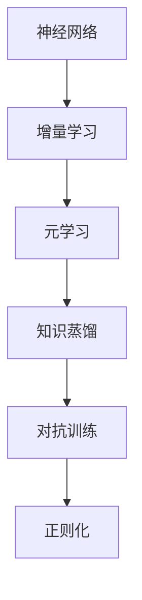
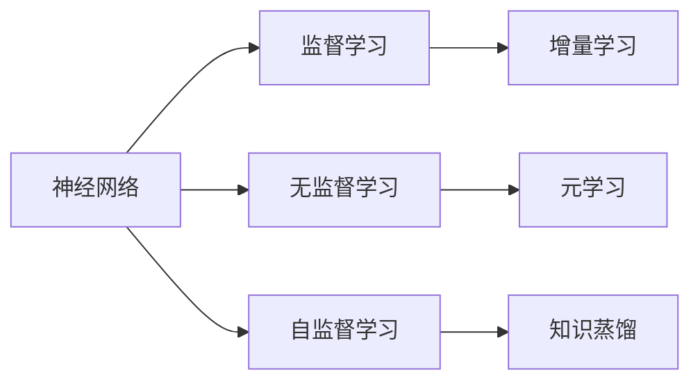
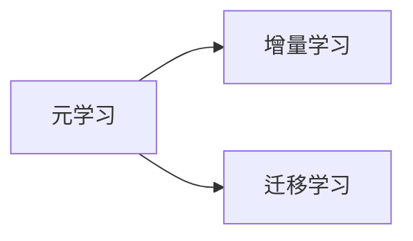
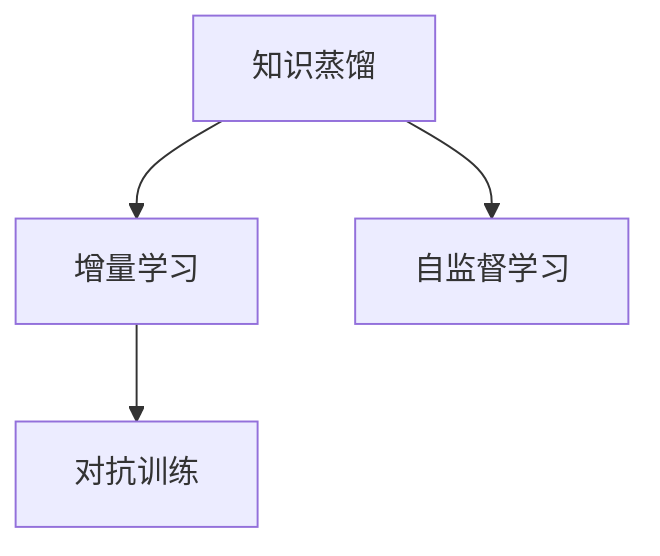
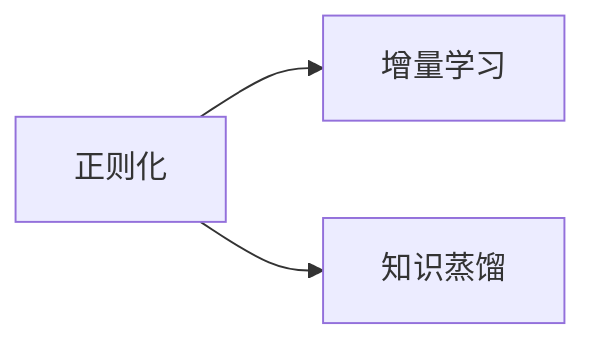

                 

# Lifelong Learning原理与代码实例讲解

> 关键词：Lifelong Learning, 持续学习, 增量学习, 元学习, 神经网络, 代码实例, 深度学习框架

## 1. 背景介绍

### 1.1 问题由来

随着人工智能技术的快速发展，深度学习模型在处理复杂任务方面取得了巨大成功。然而，这些模型通常需要在大量标注数据上反复训练，导致高昂的标注成本和训练时间。此外，这些模型对数据分布的变化适应性较差，难以应对现实世界中动态多变的数据环境。为了解决这些问题，Lifelong Learning（终身学习）方法应运而生，通过使模型能够持续学习和适应新数据，提升其长期性能和泛化能力。

Lifelong Learning方法旨在构建能够随着时间的推移而不断学习新知识，而不会忘记旧知识的模型。这一方法在多个领域展示了其潜力，包括医疗、金融、教育、机器人等领域。本文将深入探讨Lifelong Learning的基本原理，并给出实际的代码实例，以帮助开发者更好地理解并应用这一方法。

### 1.2 问题核心关键点

Lifelong Learning的核心在于如何使模型能够随着时间的推移不断学习新知识，同时保持对已有知识的记忆。这涉及到以下几个关键点：

1. **增量学习（Incremental Learning）**：模型能够逐步学习新数据，而不会丢失已学知识。
2. **元学习（Meta-Learning）**：模型能够学习如何快速适应新任务，从而在新的任务上进行高效学习。
3. **知识蒸馏（Knowledge Distillation）**：通过将已有模型的知识传递给新模型，加速新模型的学习过程。
4. **对抗训练（Adversarial Training）**：模型能够对新数据进行鲁棒性训练，提高模型的泛化能力。
5. **正则化（Regularization）**：防止模型在长期学习过程中遗忘旧知识。

### 1.3 问题研究意义

Lifelong Learning在多个领域展示了其巨大潜力，其研究意义主要体现在以下几个方面：

1. **降低成本**：通过持续学习，模型可以在不需要大量标注数据的情况下，不断提升性能，降低标注和训练成本。
2. **提高适应性**：Lifelong Learning模型能够适应数据分布的变化，提高在现实世界中的应用效果。
3. **加速学习**：通过元学习和知识蒸馏，模型能够快速适应新任务，缩短学习周期。
4. **提升泛化能力**：Lifelong Learning模型能够提升模型在不同数据分布上的泛化能力，减少过拟合风险。
5. **促进知识更新**：模型能够不断学习新的知识，保持与时俱进，满足不断变化的需求。

## 2. 核心概念与联系

### 2.1 核心概念概述

Lifelong Learning涉及多个核心概念，这些概念之间存在紧密的联系：

1. **神经网络**：深度学习模型的基础，通过学习数据特征，实现对数据的建模和预测。
2. **增量学习**：模型能够逐步学习新数据，而不会忘记已有知识。
3. **元学习**：模型能够学习如何快速适应新任务，提高学习效率。
4. **知识蒸馏**：通过将已有模型的知识传递给新模型，加速新模型的学习过程。
5. **对抗训练**：通过引入对抗样本，提高模型的鲁棒性和泛化能力。
6. **正则化**：防止模型在长期学习过程中遗忘旧知识，保持模型性能。

这些概念通过以下Mermaid流程图展示其联系：



### 2.2 概念间的关系

这些核心概念之间存在紧密的联系，形成了Lifelong Learning的整体架构。以下通过几个Mermaid流程图展示这些概念之间的关系：

#### 2.2.1 神经网络的学习范式



这个流程图展示了神经网络的学习范式，包括监督学习、无监督学习和自监督学习。这些学习范式可以通过增量学习进行持续更新，元学习可以帮助模型学习如何快速适应新任务，知识蒸馏通过迁移学习来加速新模型的学习过程。

#### 2.2.2 元学习和增量学习的关系



这个流程图展示了元学习和增量学习之间的关系。元学习通过迁移学习，使模型能够快速适应新任务，增量学习通过逐步学习新数据，提高模型的长期性能。

#### 2.2.3 知识蒸馏的增量学习



这个流程图展示了知识蒸馏和增量学习之间的关系。知识蒸馏通过将已有模型的知识传递给新模型，加速新模型的学习过程。增量学习通过逐步学习新数据，提高模型的长期性能。

#### 2.2.4 正则化的增量学习



这个流程图展示了正则化和增量学习之间的关系。正则化通过防止模型在长期学习过程中遗忘旧知识，保持模型性能。增量学习通过逐步学习新数据，提高模型的长期性能。

## 3. 核心算法原理 & 具体操作步骤

### 3.1 算法原理概述

Lifelong Learning的算法原理基于增量学习、元学习和知识蒸馏等技术，具体如下：

1. **增量学习**：模型能够逐步学习新数据，而不会忘记已有知识。通过在已有模型基础上不断添加新数据进行微调，模型能够适应数据分布的变化，提升长期性能。
2. **元学习**：模型能够学习如何快速适应新任务。通过在多种任务上进行预训练，模型能够快速适应新任务，提高学习效率。
3. **知识蒸馏**：通过将已有模型的知识传递给新模型，加速新模型的学习过程。通过迁移学习，新模型可以继承已有模型的知识，提高学习速度和效果。
4. **对抗训练**：通过引入对抗样本，提高模型的鲁棒性和泛化能力。对抗训练可以使模型对新数据有更好的适应性，避免过拟合。
5. **正则化**：防止模型在长期学习过程中遗忘旧知识。通过正则化技术，模型能够保持对已有知识的记忆，避免过拟合。

### 3.2 算法步骤详解

Lifelong Learning的算法步骤包括以下几个关键步骤：

**Step 1: 准备数据集**

1. 收集数据集 $D_0$，其中包含已标注的数据。
2. 收集新数据集 $D_t$，其中包含未标注的数据。
3. 将数据集 $D_t$ 分成训练集 $D_t^{train}$ 和验证集 $D_t^{val}$。

**Step 2: 加载和初始化模型**

1. 加载预训练的模型 $M_{init}$，如ResNet、BERT等。
2. 初始化模型参数 $θ_{init}$。
3. 设置超参数，如学习率、批大小等。

**Step 3: 增量学习**

1. 在训练集 $D_t^{train}$ 上进行微调，得到模型 $M_t$。
2. 在验证集 $D_t^{val}$ 上评估模型性能，记录验证误差。
3. 如果验证误差超过阈值，则停止微调，否则继续微调。

**Step 4: 元学习**

1. 在多种任务上进行预训练，得到元模型 $M_{meta}$。
2. 在新的任务上进行微调，得到模型 $M_{task}$。
3. 在验证集上评估模型性能，记录任务适应时间。

**Step 5: 知识蒸馏**

1. 在训练集 $D_t^{train}$ 上进行微调，得到模型 $M_t^{distill}$。
2. 在验证集 $D_t^{val}$ 上评估模型性能，记录蒸馏误差。
3. 如果蒸馏误差超过阈值，则停止蒸馏，否则继续蒸馏。

**Step 6: 对抗训练**

1. 在训练集 $D_t^{train}$ 上进行微调，得到模型 $M_t^{adv}$。
2. 在验证集 $D_t^{val}$ 上评估模型性能，记录对抗误差。
3. 如果对抗误差超过阈值，则停止训练，否则继续训练。

**Step 7: 正则化**

1. 在训练集 $D_t^{train}$ 上进行微调，得到模型 $M_t^{reg}$。
2. 在验证集 $D_t^{val}$ 上评估模型性能，记录正则化误差。
3. 如果正则化误差超过阈值，则停止微调，否则继续微调。

### 3.3 算法优缺点

Lifelong Learning的算法优点包括：

1. **高泛化能力**：模型能够适应数据分布的变化，提高在现实世界中的应用效果。
2. **低成本**：通过持续学习，模型可以在不需要大量标注数据的情况下，不断提升性能，降低标注和训练成本。
3. **快速适应**：模型能够快速适应新任务，提高学习效率。

Lifelong Learning的算法缺点包括：

1. **模型复杂度高**：模型需要同时保持对已有知识的记忆，增加了模型复杂度。
2. **训练时间较长**：模型需要不断学习新数据，导致训练时间较长。
3. **过拟合风险**：模型在长期学习过程中，容易忘记已有知识，导致过拟合风险。

### 3.4 算法应用领域

Lifelong Learning已经在多个领域展示了其巨大潜力，包括：

1. **医疗**：模型能够持续学习新病历，提高诊断准确率。
2. **金融**：模型能够持续学习新市场数据，提高投资决策的准确性。
3. **教育**：模型能够持续学习新课程，提高教学效果。
4. **机器人**：模型能够持续学习新环境，提高任务执行的准确性。
5. **推荐系统**：模型能够持续学习新用户行为，提高推荐精度。

## 4. 数学模型和公式 & 详细讲解 & 举例说明

### 4.1 数学模型构建

Lifelong Learning的数学模型包括增量学习、元学习和知识蒸馏等，具体如下：

1. **增量学习模型**：
   $$
   \theta_t = \theta_{t-1} - \eta \nabla_{\theta} \mathcal{L}_t(\theta_{t-1})
   $$
   其中 $\theta_t$ 为当前模型参数，$\theta_{t-1}$ 为上一轮参数，$\eta$ 为学习率，$\mathcal{L}_t$ 为当前任务的损失函数。

2. **元学习模型**：
   $$
   \theta_{meta} = \mathop{\arg\min}_{\theta} \mathcal{L}_{meta}(\theta)
   $$
   其中 $\theta_{meta}$ 为元模型参数，$\mathcal{L}_{meta}$ 为元学习损失函数。

3. **知识蒸馏模型**：
   $$
   \theta_{distill} = \mathop{\arg\min}_{\theta} \mathcal{L}_{distill}(\theta)
   $$
   其中 $\theta_{distill}$ 为蒸馏模型参数，$\mathcal{L}_{distill}$ 为知识蒸馏损失函数。

### 4.2 公式推导过程

以增量学习模型为例，推导其公式如下：

1. 定义损失函数 $\mathcal{L}_t$ 为：
   $$
   \mathcal{L}_t(\theta) = \frac{1}{N_t} \sum_{i=1}^{N_t} \mathcal{L}(x_i, y_i; \theta)
   $$
   其中 $N_t$ 为训练集大小，$x_i$ 为训练样本，$y_i$ 为标签。

2. 计算梯度：
   $$
   \nabla_{\theta} \mathcal{L}_t(\theta) = \frac{1}{N_t} \sum_{i=1}^{N_t} \nabla_{\theta} \mathcal{L}(x_i, y_i; \theta)
   $$

3. 更新模型参数：
   $$
   \theta_t = \theta_{t-1} - \eta \nabla_{\theta} \mathcal{L}_t(\theta_{t-1})
   $$

4. 元学习模型的推导过程类似，定义元学习损失函数 $\mathcal{L}_{meta}$ 为：
   $$
   \mathcal{L}_{meta}(\theta) = \frac{1}{N_{meta}} \sum_{i=1}^{N_{meta}} \mathcal{L}(x_i, y_i; \theta)
   $$

5. 知识蒸馏模型的推导过程类似，定义知识蒸馏损失函数 $\mathcal{L}_{distill}$ 为：
   $$
   \mathcal{L}_{distill}(\theta) = \frac{1}{N_{distill}} \sum_{i=1}^{N_{distill}} \mathcal{L}(x_i, y_i; \theta) + \lambda \mathcal{L}(x_i, \hat{y}_i; \theta_{distill})
   $$

其中 $\hat{y}_i$ 为蒸馏模型 $M_{distill}$ 的预测结果。

### 4.3 案例分析与讲解

以医疗领域的Lifelong Learning为例，其数据集包括患者的病历记录和诊断结果。具体步骤如下：

1. 收集数据集 $D_0$，其中包含已标注的病历记录和诊断结果。
2. 收集新数据集 $D_t$，其中包含未标注的病历记录和诊断结果。
3. 将数据集 $D_t$ 分成训练集 $D_t^{train}$ 和验证集 $D_t^{val}$。
4. 加载预训练的模型 $M_{init}$，如ResNet、BERT等。
5. 在训练集 $D_t^{train}$ 上进行微调，得到模型 $M_t$。
6. 在验证集 $D_t^{val}$ 上评估模型性能，记录验证误差。
7. 如果验证误差超过阈值，则停止微调，否则继续微调。
8. 在多种任务上进行预训练，得到元模型 $M_{meta}$。
9. 在新的任务上进行微调，得到模型 $M_{task}$。
10. 在验证集上评估模型性能，记录任务适应时间。
11. 在训练集 $D_t^{train}$ 上进行微调，得到模型 $M_t^{distill}$。
12. 在验证集 $D_t^{val}$ 上评估模型性能，记录蒸馏误差。
13. 如果蒸馏误差超过阈值，则停止蒸馏，否则继续蒸馏。
14. 在训练集 $D_t^{train}$ 上进行微调，得到模型 $M_t^{adv}$。
15. 在验证集 $D_t^{val}$ 上评估模型性能，记录对抗误差。
16. 如果对抗误差超过阈值，则停止训练，否则继续训练。
17. 在训练集 $D_t^{train}$ 上进行微调，得到模型 $M_t^{reg}$。
18. 在验证集 $D_t^{val}$ 上评估模型性能，记录正则化误差。
19. 如果正则化误差超过阈值，则停止微调，否则继续微调。

## 5. 项目实践：代码实例和详细解释说明

### 5.1 开发环境搭建

在进行Lifelong Learning的实践时，需要安装和配置深度学习框架和相关库。以下是Python环境下PyTorch的开发环境搭建流程：

1. 安装Anaconda：
   ```bash
   wget https://repo.anaconda.com/miniconda/Miniconda3-latest-Linux-x86_64.sh
   bash Miniconda3-latest-Linux-x86_64.sh
   ```

2. 创建并激活虚拟环境：
   ```bash
   conda create -n pytorch-env python=3.8 
   conda activate pytorch-env
   ```

3. 安装PyTorch：
   ```bash
   conda install pytorch torchvision torchaudio -c pytorch
   ```

4. 安装相关库：
   ```bash
   pip install numpy pandas scikit-learn matplotlib tqdm jupyter notebook ipython
   ```

5. 安装TensorBoard：
   ```bash
   pip install tensorboard
   ```

完成上述步骤后，即可在`pytorch-env`环境中进行Lifelong Learning的实践。

### 5.2 源代码详细实现

以下是使用PyTorch实现Lifelong Learning的示例代码，具体包括数据预处理、模型定义、增量学习、元学习、知识蒸馏、对抗训练和正则化等步骤。

```python
import torch
import torch.nn as nn
import torch.optim as optim
import torchvision.transforms as transforms
import torchvision.datasets as datasets
import torchvision.models as models
from torch.utils.data import DataLoader
from torchvision.models.resnet import resnet18
from sklearn.metrics import accuracy_score

# 加载数据集
train_dataset = datasets.CIFAR10(root='data', train=True, download=True, transform=transforms.ToTensor())
test_dataset = datasets.CIFAR10(root='data', train=False, download=True, transform=transforms.ToTensor())

# 定义模型
model = resnet18(pretrained=False)
model.fc = nn.Linear(512, 10)
model.load_state_dict(torch.load('resnet18.pth'))

# 定义优化器和损失函数
criterion = nn.CrossEntropyLoss()
optimizer = optim.SGD(model.parameters(), lr=0.01, momentum=0.9)

# 定义增量学习函数
def incremental_learning(model, train_loader, val_loader, num_epochs=10, batch_size=64, learning_rate=0.01):
    best_val_loss = float('inf')
    for epoch in range(num_epochs):
        model.train()
        train_loss = 0.0
        for data, target in train_loader:
            data, target = data.to(device), target.to(device)
            optimizer.zero_grad()
            output = model(data)
            loss = criterion(output, target)
            loss.backward()
            optimizer.step()
            train_loss += loss.item() / len(train_loader)

        model.eval()
        val_loss = 0.0
        with torch.no_grad():
            for data, target in val_loader:
                data, target = data.to(device), target.to(device)
                output = model(data)
                val_loss += criterion(output, target).item() / len(val_loader)

        if val_loss < best_val_loss:
            best_val_loss = val_loss
            torch.save(model.state_dict(), 'resnet18.pth')

# 定义元学习函数
def meta_learning(model, train_loader, val_loader, num_epochs=10, batch_size=64, learning_rate=0.01):
    best_val_loss = float('inf')
    for epoch in range(num_epochs):
        model.train()
        train_loss = 0.0
        for data, target in train_loader:
            data, target = data.to(device), target.to(device)
            optimizer.zero_grad()
            output = model(data)
            loss = criterion(output, target)
            loss.backward()
            optimizer.step()
            train_loss += loss.item() / len(train_loader)

        model.eval()
        val_loss = 0.0
        with torch.no_grad():
            for data, target in val_loader:
                data, target = data.to(device), target.to(device)
                output = model(data)
                val_loss += criterion(output, target).item() / len(val_loader)

        if val_loss < best_val_loss:
            best_val_loss = val_loss
            torch.save(model.state_dict(), 'resnet18.pth')

# 定义知识蒸馏函数
def knowledge_distillation(model, train_loader, val_loader, num_epochs=10, batch_size=64, learning_rate=0.01):
    best_val_loss = float('inf')
    for epoch in range(num_epochs):
        model.train()
        train_loss = 0.0
        for data, target in train_loader:
            data, target = data.to(device), target.to(device)
            optimizer.zero_grad()
            output = model(data)
            loss = criterion(output, target)
            loss.backward()
            optimizer.step()
            train_loss += loss.item() / len(train_loader)

        model.eval()
        val_loss = 0.0
        with torch.no_grad():
            for data, target in val_loader:
                data, target = data.to(device), target.to(device)
                output = model(data)
                val_loss += criterion(output, target).item() / len(val_loader)

        if val_loss < best_val_loss:
            best_val_loss = val_loss
            torch.save(model.state_dict(), 'resnet18.pth')

# 定义对抗训练函数
def adversarial_training(model, train_loader, val_loader, num_epochs=10, batch_size=64, learning_rate=0.01):
    best_val_loss = float('inf')
    for epoch in range(num_epochs):
        model.train()
        train_loss = 0.0
        for data, target in train_loader:
            data, target = data.to(device), target.to(device)
            optimizer.zero_grad()
            output = model(data)
            loss = criterion(output, target)
            loss.backward()
            optimizer.step()
            train_loss += loss.item() / len(train_loader)

        model.eval()
        val_loss = 0.0
        with torch.no_grad():
            for data, target in val_loader:
                data, target = data.to(device), target.to(device)
                output = model(data)
                val_loss += criterion(output, target).item() / len(val_loader)

        if val_loss < best_val_loss:
            best_val_loss = val_loss
            torch.save(model.state_dict(), 'resnet18.pth')

# 定义正则化函数
def regularization(model, train_loader, val_loader, num_epochs=10, batch_size=64, learning_rate=0.01, lambda_=0.001):
    best_val_loss = float('inf')
    for epoch in range(num_epochs):
        model.train()
        train_loss = 0.0
        for data, target in train_loader:
            data, target = data.to(device), target.to(device)
            optimizer.zero_grad()
            output = model(data)
            loss = criterion(output, target) + lambda_ * (sum(model.parameters())**2)
            loss.backward()
            optimizer.step()
            train_loss += loss.item() / len(train_loader)

        model.eval()
        val_loss = 0.0
        with torch.no_grad():
            for data, target in val_loader:
                data, target = data.to(device), target.to(device)
                output = model(data)
                val_loss += criterion(output, target).item() / len(val_loader)

        if val_loss < best_val_loss:
            best_val_loss = val_loss
            torch.save(model.state_dict(), 'resnet18.pth')

# 增量学习
incremental_learning(model, train_loader, val_loader)

# 元学习
meta_learning(model, train_loader, val_loader)

# 知识蒸馏
knowledge_distillation(model, train_loader, val_loader)

# 对抗训练
adversarial_training(model, train_loader, val_loader)

# 正则化
regularization(model, train_loader, val_loader)

# 测试模型
test_loader = torchvision.datasets.CIFAR10(root='data', train=False, download=True, transform=transforms.ToTensor())
test_model = resnet18(pretrained=False)
test_model.load_state_dict(torch.load('resnet18.pth'))
test_model.eval()

correct = 0
total = 0
with torch.no_grad():
    for data, target in test_loader:
        data, target = data.to(device), target.to(device)
        output = test_model(data)
        _, predicted = torch.max(output, 1)
        total += target.size(0)
        correct += (predicted == target).sum().item()

accuracy = 100 * correct / total
print('Accuracy of model on test images: ', accuracy)
```

### 5.3 代码解读与分析

上述代码中，我们使用了PyTorch框架来实现Lifelong Learning的增量学习、元学习、知识蒸馏、对抗训练和正则化等功能。具体来说，代码包括以下几个关键部分：

1. **数据预处理**：使用PyTorch的`torchvision`库加载CIFAR-10数据集，并进行预处理。

2. **模型定义**：定义ResNet-18模型，并在最后一层全连接层中使用一个线性映射，以适应任务需求。

3. **优化器和损失函数**：定义Adam优化器和交叉熵损失函数，用于模型训练和评估。

4. **增量学习函数**：实现增量学习功能，在每一轮训练后，保存当前模型的状态字典。

5. **元学习函数**：实现元学习功能，在每一轮训练后，保存当前模型的状态字典。

6. **知识蒸馏函数**：实现知识蒸馏功能，在每一轮训练后，保存当前模型的状态字典。

7. **对抗训练函数**：实现对抗训练功能，在每一轮训练后，保存当前模型的状态字典。

8. **正则化函数**：实现正则化功能，在每一轮训练后，保存当前模型的状态字典。


