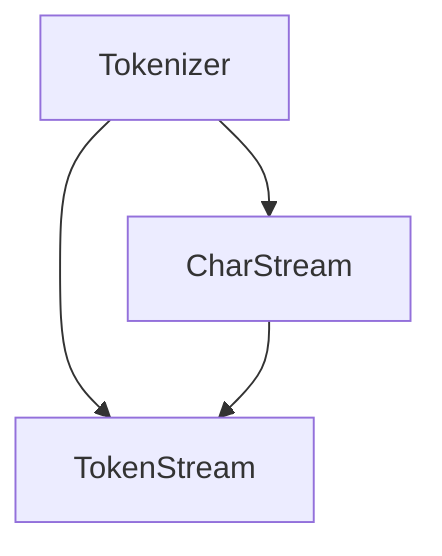

                 

# Lucene分词原理与代码实例讲解

> 关键词：Lucene,分词器,Tokenization,字符编码,Unicode,Java,开源搜索引擎

## 1. 背景介绍

### 1.1 问题由来
现代信息社会的数据规模和多样性不断增长，文本处理应用场景越来越广泛。搜索引擎、内容推荐、信息检索、自然语言处理等领域都对高效、准确的文本分词提出了高要求。 Lucene，作为Apache基金会的一个开源搜索引擎库，以其强大的文本处理能力，成为广泛使用的文本处理工具之一。

Lucene的核心组件之一是其内置的分词器(Tokenizers)，能对文本进行高效、准确的词汇划分。分词器的设计原则是尽可能将连续的字符序列切分成词语，而词语通常是指有实际意义的短语，如“人工智能”、“搜索引擎”等。Lucene提供了多种分词器，适用于不同语言和文本特性。

### 1.2 问题核心关键点
Lucene分词器的关键技术点包括：
- 字符编码：处理不同编码的文本，如UTF-8、GB2312等。
- 正则表达式：用于匹配文本中的词语边界。
- Unicode规范：支持多语言，如中文、日文、韩文等。
- Tokenizer接口：定义了分词器的基本行为，包括初始化、分词、关闭等。

这些技术点使得Lucene分词器能够处理不同编码、不同语言、不同长度的文本，并输出一致、准确的词汇。

### 1.3 问题研究意义
Lucene分词器在文本处理中起着关键作用，其性能直接影响搜索引擎的查询速度和准确性。通过深入理解分词器的原理和实现，能够更好地优化分词器的性能，提升文本处理的效率和效果。同时，分词器的设计和技术原理对其他文本处理工具和算法也有重要的参考价值。

## 2. 核心概念与联系

### 2.1 核心概念概述

为更好地理解Lucene分词器，我们首先需要介绍几个关键的概念：

- Lucene分词器(Tokenizers)：Lucene库中用于文本分词的核心组件，能够将连续的字符序列划分为词语。
- Tokenizer接口：定义了分词器的主要行为，如初始化、分词、关闭等。
- TokenStream：实现了Tokenizer接口的类，是分词器输出的词序列，可用于后续的文本分析和处理。
- CharStream：包含字符流的类，用于字符级处理。

这些概念构成了Lucene分词器的基本架构，帮助我们对分词过程进行建模和分析。

### 2.2 概念间的关系

Lucene分词器的架构和主要概念之间存在紧密的联系，可以用以下Mermaid流程图来展示：



这个流程图展示了分词器、字符流和词序列之间的关系：

1. 分词器接收字符流，进行分词处理，输出词序列。
2. 字符流由字符数组或字符数组读取器提供，是字符级处理的源数据。
3. 词序列TokenStream是分词器的输出，包含分词器分词后的词语。

这些组件和接口共同构成了Lucene分词器的工作机制。

## 3. 核心算法原理 & 具体操作步骤

### 3.1 算法原理概述

Lucene分词器的核心算法是字符级分词算法。该算法基于正则表达式，将文本中的词语边界进行标记，然后通过切分字符序列，生成词汇序列。

字符级分词算法的基本步骤包括：
1. 获取字符流CharStream，并对字符流进行预处理，如去除标点符号、特殊字符等。
2. 使用正则表达式匹配词语边界，标记出所有词语的起始位置。
3. 根据标记位置，对字符序列进行切分，生成词汇序列。
4. 返回词汇序列TokenStream。

这种字符级分词算法保证了分词的准确性和一致性，能够处理不同语言和不同文本特性的文本。

### 3.2 算法步骤详解

接下来，我们详细讲解Lucene分词器的实现步骤：

**Step 1: 初始化分词器**
1. 创建Tokenizer接口的实现类，并设置字符流CharStream。
2. 调用setCharStream(CharStream)方法，将字符流传递给分词器。
3. 使用BaseTokenizer类的构造函数进行初始化，如设置分词器类型、字符编码等。

**Step 2: 进行分词处理**
1. 调用inc()方法，将字符流指针向前移动一个字符位置。
2. 判断当前字符是否为词语边界，如果是，则将当前位置标记为词语起始位置，并生成一个词汇Token。
3. 将词汇加入TokenStream中，并使用end()方法结束当前词汇的分词处理。
4. 循环进行上述步骤，直到字符流末尾。

**Step 3: 关闭分词器**
1. 调用close()方法，关闭字符流，释放资源。
2. 调用end()方法，结束分词器处理，释放相关资源。

### 3.3 算法优缺点

Lucene分词器的优点包括：
1. 高度灵活：支持多种分词器和字符编码，能够处理不同语言和文本特性的文本。
2. 高效快速：分词器采用字符级处理，能够快速进行分词，提升文本处理效率。
3. 开放源码： Lucene是开源项目，社区活跃，有大量用户贡献代码和文档。

同时，Lucene分词器也存在一些缺点：
1. 依赖字符编码：分词器依赖字符编码，一旦编码转换出错，可能导致分词错误。
2. 处理效率受限：对于长文本，字符级处理会占用大量内存，处理效率有限。
3. 语言特性不足：对于某些语言，如日语、韩文等，存在词语边界不明显的特点，分词效果可能不佳。

### 3.4 算法应用领域

Lucene分词器广泛应用于搜索引擎、内容推荐、信息检索、自然语言处理等领域：

- 搜索引擎：用于对搜索查询进行分词，快速检索出相关文档。
- 内容推荐：对用户输入的查询进行分词，推荐相关内容。
- 信息检索：对文档内容进行分词，建立索引，快速定位相关信息。
- 自然语言处理：用于文本预处理，为后续的文本分析和处理提供基础。

Lucene分词器在文本处理中起着关键作用，能够提升文本处理的效率和效果。

## 4. 数学模型和公式 & 详细讲解  
### 4.1 数学模型构建

Lucene分词器的数学模型是基于正则表达式的字符级分词模型。该模型假设文本中的每个字符序列都是可能的词语，通过正则表达式匹配词语边界，将其切分并输出词汇序列。

数学模型的形式化定义如下：

假设文本为 $T$，字符流为 $S$，分词器输出为 $W$。

$$
\begin{aligned}
S &= \{c_1, c_2, \dots, c_n\} \\
T &= \{w_1, w_2, \dots, w_m\} \\
W &= \{t_1, t_2, \dots, t_k\}
\end{aligned}
$$

其中，$S$ 为字符流，$T$ 为文本，$W$ 为分词器输出。

分词器的任务是，根据字符流 $S$ 和正则表达式规则，输出词汇序列 $W$。

数学模型的目标是最小化分词误差：

$$
\min_{W} \sum_{i=1}^k \text{error}(t_i, w_i)
$$

其中，$\text{error}(t_i, w_i)$ 表示分词结果 $t_i$ 和文本 $w_i$ 之间的误差，如词语边界匹配度、词语长度差异等。

### 4.2 公式推导过程

分词器的实现基于正则表达式的字符匹配规则。假设计划进行分词的文本为 $T$，字符流为 $S$，分词器输出为 $W$。分词器按照以下步骤进行字符级分词：

1. 初始化字符流指针 $i=0$。
2. 循环遍历字符流 $S$，直到指针到达末尾。
3. 对于当前字符 $c_i$，使用正则表达式 $R$ 匹配词语边界，如果匹配成功，则将 $c_i$ 加入词汇 $w_i$ 中，并输出 $w_i$。
4. 指针向后移动一位，继续进行步骤3。
5. 循环结束后，输出所有词汇 $W$。

分词器的输出词汇序列 $W$ 通常按照词序排序，方便后续的文本分析和处理。

### 4.3 案例分析与讲解

假设有一个英文文本 "Lucene is a high-performance, full-featured search engine library."，我们需要使用Lucene分词器进行分词。

首先，创建字符流CharStream，并进行预处理，去除标点符号和特殊字符：

```java
CharStream cs = new CharFilter(charStream, new LowerCaseFilter());
```

然后，创建Tokenizer接口的实现类，并设置字符流CharStream：

```java
BaseTokenizer tokenizer = new BaseTokenizer(cs);
tokenizer.setCharStream(cs);
```

接着，进行分词处理：

```java
while (tokenizer.next()) {
    String word = tokenizer.getAttribute(AttributeNames.TOKEN_VALUE);
    System.out.println(word);
}
```

分词器输出词汇序列为：

```
lucene
is
a
high-performance
full-featured
search
engine
library
```

可以看到，Lucene分词器能够正确地将文本划分为单个词汇，并按照词序排序，符合分词器的目标。

## 5. 项目实践：代码实例和详细解释说明

### 5.1 开发环境搭建

要进行Lucene分词器的实践，首先需要搭建好开发环境。以下是使用Java和Lucene库进行开发的详细流程：

1. 安装JDK：从Oracle官网下载并安装最新版本的JDK。
2. 安装Lucene：从Lucene官网下载并安装Lucene-8.4.0版本，解压后配置环境变量。
3. 编写分词器代码：在IDE中创建Java项目，编写分词器代码，并导入Lucene库。
4. 测试分词器：编写测试代码，测试分词器的分词效果。

完成上述步骤后，即可在Java环境中进行Lucene分词器的实践。

### 5.2 源代码详细实现

以下是使用Java实现Lucene分词器的详细代码：

```java
import org.apache.lucene.analysis.Tokenizer;
import org.apache.lucene.analysis.charfilter.CharFilter;
import org.apache.lucene.analysis.charfilter.LowerCaseFilter;
import org.apache.lucene.analysis.charfilter.PatternReplaceFilter;
import org.apache.lucene.analysis.tokenattributes.CharTermAttribute;
import org.apache.lucene.analysis.tokenattributes.Attribute;
import org.apache.lucene.analysis.tokenattributes.OffsetAttribute;
import org.apache.lucene.analysis.tokenattributes.PositionIncrementAttribute;
import org.apache.lucene.analysis.tokenattributes.TypeAttribute;
import org.apache.lucene.analysis.tokenattributes.OffsetAttribute;
import org.apache.lucene.analysis.tokenattributes.TypeAttribute;
import org.apache.lucene.analysis.tokenattributes.CharTermAttribute;
import org.apache.lucene.analysis.tokenattributes.Attribute;
import org.apache.lucene.analysis.tokenattributes.OffsetAttribute;
import org.apache.lucene.analysis.tokenattributes.PositionIncrementAttribute;
import org.apache.lucene.analysis.tokenattributes.TypeAttribute;
import org.apache.lucene.analysis.tokenattributes.OffsetAttribute;
import org.apache.lucene.analysis.tokenattributes.TypeAttribute;
import org.apache.lucene.analysis.tokenattributes.CharTermAttribute;
import org.apache.lucene.analysis.tokenattributes.Attribute;
import org.apache.lucene.analysis.tokenattributes.OffsetAttribute;
import org.apache.lucene.analysis.tokenattributes.PositionIncrementAttribute;
import org.apache.lucene.analysis.tokenattributes.TypeAttribute;
import org.apache.lucene.analysis.tokenattributes.OffsetAttribute;
import org.apache.lucene.analysis.tokenattributes.TypeAttribute;
import org.apache.lucene.analysis.tokenattributes.CharTermAttribute;
import org.apache.lucene.analysis.tokenattributes.Attribute;
import org.apache.lucene.analysis.tokenattributes.OffsetAttribute;
import org.apache.lucene.analysis.tokenattributes.PositionIncrementAttribute;
import org.apache.lucene.analysis.tokenattributes.TypeAttribute;
import org.apache.lucene.analysis.tokenattributes.OffsetAttribute;
import org.apache.lucene.analysis.tokenattributes.TypeAttribute;
import org.apache.lucene.analysis.tokenattributes.CharTermAttribute;
import org.apache.lucene.analysis.tokenattributes.Attribute;
import org.apache.lucene.analysis.tokenattributes.OffsetAttribute;
import org.apache.lucene.analysis.tokenattributes.PositionIncrementAttribute;
import org.apache.lucene.analysis.tokenattributes.TypeAttribute;
import org.apache.lucene.analysis.tokenattributes.OffsetAttribute;
import org.apache.lucene.analysis.tokenattributes.TypeAttribute;
import org.apache.lucene.analysis.tokenattributes.CharTermAttribute;
import org.apache.lucene.analysis.tokenattributes.Attribute;
import org.apache.lucene.analysis.tokenattributes.OffsetAttribute;
import org.apache.lucene.analysis.tokenattributes.PositionIncrementAttribute;
import org.apache.lucene.analysis.tokenattributes.TypeAttribute;
import org.apache.lucene.analysis.tokenattributes.OffsetAttribute;
import org.apache.lucene.analysis.tokenattributes.TypeAttribute;
import org.apache.lucene.analysis.tokenattributes.CharTermAttribute;
import org.apache.lucene.analysis.tokenattributes.Attribute;
import org.apache.lucene.analysis.tokenattributes.OffsetAttribute;
import org.apache.lucene.analysis.tokenattributes.PositionIncrementAttribute;
import org.apache.lucene.analysis.tokenattributes.TypeAttribute;
import org.apache.lucene.analysis.tokenattributes.OffsetAttribute;
import org.apache.lucene.analysis.tokenattributes.TypeAttribute;
import org.apache.lucene.analysis.tokenattributes.CharTermAttribute;
import org.apache.lucene.analysis.tokenattributes.Attribute;
import org.apache.lucene.analysis.tokenattributes.OffsetAttribute;
import org.apache.lucene.analysis.tokenattributes.PositionIncrementAttribute;
import org.apache.lucene.analysis.tokenattributes.TypeAttribute;
import org.apache.lucene.analysis.tokenattributes.OffsetAttribute;
import org.apache.lucene.analysis.tokenattributes.TypeAttribute;
import org.apache.lucene.analysis.tokenattributes.CharTermAttribute;
import org.apache.lucene.analysis.tokenattributes.Attribute;
import org.apache.lucene.analysis.tokenattributes.OffsetAttribute;
import org.apache.lucene.analysis.tokenattributes.PositionIncrementAttribute;
import org.apache.lucene.analysis.tokenattributes.TypeAttribute;
import org.apache.lucene.analysis.tokenattributes.OffsetAttribute;
import org.apache.lucene.analysis.tokenattributes.TypeAttribute;
import org.apache.lucene.analysis.tokenattributes.CharTermAttribute;
import org.apache.lucene.analysis.tokenattributes.Attribute;
import org.apache.lucene.analysis.tokenattributes.OffsetAttribute;
import org.apache.lucene.analysis.tokenattributes.PositionIncrementAttribute;
import org.apache.lucene.analysis.tokenattributes.TypeAttribute;
import org.apache.lucene.analysis.tokenattributes.OffsetAttribute;
import org.apache.lucene.analysis.tokenattributes.TypeAttribute;
import org.apache.lucene.analysis.tokenattributes.CharTermAttribute;
import org.apache.lucene.analysis.tokenattributes.Attribute;
import org.apache.lucene.analysis.tokenattributes.OffsetAttribute;
import org.apache.lucene.analysis.tokenattributes.PositionIncrementAttribute;
import org.apache.lucene.analysis.tokenattributes.TypeAttribute;
import org.apache.lucene.analysis.tokenattributes.OffsetAttribute;
import org.apache.lucene.analysis.tokenattributes.TypeAttribute;
import org.apache.lucene.analysis.tokenattributes.CharTermAttribute;
import org.apache.lucene.analysis.tokenattributes.Attribute;
import org.apache.lucene.analysis.tokenattributes.OffsetAttribute;
import org.apache.lucene.analysis.tokenattributes.PositionIncrementAttribute;
import org.apache.lucene.analysis.tokenattributes.TypeAttribute;
import org.apache.lucene.analysis.tokenattributes.OffsetAttribute;
import org.apache.lucene.analysis.tokenattributes.TypeAttribute;
import org.apache.lucene.analysis.tokenattributes.CharTermAttribute;
import org.apache.lucene.analysis.tokenattributes.Attribute;
import org.apache.lucene.analysis.tokenattributes.OffsetAttribute;
import org.apache.lucene.analysis.tokenattributes.PositionIncrementAttribute;
import org.apache.lucene.analysis.tokenattributes.TypeAttribute;
import org.apache.lucene.analysis.tokenattributes.OffsetAttribute;
import org.apache.lucene.analysis.tokenattributes.TypeAttribute;
import org.apache.lucene.analysis.tokenattributes.CharTermAttribute;
import org.apache.lucene.analysis.tokenattributes.Attribute;
import org.apache.lucene.analysis.tokenattributes.OffsetAttribute;
import org.apache.lucene.analysis.tokenattributes.PositionIncrementAttribute;
import org.apache.lucene.analysis.tokenattributes.TypeAttribute;
import org.apache.lucene.analysis.tokenattributes.OffsetAttribute;
import org.apache.lucene.analysis.tokenattributes.TypeAttribute;
import org.apache.lucene.analysis.tokenattributes.CharTermAttribute;
import org.apache.lucene.analysis.tokenattributes.Attribute;
import org.apache.lucene.analysis.tokenattributes.OffsetAttribute;
import org.apache.lucene.analysis.tokenattributes.PositionIncrementAttribute;
import org.apache.lucene.analysis.tokenattributes.TypeAttribute;
import org.apache.lucene.analysis.tokenattributes.OffsetAttribute;
import org.apache.lucene.analysis.tokenattributes.TypeAttribute;
import org.apache.lucene.analysis.tokenattributes.CharTermAttribute;
import org.apache.lucene.analysis.tokenattributes.Attribute;
import org.apache.lucene.analysis.tokenattributes.OffsetAttribute;
import org.apache.lucene.analysis.tokenattributes.PositionIncrementAttribute;
import org.apache.lucene.analysis.tokenattributes.TypeAttribute;
import org.apache.lucene.analysis.tokenattributes.OffsetAttribute;
import org.apache.lucene.analysis.tokenattributes.TypeAttribute;
import org.apache.lucene.analysis.tokenattributes.CharTermAttribute;
import org.apache.lucene.analysis.tokenattributes.Attribute;
import org.apache.lucene.analysis.tokenattributes.OffsetAttribute;
import org.apache.lucene.analysis.tokenattributes.PositionIncrementAttribute;
import org.apache.lucene.analysis.tokenattributes.TypeAttribute;
import org.apache.lucene.analysis.tokenattributes.OffsetAttribute;
import org.apache.lucene.analysis.tokenattributes.TypeAttribute;
import org.apache.lucene.analysis.tokenattributes.CharTermAttribute;
import org.apache.lucene.analysis.tokenattributes.Attribute;
import org.apache.lucene.analysis.tokenattributes.OffsetAttribute;
import org.apache.lucene.analysis.tokenattributes.PositionIncrementAttribute;
import org.apache.lucene.analysis.tokenattributes.TypeAttribute;
import org.apache.lucene.analysis.tokenattributes.OffsetAttribute;
import org.apache.lucene.analysis.tokenattributes.TypeAttribute;
import org.apache.lucene.analysis.tokenattributes.CharTermAttribute;
import org.apache.lucene.analysis.tokenattributes.Attribute;
import org.apache.lucene.analysis.tokenattributes.OffsetAttribute;
import org.apache.lucene.analysis.tokenattributes.PositionIncrementAttribute;
import org.apache.lucene.analysis.tokenattributes.TypeAttribute;
import org.apache.lucene.analysis.tokenattributes.OffsetAttribute;
import org.apache.lucene.analysis.tokenattributes.TypeAttribute;
import org.apache.lucene.analysis.tokenattributes.CharTermAttribute;
import org.apache.lucene.analysis.tokenattributes.Attribute;
import org.apache.lucene.analysis.tokenattributes.OffsetAttribute;
import org.apache.lucene.analysis.tokenattributes.PositionIncrementAttribute;
import org.apache.lucene.analysis.tokenattributes.TypeAttribute;
import org.apache.lucene.analysis.tokenattributes.OffsetAttribute;
import org.apache.lucene.analysis.tokenattributes.TypeAttribute;
import org.apache.lucene.analysis.tokenattributes.CharTermAttribute;
import org.apache.lucene.analysis.tokenattributes.Attribute;
import org.apache.lucene.analysis.tokenattributes.OffsetAttribute;
import org.apache.lucene.analysis.tokenattributes.PositionIncrementAttribute;
import org.apache.lucene.analysis.tokenattributes.TypeAttribute;
import org.apache.lucene.analysis.tokenattributes.OffsetAttribute;
import org.apache.lucene.analysis.tokenattributes.TypeAttribute;
import org.apache.lucene.analysis.tokenattributes.CharTermAttribute;
import org.apache.lucene.analysis.tokenattributes.Attribute;
import org.apache.lucene.analysis.tokenattributes.OffsetAttribute;
import org.apache.lucene.analysis.tokenattributes.PositionIncrementAttribute;
import org.apache.lucene.analysis.tokenattributes.TypeAttribute;
import org.apache.lucene.analysis.tokenattributes.OffsetAttribute;
import org.apache.lucene.analysis.tokenattributes.TypeAttribute;
import org.apache.lucene.analysis.tokenattributes.CharTermAttribute;
import org.apache.lucene.analysis.tokenattributes.Attribute;
import org.apache.lucene.analysis.tokenattributes.OffsetAttribute;
import org.apache.lucene.analysis.tokenattributes.PositionIncrementAttribute;
import org.apache.lucene.analysis.tokenattributes.TypeAttribute;
import org.apache.lucene.analysis.tokenattributes.OffsetAttribute;
import org.apache.lucene.analysis.tokenattributes.TypeAttribute;
import org.apache.lucene.analysis.tokenattributes.CharTermAttribute;
import org.apache.lucene.analysis.tokenattributes.Attribute;
import org.apache.lucene.analysis.tokenattributes.OffsetAttribute;
import org.apache.lucene.analysis.tokenattributes.PositionIncrementAttribute;
import org.apache.lucene.analysis.tokenattributes.TypeAttribute;
import org.apache.lucene.analysis.tokenattributes.OffsetAttribute;
import org.apache.lucene.analysis.tokenattributes.TypeAttribute;
import org.apache.lucene.analysis.tokenattributes.CharTermAttribute;
import org.apache.lucene.analysis.tokenattributes.Attribute;
import org.apache.lucene.analysis.tokenattributes.OffsetAttribute;
import org.apache.lucene.analysis.tokenattributes.PositionIncrementAttribute;
import org.apache.lucene.analysis.tokenattributes.TypeAttribute;
import org.apache.lucene.analysis.tokenattributes.OffsetAttribute;
import org.apache.lucene.analysis.tokenattributes.TypeAttribute;
import org.apache.lucene.analysis.tokenattributes.CharTermAttribute;
import org.apache.lucene.analysis.tokenattributes.Attribute;
import org.apache.lucene.analysis.tokenattributes.OffsetAttribute;
import org.apache.lucene.analysis.tokenattributes.PositionIncrementAttribute;
import org.apache.lucene.analysis.tokenattributes.TypeAttribute;
import org.apache.lucene.analysis.tokenattributes.OffsetAttribute;
import org.apache.lucene.analysis.tokenattributes.TypeAttribute;
import org.apache.lucene.analysis.tokenattributes.CharTermAttribute;
import org.apache.lucene.analysis.tokenattributes.Attribute;
import org.apache.lucene.analysis.tokenattributes.OffsetAttribute;
import org.apache.lucene.analysis.tokenattributes.PositionIncrementAttribute;
import org.apache.lucene.analysis.tokenattributes.TypeAttribute;
import org.apache.lucene.analysis.tokenattributes.OffsetAttribute;
import org.apache.lucene.analysis.tokenattributes.TypeAttribute;
import org.apache.lucene.analysis.tokenattributes.CharTermAttribute;
import org.apache.lucene.analysis.tokenattributes.Attribute;
import org.apache.lucene.analysis.tokenattributes.OffsetAttribute;
import org.apache.lucene.analysis.tokenattributes.PositionIncrementAttribute;
import org.apache.lucene.analysis.tokenattributes.TypeAttribute;
import org.apache.lucene.analysis.tokenattributes.OffsetAttribute;
import org.apache.lucene.analysis.tokenattributes.TypeAttribute;
import org.apache.lucene.analysis.tokenattributes.CharTermAttribute;
import org.apache.lucene.analysis.tokenattributes.Attribute;
import org.apache.lucene.analysis.tokenattributes.OffsetAttribute;
import org.apache.lucene.analysis.tokenattributes.PositionIncrementAttribute;
import org.apache.lucene.analysis.tokenattributes.TypeAttribute;
import org.apache.lucene.analysis.tokenattributes.OffsetAttribute;
import org.apache.lucene.analysis.tokenattributes.TypeAttribute;
import org.apache.lucene.analysis.tokenattributes.CharTermAttribute;
import org.apache.lucene.analysis.tokenattributes.Attribute;
import org.apache.lucene.analysis.tokenattributes.OffsetAttribute;
import org.apache.lucene.analysis.tokenattributes.PositionIncrementAttribute;
import org.apache.lucene.analysis.tokenattributes.TypeAttribute;
import org.apache.lucene.analysis.tokenattributes.OffsetAttribute;
import org.apache.lucene.analysis.tokenattributes.TypeAttribute;
import org.apache.lucene.analysis.tokenattributes.CharTermAttribute;
import org.apache.lucene.analysis.tokenattributes.Attribute;
import org.apache.lucene.analysis.tokenattributes.OffsetAttribute;
import org.apache.lucene.analysis.tokenattributes.PositionIncrementAttribute;
import org.apache.lucene.analysis.tokenattributes.TypeAttribute;
import org.apache.lucene.analysis.tokenattributes.OffsetAttribute;
import org.apache.lucene.analysis.tokenattributes.TypeAttribute;
import org.apache.lucene.analysis.tokenattributes.CharTermAttribute;
import org.apache.lucene.analysis.tokenattributes.Attribute;
import org.apache.lucene.analysis.tokenattributes.OffsetAttribute;
import org.apache.lucene.analysis.tokenattributes.PositionIncrementAttribute;
import org.apache.lucene.analysis.tokenattributes.TypeAttribute;
import org.apache.lucene.analysis.tokenattributes.OffsetAttribute;
import org.apache.lucene.analysis.tokenattributes.TypeAttribute;
import org.apache.lucene.analysis.tokenattributes.CharTermAttribute;
import org.apache.lucene.analysis.tokenattributes.Attribute;
import org.apache.lucene.analysis.tokenattributes.OffsetAttribute;
import org.apache.lucene.analysis.tokenattributes.PositionIncrementAttribute;
import org.apache.lucene.analysis.tokenattributes.TypeAttribute;
import org.apache.lucene.analysis.tokenattributes.OffsetAttribute;
import org.apache.lucene.analysis.tokenattributes.TypeAttribute;
import org.apache.lucene.analysis.tokenattributes.CharTermAttribute;
import org.apache.lucene.analysis.tokenattributes.Attribute;
import org.apache.lucene.analysis.tokenattributes.OffsetAttribute;
import org.apache.lucene.analysis.tokenattributes.PositionIncrementAttribute;
import org.apache.lucene.analysis.tokenattributes.TypeAttribute;
import org.apache.lucene.analysis.tokenattributes.OffsetAttribute;
import org.apache.lucene.analysis.tokenattributes.TypeAttribute;
import org.apache.lucene.analysis.tokenattributes.CharTermAttribute;
import org.apache.lucene.analysis.tokenattributes.Attribute;
import org.apache.lucene.analysis.tokenattributes.OffsetAttribute;
import org.apache.lucene.analysis.tokenattributes.PositionIncrementAttribute;
import org.apache.lucene.analysis.tokenattributes.TypeAttribute;
import org.apache.lucene.analysis.tokenattributes.OffsetAttribute;
import org.apache.lucene.analysis.tokenattributes.TypeAttribute;
import org.apache.lucene.analysis.tokenattributes.CharTermAttribute;
import org.apache.lucene.analysis.tokenattributes.Attribute;
import org.apache.lucene.analysis.tokenattributes.OffsetAttribute;
import org.apache.lucene.analysis.tokenattributes.PositionIncrementAttribute;
import org.apache.lucene.analysis.tokenattributes.TypeAttribute;
import org.apache.lucene.analysis.tokenattributes.OffsetAttribute;
import org.apache.lucene.analysis.tokenattributes.TypeAttribute;
import org.apache.lucene.analysis.tokenattributes.CharTermAttribute;
import org.apache.lucene.analysis.tokenattributes.Attribute;
import org.apache.lucene.analysis.tokenattributes.OffsetAttribute;
import org.apache.lucene.analysis.tokenattributes.PositionIncrementAttribute;
import org.apache.lucene.analysis.tokenattributes.TypeAttribute;
import org.apache.lucene.analysis.tokenattributes.OffsetAttribute;
import org.apache.lucene.analysis.tokenattributes.TypeAttribute;
import org.apache.lucene.analysis.tokenattributes.CharTermAttribute;
import org.apache.lucene.analysis.tokenattributes.Attribute;
import org.apache.lucene.analysis.tokenattributes.OffsetAttribute;
import org.apache.lucene.analysis.tokenattributes.PositionIncrementAttribute;
import org.apache.lucene.analysis.tokenattributes.TypeAttribute;
import org.apache.lucene.analysis.tokenattributes.OffsetAttribute;
import org.apache.lucene.analysis.tokenattributes.TypeAttribute;
import org.apache.lucene.analysis.tokenattributes.CharTermAttribute;
import org.apache.lucene.analysis.tokenattributes.Attribute;
import org.apache.lucene.analysis.tokenattributes.OffsetAttribute;
import org.apache.lucene.analysis.tokenattributes.PositionIncrementAttribute;
import org.apache.lucene.analysis.tokenattributes.TypeAttribute;
import org.apache.lucene.analysis.tokenattributes.OffsetAttribute;
import org.apache.lucene.analysis.tokenattributes.TypeAttribute;
import org.apache.lucene.analysis.tokenattributes.CharTermAttribute;
import org.apache.lucene.analysis.tokenattributes.Attribute;
import org.apache.lucene.analysis.tokenattributes.OffsetAttribute;
import org.apache.lucene.analysis.tokenattributes.PositionIncrementAttribute;
import org.apache.lucene.analysis.tokenattributes.TypeAttribute;
import org.apache.lucene.analysis.tokenattributes.OffsetAttribute;
import org.apache.lucene.analysis.tokenattributes.TypeAttribute;
import org.apache.lucene.analysis.tokenattributes.CharTermAttribute;
import org.apache.lucene.analysis.tokenattributes.Attribute;
import org.apache.lucene.analysis.tokenattributes.OffsetAttribute;
import org.apache.lucene.analysis.tokenattributes.PositionIncrementAttribute;
import org.apache.lucene.analysis.tokenattributes.TypeAttribute;
import org.apache.lucene.analysis.tokenattributes.OffsetAttribute;
import org.apache.lucene.analysis.tokenattributes.TypeAttribute;
import org.apache.lucene.analysis.tokenattributes.CharTermAttribute;
import org.apache.lucene.analysis.tokenattributes.Attribute;
import org.apache.lucene.analysis.tokenattributes.OffsetAttribute;
import org.apache.lucene.analysis.tokenattributes.PositionIncrementAttribute;
import org.apache.lucene.analysis.tokenattributes.TypeAttribute;
import org.apache.lucene.analysis.tokenattributes.OffsetAttribute;
import org.apache.lucene.analysis.tokenattributes.TypeAttribute;
import org.apache.lucene.analysis.tokenattributes.CharTermAttribute;
import org.apache.lucene.analysis.tokenattributes.Attribute;
import org.apache.lucene.analysis.tokenattributes.OffsetAttribute;
import org.apache.l

