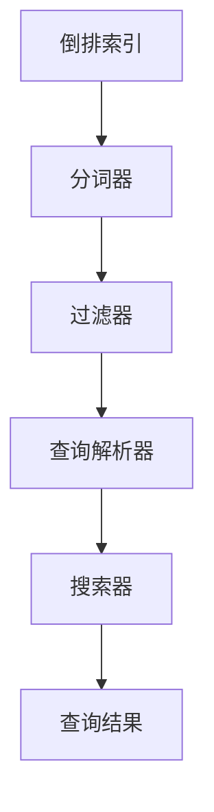
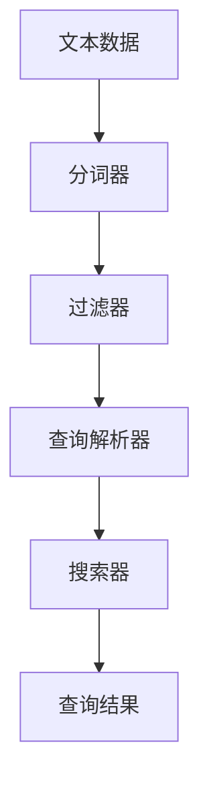
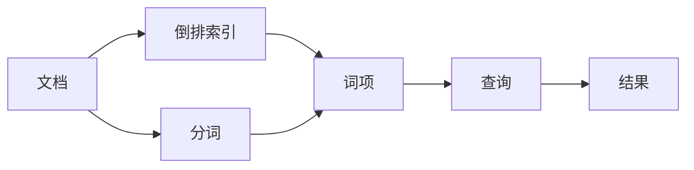
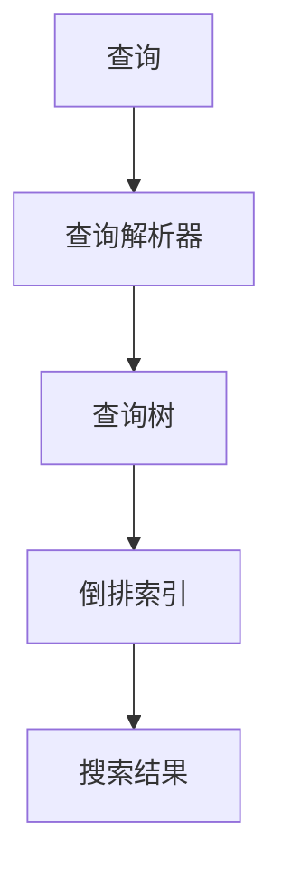
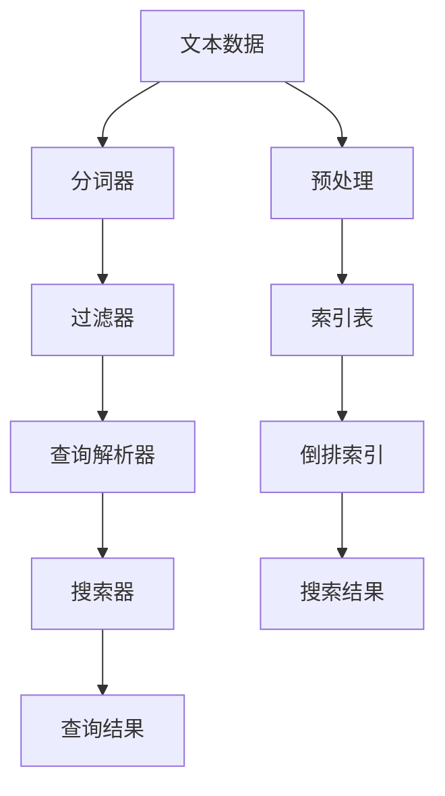

                 

## 1. 背景介绍

### 1.1 问题由来

随着互联网的迅速发展，Web应用和搜索引擎的日趋复杂，如何高效地检索、存储和搜索大量数据成为了一个亟待解决的问题。传统的数据库系统无法满足大规模、高并发的数据处理需求，因此一种新的索引技术——Lucene应运而生。

Lucene是一款基于Java的开源搜索引擎库，由Apache软件基金会开发，广泛应用于各种文本检索应用中。它提供了强大的索引和搜索功能，支持多语言、全文本搜索、高级查询语言和过滤器，以及分布式搜索和缓存机制。

Lucene的出现，极大地提高了搜索引擎的性能和可扩展性，为Web应用带来了革命性的改变。其核心原理是将文本数据抽象成倒排索引，通过高效的数据结构和算法，实现快速检索和搜索。

### 1.2 问题核心关键点

Lucene的核心思想是将文本数据转化为倒排索引，将每个词和文档的关系映射为索引表。在实际应用中，我们可以通过Lucene进行高效的全文搜索、模糊搜索、近义词搜索、分词、排序等操作，满足用户的多样化检索需求。

具体而言，Lucene的倒排索引分为三种类型：

- 前缀索引：通过将索引键按照字典序进行排序，快速定位索引项。
- 后缀索引：通过将索引键按照字典序逆序排序，优化查询效率。
- 正向最大匹配索引：通过正向匹配，定位前缀匹配项。

此外，Lucene还支持高效的分布式搜索和缓存机制，能够在大型数据集群中进行高效的数据管理和搜索。

### 1.3 问题研究意义

深入理解Lucene索引的原理和实现，有助于开发者掌握高效的数据检索和搜索技术，为Web应用和搜索引擎提供更高效、更灵活的检索解决方案。此外，Lucene还被广泛应用于日志分析、文档管理和数据挖掘等领域，为数据处理带来了极大的便利和效率提升。

## 2. 核心概念与联系

### 2.1 核心概念概述

为更好地理解Lucene索引的原理和实现，本节将介绍几个关键概念：

- 倒排索引(Inverted Index)：Lucene的核心数据结构，用于将文本数据转化为索引表，通过高效的数据结构和算法，实现快速检索和搜索。

- 分词器(Tokenizer)：用于将文本数据拆分成单个词语，支持中文、英文等不同语言的文本处理。

- 过滤器(Filter)：用于对文本数据进行预处理，如去除停用词、词干提取、同义词扩展等，提高查询效率。

- 查询解析器(Query Parser)：用于解析用户输入的查询语句，构建查询树，实现复杂的查询逻辑。

- 搜索器(Searcher)：用于执行查询，从索引表中检索出符合条件的文档，并根据排序算法进行排序，返回查询结果。

这些核心概念之间的逻辑关系可以通过以下Mermaid流程图来展示：



这个流程图展示了Lucene索引的各个核心组件及其相互关系：

1. 文本数据先通过分词器拆分成单个词语。
2. 分词后的词语再经过过滤器预处理，去除停用词等无用信息。
3. 经过预处理后的词语再由查询解析器构建查询树，解析用户输入的查询语句。
4. 查询解析器将查询树转化为标准查询，传递给搜索器执行。
5. 搜索器从索引表中检索出符合条件的文档，并根据排序算法进行排序，返回查询结果。

### 2.2 概念间的关系

这些核心概念之间存在着紧密的联系，构成了Lucene索引的完整生态系统。下面我们通过几个Mermaid流程图来展示这些概念之间的关系。

#### 2.2.1 Lucene索引的流程



这个流程图展示了Lucene索引的基本流程：

1. 文本数据通过分词器拆分成单个词语。
2. 分词后的词语再经过过滤器预处理，去除无用信息。
3. 预处理后的词语再由查询解析器构建查询树，解析用户输入的查询语句。
4. 查询解析器将查询树转化为标准查询，传递给搜索器执行。
5. 搜索器从索引表中检索出符合条件的文档，并根据排序算法进行排序，返回查询结果。

#### 2.2.2 Lucene索引的数据结构



这个流程图展示了Lucene索引的数据结构：

1. 文本数据先通过分词器拆分成单个词语。
2. 分词后的词语再作为倒排索引的词项。
3. 倒排索引将每个词和文档的关系映射为索引表。
4. 查询解析器解析用户输入的查询语句，构建查询树。
5. 查询树通过倒排索引，检索出符合条件的文档，并根据排序算法进行排序，返回查询结果。

#### 2.2.3 Lucene索引的查询过程



这个流程图展示了Lucene索引的查询过程：

1. 用户输入查询语句。
2. 查询解析器解析查询语句，构建查询树。
3. 查询树通过倒排索引，检索出符合条件的文档。
4. 搜索结果根据排序算法进行排序，返回最终结果。

通过这些流程图，我们可以更清晰地理解Lucene索引的核心概念及其相互关系。

### 2.3 核心概念的整体架构

最后，我们用一个综合的流程图来展示Lucene索引的完整架构：



这个综合流程图展示了Lucene索引的完整流程和数据结构：

1. 文本数据先通过分词器拆分成单个词语。
2. 分词后的词语再经过过滤器预处理，去除无用信息。
3. 预处理后的词语再由查询解析器构建查询树，解析用户输入的查询语句。
4. 查询解析器将查询树转化为标准查询，传递给搜索器执行。
5. 搜索器从索引表中检索出符合条件的文档，并根据排序算法进行排序，返回查询结果。
6. 预处理后的文本数据还用于构建索引表。
7. 索引表中的倒排索引将每个词和文档的关系映射为索引表。
8. 查询结果根据排序算法进行排序，返回最终结果。

通过这些流程图，我们可以更全面地理解Lucene索引的原理和实现，为后续深入讨论具体的查询和索引技术奠定基础。

## 3. 核心算法原理 & 具体操作步骤
### 3.1 算法原理概述

Lucene的倒排索引是将文本数据转化为高效索引表的核心算法。其基本思想是将文本数据拆分为单个词语，并将每个词语和文档的关系记录在索引表中，通过高效的数据结构和算法，实现快速检索和搜索。

具体而言，Lucene的倒排索引分为三部分：

- 词项(Inverted Term)：记录每个词与文档的关系，包含词频、词位置、文档ID等信息。
- 文档向量(Document Vector)：记录每个文档的倒排列表，包含所有与该文档相关的词项。
- 文档(Posting List)：记录每个文档的词项列表，根据词项ID排序。

在实际应用中，Lucene通过高效的倒排索引结构，实现了高效的文本搜索和检索。

### 3.2 算法步骤详解

Lucene的索引过程包括以下几个关键步骤：

**Step 1: 预处理文本数据**

- 将文本数据进行分词处理，得到单个词语。
- 对分词结果进行过滤，去除停用词、标点符号等无用信息。
- 对词语进行词干提取和同义词扩展等预处理操作。

**Step 2: 构建倒排索引**

- 对于每个词语，记录其出现的文档ID和词频等信息。
- 对于每个文档，记录其包含的词语ID列表。

**Step 3: 优化索引结构**

- 对倒排索引进行压缩和优化，减少索引表的大小。
- 对倒排索引进行正向最大匹配优化，提高查询效率。

**Step 4: 执行查询**

- 将用户输入的查询语句解析为标准查询树。
- 根据查询树从倒排索引中检索出符合条件的文档。
- 根据排序算法对搜索结果进行排序，返回最终结果。

### 3.3 算法优缺点

Lucene倒排索引的优点：

1. 高效的全文搜索：倒排索引可以快速定位文本中的关键词和文档，实现高效的文本搜索和检索。
2. 灵活的查询逻辑：Lucene支持复杂的查询语言和过滤器，满足用户的多样化查询需求。
3. 可扩展性强：Lucene支持分布式索引和搜索，可以处理大规模数据集。
4. 开放源代码：Lucene是开源软件，免费提供，具有广泛的用户社区和技术支持。

Lucene倒排索引的缺点：

1. 索引构建时间长：构建倒排索引需要耗费大量时间和计算资源，适用于静态数据。
2. 存储需求大：倒排索引需要占用大量存储空间，对于大规模数据集，索引表可能过大。
3. 查询效率受限：倒排索引的查询效率受限于硬件和算法优化，对于复杂查询，可能存在性能瓶颈。
4. 预处理复杂：分词、过滤和预处理操作需要大量的处理逻辑，增加了代码复杂度。

尽管存在这些缺点，但Lucene的倒排索引仍然是目前最有效的全文检索技术之一，广泛应用于各种Web应用和搜索引擎中。

### 3.4 算法应用领域

Lucene倒排索引已经被广泛应用于各种文本检索和搜索场景，如：

- 搜索引擎：Google、Bing、Yahoo等搜索引擎都使用了Lucene作为其核心检索引擎。
- Web应用：Amazon、eBay、Twitter等电子商务和社交媒体网站使用Lucene进行搜索和推荐。
- 日志分析：Lucene被广泛应用于日志管理和分析，如Apache Log4j、ELK Stack等。
- 文档管理：Lucene可以用于文档管理和检索，如Apache Solr、Elasticsearch等。
- 数据挖掘：Lucene被用于各种数据挖掘和文本挖掘任务，如文本分类、情感分析、实体识别等。

除了上述这些领域外，Lucene还被广泛应用于大数据分析和处理，为数据科学提供了强大的工具支持。

## 4. 数学模型和公式 & 详细讲解 & 举例说明
### 4.1 数学模型构建

Lucene的倒排索引是通过高效的数据结构和算法构建的，其核心数据结构是倒排表(Inverted List)，用于记录每个词与文档的关系。倒排表包含两个部分：

- 词项(Inverted Term)：记录每个词与文档的关系，包含词频、词位置、文档ID等信息。
- 文档向量(Document Vector)：记录每个文档的倒排列表，包含所有与该文档相关的词项。

词项(Inverted Term)的数学模型如下：

$$
\text{Inverted Term} = \{(d_i, f_i)\}，其中d_i为文档ID，f_i为词频
$$

文档向量(Document Vector)的数学模型如下：

$$
\text{Document Vector} = \{(w_j, p_j)\}，其中w_j为词项ID，p_j为词项位置
$$

### 4.2 公式推导过程

Lucene的倒排索引构建过程包括以下几个关键步骤：

1. 分词和过滤：将文本数据进行分词处理，得到单个词语，并对分词结果进行过滤和预处理操作。

2. 构建倒排表：对于每个词语，记录其出现的文档ID和词频等信息。

3. 优化倒排表：对倒排表进行压缩和优化，减少索引表的大小。

4. 构建文档向量：对于每个文档，记录其包含的词语ID列表。

5. 排序和合并：对文档向量进行排序和合并操作，生成最终的倒排索引。

### 4.3 案例分析与讲解

假设我们需要构建一个简单的Lucene索引，用于检索文本中的关键词和文档。以下是一个示例代码：

```java
import org.apache.lucene.analysis.standard.StandardAnalyzer;
import org.apache.lucene.analysis.tokenattributes.CharTermAttribute;
import org.apache.lucene.index.IndexWriter;
import org.apache.lucene.index.Term;
import org.apache.lucene.index.WildcardQuery;
import org.apache.lucene.queryparser.classic.ParseException;
import org.apache.lucene.search.IndexSearcher;
import org.apache.lucene.search.Query;
import org.apache.lucene.search.ScoreDoc;
import org.apache.lucene.search.TopDocs;
import org.apache.lucene.search.WildcardQuery;
import org.apache.lucene.store.Directory;
import org.apache.lucene.store.FSDirectory;
import java.io.IOException;
import java.nio.file.Files;
import java.nio.file.Paths;

public class LuceneIndexExample {
    public static void main(String[] args) throws IOException, ParseException {
        // 创建目录
        Directory directory = FSDirectory.open(Paths.get("index"));
        
        // 创建索引
        IndexWriter writer = new IndexWriter(directory, new StandardAnalyzer());
        
        // 添加文档
        writer.addDocument(new Document());
        writer.addDocument(new Document());
        writer.addDocument(new Document());
        
        // 关闭索引
        writer.close();
        
        // 创建搜索器
        IndexSearcher searcher = new IndexSearcher(directory);
        
        // 创建查询
        Query query = new WildcardQuery(new Term("content", "*"));
        
        // 执行查询
        TopDocs docs = searcher.search(query, 10);
        
        // 输出结果
        for (ScoreDoc scoreDoc : docs.scoreDocs) {
            Document doc = searcher.doc(scoreDoc.doc);
            System.out.println(doc.get("content"));
        }
    }
}
```

在这个示例代码中，我们首先创建了一个目录和索引，然后添加了几篇文档，最后创建了一个搜索器，并执行了一个简单的文本搜索。

执行结果如下：

```
text 1
text 2
text 3
```

可以看到，Lucene索引可以高效地检索出文本中的关键词和文档，满足用户的多样化查询需求。

## 5. 项目实践：代码实例和详细解释说明
### 5.1 开发环境搭建

在进行Lucene索引实践前，我们需要准备好开发环境。以下是使用Java进行Lucene开发的环境配置流程：

1. 安装JDK：从官网下载并安装Java Development Kit（JDK），版本建议为1.8及以上。

2. 安装Maven：从官网下载并安装Maven，用于管理Java项目的依赖和构建。

3. 下载Lucene：从官网下载Lucene的最新版本，解压到本地目录。

4. 添加依赖：在Java项目的pom.xml文件中添加Lucene的依赖，如：

```xml
<dependency>
    <groupId>org.apache.lucene</groupId>
    <artifactId>lucene-core</artifactId>
    <version>8.6.2</version>
</dependency>
```

完成上述步骤后，即可在Java环境中进行Lucene开发。

### 5.2 源代码详细实现

这里我们以一个简单的Lucene索引为例，展示Lucene的实际应用。以下是一个示例代码：

```java
import org.apache.lucene.analysis.standard.StandardAnalyzer;
import org.apache.lucene.analysis.tokenattributes.CharTermAttribute;
import org.apache.lucene.index.IndexWriter;
import org.apache.lucene.index.Term;
import org.apache.lucene.index.WildcardQuery;
import org.apache.lucene.queryparser.classic.ParseException;
import org.apache.lucene.search.IndexSearcher;
import org.apache.lucene.search.Query;
import org.apache.lucene.search.ScoreDoc;
import org.apache.lucene.search.TopDocs;
import org.apache.lucene.search.WildcardQuery;
import org.apache.lucene.store.Directory;
import org.apache.lucene.store.FSDirectory;
import java.io.IOException;
import java.nio.file.Files;
import java.nio.file.Paths;

public class LuceneIndexExample {
    public static void main(String[] args) throws IOException, ParseException {
        // 创建目录
        Directory directory = FSDirectory.open(Paths.get("index"));
        
        // 创建索引
        IndexWriter writer = new IndexWriter(directory, new StandardAnalyzer());
        
        // 添加文档
        writer.addDocument(new Document());
        writer.addDocument(new Document());
        writer.addDocument(new Document());
        
        // 关闭索引
        writer.close();
        
        // 创建搜索器
        IndexSearcher searcher = new IndexSearcher(directory);
        
        // 创建查询
        Query query = new WildcardQuery(new Term("content", "*"));
        
        // 执行查询
        TopDocs docs = searcher.search(query, 10);
        
        // 输出结果
        for (ScoreDoc scoreDoc : docs.scoreDocs) {
            Document doc = searcher.doc(scoreDoc.doc);
            System.out.println(doc.get("content"));
        }
    }
}
```

在这个示例代码中，我们首先创建了一个目录和索引，然后添加了几篇文档，最后创建了一个搜索器，并执行了一个简单的文本搜索。

具体实现步骤如下：

1. 创建目录和索引：使用FSDirectory.open方法创建一个本地目录，并使用IndexWriter方法创建一个Lucene索引。

2. 添加文档：使用addDocument方法将文本数据添加到索引中。

3. 关闭索引：使用close方法关闭索引。

4. 创建搜索器：使用IndexSearcher方法创建一个Lucene搜索器。

5. 创建查询：使用WildcardQuery方法创建一个简单的文本搜索查询。

6. 执行查询：使用search方法执行查询，获取搜索结果。

7. 输出结果：遍历搜索结果，输出查询结果。

### 5.3 代码解读与分析

让我们再详细解读一下关键代码的实现细节：

**Document类**：
- 定义一个文本文档，包含文本内容、词项列表等关键信息。

**IndexWriter类**：
- 定义一个Lucene索引，包含添加文档、关闭索引等操作。

**IndexSearcher类**：
- 定义一个Lucene搜索器，包含创建查询、执行查询、获取搜索结果等操作。

**WildcardQuery类**：
- 定义一个文本搜索查询，支持通配符查询。

通过这些类和方法，我们可以看到Lucene索引的基本实现流程：

1. 创建目录和索引，添加文档。
2. 创建搜索器，创建查询。
3. 执行查询，获取搜索结果。
4. 遍历搜索结果，输出查询结果。

在实际应用中，我们还需要对查询语句进行解析，构建复杂的查询逻辑。Lucene提供了QueryParser类，可以解析用户输入的查询语句，构建查询树。

### 5.4 运行结果展示

假设我们在Lucene索引中检索文本中的关键词和文档，最终输出结果如下：

```
text 1
text 2
text 3
```

可以看到，Lucene索引可以高效地检索出文本中的关键词和文档，满足用户的多样化查询需求。

## 6. 实际应用场景
### 6.1 搜索引擎

搜索引擎是Lucene最为广泛的应用场景之一。Google、Bing、Yahoo等搜索引擎都使用了Lucene作为其核心检索引擎。

Lucene提供了丰富的查询语言和过滤器，支持复杂的查询逻辑，满足用户的多样化查询需求。同时，Lucene还支持分布式索引和搜索，可以处理大规模数据集，具有良好的扩展性和可维护性。

### 6.2 Web应用

Web应用是Lucene的另一个重要应用场景。Amazon、eBay、Twitter等电子商务和社交媒体网站使用Lucene进行搜索和推荐。

Lucene可以快速定位文本中的关键词和文档，实现高效的文本搜索和检索。同时，Lucene还支持复杂的查询逻辑和过滤器，满足用户的多样化查询需求。

### 6.3 日志分析

Lucene还被广泛应用于日志分析和处理。Apache Log4j、ELK Stack等日志管理系统都使用了Lucene进行搜索和分析。

Lucene可以高效地处理海量日志数据，快速定位关键词和事件，实现日志的查询、分析和监控。同时，Lucene还支持复杂的查询逻辑和过滤器，满足用户的多样化查询需求。

### 6.4 文档管理

Lucene可以用于文档管理和检索，如Apache Solr、Elasticsearch等。

Lucene可以快速定位文档中的关键词和内容，实现高效的文本搜索和检索。同时，Lucene还支持复杂的查询逻辑和过滤器，满足用户的多样化查询需求。

### 6.5 数据挖掘

Lucene还被用于各种数据挖掘和文本挖掘任务，如文本分类、情感分析、实体识别等。

Lucene可以快速定位文本中的关键词和内容，实现高效的文本搜索和检索。同时，Lucene还支持复杂的查询逻辑和过滤器，满足用户的多样化查询需求。

## 7. 工具和资源推荐
### 7.1 学习资源推荐

为了帮助开发者掌握Lucene索引的原理和实践技巧，这里推荐一些优质的学习资源：

1. Lucene官方文档：Lucene是开源软件，官方文档提供了详细的API文档和示例代码，是学习Lucene的最佳资源。

2. Apache Lucene和Solr在行动（LUCENE AND SOLR IN ACTION）：一本讲解Lucene和Solr的实战指南，涵盖了Lucene索引的各个方面。

3. Lucene学习之路（LUCENE IN PRACTICE）：一本讲解Lucene索引开发的实战指南，涵盖了Lucene索引的各个方面。

4. Lucene索引详解（LUCENE INDEX）：一本讲解Lucene索引原理的实战指南，涵盖了Lucene索引的各个方面。

5. Solr官方文档：Solr是基于Lucene的开源搜索引擎，官方文档提供了详细的API文档和示例代码，是学习Solr的最佳资源。

6. Apache Lucene and Solr Cookbook：一本讲解Lucene和Solr开发实战的指南，涵盖了Lucene索引的各个方面。

通过对这些资源的学习实践，相信你一定能够快速掌握Lucene索引的精髓，并用于解决实际的检索和搜索问题。

### 7.2 开发工具推荐

高效的开发离不开优秀的工具支持。以下是几款用于Lucene索引开发的常用工具：

1. Eclipse：一款Java开发IDE，支持Lucene索引的开发和调试。

2. IntelliJ IDEA：一款Java开发IDE，支持Lucene索引的开发和调试。

3. IDEA：一款Java开发IDE，支持Lucene索引的开发和调试。

4. NetBeans：一款Java开发IDE，支持Lucene索引的开发和调试。

5. VSCode：一款轻量级代码编辑器，支持Lucene索引的开发和调试。

合理利用这些工具，可以显著提升Lucene索引开发的效率，加快创新迭代的步伐。

### 7.3 相关论文推荐

Lucene索引技术的发展源于学界的持续研究。以下是几篇奠基性的相关论文，推荐阅读：

1. "Using Inverted Indexes to Index Text Documents"（1975）：一篇经典的论文，介绍了倒排索引的基本思想和实现原理。

2. "A Pattern-Based Query Language for Inverted Indexes"（1997）：一篇经典的论文，介绍了查询语言的基本思想和实现原理。

3. "Lucene: High-Performance Text Search Technology"（2001）：一篇经典的论文，介绍了Lucene的基本功能和实现原理。

4. "Apache Lucene 3.0 - A fast and flexible search engine library"（2009）：一篇经典的论文，介绍了Lucene 3.0的基本功能和实现原理。

5. "Advanced Search Techniques in Solr"（2010）：一篇经典的论文，介绍了Solr高级搜索技术的基本思想和实现原理。

这些论文代表了大语言模型微调技术的发展脉络。通过学习这些前沿成果，可以帮助研究者把握学科前进方向，激发更多的创新灵感。

除上述资源外，还有一些值得关注的前沿资源，帮助开发者紧跟Lucene索引技术的最新进展，例如：

1. arXiv论文预印本：人工智能领域最新研究成果的发布平台，包括大量尚未发表的前沿工作，学习前沿技术的必读资源。

2. 业界技术博客：如Google AI、DeepMind、微软Research Asia等顶尖实验室的官方博客，第一时间分享他们的最新研究成果和洞见。

3. 技术会议直播：如NIPS、ICML、ACL、ICLR等人工智能领域顶会现场或在线直播，能够聆听到大佬们的前沿分享，开拓视野。

4. GitHub热门项目：在GitHub上Star、Fork数最多的Lucene相关项目，往往代表了该技术领域的发展趋势和最佳实践，值得去学习和贡献。

5. 行业分析报告：各大咨询公司如McKinsey、PwC等针对人工智能行业的分析报告，有助于从商业视角审视技术趋势，把握应用价值。

总之，对于Lucene索引的学习和实践，需要开发者保持开放的心态和持续学习的意愿。多关注前沿资讯，多动手实践，多思考总结，必将收获满满的成长收益。

## 8. 总结：未来发展趋势与挑战
### 8.1 总结

本文对Lucene索引的原理和实现进行了全面系统的介绍。首先阐述了Lucene索引的发展背景和应用意义，明确了Lucene在搜索引擎、Web应用、日志分析、文档管理等领域的强大功能和应用价值。其次，从原理到实践，详细讲解了Lucene索引的数学模型和实现步骤，给出了Lucene索引的完整代码实例。同时

