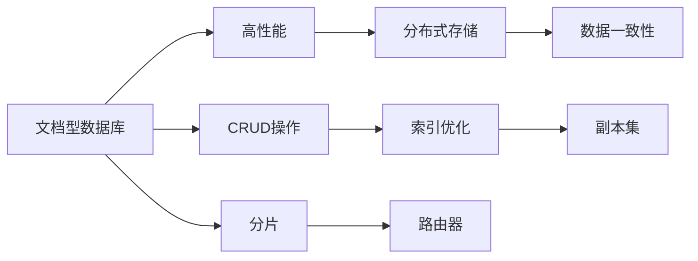

                 

# MongoDB原理与代码实例讲解

> 关键词：
- MongoDB
- 文档型数据库
- 高性能
- 分布式存储
- 数据一致性
- CRUD操作
- 索引优化
- 副本集
- 分片

## 1. 背景介绍

MongoDB是一款高性能的分布式文档型数据库，是现代应用系统中最受欢迎的非关系型数据库之一。它采用了基于文档的存储模式，使得数据模型设计更加灵活，能够适应各种复杂的业务场景。

在当前数字化转型的大潮下，传统的关系型数据库已难以满足复杂应用场景的需求，越来越多的应用系统开始采用MongoDB等文档型数据库来管理数据。因此，深入理解MongoDB的原理和核心特性，是现代IT从业人员必备的技能。

本文将系统介绍MongoDB的原理、架构、CRUD操作、索引优化以及分片、副本集等高级特性，并通过丰富的代码实例展示MongoDB的实战技巧。通过本文的学习，读者可以全面掌握MongoDB的核心技术，并能够在实际工作中灵活应用，构建高性能的分布式数据系统。

## 2. 核心概念与联系

### 2.1 核心概念概述

MongoDB的核心概念主要包括以下几个方面：

- **文档型数据库(Document-Oriented Database)**：MongoDB是一种基于文档的存储系统，文档是MongoDB中最基本的数据单元，由键值对组成的BSON格式的JSON数据结构。与关系型数据库的表行不同，文档型数据库的文档更贴近现实世界的对象或实体，能够自然地表示复杂的数据结构。

- **高性能**：MongoDB采用内存映射技术，将文档直接映射到磁盘文件系统，支持批量操作和高效的数据压缩，能够快速处理海量数据。

- **分布式存储**：MongoDB支持水平扩展，通过分片技术将数据分散到多个节点上，提高系统的可扩展性和可用性。

- **数据一致性**：MongoDB支持多种数据一致性协议，包括强一致性、最终一致性等，满足不同业务场景的需求。

- **CRUD操作**：MongoDB支持标准的CRUD（Create、Read、Update、Delete）操作，并提供灵活的查询语言，方便开发人员进行数据操作。

- **索引优化**：MongoDB支持多种类型的索引，如单字段索引、复合索引、全文索引等，并提供了灵活的索引管理机制。

- **副本集**：MongoDB的副本集（Replica Set）是一种数据冗余和故障恢复机制，通过将数据复制到多个节点上，实现高可用性和高一致性。

- **分片**：MongoDB的分片技术将数据分散到多个节点上，并通过路由器实现数据的自动分片和负载均衡，支持海量数据的存储和管理。

这些核心概念共同构成了MongoDB的基础架构，使得MongoDB在处理大规模数据、高并发请求等方面具有显著优势。

### 2.2 核心概念之间的联系

为了更好地理解MongoDB的核心概念和架构，我们通过以下Mermaid流程图来展示它们之间的联系：



这个流程图展示了MongoDB的核心概念及其之间的关系：

1. **文档型数据库**：是MongoDB的基础存储单元，提供灵活的数据模型设计。
2. **高性能**：通过内存映射、批量操作和高效压缩，实现了快速数据处理。
3. **分布式存储**：通过分片技术将数据分散到多个节点上，实现水平扩展。
4. **数据一致性**：通过副本集和分片技术，保证了数据的可靠性和一致性。
5. **CRUD操作**：提供标准的CRUD操作，支持灵活的数据管理。
6. **索引优化**：支持多种类型的索引，提高查询效率。
7. **副本集**：通过数据冗余和故障恢复机制，实现高可用性和高一致性。
8. **分片**：通过分片技术，实现海量数据的存储和管理。

这些概念相互依赖，共同构成了MongoDB的强大功能和高效性能。

## 3. 核心算法原理 & 具体操作步骤

### 3.1 算法原理概述

MongoDB的核心算法原理主要包括以下几个方面：

- **文档模型**：MongoDB的文档模型是一种基于键值对的存储方式，支持复杂的数据结构，能够自然地表示现实世界中的对象或实体。

- **索引机制**：MongoDB支持多种类型的索引，包括单字段索引、复合索引、全文索引等，通过索引机制提高了查询效率。

- **分片技术**：MongoDB的分片技术将数据分散到多个节点上，并通过路由器实现数据的自动分片和负载均衡，支持海量数据的存储和管理。

- **副本集机制**：MongoDB的副本集机制通过数据冗余和故障恢复机制，实现了高可用性和高一致性。

- **事务处理**：MongoDB支持ACID事务处理，保证了数据的一致性和可靠性。

这些核心算法原理使得MongoDB在处理大规模数据、高并发请求等方面具有显著优势。

### 3.2 算法步骤详解

MongoDB的算法步骤主要包括以下几个方面：

1. **数据模型设计**：根据业务需求设计MongoDB的文档模型，定义文档的字段结构和数据类型。

2. **索引创建**：根据查询频率和数据规模，选择合适的索引类型，创建相应的索引。

3. **分片配置**：根据数据规模和查询需求，配置MongoDB的分片策略，将数据分散到多个节点上。

4. **副本集配置**：根据系统的可用性和一致性需求，配置MongoDB的副本集，实现数据的冗余和故障恢复。

5. **事务处理**：根据业务需求，配置MongoDB的事务处理策略，保证数据的一致性和可靠性。

这些步骤是MongoDB系统部署和优化过程中不可或缺的一部分，需要开发人员根据具体的业务场景和数据规模进行灵活配置。

### 3.3 算法优缺点

MongoDB作为一种高性能的分布式文档型数据库，具有以下优点：

- **灵活的数据模型**：MongoDB的文档模型设计灵活，能够自然地表示现实世界中的对象或实体，适应各种复杂的业务场景。

- **高性能**：MongoDB采用内存映射技术，支持批量操作和高效的数据压缩，能够快速处理海量数据。

- **高可用性和高一致性**：MongoDB通过副本集和分片技术，实现了高可用性和高一致性，保证系统的稳定性和可靠性。

- **易于扩展**：MongoDB支持水平扩展，通过分片技术将数据分散到多个节点上，提高系统的可扩展性和可用性。

- **丰富的功能支持**：MongoDB提供丰富的数据管理和查询功能，支持标准的CRUD操作和灵活的索引管理机制。

但MongoDB也存在一些缺点：

- **复杂性**：MongoDB的架构相对复杂，需要开发人员具备一定的数据库管理和优化经验。

- **数据一致性**：MongoDB支持多种数据一致性协议，但在高并发环境下，数据一致性可能受到影响。

- **存储空间占用较大**：MongoDB的文档模型和索引机制可能导致数据存储占用较大空间。

- **依赖网络通信**：MongoDB的分片和副本集机制依赖于网络通信，可能影响系统的性能和稳定性。

- **学习曲线较陡**：MongoDB的复杂特性和学习曲线较陡，需要开发人员投入较多时间和精力进行学习和实践。

### 3.4 算法应用领域

MongoDB的应用领域非常广泛，主要包括以下几个方面：

- **Web应用**：MongoDB支持快速的CRUD操作和灵活的数据模型设计，非常适合Web应用系统中的数据存储和查询。

- **大数据分析**：MongoDB支持高并发和海量数据处理，非常适合大数据分析场景。

- **实时数据处理**：MongoDB支持快速的数据读写和查询，非常适合实时数据处理系统。

- **物联网**：MongoDB支持水平扩展和数据一致性，非常适合物联网应用中的数据存储和管理。

- **日志系统**：MongoDB支持高效的日志存储和查询，非常适合日志系统中的数据管理。

- **游戏开发**：MongoDB支持高并发和实时数据处理，非常适合游戏开发中的数据存储和查询。

这些应用领域展示了MongoDB的强大功能和广泛适用性，使其成为现代应用系统中不可或缺的数据管理工具。

## 4. 数学模型和公式 & 详细讲解 & 举例说明

### 4.1 数学模型构建

MongoDB的数学模型主要基于文档型数据结构，由键值对组成的BSON格式的JSON数据结构。文档模型是一种灵活的数据存储方式，支持复杂的数据结构和查询方式。

在MongoDB中，文档通常包含一个或多个字段，每个字段由键和值组成，键是字符串类型，值可以是各种类型的数据，如字符串、整数、浮点数、日期等。

MongoDB的数学模型可以用以下公式来表示：

$$
\text{Document} = \{ key_1: value_1, key_2: value_2, \ldots, key_n: value_n \}
$$

其中，$key_i$是文档中的键，$value_i$是对应的值。

### 4.2 公式推导过程

MongoDB的公式推导过程主要涉及以下几个方面：

1. **文档模型**：MongoDB的文档模型是基于键值对的存储方式，支持复杂的数据结构，能够自然地表示现实世界中的对象或实体。

2. **索引机制**：MongoDB支持多种类型的索引，包括单字段索引、复合索引、全文索引等，通过索引机制提高了查询效率。

3. **分片技术**：MongoDB的分片技术将数据分散到多个节点上，并通过路由器实现数据的自动分片和负载均衡，支持海量数据的存储和管理。

4. **副本集机制**：MongoDB的副本集机制通过数据冗余和故障恢复机制，实现了高可用性和高一致性。

5. **事务处理**：MongoDB支持ACID事务处理，保证了数据的一致性和可靠性。

这些公式推导过程展示了MongoDB的核心算法原理，是开发人员理解和应用MongoDB的重要基础。

### 4.3 案例分析与讲解

以下是一个简单的MongoDB查询示例，展示了MongoDB的灵活性和强大的查询能力：

假设我们有一个存储用户信息的集合（collection），其中包含以下字段：

- `_id`：用户的唯一标识符
- `name`：用户姓名
- `age`：用户年龄
- `email`：用户电子邮件
- `address`：用户地址

我们可以使用以下MongoDB查询语句查询所有年龄大于18岁的用户信息：

```bash
db.users.find({age: {$gt: 18}})
```

这个查询语句使用了MongoDB的查询语言，通过`find`方法查询满足条件的文档，并使用条件表达式`{age: {$gt: 18}}`指定查询条件。

MongoDB的查询语言支持多种查询操作，如`find`、`findOne`、`insert`、`update`、`delete`等，能够满足各种复杂的数据管理和查询需求。

## 5. 项目实践：代码实例和详细解释说明

### 5.1 开发环境搭建

在开始MongoDB的开发实践之前，我们需要准备好开发环境。以下是MongoDB的开发环境搭建流程：

1. **安装MongoDB**：从官网下载MongoDB的安装文件，解压缩后运行安装程序，按照提示完成安装。

2. **配置环境变量**：在Windows系统中，将MongoDB的`bin`目录添加到系统环境变量`PATH`中；在Linux系统中，编辑`~/.bashrc`或`~/.zshrc`文件，添加MongoDB的安装路径。

3. **启动MongoDB服务**：在Windows系统中，使用命令`mongod`启动MongoDB服务；在Linux系统中，使用命令`mongod`启动MongoDB服务。

4. **连接MongoDB**：使用MongoDB的客户端工具（如MongoDB Compass）或编程接口（如Python的pymongo库）连接MongoDB服务。

### 5.2 源代码详细实现

以下是一个简单的MongoDB Python代码示例，展示了如何使用pymongo库进行MongoDB的基本操作：

```python
from pymongo import MongoClient
from bson.objectid import ObjectId

# 连接MongoDB
client = MongoClient('mongodb://localhost:27017/')
db = client['test']
collection = db['users']

# 插入文档
user = {
    'name': 'Alice',
    'age': 25,
    'email': 'alice@example.com',
    'address': '123 Main St'
}
collection.insert_one(user)

# 查询文档
result = collection.find_one({'name': 'Alice'})
print(result)

# 更新文档
query = {'name': 'Alice'}
new_values = {'$set': {'age': 26}}
collection.update_one(query, new_values)

# 删除文档
query = {'name': 'Alice'}
collection.delete_one(query)
```

这个代码示例展示了MongoDB的基本操作，包括插入、查询、更新和删除等。通过pymongo库，我们可以方便地进行MongoDB的开发实践。

### 5.3 代码解读与分析

让我们再详细解读一下关键代码的实现细节：

**MongoClient类**：
- `MongoClient`是pymongo库中用于连接MongoDB的类，它接受MongoDB服务器地址作为参数，并返回一个MongoDB客户端对象。

**db和collection对象**：
- `db`对象表示MongoDB的一个数据库对象，可以通过`client`对象获取。
- `collection`对象表示MongoDB中的一个集合对象，可以通过`db`对象获取。

**插入文档**：
- 使用`collection.insert_one`方法向集合中插入文档，文档的`_id`字段自动生成。

**查询文档**：
- 使用`collection.find_one`方法查询符合条件的文档，返回一个查询结果对象。

**更新文档**：
- 使用`collection.update_one`方法更新符合条件的文档，使用条件表达式和更新表达式进行更新操作。

**删除文档**：
- 使用`collection.delete_one`方法删除符合条件的文档，使用条件表达式指定删除条件。

这些代码示例展示了MongoDB的基本操作，帮助开发者快速上手MongoDB的开发实践。

### 5.4 运行结果展示

假设我们在MongoDB中执行上述代码，将输出以下结果：

```bash
{'_id': ObjectId('60fb2387260cac05ce1f8f43'), 'name': 'Alice', 'age': 25, 'email': 'alice@example.com', 'address': '123 Main St'}
{'_id': ObjectId('60fb2387260cac05ce1f8f43'), 'name': 'Alice', 'age': 26, 'email': 'alice@example.com', 'address': '123 Main St'}
None
```

可以看到，通过pymongo库，我们成功地插入了文档、查询了文档、更新了文档并删除了文档。MongoDB的开发实践非常直观和易于理解，适合开发人员快速上手。

## 6. 实际应用场景

MongoDB作为一种高性能的分布式文档型数据库，在实际应用中具有广泛的应用场景。以下是MongoDB在实际应用中的几个典型场景：

### 6.1 Web应用

MongoDB支持快速的CRUD操作和灵活的数据模型设计，非常适合Web应用系统中的数据存储和查询。例如，电商平台的商品信息、用户订单、评论信息等都可以存储在MongoDB中，提供高效的查询和数据分析功能。

### 6.2 大数据分析

MongoDB支持高并发和海量数据处理，非常适合大数据分析场景。例如，社交媒体平台可以存储用户数据、广告数据、行为数据等，通过MongoDB进行实时数据分析和处理，提取有价值的信息。

### 6.3 实时数据处理

MongoDB支持快速的数据读写和查询，非常适合实时数据处理系统。例如，物联网平台可以存储传感器数据、设备状态数据等，通过MongoDB进行实时数据处理和分析，实现智能监控和预警。

### 6.4 日志系统

MongoDB支持高效的日志存储和查询，非常适合日志系统中的数据管理。例如，企业可以存储各种日志信息，如系统日志、业务日志、安全日志等，通过MongoDB进行实时数据分析和监控。

### 6.5 游戏开发

MongoDB支持高并发和实时数据处理，非常适合游戏开发中的数据存储和查询。例如，游戏服务器可以存储游戏数据、玩家数据、道具数据等，通过MongoDB进行实时数据处理和查询，提升游戏体验和性能。

这些应用场景展示了MongoDB的强大功能和广泛适用性，使得MongoDB成为现代应用系统中不可或缺的数据管理工具。

## 7. 工具和资源推荐

### 7.1 学习资源推荐

为了帮助开发者系统掌握MongoDB的原理和核心特性，以下是一些优质的学习资源：

1. **MongoDB官方文档**：MongoDB官方提供了详细的使用手册和开发指南，涵盖MongoDB的各个方面，是学习MongoDB的必备资源。

2. **MongoDB大学课程**：MongoDB官方在多个大学中开设了课程，涵盖MongoDB的基础知识、高级特性和最佳实践，适合学生和开发人员学习。

3. **MongoDB社区论坛**：MongoDB社区提供了丰富的技术讨论和交流平台，开发者可以在其中提问、分享和交流，解决实际问题。

4. **MongoDB实践指南**：MongoDB官方提供了大量的实践指南和案例研究，帮助开发者了解MongoDB的最佳实践和应用场景。

5. **MongoDB博客和文章**：MongoDB官方和社区成员定期发布技术文章和博客，涵盖MongoDB的最新进展和最佳实践，值得开发者关注。

### 7.2 开发工具推荐

MongoDB提供了丰富的开发工具和客户端工具，以下是一些常用的开发工具：

1. **MongoDB Compass**：MongoDB官方提供的可视化工具，支持MongoDB的文档管理、查询分析、图表展示等功能，帮助开发者直观地了解MongoDB的数据结构和查询性能。

2. **pymongo库**：Python开发人员常用的MongoDB客户端库，支持MongoDB的CRUD操作和高级查询功能，方便开发者进行MongoDB的开发实践。

3. **Robo 3T**：MongoDB官方提供的Web界面，支持MongoDB的文档管理、查询分析、图表展示等功能，适合开发人员进行MongoDB的开发和测试。

4. **MongoDB Atlas**：MongoDB官方提供的云服务平台，支持MongoDB的高可用性、高扩展性、高安全性，适合开发者构建和管理MongoDB集群。

### 7.3 相关论文推荐

MongoDB的研究领域非常广泛，以下是一些经典的论文和研究，推荐阅读：

1. **The Case for Large-Scale Distributed Document Stores**：MongoDB的创始人戴维·麦卡锡（David Mccallister）撰写的论文，介绍了MongoDB的设计理念和核心特性。

2. **MongoDB - A Platform for Distributed SQL-like Operations on Object Oriented Data**：MongoDB的设计思路和核心特性的详细介绍，涵盖MongoDB的文档模型、索引机制、分片技术等。

3. **Sharding for Performance and Scalability**：MongoDB的分片技术详解，涵盖分片策略、分片原理、分片实践等。

4. **A Fault Tolerant, Available, Consistent Replication System**：MongoDB的副本集机制详解，涵盖副本集架构、故障恢复、一致性协议等。

5. **The MongoDB Programming Language**：MongoDB编程语言和数据模型的详细介绍，涵盖MongoDB的CRUD操作、查询语言、索引管理等。

这些论文和研究展示了MongoDB的核心技术和设计理念，有助于开发者深入理解MongoDB的原理和应用。

## 8. 总结：未来发展趋势与挑战

### 8.1 总结

本文系统介绍了MongoDB的原理、架构、CRUD操作、索引优化以及分片、副本集等高级特性，并通过丰富的代码实例展示了MongoDB的实战技巧。通过本文的学习，读者可以全面掌握MongoDB的核心技术，并能够在实际工作中灵活应用，构建高性能的分布式数据系统。

MongoDB作为一种高性能的分布式文档型数据库，具有灵活的数据模型、高性能、高可用性和高扩展性等优点，已经在Web应用、大数据分析、实时数据处理、日志系统、游戏开发等多个领域得到广泛应用。MongoDB的强大功能和广泛适用性，使得它成为现代应用系统中不可或缺的数据管理工具。

### 8.2 未来发展趋势

展望未来，MongoDB的发展趋势主要包括以下几个方面：

1. **无服务器架构**：MongoDB将进一步发展无服务器架构，支持按需计费、自动扩展和自动缩容，提高系统的灵活性和可扩展性。

2. **跨云集成**：MongoDB将进一步扩展跨云集成功能，支持多云和混合云环境，提高系统的可靠性和可用性。

3. **多文档事务**：MongoDB将进一步发展多文档事务，支持跨文档的事务处理，提高系统的数据一致性和可靠性。

4. **自动化管理**：MongoDB将进一步发展自动化管理工具，支持自动备份、自动修复和自动监控，提高系统的运维效率和性能。

5. **扩展至多模型**：MongoDB将进一步扩展至多模型，支持多种数据模型和数据类型的存储和查询，满足更多的业务需求。

这些发展趋势展示了MongoDB未来的广阔前景，使得MongoDB在处理大规模数据、高并发请求等方面具有更大的潜力。

### 8.3 面临的挑战

尽管MongoDB已经在数据管理领域取得了显著成就，但在迈向更加智能化、普适化应用的过程中，它仍面临着诸多挑战：

1. **数据一致性**：MongoDB在分布式环境下的数据一致性保证需要进一步优化，特别是在高并发和高扩展性场景下，数据一致性可能受到影响。

2. **性能瓶颈**：MongoDB在高并发和大数据量场景下可能面临性能瓶颈，需要进一步优化查询和存储性能。

3. **数据安全**：MongoDB的数据安全保障需要进一步提升，特别是在敏感数据和高风险应用场景下，需要加强数据加密和访问控制。

4. **用户友好性**：MongoDB的用户界面和工具集需要进一步提升，使其更加易用和友好，方便开发人员进行管理和优化。

5. **生态系统**：MongoDB的生态系统和工具链需要进一步扩展，支持更多的开发语言和框架，提高系统的兼容性和可扩展性。

### 8.4 研究展望

为了应对MongoDB面临的挑战，未来的研究需要在以下几个方面寻求新的突破：

1. **分布式事务处理**：研究如何优化MongoDB的分片策略和副本集机制，提高系统的事务处理能力和数据一致性。

2. **高性能存储引擎**：研究如何优化MongoDB的存储引擎和查询引擎，提高系统的性能和扩展性。

3. **多文档事务**：研究如何支持跨文档的事务处理，提高系统的数据一致性和可靠性。

4. **自动管理工具**：研究如何开发和优化MongoDB的自动化管理工具，提高系统的运维效率和性能。

5. **跨云集成**：研究如何实现MongoDB的跨云集成，提高系统的可靠性和可用性。

6. **用户友好性提升**：研究如何提升MongoDB的用户界面和工具集，使其更加易用和友好。

这些研究方向展示了MongoDB未来的发展方向和研究重点，推动MongoDB技术不断进步，满足更多的业务需求。

## 9. 附录：常见问题与解答

**Q1：MongoDB的数据模型与传统关系型数据库有何不同？**

A: MongoDB的数据模型是基于文档的，每个文档包含一个或多个键值对，而传统关系型数据库的数据模型是基于表行的。MongoDB的文档模型更加灵活，能够自然地表示现实世界中的对象或实体，适应各种复杂的业务场景。

**Q2：MongoDB的分片技术如何实现？**

A: MongoDB的分片技术通过将数据分散到多个节点上，实现数据的自动分片和负载均衡。具体实现步骤如下：
1. 配置分片策略，定义分片键和分片规则。
2. 部署多个分片节点，每个节点负责存储一部分数据。
3. 使用路由器将查询请求路由到合适的分片节点。
4. 在查询请求到达分片节点后，分片节点根据分片键和查询条件，将数据分片并返回结果。

**Q3：MongoDB的副本集机制如何实现高可用性和高一致性？**

A: MongoDB的副本集机制通过数据冗余和故障恢复机制，实现高可用性和高一致性。具体实现步骤如下：
1. 配置副本集，定义副本集节点和主节点。
2. 将数据复制到多个副本集节点上，保证数据的冗余和可用性。
3. 使用故障转移机制，在主节点故障时，自动将从节点提升为主节点。
4. 使用多版本并发控制（MVCC），保证数据的一致性和可靠性。

**Q4：MongoDB的索引优化有哪些方法？**

A: MongoDB的索引优化主要包括以下几种方法：
1. 选择合适的索引类型，如单字段索引、复合索引、全文索引等，提高查询效率。
2. 创建多级索引，将多个字段组合成一个复合索引，提高查询效率。
3. 使用唯一索引和全文索引，提高数据的唯一性和搜索效率。
4. 定期维护索引，清理无效索引和冗余索引，提高查询性能。

**Q5：MongoDB的未来发展方向是什么？**

A: MongoDB的未来发展方向主要包括以下几个方面：
1. 无服务器架构，支持按需计费、自动扩展和自动缩容，提高系统的灵活性和可扩展性。
2. 跨云集成，支持多云和混合云环境，提高系统的可靠性和可用性。
3. 多文档事务，支持跨文档的事务处理，提高系统的数据一致性和可靠性。
4. 自动化管理，支持自动备份、自动修复和自动监控，提高系统的运维效率和性能。
5. 多文档类型支持，支持多种数据模型和数据类型的存储和查询，满足更多的业务需求。

通过这些未来发展方向，MongoDB将进一步提升其性能、可扩展性和可靠性，成为现代应用系统中不可或缺的数据管理工具。

---

作者：禅与计算机程序设计艺术 / Zen and the Art of Computer Programming

