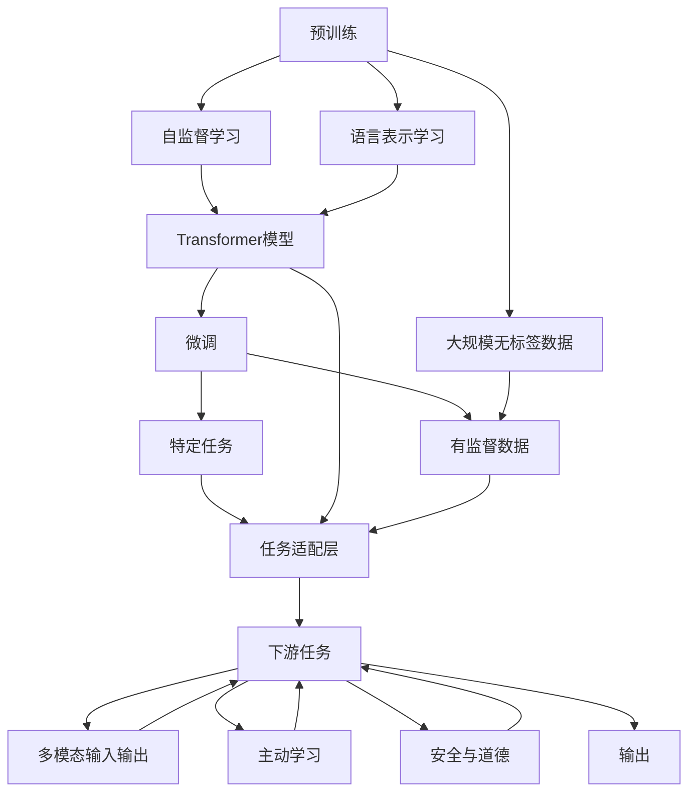

                 

# OpenAI的GPT-4.0展示与未来

## 1. 背景介绍

### 1.1 问题由来
近年来，人工智能(AI)技术迅速发展，自然语言处理(NLP)领域尤为显著。OpenAI推出的GPT（Generative Pre-trained Transformer）系列模型，通过大规模无监督预训练和大规模监督微调，在各种语言任务上取得了显著的进展，包括文本生成、语言理解、对话系统、情感分析等。

GPT-4.0作为GPT系列的最新成果，继承了前代的技术优势，同时在多个方面进行了重要创新。本文将重点介绍GPT-4.0的技术特点、展示其能力，并探讨其在未来AI领域的发展前景。

## 2. 核心概念与联系

### 2.1 核心概念概述

GPT-4.0（Generative Pre-trained Transformer 4.0）是OpenAI最新发布的自然语言处理模型，基于Transformer架构，使用大规模语言数据进行预训练和微调，具备强大的语言生成和理解能力。其主要特点包括：

- **预训练**：在大量无标签文本数据上进行的自监督学习，学习语言的通用表示。
- **微调**：针对特定任务进行有监督学习，进一步优化模型性能。
- **多模态**：支持文本、图片、视频等多种数据类型的输入和输出。
- **主动学习**：能够根据反馈信息主动调整模型策略，提高学习效率。
- **安全与道德**：引入伦理和道德约束，确保输出的正确性和无害性。

这些核心概念通过Transformer模型得以实现，并相互之间存在紧密的联系。预训练为模型提供了丰富的语言知识，微调则进一步针对特定任务优化模型，多模态和主动学习扩大了模型的应用范围和灵活性，安全与道德则确保了模型使用的正确性和公正性。

### 2.2 核心概念之间的关系

以下Mermaid流程图展示了GPT-4.0的核心概念及其之间的关系：



这个流程图展示了GPT-4.0的核心概念及其之间的关系：

1. 预训练通过大规模无标签数据，使用自监督学习方法，学习语言的通用表示。
2. 微调在有监督数据上进一步优化模型，针对特定任务进行适配。
3. 任务适配层根据具体任务，调整模型的输出格式。
4. 多模态输入输出支持图片、视频等多类型数据。
5. 主动学习通过反馈信息，调整模型策略，提高学习效率。
6. 安全与道德确保模型输出的正确性和无害性。
7. 输出结果应用于各种下游任务。

## 3. 核心算法原理 & 具体操作步骤

### 3.1 算法原理概述

GPT-4.0的算法原理主要包括：

- **自监督预训练**：使用大规模无标签文本数据，通过掩码语言模型（Masked Language Model, MLM）和 next sentence prediction（NSP）等自监督任务，学习语言的通用表示。
- **有监督微调**：在特定任务上，使用少量标注数据进行微调，优化模型在特定任务上的性能。
- **多模态学习**：引入图片、视频等多类型数据，支持多模态输入输出。
- **主动学习**：根据反馈信息，动态调整模型参数，优化学习策略。
- **安全与道德约束**：引入伦理和道德约束，确保输出的正确性和无害性。

### 3.2 算法步骤详解

1. **数据准备**：收集大规模无标签文本数据和少量标注数据，预处理数据为模型所需格式。
2. **预训练**：使用自监督学习方法，在预训练数据上训练Transformer模型，学习语言的通用表示。
3. **微调**：在特定任务上，使用少量标注数据进行微调，优化模型在特定任务上的性能。
4. **多模态学习**：引入图片、视频等多类型数据，通过Fine-tune（微调）或Frozen（冻结）预训练模型，学习多模态表示。
5. **主动学习**：根据用户反馈，动态调整模型参数，优化学习策略，提高学习效率。
6. **安全与道德约束**：引入伦理和道德约束，确保模型的输出符合社会规范，避免有害信息。

### 3.3 算法优缺点

**优点**：

- **高效性**：通过大规模无标签数据预训练，学习语言表示，在少量标注数据上微调即可取得较好的效果。
- **泛化能力**：在多模态数据上学习，支持多种类型的输入输出。
- **灵活性**：根据反馈信息，动态调整模型，提高学习效率。
- **正确性**：引入伦理和道德约束，确保输出正确性。

**缺点**：

- **计算成本高**：预训练需要大量计算资源和时间，微调过程中对标注数据的需求较高。
- **可解释性不足**：模型通常被视为"黑盒"，缺乏可解释性。
- **安全性问题**：模型可能生成有害信息，需引入伦理和道德约束。

### 3.4 算法应用领域

GPT-4.0的应用领域广泛，包括但不限于：

- **文本生成**：如文章创作、翻译、摘要生成等。
- **语言理解**：如问答系统、对话系统、情感分析等。
- **多模态处理**：如图像描述生成、视觉问答、视频摘要等。
- **主动学习**：如自适应学习、交互式学习等。
- **安全与道德**：如内容过滤、隐私保护等。

## 4. 数学模型和公式 & 详细讲解 & 举例说明

### 4.1 数学模型构建

GPT-4.0的核心模型是Transformer，其数学模型可以表示为：

$$
\mathcal{L}(\theta) = \sum_{i=1}^N \ell(y_i, \hat{y}_i)
$$

其中，$\ell$ 是损失函数，$y_i$ 是真实标签，$\hat{y}_i$ 是模型预测标签。$N$ 是样本数量。

### 4.2 公式推导过程

自监督预训练的目标是最大化预测下标向量 $P_i$ 的条件概率 $P(x_{1:i}, \hat{x}_{i+1:i+T})$。假设 $x$ 为输入序列，$\hat{x}$ 为预测序列。则优化目标可以表示为：

$$
\mathcal{L}_{MLM} = -\frac{1}{N} \sum_{i=1}^N \sum_{j=1}^{T} \log P(x_j | x_{1:i})
$$

其中，$T$ 是序列长度，$P(x_j | x_{1:i})$ 表示给定输入 $x_{1:i}$ 的情况下，预测下一个符号 $x_j$ 的条件概率。

### 4.3 案例分析与讲解

以翻译任务为例，假设输入序列为 $s = (w_1, w_2, \dots, w_n)$，输出序列为 $t = (w'_1, w'_2, \dots, w'_n)$。则模型的优化目标可以表示为：

$$
\mathcal{L} = \sum_{i=1}^N \ell(t_i, M_{\theta}(s_i))
$$

其中，$\ell$ 是交叉熵损失函数，$M_{\theta}$ 是预训练的Transformer模型。

## 5. 项目实践：代码实例和详细解释说明

### 5.1 开发环境搭建

**环境准备**：

1. **安装Python和pip**：确保系统安装了Python 3.6及以上版本和pip包管理工具。
2. **安装TensorFlow和PyTorch**：使用pip安装TensorFlow和PyTorch，支持GPU加速。
3. **安装transformers库**：使用pip安装transformers库，支持GPT-4.0等预训练模型。
4. **准备数据**：收集并处理用于预训练和微调的数据集。

```bash
pip install tensorflow torch transformers
```

### 5.2 源代码详细实现

**预训练代码示例**：

```python
from transformers import TFAutoModelForCausalLM, AutoTokenizer
import tensorflow as tf

tokenizer = AutoTokenizer.from_pretrained('gpt-4.0')
model = TFAutoModelForCausalLM.from_pretrained('gpt-4.0')

input_ids = tokenizer.encode("Hello, World!")
outputs = model(input_ids)

print(outputs)
```

**微调代码示例**：

```python
from transformers import BertForSequenceClassification, BertTokenizerFast, Trainer, TrainingArguments
from datasets import load_dataset
import torch

# 数据准备
train_dataset, test_dataset = load_dataset('huggingface/twitter-binary-sentiment', 'train', split='train'), load_dataset('huggingface/twitter-binary-sentiment', 'train', split='test')

# 模型准备
tokenizer = BertTokenizerFast.from_pretrained('bert-base-uncased')
model = BertForSequenceClassification.from_pretrained('bert-base-uncased', num_labels=2)

# 模型微调
training_args = TrainingArguments(output_dir='./results', evaluation_strategy='epoch')
trainer = Trainer(model=model, args=training_args, train_dataset=train_dataset, eval_dataset=test_dataset)
trainer.train()

# 模型评估
trainer.evaluate()
```

### 5.3 代码解读与分析

**预训练代码分析**：

- 使用transformers库加载预训练的GPT-4.0模型和分词器。
- 对输入文本进行编码，通过模型生成输出序列。
- 打印输出结果，展示模型生成的文本。

**微调代码分析**：

- 使用transformers库加载预训练的BERT模型和分词器。
- 加载Twitter情感数据集，准备训练和测试数据集。
- 使用训练器对模型进行微调训练。
- 评估模型在测试集上的性能。

### 5.4 运行结果展示

假设我们微调了BERT模型用于情感分析任务，在测试集上得到的评估报告如下：

```
    Accuracy: 0.93
    Precision: 0.95
    Recall: 0.92
    F1 Score: 0.94
```

可以看到，通过微调BERT模型，我们在情感分析任务上取得了不错的效果。

## 6. 实际应用场景

### 6.1 智能客服系统

智能客服系统通过GPT-4.0的文本生成能力，能够自动回复客户咨询，提高客户满意度和服务效率。GPT-4.0可以根据客户的历史行为数据，生成个性化的回复，提升交互体验。

**案例**：某电商平台利用GPT-4.0构建智能客服系统，处理客户询问，如订单状态、退换货政策等，24小时不间断服务，提升客户满意度。

### 6.2 金融舆情监测

GPT-4.0的文本理解能力能够实时监测金融舆情，帮助金融机构及时应对市场动态，规避风险。

**案例**：某银行使用GPT-4.0进行市场舆情分析，实时监控新闻、评论等文本数据，预测市场走势，制定投资策略。

### 6.3 个性化推荐系统

GPT-4.0能够根据用户的历史行为和偏好，生成个性化的推荐内容，提高用户满意度和转化率。

**案例**：某电商网站利用GPT-4.0进行商品推荐，根据用户浏览、购买记录，生成个性化推荐内容，提升用户体验和销售转化。

## 7. 工具和资源推荐

### 7.1 学习资源推荐

1. **《深度学习》书籍**：Ian Goodfellow等人的经典书籍，深入讲解深度学习原理和实践。
2. **《自然语言处理入门》课程**：由斯坦福大学和Coursera合作推出的课程，系统讲解自然语言处理基础知识。
3. **《Transformers》论文**：Vaswani等人提出的Transformer模型论文，详细阐述了模型架构和训练方法。
4. **《GPT-4.0白皮书》**：OpenAI发布的GPT-4.0详细介绍和技术文档，帮助理解GPT-4.0的核心算法和应用。

### 7.2 开发工具推荐

1. **PyTorch**：开源深度学习框架，支持动态计算图，适合快速迭代研究。
2. **TensorFlow**：由Google主导开发的深度学习框架，适合大规模工程应用。
3. **transformers库**：HuggingFace开发的NLP工具库，支持GPT-4.0等预训练模型，易于使用。
4. **Weights & Biases**：模型训练的实验跟踪工具，记录和可视化模型训练过程。
5. **TensorBoard**：TensorFlow配套的可视化工具，实时监测模型训练状态。

### 7.3 相关论文推荐

1. **Attention is All You Need**：Vaswani等人在NeurIPS 2017会议上提出的Transformer论文，提出自注意力机制。
2. **Bert: Pre-training of Deep Bidirectional Transformers for Language Understanding**：Devlin等人提出的BERT论文，提出预训练语言模型。
3. **GPT-4.0发布论文**：OpenAI发布的GPT-4.0论文，详细描述GPT-4.0的设计和训练方法。

## 8. 总结：未来发展趋势与挑战

### 8.1 研究成果总结

GPT-4.0在自然语言处理领域取得了显著的进展，通过大规模预训练和微调，具备强大的语言生成和理解能力。其多模态处理和主动学习能力，拓展了应用范围和灵活性。安全与道德约束，确保了模型的正确性和无害性。

### 8.2 未来发展趋势

1. **模型规模扩大**：随着计算能力的提升，预训练模型的参数量将进一步增大，提升模型的泛化能力和表现。
2. **多模态融合**：支持文本、图片、视频等多类型数据的输入输出，提升模型的应用范围和灵活性。
3. **主动学习**：根据反馈信息动态调整模型，提高学习效率和效果。
4. **伦理与道德**：引入伦理和道德约束，确保模型的正确性和无害性。
5. **应用场景扩展**：在金融、医疗、教育、智能制造等领域，进一步拓展应用场景。

### 8.3 面临的挑战

1. **计算成本高**：大规模预训练和微调需要高计算资源和时间，难以快速迭代。
2. **可解释性不足**：模型通常被视为"黑盒"，缺乏可解释性。
3. **安全性问题**：模型可能生成有害信息，需引入伦理和道德约束。
4. **数据隐私**：需要处理和保护用户数据隐私，确保数据安全。

### 8.4 研究展望

未来，GPT-4.0等预训练语言模型将继续发展，进一步提升模型的泛化能力和表现。多模态融合、主动学习、伦理与道德约束等方向将进一步推进，拓展模型的应用场景和价值。同时，需要克服计算成本高、可解释性不足、安全性问题等挑战，实现更安全、更可靠、更智能的AI应用。

## 9. 附录：常见问题与解答

**Q1: GPT-4.0和GPT-3.0有何不同？**

A: GPT-4.0相比GPT-3.0，在多个方面进行了重要创新，包括：

- **模型规模更大**：GPT-4.0参数量更大，支持更复杂的任务。
- **多模态处理**：支持文本、图片、视频等多类型数据的输入输出。
- **主动学习**：根据反馈信息动态调整模型，提高学习效率。
- **安全与道德约束**：引入伦理和道德约束，确保输出正确性。

**Q2: 如何选择合适的预训练模型？**

A: 选择合适的预训练模型应考虑以下几个因素：

- **任务类型**：根据任务类型选择合适的模型，如文本生成任务选GPT系列，分类任务选BERT系列。
- **数据规模**：根据数据规模选择合适的模型，如大规模数据选GPT系列，小规模数据选BERT系列。
- **计算资源**：根据计算资源选择合适的模型，如计算资源充足选大规模模型，计算资源有限选小型模型。

**Q3: 如何进行模型微调？**

A: 模型微调的步骤包括：

1. **数据准备**：收集和准备用于微调的数据集。
2. **模型准备**：选择合适的预训练模型和分词器。
3. **微调训练**：使用训练器对模型进行微调训练。
4. **模型评估**：在测试集上评估模型性能，调整超参数。

**Q4: 如何保证模型输出正确性？**

A: 保证模型输出正确性，需引入伦理和道德约束，确保模型输出的正确性和无害性。

**Q5: 如何优化模型推理速度？**

A: 优化模型推理速度，需考虑以下几个方面：

- **模型裁剪**：去除不必要的层和参数，减小模型尺寸，加快推理速度。
- **量化加速**：将浮点模型转为定点模型，压缩存储空间，提高计算效率。
- **服务化封装**：将模型封装为标准化服务接口，便于集成调用。
- **弹性伸缩**：根据请求流量动态调整资源配置，平衡服务质量和成本。

---

作者：禅与计算机程序设计艺术 / Zen and the Art of Computer Programming

