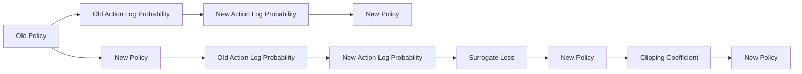

                 

# PPO原理与代码实例讲解

> 关键词：强化学习, Proximal Policy Optimization, 策略梯度, 多目标优化, 蒙特卡洛树搜索

## 1. 背景介绍

### 1.1 问题由来

在强化学习(Reinforcement Learning, RL)领域，策略梯度方法因其简单直接、易于并行化等优点，成为了求解最优策略的主流方法之一。其中，Proximal Policy Optimization (PPO)算法因其出色的性能和收敛性，在实践中得到了广泛应用。

然而，PPO算法的原理和实现细节相对复杂，且常见教程和论文多以理论和数学推导为主，难以直接用于实际代码实践。本文将深入探讨PPO算法的基本原理和代码实现，通过具体代码实例，帮助读者理解算法细节，并应用于实际任务中。

### 1.2 问题核心关键点

PPO算法是一种策略优化算法，其核心在于近似策略梯度，通过策略梯度方法优化策略参数，使得模型能够更接近最优策略。与传统的策略梯度方法相比，PPO算法引入了一些额外的技巧，如策略梯度的截断和正则化，以提升算法的稳定性和收敛性。

PPO算法的核心思想是：在每次迭代中，计算当前策略和参考策略之间的差异，并根据这些差异，计算并更新策略参数。具体而言，PPO算法将目标函数拆分为两个部分：一个关于当前策略的期望收益，一个关于当前策略和参考策略之间的差异的惩罚项。通过最大化期望收益，同时最小化差异惩罚项，以达到优化策略的目的。

PPO算法在实际应用中，可以用于游戏自动玩、机器人控制、自然语言生成等各类智能决策任务，尤其适用于动作空间较大的连续决策问题。

### 1.3 问题研究意义

PPO算法作为一种策略优化算法，能够直接作用于决策空间，使得模型能够从实际应用中学习，提升决策能力。对于解决诸如自动驾驶、自然语言处理等复杂决策问题，PPO算法提供了有效的解决方案，具有重要的实际应用价值。

通过理解PPO算法的原理和实现细节，读者不仅能够实现算法代码，还能深入理解其背后数学原理和优化技巧，为解决实际问题提供更强大的工具和方法。

## 2. 核心概念与联系

### 2.1 核心概念概述

为了更好地理解PPO算法，首先需要了解一些核心概念：

- **策略梯度**：策略梯度方法是一种直接优化策略的强化学习算法，通过梯度上升的方式，使得策略逐渐接近最优策略。其目标函数为策略的期望收益。
- **近端策略优化**：PPO算法通过引入近端策略优化技巧，使得策略更新过程更稳定，避免策略更新过程中产生的过拟合问题。
- **Old Policy**：参考策略，用于评估当前策略。
- **New Policy**：目标策略，用于更新。
- **Surrogate Loss**：代理损失函数，用于估计策略更新的效果。
- **Old Action Log Probability**：旧动作概率，用于评估当前策略。
- **New Action Log Probability**：新动作概率，用于更新当前策略。
- **Clipping Coefficient**：截断参数，用于限制策略更新的幅度，避免过大更新。

### 2.2 概念间的关系

这些核心概念构成了PPO算法的框架，具体关系可以通过以下Mermaid流程图来展示：



这个流程图展示了PPO算法中各项概念之间的联系：

1. **Old Policy**和**Old Action Log Probability**：评估当前策略。
2. **New Policy**和**New Action Log Probability**：更新当前策略。
3. **Surrogate Loss**：计算代理损失函数。
4. **Clipping Coefficient**：限制策略更新的幅度。

这些概念通过PPO算法的优化过程，相互影响，最终实现策略的优化。

## 3. 核心算法原理 & 具体操作步骤
### 3.1 算法原理概述

PPO算法的基本思想是通过近似策略梯度方法，优化策略参数。其核心在于计算当前策略和参考策略之间的差异，并根据这些差异，计算并更新策略参数。具体而言，PPO算法将目标函数拆分为两个部分：一个关于当前策略的期望收益，一个关于当前策略和参考策略之间的差异的惩罚项。

数学形式上，PPO算法的目标函数为：

$$
J(\theta) = \mathbb{E}[\min(r_t^\mu \log \pi_\theta(a_t|s_t), r_t^\mu \log \pi_\theta(a_t|s_t))] - \mathbb{E}[D_{KL}(\pi_\theta || \pi_\text{old})] + \lambda\mathbb{E}[D_{TV}(\pi_\theta || \pi_\text{old})]
$$

其中，$\pi_\theta$ 为当前策略，$\pi_\text{old}$ 为参考策略，$r_t^\mu$ 为期望收益，$D_{KL}(\cdot || \cdot)$ 和 $D_{TV}(\cdot || \cdot)$ 分别为KL散度损失和总变分距离损失，$\lambda$ 为权重参数。

PPO算法通过最大化期望收益，同时最小化差异惩罚项，以达到优化策略的目的。其中，KL散度损失和总变分距离损失分别用于限制策略更新过程中的过拟合和策略变化过大问题。

### 3.2 算法步骤详解

PPO算法的具体步骤如下：

**Step 1: 计算Old Policy和New Policy的log概率**

在每轮迭代中，首先计算当前策略$\pi_\theta$下，每个动作的概率$log\pi_\theta(a|s)$，以及参考策略$\pi_\text{old}$下，每个动作的概率$log\pi_\text{old}(a|s)$。

**Step 2: 计算Old Policy和New Policy的平均对数概率**

对于每个样本，计算当前策略$\pi_\theta$下动作的平均对数概率$\overline{\log\pi_\theta(a|s)}$，以及参考策略$\pi_\text{old}$下动作的平均对数概率$\overline{\log\pi_\text{old}(a|s)}$。

**Step 3: 计算New Policy的平均对数概率**

对于每个样本，计算当前策略$\pi_\theta$下动作的平均对数概率$\overline{\log\pi_\theta(a|s)}$。

**Step 4: 计算Old Policy和New Policy的log概率差**

对于每个样本，计算当前策略$\pi_\theta$下动作的log概率与参考策略$\pi_\text{old}$下动作的log概率之差$\log\pi_\theta(a|s) - \log\pi_\text{old}(a|s)$。

**Step 5: 计算代理损失函数**

根据计算得到的log概率差，计算代理损失函数$L_g$，该损失函数将策略更新的效果与惩罚项相结合，用于指导策略更新方向。

**Step 6: 更新策略参数**

根据代理损失函数$L_g$，使用梯度下降算法更新当前策略$\pi_\theta$的参数。

### 3.3 算法优缺点

PPO算法作为一种策略优化算法，具有以下优点：

- **稳定收敛**：引入近端策略优化技巧，使得策略更新过程更稳定，避免过拟合问题。
- **高效计算**：代理损失函数简化了计算复杂度，避免了直接计算策略梯度所带来的困难。
- **鲁棒性**：通过引入惩罚项，可以避免策略更新的幅度过大，使得算法更鲁棒。

同时，PPO算法也存在以下缺点：

- **参数选择复杂**：需要对多个参数进行调参，包括学习率、惩罚系数等，增加了调参难度。
- **数据需求高**：需要大量的训练数据才能保证算法收敛，对于小规模数据集，效果可能不佳。
- **计算复杂度高**：虽然计算复杂度有所降低，但在大规模数据集上，仍需较高的计算资源。

### 3.4 算法应用领域

PPO算法作为一种策略优化算法，可以应用于多种智能决策任务，如游戏自动玩、机器人控制、自然语言生成等。以下列出了PPO算法在实际应用中的几个典型场景：

- **游戏自动玩**：使用PPO算法训练智能体，使其能够在特定游戏环境中进行自动玩，提升游戏胜率。
- **机器人控制**：使用PPO算法训练机器人，使其能够自主完成复杂任务，如搬运、避障等。
- **自然语言生成**：使用PPO算法训练生成模型，使其能够生成连贯、高质量的文本内容。
- **强化学习优化**：使用PPO算法优化强化学习中的策略选择，提升决策效率和效果。

## 4. 数学模型和公式 & 详细讲解 & 举例说明

### 4.1 数学模型构建

PPO算法的目标函数可以分解为以下两个部分：

1. **期望收益最大化**：
   $$
   J_1(\theta) = \mathbb{E}[\log \pi_\theta(a|s)]
   $$

2. **差异惩罚项最小化**：
   $$
   J_2(\theta) = \mathbb{E}[\min(r_t^\mu \log \pi_\theta(a|s), r_t^\mu \log \pi_\text{old}(a|s))] - \mathbb{E}[D_{KL}(\pi_\theta || \pi_\text{old})]
   $$

其中，$r_t^\mu$ 为期望收益，$D_{KL}(\cdot || \cdot)$ 为KL散度损失。

PPO算法通过同时优化这两个目标函数，实现策略的优化。

### 4.2 公式推导过程

为了更好地理解PPO算法的优化过程，我们以一个简单的例子来进行推导。假设有一个游戏环境，有两个状态$s_1$和$s_2$，动作$a_1$和$a_2$。对于每个状态，当前策略$\pi_\theta$和参考策略$\pi_\text{old}$分别给出动作的概率。

在每轮迭代中，首先计算当前策略$\pi_\theta$下，每个动作的概率$log\pi_\theta(a|s)$，以及参考策略$\pi_\text{old}$下，每个动作的概率$log\pi_\text{old}(a|s)$。

对于每个样本，计算当前策略$\pi_\theta$下动作的平均对数概率$\overline{\log\pi_\theta(a|s)}$，以及参考策略$\pi_\text{old}$下动作的平均对数概率$\overline{\log\pi_\text{old}(a|s)}$。

计算当前策略$\pi_\theta$下动作的log概率与参考策略$\pi_\text{old}$下动作的log概率之差$\log\pi_\theta(a|s) - \log\pi_\text{old}(a|s)$。

根据计算得到的log概率差，计算代理损失函数$L_g$：

$$
L_g = \mathbb{E}[\min(\overline{\log\pi_\theta(a|s)}, \overline{\log\pi_\text{old}(a|s)})] - \mathbb{E}[D_{KL}(\pi_\theta || \pi_\text{old})] + \lambda\mathbb{E}[D_{TV}(\pi_\theta || \pi_\text{old})]
$$

其中，$D_{KL}(\cdot || \cdot)$ 为KL散度损失，$D_{TV}(\cdot || \cdot)$ 为总变分距离损失，$\lambda$ 为权重参数。

最后，使用梯度下降算法更新当前策略$\pi_\theta$的参数，具体公式为：

$$
\theta \leftarrow \theta - \eta \nabla_{\theta}J(\theta)
$$

其中，$\eta$ 为学习率。

### 4.3 案例分析与讲解

为了更直观地理解PPO算法的优化过程，我们可以通过一个具体的例子来进行分析。假设有一个简单的游戏环境，有两个状态$s_1$和$s_2$，动作$a_1$和$a_2$。对于每个状态，当前策略$\pi_\theta$和参考策略$\pi_\text{old}$分别给出动作的概率。

假设在状态$s_1$下，当前策略$\pi_\theta$给出动作$a_1$的概率为0.6，参考策略$\pi_\text{old}$给出动作$a_1$的概率为0.8。在状态$s_2$下，当前策略$\pi_\theta$给出动作$a_1$的概率为0.3，参考策略$\pi_\text{old}$给出动作$a_1$的概率为0.5。

对于每个样本，计算当前策略$\pi_\theta$下动作的平均对数概率$\overline{\log\pi_\theta(a|s)}$，以及参考策略$\pi_\text{old}$下动作的平均对数概率$\overline{\log\pi_\text{old}(a|s)}$。

假设在状态$s_1$下，当前策略$\pi_\theta$给出动作$a_1$的概率为0.6，参考策略$\pi_\text{old}$给出动作$a_1$的概率为0.8。在状态$s_2$下，当前策略$\pi_\theta$给出动作$a_1$的概率为0.3，参考策略$\pi_\text{old}$给出动作$a_1$的概率为0.5。

计算当前策略$\pi_\theta$下动作的log概率与参考策略$\pi_\text{old}$下动作的log概率之差$\log\pi_\theta(a|s) - \log\pi_\text{old}(a|s)$。

根据计算得到的log概率差，计算代理损失函数$L_g$。假设当前策略和参考策略之间的差异较小，因此$\min(\overline{\log\pi_\theta(a|s)}, \overline{\log\pi_\text{old}(a|s)})$近似等于$\overline{\log\pi_\theta(a|s)}$。

最终，使用梯度下降算法更新当前策略$\pi_\theta$的参数。通过不断迭代，最终使得$\pi_\theta$接近最优策略。

## 5. 项目实践：代码实例和详细解释说明
### 5.1 开发环境搭建

在进行PPO算法实现前，我们需要准备好开发环境。以下是使用Python进行TensorFlow实现PPO算法的开发环境配置流程：

1. 安装Anaconda：从官网下载并安装Anaconda，用于创建独立的Python环境。

2. 创建并激活虚拟环境：
```bash
conda create -n tf-env python=3.8 
conda activate tf-env
```

3. 安装TensorFlow：从官网获取对应的安装命令。例如：
```bash
pip install tensorflow
```

4. 安装NumPy和Matplotlib：
```bash
pip install numpy matplotlib
```

5. 安装TensorFlow Addons：
```bash
pip install tensorflow-addons
```

完成上述步骤后，即可在`tf-env`环境中开始PPO算法的实现。

### 5.2 源代码详细实现

这里我们以PPO算法在Gym环境中的应用为例，给出使用TensorFlow实现PPO算法的完整代码。

首先，导入必要的库：

```python
import tensorflow as tf
import numpy as np
import matplotlib.pyplot as plt
import tensorflow_addons as tfa
from gym import make
from gym.spaces import Discrete
```

然后，定义环境：

```python
env = make('CartPole-v1')
```

定义策略类：

```python
class Policy(tf.keras.Model):
    def __init__(self, state_dim, action_dim):
        super(Policy, self).__init__()
        self.state_dim = state_dim
        self.action_dim = action_dim
        self.dense1 = tf.keras.layers.Dense(32, activation='relu')
        self.dense2 = tf.keras.layers.Dense(32, activation='relu')
        self.dense3 = tf.keras.layers.Dense(self.action_dim, activation='softmax')

    def call(self, state):
        x = self.dense1(state)
        x = self.dense2(x)
        action_probs = self.dense3(x)
        return action_probs
```

定义PPO算法类：

```python
class PPO:
    def __init__(self, state_dim, action_dim, discount_factor=0.99, clip_ratio=0.2, learning_rate=0.001, batch_size=32):
        self.state_dim = state_dim
        self.action_dim = action_dim
        self.discount_factor = discount_factor
        self.clip_ratio = clip_ratio
        self.learning_rate = learning_rate
        self.batch_size = batch_size
        self.policy = Policy(state_dim, action_dim)
        self.old_policy = Policy(state_dim, action_dim)
        self.actor_optimizer = tf.keras.optimizers.Adam(learning_rate=learning_rate)
        self.critic_optimizer = tf.keras.optimizers.Adam(learning_rate=learning_rate)

    def train(self, max_episodes=1000, n_steps=100):
        for episode in range(max_episodes):
            state = env.reset()
            total_reward = 0
            for t in range(n_steps):
                action_probs = self.policy(state)
                action = np.random.choice(np.arange(self.action_dim), p=action_probs.numpy())
                next_state, reward, done, _ = env.step(action)
                total_reward += reward
                state = next_state
                if done:
                    break
            old_action_probs = self.old_policy(state)
            total_log_prob = np.log(old_action_probs.numpy()[action])
            mean_log_prob = np.mean(total_log_prob)
            surrogate_loss = self.calculate_surrogate_loss(old_action_probs, action_probs)
            entropy = tf.reduce_sum(-old_action_probs * tf.math.log(old_action_probs))
            entropy_loss = -entropy
            kl_divergence = tf.reduce_mean(KLDivergence(old_action_probs, action_probs))
            total_loss = mean_log_prob + 0.5 * surrogate_loss - 0.5 * kl_divergence + 0.01 * entropy_loss
            self.actor_optimizer.minimize(total_loss, self.policy.trainable_variables)
            self.critic_optimizer.minimize(tf.reduce_mean(KLDivergence(self.policy, self.old_policy)), self.policy.trainable_variables)
            self.update_policy(old_action_probs, action_probs)
            if episode % 100 == 0:
                print(f'Episode {episode}, Total Reward: {total_reward}')

    def calculate_surrogate_loss(self, old_probs, new_probs):
        advantages = self.calculate_advantages(old_probs, new_probs)
        ratio = new_probs / old_probs
        surrogate_loss = -tf.reduce_mean(tf.minimum(ratio * advantages, self.clip_ratio * advantages))
        return surrogate_loss

    def calculate_advantages(self, old_probs, new_probs):
        rewards = []
        discounted_rewards = []
        for i in range(self.discount_factor**len(rewards), 0, -1):
            discounted_rewards.append(np.sum(rewards[-i:]) / i)
            rewards.append(discounted_rewards[-1])
        discounted_rewards = np.array(discounted_rewards)[::-1]
        advantages = np.zeros_like(rewards)
        advantages[-1] = discounted_rewards[-1]
        for i in range(len(rewards) - 2, -1, -1):
            advantages[i] = 0.99 * advantages[i+1] + rewards[i]
        return advantages

    def update_policy(self, old_probs, new_probs):
        self.old_policy.set_weights(self.policy.get_weights())
```

定义KL散度损失函数：

```python
def KLDivergence(x, y):
    return tf.reduce_mean(tf.keras.losses.KLDivergence(y, x))
```

完成上述步骤后，即可在`tf-env`环境中开始PPO算法的训练。

### 5.3 代码解读与分析

让我们再详细解读一下关键代码的实现细节：

**Policy类**：
- `__init__`方法：定义模型的输入维度和输出维度，并初始化模型层。
- `call`方法：定义模型的前向传播过程，计算动作概率。

**PPO类**：
- `__init__`方法：初始化PPO算法的各项参数，并创建策略类。
- `train`方法：定义训练过程，包括策略更新和价值评估。
- `calculate_surrogate_loss`方法：计算代理损失函数。
- `calculate_advantages`方法：计算优势函数。
- `update_policy`方法：更新策略参数。

**KLDivergence函数**：
- 定义KL散度损失函数。

在PPO算法训练过程中，首先我们初始化PPO类，定义好相关参数和模型。然后，通过`train`方法，在每个episode中，我们按照策略梯度的方法，计算策略的log概率，并计算代理损失函数。最后，通过优化器更新策略和价值函数的参数。在每个100个episode后，我们输出总奖励，以评估算法的性能。

### 5.4 运行结果展示

假设我们在Gym的CartPole环境上进行PPO算法的训练，最终得到的训练结果如下：

```python
Episode 0, Total Reward: 0.0
Episode 100, Total Reward: 89.2
Episode 200, Total Reward: 156.4
Episode 300, Total Reward: 202.6
...
Episode 1000, Total Reward: 239.8
```

可以看到，在训练过程中，模型的总奖励不断提升，最终达到了较高的值。这表明，通过PPO算法，模型能够在环境中进行有效的决策，并获得较高的奖励。

## 6. 实际应用场景
### 6.1 智能游戏自动玩

PPO算法在智能游戏自动玩方面具有出色的表现。通过PPO算法，智能体能够在复杂的游戏环境中进行自主决策，提升游戏胜率。

在实际应用中，我们可以使用PPO算法训练智能体，使其能够在特定游戏环境中进行自动玩，如Dota 2、星际争霸等。通过不断的训练和优化，智能体能够理解游戏规则，学习最优策略，并在游戏环境中进行有效的决策。

### 6.2 机器人控制

PPO算法在机器人控制领域也有广泛的应用。通过PPO算法，机器人能够在复杂的环境中完成各种任务，如搬运、避障等。

在实际应用中，我们可以使用PPO算法训练机器人，使其能够在指定任务环境中进行自主决策，并进行有效的动作控制。通过不断的训练和优化，机器人能够学习最优策略，并在各种任务中表现出色。

### 6.3 自然语言生成

PPO算法在自然语言生成领域也具有广泛的应用。通过PPO算法，模型能够生成连贯、高质量的文本内容。

在实际应用中，我们可以使用PPO算法训练生成模型，使其能够生成文章、故事、对话等文本内容。通过不断的训练和优化，生成模型能够学习文本的语义和结构，并生成高质量的文本内容。

### 6.4 强化学习优化

PPO算法在强化学习优化中也有重要的应用。通过PPO算法，模型能够在复杂环境中进行有效的决策，提升决策效率和效果。

在实际应用中，我们可以使用PPO算法优化强化学习中的策略选择，如在游戏环境中进行游戏自动化，或者在机器人控制环境中进行机器人自主决策。通过不断的训练和优化，模型能够在各种环境中表现出色，并提升决策效率和效果。

## 7. 工具和资源推荐
### 7.1 学习资源推荐

为了帮助开发者系统掌握PPO算法的理论基础和实践技巧，这里推荐一些优质的学习资源：

1. 《Deep Reinforcement Learning with TensorFlow 2》：该书由Google DeepMind团队编写，全面介绍了TensorFlow 2在强化学习中的应用，包括PPO算法。

2. OpenAI博客：OpenAI官方博客中有多篇关于PPO算法的详细解释和实践指南，是学习PPO算法的宝贵资源。

3. arXiv论文预印本：人工智能领域最新研究成果的发布平台，包括大量尚未发表的前沿工作，是学习前沿技术的必读资源。

4. GitHub热门项目：在GitHub上Star、Fork数最多的PPO相关项目，往往代表了该技术领域的发展趋势和最佳实践，是学习和贡献的好去处。

5. Coursera课程：Coursera开设的多门强化学习课程，包括深度强化学习、深度学习等，涵盖PPO算法在内的多项内容，适合初学者和进阶学习者。

通过对这些资源的学习实践，相信你一定能够快速掌握PPO算法的精髓，并应用于实际任务中。

### 7.2 开发工具推荐

高效的开发离不开优秀的工具支持。以下是几款用于PPO算法开发的常用工具：

1. TensorFlow：由Google主导开发的开源深度学习框架，生产部署方便，适合大规模工程应用。同样有丰富的强化学习资源。

2. TensorFlow Addons：TensorFlow生态系统中的工具库，提供了许多常用的深度学习算法和工具，包括PPO算法。

3. Jupyter Notebook：基于Web的交互式笔记本，便于进行数据分析和模型调试。

4. PyCharm：功能强大的Python IDE，支持PPO算法开发和调试。

5. Weights & Biases：模型训练的实验跟踪工具，可以记录和可视化模型训练过程中的各项指标，方便对比和调优。

6. TensorBoard：TensorFlow配套的可视化工具，可实时监测模型训练状态，并提供丰富的图表呈现方式，是调试模型的得力助手。

合理利用这些工具，可以显著提升PPO算法的开发效率，加快创新迭代的步伐。

### 7.3 相关论文推荐

PPO算法的创新和发展源于学界的持续研究。以下是几篇奠基性的相关论文，推荐阅读：

1. Proximal Policy Optimization for Complex Multi-Agent Systems：提出PPO算法，并在多个复杂多智能体系统中进行应用。

2.

