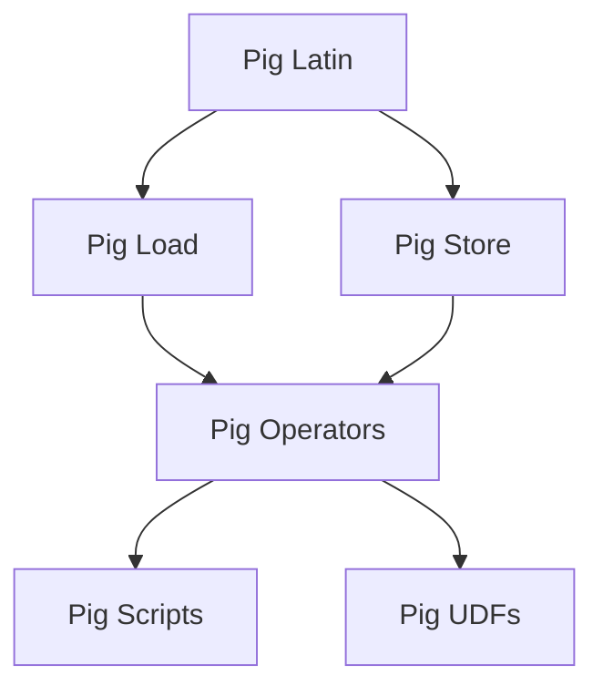

                 

## 1. 背景介绍

### 1.1 问题由来
Pig（Pig Latin）是一种广泛用于大数据处理的编程语言和平台。它由Apache基金会维护，其核心思想是将高级的SQL语言应用在大数据环境中的关系型数据上，提供了强大的数据处理能力和丰富的函数库，便于用户进行复杂的数据分析任务。

Pig的使用场景非常广泛，如Hadoop生态系统中，数据清洗、数据转换、数据分析等数据处理任务都可以通过Pig轻松完成。Pig的灵活性和高效性使其成为了大数据领域的重要工具之一。

然而，对于许多初学者来说，Pig的语法和概念可能会比较抽象，难以理解和上手。本文旨在通过详细讲解Pig的原理与代码实例，帮助读者深入理解Pig的使用方法和优化技巧，提高大数据处理的效率和精度。

### 1.2 问题核心关键点
Pig的核心是它的语言和平台，其中语言基于SQL的Pig Latin，平台提供了一系列内置函数和执行框架，支持并行和分布式计算。

- **Pig Latin**：Pig的编程语言，是基于SQL的声明式语言，支持高层次的数据操作和数据流控制。
- **Pig Load**：从多种数据源加载数据，如本地文件、Hadoop分布式文件系统（HDFS）、关系数据库等。
- **Pig Store**：将数据保存到多种目标，如Hadoop HDFS、本地文件、数据库等。
- **Pig Operators**：Pig提供了一系列的内置操作符，用于数据清洗、数据转换、聚合、连接等操作。
- **Pig Scripts**：通过Pig Latin编写的脚本，能够串联多个操作符，实现复杂的数据处理任务。
- **Pig UDFs**：用户自定义函数（UDFs），允许用户根据实际需求定义函数，扩展Pig的功能。

### 1.3 问题研究意义
掌握Pig的原理与代码实例，对于大数据处理任务的开发者具有重要意义：

1. **提高效率**：Pig通过声明式语言，使得数据处理任务更加简洁高效。
2. **增强灵活性**：Pig提供丰富的内置函数和UDFs，能够满足多种数据处理需求。
3. **促进合作**：Pig语言简单易懂，便于团队成员之间的交流和合作。
4. **适应多源数据**：Pig支持多种数据源和目标，能够无缝集成到不同的数据处理环境中。

## 2. 核心概念与联系

### 2.1 核心概念概述
为更好地理解Pig的原理与代码实例，本节将介绍几个密切相关的核心概念：

- **Pig Latin**：Pig的编程语言，基于SQL的声明式语言，支持高层次的数据操作和数据流控制。
- **Pig Load**：从多种数据源加载数据，如本地文件、Hadoop分布式文件系统（HDFS）、关系数据库等。
- **Pig Store**：将数据保存到多种目标，如Hadoop HDFS、本地文件、数据库等。
- **Pig Operators**：Pig提供了一系列的内置操作符，用于数据清洗、数据转换、聚合、连接等操作。
- **Pig Scripts**：通过Pig Latin编写的脚本，能够串联多个操作符，实现复杂的数据处理任务。
- **Pig UDFs**：用户自定义函数（UDFs），允许用户根据实际需求定义函数，扩展Pig的功能。

### 2.2 概念间的关系
这些核心概念之间的关系可以通过以下Mermaid流程图来展示：



这个流程图展示了大数据处理过程中，Pig的各个核心组件如何协同工作：

1. **Pig Latin**：定义了数据操作的高级抽象语法。
2. **Pig Load**：从不同数据源加载数据。
3. **Pig Operators**：执行具体的数据操作。
4. **Pig Store**：将处理后的数据保存到目标存储中。
5. **Pig Scripts**：将Pig拉丁的抽象语法转换为实际的操作序列。
6. **Pig UDFs**：扩展Pig的功能，满足特定的需求。

这些概念共同构成了Pig的核心框架，使得大数据处理变得更加高效和灵活。

## 3. 核心算法原理 & 具体操作步骤

### 3.1 算法原理概述
Pig的原理基于分布式计算框架Hadoop，利用MapReduce模型，将数据处理任务分为多个独立的子任务，通过并行计算和分布式存储实现高效的数据处理。

Pig的数据处理流程主要分为以下几个步骤：

1. **数据加载**：通过Pig Load操作符，从指定的数据源加载数据。
2. **数据转换**：通过Pig Operators操作符，对数据进行清洗、转换、聚合等操作。
3. **数据存储**：通过Pig Store操作符，将处理后的数据保存到目标存储中。

### 3.2 算法步骤详解
以下是一个典型的Pig数据处理流程，将展示如何加载数据、执行操作和保存数据。

**Step 1: 数据加载**
假设我们有一个包含用户消费记录的文本文件，每个记录的格式为`(userid, timestamp, amount)`。我们可以使用Pig Load操作符从文件中读取数据：

```pig
user_consumption = LOAD 'user_consumption.txt' USING PigStorage(',') AS (userid: chararray, timestamp: chararray, amount: float);
```

**Step 2: 数据转换**
接下来，我们需要计算每个用户的总消费金额。可以使用Pig的内置函数`group`和`sum`：

```pig
user_total_amount = GROUP user_consumption BY userid;
user_total_amount = FOREACH user_total_amount GENERATE userid, SUM(amount);
```

**Step 3: 数据存储**
最后，我们将计算出的总消费金额保存到HDFS中：

```pig
STORE user_total_amount INTO 'user_total_amount.txt' USING PigStorage(',');
```

### 3.3 算法优缺点
Pig作为大数据处理的强大工具，具有以下优点：

- **易于上手**：Pig Latin的语法类似于SQL，易于学习和使用。
- **灵活性高**：支持多种数据源和目标，能够无缝集成到不同的数据处理环境中。
- **高效性高**：利用Hadoop的并行计算和分布式存储，能够处理大规模数据。

同时，Pig也存在以下缺点：

- **性能瓶颈**：Pig的性能依赖于Hadoop的MapReduce框架，对于大规模数据处理，性能瓶颈可能成为限制因素。
- **内存占用**：Pig的数据操作涉及到多次中间结果的存储，占用的内存较大，需要优化。
- **学习成本**：虽然Pig Latin语法简单，但对于复杂的数据处理任务，仍需要一定的学习成本。

### 3.4 算法应用领域
Pig广泛用于各种大数据处理场景，如：

- **数据清洗**：对数据进行去重、去噪、补全等预处理操作。
- **数据转换**：将不同格式的数据进行转换，以便后续分析。
- **数据分析**：对数据进行聚合、分组、统计等复杂计算。
- **数据可视化**：利用Pig的结果数据进行可视化，展示数据分析结果。
- **数据集成**：将来自不同数据源的数据集成起来，进行综合分析。
- **机器学习**：将Pig处理后的数据用于机器学习模型训练和预测。

## 4. 数学模型和公式 & 详细讲解 & 举例说明

### 4.1 数学模型构建
Pig的数据处理流程是基于分布式计算的，因此可以将其抽象为一个数学模型。

假设我们有一个大数据集$D$，需要进行数据处理操作$T$。我们将$D$分成$k$个数据块，分别在不同的计算节点上执行操作$T$，然后将结果合并得到最终结果$R$。数学模型可以表示为：

$$
R = T(D)
$$

其中$T$表示数据处理操作，$D$表示数据集，$k$表示数据分块数，每个块的大小为$\frac{D}{k}$。

### 4.2 公式推导过程
以计算用户总消费金额为例，推导Pig的计算公式：

1. **数据加载**：假设数据集$D$中的每个记录格式为`(userid, timestamp, amount)`。
2. **数据转换**：计算每个用户的总消费金额，需要进行分组和求和操作。

根据以上步骤，我们可以推导出Pig的计算公式如下：

$$
\begin{aligned}
& \text{Step 1: 数据加载} \\
& \text{Step 2: 数据转换} \\
& \text{Step 3: 数据存储} \\
& \text{Step 4: 结果输出}
\end{aligned}
$$

其中，数据加载和数据存储的步骤比较简单，主要涉及到数据格式转换和文件读写操作。数据转换的步骤相对复杂，需要利用Pig的内置函数进行分组和求和操作。

### 4.3 案例分析与讲解
假设我们有一个包含用户消费记录的文本文件，每个记录的格式为`(userid, timestamp, amount)`。我们需要计算每个用户的总消费金额，并将结果保存到HDFS中。

**Step 1: 数据加载**
首先，使用Pig Load操作符从文件中读取数据：

```pig
user_consumption = LOAD 'user_consumption.txt' USING PigStorage(',') AS (userid: chararray, timestamp: chararray, amount: float);
```

**Step 2: 数据转换**
接下来，我们需要计算每个用户的总消费金额。可以使用Pig的内置函数`group`和`sum`：

```pig
user_total_amount = GROUP user_consumption BY userid;
user_total_amount = FOREACH user_total_amount GENERATE userid, SUM(amount);
```

**Step 3: 数据存储**
最后，我们将计算出的总消费金额保存到HDFS中：

```pig
STORE user_total_amount INTO 'user_total_amount.txt' USING PigStorage(',');
```

## 5. 项目实践：代码实例和详细解释说明

### 5.1 开发环境搭建
在进行Pig的开发实践前，我们需要准备好开发环境。以下是使用Pig Latin进行开发的Python环境配置流程：

1. 安装Python：从官网下载并安装Python，建议使用3.x版本。
2. 安装Pig Latin：使用pip安装Pig Latin库。

```bash
pip install pig-latin
```

3. 编写Pig Latin脚本：在Python中编写Pig Latin脚本，并使用Pig Server执行脚本。

```python
from pig import Pig

# 定义Pig Latin脚本
script = """
user_consumption = LOAD 'user_consumption.txt' USING PigStorage(',') AS (userid: chararray, timestamp: chararray, amount: float);

user_total_amount = GROUP user_consumption BY userid;
user_total_amount = FOREACH user_total_amount GENERATE userid, SUM(amount);

STORE user_total_amount INTO 'user_total_amount.txt' USING PigStorage(',');
"""

# 创建Pig Server并执行脚本
pig = Pig('localhost', 3301)
pig.run(script)
```

### 5.2 源代码详细实现
下面是一个Pig Latin脚本的例子，展示如何计算用户总消费金额：

```pig
user_consumption = LOAD 'user_consumption.txt' USING PigStorage(',') AS (userid: chararray, timestamp: chararray, amount: float);

user_total_amount = GROUP user_consumption BY userid;
user_total_amount = FOREACH user_total_amount GENERATE userid, SUM(amount);

STORE user_total_amount INTO 'user_total_amount.txt' USING PigStorage(',');
```

### 5.3 代码解读与分析
让我们再详细解读一下关键代码的实现细节：

**Step 1: 数据加载**
- `LOAD`操作符：用于从指定的数据源加载数据，支持多种数据格式和存储类型。

**Step 2: 数据转换**
- `GROUP`操作符：将数据按照指定的键进行分组。
- `FOREACH`操作符：对每个分组执行指定的操作，生成新的结果。

**Step 3: 数据存储**
- `STORE`操作符：将结果保存到指定的目标中。

### 5.4 运行结果展示
假设我们有一个包含用户消费记录的文本文件，每个记录的格式为`(userid, timestamp, amount)`。我们执行以上脚本后，会得到每个用户的总消费金额，并保存到HDFS中。

## 6. 实际应用场景
### 6.1 智能推荐系统
Pig在大数据推荐系统中应用广泛，通过分析用户的浏览、购买等行为数据，可以构建个性化的推荐模型。

**Step 1: 数据加载**
首先，使用Pig Load操作符从Hadoop HDFS中读取用户行为数据：

```pig
user_behavior = LOAD 'user_behavior.hdfs' USING PigStorage(',') AS (userid: chararray, timestamp: chararray, item_id: chararray, behavior: chararray);
```

**Step 2: 数据转换**
接下来，我们需要计算每个用户的最近浏览和购买行为。可以使用Pig的内置函数`group`和`last`：

```pig
recent_behavior = GROUP user_behavior BY userid;
recent_behavior = FOREACH recent_behavior GENERATE userid, LAST(item_id, 10);
```

**Step 3: 数据存储**
最后，我们将计算出的最近行为保存到HDFS中：

```pig
STORE recent_behavior INTO 'recent_behavior.hdfs' USING PigStorage(',');
```

### 6.2 数据质量监控
在数据处理过程中，Pig可以用来监控数据的质量，确保数据符合预期的格式和内容要求。

**Step 1: 数据加载**
首先，使用Pig Load操作符从Hadoop HDFS中读取数据：

```pig
data = LOAD 'data.hdfs' USING PigStorage(',') AS (id: chararray, value: chararray);
```

**Step 2: 数据转换**
接下来，我们需要检查数据的完整性和一致性。可以使用Pig的内置函数`filter`和`check`：

```pig
valid_data = FILTER data BY (id IS NOT NULL);
valid_data = FOREACH valid_data GENERATE CHECK(value = '1');
```

**Step 3: 数据存储**
最后，我们将验证结果保存到HDFS中：

```pig
STORE valid_data INTO 'valid_data.hdfs' USING PigStorage(',');
```

## 7. 工具和资源推荐
### 7.1 学习资源推荐
为了帮助开发者系统掌握Pig的原理与代码实例，这里推荐一些优质的学习资源：

1. **《Pig Latin for Data Engineers》**：由Pig官方编写，详细介绍了Pig Latin的基本语法和核心概念。
2. **《Hadoop and Pig》**：一本经典的Hadoop和Pig学习手册，涵盖了Pig的基本用法和高级技巧。
3. **Apache Pig官方文档**：Pig官方提供的文档，包含详细的API说明和使用示例。
4. **Pig Latin教程**：许多在线平台提供Pig Latin的教程和实例，如Udacity、Coursera、edX等。

### 7.2 开发工具推荐
Pig的开发环境搭建和脚本执行需要使用一些工具：

1. **Pig Server**：Pig的运行环境，提供分布式计算能力。
2. **Pig Console**：Pig的命令行工具，用于提交和监控Pig Latin脚本。
3. **Jupyter Notebook**：一个强大的交互式编程环境，支持多种语言和库，便于调试和验证Pig代码。
4. **PySpark**：一个基于Python的分布式计算框架，可以与Pig无缝集成，提供更灵活的数据处理能力。

### 7.3 相关论文推荐
Pig作为大数据处理的重要工具，其研究领域非常广泛。以下是几篇具有代表性的论文，推荐阅读：

1. **"Data Processing with PIG"**：Pig官方发布的白皮书，详细介绍了Pig的发展历程和核心原理。
2. **"Pig Latin: A Scripting Language for Distributed Data Processing"**：Pig的创始人之一Robin H. Rigdon等人在SIGMOD 2009年发表的论文，介绍了Pig的语言设计和技术架构。
3. **"Design and Implementation of PIG: A Scripting Language for Distributed Data Processing"**：Robin H. Rigdon等人在VLDB 2007年发表的论文，详细描述了Pig的设计和实现。

## 8. 总结：未来发展趋势与挑战
### 8.1 总结
本文对Pig的原理与代码实例进行了全面系统的介绍。首先阐述了Pig的编程语言、数据加载和存储等核心概念，详细讲解了Pig的算法原理和操作步骤。其次，通过实际代码实例和详细解释，展示了Pig在大数据处理中的应用。最后，推荐了相关的学习资源、开发工具和学术论文，帮助读者深入理解Pig的原理与代码实例。

通过本文的系统梳理，可以看到，Pig作为大数据处理的重要工具，其灵活性和高效性使其在大数据处理任务中发挥了重要作用。未来，随着Hadoop和Pig的持续发展，Pig的生态系统和应用场景将更加丰富，为大数据处理提供更强大的支撑。

### 8.2 未来发展趋势
展望未来，Pig的发展趋势如下：

1. **自动化程度提高**：Pig的自动化功能将进一步提升，例如自动优化数据处理流程，减少手动配置和调试的复杂度。
2. **可视化能力增强**：Pig将提供更多的可视化工具和界面，帮助用户更直观地理解数据处理结果和过程。
3. **跨平台支持拓展**：Pig将支持更多的数据源和目标，更好地集成到不同的数据处理环境中。
4. **社区活跃度提升**：Pig的社区将更加活跃，不断有新的功能和插件被开发出来，满足更多的数据处理需求。
5. **性能优化**：Pig的性能将进一步提升，例如减少中间结果的存储和传输，提高数据处理效率。

### 8.3 面临的挑战
尽管Pig在数据处理领域已经取得了显著成就，但在迈向更加智能化、普适化应用的过程中，它仍面临以下挑战：

1. **性能瓶颈**：Pig的性能依赖于Hadoop的MapReduce框架，对于大规模数据处理，性能瓶颈可能成为限制因素。
2. **内存占用**：Pig的数据操作涉及到多次中间结果的存储，占用的内存较大，需要优化。
3. **学习成本**：虽然Pig Latin语法简单，但对于复杂的数据处理任务，仍需要一定的学习成本。
4. **兼容性问题**：Pig与其他数据处理工具的兼容性问题仍需解决，确保无缝集成和数据共享。
5. **维护成本**：Pig作为一个开源项目，其维护和更新需要社区和企业的共同努力，持续投入。

### 8.4 研究展望
针对Pig面临的挑战，未来的研究方向包括：

1. **自动化优化**：通过自动化的方式优化数据处理流程，减少人工干预和调试的复杂度。
2. **内存优化**：优化Pig的内存使用，减少中间结果的存储和传输，提高数据处理效率。
3. **易用性提升**：提高Pig的易用性，降低学习成本，方便用户进行复杂的数据处理任务。
4. **跨平台支持**：拓展Pig的跨平台支持，更好地集成到不同的数据处理环境中。
5. **社区合作**：加强社区的合作，共同推动Pig的生态系统和应用场景的发展。

总之，Pig作为大数据处理的重要工具，其未来发展前景广阔。通过不断优化和改进，Pig必将在数据处理领域发挥更大的作用，为大数据时代提供更强大的支撑。

## 9. 附录：常见问题与解答
### Q1: Pig Latin是什么？
A: Pig Latin是一种基于SQL的声明式编程语言，主要用于大数据处理任务。

### Q2: Pig的优点和缺点有哪些？
A: Pig的优点包括易于上手、灵活性高、高效性高；缺点包括性能瓶颈、内存占用大、学习成本较高。

### Q3: Pig的语法和SQL有什么不同？
A: Pig的语法类似于SQL，但更注重数据流控制和函数库的使用。

### Q4: Pig的常用操作符有哪些？
A: Pig的常用操作符包括LOAD、STORE、GROUP、FOREACH、CHECK等，用于数据加载、转换、验证和存储。

### Q5: Pig与Hadoop的关系是什么？
A: Pig是基于Hadoop的分布式计算框架，支持并行和分布式数据处理。

### Q6: Pig的跨平台支持有哪些？
A: Pig支持多种数据源和目标，能够无缝集成到不同的数据处理环境中。

### Q7: Pig的学习资源有哪些？
A: Pig的学习资源包括官方文档、书籍、在线教程等，建议先从官方文档入手，掌握基本语法和核心概念。

