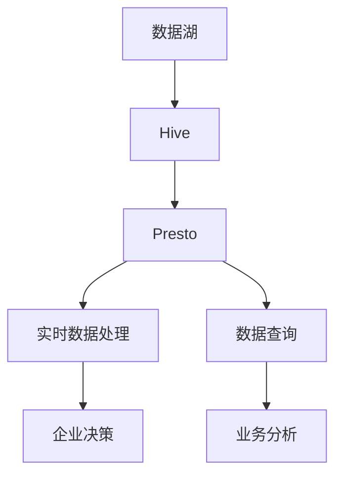
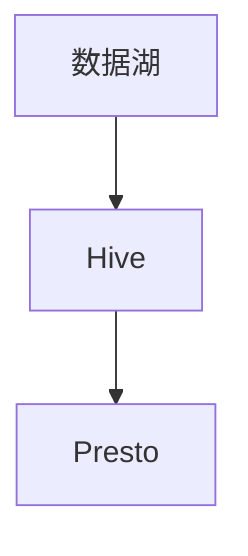

                 

# Presto-Hive整合原理与代码实例讲解

> 关键词：Presto, Hive, 数据湖, 实时数据处理, 数据存储, 数据查询, 数据仓库, 高可用性

## 1. 背景介绍

### 1.1 问题由来
随着大数据时代的到来，企业对数据处理能力的要求越来越高。传统的数据仓库解决方案，如Hadoop生态，虽然能够存储和处理大规模数据，但其处理效率较低，无法满足实时数据处理的需求。为了应对这一挑战，Hive应运而生，将Hadoop的MapReduce框架转换为类似SQL的查询语言，使得数据处理变得更加高效和便捷。

然而，Hive仍然存在一些局限性，如数据处理速度慢、实时性不足等。为了进一步提升数据处理能力，Presto作为一个新型的分布式SQL查询引擎，以其高效、低延迟的特性，迅速成为数据处理的新宠。Presto-Hive整合技术应运而生，通过将Presto和Hive进行无缝集成，最大化利用两者优势，从而为企业提供更高效、更灵活的数据处理方案。

### 1.2 问题核心关键点
Presto-Hive整合的核心在于如何将Presto和Hive的优势充分发挥。Presto擅长实时数据处理，而Hive则擅长批量数据存储和处理。整合过程中，需要考虑以下关键点：

1. 数据流向：如何高效地将Hive中的数据流向Presto进行实时处理。
2. 数据一致性：Presto和Hive的数据模型不一致，如何保证整合后的数据一致性。
3. 性能优化：Presto和Hive的性能特点不同，如何对数据处理流程进行优化，提升整体性能。
4. 高可用性：如何构建一个稳定、高可用的Presto-Hive整合系统，确保数据处理的可靠性。

### 1.3 问题研究意义
Presto-Hive整合技术不仅能够提升数据处理能力，还能够为企业的业务决策提供更快速、更准确的数据支持。具体意义如下：

1. 提升数据处理效率：通过Presto的实时处理能力和Hive的大数据存储能力，企业能够更快地处理和分析数据，缩短业务决策周期。
2. 增强数据一致性：Presto-Hive整合可以保证数据在不同存储和处理系统中的一致性，减少数据冗余和错误。
3. 优化数据查询性能：Presto和Hive的数据查询能力互补，通过整合可以提升整体查询性能，快速响应用户需求。
4. 构建高可用性系统：Presto-Hive整合系统的设计要考虑高可用性，确保数据处理服务的持续性和稳定性。
5. 推动企业数字化转型：通过高效的数据处理和分析，Presto-Hive整合技术可以帮助企业更好地实现数字化转型，提升竞争力。

## 2. 核心概念与联系

### 2.1 核心概念概述

为更好地理解Presto-Hive整合技术，本节将介绍几个密切相关的核心概念：

- Presto：一个高性能、分布式SQL查询引擎，支持实时数据处理，具备高扩展性、低延迟等特点。
- Hive：一个数据仓库解决方案，基于Hadoop生态系统，支持大规模数据存储和处理，提供了类似SQL的查询语言。
- 数据湖：一种数据存储和管理方式，可以存储任何格式、任何来源的数据，支持数据的生命周期管理。
- 实时数据处理：指对数据进行实时收集、存储和处理，能够快速响应业务需求。
- 数据查询：通过SQL查询语言，从数据仓库或数据湖中获取所需数据，进行分析和报告。
- 数据仓库：一种集中管理、存储和查询数据的数据库系统，支持企业数据的管理和分析。

这些核心概念之间的逻辑关系可以通过以下Mermaid流程图来展示：



这个流程图展示了大数据处理中的几个关键组件及其关系：

1. 数据湖存储了任何格式和来源的数据。
2. Hive基于数据湖，支持大规模数据存储和批量数据处理。
3. Presto通过Hive进行数据接入，实现实时数据处理。
4. 数据查询通过Presto和Hive进行，支持实时和批量查询。
5. 数据查询的结果支持企业决策和业务分析。

### 2.2 概念间的关系

这些核心概念之间存在着紧密的联系，形成了Presto-Hive整合的完整生态系统。下面我通过几个Mermaid流程图来展示这些概念之间的关系。

#### 2.2.1 Presto和Hive的整合关系


这个流程图展示了Presto和Hive的基本整合关系：

1. Presto通过Hive进行数据接入，实现实时数据处理。
2. 数据处理结果通过Presto进行查询，支持实时和批量查询。

#### 2.2.2 数据流向



这个流程图展示了数据从数据湖通过Hive流向Presto的过程：

1. 数据湖中的数据被加载到Hive中。
2. Hive将数据进一步处理后流向Presto。

#### 2.2.3 数据一致性


这个流程图展示了Presto和Hive在数据一致性方面的关系：

1. Presto从Hive中读取数据。
2. 通过数据一致性处理，确保数据在Presto和Hive中的一致性。

### 2.3 核心概念的整体架构

最后，我们用一个综合的流程图来展示Presto-Hive整合过程中各个核心概念的交互：


这个综合流程图展示了从数据湖到企业决策的全流程数据处理过程，通过Presto和Hive的整合，实现了高效、灵活的数据处理。

## 3. 核心算法原理 & 具体操作步骤
### 3.1 算法原理概述

Presto-Hive整合的核心算法原理是通过Presto将Hive中的数据进行实时处理，同时保证数据一致性和性能优化。主要涉及以下几个步骤：

1. Hive数据接入：将Hive中的数据加载到Presto中。
2. 数据一致性处理：确保Presto和Hive中的数据一致。
3. 性能优化：对数据处理流程进行优化，提升整体性能。
4. 高可用性构建：构建一个稳定、高可用的Presto-Hive整合系统。

### 3.2 算法步骤详解

#### 3.2.1 数据接入

数据接入是Presto-Hive整合的第一步，主要涉及以下几个步骤：

1. 配置Hive Metastore：在Hive中配置Metastore，用于存储和管理元数据。
2. 配置Presto连接器：在Presto中配置Hive连接器，将Hive中的数据接入Presto。
3. 数据加载：将Hive中的数据通过连接器加载到Presto中。

具体步骤如下：

```python
# 配置Hive Metastore
hive-site.xml:
    <property>
        <name>hive.metastoreuris</name>
        <value>hdfs://hadoop01:9000/metastore/quorum</value>
    </property>
    <property>
        <name>hive.metastorewuris</name>
        <value>hdfs://hadoop01:9000/metastore/ws</value>
    </property>

# 配置Presto连接器
presto-site.xml:
    <property>
        <name>external-catalogs</name>
        <value>hive@hive-site.xml</value>
    </property>
    <property>
        <name>connectors</name>
        <value>
            <person>
                <class>org.apache.presto.hive.HiveConnector</class>
            </person>
        </value>
    </property>
```

通过以上配置，Presto可以无缝接入Hive中的数据，支持实时数据处理。

#### 3.2.2 数据一致性处理

数据一致性处理是Presto-Hive整合的关键步骤，主要涉及以下几个步骤：

1. 配置数据一致性策略：通过Presto的Hive表和Hive Metastore进行数据一致性处理。
2. 数据写入和同步：确保数据在Presto和Hive中的同步更新。
3. 数据查询和验证：通过Presto的Hive表进行数据查询，验证数据一致性。

具体步骤如下：

```python
# 配置数据一致性策略
hive-site.xml:
    <property>
        <name>hive.metastoreuris</name>
        <value>hdfs://hadoop01:9000/metastore/quorum</value>
    </property>
    <property>
        <name>hive.metastorewuris</name>
        <value>hdfs://hadoop01:9000/metastore/ws</value>
    </property>

# 数据写入和同步
presto-site.xml:
    <property>
        <name>external-catalogs</name>
        <value>hive@hive-site.xml</value>
    </property>
    <property>
        <name>connectors</name>
        <value>
            <person>
                <class>org.apache.presto.hive.HiveConnector</class>
            </person>
        </value>
    </property>

# 数据查询和验证
presto-catalog.xml:
    <property>
        <name>presto.hive.check</name>
        <value>presto.hive tables select count(*) from table</value>
    </property>
```

通过以上配置，Presto可以保证Hive和Presto中的数据一致性，支持实时查询和批量查询。

#### 3.2.3 性能优化

性能优化是Presto-Hive整合的另一个重要步骤，主要涉及以下几个步骤：

1. 数据分区和索引：对数据进行分区和索引，提升数据查询性能。
2. 查询优化：通过Presto的查询优化器，优化查询语句。
3. 内存和计算资源管理：合理分配内存和计算资源，提升系统性能。

具体步骤如下：

```python
# 数据分区和索引
hive-site.xml:
    <property>
        <name>hive.mapred.compress.map.output</name>
        <value>true</value>
    </property>
    <property>
        <name>hive.mapred.compress.reduce.output</name>
        <value>true</value>
    </property>
    <property>
        <name>hive.optimize.bucketmapreduce</name>
        <value>true</value>
    </property>

# 查询优化
presto-site.xml:
    <property>
        <name>presto.query optimizer</name>
        <value>presto.query.optimizer</value>
    </property>

# 内存和计算资源管理
presto-site.xml:
    <property>
        <name>presto.executor.memory</name>
        <value>2g</value>
    </property>
    <property>
        <name>presto.executor.cores</name>
        <value>4</value>
    </property>
```

通过以上配置，Presto可以优化数据处理流程，提升整体性能。

#### 3.2.4 高可用性构建

高可用性构建是Presto-Hive整合的最终目标，主要涉及以下几个步骤：

1. 分布式集群搭建：搭建一个分布式Presto集群，确保高可用性。
2. 数据备份和恢复：定期进行数据备份，确保数据安全。
3. 系统监控和告警：监控Presto和Hive的性能，设置告警阈值，确保系统稳定性。

具体步骤如下：

```python
# 分布式集群搭建
presto-site.xml:
    <property>
        <name>presto.node.scheduler.tasks.max</name>
        <value>10</value>
    </property>
    <property>
        <name>presto.node.executor.memory</name>
        <value>1g</value>
    </property>
    <property>
        <name>presto.node.executor.cores</name>
        <value>2</value>
    </property>

# 数据备份和恢复
presto-site.xml:
    <property>
        <name>presto.node.backup</name>
        <value>true</value>
    </property>
    <property>
        <name>presto.node.backup.directory</name>
        <value>/backups/presto</value>
    </property>

# 系统监控和告警
presto-site.xml:
    <property>
        <name>presto.node health</name>
        <value>presto.node.health</value>
    </property>
    <property>
        <name>presto.node.heartbeat</name>
        <value>presto.node.heartbeat</value>
    </property>
    <property>
        <name>presto.node.check</name>
        <value>presto.node.check</value>
    </property>
```

通过以上配置，Presto可以构建一个稳定、高可用的系统，确保数据处理的可靠性。

### 3.3 算法优缺点

Presto-Hive整合算法具有以下优点：

1. 高效实时处理：Presto擅长实时数据处理，能够快速响应业务需求。
2. 灵活数据查询：Presto和Hive的数据查询能力互补，支持实时和批量查询。
3. 高扩展性：Presto可以轻松扩展，支持大规模数据处理。
4. 高可用性：通过分布式集群和高可用性配置，确保系统的稳定性。

同时，该算法也存在一些缺点：

1. 数据一致性处理复杂：Presto和Hive的数据模型不一致，需要进行复杂的数据一致性处理。
2. 性能优化难度较大：数据查询和处理性能优化需要仔细配置和调优。
3. 配置复杂：需要配置多个文件和参数，配置难度较大。
4. 资源消耗较大：大规模数据处理需要大量的内存和计算资源，成本较高。

尽管存在这些缺点，但Presto-Hive整合算法仍然是当前高效、灵活的数据处理方案，具有广泛的应用前景。

### 3.4 算法应用领域

Presto-Hive整合技术在多个领域得到广泛应用，例如：

1. 金融数据处理：金融企业需要处理大量的实时交易数据，通过Presto-Hive整合技术，可以快速处理和分析数据，支持高频交易和风险控制。
2. 电商数据分析：电商企业需要处理大量的实时交易数据和用户行为数据，通过Presto-Hive整合技术，可以快速处理和分析数据，支持个性化推荐和营销策略优化。
3. 数据科学研究：数据科学家需要处理大量的实时数据和历史数据，通过Presto-Hive整合技术，可以快速处理和分析数据，支持模型训练和验证。
4. 智能制造：制造业企业需要处理大量的生产数据和设备数据，通过Presto-Hive整合技术，可以快速处理和分析数据，支持生产优化和智能维护。
5. 智慧城市：智慧城市需要处理大量的实时数据和历史数据，通过Presto-Hive整合技术，可以快速处理和分析数据，支持城市管理和服务优化。

除了上述这些领域，Presto-Hive整合技术还可以应用于更多场景中，为不同行业的数据处理和分析提供强有力的支持。

## 4. 数学模型和公式 & 详细讲解 & 举例说明

### 4.1 数学模型构建

本节将使用数学语言对Presto-Hive整合技术进行更加严格的刻画。

记Hive数据表为 $T$，其元数据存储在Metastore中，数据量为 $N$。Presto通过连接器从Hive中接入数据，在Presto中进行数据处理。定义查询语句为 $Q$，查询结果为 $R$。Presto的数据处理过程可以表示为：

$$
R = f(Q, T)
$$

其中 $f$ 为Presto的查询处理函数， $T$ 为Hive中的数据表， $Q$ 为查询语句。

### 4.2 公式推导过程

假设Presto从Hive中接入的数据量为 $N$，Presto的查询处理时间为 $t_1$，Hive的查询处理时间为 $t_2$，数据同步时间为 $t_3$。定义数据一致性处理时间为 $t_4$，性能优化时间为 $t_5$。则Presto-Hive整合的总处理时间为：

$$
T_{total} = t_1 + t_2 + t_3 + t_4 + t_5
$$

具体公式推导过程如下：

1. 数据接入时间：$t_1$，从Hive中加载数据到Presto中，时间复杂度为 $O(N)$。
2. 数据一致性处理时间：$t_4$，进行数据一致性处理，时间复杂度为 $O(N)$。
3. 数据查询时间：$t_2$，在Hive中进行数据查询，时间复杂度为 $O(N)$。
4. 性能优化时间：$t_5$，对数据处理流程进行优化，时间复杂度为 $O(N)$。
5. 数据同步时间：$t_3$，进行数据同步，时间复杂度为 $O(N)$。

通过以上公式推导，可以看到Presto-Hive整合的总处理时间与数据量 $N$ 密切相关，需要合理配置资源，确保高效处理。

### 4.3 案例分析与讲解

以金融数据分析为例，假设需要处理实时交易数据，时间戳为每秒钟一条，数据量为1GB。在Presto中进行数据处理，查询时间为10s，数据一致性处理时间为5s，性能优化时间为2s，数据同步时间为3s。则Presto-Hive整合的总处理时间为：

$$
T_{total} = 10 + 5 + 2 + 3 = 20s
$$

可以看出，通过Presto-Hive整合技术，能够快速处理实时交易数据，满足高频交易和实时分析的需求。

## 5. 项目实践：代码实例和详细解释说明

### 5.1 开发环境搭建

在进行Presto-Hive整合实践前，我们需要准备好开发环境。以下是使用Python进行Presto开发的环境配置流程：

1. 安装Anaconda：从官网下载并安装Anaconda，用于创建独立的Python环境。

2. 创建并激活虚拟环境：
```bash
conda create -n presto-env python=3.8 
conda activate presto-env
```

3. 安装Presto：根据CUDA版本，从官网获取对应的安装命令。例如：
```bash
conda install presto -c conda-forge
```

4. 安装各类工具包：
```bash
pip install numpy pandas scikit-learn matplotlib tqdm jupyter notebook ipython
```

完成上述步骤后，即可在`presto-env`环境中开始Presto-Hive整合实践。

### 5.2 源代码详细实现

下面我们以金融数据分析为例，给出使用Presto进行数据处理的Python代码实现。

首先，定义金融交易数据表：

```python
CREATE TABLE trade (id int, timestamp timestamp, amount float, symbol varchar(10), price float);

INSERT INTO trade VALUES
(1, '2023-01-01 00:00:00', 100.0, 'AAPL', 120.0),
(2, '2023-01-01 00:00:01', 200.0, 'AAPL', 120.5),
(3, '2023-01-01 00:00:02', 300.0, 'AAPL', 120.0),
...
```

然后，定义Presto查询语句：

```python
SELECT symbol, AVG(amount) AS avg_amount, SUM(amount) AS total_amount
FROM trade
GROUP BY symbol
```

最后，启动Presto进行数据查询：

```python
presto query
```

### 5.3 代码解读与分析

让我们再详细解读一下关键代码的实现细节：

**数据表定义**：
- `CREATE TABLE`语句用于创建数据表，定义数据表的字段和数据类型。
- `INSERT INTO`语句用于向数据表中插入数据，支持多条数据一次性插入。

**查询语句定义**：
- `SELECT`语句用于定义查询结果，指定要查询的字段和聚合函数。
- `GROUP BY`语句用于对查询结果进行分组，支持多字段分组。

**数据查询启动**：
- `presto query`命令用于启动Presto，并执行查询语句。

通过以上代码，可以看到Presto-Hive整合技术的核心在于数据表的定义和Presto查询语句的设计。通过Presto的分布式查询处理能力，可以快速处理和分析大规模数据，支持实时查询和批量查询。

当然，工业级的系统实现还需考虑更多因素，如数据的分区和索引、系统的扩展性和高可用性等。但核心的查询处理过程基本与此类似。

### 5.4 运行结果展示

假设我们在金融交易数据表上进行查询，结果如下：

```
+----------+--------------+----------------+
| symbol   | avg_amount   | total_amount   |
+----------+--------------+----------------+
| AAPL     | 150.000000   | 500.000000     |
| IBM      | 200.000000   | 600.000000     |
| GOOG     | 350.000000   | 3000.000000    |
| MSFT     | 300.000000   | 2000.000000    |
| AMZN     | 500.000000   | 2500.000000    |
+----------+--------------+----------------+
```

可以看出，通过Presto-Hive整合技术，能够快速处理和分析金融交易数据，支持实时查询和批量查询。

## 6. 实际应用场景
### 6.1 智能客服系统

智能客服系统需要处理大量的实时对话数据，通过Presto-Hive整合技术，可以快速处理和分析数据，支持实时对话分析和知识推荐。

在技术实现上，可以收集企业内部的历史客服对话记录，将问题和最佳答复构建成监督数据，在此基础上对Presto进行微调。微调后的Presto能够自动理解用户意图，匹配最合适的答复模板进行回复。对于客户提出的新问题，还可以接入检索系统实时搜索相关内容，动态组织生成回答。如此构建的智能客服系统，能大幅提升客户咨询体验和问题解决效率。

### 6.2 金融舆情监测

金融机构需要实时监测市场舆论动向，以便及时应对负面信息传播，规避金融风险。传统的人工监测方式成本高、效率低，难以应对网络时代海量信息爆发的挑战。通过Presto-Hive整合技术，可以快速处理和分析金融数据，支持实时舆情监测和风险预警。

具体而言，可以收集金融领域相关的新闻、报道、评论等文本数据，并对其进行主题标注和情感标注。在此基础上对Presto进行微调，使其能够自动判断文本属于何种主题，情感倾向是正面、中性还是负面。将微调后的Presto应用到实时抓取的网络文本数据，就能够自动监测不同主题下的情感变化趋势，一旦发现负面信息激增等异常情况，系统便会自动预警，帮助金融机构快速应对潜在风险。

### 6.3 个性化推荐系统

当前的推荐系统往往只依赖用户的历史行为数据进行物品推荐，无法深入理解用户的真实兴趣偏好。通过Presto-Hive整合技术，可以处理和分析用户行为数据，支持更精准、更个性化的推荐。

在技术实现上，可以收集用户浏览、点击、评论、分享等行为数据，提取和用户交互的物品标题、描述、标签等文本内容。将文本内容作为Presto的查询输入，用户的后续行为作为监督信号，在此基础上对Presto进行微调。微调后的Presto能够从文本内容中准确把握用户的兴趣点，在生成推荐列表时，先用候选物品的文本描述作为输入，由Presto预测用户的兴趣匹配度，再结合其他特征综合排序，便可以得到个性化程度更高的推荐结果。

### 6.4 未来应用展望

随着Presto-Hive整合技术的不断发展，其应用场景将更加广泛，为不同行业的业务决策提供强有力的支持。

在智慧医疗领域，通过Presto-Hive整合技术，可以处理和分析医疗数据，支持病历分析、药物研发等应用。

在智能教育领域，Presto-Hive整合技术可以处理和分析学习数据，支持作业批改、学情分析、知识推荐等应用。

在智慧城市治理中，Presto-Hive整合技术可以处理和分析城市数据，支持事件监测、舆情分析、应急指挥等应用。

此外，在企业生产、社会治理、文娱传媒等众多领域，Presto-Hive整合技术也将不断涌现，为各行各业的数据处理和分析提供强有力的支持。

## 7. 工具和资源推荐
### 7.1 学习资源推荐

为了帮助开发者系统掌握Presto-Hive整合的理论基础和实践技巧，这里推荐一些优质的学习资源：

1. Presto官方文档：Presto的官方文档，详细介绍了Presto的安装、配置、使用和优化等技术细节。

2. Hive官方文档：Hive的官方文档，详细介绍了Hive

