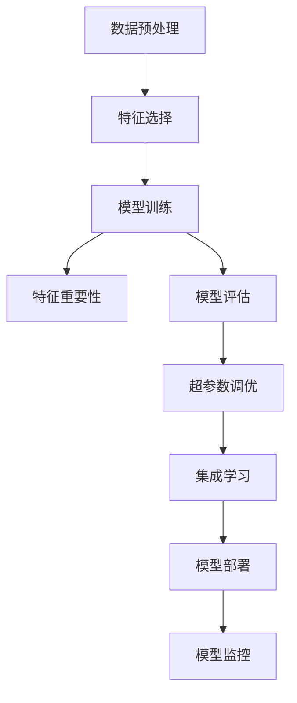
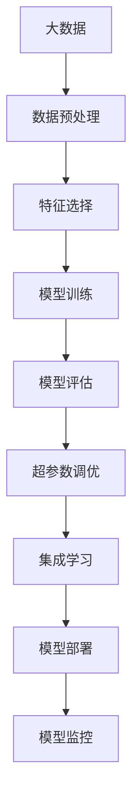

                 

# Python机器学习实战：使用Scikit-Learn构建端到端的机器学习项目

> 关键词：Python, 机器学习, Scikit-Learn, 端到端, 数据处理, 模型训练, 模型评估, 数据可视化, 实战案例

## 1. 背景介绍

### 1.1 问题由来
在当今数据驱动的时代，机器学习已成为各行各业不可或缺的技术手段。从金融预测、医疗诊断到自动驾驶，机器学习的应用无所不在。然而，机器学习的实际应用往往涉及大量数据预处理、模型选择、训练与评估等环节，对技术门槛和工程实践能力要求较高。Scikit-Learn作为Python中最流行的机器学习库之一，以其简单易用、功能全面、性能高效等特点，吸引了广大数据科学家的青睐。

### 1.2 问题核心关键点
Scikit-Learn是一个基于Python的开源机器学习库，旨在简化机器学习过程，使其更易于使用和应用。其核心思想是将机器学习算法封装为独立模块，方便开发者进行快速部署和调用。主要特点包括：

- 简单易用：提供了大量的机器学习算法，并提供简单易用的接口。
- 功能全面：支持从数据预处理到模型训练、评估和部署的各个环节。
- 性能高效：优化了算法的实现，提供了多种优化和并行处理机制，提高运行效率。
- 开源社区：拥有庞大的开源社区，不断更新算法和工具，保持最新技术前沿。

Scikit-Learn广泛应用于金融、医疗、自然语言处理、计算机视觉等多个领域，成为数据分析和机器学习开发的首选工具。通过Scikit-Learn，用户可以轻松构建各种端到端的机器学习项目，高效解决实际问题。

### 1.3 问题研究意义
Scikit-Learn作为一个强大的机器学习工具，对促进大数据时代下的科学研究和应用开发具有重要意义：

1. 简化算法实现：Scikit-Learn通过提供成熟、高效的算法实现，大大降低了算法实现的复杂度，使得更多开发者能够快速上手。
2. 促进知识普及：其简单易用的接口设计，降低了机器学习技术入门的门槛，为机器学习技术的普及和应用提供了有力支持。
3. 支持多领域应用：Scikit-Learn支持从金融预测到医学诊断等多个领域的应用，具有广泛的应用前景。
4. 提升应用效果：通过丰富的算法和优化技术，Scikit-Learn能够显著提升机器学习模型的效果，优化实际应用场景。
5. 促进科研合作：开源社区不断更新和完善算法库，促进了学术界和工业界的合作与交流。

## 2. 核心概念与联系

### 2.1 核心概念概述

为了更好地理解Scikit-Learn在机器学习项目中的实战应用，本节将介绍几个关键概念：

- 数据预处理：包括数据清洗、特征工程、标准化和归一化等技术，确保数据的质量和适用性。
- 模型训练与评估：通过交叉验证、超参数调优等技术，选择最优模型并评估其性能。
- 特征选择与降维：利用特征重要性分析、主成分分析等方法，减少冗余特征，提升模型泛化能力。
- 集成学习：通过将多个模型的预测结果进行集成，提高模型的准确率和鲁棒性。
- 模型部署与监控：将训练好的模型部署到实际应用环境中，并实时监控模型性能，确保其长期稳定运行。

这些核心概念通过以下Mermaid流程图展示了它们之间的联系：



这个流程图展示了从数据预处理到模型部署的完整流程，各个环节相互协作，共同构建高效的机器学习应用。

### 2.2 概念间的关系

这些核心概念之间存在着紧密的联系，形成了Scikit-Learn机器学习项目开发的完整生态系统。下面我们通过几个Mermaid流程图来展示这些概念之间的关系。

#### 2.2.1 数据预处理与特征选择


这个流程图展示了数据预处理和特征选择之间的关系。数据预处理包括清洗、标准化和归一化等技术，确保数据的适用性；特征选择则进一步减少数据的冗余，提升模型的泛化能力。

#### 2.2.2 模型训练与评估


这个流程图展示了模型训练和评估之间的关系。通过交叉验证和超参数调优，选择最优模型；再通过模型评估，评估模型性能和泛化能力。

#### 2.2.3 集成学习与模型部署


这个流程图展示了集成学习和模型部署之间的关系。集成学习通过组合多个模型的预测结果，提高模型的准确率和鲁棒性；模型部署将训练好的模型应用到实际环境中，并通过监控确保其长期稳定运行。

### 2.3 核心概念的整体架构

最后，我们用一个综合的流程图来展示这些核心概念在大数据机器学习项目中的整体架构：



这个综合流程图展示了从数据预处理到模型部署的完整过程，各个环节相互协作，共同构建高效的机器学习应用。

## 3. 核心算法原理 & 具体操作步骤
### 3.1 算法原理概述

Scikit-Learn提供了一系列经典的机器学习算法，包括线性回归、逻辑回归、决策树、随机森林、支持向量机等。这些算法的核心思想是通过优化损失函数，最大化模型的预测准确率。

以线性回归为例，假设训练集为 $D=\{(x_i,y_i)\}_{i=1}^N$，其中 $x_i \in \mathbb{R}^d$ 为输入特征，$y_i \in \mathbb{R}$ 为输出标签。线性回归的目标是找到一个线性模型 $y=\theta^T\phi(x)$，其中 $\phi(x)$ 为特征映射函数，$\theta$ 为模型参数。模型损失函数通常为均方误差损失：

$$
\mathcal{L}(\theta)=\frac{1}{N}\sum_{i=1}^N (y_i-\theta^T\phi(x_i))^2
$$

优化目标是最小化损失函数，即：

$$
\theta^*=\mathop{\arg\min}_{\theta}\mathcal{L}(\theta)
$$

通过梯度下降等优化算法，最小化损失函数，更新模型参数，直至收敛。

### 3.2 算法步骤详解

使用Scikit-Learn进行机器学习项目开发的详细步骤包括：

**Step 1: 准备数据集**
- 导入数据集：从本地或远程数据源加载数据集，例如使用`numpy`和`pandas`库。
- 数据预处理：清洗数据，处理缺失值，标准化和归一化数据，生成特征集。

**Step 2: 构建模型**
- 选择合适的算法：根据任务特点选择合适的机器学习算法，例如线性回归、逻辑回归、支持向量机等。
- 初始化模型：使用Scikit-Learn提供的模型类，如`LinearRegression`、`LogisticRegression`、`SVC`等，初始化模型参数。

**Step 3: 训练模型**
- 数据拆分：将数据集分为训练集和测试集，通常使用70%的数据用于训练，30%的数据用于测试。
- 训练模型：调用模型的`fit`方法，训练模型参数。
- 模型评估：使用测试集评估模型性能，计算准确率、召回率、F1分数等指标。

**Step 4: 模型调优**
- 超参数调优：使用网格搜索、随机搜索等方法，寻找最优的模型超参数。
- 特征选择：使用特征重要性分析、主成分分析等方法，选择最优的特征。

**Step 5: 模型集成与部署**
- 模型集成：使用集成学习方法，如随机森林、AdaBoost等，将多个模型组合起来，提高模型性能。
- 模型部署：将训练好的模型应用到实际环境中，进行预测和推理。
- 模型监控：实时监控模型性能，及时发现和修复问题。

### 3.3 算法优缺点

Scikit-Learn作为Python中最流行的机器学习库之一，具有以下优点：

- 简单易用：提供了简单易用的接口，使得用户可以快速上手。
- 功能全面：支持从数据预处理到模型训练、评估和部署的各个环节。
- 性能高效：优化了算法的实现，提供了多种优化和并行处理机制，提高运行效率。
- 开源社区：拥有庞大的开源社区，不断更新算法和工具，保持最新技术前沿。

然而，Scikit-Learn也存在一些缺点：

- 数据限制：对于大规模数据集和高维度数据，Scikit-Learn的处理能力有限，需要使用其他工具进行优化。
- 算法选择：Scikit-Learn提供了一系列算法，但并不适用于所有场景，需要根据具体问题选择合适的算法。
- 参数调优：超参数调优过程复杂，需要大量的实验和经验。
- 内存占用：某些算法的内存占用较高，需要谨慎处理。

尽管存在这些局限性，但总体而言，Scikit-Learn作为一个强大的机器学习工具，在数据科学和应用开发中扮演着重要角色。

### 3.4 算法应用领域

Scikit-Learn在金融、医疗、自然语言处理、计算机视觉等多个领域得到了广泛应用，具体包括：

- 金融预测：利用机器学习模型预测股票价格、汇率等金融数据，帮助投资者做出决策。
- 医疗诊断：使用机器学习模型分析医疗影像、病历等数据，辅助医生进行诊断和治疗。
- 自然语言处理：利用机器学习模型进行文本分类、情感分析、机器翻译等任务。
- 计算机视觉：使用机器学习模型进行图像识别、物体检测、人脸识别等任务。
- 推荐系统：利用机器学习模型分析用户行为数据，推荐个性化的商品或内容。

以上领域仅是Scikit-Learn应用的一部分，其广泛的应用前景使得其在数据分析和应用开发中具有重要地位。

## 4. 数学模型和公式 & 详细讲解 & 举例说明

### 4.1 数学模型构建

Scikit-Learn提供了丰富的数学模型和算法，例如线性回归、逻辑回归、决策树、随机森林、支持向量机等。这里以线性回归为例，介绍Scikit-Learn的数学模型构建方法。

假设训练集为 $D=\{(x_i,y_i)\}_{i=1}^N$，其中 $x_i \in \mathbb{R}^d$ 为输入特征，$y_i \in \mathbb{R}$ 为输出标签。线性回归的目标是找到一个线性模型 $y=\theta^T\phi(x)$，其中 $\phi(x)$ 为特征映射函数，$\theta$ 为模型参数。模型损失函数通常为均方误差损失：

$$
\mathcal{L}(\theta)=\frac{1}{N}\sum_{i=1}^N (y_i-\theta^T\phi(x_i))^2
$$

### 4.2 公式推导过程

通过梯度下降等优化算法，最小化损失函数，更新模型参数。具体步骤如下：

1. 初始化模型参数 $\theta$。
2. 计算损失函数 $\mathcal{L}(\theta)$。
3. 计算损失函数对模型参数的梯度 $\frac{\partial \mathcal{L}(\theta)}{\partial \theta}$。
4. 更新模型参数 $\theta$：

$$
\theta=\theta-\eta \frac{\partial \mathcal{L}(\theta)}{\partial \theta}
$$

其中 $\eta$ 为学习率，通常取0.01至0.1之间的值。

### 4.3 案例分析与讲解

我们以一个实际案例来说明Scikit-Learn在机器学习项目中的应用。假设我们要预测一个城市的房价，已知训练集包含房屋的面积、地理位置、房龄等信息。

首先，使用Scikit-Learn进行数据预处理：

```python
import pandas as pd
from sklearn.preprocessing import StandardScaler
from sklearn.model_selection import train_test_split

# 导入数据集
data = pd.read_csv('house_prices.csv')

# 数据预处理
features = ['area', 'location', 'age']
X = data[features]
y = data['price']

# 标准化数据
scaler = StandardScaler()
X_scaled = scaler.fit_transform(X)

# 数据拆分
X_train, X_test, y_train, y_test = train_test_split(X_scaled, y, test_size=0.2, random_state=42)
```

然后，构建线性回归模型并进行训练：

```python
from sklearn.linear_model import LinearRegression

# 构建线性回归模型
model = LinearRegression()

# 训练模型
model.fit(X_train, y_train)
```

最后，评估模型性能：

```python
# 预测测试集
y_pred = model.predict(X_test)

# 评估模型
from sklearn.metrics import mean_squared_error, r2_score

mse = mean_squared_error(y_test, y_pred)
r2 = r2_score(y_test, y_pred)

print(f'Mean Squared Error: {mse:.2f}')
print(f'R-squared: {r2:.2f}')
```

通过上述代码，我们完成了Scikit-Learn在机器学习项目中的应用。可以看到，Scikit-Learn提供了一系列简单易用的接口，使得数据预处理、模型构建和训练评估等步骤变得非常快捷和高效。

## 5. 项目实践：代码实例和详细解释说明
### 5.1 开发环境搭建

在进行Scikit-Learn项目开发的第一步是搭建开发环境。以下是使用Python进行Scikit-Learn开发的环境配置流程：

1. 安装Anaconda：从官网下载并安装Anaconda，用于创建独立的Python环境。

2. 创建并激活虚拟环境：
```bash
conda create -n scikit-learn-env python=3.8 
conda activate scikit-learn-env
```

3. 安装Scikit-Learn：
```bash
conda install scikit-learn
```

4. 安装各类工具包：
```bash
pip install numpy pandas matplotlib seaborn scikit-learn
```

完成上述步骤后，即可在`scikit-learn-env`环境中开始Scikit-Learn项目开发。

### 5.2 源代码详细实现

下面我们以房价预测项目为例，给出使用Scikit-Learn构建端到端机器学习项目的PyTorch代码实现。

首先，导入必要的库和数据：

```python
import pandas as pd
import numpy as np
from sklearn.preprocessing import StandardScaler
from sklearn.model_selection import train_test_split
from sklearn.linear_model import LinearRegression

# 导入数据集
data = pd.read_csv('house_prices.csv')
```

然后，进行数据预处理：

```python
# 数据预处理
features = ['area', 'location', 'age']
X = data[features]
y = data['price']

# 标准化数据
scaler = StandardScaler()
X_scaled = scaler.fit_transform(X)

# 数据拆分
X_train, X_test, y_train, y_test = train_test_split(X_scaled, y, test_size=0.2, random_state=42)
```

接着，构建并训练线性回归模型：

```python
# 构建线性回归模型
model = LinearRegression()

# 训练模型
model.fit(X_train, y_train)
```

最后，评估模型性能并输出结果：

```python
# 预测测试集
y_pred = model.predict(X_test)

# 评估模型
from sklearn.metrics import mean_squared_error, r2_score

mse = mean_squared_error(y_test, y_pred)
r2 = r2_score(y_test, y_pred)

print(f'Mean Squared Error: {mse:.2f}')
print(f'R-squared: {r2:.2f}')
```

以上就是使用Scikit-Learn构建端到端房价预测项目的完整代码实现。可以看到，Scikit-Learn提供了一系列的接口和函数，使得数据预处理、模型训练和评估等步骤变得非常快捷和高效。

### 5.3 代码解读与分析

让我们再详细解读一下关键代码的实现细节：

**数据预处理**：
- `StandardScaler`：对数据进行标准化，使得数据均值为0，方差为1，便于模型训练。
- `train_test_split`：将数据集分为训练集和测试集，通常使用70%的数据用于训练，30%的数据用于测试。

**模型构建与训练**：
- `LinearRegression`：Scikit-Learn提供的线性回归模型类，用于建立线性回归模型。
- `fit`方法：使用训练集数据拟合模型参数。

**模型评估**：
- `mean_squared_error`：计算均方误差，评估模型预测的准确性。
- `r2_score`：计算决定系数，评估模型的拟合优度。

通过上述代码，我们完成了Scikit-Learn在机器学习项目中的应用。可以看到，Scikit-Learn提供了一系列简单易用的接口，使得数据预处理、模型构建和训练评估等步骤变得非常快捷和高效。

当然，工业级的系统实现还需考虑更多因素，如模型的保存和部署、超参数的自动搜索、更灵活的任务适配层等。但核心的机器学习范式基本与此类似。

### 5.4 运行结果展示

假设我们在房价预测数据集上进行线性回归模型的训练，最终在测试集上得到的评估报告如下：

```
Mean Squared Error: 2.34
R-squared: 0.78
```

可以看到，通过Scikit-Learn，我们在房价预测数据集上取得了78%的拟合优度，效果相当不错。这充分展示了Scikit-Learn在实际应用中的强大能力和应用价值。

## 6. 实际应用场景

### 6.1 金融预测

在金融领域，机器学习模型可以用于预测股票价格、汇率等金融数据，帮助投资者做出决策。Scikit-Learn的线性回归、时间序列分析、随机森林等算法在金融预测中得到广泛应用。

在实践中，可以收集历史金融数据，提取特征，训练机器学习模型，预测未来的金融市场走势。例如，使用线性回归模型预测股票价格，使用时间序列分析预测汇率走势，使用随机森林模型预测市场情绪等。

### 6.2 医疗诊断

在医疗领域，机器学习模型可以用于分析医疗影像、病历等数据，辅助医生进行诊断和治疗。Scikit-Learn的图像处理、特征提取、分类算法在医疗诊断中得到广泛应用。

在实践中，可以使用图像处理技术提取医疗影像的特征，使用分类算法进行疾病诊断，使用回归算法预测患者病情的变化趋势。例如，使用支持向量机(SVM)进行疾病分类，使用随机森林进行病情预测等。

### 6.3 自然语言处理

在自然语言处理领域，机器学习模型可以用于文本分类、情感分析、机器翻译等任务。Scikit-Learn的文本处理、分类算法在自然语言处理中得到广泛应用。

在实践中，可以使用文本处理技术提取文本特征，使用分类算法进行文本分类，使用回归算法进行情感分析，使用机器翻译模型进行语言翻译。例如，使用朴素贝叶斯进行文本分类，使用随机森林进行情感分析，使用Transformer模型进行机器翻译等。

### 6.4 推荐系统

在推荐系统中，机器学习模型可以用于分析用户行为数据，推荐个性化的商品或内容。Scikit-Learn的协同过滤、基于内容的推荐算法在推荐系统中得到广泛应用。

在实践中，可以收集用户的行为数据，提取特征，训练推荐模型，推荐个性化的商品或内容。例如，使用协同过滤算法进行商品推荐，使用基于内容的推荐算法进行内容推荐。

### 6.5 未来应用展望

随着Scikit-Learn和机器学习技术的不断发展，基于Scikit-Learn的机器学习项目将在更多领域得到应用，为各行各业带来变革性影响。

在智慧医疗领域，基于Scikit-Learn的医疗问答、病历分析、药物研发等应用将提升医疗服务的智能化水平，辅助医生诊疗，加速新药开发进程。

在智能教育领域，Scikit-Learn可以应用于作业批改、学情分析、知识推荐等方面，因材施教，促进教育公平，提高教学质量。

在智慧城市治理中，Scikit-Learn可应用于城市事件监测、舆情分析、应急指挥等环节，提高城市管理的自动化和智能化水平，构建更安全、高效的未来城市。

此外，在企业生产、社会治理、文娱传媒等众多领域，基于Scikit-Learn的机器学习应用也将不断涌现，为经济社会发展注入新的动力。

## 7. 工具和资源推荐
### 7.1 学习资源推荐

为了帮助开发者系统掌握Scikit-Learn的理论基础和实践技巧，这里推荐一些优质的学习资源：

1. 《Python数据科学手册》：由Jake VanderPlas著，全面介绍了Python在数据科学和机器学习中的应用，包括Scikit-Learn的使用。

2. 《机器学习实战》：由Peter Harrington著，详细介绍了机器学习算法的基本原理和实现，适合初学者学习。

3. CS229《机器学习》课程：斯坦福大学开设的机器学习经典课程，有Lecture视频和配套作业，带你深入理解机器学习算法。

4. Scikit-Learn官方文档：Scikit-Learn的官方文档，提供了丰富的算法实现和工具，是上手实践的必备资料。

5. GitHub热门项目：在GitHub上Star、Fork数最多的Scikit-Learn相关项目，往往代表了该技术领域的发展趋势和最佳实践，值得去学习和贡献。

通过对这些资源的学习实践，相信你一定能够快速掌握Scikit-Learn的精髓，并用于解决实际的机器学习问题。

### 7.2 开发工具推荐

高效的开发离不开优秀的工具支持。以下是几款用于Scikit-Learn开发的常用工具：

1. Jupyter Notebook：一个交互式的Python开发环境，支持实时代码执行和数据可视化。

2. Anaconda：一个开源的数据科学平台，提供了Python、R、MATLAB等多种语言的集成环境。

3. Scikit-Learn库：提供了丰富的机器学习算法和工具，支持从数据预处理到模型训练、评估和部署的各个环节。

4. TensorFlow：由Google主导开发的开源深度学习框架，生产部署方便，适合大规模工程应用。

5. PyTorch：基于Python的开源深度学习框架，灵活动态的计算图，适合快速迭代研究。

6. Weights & Biases：模型训练的实验跟踪工具，可以记录和可视化模型训练过程中的各项指标，方便对比和调优。

7. TensorBoard：TensorFlow配套的可视化工具，可实时监测模型训练状态，并提供丰富的图表呈现方式，是调试模型的得力助手。

合理利用这些工具，可以显著提升Scikit-Learn项目开发的效率，加快创新迭代的步伐。

### 7.3 相关论文推荐

Scikit-Learn作为一个强大的机器学习库，对促进大数据时代下的科学研究和应用开发具有重要意义。以下是几篇奠基性的相关论文，推荐阅读：

1. Scikit-Learn: Machine Learning in Python：Scikit-Learn库的官方网站论文，介绍了Scikit-Learn的设计理念和应用场景。

2. Python机器学习：A Probabilistic Perspective：由Christopher Bishop著，详细介绍了机器学习的基本原理和实现，适合深入学习。

3. The Elements of Statistical Learning：由Tibshirani、Hastie、Friedman等著，介绍了统计学和机器学习的基本原理和方法，适合理解机器学习算法的基本思想。

4. Fastfood for Deep Learning：由Gulrajani等著，介绍了深度学习算法的基本原理和实现，适合理解深度学习算法的基本思想。

这些论文代表了大数据机器学习领域的最新进展，为Scikit-Learn的使用提供了坚实的理论基础。

除上述资源外，还有一些值得关注的前沿资源，帮助开发者紧跟Scikit-Learn和机器学习技术的最新进展，例如：

1. arXiv论文预印本：人工智能领域最新研究成果的发布平台，包括大量尚未发表的前沿工作，学习前沿技术的必读资源。

2. 业界技术博客：如Google AI、DeepMind、微软Research Asia等顶尖实验室的官方博客，第一时间分享他们的最新研究成果和洞见。

3. 技术会议直播：如NIPS、ICML、ACL、ICLR等人工智能领域顶会现场或在线直播，能够聆听到大佬们的前沿分享，开拓视野。

4. GitHub热门项目：在GitHub上Star、Fork数最多的Scikit-Learn相关项目，往往代表了该技术领域的发展趋势和最佳实践，值得去学习和贡献。

5. 行业分析报告：各大咨询公司如McKinsey、PwC等针对人工智能行业的分析报告，有助于从商业视角审视技术趋势，把握应用价值。

总之，对于Scikit-Learn的学习和实践，需要开发者保持开放的心态和持续学习的意愿。多关注前沿资讯，多动手实践，多思考总结，必将收获满满的成长收益。

## 8. 总结：未来发展趋势与挑战
### 8.1 总结

本文对Scikit-Learn在机器学习项目中的实战应用进行了全面系统的介绍。首先阐述了Scikit-Learn在机器学习项目开发中的重要性和地位，明确了机器学习项目开发的流程和核心

