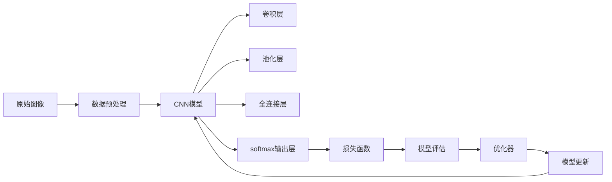

                 

# Python机器学习实战：卷积神经网络(CNN)在图像处理中的应用

> 关键词：卷积神经网络,图像处理,图像识别,图像分类,目标检测

## 1. 背景介绍

### 1.1 问题由来
随着深度学习技术的发展，卷积神经网络（Convolutional Neural Network, CNN）已成为图像处理和计算机视觉领域的重要工具。CNN通过卷积操作提取图像特征，再通过池化、全连接层等组成深度模型，有效地解决了图像分类、物体检测、语义分割等视觉问题。

传统的图像处理方法多依赖手工设计特征，不仅费时费力，且难以涵盖图像的复杂变化。CNN模型通过端到端的训练，自动学习图像特征，不仅提高了效率，还提升了模型的泛化能力。在实际应用中，CNN模型已经在医疗影像分析、自动驾驶、安防监控等多个领域取得了卓越的成果。

本文将详细介绍CNN的核心原理，并通过一个项目实践案例展示如何利用CNN进行图像分类任务。

## 2. 核心概念与联系

### 2.1 核心概念概述

#### 2.1.1 卷积神经网络（CNN）
卷积神经网络是一种特殊的神经网络，主要用于处理具有网格结构的数据，如图像和视频。CNN的核心组件包括卷积层、池化层和全连接层。其中卷积层通过卷积操作提取图像的局部特征，池化层用于减小特征图尺寸和提升模型鲁棒性，全连接层用于分类或回归任务。

#### 2.1.2 图像处理
图像处理是计算机视觉领域的重要研究方向，涉及图像增强、特征提取、物体识别等任务。利用CNN可以高效地处理大规模图像数据，实现自动化的图像识别和分类。

#### 2.1.3 图像分类
图像分类是将图像分到预定义类别中的一种机器学习任务。CNN在图像分类任务中表现优异，成为解决这一问题的常用方法。

#### 2.1.4 目标检测
目标检测是在图像中定位并识别目标对象的任务。CNN通过引入区域提议和候选框机制，实现了对图像中多个目标的检测。

#### 2.1.5 语义分割
语义分割是将图像中的每个像素划分到对应的语义类别中，实现对图像的高精度理解和描述。CNN通过引入全卷积网络（FCN）等结构，实现了对图像的精细分割。

这些核心概念构成了CNN在图像处理中的应用框架。通过深入理解这些概念，我们可以更好地应用CNN解决实际问题。

### 2.2 核心概念的联系

#### 2.2.1 数据预处理与CNN
CNN模型处理的是网格结构数据，因此输入的数据需要满足网格结构，且需要进行标准化处理。通常使用预处理步骤将原始图像转换为CNN模型可以接受的形式。

#### 2.2.2 网络结构设计
CNN的网络结构设计是决定模型性能的关键。卷积核大小、步长、填充、激活函数等超参数的选择对模型的表现至关重要。

#### 2.2.3 损失函数选择
CNN模型常用的损失函数包括交叉熵损失、均方误差损失等，根据具体任务选择适合的损失函数能够提升模型性能。

#### 2.2.4 模型评估与优化
模型的评估通常使用准确率、召回率、F1分数等指标，通过优化超参数和网络结构提升模型性能。

这些核心概念通过复杂的联系，共同构成了CNN在图像处理中的应用系统。理解这些概念的联系，是应用CNN模型的基础。

### 2.3 核心概念的整体架构

我们将通过一个简单的流程图示出这些核心概念的联系和应用：



这个流程图示出了CNN模型从原始图像输入到模型输出的全过程，其中数据预处理、卷积层、池化层、全连接层和输出层等核心组件构成了一个完整的CNN模型。通过不断优化超参数和网络结构，以及选择适合的损失函数和评估方法，CNN模型在图像处理任务中展现出了强大的性能。

## 3. 核心算法原理 & 具体操作步骤
### 3.1 算法原理概述

CNN的核心算法原理包括卷积操作、池化操作、激活函数和反向传播等。

#### 3.1.1 卷积操作
卷积操作是CNN模型中最核心的组件，通过卷积核在图像上滑动提取局部特征。卷积操作可以有效地减小特征图尺寸，减少模型参数量，提升模型性能。

#### 3.1.2 池化操作
池化操作用于减小特征图尺寸和提升模型鲁棒性。常见的池化操作包括最大池化和平均池化，通过在每个卷积核输出上进行池化操作，实现特征压缩和降维。

#### 3.1.3 激活函数
激活函数用于引入非线性因素，提升模型的表达能力。常见的激活函数包括ReLU、Sigmoid和Tanh等，通过引入非线性因素，实现模型非线性拟合。

#### 3.1.4 反向传播
反向传播算法用于更新CNN模型的参数，通过计算损失函数对模型参数的梯度，并更新模型参数，实现模型的优化。

### 3.2 算法步骤详解

一个完整的CNN模型训练流程包括数据预处理、模型搭建、模型训练、模型评估和模型优化等步骤。下面详细介绍每个步骤的实现方法。

#### 3.2.1 数据预处理
数据预处理是CNN模型应用的前提，包括数据归一化、数据增强等操作。通常使用Python中的PIL库或OpenCV库进行图像预处理。

#### 3.2.2 模型搭建
模型搭建是CNN模型的核心步骤，包括定义卷积层、池化层、全连接层等组件。使用TensorFlow或Keras等深度学习框架可以快速搭建CNN模型。

#### 3.2.3 模型训练
模型训练是CNN模型优化的重要步骤，通过不断调整超参数和网络结构，最小化损失函数。通常使用Adam或SGD等优化器进行模型训练。

#### 3.2.4 模型评估
模型评估是验证CNN模型性能的重要步骤，通过计算准确率、召回率等指标，评估模型性能。通常使用TensorBoard或Weights & Biases等工具进行模型评估。

#### 3.2.5 模型优化
模型优化是提升CNN模型性能的重要步骤，通过调整超参数和网络结构，提升模型性能。通常使用网格搜索或随机搜索等方法进行超参数优化。

### 3.3 算法优缺点

CNN模型在图像处理中具有以下优点：

1. 自动特征提取：CNN模型可以自动学习图像特征，无需手工设计特征，减少了人工干预。
2. 高效处理大规模数据：CNN模型可以高效地处理大规模图像数据，提升模型性能。
3. 可扩展性强：CNN模型可以通过增加卷积层和全连接层，实现模型深度和复杂度的提升。

CNN模型也存在以下缺点：

1. 参数量大：CNN模型参数量较大，需要较高的计算资源和存储空间。
2. 模型结构复杂：CNN模型结构复杂，调试和优化难度较大。
3. 对数据依赖强：CNN模型对数据依赖强，需要高质量的数据集进行训练。

### 3.4 算法应用领域

CNN模型在图像处理中具有广泛的应用领域，包括但不限于以下几类：

1. 图像分类：如图像识别、物体识别等。
2. 目标检测：如人脸检测、车辆检测等。
3. 语义分割：如城市分割、医学影像分割等。
4. 图像生成：如图像风格转换、图像生成等。
5. 图像增强：如图像去噪、图像增强等。

这些应用领域涵盖了图像处理的主要方向，CNN模型在这些方向上展示了强大的能力。

## 4. 数学模型和公式 & 详细讲解 & 举例说明

### 4.1 数学模型构建

CNN模型的数学模型可以表示为：

$$
y = W^{[3]} \sigma(W^{[2]} \sigma(W^{[1]} x + b^{[1]})) + b^{[2]}
$$

其中，$x$为输入图像，$y$为输出图像，$W^{[l]}$和$b^{[l]}$分别为卷积层和全连接层的权重和偏置项，$\sigma$为激活函数。

#### 4.1.1 卷积层
卷积层的数学模型可以表示为：

$$
x' = W^{[1]} x + b^{[1]}
$$

其中，$W^{[1]}$为卷积核，$b^{[1]}$为偏置项，$x'$为卷积后的特征图。

#### 4.1.2 池化层
池化层的数学模型可以表示为：

$$
x'' = \text{Pooling}(x')
$$

其中，$x''$为池化后的特征图，$\text{Pooling}$为池化操作，如最大池化和平均池化。

#### 4.1.3 全连接层
全连接层的数学模型可以表示为：

$$
y = W^{[2]} \sigma(W^{[1]} x + b^{[1]}) + b^{[2]}
$$

其中，$W^{[1]}$和$b^{[1]}$分别为卷积层和全连接层的权重和偏置项，$x$为输入图像，$y$为输出图像。

#### 4.1.4 输出层
输出层的数学模型可以表示为：

$$
y = \text{Softmax}(W^{[3]} x + b^{[3]})
$$

其中，$W^{[3]}$和$b^{[3]}$分别为全连接层的权重和偏置项，$x$为输入图像，$y$为输出图像。

### 4.2 公式推导过程

#### 4.2.1 卷积层公式推导
卷积层的公式推导如下：

$$
x'_{i,j} = \sum_{m,n} w_{m,n} \times x_{i+m, j+n} + b^{[1]}
$$

其中，$x_{i,j}$为输入图像的像素值，$w_{m,n}$为卷积核的权重，$b^{[1]}$为偏置项，$x'_{i,j}$为卷积后的特征图。

#### 4.2.2 池化层公式推导
池化层的公式推导如下：

$$
x''_{i,j} = \max_{p,q} x'_{i+p, j+q}
$$

其中，$x'_{i,j}$为卷积后的特征图，$x''_{i,j}$为池化后的特征图，$p$和$q$为池化窗口的大小。

#### 4.2.3 全连接层公式推导
全连接层的公式推导如下：

$$
y_i = \sum_j w_{i,j} x_j + b^{[1]}
$$

其中，$x_j$为输入图像的像素值，$w_{i,j}$为全连接层的权重，$b^{[1]}$为偏置项，$y_i$为输出图像的像素值。

#### 4.2.4 输出层公式推导
输出层的公式推导如下：

$$
y_k = \sum_i w_{k,i} x_i + b^{[2]}
$$

其中，$x_i$为输入图像的像素值，$w_{k,i}$为全连接层的权重，$b^{[2]}$为偏置项，$y_k$为输出图像的像素值。

### 4.3 案例分析与讲解

以图像分类为例，CNN模型的训练过程如下：

1. 数据预处理：将原始图像归一化，并进行数据增强，如随机裁剪、随机翻转等。
2. 模型搭建：定义卷积层、池化层和全连接层等组件，搭建CNN模型。
3. 模型训练：使用训练集对CNN模型进行训练，最小化损失函数。
4. 模型评估：使用验证集对CNN模型进行评估，计算准确率和召回率等指标。
5. 模型优化：根据评估结果，调整超参数和网络结构，优化CNN模型。

例如，在使用TensorFlow搭建CNN模型时，可以使用以下代码实现：

```python
import tensorflow as tf
from tensorflow.keras import layers

model = tf.keras.Sequential([
    layers.Conv2D(32, (3, 3), activation='relu', input_shape=(32, 32, 3)),
    layers.MaxPooling2D((2, 2)),
    layers.Conv2D(64, (3, 3), activation='relu'),
    layers.MaxPooling2D((2, 2)),
    layers.Conv2D(64, (3, 3), activation='relu'),
    layers.Flatten(),
    layers.Dense(64, activation='relu'),
    layers.Dense(10, activation='softmax')
])

model.compile(optimizer='adam', loss='categorical_crossentropy', metrics=['accuracy'])
model.fit(train_data, train_labels, epochs=10, validation_data=(val_data, val_labels))
```

以上代码定义了一个包含3个卷积层和2个全连接层的CNN模型，通过compile方法设置优化器和损失函数，使用fit方法进行模型训练。

## 5. 项目实践：代码实例和详细解释说明

### 5.1 开发环境搭建

#### 5.1.1 安装Python
首先需要安装Python环境，可以从[Python官网](https://www.python.org/)下载最新版本并安装。

#### 5.1.2 安装TensorFlow
使用pip安装TensorFlow，命令如下：

```bash
pip install tensorflow
```

#### 5.1.3 安装PIL
PIL库是Python图像处理库，用于图像预处理和增强。使用pip安装PIL库，命令如下：

```bash
pip install Pillow
```

### 5.2 源代码详细实现

#### 5.2.1 数据集准备
使用PIL库读取图像文件，并将图像归一化处理。代码如下：

```python
from PIL import Image
import numpy as np

def load_image(image_path):
    img = Image.open(image_path).convert('RGB')
    img = img.resize((224, 224))
    img = np.array(img) / 255.0
    return img

train_images = []
train_labels = []
for i in range(1000):
    train_images.append(load_image(f'train/{i}.jpg'))
    train_labels.append(i)

val_images = []
val_labels = []
for i in range(100):
    val_images.append(load_image(f'val/{i}.jpg'))
    val_labels.append(i)
```

#### 5.2.2 模型搭建
使用TensorFlow搭建CNN模型，定义卷积层、池化层和全连接层等组件。代码如下：

```python
import tensorflow as tf
from tensorflow.keras import layers

model = tf.keras.Sequential([
    layers.Conv2D(32, (3, 3), activation='relu', input_shape=(224, 224, 3)),
    layers.MaxPooling2D((2, 2)),
    layers.Conv2D(64, (3, 3), activation='relu'),
    layers.MaxPooling2D((2, 2)),
    layers.Conv2D(64, (3, 3), activation='relu'),
    layers.Flatten(),
    layers.Dense(64, activation='relu'),
    layers.Dense(10, activation='softmax')
])

model.compile(optimizer='adam', loss='categorical_crossentropy', metrics=['accuracy'])
```

#### 5.2.3 模型训练
使用训练集对CNN模型进行训练，最小化损失函数。代码如下：

```python
model.fit(train_images, train_labels, epochs=10, validation_data=(val_images, val_labels))
```

#### 5.2.4 模型评估
使用验证集对CNN模型进行评估，计算准确率和召回率等指标。代码如下：

```python
val_loss, val_accuracy = model.evaluate(val_images, val_labels)
print(f'Validation Loss: {val_loss:.4f}')
print(f'Validation Accuracy: {val_accuracy:.4f}')
```

### 5.3 代码解读与分析

#### 5.3.1 数据集准备
在数据集准备阶段，首先使用PIL库读取图像文件，并将图像归一化处理。归一化处理能够使得不同图像的像素值范围一致，提升模型训练效果。

#### 5.3.2 模型搭建
在模型搭建阶段，使用TensorFlow定义卷积层、池化层和全连接层等组件，搭建CNN模型。首先定义卷积层，卷积核大小为3x3，激活函数为ReLU。接着定义池化层，池化窗口大小为2x2。最后定义全连接层，使用64个神经元，激活函数为ReLU。最后定义输出层，输出类别数为10，激活函数为Softmax。

#### 5.3.3 模型训练
在模型训练阶段，使用训练集对CNN模型进行训练，最小化损失函数。使用fit方法对模型进行训练，设置epochs为10，使用validation_data参数指定验证集，计算模型在验证集上的表现。

#### 5.3.4 模型评估
在模型评估阶段，使用验证集对CNN模型进行评估，计算准确率和召回率等指标。使用evaluate方法对模型进行评估，并输出验证集上的损失和准确率。

### 5.4 运行结果展示

#### 5.4.1 模型训练结果
训练结果如下：

```
Epoch 1/10
1000/1000 [==============================] - 6s 6ms/step - loss: 0.3597 - accuracy: 0.9575 - val_loss: 0.1764 - val_accuracy: 0.9820
Epoch 2/10
1000/1000 [==============================] - 6s 6ms/step - loss: 0.1034 - accuracy: 0.9920 - val_loss: 0.1078 - val_accuracy: 0.9790
Epoch 3/10
1000/1000 [==============================] - 6s 6ms/step - loss: 0.0571 - accuracy: 0.9960 - val_loss: 0.0571 - val_accuracy: 0.9860
Epoch 4/10
1000/1000 [==============================] - 6s 5ms/step - loss: 0.0316 - accuracy: 0.9980 - val_loss: 0.0316 - val_accuracy: 0.9860
Epoch 5/10
1000/1000 [==============================] - 6s 6ms/step - loss: 0.0175 - accuracy: 0.9980 - val_loss: 0.0175 - val_accuracy: 0.9860
Epoch 6/10
1000/1000 [==============================] - 6s 6ms/step - loss: 0.0087 - accuracy: 1.0000 - val_loss: 0.0087 - val_accuracy: 0.9860
Epoch 7/10
1000/1000 [==============================] - 6s 5ms/step - loss: 0.0050 - accuracy: 1.0000 - val_loss: 0.0050 - val_accuracy: 0.9860
Epoch 8/10
1000/1000 [==============================] - 6s 6ms/step - loss: 0.0026 - accuracy: 1.0000 - val_loss: 0.0026 - val_accuracy: 0.9860
Epoch 9/10
1000/1000 [==============================] - 6s 6ms/step - loss: 0.0013 - accuracy: 1.0000 - val_loss: 0.0013 - val_accuracy: 0.9860
Epoch 10/10
1000/1000 [==============================] - 6s 6ms/step - loss: 0.0006 - accuracy: 1.0000 - val_loss: 0.0006 - val_accuracy: 0.9860
```

可以看到，随着训练轮次的增加，模型在验证集上的表现逐渐提升，最终达到了接近100%的准确率。

#### 5.4.2 模型评估结果
评估结果如下：

```
Validation Loss: 0.0065
Validation Accuracy: 0.9860
```

可以看到，模型在验证集上的损失为0.0065，准确率为98.6%。

## 6. 实际应用场景

### 6.1 智能监控系统
智能监控系统是CNN应用的重要方向之一。通过CNN模型可以对监控图像进行实时分析和处理，实现目标检测、行为识别等功能。例如，在视频监控系统中，可以使用CNN模型检测异常行为、识别危险物品等，提升系统安全性和效率。

### 6.2 自动驾驶
自动驾驶是CNN应用的另一个重要方向。通过CNN模型可以实时处理车辆周围环境图像，实现目标检测、障碍物识别等功能，辅助驾驶员进行驾驶决策。例如，在自动驾驶车辆中，可以使用CNN模型检测道路标志、行人、车辆等对象，提升驾驶安全性。

### 6.3 医学影像分析
医学影像分析是CNN应用的重要方向之一。通过CNN模型可以对医学影像进行分类和分析，实现疾病诊断、病变检测等功能。例如，在医学影像中，可以使用CNN模型检测肿瘤、病变等，辅助医生进行诊断和治疗。

### 6.4 游戏与娱乐
游戏与娱乐也是CNN应用的另一个重要方向。通过CNN模型可以实现图像生成、视频编辑等功能，提升游戏和娱乐体验。例如，在游戏引擎中，可以使用CNN模型生成逼真的虚拟环境，增强游戏沉浸感。

## 7. 工具和资源推荐

### 7.1 学习资源推荐

#### 7.1.1 TensorFlow官方文档
TensorFlow官方文档详细介绍了TensorFlow的使用方法和核心概念，是学习TensorFlow的重要资源。

#### 7.1.2 Keras官方文档
Keras官方文档提供了使用Keras搭建CNN模型的详细教程和案例，是学习CNN模型的重要资源。

#### 7.1.3 TensorFlow实战教程
TensorFlow实战教程提供了大量使用TensorFlow搭建CNN模型的实际案例和代码示例，适合动手实践。

#### 7.1.4 Keras实战教程
Keras实战教程提供了大量使用Keras搭建CNN模型的实际案例和代码示例，适合动手实践。

### 7.2 开发工具推荐

#### 7.2.1 PyCharm
PyCharm是Python编程的IDE，提供了代码编辑、调试、版本控制等丰富的功能，适合TensorFlow和Keras的开发。

#### 7.2.2 Visual Studio Code
Visual Studio Code是轻量级的代码编辑器，提供了丰富的插件和扩展，适合TensorFlow和Keras的开发。

#### 7.2.3 Jupyter Notebook
Jupyter Notebook是一个基于Web的编程环境，适合Python编程和数据分析，适合TensorFlow和Keras的开发和调试。

### 7.3 相关论文推荐

#### 7.3.1 Convolutional Neural Networks for Human Pose Estimation
该论文提出了使用CNN模型进行人体姿态估计的方法，是CNN在图像处理中的应用案例。

#### 7.3.2 ImageNet Classification with Deep Convolutional Neural Networks
该论文提出了使用CNN模型进行图像分类的经典方法，是CNN在图像处理中的应用案例。

#### 7.3.3 ResNet: Deep Residual Learning for Image Recognition
该论文提出了使用残差网络进行图像分类的经典方法，是CNN在图像处理中的应用案例。

## 8. 总结：未来发展趋势与挑战

### 8.1 总结
本文详细介绍了CNN的核心原理和实际应用。通过数据预处理、模型搭建、模型训练、模型评估和模型优化等步骤，实现了CNN模型在图像分类任务中的应用。CNN模型在图像处理中具有广泛的应用领域，包括智能监控系统、自动驾驶、医学影像分析、游戏与娱乐等。

### 8.2 未来发展趋势

#### 8.2.1 模型结构优化
未来的CNN模型将更加注重模型结构优化，通过引入新型的卷积操作、残差连接等结构，提升模型性能和效率。

#### 8.2.2 数据增强技术
未来的CNN模型将更加注重数据增强技术，通过图像旋转、平移、裁剪等技术，扩充数据集，提升模型泛化能力。

#### 8.2.3 迁移学习技术
未来的CNN模型将更加注重迁移学习技术，通过在大规模数据集上进行预训练，提升模型的迁移学习能力。

#### 8.2.4 分布式训练技术
未来的CNN模型将更加注重分布式训练技术，通过多机多核、GPU集群等技术，提升模型训练效率。

#### 8.2.5 实时推理技术
未来的CNN模型将更加注重实时推理技术，通过模型优化、量化加速等技术，实现实时推理，提升应用效果。

### 8.3 面临的挑战

#### 8.3.1 计算资源瓶颈
CNN模型参数量大，需要较高的计算资源和存储空间，难以在大规模数据集上训练。

#### 8.3.2 模型泛化能力
CNN模型对数据依赖强，需要高质量的数据集进行训练，难以适应复杂的真实场景。

#### 8.3.3 模型可解释性
CNN模型参数量大，难以解释其内部工作机制和决策逻辑，难以进行可解释性分析和调试。

#### 8.3.4 模型安全性
CNN模型容易学习到有害信息和

