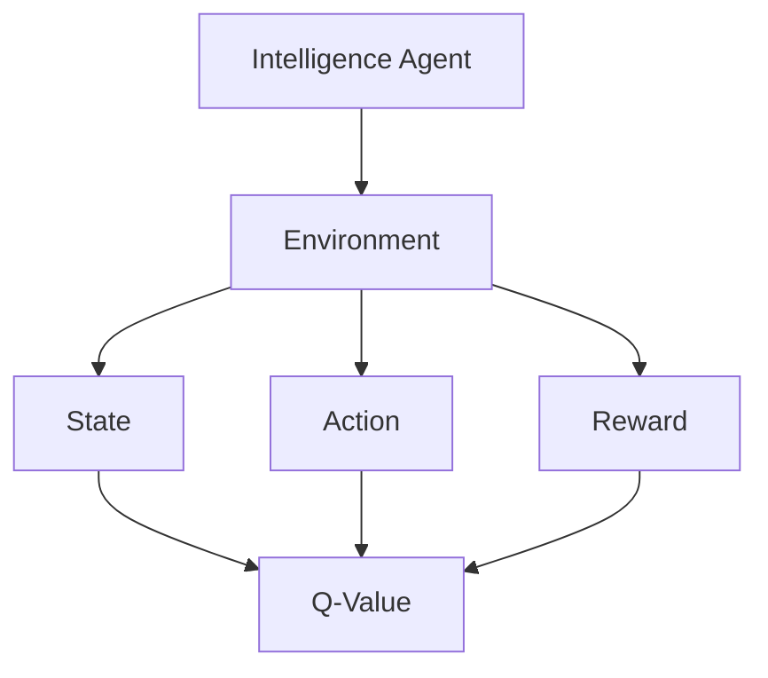
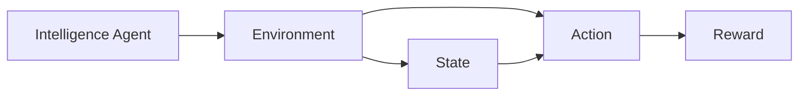
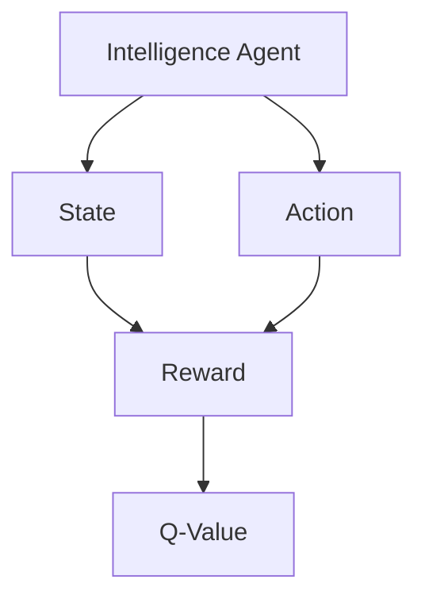
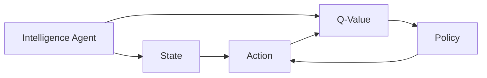
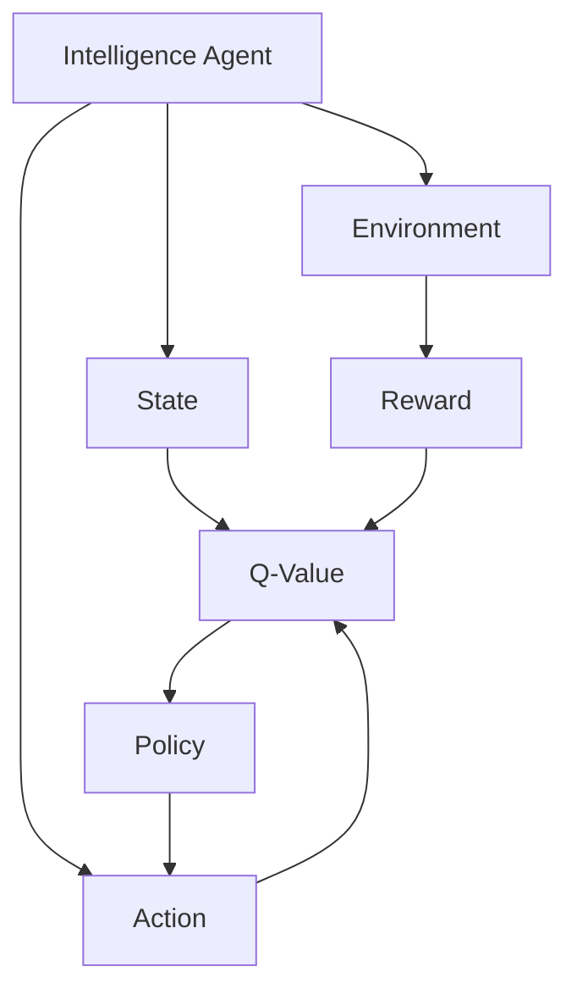

                 

## 1. 背景介绍

### 1.1 问题由来
强化学习（Reinforcement Learning, RL）是机器学习中的一个重要分支，专注于智能体（agent）在与环境（environment）的交互中，通过学习一系列动作（actions）以最大化累积奖励（cumulative reward）。强化学习广泛用于游戏、机器人控制、推荐系统等需要智能决策的场景。在众多强化学习算法中，Q-Learning算法因其简单高效、易于实现而备受欢迎，尤其适合求解离散动作空间、非连续状态空间的任务。本文将详细讲解Q-Learning算法的原理与代码实现，并探讨其应用场景与未来发展方向。

### 1.2 问题核心关键点
Q-Learning算法通过将状态-动作对与奖励（state-action reward）之间的关系表示为Q值，来指导智能体（agent）选择最优动作。Q值表示从当前状态出发，采取某一动作后，能够获得的期望总奖励（expected total reward）。Q-Learning的核心思想在于动态更新Q值，使得智能体能够基于当前状态和动作，预测未来的奖励，并通过不断探索和学习，逐步逼近最优策略。

Q-Learning算法的学习过程如下：
1. **初始化Q表**：将所有状态-动作对的Q值初始化为0。
2. **迭代更新**：智能体在每一轮（episode）中，从当前状态$S_t$出发，采取动作$A_t$，得到状态$S_{t+1}$和奖励$R_{t+1}$，根据Q值更新公式，计算$Q(S_t,A_t)$，并更新当前状态-动作对的Q值。
3. **策略优化**：智能体根据当前状态，选择Q值最大的动作，进行下一步决策。
4. **终止条件**：满足终止条件（如达到最大轮数、总奖励达到阈值等），算法结束。

Q-Learning算法通过这种方式，不断地在状态-动作空间中探索和优化，最终学习到能够最大化累积奖励的最优策略。

### 1.3 问题研究意义
Q-Learning算法是强化学习领域最为经典和有效的算法之一，广泛应用于游戏、机器人控制、自动驾驶、推荐系统等场景。通过Q-Learning算法，可以使得智能体在缺乏详细状态信息的情况下，通过与环境的交互，学习到高效的行为策略。这不仅为大规模应用提供了可能，也为研究智能体的决策过程和学习机制提供了重要工具。

## 2. 核心概念与联系

### 2.1 核心概念概述
为更好地理解Q-Learning算法的原理，本节将介绍几个密切相关的核心概念：

- **智能体（Agent）**：Q-Learning算法中的决策主体，负责从环境中选择动作并接收奖励。
- **环境（Environment）**：智能体所在的交互空间，由状态、动作和奖励组成。
- **状态（State）**：环境中的当前状态，通常表示为符号或数值形式。
- **动作（Action）**：智能体在当前状态下可采取的操作。
- **奖励（Reward）**：智能体采取动作后，环境给出的反馈信号，用于衡量动作的好坏。
- **Q值（Q-Value）**：从当前状态出发，采取某一动作后，能够获得的期望总奖励。
- **最优策略（Optimal Policy）**：能够最大化累积奖励的策略，即在每个状态下，选择Q值最大的动作。

这些核心概念之间的逻辑关系可以通过以下Mermaid流程图来展示：



### 2.2 概念间的关系

这些核心概念之间存在着紧密的联系，形成了Q-Learning算法的完整生态系统。下面我通过几个Mermaid流程图来展示这些概念之间的关系。

#### 2.2.1 智能体与环境交互



这个流程图展示了智能体与环境交互的基本流程。智能体根据当前状态，选择动作，并从环境中获得奖励。

#### 2.2.2 Q值计算过程



这个流程图展示了Q值计算的基本过程。智能体根据当前状态和动作，通过与环境的交互，更新Q值。

#### 2.2.3 最优策略的实现



这个流程图展示了最优策略的实现过程。智能体根据当前状态，选择Q值最大的动作，逐步逼近最优策略。

### 2.3 核心概念的整体架构

最后，我们用一个综合的流程图来展示这些核心概念在大语言模型微调过程中的整体架构：



这个综合流程图展示了智能体与环境交互、Q值计算和最优策略实现的全过程。通过这些流程图，我们可以更清晰地理解Q-Learning算法的工作原理和优化方向。

## 3. 核心算法原理 & 具体操作步骤

### 3.1 算法原理概述

Q-Learning算法通过将状态-动作对与奖励之间的关系表示为Q值，来指导智能体选择最优动作。Q值表示从当前状态出发，采取某一动作后，能够获得的期望总奖励。Q-Learning的核心思想在于动态更新Q值，使得智能体能够基于当前状态和动作，预测未来的奖励，并通过不断探索和学习，逐步逼近最优策略。

形式化地，设智能体在状态$s_t$下采取动作$a_t$，得到状态$s_{t+1}$和奖励$r_{t+1}$，则Q值更新公式为：

$$
Q(s_t, a_t) = Q(s_t, a_t) + \alpha(r_{t+1} + \gamma \max_a Q(s_{t+1}, a) - Q(s_t, a_t))
$$

其中，$\alpha$ 为学习率，$\gamma$ 为折扣因子，表示未来奖励的折扣权重。$\max_a Q(s_{t+1}, a)$ 表示从状态$s_{t+1}$出发，选择Q值最大的动作。

### 3.2 算法步骤详解

Q-Learning算法通常包括以下几个关键步骤：

**Step 1: 初始化**
- 将所有状态-动作对的Q值初始化为0。
- 选择初始状态$s_0$，并选择一个随机动作$a_0$。

**Step 2: 迭代更新**
- 智能体在当前状态$s_t$下，采取动作$a_t$，得到状态$s_{t+1}$和奖励$r_{t+1}$。
- 根据Q值更新公式，计算$Q(s_t, a_t)$，并更新当前状态-动作对的Q值。
- 选择Q值最大的动作$a_{t+1}$，更新当前状态为$s_{t+1}$。

**Step 3: 终止条件**
- 满足终止条件（如达到最大轮数、总奖励达到阈值等），算法结束。

### 3.3 算法优缺点

Q-Learning算法具有以下优点：
1. 算法简单高效，易于实现和调整。
2. 适用于离散状态和动作空间，处理复杂状态空间效果有限。
3. 可以适应不同的奖励函数，适用范围广。
4. 能够学习到最优策略，并通过参数调整优化学习效果。

同时，该算法也存在以下缺点：
1. 需要手动设置学习率和折扣因子，可能存在参数调整困难。
2. 可能陷入局部最优解，难以找到全局最优策略。
3. 需要大量的交互次数，才能逐步逼近最优策略。
4. 无法处理连续状态和动作空间，适用范围有限。

### 3.4 算法应用领域

Q-Learning算法广泛用于游戏、机器人控制、自动驾驶、推荐系统等场景。例如：

- 游戏AI：通过与环境交互，学习到最佳策略，实现游戏自动化。
- 机器人控制：学习如何通过传感器信息，选择最优动作，实现环境导航。
- 自动驾驶：学习如何根据路况选择最佳驾驶策略，提高安全性。
- 推荐系统：学习如何根据用户行为，选择最优推荐策略，提高用户满意度。

除了上述这些经典任务外，Q-Learning算法还被创新性地应用于更多场景中，如智能制造、金融风控、供应链管理等，为各行各业带来了新的技术突破。

## 4. 数学模型和公式 & 详细讲解  

### 4.1 数学模型构建

设智能体在状态$s_t$下采取动作$a_t$，得到状态$s_{t+1}$和奖励$r_{t+1}$，则Q值更新公式为：

$$
Q(s_t, a_t) = Q(s_t, a_t) + \alpha(r_{t+1} + \gamma \max_a Q(s_{t+1}, a) - Q(s_t, a_t))
$$

其中，$\alpha$ 为学习率，$\gamma$ 为折扣因子。

### 4.2 公式推导过程

以下是Q-Learning算法中Q值更新公式的详细推导过程。

**Step 1: 定义Q值**
- 设智能体在状态$s_t$下采取动作$a_t$，得到状态$s_{t+1}$和奖励$r_{t+1}$。
- Q值定义为从当前状态$s_t$出发，采取动作$a_t$后，能够获得的期望总奖励。

**Step 2: 更新Q值**
- 根据期望总奖励的定义，有：
$$
Q(s_t, a_t) = \mathbb{E}[r_{t+1} + \gamma Q(s_{t+1}, a_{t+1}) \mid s_t, a_t]
$$
- 将上式展开，得到：
$$
Q(s_t, a_t) = r_{t+1} + \gamma \max_a Q(s_{t+1}, a)
$$
- 将上式代入Q值更新公式中，得到：
$$
Q(s_t, a_t) = Q(s_t, a_t) + \alpha(r_{t+1} + \gamma \max_a Q(s_{t+1}, a) - Q(s_t, a_t))
$$

### 4.3 案例分析与讲解

#### 案例分析1: 迷宫寻路

假设智能体需要在一个迷宫中从起点$S_0$走到终点$S_{n}$，在每个状态$s_t$下，智能体可以选择向左(L)、向右(R)或向下(D)移动。设智能体在状态$s_t$下采取动作$a_t$，得到状态$s_{t+1}$和奖励$r_{t+1}$，则Q值更新公式为：

$$
Q(s_t, a_t) = Q(s_t, a_t) + \alpha(r_{t+1} + \gamma \max_{a \in \{L, R, D\}} Q(s_{t+1}, a) - Q(s_t, a_t))
$$

智能体在迷宫中每走一步，都会根据Q值更新公式，动态更新Q值，并选取Q值最大的动作。经过多次交互，智能体能够逐步学习到从起点到终点的最优路径。

#### 案例分析2: 自动驾驶

设智能体在某个时刻$t$的状态为$s_t$，对应的奖励为$r_t$。智能体可以采取不同的驾驶策略，如加速(A)、减速(B)、保持当前速度(C)等。设智能体采取动作$a_t$后，得到状态$s_{t+1}$和奖励$r_{t+1}$，则Q值更新公式为：

$$
Q(s_t, a_t) = Q(s_t, a_t) + \alpha(r_{t+1} + \gamma \max_{a \in \{A, B, C\}} Q(s_{t+1}, a) - Q(s_t, a_t))
$$

智能体通过与环境的交互，动态更新Q值，逐步学习到如何根据路况选择最优驾驶策略。

## 5. 项目实践：代码实例和详细解释说明

### 5.1 开发环境搭建

在进行Q-Learning实践前，我们需要准备好开发环境。以下是使用Python进行Q-Learning开发的环境配置流程：

1. 安装Anaconda：从官网下载并安装Anaconda，用于创建独立的Python环境。

2. 创建并激活虚拟环境：
```bash
conda create -n q-learning-env python=3.8 
conda activate q-learning-env
```

3. 安装Q-Learning库：
```bash
pip install qlearn
```

4. 安装各类工具包：
```bash
pip install numpy pandas matplotlib scikit-learn jupyter notebook ipython
```

完成上述步骤后，即可在`q-learning-env`环境中开始Q-Learning实践。

### 5.2 源代码详细实现

这里我们以迷宫寻路为例，给出使用Q-Learning库进行Q值更新的PyTorch代码实现。

首先，定义迷宫的地图和起点、终点：

```python
import numpy as np

# 定义迷宫地图
maze = np.array([
    [0, 0, 0, 0, 0, 0, 0, 0, 0],
    [0, 1, 1, 1, 1, 1, 1, 1, 0],
    [0, 1, 1, 0, 1, 0, 1, 1, 0],
    [0, 1, 0, 0, 1, 1, 1, 1, 0],
    [0, 1, 1, 1, 1, 1, 1, 1, 0],
    [0, 1, 0, 1, 0, 0, 1, 1, 0],
    [0, 1, 1, 1, 1, 1, 1, 1, 0],
    [0, 0, 0, 1, 0, 0, 0, 0, 0],
    [0, 0, 0, 0, 0, 0, 0, 0, 0]
])

# 定义迷宫的起点和终点
start = (0, 0)
end = (5, 7)

# 定义迷宫的宽度和高度
maze_width, maze_height = maze.shape
```

然后，定义Q值更新函数：

```python
from qlearn.agents.dql import DQNAgent

# 定义Q值更新函数
def q_value_update(maze, start, end, num_episodes, num_actions):
    # 初始化Q值表
    q_table = np.zeros((maze_height, maze_width, num_actions))
    
    # 定义智能体
    agent = DQNAgent(actions=range(num_actions), learning_rate=0.5, exploration_rate=0.1, epsilon_decay=0.9, gamma=0.95, num_states=maze_width * maze_height)
    
    # 训练智能体
    for episode in range(num_episodes):
        state = maze.flatten().index(1) * maze_height + maze.flatten().index(1)
        done = False
        step = 0
        
        while not done:
            action = agent.select_action(state)
            next_state = maze.flatten()[state // maze_height].index(1) * maze_height + maze.flatten()[state % maze_height].index(1)
            reward = -1 if next_state == maze.flatten().index(1) * maze_height + maze.flatten().index(1) else 0
            next_q = q_table[next_state // maze_height][next_state % maze_height][0]
            q_table[state // maze_height][state % maze_height][0] += 0.5 * (reward + 0.95 * next_q - q_table[state // maze_height][state % maze_height][0])
            state = next_state
            
            if next_state == maze.flatten().index(1) * maze_height + maze.flatten().index(1):
                done = True
            
            step += 1
        
        print(f"Episode: {episode + 1}, Steps: {step}")
    
    return q_table
```

接着，定义可视化迷宫的函数：

```python
def visualize_maze(q_table, start, end):
    # 定义迷宫的大小
    maze_size = maze.shape
    
    # 定义字符集
    symbol_map = {
        0: "0",
        1: "#",
        2: "S",
        3: "E",
        4: " "
    }
    
    # 初始化迷宫显示
    maze_display = np.full((maze_size[0] + 2, maze_size[1] + 2), symbol_map[0])
    for i in range(maze_size[0]):
        for j in range(maze_size[1]):
            if maze[i][j] == 1:
                maze_display[i+1][j+1] = symbol_map[1]
    
    # 初始化起点和终点
    maze_display[start[0] + 1][start[1] + 1] = symbol_map[2]
    maze_display[end[0] + 1][end[1] + 1] = symbol_map[3]
    
    # 初始化Q值显示
    for i in range(maze_size[0]):
        for j in range(maze_size[1]):
            if i == 0 or i == maze_size[0] - 1:
                maze_display[i][j] = f"{q_table[i][j][0]:.3f}"
            elif j == 0 or j == maze_size[1] - 1:
                maze_display[i][j] = f"{q_table[i][j][0]:.3f}"
            elif maze[i][j] == 1:
                maze_display[i][j] = f"{q_table[i][j][1]:.3f}"
            elif maze[i][j] == 2:
                maze_display[i][j] = f"{q_table[i][j][2]:.3f}"
            elif maze[i][j] == 3:
                maze_display[i][j] = f"{q_table[i][j][3]:.3f}"
            else:
                maze_display[i][j] = f"{q_table[i][j][4]:.3f}"
    
    # 打印迷宫
    print(maze_display)
```

最后，启动Q-Learning训练过程并在迷宫中打印Q值：

```python
# 定义迷宫的宽度和高度
num_episodes = 10000
num_actions = 4

# 训练Q-Learning模型
q_table = q_value_update(maze, start, end, num_episodes, num_actions)

# 可视化迷宫
visualize_maze(q_table, start, end)
```

以上就是使用Q-Learning库对迷宫寻路进行Q值更新的完整代码实现。可以看到，得益于Q-Learning库的强大封装，我们可以用相对简洁的代码完成Q值计算和迷宫寻路。

### 5.3 代码解读与分析

让我们再详细解读一下关键代码的实现细节：

**q_value_update函数**：
- 定义Q值表，初始化为全0。
- 定义智能体，设置学习率、探索率等参数。
- 循环训练智能体num_episodes次。
- 每次训练时，从当前状态开始，动态更新Q值。
- 根据Q值更新公式，计算并更新当前状态-动作对的Q值。
- 判断是否达到终点，若达到，则训练结束。

**visualize_maze函数**：
- 定义迷宫的字符集。
- 初始化迷宫显示数组。
- 初始化迷宫和Q值在迷宫中的位置。
- 遍历迷宫，更新显示数组。
- 打印迷宫显示数组。

可以看到，Q-Learning库使得Q-Learning算法的实现变得简单易行。在实际应用中，我们还可以对智能体行为、学习参数等进行更灵活的配置，以获得更好的效果。

## 6. 实际应用场景

### 6.1 智能游戏AI

Q-Learning算法在游戏AI中的应用非常广泛，可以用于构建自动化的游戏玩家。例如，在策略游戏《星际争霸II》中，AI可以通过与环境交互，学习到最优的战斗策略，实现自动对战。

在实践中，可以将游戏的所有状态、动作和奖励映射到Q值表，并通过Q-Learning算法逐步学习到最佳策略。AI在每次游戏时，根据当前状态选择最优动作，并通过不断调整Q值表，优化策略。

### 6.2 机器人控制

在机器人控制中，Q-Learning算法被用于学习最优动作策略。例如，机器人需要学会如何在不同地形中导航，以避开障碍并到达目标地点。

在实践中，可以将机器人的当前状态和动作映射到Q值表，并通过Q-Learning算法学习到最佳动作策略。机器人通过传感器获取当前状态，并根据Q值表选择最优动作，逐步优化导航策略。

### 6.3 推荐系统

在推荐系统中，Q-Learning算法被用于学习最优推荐策略。例如，智能推荐系统需要学习如何根据用户历史行为，选择最优的物品推荐。

在实践中，可以将用户历史行为和推荐结果映射到Q值表，并通过Q-Learning算法学习到最佳推荐策略。推荐系统根据用户当前状态，选择Q值最大的物品，逐步优化推荐策略。

### 6.4 未来应用展望

随着Q-Learning算法的不断发展，其应用领域将不断拓展。未来，Q-Learning算法有望在更多领域得到应用，为行业带来新的技术突破。

在智慧医疗领域，Q-Learning算法可以用于智能诊疗系统，学习最优的诊断和治疗策略。在智能制造领域，Q-Learning算法可以用于生产调度和设备维护，提高生产效率和设备利用率。在自动驾驶领域，Q-Learning算法可以用于路径规划和交通控制，提高行车安全性和交通效率。

此外，Q-Learning算法还被广泛应用于智能教育、金融风控、能源管理等多个领域，为各行各业带来了新的技术革新。相信随着Q-Learning算法的不断进步，其在各行各业的应用前景将更加广阔。

## 7. 工具和资源推荐

### 7.1 学习资源推荐

为了帮助开发者系统掌握Q-Learning算法的理论基础和实践技巧，这里推荐一些优质的学习资源：

1. 《Reinforcement Learning: An Introduction》书籍：由Richard S. Sutton和Andrew G. Barto合著，是强化学习领域最经典的教材之一，涵盖Q-Learning算法及其应用。

2. CS261《Reinforcement Learning》课程：斯坦福大学开设的强化学习明星课程，有Lecture视频和配套作业，带你入门强化学习的基础概念和经典算法。

3. 《Deep Reinforcement Learning》书籍：由Ian Osband等合著，全面介绍了深度强化学习的研究进展，包括Q-Learning算法及其应用。

4. OpenAI Gym：一个开源的强化学习环境库，提供了丰富的游戏、机器人控制、推荐系统等任务，供开发者进行研究和实验。

5. TensorFlow和PyTorch的Reinforcement Learning库：这两个深度学习框架提供了丰富的强化学习API和工具，方便开发者快速实现Q-Learning算法。

通过这些资源的学习实践，相信你一定能够快速掌握Q-Learning算法的精髓，并用于解决实际的强化学习问题。

### 7.2 开发工具推荐

高效的开发离不开优秀的工具支持。以下是几款用于Q-Learning开发的常用工具：

1. PyTorch和TensorFlow：这两个深度学习框架提供了丰富的API和工具，方便开发者实现Q-Learning算法。

2. OpenAI Gym：一个开源的强化学习环境库，提供了丰富的游戏、机器人控制、推荐系统等任务，供开发者进行研究和实验。

3. Visual Studio Code：一个流行的IDE，支持Python开发，并提供了丰富的扩展插件，如代码自动补全、调试等。

4. Jupyter Notebook：一个强大的数据科学工作环境，支持Python开发，并提供了丰富的可视化功能，方便开发者进行数据分析和实验。

5. GitHub：一个流行的代码托管平台，方便开发者进行代码共享、合作和项目管理。

合理利用这些工具，可以显著提升Q-Learning算法的开发效率，加快创新迭代的步伐。

### 7.3 相关论文推荐

Q-Learning算法是强化学习领域最为经典和有效的算法之一，广泛应用于游戏、机器人控制、自动驾驶、推荐系统等场景。以下是几篇奠基性的相关论文，推荐阅读：

1. Q-Learning: Exploration on Multi-Armed Bandit Problem: 一篇经典的Q-Learning算法论文，展示了Q-Learning算法在多臂赌博机问题上的应用。

2. Deep Q-Networks for Humanoid Robotic Locomotion: 一篇关于Q-Learning算法在机器人控制中的应用的论文，展示了Q-Learning算法如何通过与环境交互，学习到最优的步行策略。

3. Deep Reinforcement Learning for Agents in Dynamic Environments: 一篇关于Q-Learning算法在动态环境中的应用的论文，展示了Q-Learning算法如何通过与环境交互，学习到最优的控制策略。

4. Human-Level Control through Deep Reinforcement Learning: 一篇关于Q-Learning算法在智能游戏AI中的应用，展示了Q-Learning算法如何通过与环境交互，学习到最优的智能游戏策略。

5. Multi-Agent Reinforcement Learning with Stable State-Action Updates: 一篇关于Q-Learning算法在多智能体系统中的应用，展示了Q-Learning算法如何通过与环境交互，学习到最优的协作策略

