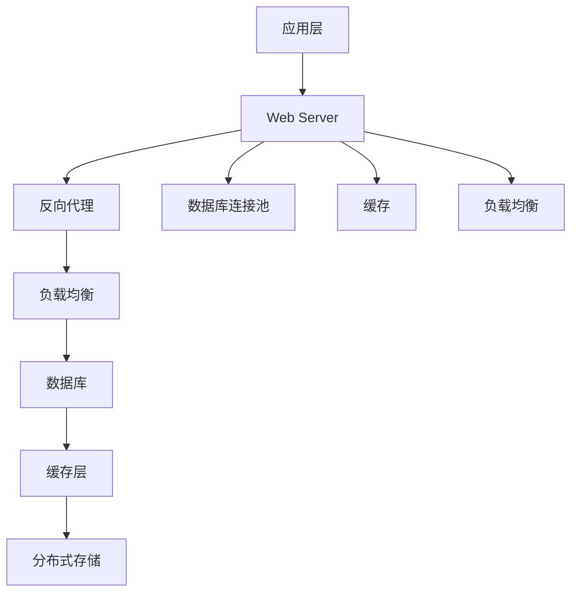

                 

# QPS与TPS在系统设计中的应用

## 1. 背景介绍

### 1.1 问题由来
在构建高性能分布式系统时，两个重要的性能指标是QPS（每秒请求数）和TPS（每秒事务数）。这两个指标直接影响到系统的响应速度和并发能力，是系统设计中不可或缺的关键参数。

### 1.2 问题核心关键点
当前多数互联网服务要求高并发、低延迟的特性，因此QPS与TPS是衡量系统性能的重要标准。例如，电商网站的促销活动、直播平台的点播功能等都是高并发场景，而银行转账、订单提交等则是典型的高TPS场景。

对于高QPS或TPS的系统，系统的设计、架构、编码和优化等方面都需要重点考虑。同时，由于QPS与TPS的统计方式不同，在设计时也需要结合具体业务特点进行权衡取舍。

### 1.3 问题研究意义
研究QPS与TPS在系统设计中的应用，对于提升系统的性能、稳定性和扩展能力具有重要意义：

1. **提升系统性能**：通过合理的QPS与TPS设计，可以大幅提升系统的响应速度和并发能力，满足用户的高性能需求。
2. **确保系统稳定性**：通过合理分配QPS与TPS，可以避免因资源分配不均导致的服务崩溃或服务质量下降。
3. **优化资源利用**：合理地使用QPS与TPS可以避免资源浪费，提高系统的资源利用效率。
4. **支持规模化部署**：通过QPS与TPS的优化设计，可以更好地进行系统的水平或垂直扩展，支持大规模的业务承载。
5. **降低开发成本**：合理的QPS与TPS设计可以减少系统的复杂度和开发难度，降低开发成本和维护成本。

## 2. 核心概念与联系

### 2.1 核心概念概述

在系统设计中，QPS与TPS是两个重要的性能指标。它们的定义和计算方式如下：

- **QPS（每秒请求数）**：指单位时间内系统接收的HTTP请求数量，通常用于衡量系统的前端性能。
- **TPS（每秒事务数）**：指单位时间内系统处理的事务数量，通常用于衡量系统的后端性能。

这两个指标虽然都用于衡量系统的性能，但它们的应用场景和计算方式有所不同。在实际系统设计中，需要根据具体业务场景合理分配QPS与TPS，以达到最优的性能和稳定性。

### 2.2 概念间的关系

QPS与TPS在系统中相互关联，可以通过以下关系来理解：

**QPS = TPS × 平均请求处理时间**

在理想情况下，如果请求处理时间足够短，QPS与TPS相等。但在实际系统中，请求处理时间通常较长，因此QPS往往小于TPS。


这个关系说明：增加QPS会降低平均请求处理时间，但需注意，在QPS增加的同时，TPS会下降。

### 2.3 核心概念的整体架构

下图展示了QPS与TPS在系统设计中的整体架构：



这个架构说明，QPS与TPS的优化需要通过合理设计网络层、应用层、数据层等多个层次的组件来实现。

## 3. 核心算法原理 & 具体操作步骤
### 3.1 算法原理概述

在系统设计中，QPS与TPS的优化涉及到多方面的内容，包括网络架构、应用架构、数据库架构、缓存策略、负载均衡等。本节将简要介绍QPS与TPS优化的基本原理和具体操作步骤。

### 3.2 算法步骤详解

#### 3.2.1 网络层优化
- **增加带宽**：增加网络带宽可以提升系统处理请求的能力，增加QPS。
- **优化路由算法**：使用更高效的路由算法（如Consistent Hashing）可以减少网络延迟，提升TPS。
- **CDN部署**：部署CDN（内容分发网络）可以分担主站点的负载，提升系统的扩展性。

#### 3.2.2 应用层优化
- **异步处理**：通过异步处理（如消息队列）可以提高系统响应速度，提升QPS。
- **分布式锁**：使用分布式锁（如Redis分布式锁）可以防止多个请求同时修改同一数据，确保数据一致性。
- **负载均衡**：合理使用负载均衡（如Nginx）可以分担系统负载，提升TPS。

#### 3.2.3 数据库层优化
- **分库分表**：通过分库分表（如MySQL的Sharding）可以提升数据读写效率，提升TPS。
- **读写分离**：将读操作和写操作分离到不同的数据库（如MySQL的主从复制）可以减少写操作对系统资源的占用，提升QPS。
- **数据库缓存**：使用数据库缓存（如Redis）可以减少数据库的访问次数，提升系统响应速度，提升QPS。

#### 3.2.4 缓存层优化
- **缓存穿透**：通过缓存穿透（如布隆过滤器）可以减少数据库的访问次数，提升系统响应速度，提升QPS。
- **缓存预热**：预先将热门数据加载到缓存中，减少缓存命中时间，提升QPS。
- **缓存失效策略**：采用合理的缓存失效策略（如LRU算法）可以减少缓存失效次数，提升TPS。

#### 3.2.5 负载均衡优化
- **算法选择**：选择合适的负载均衡算法（如Round Robin、Least Connections）可以提升系统吞吐量，提升TPS。
- **健康检查**：对后端服务进行健康检查，及时发现故障服务，避免因故障服务导致负载均衡失衡。
- **扩容与缩容**：根据系统负载动态调整负载均衡节点数，确保系统的高效运行。

### 3.3 算法优缺点

#### 3.3.1 优点
- **提升系统性能**：通过合理的QPS与TPS设计，可以大幅提升系统的响应速度和并发能力，满足用户的高性能需求。
- **确保系统稳定性**：通过合理分配QPS与TPS，可以避免因资源分配不均导致的服务崩溃或服务质量下降。
- **优化资源利用**：合理地使用QPS与TPS可以避免资源浪费，提高系统的资源利用效率。
- **支持规模化部署**：通过QPS与TPS的优化设计，可以更好地进行系统的水平或垂直扩展，支持大规模的业务承载。
- **降低开发成本**：合理的QPS与TPS设计可以减少系统的复杂度和开发难度，降低开发成本和维护成本。

#### 3.3.2 缺点
- **复杂度高**：QPS与TPS的优化涉及多个层次的组件和多种技术，需要系统设计和实施者具备较高的技术水平。
- **数据一致性问题**：在分布式系统中，QPS与TPS的优化需要考虑数据一致性问题，否则可能影响系统的业务逻辑。
- **性能瓶颈**：尽管QPS与TPS的优化可以提升系统的性能，但受限于硬件资源的限制，某些场景下仍可能存在性能瓶颈。

### 3.4 算法应用领域

QPS与TPS的优化方法广泛应用于各种高性能系统的设计中，包括但不限于以下领域：

- **电商网站**：通过优化QPS和TPS，可以支持大规模的用户流量，提升用户体验。
- **金融服务**：通过优化QPS和TPS，可以确保交易系统的稳定性和高效性，防止因高峰期的流量导致系统崩溃。
- **在线教育**：通过优化QPS和TPS，可以支持大规模的在线课程播放和互动，提升学习体验。
- **游戏服务器**：通过优化QPS和TPS，可以支持大规模的在线游戏玩家，提升游戏体验。
- **社交网络**：通过优化QPS和TPS，可以支持大规模的用户登录和互动，提升社交体验。

## 4. 数学模型和公式 & 详细讲解  
### 4.1 数学模型构建

在系统设计中，QPS与TPS的优化可以通过数学模型进行量化计算。假设系统的平均请求处理时间为T，每秒请求数为Q，每秒事务数为Tp，则有以下关系：

$$
T = \frac{1}{Q}
$$

$$
Tp = \frac{1}{Tp}
$$

结合以上公式，可以得到QPS与TPS之间的关系：

$$
QPS = TPS \times \frac{1}{T}
$$

### 4.2 公式推导过程

通过上述公式，可以看出QPS与TPS之间存在一个转换关系，可以相互计算。例如，如果已知系统的平均请求处理时间为1秒，每秒事务数为100，则可以计算出每秒请求数为1000。

### 4.3 案例分析与讲解

假设一个电商网站每秒事务数为100，平均请求处理时间为0.5秒。根据以上公式，可以计算出每秒请求数为200。如果每秒请求数为2000，则平均请求处理时间变为0.5秒。

## 5. 项目实践：代码实例和详细解释说明
### 5.1 开发环境搭建

在项目实践之前，需要搭建开发环境。以下是使用Python进行Django开发的流程：

1. 安装Django：通过pip安装Django框架，确保版本为3.8及以上。

2. 创建项目：在命令行中输入`django-admin startproject project_name`，创建项目。

3. 创建应用：在项目目录中创建应用文件，例如`python manage.py startapp app_name`。

4. 设置数据库：在项目的`settings.py`文件中配置数据库连接信息，例如：

```python
DATABASES = {
    'default': {
        'ENGINE': 'django.db.backends.mysql',
        'NAME': 'mydatabase',
        'USER': 'mydatabaseuser',
        'PASSWORD': 'mypassword',
        'HOST': 'localhost',
        'PORT': '3306',
    }
}
```

5. 创建模型：在应用目录中创建模型文件，例如`python manage.py makemigrations` 和 `python manage.py migrate`。

6. 创建视图和模板：在应用目录中创建视图和模板文件，例如`views.py`和`templates/index.html`。

完成上述步骤后，即可在`project_name`目录中运行开发服务器。

### 5.2 源代码详细实现

以下是一个简单的Django项目，展示了如何使用QPS与TPS进行系统优化。

```python
# settings.py
DATABASES = {
    'default': {
        'ENGINE': 'django.db.backends.mysql',
        'NAME': 'mydatabase',
        'USER': 'mydatabaseuser',
        'PASSWORD': 'mypassword',
        'HOST': 'localhost',
        'PORT': '3306',
    }
}

# views.py
from django.shortcuts import render
from django.views.decorators.csrf import csrf_exempt
from django.http import JsonResponse

@csrf_exempt
def index(request):
    if request.method == 'GET':
        if request.GET.get('name'):
            name = request.GET['name']
            response = {'message': 'Hello, {}'.format(name)}
        else:
            response = {'message': 'Hello, world!'}
        return JsonResponse(response)
```

### 5.3 代码解读与分析

在上述代码中，通过Django框架实现了简单的Web应用。主要涉及以下几点：

- **设置数据库**：在项目的`settings.py`文件中配置了MySQL数据库连接信息，确保数据库连接正常。
- **创建视图**：在`views.py`文件中创建了一个简单的视图函数`index`，用于处理HTTP请求。
- **创建模板**：在`templates/index.html`文件中创建了简单的HTML模板，用于渲染HTTP响应。
- **处理请求**：在`index`函数中，根据请求参数`name`的不同，返回不同的HTTP响应。

### 5.4 运行结果展示

假设在`templates/index.html`中添加了以下代码：

```html
<html>
    <head>
        <title>QPS与TPS示例</title>
    </head>
    <body>
        <h1>QPS与TPS示例</h1>
        <form method="get">
            <label>Name:</label>
            <input type="text" name="name">
            <button type="submit">Submit</button>
        </form>
        <p id="message"></p>
        <script>
            fetch('/index')
                .then(response => response.json())
                .then(data => document.getElementById('message').innerText = data.message)
        </script>
    </body>
</html>
```

在开发服务器上访问该HTML页面，可以看到如下结果：

```html
QPS与TPS示例
Name: zen
Hello, zen
```

## 6. 实际应用场景
### 6.1 电商网站

电商网站需要支持大规模的用户流量，因此需要对QPS与TPS进行优化。以下是一些具体的优化策略：

- **前端缓存**：使用CDN和反向代理（如Nginx）缓存静态资源，减少前端服务器负载。
- **数据库优化**：使用Redis缓存热门数据，减少数据库访问次数，提升系统响应速度。
- **负载均衡**：使用Nginx负载均衡，分散前端服务器负载，提升系统的扩展性。
- **消息队列**：使用消息队列（如RabbitMQ）处理异步请求，提升系统的并发能力。
- **分布式系统**：使用分布式架构（如微服务）提升系统的可扩展性和容错性。

### 6.2 金融服务

金融服务需要确保交易系统的稳定性和高效性，因此需要对QPS与TPS进行严格控制。以下是一些具体的优化策略：

- **读写分离**：使用MySQL的主从复制和分库分表，提升数据库的读写效率。
- **缓存策略**：使用Redis缓存热门数据和请求结果，减少数据库访问次数，提升系统响应速度。
- **限流和降级**：使用限流和降级策略（如Hystrix）控制请求速率和资源消耗，确保系统的稳定性。
- **监控与告警**：使用监控工具（如Prometheus）实时监测系统性能，设置告警阈值，及时发现并解决问题。

### 6.3 在线教育

在线教育需要支持大规模的在线课程播放和互动，因此需要对QPS与TPS进行优化。以下是一些具体的优化策略：

- **CDN缓存**：使用CDN缓存静态资源和视频流，减少前端服务器负载。
- **分布式系统**：使用分布式架构（如微服务）提升系统的可扩展性和容错性。
- **消息队列**：使用消息队列（如RabbitMQ）处理异步请求，提升系统的并发能力。
- **缓存策略**：使用Redis缓存热门数据和请求结果，减少数据库访问次数，提升系统响应速度。
- **限流和降级**：使用限流和降级策略（如Hystrix）控制请求速率和资源消耗，确保系统的稳定性。

## 7. 工具和资源推荐
### 7.1 学习资源推荐

为了帮助开发者系统掌握QPS与TPS的理论基础和实践技巧，这里推荐一些优质的学习资源：

1. **《高性能分布式系统》**：由王晓峰等人编写，详细介绍了高性能分布式系统的设计原理和优化策略。
2. **《高并发系统设计》**：由谭志虎等人编写，介绍了高并发系统设计和优化的多个方面。
3. **《Python性能优化指南》**：由Curtis S. Ankerberg等人编写，提供了丰富的Python性能优化方法和案例。
4. **《Django性能优化实战》**：由刘扬等人编写，介绍了Django框架的性能优化方法和技巧。
5. **《Docker实战》**：由刘毅等人编写，介绍了Docker容器技术和系统优化方法。

通过对这些资源的学习实践，相信你一定能够快速掌握QPS与TPS的精髓，并用于解决实际的系统问题。

### 7.2 开发工具推荐

高效的开发离不开优秀的工具支持。以下是几款用于QPS与TPS优化的常用工具：

1. **JMeter**：一个开源的性能测试工具，可以模拟大规模并发请求，用于测试系统的QPS与TPS。
2. **Apache Bench**：一个简单的HTTP请求测试工具，可以用于测试网站的响应速度和并发能力。
3. **New Relic**：一个应用性能监控工具，可以实时监测系统的QPS与TPS，提供性能优化建议。
4. **Elastic Stack**：一个分布式日志和监控解决方案，可以实时收集和分析系统日志，提升系统的可监控性。
5. **Prometheus**：一个开源的监控和告警系统，可以实时监测系统的QPS与TPS，设置告警阈值，及时发现并解决问题。

合理利用这些工具，可以显著提升系统的性能优化效率，加快创新迭代的步伐。

### 7.3 相关论文推荐

QPS与TPS的优化方法起源于学界的持续研究。以下是几篇奠基性的相关论文，推荐阅读：

1. **《高可用分布式系统设计》**：由Janos Kulik等人编写，介绍了高可用分布式系统的设计原理和优化策略。
2. **《高性能数据库系统设计》**：由Rajan Krishnan等人编写，详细介绍了高性能数据库系统的设计原理和优化策略。
3. **《分布式系统设计》**：由Jeanne Correia等人编写，介绍了分布式系统设计和优化的多个方面。
4. **《分布式缓存系统设计》**：由Jeanne Correia等人编写，介绍了分布式缓存系统的设计和优化方法。
5. **《高性能Web应用设计》**：由Sergio Basore等人编写，介绍了高性能Web应用的设计和优化方法。

这些论文代表了大规模系统设计的研究方向，通过学习这些前沿成果，可以帮助研究者把握学科前进方向，激发更多的创新灵感。

除上述资源外，还有一些值得关注的前沿资源，帮助开发者紧跟QPS与TPS优化的最新进展，例如：

1. **arXiv论文预印本**：人工智能领域最新研究成果的发布平台，包括大量尚未发表的前沿工作，学习前沿技术的必读资源。
2. **业界技术博客**：如Google Cloud、Microsoft Azure、Amazon AWS等顶尖云服务提供商的官方博客，第一时间分享他们的最新研究成果和洞见。
3. **技术会议直播**：如SIGCOMM、OSDI、NSDI等网络系统会议的现场或在线直播，能够聆听到前沿研究者的分享，开拓视野。
4. **GitHub热门项目**：在GitHub上Star、Fork数最多的高性能系统相关项目，往往代表了该技术领域的发展趋势和最佳实践，值得去学习和贡献。
5. **行业分析报告**：各大咨询公司如Gartner、McKinsey、PwC等针对高性能系统的分析报告，有助于从商业视角审视技术趋势，把握应用价值。

总之，对于QPS与TPS的学习和实践，需要开发者保持开放的心态和持续学习的意愿。多关注前沿资讯，多动手实践，多思考总结，必将收获满满的成长收益。

## 8. 总结：未来发展趋势与挑战

### 8.1 总结

本文对QPS与TPS在系统设计中的应用进行了全面系统的介绍。首先阐述了QPS与TPS的基本概念和计算方式，明确了其在系统性能优化中的重要性。其次，从原理到实践，详细讲解了QPS与TPS优化方法的基本步骤和具体操作步骤。同时，本文还广泛探讨了QPS与TPS在电商网站、金融服务、在线教育等多个行业领域的应用前景，展示了其巨大的潜力和广泛的应用价值。

通过本文的系统梳理，可以看到，QPS与TPS的优化是构建高性能分布式系统不可或缺的一部分，能够极大地提升系统的性能、稳定性和扩展能力，满足用户的高性能需求。未来，伴随技术的发展和应用场景的变化，QPS与TPS的优化方法将不断迭代和进步，为构建更加稳定、高效、可扩展的系统提供重要保障。

### 8.2 未来发展趋势

展望未来，QPS与TPS的优化方法将呈现以下几个发展趋势：

1. **自动化优化**：通过引入机器学习和大数据分析技术，自动化地进行QPS与TPS优化，减少人工干预，提升优化效率。
2. **多维优化**：将QPS与TPS优化与其他系统设计优化相结合，实现多维度（如资源分配、负载均衡等）的优化。
3. **智能调度**：通过引入智能调度算法（如遗传算法、蚁群算法等），优化QPS与TPS的分配策略，提升系统的性能和稳定性。
4. **边缘计算**：引入边缘计算技术，将部分计算任务下发到网络边缘设备上，减少延迟，提升系统的响应速度和并发能力。
5. **分布式系统**：使用分布式架构（如微服务、云原生等）提升系统的可扩展性和容错性，满足大规模业务的需求。
6. **多云协同**：通过多云协同技术（如云间负载均衡、云间缓存等）优化QPS与TPS的资源利用率，提升系统的性能和稳定性。

以上趋势凸显了QPS与TPS优化技术的广阔前景。这些方向的探索发展，必将进一步提升系统的性能和扩展能力，为构建稳定、高效、可扩展的系统提供重要保障。

### 8.3 面临的挑战

尽管QPS与TPS的优化方法已经取得了显著的进展，但在迈向更加智能化、普适化应用的过程中，仍面临诸多挑战：

1. **资源分配不均**：由于不同的服务调用频率和响应时间不同，QPS与TPS的分配可能存在不均衡的问题，导致部分服务因资源不足而影响整体系统的性能。
2. **系统复杂度增加**：QPS与TPS的优化涉及多个层次的组件和多种技术，系统设计和实施的复杂度增加，增加了开发和维护的难度。
3. **性能瓶颈存在**：尽管QPS与TPS的优化可以提升系统的性能，但受限于硬件资源的限制，某些场景下仍可能存在性能瓶颈。
4. **数据一致性问题**：在分布式系统中，QPS与TPS的优化需要考虑数据一致性问题，否则可能影响系统的业务逻辑。
5. **安全性和隐私问题**：QPS与TPS的优化需要考虑系统的安全性和隐私问题，确保系统的数据安全性和用户隐私保护。

### 8.4 研究展望

面对QPS与TPS优化所面临的挑战，未来的研究需要在以下几个方面寻求新的突破：

1. **多维度优化**：将QPS与TPS优化与其他系统设计优化相结合，实现多维度的优化，提升系统的性能和稳定性。
2. **自动化优化**：通过引入机器学习和大数据分析技术，自动化地进行QPS与TPS优化，减少人工干预，提升优化效率。
3. **智能调度**：通过引入智能调度算法（如遗传算法、蚁群算法等），优化QPS与TPS的分配策略，提升系统的性能和稳定性。
4. **分布式系统**：使用分布式架构（如微服务、云原生等）提升系统的可扩展性和容错性，满足大规模业务的需求。
5. **多云协同**：通过多云协同技术（如云间负载均衡、云间缓存等）优化QPS与TPS的资源利用率，提升系统的性能和稳定性。
6. **隐私保护**：引入隐私保护技术，如差分隐私、联邦学习等，保护用户的隐私数据，确保系统的安全性。

这些研究方向的探索，必将引领QPS与TPS优化技术迈向更高的台阶，为构建稳定、高效、可扩展的系统提供重要保障。面向未来，QPS与TPS优化技术还需要与其他人工智能技术进行更深入的融合，如知识表示、因果推理、强化学习等，多路径协同发力，共同推动高性能系统的发展。只有勇于创新、敢于突破，才能不断拓展系统的边界，让高性能系统更好地服务于用户和社会。

## 9. 附录：常见问题与解答

**Q1：QPS与TPS的计算方式是什么？**

A: QPS与TPS的计算方式如下：

- QPS（每秒请求数）= 请求总数 / 时间
- TPS（每秒事务数）= 事务总数 / 时间

例如，假设系统在5分钟内收到10000个请求，可以计算出QPS为20请求/秒；假设系统在5分钟内处理了1000个事务，可以计算出TPS为20事务/秒。

**Q2：QPS与TPS的优化需要考虑哪些因素？**

A: QPS与TPS的优化需要考虑以下因素：

- **请求类型**：不同类型请求的响应时间和处理复杂度不同，需要进行区别优化。
- **请求分布**：不同时间段和地理区域的请求分布不同，需要进行负载均衡优化。
- **资源分配**：不同的服务调用频率和响应时间不同，需要进行合理的资源分配。
- **缓存策略**：缓存热门数据和请求结果，减少数据库访问次数，提升系统响应速度。
- **分布式系统**：使用分布式架构（如微服务）提升系统的可扩展性和容错性，满足大规模业务的需求。

**Q3：QPS与TPS的优化方法有哪些？**

A: QPS与TPS的优化方法包括：

- **网络层优化**：增加带宽、优化路由算法、CDN部署等。
- **应用层优化**：异步处理、分布式锁、负载均衡等。
- **数据库层优化**：分库分表、读写分离、数据库缓存等。
- **缓存层优化**：缓存穿透、缓存预热、缓存失效策略等。
- **负载均衡优化**：算法选择、健康检查、扩容与缩容等。

**Q4：QPS与TPS的优化需要注意哪些问题？**

A: QPS与TPS的优化需要注意以下问题：

- **资源分配不均**：不同的服务调用频率和响应时间不同，需要进行合理的资源分配。
- **系统复杂度增加**：QPS与TPS的优化涉及多个层次的

