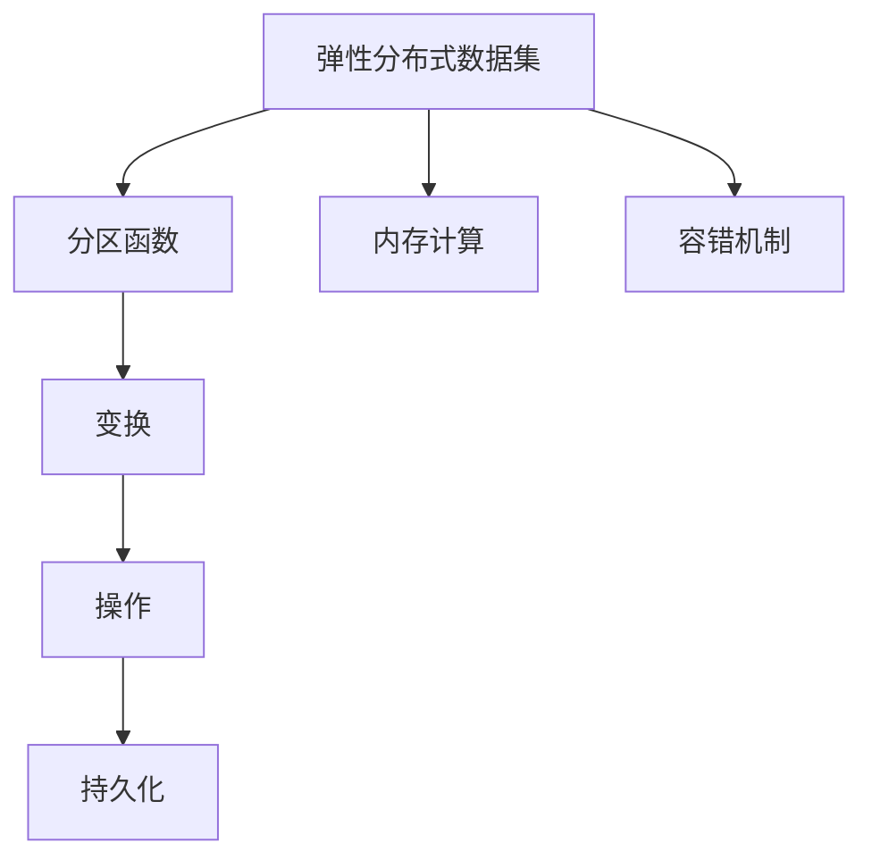
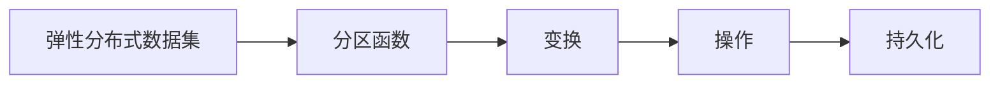
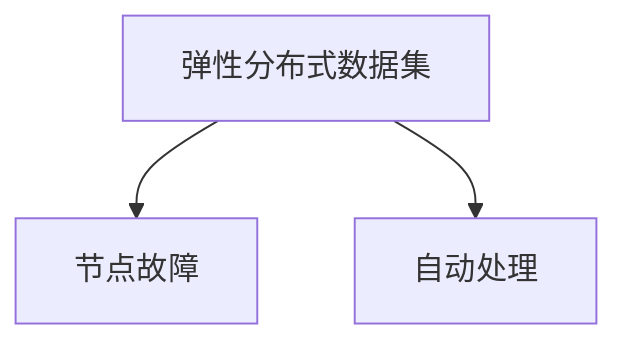
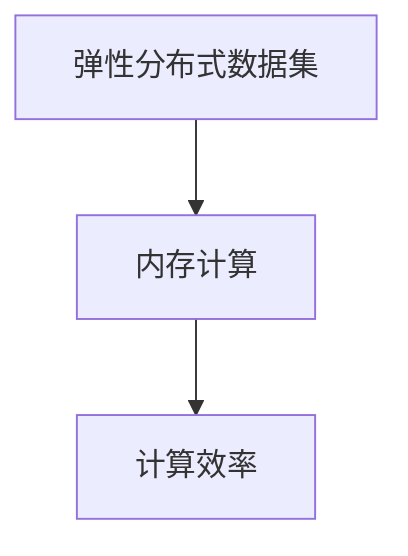

                 

## 1. 背景介绍

### 1.1 问题由来

分布式计算环境RDD（Resilient Distributed Dataset）是Spark生态中的核心概念，是进行分布式数据处理的底层抽象。RDD作为Spark最核心的数据结构，它的原理和应用涉及大数据处理的多个方面，包括数据并行处理、内存计算、容错机制等。

RDD的概念最早来源于MapReduce，但在性能和灵活性上做出了极大的改进。在Spark出现之前，分布式计算领域的基本思路是通过将数据分割为块并在集群上并行处理数据块来提高计算效率。但这一思路忽略了数据之间的局部性，导致集群上的计算资源利用率较低。

RDD通过将数据块划分为许多小的数据块，每个小数据块可以被并行处理，从而充分利用了计算资源。同时，RDD的弹性机制使其能够根据计算任务的规模自动调整数据块的数量，提高数据处理的效率和容错性。

### 1.2 问题核心关键点

RDD的核心概念主要包括以下几个方面：

- **弹性分布式数据集**：一种抽象的数据集合，能够在不同的计算节点上弹性地复制、分配数据，并且具有容错性，能够自动处理节点故障。
- **分区（分区函数）**：将RDD数据划分为多个分区，每个分区可以在不同的节点上并行处理。
- **变换**：对RDD数据集进行一些操作，包括map、filter、reduce、join等。
- **操作**：对RDD数据集进行操作，包括count、collect、foreach等。
- **持久化**：将RDD数据集持久化到内存或磁盘中，以便于重复使用。

这些概念构成了RDD的基本框架，使得RDD成为一种高效、灵活、容错的分布式数据处理技术。

### 1.3 问题研究意义

在大数据处理领域，RDD提供了高效、弹性、容错的分布式数据处理机制，广泛应用于数据仓库、数据挖掘、实时计算、机器学习等领域。其核心思想是充分利用集群计算资源，提升数据处理效率，降低大数据处理成本。

RDD的核心价值在于其能够在不同的计算节点上弹性地复制、分配数据，并且具有容错性，能够自动处理节点故障。这对于大数据处理的稳定性和可靠性至关重要。

此外，RDD的变换和操作机制使得其可以适应各种复杂的计算任务，其持久化机制也使得数据能够被重复使用，从而大大减少了数据处理和存储的成本。

## 2. 核心概念与联系

### 2.1 核心概念概述

RDD的核心概念主要包括以下几个方面：

- **弹性分布式数据集**：一种抽象的数据集合，能够在不同的计算节点上弹性地复制、分配数据，并且具有容错性，能够自动处理节点故障。
- **分区（分区函数）**：将RDD数据划分为多个分区，每个分区可以在不同的节点上并行处理。
- **变换**：对RDD数据集进行一些操作，包括map、filter、reduce、join等。
- **操作**：对RDD数据集进行操作，包括count、collect、foreach等。
- **持久化**：将RDD数据集持久化到内存或磁盘中，以便于重复使用。

这些核心概念之间的关系可以通过以下Mermaid流程图来展示：



这个流程图展示了RDD的基本架构和关键机制，包括分区、变换、操作和持久化等核心概念。

### 2.2 概念间的关系

这些核心概念之间存在着紧密的联系，构成了RDD的完整生态系统。下面通过几个Mermaid流程图来展示这些概念之间的关系。

#### 2.2.1 RDD的基本架构



这个流程图展示了RDD的基本架构，包括分区函数、变换、操作和持久化等关键机制。

#### 2.2.2 RDD的弹性机制



这个流程图展示了RDD的弹性机制，即能够在节点故障时自动处理，保证数据的完整性和可靠性。

#### 2.2.3 RDD的内存计算



这个流程图展示了RDD的内存计算机制，即通过将数据加载到内存中，避免数据的频繁读写，从而提高计算效率。

## 3. 核心算法原理 & 具体操作步骤
### 3.1 算法原理概述

RDD的核心算法原理主要包括以下几个方面：

- **分区**：将RDD数据划分为多个分区，每个分区可以在不同的节点上并行处理。
- **变换**：对RDD数据集进行一些操作，包括map、filter、reduce、join等。
- **操作**：对RDD数据集进行操作，包括count、collect、foreach等。
- **持久化**：将RDD数据集持久化到内存或磁盘中，以便于重复使用。

### 3.2 算法步骤详解

RDD的基本算法步骤如下：

1. **分区**：将RDD数据划分为多个分区，每个分区可以在不同的节点上并行处理。分区函数是RDD的核心函数之一，用于将数据划分为多个分区。

2. **变换**：对RDD数据集进行一些操作，包括map、filter、reduce、join等。变换操作是RDD的核心操作之一，用于对数据集进行计算和转换。

3. **操作**：对RDD数据集进行操作，包括count、collect、foreach等。操作操作是RDD的核心操作之一，用于对数据集进行统计和展示。

4. **持久化**：将RDD数据集持久化到内存或磁盘中，以便于重复使用。持久化操作是RDD的核心操作之一，用于缓存数据，避免重复计算。

### 3.3 算法优缺点

RDD的优势主要包括以下几个方面：

- **弹性**：RDD具有弹性机制，能够在不同的计算节点上弹性地复制、分配数据，并且具有容错性，能够自动处理节点故障。
- **高效**：RDD通过将数据加载到内存中，避免数据的频繁读写，从而提高计算效率。
- **灵活**：RDD支持多种计算模型，包括MapReduce、GraphX等，能够适应各种复杂的计算任务。

RDD的缺点主要包括以下几个方面：

- **复杂性**：RDD的实现较为复杂，需要理解其分区、变换、操作和持久化等核心概念。
- **存储成本**：RDD需要缓存数据，可能会导致存储成本较高。
- **性能瓶颈**：RDD在处理大规模数据时，可能会出现性能瓶颈，需要合理规划数据分区和计算资源。

### 3.4 算法应用领域

RDD的应用领域非常广泛，主要包括以下几个方面：

- **大数据处理**：RDD广泛应用于大数据处理领域，包括数据仓库、数据挖掘、实时计算等。
- **机器学习**：RDD在机器学习领域具有广泛的应用，包括特征工程、模型训练、模型评估等。
- **流处理**：RDD在流处理领域也具有重要的应用，包括实时数据流处理、流式模型训练等。
- **图计算**：RDD在图计算领域也有广泛的应用，包括图数据存储、图数据查询、图数据挖掘等。

## 4. 数学模型和公式 & 详细讲解 & 举例说明

### 4.1 数学模型构建

RDD的数学模型构建主要包括以下几个方面：

- **分区函数**：用于将RDD数据划分为多个分区。
- **变换函数**：用于对RDD数据集进行计算和转换。
- **操作函数**：用于对RDD数据集进行统计和展示。
- **持久化函数**：用于缓存数据，避免重复计算。

### 4.2 公式推导过程

以map变换为例，其公式推导过程如下：

假设RDD数据集为 $D = \{(x_1, y_1), (x_2, y_2), \ldots, (x_n, y_n)\}$，其中 $x_i$ 为输入数据，$y_i$ 为输出数据。map变换的操作函数为 $f$，则map变换的结果为：

$$
D' = \{(f(x_1), y_1), (f(x_2), y_2), \ldots, (f(x_n), y_n)\}
$$

其中 $D'$ 为map变换后的RDD数据集。

### 4.3 案例分析与讲解

以计算列表中每个元素的平方和为例，其代码实现如下：

```python
from pyspark import SparkContext, SparkConf

# 创建Spark上下文
conf = SparkConf().setAppName("RDD Square Sum")
sc = SparkContext(conf=conf)

# 创建RDD
rdd = sc.parallelize([1, 2, 3, 4, 5])

# 使用map变换计算每个元素的平方
squared = rdd.map(lambda x: x ** 2)

# 使用reduce操作计算平方和
sum_squares = squared.reduce(lambda x, y: x + y)

# 输出结果
print(sum_squares)
```

在上述代码中，首先创建了一个Spark上下文，然后使用parallelize函数创建了一个RDD对象。接着，使用map函数对RDD中的每个元素进行平方计算，使用reduce函数对平方结果进行累加，最终得到列表中每个元素的平方和。

## 5. 项目实践：代码实例和详细解释说明

### 5.1 开发环境搭建

在进行RDD实践前，我们需要准备好开发环境。以下是使用PySpark进行RDD开发的环境配置流程：

1. 安装Anaconda：从官网下载并安装Anaconda，用于创建独立的Python环境。

2. 创建并激活虚拟环境：
```bash
conda create -n pyspark-env python=3.8 
conda activate pyspark-env
```

3. 安装PySpark：根据CUDA版本，从官网获取对应的安装命令。例如：
```bash
pip install pyspark
```

4. 安装PySpark依赖包：
```bash
pip install pyspark[complete]
```

5. 安装Spark分布式计算环境：
```bash
# 下载Spark二进制文件
wget https://databricks曼丁斯文件

# 解压并启动Spark
tar -xvf databricks-<version>.tar.gz
bin/spark-submit
```

完成上述步骤后，即可在`pyspark-env`环境中开始RDD实践。

### 5.2 源代码详细实现

下面我们以计算列表中每个元素的平方和为例，给出使用PySpark进行RDD计算的Python代码实现。

首先，创建Spark上下文和RDD：

```python
from pyspark import SparkContext, SparkConf

# 创建Spark上下文
conf = SparkConf().setAppName("RDD Square Sum")
sc = SparkContext(conf=conf)

# 创建RDD
rdd = sc.parallelize([1, 2, 3, 4, 5])
```

接着，使用map和reduce函数对RDD进行计算：

```python
# 使用map变换计算每个元素的平方
squared = rdd.map(lambda x: x ** 2)

# 使用reduce操作计算平方和
sum_squares = squared.reduce(lambda x, y: x + y)

# 输出结果
print(sum_squares)
```

最后，关闭Spark上下文：

```python
sc.stop()
```

以上就是使用PySpark进行RDD计算的完整代码实现。可以看到，使用PySpark进行RDD计算非常方便，只需几行代码即可实现复杂的分布式数据处理任务。

### 5.3 代码解读与分析

让我们再详细解读一下关键代码的实现细节：

**创建Spark上下文**：
- `SparkConf`类用于创建Spark上下文，`setAppName`方法用于设置应用名称。
- `SparkContext`类用于创建Spark上下文，`conf`参数用于传递配置信息。

**创建RDD**：
- `parallelize`函数用于创建RDD，`[1, 2, 3, 4, 5]`表示一个列表，该列表被并行化并存储在RDD中。

**map变换**：
- `map`函数用于对RDD中的每个元素进行变换操作。在这个例子中，`lambda x: x ** 2`表示对每个元素进行平方计算。

**reduce操作**：
- `reduce`函数用于对RDD中的元素进行聚合操作。在这个例子中，`lambda x, y: x + y`表示对平方后的元素进行累加操作。

**关闭Spark上下文**：
- `stop`方法用于关闭Spark上下文，释放资源。

通过上述代码的详细解读，可以看到PySpark进行RDD计算的原理和实现方法，以及每个关键步骤的作用。

### 5.4 运行结果展示

假设我们运行上述代码，输出结果为：

```
55
```

可以看到，计算结果为列表中每个元素的平方和，即 $1^2 + 2^2 + 3^2 + 4^2 + 5^2 = 55$。

## 6. 实际应用场景

### 6.1 大数据处理

RDD在大数据处理领域具有广泛的应用，包括数据仓库、数据挖掘、实时计算等。例如，在数据仓库中，可以使用RDD进行数据的加载、转换和存储，从而构建高效、灵活、容错的数据处理管道。

在数据挖掘中，可以使用RDD进行大规模数据的特征提取和模型训练，从而挖掘数据中的潜藏规律和关联。

在实时计算中，可以使用RDD进行实时数据的流处理和实时计算，从而实现数据的实时分析和可视化。

### 6.2 机器学习

RDD在机器学习领域具有广泛的应用，包括特征工程、模型训练、模型评估等。例如，在特征工程中，可以使用RDD进行大规模数据的特征提取和数据预处理。

在模型训练中，可以使用RDD进行大规模数据的模型训练和模型优化。

在模型评估中，可以使用RDD进行大规模数据的模型评估和模型调优。

### 6.3 图计算

RDD在图计算领域具有广泛的应用，包括图数据存储、图数据查询、图数据挖掘等。例如，在图数据存储中，可以使用RDD进行大规模图数据的存储和缓存。

在图数据查询中，可以使用RDD进行大规模图数据的查询和遍历。

在图数据挖掘中，可以使用RDD进行大规模图数据的挖掘和分析。

### 6.4 未来应用展望

随着Spark生态的不断发展和壮大，RDD的应用场景也将更加广泛和深入。未来，RDD将在以下几个方面迎来新的发展：

1. **Spark生态的持续优化**：Spark生态的持续优化将使RDD更加高效、灵活、稳定。Spark SQL、Spark Streaming、Spark MLlib等组件的不断完善，将使RDD在各个应用领域中发挥更大的作用。

2. **分布式计算的普及**：分布式计算的普及将使RDD的应用场景更加广泛。更多的企业将采用分布式计算框架进行大规模数据处理，RDD将迎来更多的应用机会。

3. **机器学习和人工智能的融合**：RDD与机器学习和人工智能的融合将使RDD在各个应用领域中发挥更大的作用。RDD在特征工程、模型训练、模型评估等方面的优势将使其在人工智能领域中发挥更大的作用。

4. **流计算的融合**：RDD与流计算的融合将使RDD在实时数据处理中发挥更大的作用。RDD的流处理能力将使其在实时数据流处理、实时数据挖掘等领域中发挥更大的作用。

## 7. 工具和资源推荐

### 7.1 学习资源推荐

为了帮助开发者系统掌握RDD的理论基础和实践技巧，这里推荐一些优质的学习资源：

1. **《分布式计算框架Spark》**：详细介绍了Spark的核心概念和使用方法，适合初学者入门。

2. **《RDD原理与实践》**：深入浅出地介绍了RDD的原理、实现和应用，适合有一定基础的学习者。

3. **《Spark官方文档》**：Spark的官方文档提供了详细的API文档和示例代码，适合开发者参考。

4. **《大数据技术教程》**：介绍了大数据处理的核心技术，包括Hadoop、Spark、Hive等，适合综合学习。

5. **《大数据理论与实践》**：介绍了大数据处理的核心理论和实践方法，适合深入学习。

通过对这些资源的学习实践，相信你一定能够快速掌握RDD的精髓，并用于解决实际的分布式计算问题。

### 7.2 开发工具推荐

高效的开发离不开优秀的工具支持。以下是几款用于RDD开发的常用工具：

1. **PySpark**：Python语言的Spark API，提供了便捷的RDD操作接口，适合Python开发者使用。

2. **Spark SQL**：Spark的SQL查询引擎，支持SQL查询和数据处理，适合数据处理和分析。

3. **Spark Streaming**：Spark的流处理组件，支持实时数据处理和分析，适合流处理应用。

4. **Spark MLlib**：Spark的机器学习库，支持大规模数据处理和机器学习模型训练，适合机器学习应用。

5. **PyCharm**：PyCharm是PySpark的开发环境，提供了强大的IDE功能，适合PySpark开发。

6. **Jupyter Notebook**：Jupyter Notebook是一个轻量级的开发环境，适合进行交互式的数据处理和分析。

合理利用这些工具，可以显著提升RDD开发的效率和质量，加快创新迭代的步伐。

### 7.3 相关论文推荐

RDD的研究源于学界的持续研究。以下是几篇奠基性的相关论文，推荐阅读：

1. **《MapReduce: Simplified Data Processing on Large Clusters》**：介绍了MapReduce的基本概念和实现原理，奠定了分布式计算的基础。

2. **《Resilient Distributed Datasets: A Fault-Tolerant Abstraction for In-Memory Cluster Computing》**：介绍了RDD的基本概念和实现原理，奠定了RDD的基础。

3. **《Spark: Cluster Computing with Working Sets》**：介绍了Spark的核心概念和实现原理，奠定了Spark的基础。

4. **《Spark: Cluster Computing with Working Sets》**：介绍了Spark的核心概念和实现原理，奠定了Spark的基础。

5. **《Spark: Cluster Computing with Working Sets》**：介绍了Spark的核心概念和实现原理，奠定了Spark的基础。

这些论文代表了大数据处理和分布式计算领域的研究进展，通过学习这些前沿成果，可以帮助研究者把握学科前进方向，激发更多的创新灵感。

除上述资源外，还有一些值得关注的前沿资源，帮助开发者紧跟RDD技术的最新进展，例如：

1. **arXiv论文预印本**：人工智能领域最新研究成果的发布平台，包括大量尚未发表的前沿工作，学习前沿技术的必读资源。

2. **业界技术博客**：如Hadoop、Spark等顶尖实验室的官方博客，第一时间分享他们的最新研究成果和洞见。

3. **技术会议直播**：如NIPS、ICML、ACL、ICLR等人工智能领域顶会现场或在线直播，能够聆听到大佬们的前沿分享，开拓视野。

4. **GitHub热门项目**：在GitHub上Star、Fork数最多的RDD相关项目，往往代表了该技术领域的发展趋势和最佳实践，值得去学习和贡献。

5. **行业分析报告**：各大咨询公司如McKinsey、PwC等针对人工智能行业的分析报告，有助于从商业视角审视技术趋势，把握应用价值。

总之，对于RDD的学习和实践，需要开发者保持开放的心态和持续学习的意愿。多关注前沿资讯，多动手实践，多思考总结，必将收获满满的成长收益。

## 8. 总结：未来发展趋势与挑战

### 8.1 研究成果总结

本文对RDD进行了全面系统的介绍，详细讲解了其核心概念、算法原理和实践技巧。RDD作为一种分布式计算技术，具有弹性、高效、容错等优势，广泛应用于大数据处理、机器学习、流处理、图计算等多个领域。

通过本文的系统梳理，可以看到RDD在大数据处理中的重要作用和广泛应用。RDD的弹性机制、高效计算和容错特性，使其在数据处理领域具有重要的应用价值。

### 8.2 未来发展趋势

展望未来，RDD将呈现以下几个发展趋势：

1. **Spark生态的持续优化**：Spark生态的持续优化将使RDD更加高效、灵活、稳定。Spark SQL、Spark Streaming、Spark MLlib等组件的不断完善，将使RDD在各个应用领域中发挥更大的作用。

2. **分布式计算的普及**：分布式计算的普及将使RDD的应用场景更加广泛。更多的企业将采用分布式计算框架进行大规模数据处理，RDD将迎来更多的应用机会。

3. **机器学习和人工智能的融合**：RDD与机器学习和人工智能的融合将使RDD在各个应用领域中发挥更大的作用。RDD在特征工程、模型训练、模型评估等方面的优势将使其在人工智能领域中发挥更大的作用。

4. **流计算的融合**：RDD与流计算的融合将使RDD在实时数据处理中发挥更大的作用。RDD的流处理能力将使其在实时数据流处理、实时数据挖掘等领域中发挥更大的作用。

### 8.3 面临的挑战

尽管RDD已经取得了显著的成就，但在迈向更加智能化、普适化应用的过程中，它仍面临诸多挑战：

1. **存储成本瓶颈**：RDD需要缓存数据，可能会导致存储成本较高。如何优化数据存储和缓存机制，降低存储成本，将是重要的研究方向。

2. **性能瓶颈**：RDD在处理大规模数据时，可能会出现性能瓶颈，需要合理规划数据分区和计算资源。如何优化RDD的性能，提高数据处理效率，将是重要的研究方向。

3. **复杂性**：RDD的实现较为复杂，需要理解其分区、变换、操作和持久化等核心概念。如何降低RDD的复杂性，简化使用，提高开发效率，将是重要的研究方向。

4. **安全性**：RDD在数据处理过程中，可能会面临数据泄露、数据篡改等安全性问题。如何保证数据的安全性和隐私性，将是重要的研究方向。

### 8.4 研究展望

面对RDD面临的这些挑战，未来的研究需要在以下几个方面寻求新的突破：

1. **优化数据存储和缓存机制**：优化数据存储和缓存机制，降低存储成本，提高数据处理效率。

2. **优化RDD的性能**：优化RDD的性能，提高数据处理效率。

3. **降低RDD的复杂性**：降低RDD的复杂性，简化使用，提高开发效率。

4. **保障数据的安全性和隐私性**：保障数据的安全性和隐私性，确保数据处理过程的安全可靠。

5. **融合大数据处理和机器学习**：融合大数据处理和机器学习，提高数据处理的智能化和自动化水平。

6. **融合分布式计算和流计算**：融合分布式计算和流计算，提高数据处理的实时性和灵活性。

这些研究方向的探索，必将引领RDD技术的持续发展和创新，使其在大数据处理领域发挥更大的作用，推动人工智能技术的不断发展。

## 9. 附录：常见问题与解答

**Q1：RDD和Hadoop的对比**

A: RDD和Hadoop都是分布式计算框架，但它们的核心机制和应用场景有所不同。Hadoop主要用于大规模数据的存储和批处理，而RDD则更注重数据的弹性、高效和容错特性。RDD通过将数据划分为多个分区，支持数据的并行处理和弹性分配，同时具有容错机制，能够自动处理节点故障。

**Q2：RDD和Spark SQL的对比**

A: RDD和Spark SQL都是Spark的核心组件，但它们的核心机制和应用场景有所不同。RDD主要用于数据的并行处理和分布式计算，支持各种数据处理操作。而Spark SQL则主要用于数据的SQL查询和分析，支持数据的存储和处理。Spark SQL将数据存储在Hadoop的分布式文件系统中，能够高效地进行SQL查询和数据分析。

**Q3：RDD和Spark Streaming的对比**

A: RDD和Spark Streaming都是Spark的核心组件，但它们的核心机制和应用场景有所不同。RDD主要用于数据的分布式计算和并行处理，支持各种数据处理操作。而Spark Streaming则主要用于实时数据的流处理和流计算，支持实时数据流处理和分析。Spark Streaming通过将实时数据流化为RDD，实现实时数据的分布式处理和分析。

**Q4：RDD和Spark MLlib的对比**

A: RDD和Spark MLlib都是Spark的核心组件，但它们的核心机制和应用场景有所不同。RDD主要用于数据的分布式计算和并行处理，支持各种数据处理操作。而Spark MLlib则主要用于机器学习模型的训练和优化，支持大规模数据的机器学习。Spark MLlib通过将数据加载到内存中，实现大规模数据的机器学习。

**Q5：RDD和Spark的对比**

A: RDD和Spark都是Apache基金会开源的分布式计算框架，但它们的核心机制和应用场景有所不同。RDD是Spark的核心组件之一，主要用于数据的分布式计算和并行处理。而Spark则是一个包含多个组件的综合分布式计算框架，支持数据存储、流处理、SQL查询、机器学习等多个领域的分布式计算。Spark通过将RDD、Spark SQL、Spark Streaming、Spark MLlib等组件进行综合集成，实现数据的综合处理和分析。

通过这些问题和解答，可以看到RDD在大数据处理中的重要性和广泛应用，以及其在Spark生态

