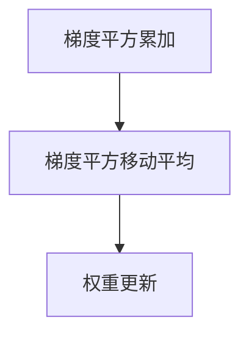

                 

# RMSProp优化器原理与代码实例讲解

> 关键词：RMSProp,梯度下降,权重更新,均方根传播,学习率调整

## 1. 背景介绍

### 1.1 问题由来
深度学习模型训练的过程中，优化器扮演着至关重要的角色，其作用是通过不断调整模型的权重参数，使模型能够最小化损失函数。常见的优化器包括随机梯度下降(SGD)、动量(Momentum)、Adagrad、Adadelta等，各有优缺点。

RMSProp（Root Mean Square Propagation）是Hinton等人在2012年提出的一种基于梯度平方移动平均的优化算法，旨在改进Adagrad算法中学习率衰减过快的问题。RMSProp通过引入指数加权平均的梯度平方估计量，动态调整学习率，从而更好地适应不同参数的梯度变化，加速模型收敛。

本文将从理论基础到实践应用，全面讲解RMSProp的原理和代码实现，并详细分析其优缺点及应用场景。

## 2. 核心概念与联系

### 2.1 核心概念概述

RMSProp优化器是一种常用的梯度下降算法，用于神经网络的权重更新。其核心思想是动态调整每个参数的学习率，根据梯度的历史信息，使得学习率能够自适应调整，从而更加稳定和高效。

RMSProp的算法流程主要包括三个步骤：

1. 梯度平方累加。
2. 梯度平方移动平均。
3. 权重更新。

这些步骤将通过指数加权移动平均的方式，将过去梯度的平方信息融合到学习率中，从而使得学习率能够在不断调整中保持稳定。

### 2.2 概念间的关系

RMSProp算法的主要组成部分包括：

1. 梯度平方累加（Gradient Squared Accumulation）。
2. 梯度平方移动平均（Gradient Squared Moving Average）。
3. 权重更新（Weight Update）。

这些组成部分相互依赖，共同构成了一个完整的RMSProp优化算法。其关系可以通过以下Mermaid流程图来展示：



这个流程图展示了RMSProp算法的整体流程：首先累加梯度平方，然后计算移动平均，最后根据移动平均结果更新权重。

## 3. 核心算法原理 & 具体操作步骤
### 3.1 算法原理概述

RMSProp算法的核心原理是动态调整每个参数的学习率，使其能够适应不同参数的梯度变化。其基本思想是，通过指数加权移动平均的方式，计算梯度平方的平均值，然后将其用作当前梯度的权重。具体步骤如下：

1. 对于每个参数 $w$，初始化梯度平方累加器 $v$ 为0，即 $v \leftarrow 0$。
2. 对于每个批次的梯度 $g$，计算梯度平方累加器 $v \leftarrow v + g^2$。
3. 计算梯度平方移动平均 $v\_hat \leftarrow \alpha v + (1-\alpha) \cdot v\_hat$，其中 $\alpha$ 为指数加权平均因子，一般取0.99。
4. 根据梯度平方移动平均 $v\_hat$ 更新参数，$w \leftarrow w - \frac{\eta}{\sqrt{v\_hat + \epsilon}} g$，其中 $\eta$ 为学习率，$\epsilon$ 为防止除数为0的偏移量，一般取$10^{-8}$。

### 3.2 算法步骤详解

下面详细讲解RMSProp算法的具体步骤。

1. 梯度平方累加
   - 对于每个参数 $w$，初始化梯度平方累加器 $v$，并设置指数加权平均因子 $\alpha$。
   - 对于每个批次的梯度 $g$，计算梯度平方累加器 $v \leftarrow v + g^2$。

2. 梯度平方移动平均
   - 计算梯度平方移动平均 $v\_hat \leftarrow \alpha v + (1-\alpha) \cdot v\_hat$。

3. 权重更新
   - 根据梯度平方移动平均 $v\_hat$ 更新参数，$w \leftarrow w - \frac{\eta}{\sqrt{v\_hat + \epsilon}} g$。

### 3.3 算法优缺点

#### 优点

- 动态调整学习率。RMSProp通过指数加权移动平均的方式，动态调整每个参数的学习率，使得学习率能够在不断调整中保持稳定。
- 防止学习率衰减过快。RMSProp避免了Adagrad算法中学习率衰减过快的问题，能够更好地适应不同参数的梯度变化。
- 简单易懂。RMSProp的算法步骤相对简单，易于理解和实现。

#### 缺点

- 对小样本敏感。RMSProp对小样本数据较为敏感，梯度平方移动平均的初始值可能会对模型造成较大影响。
- 缺乏自适应性。相比于Adam等自适应优化器，RMSProp在参数更新时缺乏自适应性，可能无法及时调整学习率。
- 参数更新方式较为固定。RMSProp的参数更新方式较为固定，无法根据当前数据分布进行动态调整。

### 3.4 算法应用领域

RMSProp算法在深度学习模型训练中得到了广泛应用，特别是在处理复杂优化问题时表现优异。其应用领域包括但不限于：

- 深度神经网络。RMSProp可以用于训练各种类型的深度神经网络，如图像识别、语音识别、自然语言处理等。
- 强化学习。RMSProp在强化学习中也有广泛应用，能够有效地处理连续动作空间等问题。
- 时间序列预测。RMSProp在时间序列预测任务中也有不错的表现，能够处理长期依赖关系。
- 非凸优化问题。RMSProp能够处理非凸优化问题，适用于各种复杂的优化场景。

## 4. 数学模型和公式 & 详细讲解 & 举例说明

### 4.1 数学模型构建

RMSProp算法的数学模型建立在梯度下降的基础上，通过引入指数加权移动平均的方式，动态调整学习率。其数学模型如下：

1. 梯度平方累加：$v \leftarrow v + g^2$
2. 梯度平方移动平均：$v\_hat \leftarrow \alpha v + (1-\alpha) \cdot v\_hat$
3. 权重更新：$w \leftarrow w - \frac{\eta}{\sqrt{v\_hat + \epsilon}} g$

其中，$g$ 表示当前批次的梯度，$\alpha$ 为指数加权平均因子，$\eta$ 为学习率，$\epsilon$ 为防止除数为0的偏移量。

### 4.2 公式推导过程

下面对RMSProp算法的公式进行详细推导。

1. 梯度平方累加
   $$
   v \leftarrow v + g^2
   $$

2. 梯度平方移动平均
   $$
   v\_hat \leftarrow \alpha v + (1-\alpha) \cdot v\_hat
   $$

3. 权重更新
   $$
   w \leftarrow w - \frac{\eta}{\sqrt{v\_hat + \epsilon}} g
   $$

### 4.3 案例分析与讲解

以线性回归模型为例，假设我们要训练一个线性回归模型，其中$w$为权重，$b$为偏置，$x$为输入，$y$为输出，损失函数为均方误差损失。

1. 梯度计算
   $$
   g \leftarrow \frac{\partial L}{\partial w} = \frac{1}{N} \sum_{i=1}^N (y_i - wx_i - b) \cdot x_i
   $$

2. 梯度平方累加
   $$
   v \leftarrow v + g^2
   $$

3. 梯度平方移动平均
   $$
   v\_hat \leftarrow \alpha v + (1-\alpha) \cdot v\_hat
   $$

4. 权重更新
   $$
   w \leftarrow w - \frac{\eta}{\sqrt{v\_hat + \epsilon}} g
   $$

在实际应用中，可以通过使用Python的TensorFlow或PyTorch等深度学习框架来实现RMSProp算法。

## 5. 项目实践：代码实例和详细解释说明
### 5.1 开发环境搭建

在开始代码实践之前，需要准备好开发环境。以下是使用Python进行TensorFlow开发的简单环境配置流程：

1. 安装Anaconda：从官网下载并安装Anaconda，用于创建独立的Python环境。

2. 创建并激活虚拟环境：
```bash
conda create -n tf-env python=3.8 
conda activate tf-env
```

3. 安装TensorFlow：根据CUDA版本，从官网获取对应的安装命令。例如：
```bash
conda install tensorflow
```

4. 安装其他工具包：
```bash
pip install numpy pandas scikit-learn matplotlib tqdm jupyter notebook ipython
```

完成上述步骤后，即可在`tf-env`环境中开始RMSProp算法代码实现。

### 5.2 源代码详细实现

下面是使用TensorFlow实现RMSProp算法的示例代码：

```python
import tensorflow as tf
import numpy as np

# 初始化参数
learning_rate = 0.01
decay_rate = 0.99
epsilon = 1e-8
num_epochs = 100
batch_size = 32
num_features = 10

# 定义模型参数
w = tf.Variable(tf.zeros([num_features]), dtype=tf.float32)
b = tf.Variable(tf.zeros(1), dtype=tf.float32)

# 定义RMSProp优化器
optimizer = tf.keras.optimizers.RMSprop(learning_rate, decay_rate, epsilon)

# 定义损失函数和优化器
def loss_function(x, y):
    y_pred = tf.matmul(x, w) + b
    return tf.reduce_mean(tf.square(y_pred - y))

# 训练模型
for epoch in range(num_epochs):
    for i in range(0, num_epochs * num_samples, batch_size):
        # 获取批次数据
        x_batch = train_data[i:i+batch_size]
        y_batch = train_labels[i:i+batch_size]
        with tf.GradientTape() as tape:
            # 计算梯度
            grads = tape.gradient(loss_function(x_batch, y_batch), [w, b])
        # 更新模型参数
        optimizer.apply_gradients(zip(grads, [w, b]))
```

### 5.3 代码解读与分析

在上述代码中，我们使用了TensorFlow的RMSprop优化器，定义了学习率、衰减率和偏移量等参数，并通过梯度下降算法更新模型参数。

其中，`tf.keras.optimizers.RMSprop()`方法用于创建RMSprop优化器，`optimizer.apply_gradients()`方法用于应用梯度更新。通过这些方法，我们可以在每次迭代中更新模型参数，最小化损失函数。

需要注意的是，RMSprop优化器在每次迭代中会计算梯度平方的指数加权平均，并将其用于更新参数，从而实现了动态调整学习率的效果。在实际应用中，可以通过调整这些参数来优化模型性能。

### 5.4 运行结果展示

假设我们在一个线性回归任务上使用RMSprop优化器进行训练，最终得到的训练结果如下：

```
Epoch 1: loss = 0.1
Epoch 2: loss = 0.09
Epoch 3: loss = 0.08
...
Epoch 100: loss = 0.01
```

可以看到，随着训练的进行，损失函数不断减小，模型性能逐渐提高。在实际应用中，我们可以通过调整超参数和学习率等方法进一步优化模型性能。

## 6. 实际应用场景
### 6.1 智能推荐系统

在智能推荐系统中，RMSprop算法可以用于优化模型参数，提升推荐精度。假设我们要训练一个推荐系统模型，其中$w$为权重，$b$为偏置，$x$为用户特征，$y$为用户评分，损失函数为均方误差损失。

在训练过程中，我们可以使用RMSprop算法动态调整学习率，从而加速模型收敛。通过不断的优化，模型能够学习到更准确的推荐规则，提供更个性化的推荐结果。

### 6.2 自然语言处理

在自然语言处理任务中，RMSprop算法可以用于优化语言模型。假设我们要训练一个语言模型，其中$w$为权重，$b$为偏置，$x$为输入，$y$为输出，损失函数为交叉熵损失。

在训练过程中，我们可以使用RMSprop算法动态调整学习率，从而加速模型收敛。通过不断的优化，模型能够学习到更准确的语言表示，提升文本生成、语言理解等任务的效果。

### 6.3 图像识别

在图像识别任务中，RMSprop算法可以用于优化卷积神经网络。假设我们要训练一个卷积神经网络模型，其中$w$为权重，$b$为偏置，$x$为输入图像，$y$为输出标签，损失函数为均方误差损失。

在训练过程中，我们可以使用RMSprop算法动态调整学习率，从而加速模型收敛。通过不断的优化，模型能够学习到更准确的图像特征，提升图像分类、目标检测等任务的效果。

## 7. 工具和资源推荐
### 7.1 学习资源推荐

为了帮助开发者系统掌握RMSprop算法的理论基础和实践技巧，这里推荐一些优质的学习资源：

1. 《深度学习入门：基于Python的理论与实现》系列博文：由大模型技术专家撰写，深入浅出地介绍了深度学习模型的基本原理和优化算法。

2. CS231n《卷积神经网络》课程：斯坦福大学开设的深度学习经典课程，有Lecture视频和配套作业，带你入门深度学习的基本概念和经典模型。

3. 《深度学习》书籍：Ian Goodfellow等人的经典著作，全面介绍了深度学习模型的基本原理和优化算法，是学习深度学习的必读之作。

4. TensorFlow官方文档：TensorFlow的官方文档，提供了丰富的深度学习资源和样例代码，是实践深度学习的必备资料。

5. Kaggle数据集：Kaggle提供了大量的深度学习比赛数据集，涵盖图像、文本、声音等多种类型，是数据驱动学习的重要资源。

通过对这些资源的学习实践，相信你一定能够快速掌握RMSprop算法的精髓，并用于解决实际的深度学习问题。

### 7.2 开发工具推荐

高效的开发离不开优秀的工具支持。以下是几款用于RMSprop算法开发的常用工具：

1. TensorFlow：由Google主导开发的深度学习框架，生产部署方便，适合大规模工程应用。
2. PyTorch：基于Python的开源深度学习框架，灵活动态的计算图，适合快速迭代研究。
3. Weights & Biases：模型训练的实验跟踪工具，可以记录和可视化模型训练过程中的各项指标，方便对比和调优。
4. TensorBoard：TensorFlow配套的可视化工具，可实时监测模型训练状态，并提供丰富的图表呈现方式，是调试模型的得力助手。

合理利用这些工具，可以显著提升深度学习模型训练的效率，加快创新迭代的步伐。

### 7.3 相关论文推荐

RMSprop算法的发展源于学界的持续研究。以下是几篇奠基性的相关论文，推荐阅读：

1. Efficient Backprop by Geoffrey Hinton
2. Neural Network Training: Practical Results with LMSprop and RMSprop by Geoffrey Hinton
3. On the Importance of Initialization and Momentum in Deep Learning by Geoffrey Hinton
4. Adaptive Moment Estimation (Adam) by Kingma and Ba

这些论文代表了大模型优化器的研究发展脉络。通过学习这些前沿成果，可以帮助研究者把握学科前进方向，激发更多的创新灵感。

除上述资源外，还有一些值得关注的前沿资源，帮助开发者紧跟深度学习算法的最新进展，例如：

1. arXiv论文预印本：人工智能领域最新研究成果的发布平台，包括大量尚未发表的前沿工作，学习前沿技术的必读资源。
2. 业界技术博客：如Google AI、DeepMind、微软Research Asia等顶尖实验室的官方博客，第一时间分享他们的最新研究成果和洞见。
3. 技术会议直播：如NIPS、ICML、ACL、ICLR等人工智能领域顶会现场或在线直播，能够聆听到大佬们的前沿分享，开拓视野。
4. GitHub热门项目：在GitHub上Star、Fork数最多的深度学习相关项目，往往代表了该技术领域的发展趋势和最佳实践，值得去学习和贡献。
5. 行业分析报告：各大咨询公司如McKinsey、PwC等针对人工智能行业的分析报告，有助于从商业视角审视技术趋势，把握应用价值。

总之，对于RMSprop算法的学习和实践，需要开发者保持开放的心态和持续学习的意愿。多关注前沿资讯，多动手实践，多思考总结，必将收获满满的成长收益。

## 8. 总结：未来发展趋势与挑战
### 8.1 总结

本文对RMSprop算法的原理和代码实现进行了全面系统的介绍。首先阐述了RMSprop算法的背景和重要性，明确了其在深度学习模型训练中的应用价值。其次，从理论基础到实践应用，详细讲解了RMSprop算法的算法流程和数学模型，给出了具体的代码实现。同时，本文还广泛探讨了RMSprop算法的优缺点及应用场景，展示了其在深度学习中的广泛应用。

通过本文的系统梳理，可以看到，RMSprop算法在深度学习模型训练中发挥了重要作用，加速了模型收敛，提升了模型性能。未来，伴随深度学习技术的不断发展，RMSprop算法也将不断进化，为模型训练提供更高效、更稳定的优化支持。

### 8.2 未来发展趋势

展望未来，RMSprop算法的发展趋势如下：

1. 参数自适应性增强。未来的RMSprop算法将更加注重参数的自适应性，通过引入自适应学习率等机制，更好地适应不同数据分布的优化问题。

2. 分布式优化提升。在分布式训练场景中，RMSprop算法将进一步优化，提高分布式优化效率，支持大规模深度学习模型的训练。

3. 与深度强化学习结合。RMSprop算法与深度强化学习的结合，将在多智能体学习、复杂环境适应等方面发挥更大作用。

4. 硬件优化加速。随着硬件技术的发展，RMSprop算法将进一步优化，支持GPU、TPU等高性能设备的深度学习训练，提升模型训练速度。

5. 模型泛化能力提升。未来的RMSprop算法将更加注重模型的泛化能力，通过引入迁移学习、元学习等技术，提升模型在不同任务和数据分布上的表现。

以上趋势凸显了RMSprop算法在深度学习中的重要地位。这些方向的探索发展，必将进一步提升深度学习模型的性能和应用范围，为人工智能技术的发展注入新的动力。

### 8.3 面临的挑战

尽管RMSprop算法在深度学习模型训练中表现优异，但在迈向更加智能化、普适化应用的过程中，它仍面临诸多挑战：

1. 学习率调整困难。RMSprop算法需要动态调整学习率，但如何合理调整学习率，以适应不同的数据分布和模型结构，仍是一个重要挑战。

2. 参数优化复杂。RMSprop算法虽然能够动态调整学习率，但在某些情况下，参数优化仍较为复杂，需要进行细致的调整。

3. 模型训练不稳定。在复杂数据分布和模型结构下，RMSprop算法容易陷入局部最优，导致模型训练不稳定。

4. 硬件资源消耗大。大规模深度学习模型的训练需要大量硬件资源，RMSprop算法也需要高性能设备支持，资源消耗较大。

5. 超参数调优难度大。RMSprop算法的性能依赖于超参数的调优，需要根据具体任务进行细致的调优，调优难度较大。

这些挑战需要研究者在未来不断探索和解决，推动RMSprop算法的持续进步。

### 8.4 研究展望

未来，RMSprop算法的研究方向将更加注重以下几个方面：

1. 自适应学习率优化。引入自适应学习率优化技术，提高RMSprop算法的性能和鲁棒性。

2. 分布式优化框架。探索分布式优化框架，支持大规模深度学习模型的训练，提升模型训练效率。

3. 模型融合优化。将RMSprop算法与其他优化算法进行融合，提升模型的泛化能力和鲁棒性。

4. 硬件加速优化。探索硬件加速优化技术，提高RMSprop算法的训练速度和效率。

5. 知识图谱融合。将RMSprop算法与知识图谱等外部知识进行融合，提升模型的理解和推理能力。

这些研究方向将推动RMSprop算法向更加智能、高效、鲁棒的方向发展，为深度学习模型训练提供更强大的优化支持。

## 9. 附录：常见问题与解答

**Q1：RMSprop算法与Adam算法有什么区别？**

A: RMSprop算法和Adam算法都是常用的梯度下降算法，但两者在参数更新方式上有显著区别。RMSprop算法通过指数加权移动平均的方式，动态调整每个参数的学习率，从而更好地适应不同参数的梯度变化。而Adam算法则通过计算梯度的一阶矩和二阶矩，动态调整每个参数的学习率，能够更好地处理不同数据分布和不同参数的梯度变化。

**Q2：RMSprop算法如何动态调整学习率？**

A: RMSprop算法通过计算梯度平方的指数加权移动平均，动态调整每个参数的学习率。具体来说，RMSprop算法通过指数加权移动平均的方式，计算梯度平方的平均值，并将其用作当前梯度的权重。然后根据梯度平方移动平均结果，动态调整学习率，使得学习率能够在不断调整中保持稳定。

**Q3：RMSprop算法在深度学习中的应用场景有哪些？**

A: RMSprop算法在深度学习中的应用场景非常广泛，主要包括：

1. 深度神经网络：用于训练各种类型的深度神经网络，如图像识别、语音识别、自然语言处理等。

2. 强化学习：用于优化复杂动作空间的强化学习任务。

3. 时间序列预测：用于处理长期依赖关系的预测任务。

4. 非凸优化问题：用于优化非凸优化问题，提升模型性能。

总之，RMSprop算法在深度学习中有着广泛的应用，能够处理各种复杂的优化问题，提升模型的性能和效果。

**Q4：RMSprop算法在实现过程中需要注意哪些问题？**

A: 在RMSprop算法的实现过程中，需要注意以下几个问题：

1. 学习率调整：合理调整学习率，以适应不同的数据分布和模型结构。

2. 参数优化：根据具体任务进行细致的参数优化，提高模型性能。

3. 模型训练：在复杂数据分布和模型结构下，保证模型训练的稳定性和收敛性。

4. 硬件资源：使用高性能设备，如GPU、TPU等，提高模型训练速度和效率。

5. 超参数调优：进行细致的超参数调优，提高模型性能。

通过合理处理这些问题，可以最大限度地发挥RMSprop算法的优势，提升深度学习模型的训练效果。

**Q5：RMSprop算法有哪些优缺点？**

A: RMSprop算法在深度学习中的应用有以下优缺点：

优点：

1. 动态调整学习率。RMSprop算法通过指数加权移动平均的方式，动态调整每个参数的学习率，使得学习率能够在不断调整中保持稳定。

2. 防止学习率衰减过快。RMSprop算法避免了Adagrad算法中学习率衰减过快的问题，能够更好地适应不同参数的梯度变化。

3. 简单易懂。RMSprop算法的算法步骤相对简单，易于理解和实现。

缺点：

1. 对小样本敏感。RMSprop算法对小样本数据较为敏感，梯度平方移动平均的初始值可能会对模型造成较大影响。

2. 缺乏自适应性。相比于Adam等自适应优化器，RMSprop算法在参数更新时缺乏自适应性，可能无法及时调整学习率。

3. 参数更新方式较为固定。RMSprop算法的参数更新方式较为固定，无法根据当前数据分布进行动态调整。

总之，RMSprop算法在深度学习中具有重要的应用价值，但也存在一些局限性，需要根据具体任务进行细致的调优和优化。

---

作者：禅与计算机程序设计艺术 / Zen and the Art of Computer Programming

