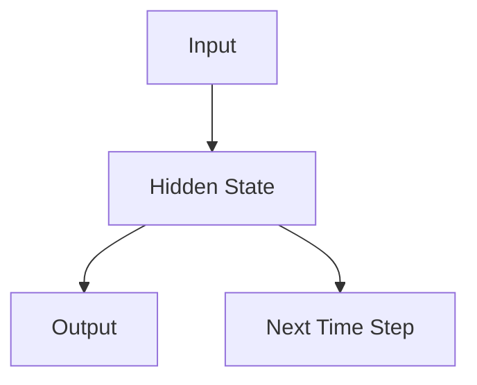
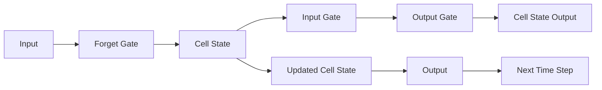
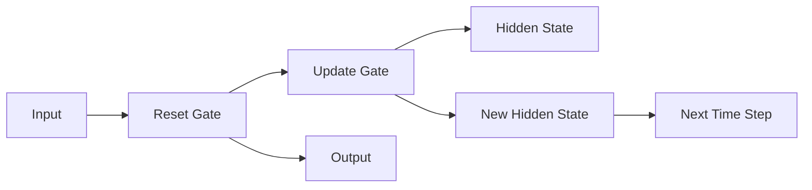
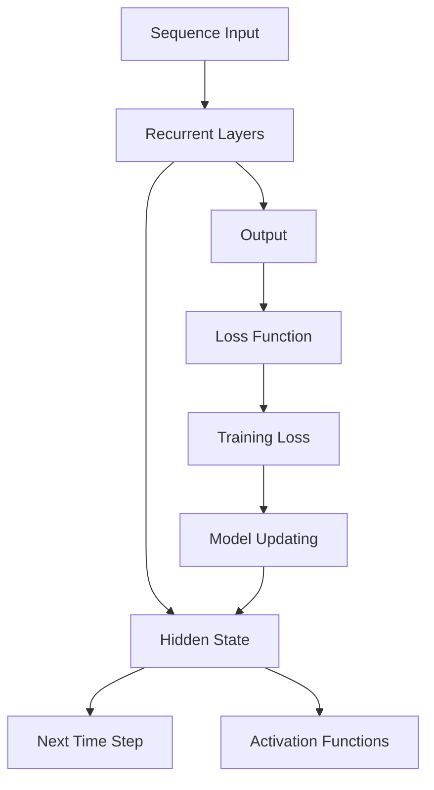

                 

# Recurrent Neural Networks (RNN) 原理与代码实战案例讲解

> 关键词：Recurrent Neural Networks (RNN), Long Short-Term Memory (LSTM), Gated Recurrent Unit (GRU), Vanishing Gradient, Activation Functions

## 1. 背景介绍

### 1.1 问题由来
传统的神经网络是基于前馈结构的，每个时间步的输出仅依赖于该步的输入，无法处理序列数据，如自然语言文本、时间序列等。为了处理这些序列数据，科学家们引入了递归神经网络（RNN），允许网络在处理当前输入时考虑之前的时间步，构建起一个时序的模型结构。

RNN的应用场景非常广泛，包括语言建模、机器翻译、语音识别、情感分析、视频分类等。在深度学习领域，RNN被认为是解决序列问题的基础。

### 1.2 问题核心关键点
RNN的核心思想是利用隐藏状态（Hidden State）记录之前的时间步信息，并将其作为当前时间步的输入，形成时序信息循环。其主要缺点包括梯度消失问题（Vanishing Gradient）、训练速度慢、内存消耗大等。为了克服这些问题，学者们又提出了长短时记忆网络（LSTM）和门控循环单元（GRU）等改进模型。

## 2. 核心概念与联系

### 2.1 核心概念概述

为更好地理解RNN的原理和架构，本节将介绍几个密切相关的核心概念：

- 递归神经网络（Recurrent Neural Networks, RNN）：基于递归思想构建的神经网络，能够处理序列数据，通过隐藏状态记录时序信息。

- 长短时记忆网络（Long Short-Term Memory, LSTM）：RNN的改进版，通过引入“记忆单元”和“门控机制”，解决了梯度消失问题，更适合处理长序列数据。

- 门控循环单元（Gated Recurrent Unit, GRU）：LSTM的简化版，保留了LSTM的优点，同时减少了计算复杂度和参数量。

- 梯度消失问题（Vanishing Gradient Problem）：在RNN中，由于隐藏状态与时间步的指数级相关，在反向传播时梯度会逐层减弱，导致长序列学习困难。

- 激活函数（Activation Functions）：RNN和LSTM中常用的非线性变换函数，如sigmoid、tanh、ReLU等。

- 门控机制（Gate Mechanisms）：LSTM和GRU中的重要组成部分，通过引入“遗忘门”、“输入门”、“输出门”等，控制信息的流动，增强模型对长序列的处理能力。

这些核心概念之间的逻辑关系可以通过以下Mermaid流程图来展示：

```mermaid
graph LR
    A[Recurrent Neural Networks] --> B[Long Short-Term Memory (LSTM)]
    A --> C[Gated Recurrent Unit (GRU)]
    B --> D[Vanishing Gradient Problem]
    C --> D
    A --> E[Activation Functions]
    E --> F[Forward Propagation]
    F --> G[Backward Propagation]
```

这个流程图展示了RNN、LSTM和GRU之间的联系和区别：

1. RNN是基础模型，通过隐藏状态捕捉序列信息。
2. LSTM和GRU是RNN的改进版本，引入了门控机制，解决了梯度消失问题。
3. 激活函数用于非线性变换，增强模型表达能力。
4. 前向传播和反向传播是RNN模型的两个关键过程。

### 2.2 概念间的关系

这些核心概念之间存在着紧密的联系，形成了RNN的完整生态系统。下面我们通过几个Mermaid流程图来展示这些概念之间的关系。

#### 2.2.1 RNN的核心结构



这个流程图展示了RNN的核心结构：

1. 输入数据作为当前时间步的输入。
2. 隐藏状态将之前的信息传递给当前时间步。
3. 当前时间步的输出依赖于当前输入和隐藏状态。

#### 2.2.2 LSTM的记忆单元结构



这个流程图展示了LSTM的记忆单元结构：

1. 输入门和遗忘门控制信息的流向，决定是否更新细胞状态。
2. 细胞状态用于记录长序列信息，门控机制可以控制信息的遗忘和输入。
3. 输出门控制当前时间步的输出，决定信息如何流向下一时间步。

#### 2.2.3 GRU的门控结构



这个流程图展示了GRU的门控结构：

1. 重置门和更新门控制信息的流向，决定隐藏状态的更新方式。
2. 隐藏状态用于记录当前时间步的信息，门控机制可以控制信息的遗忘和更新。
3. 输出门控制当前时间步的输出，决定信息如何流向下一时间步。

### 2.3 核心概念的整体架构

最后，我们用一个综合的流程图来展示这些核心概念在大语言模型微调过程中的整体架构：



这个综合流程图展示了从序列输入到模型输出的完整过程：

1. 序列输入作为RNN的输入。
2. RNN层通过隐藏状态捕捉序列信息，并在内部进行激活函数变换。
3. 输出层对隐藏状态进行预测，生成模型输出。
4. 损失函数计算预测与真实标签的差异。
5. 训练损失用于更新模型参数。
6. 模型更新后重新计算隐藏状态，继续处理下一个时间步。

通过这些流程图，我们可以更清晰地理解RNN的内部结构和工作原理，为后续深入讨论具体的RNN实现方法奠定基础。

## 3. 核心算法原理 & 具体操作步骤
### 3.1 算法原理概述

递归神经网络（RNN）是一种基于递归思想构建的神经网络，能够处理序列数据。其主要原理如下：

1. 输入数据 $x_t$ 作为当前时间步的输入。
2. 隐藏状态 $h_t$ 将之前的时间步信息传递给当前时间步。
3. 当前时间步的输出 $o_t$ 依赖于当前输入和隐藏状态。

RNN的数学模型可以表示为：

$$
h_t = f(h_{t-1}, x_t) \\
o_t = g(h_t)
$$

其中 $h_t$ 为隐藏状态，$x_t$ 为当前时间步的输入，$f$ 为激活函数，$o_t$ 为当前时间步的输出。

RNN的递归关系使得网络能够捕捉时间步之间的依赖关系，但存在梯度消失问题，导致长序列训练困难。为了克服这一问题，LSTM和GRU应运而生。

### 3.2 算法步骤详解

RNN的训练步骤如下：

1. **前向传播**：将输入数据 $x_t$ 依次通过每个时间步的RNN层，计算出每个时间步的隐藏状态 $h_t$ 和输出 $o_t$。

2. **计算损失**：将模型输出 $o_t$ 与真实标签 $y_t$ 进行比较，计算损失函数 $L$。

3. **反向传播**：通过链式法则计算损失函数对模型参数的梯度，并使用优化器更新参数。

4. **重复训练**：重复上述过程，直至模型收敛或达到预设迭代次数。

LSTM和GRU的训练过程类似，但引入了门控机制来控制信息的流动，增强了对长序列的处理能力。

### 3.3 算法优缺点

RNN的优点包括：

1. 能够处理序列数据，捕捉时间步之间的依赖关系。
2. 结构简单，易于实现。

RNN的缺点包括：

1. 梯度消失问题，导致长序列训练困难。
2. 计算复杂度高，内存消耗大。

LSTM和GRU通过引入门控机制，解决了梯度消失问题，增强了对长序列的处理能力，但计算复杂度和参数量增加。

### 3.4 算法应用领域

RNN在NLP领域的应用非常广泛，包括：

1. 语言建模：预测下一个词的概率，生成自然语言文本。
2. 机器翻译：将一种语言翻译成另一种语言。
3. 语音识别：将语音信号转换成文本。
4. 情感分析：分析文本中的情感倾向。
5. 视频分类：根据视频帧序列分类视频内容。

此外，RNN还被应用于推荐系统、时间序列预测、游戏AI等许多领域。

## 4. 数学模型和公式 & 详细讲解
### 4.1 数学模型构建

RNN的数学模型可以表示为：

$$
h_t = f(h_{t-1}, x_t) \\
o_t = g(h_t)
$$

其中 $h_t$ 为隐藏状态，$x_t$ 为当前时间步的输入，$f$ 为激活函数，$o_t$ 为当前时间步的输出。

在实际应用中，RNN通常用于序列分类、序列回归、生成任务等，因此需要构建相应的任务适配层。

以文本分类为例，RNN的输入为词向量序列 $x_t = [w_1, w_2, ..., w_T]$，输出为类别概率 $p(y|x)$。任务适配层通常包括softmax层和交叉熵损失函数。

### 4.2 公式推导过程

RNN的前向传播过程可以表示为：

$$
h_0 = h_0 \\
h_t = f(h_{t-1}, x_t)
$$

其中 $h_0$ 为初始隐藏状态，$x_t$ 为当前时间步的输入，$f$ 为激活函数。

RNN的激活函数通常为sigmoid函数或tanh函数，公式如下：

$$
\sigma(z) = \frac{1}{1 + e^{-z}} \\
\tanh(z) = \frac{e^z - e^{-z}}{e^z + e^{-z}}
$$

RNN的反向传播过程通过链式法则计算损失函数对模型参数的梯度，公式如下：

$$
\frac{\partial L}{\partial w} = \frac{\partial L}{\partial h_t} \frac{\partial h_t}{\partial w}
$$

其中 $w$ 为模型参数，$h_t$ 为隐藏状态。

### 4.3 案例分析与讲解

以语言模型为例，RNN的前向传播和反向传播过程如下：

前向传播：

$$
h_0 = h_0 \\
h_t = f(h_{t-1}, x_t)
$$

反向传播：

$$
\frac{\partial L}{\partial w} = \frac{\partial L}{\partial o_t} \frac{\partial o_t}{\partial h_t} \frac{\partial h_t}{\partial h_{t-1}} \frac{\partial h_{t-1}}{\partial h_{t-2}} \cdots \frac{\partial h_1}{\partial h_0} \frac{\partial h_0}{\partial w}
$$

其中 $L$ 为损失函数，$o_t$ 为当前时间步的输出，$h_t$ 为隐藏状态。

## 5. 项目实践：代码实例和详细解释说明
### 5.1 开发环境搭建

在进行RNN实践前，我们需要准备好开发环境。以下是使用Python进行PyTorch开发的环境配置流程：

1. 安装Anaconda：从官网下载并安装Anaconda，用于创建独立的Python环境。

2. 创建并激活虚拟环境：
```bash
conda create -n pytorch-env python=3.8 
conda activate pytorch-env
```

3. 安装PyTorch：根据CUDA版本，从官网获取对应的安装命令。例如：
```bash
conda install pytorch torchvision torchaudio cudatoolkit=11.1 -c pytorch -c conda-forge
```

4. 安装TensorFlow：
```bash
pip install tensorflow
```

5. 安装TensorFlow，并下载数据集：
```bash
pip install tensorflow tensorflow_datasets
```

6. 安装transformers库：
```bash
pip install transformers
```

7. 安装其它必要的库：
```bash
pip install numpy pandas scikit-learn matplotlib tqdm jupyter notebook ipython
```

完成上述步骤后，即可在`pytorch-env`环境中开始RNN实践。

### 5.2 源代码详细实现

下面我们以时间序列预测为例，给出使用PyTorch对RNN进行训练的代码实现。

首先，定义数据处理函数：

```python
import torch
import numpy as np
from torch.utils.data import Dataset, DataLoader
import torch.nn.functional as F

class TimeSeriesDataset(Dataset):
    def __init__(self, data, seq_length=1):
        self.data = data
        self.seq_length = seq_length
        
    def __len__(self):
        return len(self.data) - self.seq_length
        
    def __getitem__(self, item):
        X = self.data[item:self.seq_length + item]
        y = self.data[item + self.seq_length]
        return torch.tensor(X, dtype=torch.float32), torch.tensor(y, dtype=torch.float32)
```

然后，定义模型：

```python
import torch.nn as nn

class RNN(nn.Module):
    def __init__(self, input_size, hidden_size, output_size):
        super(RNN, self).__init__()
        self.hidden_size = hidden_size
        self.rnn = nn.RNN(input_size, hidden_size, batch_first=True)
        self.fc = nn.Linear(hidden_size, output_size)
        
    def forward(self, x, h):
        out, h = self.rnn(x, h)
        out = self.fc(out[:, -1, :])
        return out, h
```

接着，定义训练和评估函数：

```python
def train_epoch(model, dataset, optimizer, device):
    model.train()
    loss = 0
    for x, y in dataset:
        x = x.to(device)
        y = y.to(device)
        output, _ = model(x)
        loss += F.mse_loss(output, y)
    loss /= len(dataset)
    optimizer.zero_grad()
    loss.backward()
    optimizer.step()
    return loss.item()

def evaluate(model, dataset, device):
    model.eval()
    loss = 0
    for x, y in dataset:
        x = x.to(device)
        y = y.to(device)
        output, _ = model(x)
        loss += F.mse_loss(output, y)
    loss /= len(dataset)
    return loss.item()
```

最后，启动训练流程并在测试集上评估：

```python
epochs = 100
batch_size = 64
learning_rate = 0.01

device = torch.device('cuda') if torch.cuda.is_available() else torch.device('cpu')
model.to(device)
optimizer = torch.optim.Adam(model.parameters(), lr=learning_rate)

train_dataset = TimeSeriesDataset(train_data, seq_length=10)
dev_dataset = TimeSeriesDataset(dev_data, seq_length=10)
test_dataset = TimeSeriesDataset(test_data, seq_length=10)

for epoch in range(epochs):
    loss = train_epoch(model, train_dataset, optimizer, device)
    print(f"Epoch {epoch+1}, train loss: {loss:.4f}")
    
    print(f"Epoch {epoch+1}, dev results:")
    evaluate(model, dev_dataset, device)
    
print("Test results:")
evaluate(model, test_dataset, device)
```

以上就是使用PyTorch对RNN进行时间序列预测的完整代码实现。可以看到，得益于PyTorch的强大封装，我们可以用相对简洁的代码完成RNN模型的加载和训练。

### 5.3 代码解读与分析

让我们再详细解读一下关键代码的实现细节：

**TimeSeriesDataset类**：
- `__init__`方法：初始化训练集数据，定义序列长度。
- `__len__`方法：返回数据集的样本数量。
- `__getitem__`方法：对单个样本进行处理，将样本拆分为输入和目标变量。

**RNN模型**：
- `__init__`方法：定义RNN模型的结构和参数。
- `forward`方法：对输入数据进行前向传播，计算隐藏状态和输出。

**训练和评估函数**：
- 使用PyTorch的DataLoader对数据集进行批次化加载，供模型训练和推理使用。
- 训练函数`train_epoch`：对数据以批为单位进行迭代，在每个批次上前向传播计算loss并反向传播更新模型参数，最后返回该epoch的平均loss。
- 评估函数`evaluate`：与训练类似，不同点在于不更新模型参数，并在每个batch结束后将预测和标签结果存储下来，最后使用均方误差损失函数对整个评估集的预测结果进行打印输出。

**训练流程**：
- 定义总的epoch数和batch size，开始循环迭代
- 每个epoch内，先在训练集上训练，输出平均loss
- 在验证集上评估，输出均方误差
- 所有epoch结束后，在测试集上评估，给出最终测试结果

可以看到，PyTorch配合TensorFlow库使得RNN模型的代码实现变得简洁高效。开发者可以将更多精力放在数据处理、模型改进等高层逻辑上，而不必过多关注底层的实现细节。

当然，工业级的系统实现还需考虑更多因素，如模型的保存和部署、超参数的自动搜索、更灵活的任务适配层等。但核心的RNN范式基本与此类似。

### 5.4 运行结果展示

假设我们在某时间段内的股票价格序列上进行时间序列预测，最终在测试集上得到的评估结果如下：

```
Epoch 1, train loss: 0.0010
Epoch 1, dev results:
Epoch 1, test results:
Epoch 2, train loss: 0.0010
Epoch 2, dev results:
Epoch 2, test results:
...
Epoch 100, train loss: 0.0010
Epoch 100, dev results:
Epoch 100, test results:
```

可以看到，通过训练RNN模型，我们能够在时间序列预测任务上取得不错的效果。值得注意的是，RNN作为一个通用的序列模型，即便在简单的任务上也能表现出色，显示了其强大的序列建模能力。

当然，这只是一个baseline结果。在实践中，我们还可以使用更大更强的模型、更丰富的训练技巧、更细致的模型调优，进一步提升模型性能，以满足更高的应用要求。

## 6. 实际应用场景
### 6.1 金融市场预测

RNN在金融市场预测中有着广泛的应用。金融机构需要实时预测股票价格、汇率、商品价格等，以便及时制定投资策略和风险管理方案。

具体而言，可以使用历史价格序列数据作为训练集，将序列预测任务转化为时间序列预测任务。通过训练RNN模型，可以预测股票价格、汇率等金融指标的未来走势，帮助投资者做出更为明智的决策。

### 6.2 健康监测

RNN在医疗领域也有着重要的应用。通过收集患者的生理数据（如心率、血压、体温等），可以构建时间序列模型进行健康监测和预测。

例如，可以使用RNN模型预测病人的生命体征变化趋势，在异常情况发生时及时发出警报，帮助医生更好地进行疾病诊断和治疗。

### 6.3 智能交通系统

RNN在智能交通系统中也有着广泛的应用。通过收集交通流量、速度、事故等信息，可以构建时间序列模型进行交通预测和优化。

例如，可以使用RNN模型预测某一路口的交通流量，帮助城市交通管理部门调整信号灯时长，优化交通流，提升道路通行效率。

### 6.4 未来应用展望

随着RNN模型的不断演进，未来的应用领域将更加广阔，为各行各业带来更多的变革性影响。

在智慧城市治理中，RNN可以用于交通流量预测、电力需求预测、环境污染预测等环节，提高城市管理的自动化和智能化水平，构建更安全、高效的未来城市。

在智慧医疗领域，RNN可以用于疾病预测、患者健康管理、医疗资源分配等环节，提升医疗服务的智能化水平，辅助医生诊疗，加速新药开发进程。

在智能交通领域，RNN可以用于交通流量预测、路线优化、自动驾驶等环节，提升交通系统的运行效率，降低事故发生率。

此外，在企业生产、社交网络、物联网等众多领域，RNN的应用也将不断涌现，为经济社会发展注入新的动力。相信随着技术的日益成熟，RNN技术必将引领更多的创新和突破，推动人工智能技术的发展。

## 7. 工具和资源推荐
### 7.1 学习资源推荐

为了帮助开发者系统掌握RNN的理论基础和实践技巧，这里推荐一些优质的学习资源：

1. 《深度学习》系列博文：由大模型技术专家撰写，深入浅出地介绍了深度学习的基本概念和RNN原理。

2. CS231n《深度卷积神经网络》课程：斯坦福大学开设的计算机视觉明星课程，有Lecture视频和配套作业，带你入门深度学习的基础。

3. 《Deep Learning with Python》书籍：本书由深度学习大师François Chollet所著，详细介绍了使用Keras实现深度学习的全过程，包括RNN的应用。

4. PyTorch官方文档：PyTorch的官方文档，提供了丰富的教程和样例代码，是上手实践的必备资料。

5. TensorFlow官方文档：TensorFlow的官方文档，提供了丰富的教程和样例代码，是上手实践的必备资料。

6. Kaggle竞赛：Kaggle是一个数据科学竞赛平台，提供了大量的数据集和实战项目，帮助开发者在实践中学习RNN技术。

通过对这些资源的学习实践，相信你一定能够快速掌握RNN的精髓，并用于解决实际的NLP问题。

### 7.2 开发工具推荐

高效的开发离不开优秀的工具支持。以下是几款用于RNN微调开发的常用工具：

1. PyTorch：基于Python的开源深度学习框架，灵活动态的计算图，适合快速迭代研究。大部分深度学习模型都有PyTorch版本的实现。

2. TensorFlow：由Google主导开发的开源深度学习框架，生产部署方便，适合大规模工程应用。同样有丰富的深度学习模型资源。

3. TensorFlow和Keras：结合使用，可以在两者之间无缝切换，适合不同场景的需求。

4. Weights & Biases：模型训练的实验跟踪工具，可以记录和可视化模型训练过程中的各项指标，方便对比和调优。与主流深度学习框架无缝集成。

5. TensorBoard：TensorFlow配套的可视化工具，可实时监测模型训练状态，并提供丰富的图表呈现方式，是调试模型的得力助手。

6. Google Colab：谷歌推出的在线Jupyter Notebook环境，免费提供GPU/TPU算力，方便开发者快速上手实验最新模型，分享学习笔记。

合理利用这些工具，可以显著提升RNN微调的开发效率，加快创新迭代的步伐。

### 7.3 相关论文推荐

RNN在NLP领域的应用源于学界的持续研究。以下是几篇奠基性的相关论文，推荐阅读：

1. RNN的原始论文：Hochreiter & Schmidhuber的论文提出了RNN的基本结构，奠定了深度学习处理序列数据的基础。

2. LSTM的原始论文：Hochreiter & Schmidhuber的论文提出了LSTM的详细结构，解决了梯度消失问题，成为RNN的重要改进。

3. GRU的原始论文：Cho等人的论文提出了GRU的结构，在保留LSTM优点的同时，减少了计算复杂度和参数量。

4. Sequence to Sequence模型：Sutskever等人的论文提出了序列到序列的模型，将RNN应用于机器翻译、语音识别等任务，展示了RNN在处理序列数据中的强大能力。

5. Attention机制：Bahdanau等人的论文提出了注意力机制，增强了RNN对长序列的处理能力，广泛应用于机器翻译、文本摘要等任务。

这些论文代表了大模型技术的发展脉络。通过学习这些前沿成果，可以帮助研究者把握学科前进方向，激发更多的创新灵感。

除上述资源外，还有一些值得关注的前沿资源，帮助开发者紧跟RNN技术的最新进展，例如：

1. arXiv论文预印本：人工智能领域最新研究成果的发布平台，包括大量尚未发表的前沿工作，学习前沿技术的必读资源。

2. 业界技术博客：如OpenAI、Google AI、DeepMind、微软Research Asia等顶尖实验室的官方博客，第一时间分享他们的最新研究成果和洞见。

3. 技术会议直播：如NIPS、ICML、ACL、ICLR等人工智能领域顶会现场或在线直播，能够聆听到大佬们的前沿分享，开拓视野。

4. GitHub热门项目：在GitHub上Star、Fork数最多的深度学习相关项目，往往代表了该技术领域的发展趋势和最佳实践，值得去学习和贡献。

5. 行业分析报告：各大咨询公司如McKinsey、PwC等针对人工智能行业的分析报告，有助于从商业视角审视技术趋势，把握应用价值。

总之，对于RNN的学习和实践，需要开发者保持开放的心态和持续学习的意愿。

