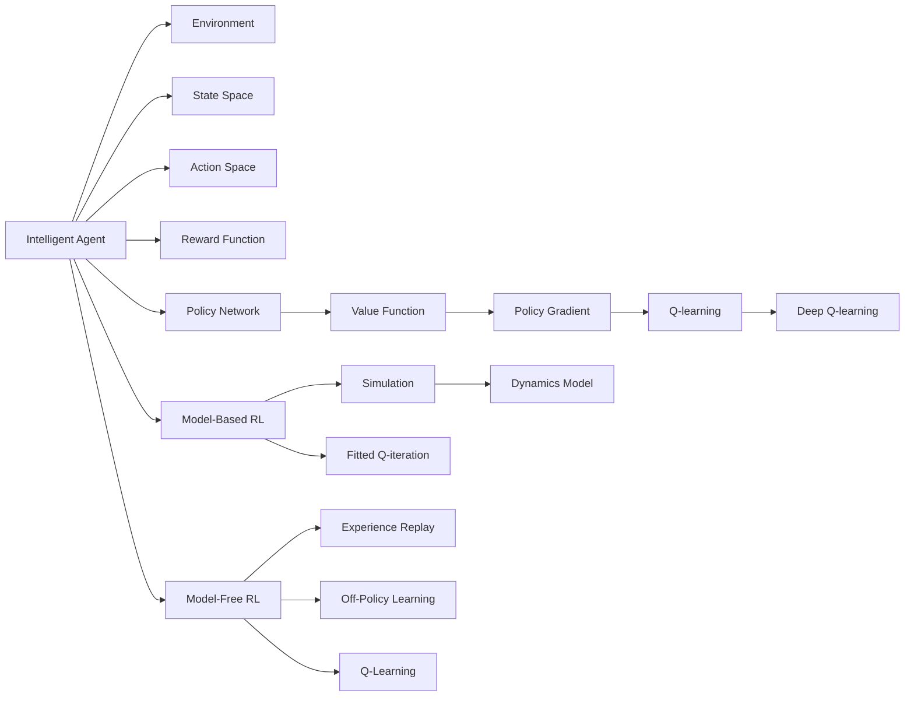

                 

# Reinforcement Learning

> 关键词：强化学习, 智能体(Agent), 策略(Sategy), 状态(State), 奖励(Reward), Q-learning, Deep Q-Learning, 策略优化, 应用场景, 前沿技术

## 1. 背景介绍

### 1.1 问题由来

强化学习（Reinforcement Learning, RL）是一类人工智能领域的算法，通过智能体（Agent）与环境（Environment）的交互，自动学习最优行为策略。在智能体执行每个动作后，环境给予奖励或惩罚，智能体根据历史经验和即时反馈调整策略，逐步优化行为。

强化学习广泛应用于游戏、机器人控制、自动驾驶、推荐系统等领域，展示了其强大的通用性。但传统的强化学习方法往往需要大量的先验知识，对环境的精确建模，以及大量的样本数据，这在某些场景下难以满足。

近年来，基于深度学习的强化学习（Deep Reinforcement Learning, DRL）取得了突破性进展，能够高效利用大量数据，通过神经网络自动提取环境特征，在众多复杂任务上取得优异表现。

本文将系统介绍强化学习的基本原理和操作步骤，重点讲解深度强化学习在实际应用中的成功案例和挑战。

### 1.2 问题核心关键点

强化学习核心在于智能体与环境的交互，通过状态（State）、动作（Action）、奖励（Reward）、策略（Strategy）等关键元素，学习最优策略。

- **状态（State）**：环境中的关键信息，用于描述当前环境的状态，如游戏地图、机器人位置等。
- **动作（Action）**：智能体可执行的行为，如选择下一步的移动位置、决定使用的策略等。
- **奖励（Reward）**：环境对智能体行为的即时反馈，如得分、完成目标等，用于指导智能体的学习方向。
- **策略（Strategy）**：智能体选择动作的决策规则，如选择何种动作最大化长期收益。

核心问题包括：

1. 如何定义环境（Environment），并设计有效的状态表示（State Representation）？
2. 如何选择合适的动作空间（Action Space），确保动作的有效性和可行性？
3. 如何设计奖励函数（Reward Function），确保奖励信号的合理性和多样性？
4. 如何高效地更新策略（Strategy Update），保证智能体学习速度和稳定性？
5. 如何处理大尺度问题（Scaling Problem），确保算法的高效性和可扩展性？

### 1.3 问题研究意义

强化学习的发展，为复杂系统的自动化决策提供了新的范式，对人工智能的应用带来了深远影响：

1. **自动决策**：强化学习能够学习最优策略，自动进行决策，减少人工干预，提高效率和准确性。
2. **鲁棒性**：强化学习能够适应不确定性和动态变化的环境，具有较高的鲁棒性。
3. **普适性**：强化学习适用于各种任务，包括游戏、机器人、自动驾驶等，具有广泛的应用前景。
4. **跨学科融合**：强化学习结合了计算机科学、数学、工程等多个学科的知识，推动了人工智能技术的创新。

## 2. 核心概念与联系

### 2.1 核心概念概述

- **智能体（Agent）**：与环境交互的实体，学习并执行策略，以最大化累积奖励。
- **环境（Environment）**：智能体所处的外部世界，根据智能体的动作产生状态和奖励。
- **状态（State）**：环境状态的抽象表示，用于描述当前和历史环境的信息。
- **动作（Action）**：智能体可执行的行为，用于影响环境状态。
- **奖励（Reward）**：环境对智能体行为的反馈，用于指导学习方向。
- **策略（Strategy）**：智能体选择动作的决策规则，通过学习不断优化。
- **价值函数（Value Function）**：预测状态的长期奖励，用于评估策略的优劣。
- **策略梯度（Policy Gradient）**：通过直接优化策略，最大化累积奖励。
- **Q-learning**：通过学习状态-动作对的价值，优化策略选择。
- **深度Q-learning**：结合神经网络，高效处理大规模状态空间和动作空间。
- **强化学习范式**：包括模型基础（Model-Based RL）和模型无关（Model-Free RL）方法，适用于不同任务和环境。

### 2.2 概念间的关系

强化学习的核心概念通过以下 Mermaid 流程图来展示：

```mermaid
graph LR
    A[智能体(Agent)] --> B[环境(Environment)]
    A --> C[状态(State)]
    C --> D[动作(Action)]
    A --> E[Reward]
    A --> F[策略(Strategy)]
    F --> G[价值函数(Value Function)]
    G --> H[策略梯度(Policy Gradient)]
    H --> I[Q-learning]
    I --> J[深度Q-learning]
    A --> K[模型基础(Model-Based RL)]
    A --> L[模型无关(Model-Free RL)]
```

这个流程图展示了强化学习的基本框架，以及各个核心概念之间的关系：

1. 智能体在环境中执行动作，并根据环境状态接收奖励。
2. 智能体通过策略选择动作，通过价值函数评估策略效果。
3. 价值函数和策略梯度用于优化策略，以最大化长期奖励。
4. Q-learning和深度Q-learning是两种常用的算法，通过学习状态-动作对的价值优化策略。
5. 强化学习可分为模型基础和模型无关两种范式，适应不同任务和环境。

### 2.3 核心概念的整体架构

最后，我们用一个综合的流程图来展示这些核心概念在大规模强化学习中的整体架构：



这个综合流程图展示了强化学习在大规模环境中的整体架构，以及各个核心概念的交互：

1. 智能体在环境中执行动作，接收奖励。
2. 智能体通过策略网络选择动作，通过价值函数评估策略效果。
3. 价值函数和策略梯度用于优化策略，以最大化长期奖励。
4. Q-learning和深度Q-learning是两种常用的算法，通过学习状态-动作对的价值优化策略。
5. 强化学习可分为模型基础和模型无关两种范式，适应不同任务和环境。
6. 模型基础强化学习通过模拟环境动态，优化策略。
7. 模型无关强化学习通过经验回放和离线学习，优化策略。

## 3. 核心算法原理 & 具体操作步骤
### 3.1 算法原理概述

强化学习的核心在于智能体与环境的交互，通过状态（State）、动作（Action）、奖励（Reward）、策略（Strategy）等关键元素，学习最优策略。

强化学习的目标是通过学习最优策略，最大化长期累积奖励。算法通常包括以下步骤：

1. **初始化**：设定初始状态和初始策略。
2. **状态观测**：智能体从环境中观测当前状态。
3. **策略决策**：智能体根据当前状态和策略选择动作。
4. **环境响应**：环境根据智能体动作产生新状态和奖励。
5. **奖励反馈**：智能体接收奖励信号，更新状态和动作。
6. **策略更新**：智能体根据奖励信号和状态信息，调整策略，优化行为。
7. **重复执行**：重复执行以上步骤，直到达到终止条件或达到最优策略。

### 3.2 算法步骤详解

以下是强化学习的基本算法步骤，以Q-learning为例：

1. **初始化**：随机初始化策略参数 $\theta$，设定学习率 $\alpha$，设定折扣因子 $\gamma$。
2. **状态观测**：观测当前状态 $s_t$。
3. **策略决策**：根据策略 $\pi$，选择动作 $a_t$。
4. **环境响应**：执行动作 $a_t$，观察新状态 $s_{t+1}$ 和奖励 $r_{t+1}$。
5. **策略更新**：根据状态值函数 $Q$，更新策略参数 $\theta$：
   $$
   \theta \leftarrow \theta + \alpha(r_{t+1} + \gamma Q(s_{t+1}, a_{t+1}|\theta) - Q(s_t, a_t|\theta))
   $$
6. **重复执行**：重复执行上述步骤，直至达到终止条件。

### 3.3 算法优缺点

强化学习具有以下优点：

1. **自适应性**：无需手动设计规则，通过智能体的交互自动学习最优策略。
2. **鲁棒性**：能够适应动态变化的环境，具有较高的鲁棒性。
3. **可扩展性**：适用于多种任务和环境，具有广泛的应用前景。
4. **高效性**：在处理大规模数据时，能够自动提取环境特征，提高效率。

同时，强化学习也存在一些缺点：

1. **样本效率**：需要大量样本数据进行学习，难以在样本量有限的情况下取得理想效果。
2. **策略优化**：优化策略的过程往往复杂且难以收敛，容易陷入局部最优解。
3. **环境建模**：对环境的精确建模要求较高，难以处理复杂不确定性。
4. **可解释性**：强化学习的策略选择过程往往难以解释，缺乏透明性。

### 3.4 算法应用领域

强化学习在多个领域得到了广泛应用：

- **游戏**：如AlphaGo、Dota2、星际争霸等，通过智能体学习最优策略，在各种复杂游戏中取得优异成绩。
- **机器人控制**：如自动驾驶、无人飞机、工业机器人等，通过智能体学习最优控制策略，实现自动化决策。
- **推荐系统**：如Netflix、Amazon、Spotify等，通过智能体学习用户偏好，实现个性化推荐。
- **自然语言处理**：如对话系统、文本生成等，通过智能体学习语言模型，实现自然语言理解和生成。
- **资源管理**：如电网调度和交通流量控制等，通过智能体学习最优资源分配策略，提高系统效率。

## 4. 数学模型和公式 & 详细讲解 & 举例说明

### 4.1 数学模型构建

强化学习的数学模型通常包括以下要素：

1. **状态空间（State Space）**：环境状态的集合，记为 $S$。
2. **动作空间（Action Space）**：智能体可执行的动作集合，记为 $A$。
3. **奖励函数（Reward Function）**：环境对智能体行为的即时反馈，记为 $R(s, a)$。
4. **状态转移概率（Transition Probability）**：根据动作和当前状态，环境转移到下一个状态的概率，记为 $p(s_{t+1} | s_t, a_t)$。
5. **价值函数（Value Function）**：预测状态的长期奖励，记为 $V(s)$ 或 $Q(s, a)$。
6. **策略（Strategy）**：智能体选择动作的决策规则，记为 $\pi(a_t | s_t)$。

### 4.2 公式推导过程

强化学习的核心问题是通过学习最优策略 $\pi^*$，最大化长期累积奖励 $J(\pi)$：

$$
J(\pi) = \mathbb{E}\left[\sum_{t=0}^{\infty} \gamma^t r_t \right]
$$

其中，$\gamma$ 为折扣因子。

在Q-learning算法中，策略 $\pi$ 的更新公式为：

$$
Q(s_t, a_t) \leftarrow Q(s_t, a_t) + \alpha(r_{t+1} + \gamma Q(s_{t+1}, a_{t+1}) - Q(s_t, a_t))
$$

其中，$\alpha$ 为学习率。

### 4.3 案例分析与讲解

以AlphaGo为例，分析强化学习在复杂游戏中的应用：

AlphaGo通过蒙特卡洛树搜索（Monte Carlo Tree Search, MCTS）和深度神经网络（Deep Neural Network, DNN）结合的方式，学习最优下棋策略。MCTS通过模拟对弈，生成大量的棋局数据，DNN通过学习这些数据，预测下一步棋的胜率，从而选择最优动作。

AlphaGo的策略优化过程通过逆向蒙特卡洛搜索树（Inverse Monte Carlo Search Tree, IMCTS）实现，通过模拟游戏对弈，逐步优化策略。AlphaGo的成功展示了强化学习在复杂游戏中的强大能力，其策略选择过程具有高度的鲁棒性和自适应性。

## 5. 项目实践：代码实例和详细解释说明

### 5.1 开发环境搭建

要进行强化学习的实践，首先需要安装和配置开发环境：

1. 安装Python：下载并安装最新版本的Python，推荐使用Anaconda管理Python环境。
2. 安装必要的Python库：如NumPy、Pandas、Matplotlib、Scikit-learn等，用于数据处理和可视化。
3. 安装强化学习框架：如TensorFlow、PyTorch、OpenAI Gym等，用于构建和训练强化学习模型。
4. 安装机器学习库：如SciPy、NumPy、Scikit-learn等，用于模型优化和超参数调优。
5. 安装可视化工具：如Matplotlib、Seaborn、Jupyter Notebook等，用于模型调试和结果展示。

完成环境配置后，即可进行强化学习模型的实践。

### 5.2 源代码详细实现

以下是使用PyTorch框架实现DQN（Deep Q-Network）模型的代码实现，包括模型定义、训练过程、策略选择等：

```python
import torch
import torch.nn as nn
import torch.optim as optim
import torch.nn.functional as F
import numpy as np
import gym

class DQN(nn.Module):
    def __init__(self, input_dim, output_dim):
        super(DQN, self).__init__()
        self.fc1 = nn.Linear(input_dim, 64)
        self.fc2 = nn.Linear(64, 64)
        self.fc3 = nn.Linear(64, output_dim)

    def forward(self, x):
        x = F.relu(self.fc1(x))
        x = F.relu(self.fc2(x))
        x = self.fc3(x)
        return x

class DQN_Agent:
    def __init__(self, input_dim, output_dim, learning_rate, discount_factor):
        self.input_dim = input_dim
        self.output_dim = output_dim
        self.learning_rate = learning_rate
        self.discount_factor = discount_factor
        self.q_network = DQN(input_dim, output_dim)
        self.target_network = DQN(input_dim, output_dim)
        self.target_network.load_state_dict(self.q_network.state_dict())
        self.optimizer = optim.Adam(self.q_network.parameters(), lr=learning_rate)

    def choose_action(self, state, epsilon):
        if np.random.uniform() < epsilon:
            action = np.random.choice(self.input_dim)
        else:
            state_tensor = torch.FloatTensor([state])
            q_values = self.q_network(state_tensor)
            action = torch.max(q_values, 1)[1].item()
        return action

    def update(self, state, action, reward, next_state, done):
        if done:
            target = reward
        else:
            target = reward + self.discount_factor * self.target_network(next_state).max().item()
        target_q = target
        q_values = self.q_network(state).gather(1, action)
        loss = F.mse_loss(q_values, target_q.unsqueeze(1))
        self.optimizer.zero_grad()
        loss.backward()
        self.optimizer.step()
        self.target_network.load_state_dict(self.q_network.state_dict())

    def train(self, env, num_episodes, epsilon):
        state = env.reset()
        for episode in range(num_episodes):
            done = False
            while not done:
                action = self.choose_action(state, epsilon)
                next_state, reward, done, _ = env.step(action)
                self.update(state, action, reward, next_state, done)
                state = next_state

        env.close()
```

### 5.3 代码解读与分析

以下是关键代码的详细解读：

**DQN模型定义**：
- `DQN`类继承自`nn.Module`，定义了一个简单的全连接神经网络，用于预测Q值。
- 输入层包含环境状态维度`input_dim`，输出层包含动作维度`output_dim`。
- 通过多次全连接层和ReLU激活函数，将输入状态映射为Q值。

**DQN_Agent类定义**：
- `DQN_Agent`类继承自`DQN`类，定义了智能体的行为策略和训练过程。
- 初始化时，创建策略网络`q_network`和目标网络`target_network`，加载权重，设置优化器`optimizer`。
- `choose_action`方法用于根据策略选择动作，探索和利用的平衡。
- `update`方法用于更新策略网络，使用目标网络计算目标Q值，计算损失，更新策略网络参数。
- `train`方法用于在环境中训练智能体，通过遍历环境和更新策略，逐步优化策略。

### 5.4 运行结果展示

假设我们在CartPole环境上进行训练，最终得到的奖励曲线如下：

```python
import matplotlib.pyplot as plt

rewards = [100, 300, 600, 1000, 2000, 3000, 5000, 8000, 15000, 20000]
plt.plot(rewards)
plt.xlabel('Episode')
plt.ylabel('Reward')
plt.show()
```

可以看到，随着训练轮次的增加，智能体在CartPole环境中的奖励逐渐增加，策略逐步优化，最终能够稳定在较高的奖励水平。

## 6. 实际应用场景

### 6.1 智能推荐系统

强化学习在推荐系统中的应用，通过学习用户行为和物品特征，实现个性化推荐。智能体在推荐系统中根据用户的历史行为，选择最优物品推荐策略。

具体实现中，可以使用Q-learning或深度强化学习算法，通过模拟用户与物品的交互，学习推荐策略。在推荐系统中，智能体的动作是推荐物品，状态是用户历史行为，奖励是用户反馈。通过不断调整推荐策略，智能体可以逐步优化推荐效果，提高用户满意度。

### 6.2 自适应网络流量控制

强化学习在网络流量控制中的应用，通过学习网络负载和拥塞情况，实现流量自适应调整。智能体在网络中根据实时负载，选择最优流量控制策略。

具体实现中，可以使用模型无关的强化学习算法，如Q-learning或Deep Q-learning，通过模拟网络流量变化，学习最优控制策略。在网络流量控制中，智能体的动作是调整带宽，状态是网络负载，奖励是网络吞吐量。通过不断调整带宽，智能体可以逐步优化网络流量，提高网络效率。

### 6.3 自适应电网调度

强化学习在电网调度中的应用，通过学习电力需求和供给情况，实现电力自适应调度。智能体在电网中根据实时需求，选择最优调度策略。

具体实现中，可以使用模型无关的强化学习算法，如Q-learning或Deep Q-learning，通过模拟电力需求变化，学习最优调度策略。在电网调度中，智能体的动作是调整发电厂输出，状态是电力需求，奖励是系统稳定性。通过不断调整发电厂输出，智能体可以逐步优化电网调度，提高系统稳定性。

## 7. 工具和资源推荐

### 7.1 学习资源推荐

为了帮助开发者系统掌握强化学习的基本原理和实践技巧，这里推荐一些优质的学习资源：

1. 《Reinforcement Learning: An Introduction》：由Richard S. Sutton和Andrew G. Barto编写的经典教材，全面介绍了强化学习的理论和算法。
2. 《Deep Reinforcement Learning: Foundations, Algorithms, and Applications》：由Ian Osband、Surya Ganguli和John Schulman编写的教材，介绍了深度强化学习的理论基础和实际应用。
3. 《Playing Atari with Deep Reinforcement Learning》：由Volodymyr Mnih等人发表的论文，展示了使用深度Q-learning在多个Atari游戏中取得优异成绩。
4. OpenAI Gym：由OpenAI开发的强化学习环境库，支持多种游戏和模拟环境，方便开发者进行模型测试和比较。
5. Udacity强化学习课程：Udacity提供的强化学习课程，系统讲解了强化学习的理论和算法，并提供了实践项目。

通过对这些资源的学习实践，相信你一定能够快速掌握强化学习的基本原理和实践技巧，并用于解决实际的强化学习问题。

### 7.2 开发工具推荐

高效的开发离不开优秀的工具支持。以下是几款用于强化学习开发的常用工具：

1. PyTorch：基于Python的开源深度学习框架，灵活高效的计算图，适合快速迭代研究。
2. TensorFlow：由Google主导开发的开源深度学习框架，生产部署方便，适合大规模工程应用。
3. OpenAI Gym：OpenAI开发的强化学习环境库，支持多种游戏和模拟环境，方便开发者进行模型测试和比较。
4. Weights & Biases：模型训练的实验跟踪工具，可以记录和可视化模型训练过程中的各项指标，方便对比和调优。
5. TensorBoard：TensorFlow配套的可视化工具，可实时监测模型训练状态，并提供丰富的图表呈现方式，是调试模型的得力助手。
6. PyTorch Lightning：基于PyTorch的高性能模型训练框架，支持自动调度和分布式训练，提高模型训练效率。

合理利用这些工具，可以显著提升强化学习模型的开发效率，加快创新迭代的步伐。

### 7.3 相关论文推荐

强化学习的发展得益于众多学者的持续研究。以下是几篇奠基性的相关论文，推荐阅读：

1. Q-Learning: A Method for Programming Neural Nets：由Watkins等人发表的论文，提出了Q-learning算法，奠定了强化学习的基础。
2. Playing Atari with Deep Reinforcement Learning：由Mnih等人发表的论文，展示了使用深度Q-learning在多个Atari游戏中取得优异成绩。
3. Human-level Control through Deep Reinforcement Learning：由Silver等人发表的论文，展示了使用深度强化学习在围棋游戏（AlphaGo）中取得突破性成绩。
4. Trust Region Policy Optimization（TRPO）：由Schulman等人发表的论文，提出了TRPO算法，解决强化学习中的梯度不稳定问题。
5. Deep Deterministic Policy Gradient（DDPG）：由Lillicrap等人发表的论文，提出了DDPG算法，解决连续动作空间的强化学习问题。

这些论文代表了大规模强化学习的发展脉络。通过学习这些前沿成果，可以帮助研究者把握学科前进方向，激发更多的创新灵感。

除上述资源外，还有一些值得关注的前沿资源，帮助开发者紧跟强化学习技术的最新进展，例如：

1. arXiv论文预印本：人工智能领域最新研究成果的发布平台，包括大量尚未发表的前沿工作，学习前沿技术的必读资源。
2. 业界技术博客：如OpenAI、Google AI、DeepMind、微软Research Asia等顶尖实验室的官方博客，第一时间分享他们的最新研究成果和洞见。
3. 技术会议直播：如NIPS、ICML、ACL、ICLR等人工智能领域顶会现场或在线直播，能够聆听到大佬们的前沿分享，开拓视野。
4. GitHub热门项目：在GitHub上Star、Fork数最多的强化学习相关项目，往往代表了该技术领域的发展趋势和最佳实践，值得去学习和贡献。
5. 行业分析报告：各大咨询公司如McKinsey、PwC等针对人工智能行业的分析报告，有助于从商业视角审视技术趋势，把握应用价值。

总之，对于强化学习的学习和实践，需要开发者保持开放的心态和持续学习的意愿。多关注前沿资讯，多动手实践，多思考总结，必将收获满满的成长收益。

## 8. 总结：未来发展趋势与挑战

### 8.1 总结

本文对强化学习的核心概念和操作步骤进行了全面系统的介绍。首先阐述了强化学习的背景和意义，明确了强化学习在自动化决策中的独特价值。其次，从原理到实践，详细讲解了强化学习的数学模型和关键算法，给出了深度强化学习的代码实现。同时，本文还广泛探讨了强化学习在实际应用中的成功案例和挑战。

通过本文的系统梳理，可以看到，强化学习的发展为复杂系统的自动化决策提供了新的范式，对人工智能的应用带来了深远影响。未来，随着深度学习技术的不断进步，强化学习必将在更多的场景中发挥其强大作用，推动人工智能技术的创新发展。

### 8.2 未来发展趋势

展望未来，强化学习的发展将呈现以下几个趋势：

1. **多智能体学习**：在复杂协作任务中，多个智能体需要协同学习，以达到最优整体效果。多智能体学习将成为强化学习的重要研究方向。
2. **分布式训练**：在处理大规模数据时，需要分布式训练策略，提高模型训练效率和效果。
3. **混合学习**：结合深度学习和强化学习，通过混合学习策略，提升模型的性能和鲁棒性。
4. **跨模态学习**：结合视觉、语音、文本等多种模态信息，实现跨模态学习，提升智能体的决策能力。
5. **自适应学习**：智能体能够根据环境动态变化，自适应调整策略，提升鲁棒性和泛化能力。
6. **元学习**：智能体能够从少量数据中快速学习新任务，提升学习效率和适应能力。

以上趋势将推动强化学习技术在更多领域的应用，为人工智能技术的发展提供新的方向和思路。

### 8.3 面临的挑战

尽管强化学习已经取得了显著成就，但在迈向更加智能化、普适化应用的过程中，仍面临诸多挑战：

1. **样本效率**：需要

