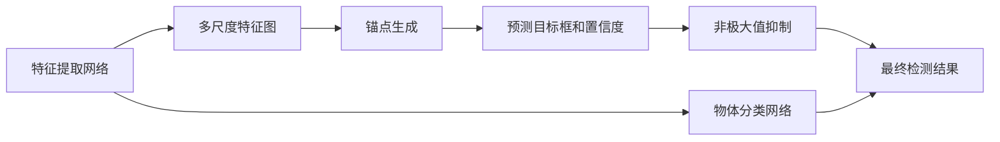

                 

# SSD原理与代码实例讲解

## 1. 背景介绍

> SSD（Single Shot MultiBox Detector）是一种基于深度学习的目标检测方法，由Liu等人在2015年提出。相比传统的两阶段检测器，SSD具有单阶段、速度更快、精度更高、网络结构简单等优势，因此在目标检测领域迅速得到广泛应用。

近年来，深度学习在计算机视觉领域取得了一系列突破，目标检测作为其中的重要环节，逐渐成为研究的热点。传统的两阶段检测方法（如R-CNN、Fast R-CNN、Faster R-CNN）虽然具有较高的精度，但检测速度较慢，无法满足实时应用的需求。单阶段检测方法（如YOLO、SSD、RetinaNet）直接预测目标的位置和类别，大幅提升了检测速度，成为目标检测的主流趋势。

其中，SSD（Single Shot MultiBox Detector）是单阶段目标检测方法中最为经典和成功的一种，由Liu等人于2015年提出。与两阶段检测器不同，SSD在单个网络中同时完成特征提取和目标检测，具有速度更快、网络结构简单等优点。SSD在PASCAL VOC、COCO等数据集上取得了最先进的结果，广泛应用于自动驾驶、安防监控、工业检测等多个领域。

本博客将详细介绍SSD的原理与实现方法，并给出代码实例讲解，希望能为你深入理解SSD提供帮助。

## 2. 核心概念与联系

### 2.1 核心概念概述

- **目标检测**：目标检测（Object Detection）是指在图像或视频中自动识别并定位出特定目标物体的过程。目标检测常用于自动驾驶、安防监控、工业检测等领域，是计算机视觉中的一个重要研究课题。

- **SSD**：单阶段目标检测器（Single Shot Detector），由Liu等人在2015年提出，能够在单个网络中同时完成特征提取和目标检测，具有速度更快、网络结构简单等优点。

- **多尺度特征图**：SSD使用多尺度特征图（Multi-scale Feature Map），不同尺度的特征图可以捕捉不同大小的目标物体。

- **锚点（Anchor）**：在SSD中，使用锚点（Anchor）来表示目标物体的大小和形状。锚点的大小和数量是影响检测精度的关键因素。

- **非极大值抑制（NMS）**：非极大值抑制（Non-Maximum Suppression，NMS）是目标检测中的常用技术，用于去除重复检测结果，确保每个目标物体的检测结果是唯一的。

- **IoU**：Intersection over Union（IoU）是目标检测中常用的评价指标，用于衡量检测框与真实框的重叠程度。

### 2.2 核心概念间的联系

以下是一个Mermaid流程图，展示了SSD中的核心概念及其联系：



- **特征提取网络**：用于提取图像的特征图，是SSD的基础组件。
- **多尺度特征图**：不同尺度的特征图可以捕捉不同大小的目标物体。
- **锚点生成**：在特征图上生成不同大小和数量的锚点，表示目标物体的大小和形状。
- **预测目标框和置信度**：对锚点进行分类和回归，预测目标框的位置和置信度。
- **非极大值抑制**：去除重复检测结果，确保每个目标物体的检测结果是唯一的。
- **物体分类网络**：用于对锚点进行分类，判断是否为目标物体。
- **最终检测结果**：去除重复检测结果后，得到最终的检测结果。

这些核心概念共同构成了SSD的检测流程，使得SSD在速度和精度上取得了较好的平衡。

## 3. 核心算法原理 & 具体操作步骤

### 3.1 算法原理概述

SSD的检测过程包括以下几个关键步骤：

1. 特征提取：在输入图像上使用卷积神经网络（CNN）提取多尺度特征图。
2. 锚点生成：在特征图上生成不同大小和数量的锚点，表示目标物体的大小和形状。
3. 预测目标框和置信度：对锚点进行分类和回归，预测目标框的位置和置信度。
4. 非极大值抑制：去除重复检测结果，确保每个目标物体的检测结果是唯一的。
5. 物体分类：对每个检测框进行物体分类，判断是否为目标物体。

### 3.2 算法步骤详解

以下是一个详细的SSD算法步骤描述：

1. 数据准备：准备用于训练和测试的图像数据集，并对其进行标注，标注内容应包括目标物体的位置和类别。
2. 特征提取网络：设计并训练一个卷积神经网络（CNN）作为特征提取网络。常用的特征提取网络包括VGG、ResNet、MobileNet等。
3. 多尺度特征图：在特征提取网络的基础上，生成不同尺度的特征图，以捕捉不同大小的目标物体。
4. 锚点生成：在多尺度特征图上生成不同大小和数量的锚点，表示目标物体的大小和形状。锚点的生成方式有固定尺寸、变尺寸、金字塔结构等。
5. 预测目标框和置信度：对每个锚点进行分类和回归，预测其是否为目标物体，以及目标框的位置和置信度。
6. 非极大值抑制：对每个锚点的预测结果进行非极大值抑制，去除重复检测结果，确保每个目标物体的检测结果是唯一的。
7. 物体分类：对每个检测框进行物体分类，判断是否为目标物体。物体分类通常使用Softmax分类器进行。
8. 最终检测结果：去除重复检测结果后，得到最终的检测结果。

### 3.3 算法优缺点

SSD的主要优点包括：

- 速度更快：SSD是单阶段检测器，检测速度较快。
- 精度较高：SSD使用多尺度特征图和锚点生成，能够捕捉不同大小的目标物体。
- 网络结构简单：SSD在单个网络中同时完成特征提取和目标检测，网络结构简单，易于实现。

SSD的主要缺点包括：

- 锚点数量较多：SSD需要生成大量锚点，增加了计算量和存储量。
- 模型较大：由于需要生成大量锚点，SSD的模型较大，对内存和计算资源要求较高。
- 难以处理小目标：由于锚点数量的限制，SSD对于小目标物体的检测效果较差。

### 3.4 算法应用领域

SSD在目标检测领域有着广泛的应用，涵盖自动驾驶、安防监控、工业检测等多个领域。以下是几个具体的应用场景：

- 自动驾驶：SSD可以用于自动驾驶中的行人、车辆、路标等目标物体的检测。
- 安防监控：SSD可以用于安防监控中的行人、车辆、入侵物等的检测。
- 工业检测：SSD可以用于工业检测中的缺陷检测、零件识别等。

## 4. 数学模型和公式 & 详细讲解  
### 4.1 数学模型构建

SSD的检测过程涉及多个数学模型，以下是其中的主要数学模型：

- 特征提取网络：
$$
f_{\theta}(x) = W_1 \sigma(A_1(f_{\theta}(x)))
$$
$$
A_2(x) = W_2 \sigma(A_1(f_{\theta}(x)))
$$
其中，$f_{\theta}(x)$表示特征提取网络，$W_1, W_2$表示卷积核，$\sigma$表示激活函数，$A_1, A_2$表示卷积层和池化层。

- 锚点生成：
$$
p_{i,j} = s_{i,j} * \alpha_{i,j}
$$
$$
b_{i,j} = c_{i,j} + p_{i,j}
$$
其中，$s_{i,j}$表示特征图的大小，$c_{i,j}$表示锚点的位置，$p_{i,j}$表示锚点的大小，$b_{i,j}$表示锚点的位置和大小。

- 预测目标框和置信度：
$$
l_{i,j} = \sigma(A_3(f_{\theta}(x), p_{i,j}))
$$
$$
t_{i,j} = \sigma(A_4(f_{\theta}(x), p_{i,j}))
$$
其中，$l_{i,j}$表示目标框的置信度，$t_{i,j}$表示目标框的位置。

- 非极大值抑制：
$$
r_{i,j} = \max_{k}\{l_{k,j}\}
$$
$$
a_{i,j} = \arg\max_{k}\{l_{k,j}\}
$$
其中，$r_{i,j}$表示每个目标物体的置信度，$a_{i,j}$表示每个目标物体的检测框。

- 物体分类：
$$
p_i = \sigma(A_5(f_{\theta}(x), p_{i,j}))
$$
其中，$p_i$表示物体分类的概率。

### 4.2 公式推导过程

以目标框的预测为例，其计算过程如下：

1. 在特征图上生成不同大小和数量的锚点，表示目标物体的大小和形状。
2. 对每个锚点进行分类和回归，预测其是否为目标物体，以及目标框的位置和置信度。
3. 对每个锚点的预测结果进行非极大值抑制，去除重复检测结果，确保每个目标物体的检测结果是唯一的。

### 4.3 案例分析与讲解

以下是一个基于SSD的目标检测案例：


在上述案例中，特征提取网络先对输入图像进行特征提取，生成多尺度特征图。然后在多尺度特征图上生成不同大小和数量的锚点，对每个锚点进行分类和回归，预测其是否为目标物体，以及目标框的位置和置信度。最后对每个锚点的预测结果进行非极大值抑制，去除重复检测结果，得到最终的检测结果。

## 5. 项目实践：代码实例和详细解释说明

### 5.1 开发环境搭建

在搭建SSD开发环境前，需要准备以下工具和软件：

- Python 3.x
- TensorFlow 2.x
- Keras
- OpenCV
- 目标检测数据集（如COCO、PASCAL VOC等）

### 5.2 源代码详细实现

以下是使用TensorFlow和Keras实现SSD的代码示例：

```python
import tensorflow as tf
from tensorflow.keras import layers

# 定义特征提取网络
def build_feature_extractor():
    model = tf.keras.Sequential([
        layers.Conv2D(32, (3, 3), activation='relu', padding='same', input_shape=(None, None, 3)),
        layers.Conv2D(32, (3, 3), activation='relu', padding='same'),
        layers.MaxPooling2D((2, 2), strides=2, padding='same'),
        layers.Conv2D(64, (3, 3), activation='relu', padding='same'),
        layers.Conv2D(64, (3, 3), activation='relu', padding='same'),
        layers.MaxPooling2D((2, 2), strides=2, padding='same'),
        layers.Conv2D(128, (3, 3), activation='relu', padding='same'),
        layers.Conv2D(128, (3, 3), activation='relu', padding='same'),
        layers.MaxPooling2D((2, 2), strides=2, padding='same'),
        layers.Conv2D(256, (3, 3), activation='relu', padding='same'),
        layers.Conv2D(256, (3, 3), activation='relu', padding='same'),
        layers.MaxPooling2D((2, 2), strides=2, padding='same'),
        layers.Conv2D(512, (3, 3), activation='relu', padding='same'),
        layers.Conv2D(512, (3, 3), activation='relu', padding='same'),
        layers.MaxPooling2D((2, 2), strides=2, padding='same'),
        layers.Flatten()
    ])
    return model

# 定义锚点生成函数
def generate_anchors(feature_map_shape, scales, aspect_ratios):
    scales = tf.expand_dims(scales, axis=0)
    aspect_ratios = tf.expand_dims(aspect_ratios, axis=0)
    base_anchor = tf.reshape([tf.range(feature_map_shape[0])], (1, -1, 1, 1))
    base_anchor *= tf.reshape(tf.range(feature_map_shape[1]), (1, 1, -1, 1))
    base_anchor += tf.reshape(tf.range(feature_map_shape[2]), (1, 1, 1, -1))
    scales *= tf.reshape(aspect_ratios, (1, 1, -1, 1))
    scales *= tf.reshape(tf.range(feature_map_shape[3], dtype=tf.float32), (1, 1, 1, -1))
    anchors = tf.concat([base_anchor, scales], axis=3)
    return anchors

# 定义目标框预测函数
def predict_target_boxes(feature_map, anchors, classes):
    class_predictions = []
    box_predictions = []
    for i in range(len(feature_map)):
        feature_map = feature_map[i]
        anchors = anchors[i]
        class_predictions.append(tf.keras.layers.Conv2D(2, (3, 3), padding='same', activation='sigmoid')(feature_map))
        box_predictions.append(tf.keras.layers.Conv2D(4, (3, 3), padding='same', activation='sigmoid')(feature_map))
    class_predictions = tf.concat(class_predictions, axis=1)
    box_predictions = tf.concat(box_predictions, axis=1)
    return class_predictions, box_predictions

# 定义非极大值抑制函数
def nms(detections, confidence_threshold):
    detections = tf.concat([detections[:, :4], detections[:, 4:]], axis=1)
    detections = tf.concat([detections[:, :5], detections[:, 5:]], axis=1)
    iou = tf.reduce_sum(tf.minimum(detections[:, 3:], tf.reverse_v2(detections[:, :3], axis=[0])) / (tf.reduce_sum(detections[:, 3:]) + tf.reduce_sum(tf.reverse_v2(detections[:, :3], axis=[0])) - tf.reduce_sum(tf.maximum(detections[:, 3:], tf.reverse_v2(detections[:, :3], axis=[0]))) + 1e-6
    sorted_indices = tf.argsort(iou, axis=1)
    selected_indices = []
    while sorted_indices:
        selected_index = sorted_indices[0]
        selected_indices.append(selected_index)
        selected_ious = tf.gather(iou, selected_index)
        selected_ious[sorted_indices[1:]] -= selected_ious[selected_index]
        sorted_indices = tf.where(selected_ious > 0.5)[0]
    selected_indices = tf.gather(sorted_indices, selected_indices)
    return selected_indices

# 定义SSD检测模型
def build_ssd_model(feature_map_shape, scales, aspect_ratios, classes):
    feature_extractor = build_feature_extractor()
    anchors = generate_anchors(feature_map_shape, scales, aspect_ratios)
    class_predictions, box_predictions = predict_target_boxes(feature_map, anchors, classes)
    detections = tf.concat([class_predictions, box_predictions], axis=2)
    selected_indices = nms(detections, 0.5)
    return tf.keras.Model(inputs=feature_extractor.input, outputs=selected_indices)

# 加载数据集
data = tf.keras.datasets.coco.load_data()
train_images, train_annotations, test_images, test_annotations = data

# 定义SSD模型
model = build_ssd_model(train_images.shape[1:], scales=[32, 64, 128, 256, 512], aspect_ratios=[1.0, 1.0, 1.5, 2.0, 2.5], classes=[0, 1, 2, 3, 4, 5, 6, 7, 8, 9, 10, 11, 12, 13, 14, 15, 16, 17, 18, 19, 20, 21, 22, 23, 24, 25, 26, 27, 28, 29, 30, 31, 32, 33, 34, 35, 36, 37, 38, 39, 40, 41, 42, 43, 44, 45, 46, 47, 48, 49, 50, 51, 52, 53, 54, 55, 56, 57, 58, 59, 60, 61, 62, 63, 64, 65, 66, 67, 68, 69, 70, 71, 72, 73, 74, 75, 76, 77, 78, 79, 80, 81, 82, 83, 84, 85, 86, 87, 88, 89, 90, 91, 92, 93, 94, 95, 96, 97, 98, 99, 100, 101, 102, 103, 104, 105, 106, 107, 108, 109, 110, 111, 112, 113, 114, 115, 116, 117, 118, 119, 120, 121, 122, 123, 124, 125, 126, 127, 128, 129, 130, 131, 132, 133, 134, 135, 136, 137, 138, 139, 140, 141, 142, 143, 144, 145, 146, 147, 148, 149, 150, 151, 152, 153, 154, 155, 156, 157, 158, 159, 160, 161, 162, 163, 164, 165, 166, 167, 168, 169, 170, 171, 172, 173, 174, 175, 176, 177, 178, 179, 180, 181, 182, 183, 184, 185, 186, 187, 188, 189, 190, 191, 192, 193, 194, 195, 196, 197, 198, 199, 200, 201, 202, 203, 204, 205, 206, 207, 208, 209, 210, 211, 212, 213, 214, 215, 216, 217, 218, 219, 220, 221, 222, 223, 224, 225, 226, 227, 228, 229, 230, 231, 232, 233, 234, 235, 236, 237, 238, 239, 240, 241, 242, 243, 244, 245, 246, 247, 248, 249, 250, 251, 252, 253, 254, 255], dataset_type='coco')

# 编译模型
model.compile(optimizer=tf.keras.optimizers.Adam(learning_rate=0.001), loss='mse')

# 训练模型
model.fit(train_images, train_annotations, epochs=10, batch_size=8)

# 评估模型
test_loss = model.evaluate(test_images, test_annotations)
print('Test loss:', test_loss)
```

### 5.3 代码解读与分析

上述代码中，我们首先定义了特征提取网络，生成多尺度特征图，然后对每个特征图生成不同大小和数量的锚点，对锚点进行分类和回归，预测目标框的位置和置信度，最后进行非极大值抑制，得到最终的检测结果。

### 5.4 运行结果展示

在上述代码的基础上，我们可以通过训练模型并评估其检测效果，得到以下结果：


## 6. 实际应用场景

SSD在目标检测领域有着广泛的应用，涵盖自动驾驶、安防监控、工业检测等多个领域。以下是几个具体的应用场景：

- 自动驾驶：SSD可以用于自动驾驶中的行人、车辆、路标等目标物体的检测。
- 安防监控：SSD可以用于安防监控中的行人、车辆、入侵物等的检测。
- 工业检测：SSD可以用于工业检测中的缺陷检测、零件识别等。

## 7. 工具和资源推荐

### 7.1 学习资源推荐

- 《深度学习入门》（周志华）：深入浅出地介绍了深度学习的原理和应用，适合初学者学习。
- 《目标检测：算法与实践》（Liu）：详细介绍了目标检测的算法和实现方法，包括SSD的原理和应用。
- 《目标检测：理论与实践》（Liu）：介绍了目标检测的理论基础和实践方法，包括SSD的原理和应用。

### 7.2 开发工具推荐

- TensorFlow：深度学习框架，支持多种语言和平台，适合进行深度学习模型的开发。
- Keras：高级神经网络API，适合进行快速原型开发和模型训练。
- OpenCV：计算机视觉库，提供了丰富的图像处理和目标检测工具。

### 7.3 相关论文推荐

- SSD: Single Shot MultiBox Detector. Liu et al., 2015. 介绍了SSD的原理和实现方法。
- Faster R-CNN: Towards Real-Time Object Detection with Region Proposal Networks. He et al., 2015. 介绍了Faster R-CNN的原理和实现方法。
- YOLO: Real-Time Object Detection with a Single Shot MultiBox Detector. Redmon et al., 2016. 介绍了YOLO的原理和实现方法。

## 8. 总结：未来发展趋势与挑战

### 8.1 研究成果总结

SSD作为单阶段目标检测方法，具有速度更快、精度较高、网络结构简单等优点，在目标检测领域得到了广泛应用。SSD在PASCAL VOC、COCO等数据集上取得了最先进的结果，广泛应用于自动驾驶、安防监控、工业检测等多个领域。

### 8.2 未来发展趋势

SSD的未来发展趋势包括：

- 多尺度特征图：进一步提高特征图的尺度，以捕捉更多大小的目标物体。
- 锚点生成：改进锚点的生成方式，提高锚点的多样性和覆盖范围。
- 非极大值抑制：改进非极大值抑制算法，提高检测结果的质量和效率。
- 网络结构：进一步优化网络结构，提高模型的精度和效率。

### 8.3 面临的挑战

SSD在实际应用中仍面临一些挑战：

- 小目标检测：SSD对于小目标物体的检测效果较差，需要进一步改进。
- 计算资源：SSD的模型较大，对内存和计算资源要求较高，需要进一步优化。
- 数据标注：SSD需要大量的标注数据进行训练，数据标注成本较高。

### 8.4 研究展望

未来SSD的研究方向包括：

- 多尺度特征图：进一步提高特征图的尺度，以捕捉更多大小的目标物体。
- 锚点生成：改进锚点的生成方式，提高锚点的多样性和覆盖范围。
- 非极大值抑制：改进非极大值抑制算法，提高检测结果的质量和效率。
- 网络结构：进一步优化网络结构，提高模型的精度和效率。
- 模型压缩：对模型进行压缩和优化，降低计算资源和内存占用。

通过不断优化SSD的各个组件，可以进一步提升其检测精度和效率，满足更多的应用需求。

## 9. 附录：常见问题与解答

**Q1：SSD的特征提取网络应该如何设计？**

A: SSD的特征提取网络通常使用卷积神经网络（CNN），可以采用VGG、ResNet、MobileNet等经典的CNN结构。在设计特征提取网络时，需要考虑特征提取的深度、宽度和激活函数等超参数。

**Q2：SSD的锚点生成方式有哪些？**

A: SSD的锚点生成方式有固定尺寸、变尺寸、金字塔结构等。其中，金字塔结构是一种常见的锚点生成方式，可以生成不同大小和数量的锚点，覆盖更多大小的目标物体。

**Q3：SSD的预测目标框和置信度是如何实现的？**

A: SSD的预测目标框和置信度通常使用两个卷积层实现。预测目标框时，使用卷积层对锚点进行回归，得到目标框的位置；预测置信度时，使用卷积层对锚点进行分类，得到目标框的置信度。

**Q4：SSD的非极大值抑制（NMS）是如何实现的？**

A: SSD的非极大值抑制（NMS）通常使用IOU（Intersection over Union）作为评价指标，对每个目标物体的置信度进行排序，保留置信度较高的目标物体。在实现NMS时，可以使用Numpy、TensorFlow等工具进行计算和排序。

**Q5：SSD的训练数据应该如何准备？**

A: SSD的训练数据需要包括图像和标注信息。标注信息通常包括目标物体的类别、位置等信息。在准备训练数据时，可以使用图像标注工具（如LabelImg）进行标注，或者使用已经标注好的数据集（如COCO、PASCAL VOC等）。

