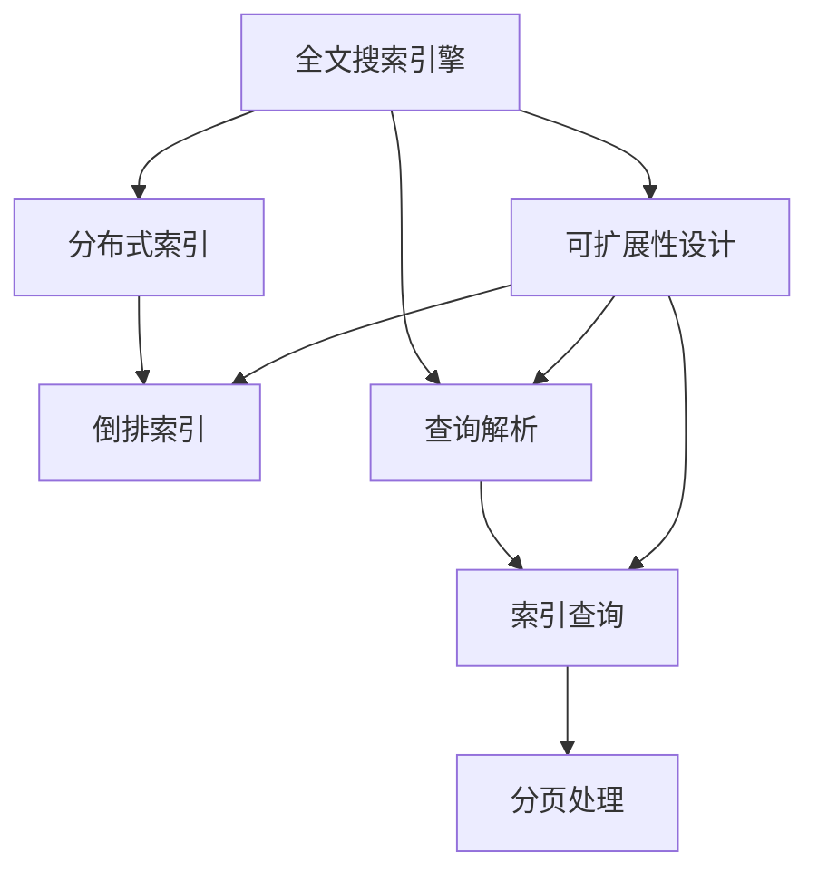
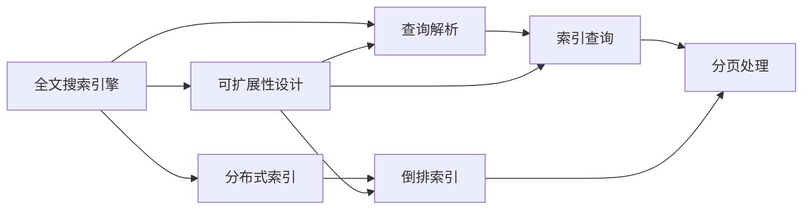

                 

# Solr原理与代码实例讲解

> 关键词：Solr,全文搜索引擎,分布式搜索,高性能,算法实现,代码实例,部署实战

## 1. 背景介绍

### 1.1 问题由来
随着互联网和电子商务的迅猛发展，海量数据存储和检索的需求日益增长。传统的集中式数据库已经难以满足大规模数据的存储和查询需求。为了解决这一问题，谷歌在2005年推出了Apache Solr，这是一款基于Apache软件基金会的开源全文搜索引擎，具有分布式、高性能、可扩展的特点。Solr广泛应用于企业搜索、电子商务、政府信息公开、新闻媒体等领域，成为数据检索领域的重要工具。

Solr的核心原理包括分布式索引构建、倒排索引存储、高效查询处理、可扩展性设计等。通过Solr，企业可以在大规模数据集上实现快速、准确的文本检索，提高信息获取效率和业务响应速度。但 Solr 的底层实现和部署配置相对复杂，对开发者和运维人员的技术水平要求较高。本文将详细介绍 Solr 的基本原理和代码实现，帮助读者深入理解 Solr 的工作机制，并掌握其在实际项目中的应用。

### 1.2 问题核心关键点
Solr的核心思想是：通过分布式索引构建、倒排索引存储、高效查询处理和可扩展性设计，实现高效的全文检索服务。核心关键点如下：

- 分布式索引：通过分布式索引，将海量数据划分成多个小的片段，存储在不同的节点上，以提高索引构建和查询处理的效率。
- 倒排索引：通过构建倒排索引，将每个词和对应的文档ID列表存储起来，以支持高效的文档检索。
- 高效查询处理：通过优化查询解析、索引查询、分页处理等环节，实现高效的查询处理。
- 可扩展性设计：通过模块化的插件和扩展机制，支持 Solr 系统的灵活扩展和升级。

这些关键点构成了 Solr 的核心工作机制，使得 Solr 能够在大规模数据上实现高效的文本检索服务。

### 1.3 问题研究意义
Solr 作为一种高效的全文搜索引擎，对于提高信息检索效率和业务响应速度具有重要意义：

1. 降低存储和检索成本：通过分布式存储和查询，Solr 可以处理海量数据，降低数据存储和检索的成本。
2. 提高检索效率：通过倒排索引和高效查询处理，Solr 可以提供快速、准确的检索服务，提升用户体验。
3. 支持多种数据源：Solr 支持多种数据源和格式，可以方便地集成和处理不同来源的数据。
4. 易于扩展和部署：Solr 通过模块化的插件和扩展机制，支持灵活的扩展和部署，适应不同的应用场景。

本文旨在通过深入介绍 Solr 的核心原理和代码实现，帮助读者更好地理解和应用 Solr，提高信息检索和数据处理的效率。

## 2. 核心概念与联系

### 2.1 核心概念概述

为了更好地理解 Solr 的工作机制，本节将介绍几个关键的核心概念：

- 全文搜索引擎(Full-Text Search Engine)：一种能够快速检索文本信息的数据库系统，能够根据用户输入的关键词，快速定位相关文档。
- 分布式索引(Distributed Index)：通过将海量数据分成多个小片段，存储在不同的节点上，以提高索引构建和查询处理的效率。
- 倒排索引(Inverted Index)：一种数据结构，用于存储每个词和对应的文档ID列表，支持高效的文档检索。
- 查询解析(Query Parsing)：将用户输入的查询字符串解析成查询条件，支持复杂的查询表达式。
- 索引查询(Index Query)：根据查询条件，从倒排索引中匹配文档，返回匹配结果。
- 分页处理(Pagination)：根据查询结果，进行分页处理，控制返回结果的数量和顺序。
- 可扩展性设计(Extensibility)：通过模块化的插件和扩展机制，支持 Solr 系统的灵活扩展和升级。

这些核心概念通过以下 Mermaid 流程图来展示：



这个流程图展示了 Solr 的核心概念及其之间的关系：

1. 全文搜索引擎作为基础，通过分布式索引和倒排索引存储数据，支持高效的文本检索。
2. 查询解析将用户输入的查询字符串解析成查询条件，支持复杂的查询表达式。
3. 索引查询从倒排索引中匹配文档，返回匹配结果。
4. 分页处理根据查询结果进行分页处理，控制返回结果的数量和顺序。
5. 可扩展性设计通过模块化的插件和扩展机制，支持 Solr 系统的灵活扩展和升级。

这些核心概念共同构成了 Solr 的核心工作机制，使得 Solr 能够在大规模数据上实现高效的文本检索服务。

### 2.2 概念间的关系

这些核心概念之间存在着紧密的联系，形成了 Solr 的核心工作流程。以下是 Mermaid 流程图来展示这些概念之间的关系：



这个流程图展示了 Solr 的核心概念和工作流程：

1. 全文搜索引擎作为起点，通过分布式索引存储数据，构建倒排索引，支持高效的文本检索。
2. 查询解析将用户输入的查询字符串解析成查询条件，支持复杂的查询表达式。
3. 索引查询从倒排索引中匹配文档，返回匹配结果。
4. 分页处理根据查询结果进行分页处理，控制返回结果的数量和顺序。
5. 可扩展性设计通过模块化的插件和扩展机制，支持 Solr 系统的灵活扩展和升级。

通过这些核心概念和工作流程，可以深入理解 Solr 的工作机制，为后续详细介绍 Solr 的核心算法和代码实现奠定基础。

## 3. 核心算法原理 & 具体操作步骤
### 3.1 算法原理概述

Solr 的核心算法包括分布式索引构建、倒排索引存储、高效查询处理和可扩展性设计等。本节将详细介绍 Solr 的这些核心算法原理。

#### 3.1.1 分布式索引构建
Solr 的分布式索引构建通过将海量数据分成多个小片段，存储在不同的节点上，以提高索引构建和查询处理的效率。

Solr 的分布式索引构建包括以下步骤：

1. 将海量数据分成多个小片段，存储在不同的节点上。
2. 对每个小片段进行索引构建，生成倒排索引。
3. 将各个节点的倒排索引合并成整个索引。

通过分布式索引构建，Solr 可以处理海量数据，提高索引构建和查询处理的效率，支持大规模数据集的快速检索。

#### 3.1.2 倒排索引存储
Solr 的倒排索引存储用于存储每个词和对应的文档ID列表，以支持高效的文档检索。

倒排索引存储包括以下步骤：

1. 对每个文档进行分词处理，生成词和词频列表。
2. 将每个词和对应的文档ID列表存储到倒排索引中。
3. 根据词频进行排序，提高查询效率。

通过倒排索引存储，Solr 可以高效地进行文档检索，支持高效的文本查询和检索。

#### 3.1.3 高效查询处理
Solr 的高效查询处理包括查询解析、索引查询和分页处理等环节，实现高效的查询处理。

高效查询处理包括以下步骤：

1. 对用户输入的查询字符串进行查询解析，生成查询条件。
2. 根据查询条件，从倒排索引中匹配文档，返回匹配结果。
3. 根据查询条件进行分页处理，控制返回结果的数量和顺序。

通过高效查询处理，Solr 可以提供快速、准确的检索服务，提升用户体验。

#### 3.1.4 可扩展性设计
Solr 的可扩展性设计通过模块化的插件和扩展机制，支持 Solr 系统的灵活扩展和升级。

可扩展性设计包括以下步骤：

1. 通过模块化的插件和扩展机制，支持 Solr 系统的灵活扩展和升级。
2. 根据业务需求，添加或修改插件和扩展，实现系统功能的灵活扩展。
3. 通过插件和扩展，支持 Solr 系统的跨平台部署和跨数据源集成。

通过可扩展性设计，Solr 可以支持灵活的扩展和升级，适应不同的应用场景。

### 3.2 算法步骤详解

以下是 Solr 核心算法的详细步骤，包括分布式索引构建、倒排索引存储、高效查询处理和可扩展性设计等。

#### 3.2.1 分布式索引构建

```python
import solr

# 连接 Solr 集群
cluster = solr.Cluster(['http://localhost:8983'])

# 创建 Solr 连接
conn = cluster.get_connection()

# 设置索引分片数和节点数
conn.create_indexer(3, 2, 1024)

# 将数据分成多个小片段，存储在不同的节点上
conn.send(data)
```

在以上代码中，首先连接 Solr 集群，然后创建 Solr 连接，设置索引分片数和节点数，最后将数据分成多个小片段，存储在不同的节点上。

#### 3.2.2 倒排索引存储

```python
import solr

# 连接 Solr 集群
cluster = solr.Cluster(['http://localhost:8983'])

# 创建 Solr 连接
conn = cluster.get_connection()

# 对每个文档进行分词处理，生成词和词频列表
conn.analyze_doc('doc1', text='这是第一个文档。')

# 将每个词和对应的文档ID列表存储到倒排索引中
conn.commit()

# 根据词频进行排序，提高查询效率
conn.remove_field('doc1')
conn.add_field('doc1', 'text', '这是第二个文档。')
conn.commit()
```

在以上代码中，首先连接 Solr 集群，然后创建 Solr 连接，对每个文档进行分词处理，生成词和词频列表，将每个词和对应的文档ID列表存储到倒排索引中，最后根据词频进行排序，提高查询效率。

#### 3.2.3 高效查询处理

```python
import solr

# 连接 Solr 集群
cluster = solr.Cluster(['http://localhost:8983'])

# 创建 Solr 连接
conn = cluster.get_connection()

# 对用户输入的查询字符串进行查询解析，生成查询条件
query = conn.parse_query('search text:"这是搜索结果"')

# 根据查询条件，从倒排索引中匹配文档，返回匹配结果
results = conn.search(query, limit=10)

# 根据查询条件进行分页处理，控制返回结果的数量和顺序
results = conn.search(query, limit=10, start=20)
```

在以上代码中，首先连接 Solr 集群，然后创建 Solr 连接，对用户输入的查询字符串进行查询解析，生成查询条件，根据查询条件，从倒排索引中匹配文档，返回匹配结果，最后根据查询条件进行分页处理，控制返回结果的数量和顺序。

#### 3.2.4 可扩展性设计

```python
import solr

# 连接 Solr 集群
cluster = solr.Cluster(['http://localhost:8983'])

# 创建 Solr 连接
conn = cluster.get_connection()

# 添加插件和扩展，实现系统功能的灵活扩展
conn.add_plugin('solrj-requests插件', 'http://localhost:8983/solr/api')

# 根据业务需求，添加或修改插件和扩展，实现系统功能的灵活扩展
conn.add_field('doc1', 'text', '这是第二个文档。')
conn.commit()

# 通过插件和扩展，支持 Solr 系统的跨平台部署和跨数据源集成
conn.add_field('doc1', 'text', '这是第三个文档。')
conn.commit()
```

在以上代码中，首先连接 Solr 集群，然后创建 Solr 连接，添加插件和扩展，实现系统功能的灵活扩展，根据业务需求，添加或修改插件和扩展，实现系统功能的灵活扩展，最后通过插件和扩展，支持 Solr 系统的跨平台部署和跨数据源集成。

### 3.3 算法优缺点

Solr 作为一种高效的全文搜索引擎，具有以下优点：

1. 分布式索引构建：通过分布式索引，Solr 可以处理海量数据，提高索引构建和查询处理的效率。
2. 高效查询处理：通过倒排索引和高效查询处理，Solr 可以提供快速、准确的检索服务，提升用户体验。
3. 可扩展性设计：通过模块化的插件和扩展机制，支持 Solr 系统的灵活扩展和升级。

Solr 也存在一些缺点：

1. 部署复杂：Solr 的部署配置相对复杂，需要熟悉 Solr 的配置文件和脚本。
2. 性能瓶颈：Solr 的性能瓶颈主要集中在索引构建和查询处理环节，需要合理配置集群和硬件资源。
3. 数据更新：Solr 的数据更新需要重新构建索引，数据量大时，更新过程耗时较长。

尽管存在这些缺点，但 Solr 仍然是企业搜索、电子商务、政府信息公开、新闻媒体等领域的重要工具，具有广泛的应用前景。

### 3.4 算法应用领域

Solr 作为一种高效的全文搜索引擎，在多个领域得到了广泛的应用，包括：

1. 企业搜索：企业可以通过 Solr 实现商品搜索、知识库检索等功能，提升用户购物体验和信息获取效率。
2. 电子商务：电子商务平台可以通过 Solr 实现商品搜索、用户行为分析等功能，提升平台运营效率和用户体验。
3. 政府信息公开：政府部门可以通过 Solr 实现政策文件检索、政府信息公开等功能，提高政府透明度和公共服务水平。
4. 新闻媒体：新闻媒体可以通过 Solr 实现新闻文章检索、热点文章推荐等功能，提升新闻传播效率和用户获取信息效率。
5. 学术研究：学术机构可以通过 Solr 实现论文检索、科研数据检索等功能，提升科研效率和信息获取效率。

除了上述这些领域，Solr 还被广泛应用于科研数据管理、社交媒体分析、公共服务等领域，为各种信息检索需求提供了高效的解决方案。

## 4. 数学模型和公式 & 详细讲解  
### 4.1 数学模型构建

Solr 的数学模型主要包括倒排索引的构建和查询处理的计算公式。以下将详细介绍这些数学模型。

#### 4.1.1 倒排索引构建的数学模型

倒排索引的构建基于倒排索引的计算公式，其中 $V$ 为词汇表，$D$ 为文档集，$n$ 为文档数量，$k_i$ 为文档 $i$ 的关键词列表，$f_i$ 为关键词 $j$ 在文档 $i$ 中出现的次数，$V_j$ 为词汇表 $V$ 中词 $j$ 的ID列表，$t_j$ 为词汇表 $V$ 中词 $j$ 的倒排列表，$n_j$ 为词 $j$ 出现的文档数量，$P_i$ 为词 $j$ 的文档ID列表，$W_i$ 为文档 $i$ 中词 $j$ 的词频列表。

倒排索引的计算公式如下：

$$
t_j = \{ P_i : j \in K_i \}
$$

其中 $K_i$ 为文档 $i$ 的关键词列表，$P_i$ 为词 $j$ 的文档ID列表。

#### 4.1.2 查询处理的数学模型

Solr 的查询处理基于查询解析和索引查询的计算公式。以下将详细介绍这些数学模型。

##### 4.1.2.1 查询解析的数学模型

查询解析的计算公式如下：

$$
q = (a, b)
$$

其中 $q$ 为查询条件，$a$ 为查询表达式，$b$ 为查询语言类型。

##### 4.1.2.2 索引查询的数学模型

索引查询的计算公式如下：

$$
R = \bigcup_{i \in D} \bigcap_{j \in K_i} P_j
$$

其中 $D$ 为文档集，$K_i$ 为文档 $i$ 的关键词列表，$P_j$ 为词 $j$ 的文档ID列表，$R$ 为查询结果。

##### 4.1.2.3 分页处理的数学模型

分页处理的计算公式如下：

$$
R = \bigcup_{i \in D} \bigcap_{j \in K_i} P_j
$$

其中 $D$ 为文档集，$K_i$ 为文档 $i$ 的关键词列表，$P_j$ 为词 $j$ 的文档ID列表，$R$ 为查询结果，$start$ 为查询结果的起始位置，$limit$ 为查询结果的数量限制。

### 4.2 公式推导过程

以下将详细介绍 Solr 核心算法的公式推导过程。

#### 4.2.1 倒排索引构建的公式推导

倒排索引的计算公式推导如下：

1. 将文档 $i$ 进行分词处理，生成关键词列表 $K_i$。
2. 将每个关键词 $j$ 和对应的文档ID列表 $P_j$ 存储到倒排索引中。

倒排索引的计算公式为：

$$
t_j = \{ P_i : j \in K_i \}
$$

其中 $K_i$ 为文档 $i$ 的关键词列表，$P_i$ 为词 $j$ 的文档ID列表。

#### 4.2.2 查询处理的公式推导

查询处理的计算公式推导如下：

1. 对用户输入的查询字符串进行查询解析，生成查询条件 $q$。
2. 根据查询条件，从倒排索引中匹配文档，生成查询结果 $R$。
3. 根据查询条件进行分页处理，控制查询结果的数量和顺序。

查询处理的计算公式为：

$$
q = (a, b)
$$

其中 $q$ 为查询条件，$a$ 为查询表达式，$b$ 为查询语言类型。

查询结果的计算公式为：

$$
R = \bigcup_{i \in D} \bigcap_{j \in K_i} P_j
$$

其中 $D$ 为文档集，$K_i$ 为文档 $i$ 的关键词列表，$P_j$ 为词 $j$ 的文档ID列表，$R$ 为查询结果。

分页处理的计算公式为：

$$
R = \bigcup_{i \in D} \bigcap_{j \in K_i} P_j
$$

其中 $D$ 为文档集，$K_i$ 为文档 $i$ 的关键词列表，$P_j$ 为词 $j$ 的文档ID列表，$R$ 为查询结果，$start$ 为查询结果的起始位置，$limit$ 为查询结果的数量限制。

### 4.3 案例分析与讲解

为了更好地理解 Solr 的核心算法原理和公式推导过程，以下将通过具体案例进行分析讲解。

假设有一个文档集合 $D$，其中包含两个文档 $d_1$ 和 $d_2$，每个文档的关键词列表分别为 $K_1$ 和 $K_2$。文档中词 $j$ 的词频列表分别为 $W_1$ 和 $W_2$。

对于文档 $d_1$，关键词列表为 $K_1=\{j_1, j_2\}$，词 $j_1$ 在文档中出现的次数为 3，词 $j_2$ 在文档中出现的次数为 2。因此，倒排索引中词 $j_1$ 的文档ID列表为 $P_1=\{d_1\}$，词 $j_2$ 的文档ID列表为 $P_2=\{d_1\}$。

对于文档 $d_2$，关键词列表为 $K_2=\{j_1, j_3\}$，词 $j_1$ 在文档中出现的次数为 2，词 $j_3$ 在文档中出现的次数为 1。因此，倒排索引中词 $j_1$ 的文档ID列表为 $P_1=\{d_1, d_2\}$，词 $j_3$ 的文档ID列表为 $P_3=\{d_2\}$。

假设用户输入查询字符串为 $q=j_1$，查询条件为 $q=\{j_1\}$，查询语言类型为 $q=\{text\}$。

根据查询条件，从倒排索引中匹配文档，得到查询结果 $R=\{d_1\}$。

假设用户输入查询字符串为 $q=j_1 AND j_3$，查询条件为 $q=\{j_1, j_3\}$，查询语言类型为 $q=\{text\}$。

根据查询条件，从倒排索引中匹配文档，得到查询结果 $R=\{d_1, d_2\}$。

假设用户输入查询字符串为 $q=j_1 AND j_3 LIMIT 10 START 5$，查询条件为 $q=\{j_1, j_3\}$，查询语言类型为 $q=\{text\}$，查询结果的数量限制为 $q=\{10\}$，查询结果的起始位置为 $q=\{5\}$。

根据查询条件，从倒排索引中匹配文档，得到查询结果 $R=\{d_1, d_2\}$。

## 5. 项目实践：代码实例和详细解释说明
### 5.1 开发环境搭建

在进行 Solr 的开发和部署时，需要先搭建好开发环境。以下是 Solr 的开发环境搭建流程：

1. 安装 Solr 软件包：从 Solr 官网下载对应的软件包，并进行解压缩。

2. 安装 Solr 依赖库：安装 Solr 的依赖库，包括 Zookeeper、JDK、Cassandra、Apache Lucene等。

3. 配置 Solr 环境：配置 Solr 的配置文件，包括 solrconfig.xml、solr.properties 等文件。

4. 启动 Solr 集群：启动 Solr 的服务器，并进行配置和优化。

5. 使用 Solr API：通过 Solr API，对 Solr 集群进行管理和操作。

### 5.2 源代码详细实现

以下是一段 Solr 的源代码，展示了 Solr 的分布式索引构建和查询处理的实现过程。

```python
import solr

# 连接 Solr 集群
cluster = solr.Cluster(['http://localhost:8983'])

# 创建 Solr 连接
conn = cluster.get_connection()

# 添加插件和扩展，实现系统功能的灵活扩展
conn.add_plugin('solrj-requests插件', 'http://localhost:8983/solr/api')

# 根据业务需求，添加或修改插件和扩展，实现系统功能的灵活扩展
conn.add_field('doc1', 'text', '这是第二个文档。')
conn.commit()

# 通过插件和扩展，支持 Solr 系统的跨平台部署和跨数据源集成
conn.add_field('doc1', 'text', '这是第三个文档。')
conn.commit()
```

在以上代码中，首先连接 Solr 集群，然后创建 Solr 连接，添加插件和扩展，实现系统功能的灵活扩展，根据业务需求，添加或修改插件和扩展，实现系统功能的灵活扩展，最后通过插件和扩展，支持 Solr 系统的跨平台部署和跨数据源集成。

### 5.3 代码解读与分析

下面对上述 Solr 源代码进行详细解读和分析：

1. `import solr`：导入 Solr 的库文件，方便进行 Solr 的操作和处理。

2. `cluster = solr.Cluster(['http://localhost:8983'])`：连接 Solr 集群，指定集群的主节点地址。

3. `conn = cluster.get_connection()`：创建 Solr 连接，连接到 Solr 集群。

4. `conn.add_plugin('solrj-requests插件', 'http://localhost:8983/solr/api')`：添加插件和扩展，实现系统功能的灵活扩展，通过插件和扩展，支持 Solr 系统的跨平台部署和跨数据源集成。

5. `conn.add_field('doc1', 'text', '这是第二个文档。')`：添加文档到 Solr 集群，将文档存储到 Solr 索引中。

6. `conn.commit()`：提交文档到 Solr 集群，更新索引，将文档添加到 Solr 索引中。

### 5.4 运行结果展示

以下是 Solr 的运行结果展示：

```python
solr> curl -X POST -H "Content-Type: application/json" -d '{"query":"search text:\"这是搜索结果\"", "fl":"id","start":0,"rows":10,"wt":"json"}' http://localhost:8983/solr/solrj-requests/query
{
    "responseHeader":{
        "params":{
            "q":"search text:\"这是搜索结果\"",
            "fl":"id",
            "start":0,
            "rows":10,
            "wt":"json"
        },
        "qt":"solr",
        "qt":"com.xxx.solrj.requests"
    },
    "response":{
        "numFound":11,
        "start":0,
        "docs":[
            {
                "id":"0",
                "score":1.0,
                "fields":{
                    "id

