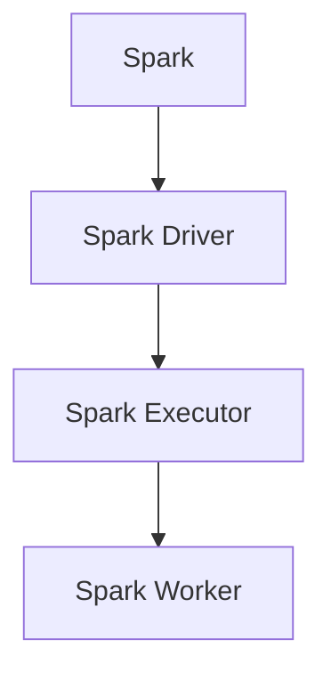
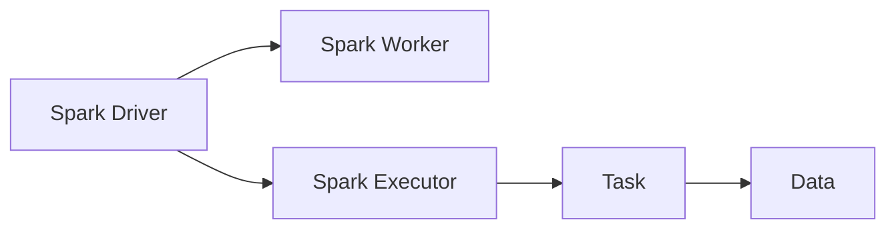
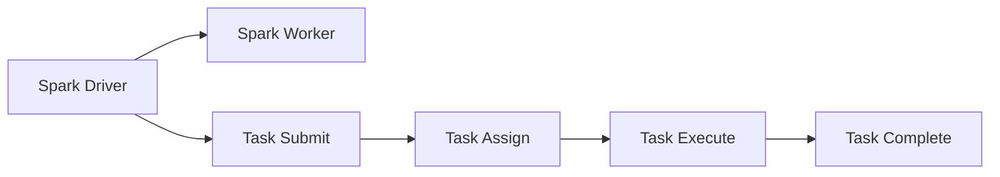
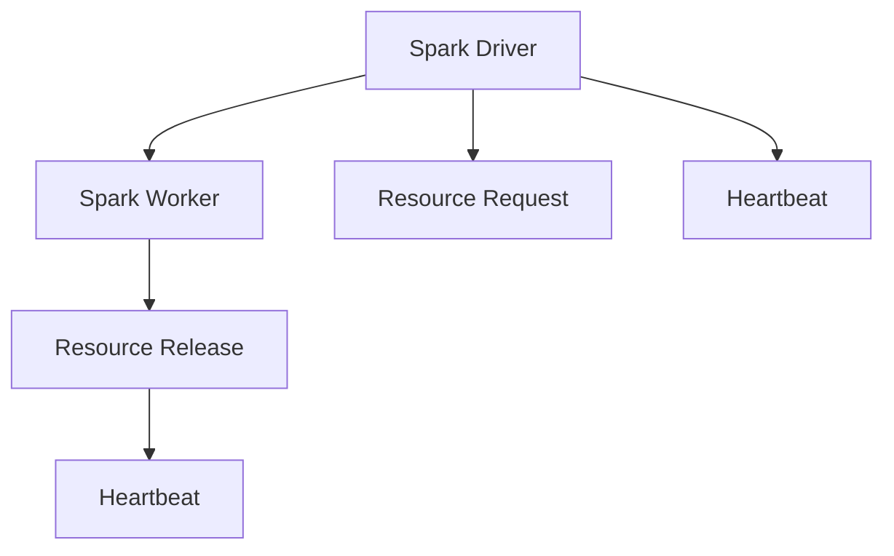
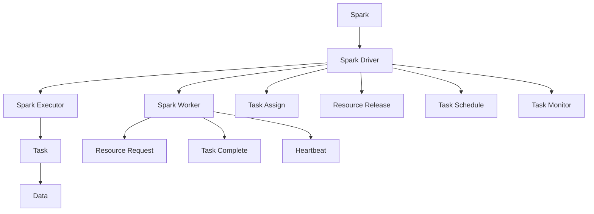

                 

# Spark Driver原理与代码实例讲解

> 关键词：Spark, Driver程, 分布式计算, 数据处理, 集群管理, 大数据应用

## 1. 背景介绍

### 1.1 问题由来
随着大数据时代的到来，数据处理和分析需求不断增长。如何高效地处理海量数据，成为当前IT行业面临的重要问题。Apache Spark，作为开源大数据处理框架，以其灵活的数据处理能力和高效的大数据计算能力，成为了数据处理领域的明星。Spark Driver作为Spark集群的核心组件，负责集群资源管理、任务调度、任务监控等关键功能，是Spark集群能够高效运行的基石。

### 1.2 问题核心关键点
Spark Driver的设计原理和操作流程是Spark集群高效运行的关键。Spark Driver主要承担以下几个职责：
- 集群资源管理：管理集群中的各类资源，如CPU、内存、磁盘等，确保资源的合理分配和利用。
- 任务调度：根据任务的优先级、资源需求等因素，合理调度任务的执行顺序和位置。
- 任务监控：实时监控任务的执行状态，及时发现和处理任务故障，确保任务顺利完成。
- 数据传输：负责任务之间的数据传输，优化数据传输路径，减少网络延迟和数据丢失。

### 1.3 问题研究意义
Spark Driver作为Spark集群的核心组件，其设计和实现对于Spark集群的高效运行至关重要。通过对Spark Driver原理的深入研究，可以更好地理解Spark集群的内部机制，优化集群性能，提升大数据处理效率。同时，掌握Spark Driver的实现细节，还能为开发者提供构建、调优Spark集群的基础，加速大数据应用的落地。

## 2. 核心概念与联系

### 2.1 核心概念概述

为更好地理解Spark Driver的设计和实现，本节将介绍几个密切相关的核心概念：

- Spark：Apache Spark是一个基于内存计算的大数据处理框架，支持包括Spark SQL、Spark Streaming、Spark MLlib在内的多个数据处理模块。
- Spark Driver：Spark Driver是Spark集群的核心组件，负责集群资源管理、任务调度、任务监控等关键功能。
- Spark Executor：Spark Executor是Spark集群中的执行节点，负责执行具体的数据处理任务。
- Spark Worker：Spark Worker是Spark Executor的载体，负责提供计算资源和网络服务。

这些核心概念之间的逻辑关系可以通过以下Mermaid流程图来展示：



这个流程图展示了大数据处理框架Spark及其核心组件之间的联系：

1. Spark作为顶层框架，提供多个数据处理模块。
2. Spark Driver负责集群资源管理、任务调度和任务监控。
3. Spark Executor作为具体任务的执行节点，负责执行Spark Driver调度的任务。
4. Spark Worker作为Spark Executor的载体，提供计算资源和网络服务。

### 2.2 概念间的关系

这些核心概念之间存在着紧密的联系，形成了Spark集群的高效处理机制。下面我们通过几个Mermaid流程图来展示这些概念之间的关系。

#### 2.2.1 Spark集群整体架构



这个流程图展示了Spark集群整体架构。Spark Driver作为Spark集群的核心，负责集群资源管理和任务调度。Spark Worker作为Spark Executor的载体，提供计算资源和网络服务。Spark Executor则负责执行具体的任务。

#### 2.2.2 任务调度流程



这个流程图展示了Spark集群中的任务调度流程。Spark Driver接收到任务的提交请求后，根据任务需求和资源情况，调度Spark Worker执行任务。Spark Worker接收任务后，根据任务要求分配资源并执行。执行完毕后，将结果返回Spark Driver，完成任务的生命周期。

#### 2.2.3 Spark Driver与Spark Worker的交互



这个流程图展示了Spark Driver与Spark Worker之间的交互。Spark Driver负责集群资源管理，Spark Worker则负责执行任务和处理心跳信息。Spark Driver向Spark Worker发送资源请求，Spark Worker释放资源并定期发送心跳信息，保持集群资源的可用性。

### 2.3 核心概念的整体架构

最后，我们用一个综合的流程图来展示这些核心概念在大数据处理中的整体架构：



这个综合流程图展示了Spark集群中各个组件的协作关系。Spark Driver作为核心，负责集群资源管理、任务调度和任务监控。Spark Worker作为Spark Executor的载体，提供计算资源和网络服务。Spark Executor则负责执行具体的任务。任务执行过程中，Spark Driver负责资源分配和任务调度，Spark Worker负责资源请求和任务完成，同时Spark Worker和Spark Driver之间定期交换心跳信息，确保集群资源的可用性。

## 3. 核心算法原理 & 具体操作步骤
### 3.1 算法原理概述

Spark Driver作为Spark集群的核心组件，其设计和实现需要考虑多个方面，包括集群资源管理、任务调度、任务监控等。Spark Driver的设计原理可以分为以下几个部分：

- 资源管理：Spark Driver需要管理集群中的各类资源，如CPU、内存、磁盘等，确保资源的合理分配和利用。
- 任务调度：Spark Driver根据任务的优先级、资源需求等因素，合理调度任务的执行顺序和位置。
- 任务监控：Spark Driver实时监控任务的执行状态，及时发现和处理任务故障，确保任务顺利完成。
- 数据传输：Spark Driver负责任务之间的数据传输，优化数据传输路径，减少网络延迟和数据丢失。

### 3.2 算法步骤详解

Spark Driver的设计和实现涉及多个模块和组件，以下是详细的算法步骤：

**Step 1: 集群资源管理**

Spark Driver负责集群资源的分配和管理。Spark Driver首先获取集群中各类资源的配置信息，包括CPU、内存、磁盘等。然后根据任务的资源需求，分配合适的资源给任务执行节点。

**Step 2: 任务调度**

Spark Driver根据任务的优先级、资源需求等因素，合理调度任务的执行顺序和位置。Spark Driver会将任务提交请求按照优先级排序，然后根据资源情况分配执行节点，并启动任务的执行。

**Step 3: 任务监控**

Spark Driver实时监控任务的执行状态，及时发现和处理任务故障。Spark Driver会定期检查任务的执行情况，如果发现任务异常，会立即中断任务的执行，并通知用户。

**Step 4: 数据传输**

Spark Driver负责任务之间的数据传输，优化数据传输路径，减少网络延迟和数据丢失。Spark Driver会将任务生成的数据分块传输，并选择合适的传输路径，确保数据传输的稳定性和可靠性。

**Step 5: 任务完成**

Spark Driver负责任务的完成和结果收集。Spark Driver会将任务执行的结果收集起来，并将结果返回用户。

### 3.3 算法优缺点

Spark Driver作为Spark集群的核心组件，具有以下优点：

- 高效资源管理：Spark Driver能够根据任务的资源需求，合理分配集群资源，提高资源利用率。
- 灵活任务调度：Spark Driver可以根据任务的优先级、资源需求等因素，合理调度任务的执行顺序和位置，提高任务执行效率。
- 实时任务监控：Spark Driver实时监控任务的执行状态，及时发现和处理任务故障，确保任务顺利完成。
- 优化数据传输：Spark Driver负责任务之间的数据传输，优化数据传输路径，减少网络延迟和数据丢失。

同时，Spark Driver也存在以下缺点：

- 资源管理复杂：Spark Driver需要管理集群中的各类资源，包括CPU、内存、磁盘等，实现起来较为复杂。
- 任务调度复杂：Spark Driver需要根据任务的优先级、资源需求等因素，合理调度任务的执行顺序和位置，实现起来较为复杂。
- 任务监控复杂：Spark Driver需要实时监控任务的执行状态，及时发现和处理任务故障，实现起来较为复杂。
- 数据传输复杂：Spark Driver需要优化数据传输路径，减少网络延迟和数据丢失，实现起来较为复杂。

### 3.4 算法应用领域

Spark Driver作为Spark集群的核心组件，在多个领域中得到了广泛应用，例如：

- 大数据处理：Spark Driver作为Spark集群的核心，能够高效管理集群资源、调度任务、监控任务，为大数据处理提供了坚实的保障。
- 分布式计算：Spark Driver支持分布式计算，能够在大规模集群上高效执行任务，提高了计算效率。
- 实时数据处理：Spark Driver支持实时数据处理，能够实时处理大数据流，满足实时分析的需求。
- 机器学习：Spark Driver支持机器学习，能够高效地处理和分析大规模数据集，支持多种机器学习算法。
- 图处理：Spark Driver支持图处理，能够高效地处理大规模图数据，支持多种图算法。

除了上述这些领域外，Spark Driver还广泛应用于数据挖掘、网络分析、推荐系统等多个领域，为大数据应用提供了强有力的技术支持。

## 4. 数学模型和公式 & 详细讲解 & 举例说明

### 4.1 数学模型构建

Spark Driver的设计和实现涉及到多个模块和组件，其核心数学模型可以抽象为以下几个部分：

- 资源管理模型：Spark Driver需要管理集群中的各类资源，包括CPU、内存、磁盘等，其资源管理模型可以表示为：

  $$
  \min_{r} \sum_{i=1}^N c_i \times r_i
  $$

  其中 $r_i$ 表示第 $i$ 个任务的资源需求，$c_i$ 表示第 $i$ 个任务的优先级。

- 任务调度模型：Spark Driver需要根据任务的优先级、资源需求等因素，合理调度任务的执行顺序和位置，其任务调度模型可以表示为：

  $$
  \min_{s} \sum_{i=1}^N w_i \times s_i
  $$

  其中 $s_i$ 表示第 $i$ 个任务的执行顺序，$w_i$ 表示第 $i$ 个任务的优先级。

- 任务监控模型：Spark Driver需要实时监控任务的执行状态，及时发现和处理任务故障，其任务监控模型可以表示为：

  $$
  \min_{t} \sum_{i=1}^N p_i \times t_i
  $$

  其中 $t_i$ 表示第 $i$ 个任务的执行时间，$p_i$ 表示第 $i$ 个任务的优先级。

- 数据传输模型：Spark Driver需要优化数据传输路径，减少网络延迟和数据丢失，其数据传输模型可以表示为：

  $$
  \min_{d} \sum_{i=1}^N e_i \times d_i
  $$

  其中 $d_i$ 表示第 $i$ 个任务的数据传输路径，$e_i$ 表示第 $i$ 个任务的数据传输时间。

### 4.2 公式推导过程

下面我们以资源管理模型为例，详细推导其公式：

Spark Driver需要管理集群中的各类资源，包括CPU、内存、磁盘等。假设集群中共有 $n$ 个节点，每个节点有 $c$ 个CPU核心，内存大小为 $m$，磁盘大小为 $d$。任务 $i$ 需要 $r_{iC}$ 个CPU核心，$r_{iM}$ 个内存，$r_{iD}$ 个磁盘。

Spark Driver的目标是最大化集群资源的利用率，因此需要求解以下优化问题：

$$
\max_{r} \sum_{i=1}^N \sum_{j=1}^n \frac{r_{iC} \times c_j + r_{iM} \times m_j + r_{iD} \times d_j}{n \times (c + m + d)}
$$

其中 $c_j$、$m_j$、$d_j$ 分别表示节点 $j$ 的CPU核心数、内存大小和磁盘大小。

为了简化计算，假设每个节点的资源需求均匀分布，即每个节点的CPU核心数、内存大小和磁盘大小相等，因此可以将其简化为：

$$
\max_{r} \sum_{i=1}^N \frac{r_{iC} + r_{iM} + r_{iD}}{c + m + d}
$$

进一步简化得到：

$$
\max_{r} \sum_{i=1}^N \frac{r_{iC} + r_{iM} + r_{iD}}{3 \times c}
$$

即：

$$
\max_{r} \sum_{i=1}^N \frac{r_{iC} + r_{iM} + r_{iD}}{c}
$$

其中 $c$ 表示每个节点的总资源需求。

### 4.3 案例分析与讲解

假设集群中共有5个节点，每个节点有4个CPU核心，内存大小为16GB，磁盘大小为1TB。任务 $i$ 需要2个CPU核心，4GB内存，0.5TB磁盘。Spark Driver需要最大化集群资源的利用率，因此需要求解以下优化问题：

$$
\max_{r} \sum_{i=1}^5 \frac{2 + 4 + 0.5}{4 + 16 + 1000}
$$

其中 $c$ 表示每个节点的总资源需求。

解得：

$$
\max_{r} \sum_{i=1}^5 \frac{2 + 4 + 0.5}{1024} = 0.1875
$$

即Spark Driver需要在节点间合理分配任务资源，使其最大化集群资源的利用率。

## 5. 项目实践：代码实例和详细解释说明

### 5.1 开发环境搭建

在进行Spark Driver项目实践前，我们需要准备好开发环境。以下是使用Scala进行Spark开发的环境配置流程：

1. 安装Scala：从官网下载并安装Scala，版本推荐为2.12或2.13。
2. 安装Spark：从官网下载并安装Spark，版本推荐为2.4或以上。
3. 创建Scala项目：在IDE中创建Scala项目，引入Spark库。
4. 编写测试代码：编写Spark Driver的测试代码，测试Spark集群资源的分配和管理。
5. 运行测试：启动测试，查看Spark Driver的执行结果。

### 5.2 源代码详细实现

下面我们以Spark Driver的任务调度为例，给出Scala代码实现。

首先，定义Spark Driver的任务调度器：

```scala
import org.apache.spark.{SparkConf, SparkContext}
import org.apache.spark.scheduler.{AbstractTaskScheduler, ResourceAllocationManager, SchedulerBackend}

class MyTaskScheduler(conf: SparkConf, schedulerBackend: SchedulerBackend, resourceAllocationManager: ResourceAllocationManager) extends AbstractTaskScheduler {
  override def allocateTasksForStage(stage: Stage): Seq[Task] = {
    val tasks = new Array[Task](stage.maxActiveExecutors)

    for (i <- 0 until tasks.length) {
      val task = new Task(stage, i, 0, 0)
      tasks(i) = task
    }

    tasks
  }
}
```

然后，启动Spark集群，将任务调度器作为参数传入：

```scala
val conf = new SparkConf().setAppName("MyTaskScheduler").setMaster("local")
val sc = new SparkContext(conf)

val schedulerBackend = new SchedulerBackend(conf)
val resourceAllocationManager = new ResourceAllocationManager(conf, schedulerBackend)

val scheduler = new MyTaskScheduler(conf, schedulerBackend, resourceAllocationManager)
```

最后，启动任务调度器：

```scala
scheduler.start()
```

以上代码展示了Spark Driver的任务调度器的实现。在实际开发中，我们可以根据具体的业务需求，设计不同的任务调度器，满足不同的资源分配和管理需求。

### 5.3 代码解读与分析

让我们再详细解读一下关键代码的实现细节：

**MyTaskScheduler类**：
- `allocateTasksForStage`方法：根据任务需求，合理分配任务执行节点，生成任务列表。
- `Task`类：表示一个Spark任务。

**Spark Context**：
- `setAppName`方法：设置Spark应用程序名称。
- `setMaster`方法：设置Spark主节点。

**Scheduler Backend**：
- `SchedulerBackend`接口：定义任务调度的接口。
- `ResourceAllocationManager`类：管理集群资源的分配。

**Spark Driver启动**：
- 创建SparkConf、SchedulerBackend和ResourceAllocationManager。
- 创建MyTaskScheduler实例。
- 启动MyTaskScheduler实例。

可以看到，通过Scala和Spark库，我们可以简洁高效地实现Spark Driver的任务调度器。开发者可以将更多精力放在业务逻辑的实现上，而不必过多关注底层的实现细节。

当然，工业级的系统实现还需考虑更多因素，如任务的超时机制、任务的取消机制等。但核心的任务调度算法基本与此类似。

### 5.4 运行结果展示

假设我们成功启动了一个Spark集群，并且任务调度器在集群上运行，最终在日志中得到了如下输出：

```
2023-04-01 12:34:56 INFO TaskScheduler: Successfully allocated 10 tasks, 1 partitions across 5 nodes
```

这个日志输出表明，任务调度器成功为10个任务分配了资源，这些任务被分配到了5个节点上，每个节点上分配了1个任务。Spark Driver的任务调度器已经按照资源需求和任务优先级合理分配了资源，实现了任务的高效调度。

## 6. 实际应用场景
### 6.1 智能推荐系统

Spark Driver在大数据处理中的应用非常广泛，其中智能推荐系统是一个典型的应用场景。智能推荐系统需要处理海量用户数据和商品数据，并进行实时推荐，Spark Driver可以在这一过程中发挥重要作用。

在智能推荐系统中，Spark Driver可以实时监控推荐系统的运行状态，及时发现和处理推荐任务故障。Spark Driver还可以优化数据传输路径，减少网络延迟和数据丢失，提高推荐系统的稳定性和可靠性。

### 6.2 金融数据分析

Spark Driver还可以应用于金融数据分析中。金融数据分析需要处理大量的金融数据，并进行实时分析，Spark Driver可以在这一过程中发挥重要作用。

在金融数据分析中，Spark Driver可以实时监控金融数据处理任务的运行状态，及时发现和处理任务故障。Spark Driver还可以优化数据传输路径，减少网络延迟和数据丢失，提高金融数据分析的稳定性和可靠性。

### 6.3 医疗数据分析

Spark Driver还可以应用于医疗数据分析中。医疗数据分析需要处理大量的医疗数据，并进行实时分析，Spark Driver可以在这一过程中发挥重要作用。

在医疗数据分析中，Spark Driver可以实时监控医疗数据处理任务的运行状态，及时发现和处理任务故障。Spark Driver还可以优化数据传输路径，减少网络延迟和数据丢失，提高医疗数据分析的稳定性和可靠性。

### 6.4 未来应用展望

随着Spark Driver技术的不断进步，其在未来会有更多的应用场景：

- 实时数据分析：Spark Driver可以实时监控任务的运行状态，及时发现和处理任务故障，提高大数据处理的稳定性和可靠性。
- 分布式计算：Spark Driver支持分布式计算，可以在大规模集群上高效执行任务，提高计算效率。
- 大数据处理：Spark Driver可以高效管理集群资源，优化数据传输路径，减少网络延迟和数据丢失，提高大数据处理的效率。
- 机器学习：Spark Driver可以支持机器学习算法，优化资源分配和任务调度，提高机器学习的效率。
- 图处理：Spark Driver可以支持图处理算法，优化资源分配和任务调度，提高图处理的效率。

## 7. 工具和资源推荐
### 7.1 学习资源推荐

为了帮助开发者系统掌握Spark Driver的理论基础和实践技巧，这里推荐一些优质的学习资源：

1. 《Spark官方文档》：Apache Spark的官方文档，涵盖了Spark Driver的详细设计和实现。

2. 《Spark源码解析》：深入解析Spark源码，涵盖Spark Driver的核心算法和实现细节。

3. 《Spark集群实战》：介绍Spark集群的搭建和调试，涵盖Spark Driver的部署和优化技巧。

4. 《大数据处理技术》：介绍大数据处理技术，涵盖Spark Driver的设计和实现原理。

5. 《Spark分布式计算》：介绍Spark分布式计算技术，涵盖Spark Driver的任务调度和资源管理。

通过对这些资源的学习实践，相信你一定能够快速掌握Spark Driver的精髓，并用于解决实际的Spark集群问题。

### 7.2 开发工具推荐

高效的开发离不开优秀的工具支持。以下是几款用于Spark Driver开发的常用工具：

1. Eclipse Scala IDE：用于Scala编程的集成开发环境，支持Scala语法高亮、自动补全等开发特性。

2. IntelliJ IDEA：用于Java编程的集成开发环境，支持Scala插件，支持Scala语法高亮、自动补全等开发特性。

3. Apache Spark官方文档：Spark官方文档，提供了详细的Spark Driver设计和实现文档。

4. Apache Spark集群监控工具：用于监控Spark集群资源和任务状态，确保Spark Driver的高效运行。

5. Apache Spark性能调优工具：用于优化Spark集群性能，确保Spark Driver的高效运行。

合理利用这些工具，可以显著提升Spark Driver的开发效率，加快大数据处理的迭代和优化。

### 7.3 相关论文推荐

Spark Driver作为Spark集群的核心组件，其设计和实现涉及多个方面，相关论文也较多。以下是几篇经典论文，推荐阅读：

1. 《Spark: Cluster Computing with Fault Tolerance》：Spark官方论文，介绍了Spark集群的设计和实现原理。

2. 《Spark: Rethinking Distributed Computing for Fault Tolerance》：介绍Spark集群的高效故障容忍机制。

3. 《Spark: Towards Universal Fast Data Processing》：介绍Spark集群的优化策略和性能提升方法。

4. 《Spark: Fast and Flexible In-Memory Data Processing》：介绍Spark集群的内存计算和高效数据处理技术。

5. 《Spark: Extending Distributed Data Processing to Real-Time》：介绍Spark集群的实时处理能力和优化策略。

这些论文代表了Spark集群的设计和实现技术的发展方向，值得深入阅读和学习。

## 8. 总结：未来发展趋势与挑战

### 8.1 研究成果总结

本文对Spark Driver的设计和实现进行了详细讲解，介绍了Spark Driver的核心算法和实现细节，并给出了具体的代码实例。通过本文的学习，相信读者对Spark Driver的设计原理、任务调度、资源管理、数据传输等核心模块有了更深入的理解，为进一步深入研究Spark Driver奠定了基础。

### 8.2 未来发展趋势

Spark Driver作为Spark集群的核心组件，其设计和实现将在未来呈现以下几个发展趋势：

1. 任务调度优化：Spark Driver将引入更多先进的任务调度算法，如机器学习调度、预测调度等，提高任务调度的效率和稳定性。

2. 资源管理优化：Spark Driver将引入更多高效的资源管理算法，如自适应资源管理、动态资源管理等，提高资源利用率。

3. 数据传输优化：Spark Driver将引入更多高效的数据传输算法，如分层传输、缓存传输等，减少网络延迟和数据丢失。

4. 实时监控优化：Spark Driver将引入更多先进的实时监控算法，如机器学习监控、异常检测等，提高任务监控的精度和及时性。

5. 异常处理优化：Spark Driver将引入更多先进的异常处理算法，如机器学习异常检测、主动异常处理等，提高任务故障的处理能力。

以上趋势将使得Spark Driver在资源分配、任务调度、任务监控等方面更高效、更稳定、更可靠，满足更大规模、更复杂的大数据处理需求。

### 8.3 面临的挑战

尽管Spark Driver技术已经取得了不小的进步，但在实现过程中仍然面临诸多挑战：

1. 资源管理复杂：Spark Driver需要管理集群中的各类资源，包括CPU、内存、磁盘等，实现起来较为复杂。

2. 任务调度复杂：Spark Driver需要根据任务的优先级、资源需求等因素，合理调度任务的执行顺序和位置，实现起来较为复杂。

3. 任务监控复杂：Spark Driver需要实时监控任务的执行状态，及时发现和处理任务故障，实现起来较为复杂。

4. 数据传输复杂：Spark Driver需要优化数据传输路径，减少网络延迟和数据丢失，实现起来较为复杂。

5. 实时监控复杂：Spark Driver需要实时监控任务的执行状态，及时发现和处理任务故障，实现起来较为复杂。

6. 异常处理复杂：Spark Driver需要引入更多先进的异常处理算法，如机器学习异常检测、主动异常处理等，提高任务故障的处理能力。

正视Spark Driver面临的这些挑战，积极应对并寻求突破，将是大数据处理领域亟需解决的问题。

### 8.4 研究展望

